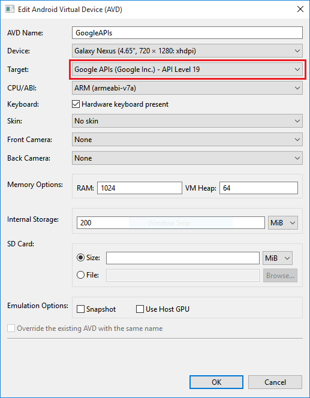

<properties
    pageTitle="Hinzufügen von Pushbenachrichtigungen zu Ihrer Anwendung Xamarin.Android | Azure App-Verwaltungsdienst"
    description="Informationen Sie zum Verwenden von Azure-App-Dienst und Azure Benachrichtigung Hubs Pushbenachrichtigungen zu Ihrer Anwendung Xamarin.Android senden"
    services="app-service\mobile"
    documentationCenter="xamarin"
    authors="ysxu"
    manager="erikre"
    editor=""/>

<tags
    ms.service="app-service-mobile"
    ms.workload="mobile"
    ms.tgt_pltfrm="mobile-xamarin-android"
    ms.devlang="dotnet"
    ms.topic="article"
    ms.date="10/12/2016"
    ms.author="yuaxu"/>

# Hinzufügen von Pushbenachrichtigungen zu Ihrer Anwendung Xamarin.Android

[AZURE.INCLUDE [app-service-mobile-selector-get-started-push](../../includes/app-service-mobile-selector-get-started-push.md)]

##(Übersicht)

In diesem Lernprogramm fügen Sie Pushbenachrichtigungen des Projekts [Xamarin.Android schnell zu starten](app-service-mobile-windows-store-dotnet-get-started.md) , damit eine Pushbenachrichtigung an das Gerät gesendet werden, jedes Mal, wenn ein Datensatz eingefügt wird.

Wenn Sie die heruntergeladene Schnellstart Server Project nicht verwenden, benötigen Sie das Pushbenachrichtigungen Benachrichtigung Erweiterungspaket. Weitere Informationen finden Sie unter [Arbeiten mit der Back-End-Server SDK für Mobile-Apps Azure](app-service-mobile-dotnet-backend-how-to-use-server-sdk.md) .

##Erforderliche Komponenten

In diesem Lernprogramm benötigen Sie Folgendes:

+ Aktive Gmail-Konto. Sie können für eine Gmail-Konto bei [accounts.google.com](http://go.microsoft.com/fwlink/p/?LinkId=268302)registrieren.
+ [Google Cloud Messaging Client-Komponente](http://components.xamarin.com/view/GCMClient/).

##Konfigurieren eines Benachrichtigung Hubs

[AZURE.INCLUDE [app-service-mobile-configure-notification-hub](../../includes/app-service-mobile-configure-notification-hub.md)]

##Aktivieren Sie Firebase Cloud Messaging

[AZURE.INCLUDE [notification-hubs-enable-firebase-cloud-messaging](../../includes/notification-hubs-enable-firebase-cloud-messaging.md)]

##Konfigurieren Sie senden von Pushbenachrichtigungen Anfragen Azure

[AZURE.INCLUDE [app-service-mobile-android-configure-push](../../includes/app-service-mobile-android-configure-push-for-firebase.md)]

##Aktualisieren der Project Server um Pushbenachrichtigungen zu senden.

[AZURE.INCLUDE [app-service-mobile-update-server-project-for-push-template](../../includes/app-service-mobile-update-server-project-for-push-template.md)]

##Konfigurieren Sie das Clientprojekt für Pushbenachrichtigungen

[AZURE.INCLUDE [mobile-services-xamarin-android-push-configure-project](../../includes/mobile-services-xamarin-android-push-configure-project.md)]

##Hinzufügen von Pushbenachrichtigungen Benachrichtigungen Code zu Ihrer Anwendung

[AZURE.INCLUDE [app-service-mobile-xamarin-android-push-add-to-app](../../includes/app-service-mobile-xamarin-android-push-add-to-app.md)]

## Testen von Pushbenachrichtigungen in Ihrer app

Sie können die app mit einem virtuellen Gerät im Emulator testen. Es gibt zusätzliche Konfigurationsschritte erforderlich sind, wenn auf einem Emulator ausgeführt.

1. Stellen Sie sicher, dass Sie zum Bereitstellen oder auf virtuellen Geräten, die das Ziel festgelegte Google-APIs enthält Debuggen, wie unten dargestellt, in der Android virtuelle Gerät (AVD)-Manager.

    

2. Gmail-Konto auf dem Android-Gerät hinzufügen, indem Sie auf **Apps** > **Einstellungen** > **Konto hinzufügen**, folgen Sie den Anweisungen.

    

3. Führen Sie die Aufgabenliste app als vor, und fügen Sie ein neues Element der erledigen. Diesmal, wird ein Benachrichtigungssymbol im Infobereich angezeigt. Öffnen Sie die Benachrichtigung Einzug, um den vollständigen Text der Benachrichtigung anzuzeigen.

    

<!-- URLs. -->
[Xamarin.Android quick start]: app-service-mobile-xamarin-android-get-started.md
[Google Cloud Messaging Client Component]: http://components.xamarin.com/view/GCMClient/
[Azure Mobile Services Component]: http://components.xamarin.com/view/azure-mobile-services/
