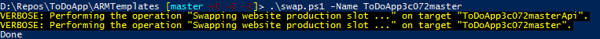
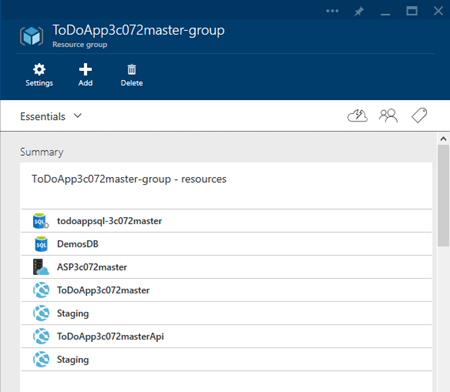

<properties
    pageTitle="Agiles Software-Entwicklung mit Azure-App-Verwaltungsdienst"
    description="Erfahren Sie, wie hochgradig skalierbar komplexe Applikationen mit Azure-App-Verwaltungsdienst auf eine Weise zu erstellen, die agilen Softwareentwicklung unterstützt."
    services="app-service"
    documentationCenter=""
    authors="cephalin"
    manager="wpickett"
    editor=""/>

<tags
    ms.service="app-service"
    ms.workload="na"
    ms.tgt_pltfrm="na"
    ms.devlang="na"
    ms.topic="article"
    ms.date="07/01/2016"
    ms.author="cephalin"/>

# Agiles Software-Entwicklung mit Azure-App-Verwaltungsdienst #

In diesem Lernprogramm erfahren Sie, wie hochgradig skalierbar komplexe Applikationen mit [Azure-App-Verwaltungsdienst](/services/app-service/) auf eine Weise zu erstellen, die [agilen Softwareentwicklung](https://en.wikipedia.org/wiki/Agile_software_development)unterstützt. Es wird davon ausgegangen, dass Sie bereits wissen, wie [komplexe Applikationen vorhersehbar in Azure bereitgestellt](app-service-deploy-complex-application-predictably.md).

Einschränkungen für technische Prozesse können beim erfolgreichen Implementierung von agilen Methoden häufig verwendet werden. Azure App-Verwaltungsdienst mit Features wie [fortlaufender Veröffentlichung](app-service-continuous-deployment.md), [staging-Umgebungen](web-sites-staged-publishing.md) (Steckplätze) und [für die Überwachung](web-sites-monitor.md), wenn sorgfältig es mit der Orchestrierung und Verwaltung der Bereitstellung [Azure Ressourcenmanager](../azure-resource-manager/resource-group-overview.md)können eine großartige Lösung für Entwickler gehören, die zweifache agiles Software Development.

In der folgenden Tabelle ist eine kurze Liste mit Anforderungen agilen Entwicklung und wie Azure ermöglicht jede hiervon services zugeordnet.

| Anforderung | Wie Azure ermöglicht |
|---------------------------------------------------------------|--------------------------------------------------------------------------------------------------------------------------------------------------------------------------------------------------------------------------|
| -Mit jeder Commit erstellen -Automatisch erstellen und schnell | Wenn mit fortlaufender Bereitstellung konfiguriert ist, kann Azure-App-Verwaltungsdienst als live Ausführung Builds ausgehend von einem Entwickler Zweig fungieren. Jedem Code in den Zweig abgelegt wird, wird es automatisch erstellt und Einstieg in Azure live.|
| -Stellen erstellt Self testen | Laden Sie überprüft, Webtests usw., mit der Vorlage Ressourcenmanager Azure bereitgestellt werden kann.|
| -Führen Sie die Tests in einer datenbeschriftungsreihe der Herstellung-Umgebung | Azure Ressourcenmanager Vorlagen können verwendet werden, um Klonen der Herstellung Azure-Umgebung (einschließlich der Einstellungen für die app, Verbindung Zeichenfolge Vorlagen, dieselbe Skalierung usw.) zum Testen schnell und vorhersehbar zu erstellen.|
| -Ergebnis der neuesten Stand einfach anzeigen | Fortlaufender Bereitstellung in Azure aus einem Repository bedeutet, dass sofort, nachdem Sie Ihre Änderungen übernehmen, können Sie neuen Code in einer live-Anwendung testen. |
| -Commit in die main-Verzweigung jeden Tag -Automatisieren von Bereitstellung | Fortlaufender Integration einer Herstellung-Anwendung mit einem Hauptfenster Zweig wird jeder Commit/Zusammenführen automatisch in die main-Verzweigung zu Herstellung bereitgestellt. |

[AZURE.INCLUDE [app-service-web-to-api-and-mobile](../../includes/app-service-web-to-api-and-mobile.md)]

## Vorgehensweise ##

Sie werden Entwickler-Test-Phase-Herstellung Workflow normalerweise durchzuführen, um neuen Änderungen an die [ToDoApp](https://github.com/azure-appservice-samples/ToDoApp) Beispiel-Anwendung veröffentlichen besteht aus zwei [Web apps](/services/app-service/web/)einer Front-End-(Star e) und anderen wird ein Web-API Back-End (werden), und eine [SQL-Datenbank](/services/sql-database/). Sie werden mit der Bereitstellungsarchitektur abgebildet arbeiten:

Um das Bild in den Wörter versetzen:

-   Die Bereitstellungsarchitektur ist in drei unterschiedliche Umgebungen (oder [Ressourcengruppen](../azure-resource-manager/resource-group-overview.md) in Azure) mit einem eigenen [App-Serviceplan](../app-service/azure-web-sites-web-hosting-plans-in-depth-overview.md), [dieselbe Skalierung](web-sites-scale.md) Einstellungen und SQL-Datenbank getrennt sind. 
-   Jede Umgebung kann separat verwaltet werden. Sie können auch in anderen Abonnements vorhanden sind.
-   Staging und Herstellung werden als zwei Felder dieselbe App Dienst app implementiert. Der master Zweig ist für fortlaufende Integration mit den staging Slot einrichten.
-   Wenn ein Commit in master Zweig auf den staging Slot (mit Herstellung Daten) überprüft wurde, wird die überprüfte staging-app in der Herstellung Slot [ohne Ausfallzeiten](web-sites-staged-publishing.md)ausgetauscht.

Die Herstellung und Staging-Umgebung wird durch die Vorlage am definiert [ * &lt;Repository_root >*/ARMTemplates/ProdandStage.json](https://github.com/azure-appservice-samples/ToDoApp/blob/master/ARMTemplates/ProdAndStage.json).

Die Entwicklung und Test-Umgebungen werden durch die Vorlage am definiert [ * &lt;Repository_root >*/ARMTemplates/Dev.json](https://github.com/azure-appservice-samples/ToDoApp/blob/master/ARMTemplates/Dev.json).

Sie verwenden die Verzweigungslogik dazu auch mit Code verschieben aus dem Zweig Entwickler auf die Test-Verzweigung, klicken Sie dann auf den Folienmaster Zweig (durch Verschieben nach oben in der Qualität Mal so zu sagen).

 

## Sie benötigen ##

-   Ein Azure-Konto
-   Ein [GitHub](https://github.com/) -Konto
-   Git Shell (installiert mit [GitHub für Windows](https://windows.github.com/)) – Dies können Sie sowohl die Git und PowerShell-Befehle in der gleichen Sitzung ausführen 
-   Neueste [Azure PowerShell](https://github.com/Azure/azure-powershell/releases/download/0.9.4-June2015/azure-powershell.0.9.4.msi) bits
-   Grundlegende Kenntnisse Folgendes:
    -   [Ressourcenmanager Azure](../azure-resource-manager/resource-group-overview.md) Vorlage Bereitstellung (auch finden Sie unter [Bereitstellen einer komplexen Anwendung vorhersehbar in Azure](app-service-deploy-complex-application-predictably.md))
    -   [Git](http://git-scm.com/documentation)
    -   [PowerShell](https://technet.microsoft.com/library/bb978526.aspx)

> [AZURE.NOTE] Benötigen Sie ein Azure-Konto zum Bearbeiten dieses Lernprogramms:
> + Sie können [ein Azure-Konto kostenlos öffnen](/pricing/free-trial/) – Sie erhalten Gutschriften können Sie kostenpflichtiges Azure Services ausprobieren und auch nachdem sie es von gewohnt sind können Sie das Konto behalten und Verwendung frei Azure Dienste, wie z. B. Web Apps.
> + Können Sie die [Vorteile für Visual Studio Abonnenten aktivieren](/pricing/member-offers/msdn-benefits-details/) : Ihr Visual Studio-Abonnement bietet Ihnen Gutschriften jeden Monat, die Sie für kostenpflichtiges Azure-Dienste verwenden können.
>
> Wenn Sie mit Azure-App-Verwaltungsdienst Schritte vor dem für ein Azure-Konto anmelden möchten, wechseln Sie zu [App-Verwaltungsdienst versuchen](http://go.microsoft.com/fwlink/?LinkId=523751), in dem Sie eine kurzlebige Starter Web app sofort im App-Dienst erstellen können. Keine Kreditkarten erforderlich; keine Zusagen.

## Richten Sie Ihrer Umgebung Herstellung ein ##

>[AZURE.NOTE] Das Skript in diesem Lernprogramm verwendeten konfiguriert automatisch fortlaufender Veröffentlichung aus Ihrer GitHub Repository. Dies ist erforderlich, dass Ihre Anmeldeinformationen GitHub sind bereits in Azure gespeichert ist, andernfalls die Bereitstellung per Batchdatei schlägt fehl, wenn Sie versuchen, Konfigurieren von Einstellungen für Quelle Steuerelemente für Web apps. 
>
>Erstellen Sie eine Web app zum Speichern Ihrer Anmeldeinformationen GitHub in Azure [Azure-Portal](https://portal.azure.com/) und [GitHub Bereitstellung konfigurieren](app-service-continuous-deployment.md). Sie müssen nur einmal erforderlich. 

In einer DevOps Situation stehen Ihnen eine Anwendung, die in Azure live ausgeführt wird und Änderungen daran durch fortlaufender Veröffentlichung vornehmen möchten. In diesem Szenario müssen Sie eine Vorlage, die Sie entwickelt, getestet und zum Bereitstellen dieser Umgebung verwendet. Dem werden in diesem Abschnitt einrichten.

1.  Erstellen Sie eigener Verzweigung des Repositorys [ToDoApp](https://github.com/azure-appservice-samples/ToDoApp) . Informationen zum Erstellen der Verzweigung finden Sie unter [Verzweigung einer Repo](https://help.github.com/articles/fork-a-repo/). Nachdem Ihre Verzweigung erstellt wurde, können Sie in Ihrem Browser angezeigt.
 
    

2.  Öffnen Sie eine Git Shell-Sitzung ein. Wenn Sie noch nicht über Git Shell verfügen, installieren Sie jetzt [GitHub für Windows](https://windows.github.com/) .

3.  Erstellen Sie eine lokale datenbeschriftungsreihe von Ihrem Verzweigung durch den folgenden Befehl ausführen:

        git clone https://github.com/<your_fork>/ToDoApp.git 

4.  Nachdem Sie Ihre lokale datenbeschriftungsreihe haben, navigieren Sie zu * &lt;Repository_root >*\ARMTemplates, und führen Sie die deploy.ps1 Skripts wie folgt:

        .\deploy.ps1 –RepoUrl https://github.com/<your_fork>/todoapp.git

4.  Wenn Sie dazu aufgefordert werden, geben Sie in den gewünschten Benutzernamen und das Kennwort für den Zugriff auf.

    Sie sollten provisioning Fortschritt der verschiedenen Azure Ressourcen angezeigt. Wenn die Bereitstellung abgeschlossen ist, wird das Skript starten Sie die Anwendung im Browser und bieten Ihnen einen Signalton geeignet.

    
 
    >[AZURE.TIP] Schauen Sie sich * &lt;Repository_root >*\ARMTemplates\Deploy.ps1, um anzuzeigen, wie Ressourcen mit eindeutigen IDs generiert. Die gleiche Weise können Sie um Klonen der gleichen Bereitstellung ohne Konflikt Ressourcennamen kümmern zu erstellen.
 
6.  Wieder in der Git Shell-Sitzung ausführen:

        .\swap –Name ToDoApp<unique_string>master

    

7.  Wenn das Skript abgeschlossen ist, kehren Sie zum Navigieren Sie zu der Front-End-Adresse (http://ToDoApp*&lt;Unique_string >*master.azurewebsites.net/) in der Herstellung Ausführung die Anwendung angezeigt.
 
5.  Melden Sie sich bei der [Azure-Portal](https://portal.azure.com/) , und schauen Sie sich, was erstellt wird.

    Sie sollten möglicherweise in derselben Ressourcengruppe, mit zwei Web-apps finden Sie unter der `Api` Suffix im Namen. Wenn Sie sich die Gruppe Ressourcenansicht anschauen, sehen Sie auch die SQL-Datenbank und Server, der App-Serviceplan und den staging Steckplätzen für den Web apps. Durchsuchen Sie die verschiedenen Ressourcen und vergleichen Sie diese mit * &lt;Repository_root >*\ARMTemplates\ProdAndStage.json sehen, wie sie in der Vorlage konfiguriert werden.

    

Jetzt haben Sie dieser Umgebung einrichten. Als Nächstes werden Sie deaktivieren ein neues Update zur Anwendung starten eines.

## Erstellen Sie Entwickler und Testen Sie Verzweigungen ##

Jetzt, da Sie eine komplexe Anwendung, die bei der Herstellung in Azure ausgeführt haben, können Sie ein Update an Ihrer Anwendung gemäß agilen Methoden vornehmen. In diesem Abschnitt erstellen die Entwicklung und Testen Verzweigungen, die Sie benötigen, um die erforderlichen Updates zu gestalten.

1.  Erstellen Sie zuerst die testumgebung. In der Git Shell-Sitzung, führen Sie die folgenden Befehle zum Erstellen der Umgebung für eine neue Verzweigung **NewUpdate**bezeichnet. 

        git checkout -b NewUpdate
        git push origin NewUpdate 
        .\deploy.ps1 -TemplateFile .\Dev.json -RepoUrl https://github.com/<your_fork>/ToDoApp.git -Branch NewUpdate

1.  Wenn Sie dazu aufgefordert werden, geben Sie in den gewünschten Benutzernamen und das Kennwort für den Zugriff auf. 

    Wenn die Bereitstellung abgeschlossen ist, wird das Skript starten Sie die Anwendung im Browser und bieten Ihnen einen Signalton geeignet. Und einfach wie das haben Sie nun einer neuen Verzweigung mit einem eigenen testumgebung. Betrachten Sie wir ein paar Punkte zu dieser testumgebung zu überprüfen:

    -   Sie können ihn in eine beliebige Azure-Abonnement erstellen. Dies bedeutet, dass dieser Umgebung aus Ihrer testumgebung separat verwaltet werden kann.
    -   Ihre testumgebung wird live in Azure ausgeführt.
    -   Ihre testumgebung ist mit dieser Umgebung, eine Ausnahme bilden jedoch die staging Steckplätze und die Skalierung identisch. Sie können dies wissen, da dies der einzige Unterschiede zwischen ProdandStage.json und Dev.json sind.
    -   Sie können Ihre testumgebung in einem eigenen App-Serviceplan mit einer anderen Preis Ebene (z. B. **Free**) verwalten.
    -   Löschen diesen testumgebung werden so einfach wie das Löschen der Ressourcengruppe. Finden Sie sich, wie Sie diese [später](#delete)durchführen.

2.  Wechseln Sie auf eine Verzweigung Entwickler erstellen durch Ausführen der folgenden Befehle:

        git checkout -b Dev
        git push origin Dev
        .\deploy.ps1 -TemplateFile .\Dev.json -RepoUrl https://github.com/<your_fork>/ToDoApp.git -Branch Dev

3.  Wenn Sie dazu aufgefordert werden, geben Sie in den gewünschten Benutzernamen und das Kennwort für den Zugriff auf. 

    Betrachten Sie wir ein paar Punkte zu dieser Entwickler-Umgebung zu überprüfen: 

    -   Ihrer Umgebung Entwickler weist eine Konfiguration identisch mit der testumgebung aus, da es mit der gleichen Vorlage bereitgestellt wird.
    -   Im des Entwicklers Azure-Abonnement, verlassen der testumgebung separat verwaltet werden kann jede Entwickler-Umgebung erstellt werden.
    -   Ihre Umgebung Entwickler wird live in Azure ausgeführt.
    -   Löschen der Umgebung Entwickler ist so einfach wie das Löschen der Ressourcengruppe. Finden Sie sich, wie Sie diese [später](#delete)durchführen.

>[AZURE.NOTE] Wenn Sie mehrere Entwickler arbeiten, klicken Sie auf das neue Update haben, kann jede von ihnen einfach einen Zweig und dedizierten Entwickler-Umgebung folgendermaßen erstellen:
>
>1. Erstellen Sie ihre eigenen Verzweigung des Repositorys in GitHub (siehe [Verzweigung einer Repo](https://help.github.com/articles/fork-a-repo/)).
>2. Die Verzweigung auf ihrem lokalen Computer klonen
>3. Führen Sie die gleichen Befehle eigene Entwickler Verzweigung und Umgebung zu erstellen.

Wenn Sie fertig sind, sollte der GitHub Verzweigung drei Verzweigungen haben:

Und Sie benötigen sechs Web apps (drei Sätze von zwei) in drei separate Ressourcengruppen:

 
>[AZURE.NOTE] Beachten Sie, dass ProdandStage.json gibt dieser Umgebung zum Verwenden der **Standard** Preise Ebene, die für Skalierbarkeit der Herstellung Anwendung geeignet ist.

## Erstellen Sie und Testen Sie jede Commit ausführen ##

Die Vorlagendateien ProdAndStage.json und Dev.json bereits die Quelle Steuerelementparameter angeben, die standardmäßig richtet fortlaufender für das Web app veröffentlichen. Daher löst jeder Commit in den GitHub Zweig eine automatische Bereitstellung aus einem Zweig in Azure. Sehen wir uns an, wie Ihr Setup jetzt funktioniert.

1.  Stellen Sie sicher, dass Sie sich in der Entwicklung Verzweigung der lokalen Repository befinden. Führen Sie hierzu den folgenden Befehl in Git Shell:

        git checkout Dev

2.  Nehmen Sie eine einfache Änderung des app Benutzeroberfläche Layer durch Ändern des Codes zum [Bootstrap](http://getbootstrap.com/components/) Listen verwenden. Open * &lt;Repository_root >*\src\MultiChannelToDo.Web\index.cshtml und die folgenden hervorgehobenen Änderung vornehmen:

    

    >[AZURE.NOTE] Wenn Sie die vorstehende Abbildung lesen können: 
    >
    >- Ändern Sie in Zeile 18 `check-list` auf `list-group`.
    >- Ändern Sie in Zeile 19 `class="check-list-item"` auf `class="list-group-item"`.

3.  Speichern Sie die Änderung an. Wieder in der Git Verwaltungsshell, führen Sie die folgenden Befehle:

        cd <repository_root>
        git add .
        git commit -m "changed to bootstrap style"
        git push origin Dev
 
    Diese Befehle Git ähneln "Einchecken von Code" in einer anderen Quelle Control System wie TFS. Beim Ausführen von `git push`, das neue Commit löst eine automatische Code Pushbenachrichtigungen zu Azure, klicken Sie dann die Anwendung entsprechend die Änderung in der Umgebung Entwickler neu erstellt.

4.  Um zu überprüfen, dass diese Code Pushbenachrichtigungen für Ihre Umgebung Entwickler aufgetreten ist, wechseln Sie zu Ihrer Entwickler-Umgebung Web app Blade, und schauen Sie sich das Webpart für die **Bereitstellung** . Sie sollten die neueste Commit Nachricht sehen.

    

5.  Hier klicken Sie auf **Durchsuchen** , um die neue Änderung in der live-Anwendung in Azure finden Sie unter.

    

    Dies ist ein ziemlich geringfügigen Änderung zur Anwendung. Viele-Zeiten neue Änderungen an einer komplexen Webanwendung aufweist, jedoch außerdem unbeabsichtigte und unerwünschte Seite Effekte. Wird jeder Commit in live verwendet einfach zu testen, können Sie diese Probleme abzufangen, bevor Sie Ihre Kunden diese angezeigt.

Nun sollten Sie mit dem Abgang vertraut sein, dass, als Entwickler im Projekt **NewUpdate** , Sie können auf einfache Weise Erstellen einer Entwickler-Umgebung für sich selbst, und klicken Sie dann jeder Commit erstellen und Testen jede erstellen.

## Zusammenführen von Code zu testumgebung ##

Wenn Sie bereit sind, Ihre Code aus Entwickler Verzweigung nach Zeitphasen bis zum NewUpdate Verzweigung abzulegen, ist der standard Git Prozess:

1.  Zusammenführen Sie alle neuen Commit zu NewUpdate in der Verzweigung Entwickler in GitHub, wie z. B. Commit anderer Entwickler. Alle neuen Commit auf GitHub wird eine Pushbenachrichtigungen Code auslösen und in der Umgebung Entwickler erstellen. Können stellen Sie sicher, dass Ihr Code in Entwickler Verzweigung weiterhin mit den neuesten Bits von NewUpdate Verzweigung funktioniert.

2.  Alle neuen Commit aus Entwickler Zweig in NewUpdate Verzweigung zu GitHub zusammenführen. Diese Aktion löst einen Code Pushbenachrichtigungen und erstellen in der testumgebung. 

Beachten Sie erneut, da fortlaufender Bereitstellung noch Setup mit diesen Git Verzweigungen ist, müssen Sie nicht ausführen anderer Aktionen wie ausgeführt Integration erstellt. Einfach standard Quelle Steuerelement Methoden verwenden Git ausgeführt werden sollen, und Azure werden alle Buildprozesse für Sie auszuführen.

Nun, wir Code in **NewUpdate** Zweig Pushbenachrichtigungen. Führen Sie in der Git-Verwaltungsshell folgende Befehle aus:

    git checkout NewUpdate
    git pull origin NewUpdate
    git merge Dev
    git push origin NewUpdate

Das war's schon! 

Wechseln Sie zu der Web app Blade für Ihre testumgebung, um Ihre neue Commit (zusammengeführt in NewUpdate Zweig) abgelegt jetzt in der testumgebung anzuzeigen. Klicken Sie dann auf **Durchsuchen** , um zu sehen, dass die Formatvorlage ändern jetzt live in Azure ausgeführt wird.

## Update für die Herstellung bereitstellen ##

Drücken Sie Code nach der Umgebung Staging und Fertigung sollte fällt nicht anders als Sie bereits getan haben, wenn Sie auf die testumgebung Code abgelegt. Es ist so einfach. 

Führen Sie in der Git-Verwaltungsshell folgende Befehle aus:

    git checkout master
    git pull origin master
    git merge NewUpdate
    git push origin master

Denken Sie daran, die basierend auf der Darstellung die Umgebung Staging und Fertigung in ProdandStage.json eingerichtet ist, neue Code wird das **Staging** Slot verschoben, und es ausgeführt wird. Wenn Sie den staging Slot URL navigieren, wird also den neuen Code es ausgeführt angezeigt. Führen Sie dazu die `Show-AzureWebsite` Cmdlet in der Git Verwaltungsshell.

    Show-AzureWebsite -Name ToDoApp<unique_string>master -Slot Staging
 
Und jetzt, nachdem Sie das Update im staging Slot überprüft haben, nur noch zum Ausführen ist es in Betrieb vertauschen. Führen Sie in der Git Verwaltungsshell einfach die folgenden Befehle:

    cd <repository_root>\ARMTemplates
    .\swap.ps1 -Name ToDoApp<unique_string>master

Herzlichen Glückwunsch! Sie haben ein neues Update erfolgreich an Ihrer Anwendung der Herstellung Web veröffentlicht. Funktionsumfang ist, die Sie gerade durch einfaches erstellen Entwickler fertig und Testen Umgebungen haben, und erstellen und Testen jede Commit ausführen. Dies sind entscheidend Bausteine für die Softwareentwicklung agiles aus.

## Löschen von Entwicklung und Enviroments testen ##

Da Sie Ihre Entwicklung und Test-Umgebungen benutzerspezifisch eigenständige Ressourcengruppen absichtlich entworfen haben, ist es sehr einfach, um sie zu löschen. Um diejenigen löschen, die Sie in diesem Lernprogramm sowohl die GitHub Verzweigungen und Azure Elemente, führen Sie einfach die folgenden Befehle in der Git Verwaltungsshell erstellt haben:

    git branch -d Dev
    git push origin :Dev
    git branch -d NewUpdate
    git push origin :NewUpdate
    Remove-AzureRmResourceGroup -Name ToDoApp<unique_string>dev-group -Force -Verbose
    Remove-AzureRmResourceGroup -Name ToDoApp<unique_string>newupdate-group -Force -Verbose

## Zusammenfassung ##

Agiles Software Development ist eine muss-Have für viele Unternehmen, die als ihrer Anwendungsplattform Azure ergreifen möchten. In diesem Lernprogramm haben Sie gelernt zu erstellen und zu entfernen oder in der Nähe der Herstellung Umgebung Replikate ab exakte Replikate mit zu vereinfachen, auch für komplexe Applikationen. Sie haben auch gelernt, nutzen Sie die Möglichkeit, ein Entwicklungsprozesses zu erstellen, das Erstellen und Testen jede einzelne Commit in Azure können. In diesem Lernprogramm wurde hoffentlich gezeigt, wie Sie am besten verwenden können Azure-App-Dienst und Azure Ressourcenmanager zusammen eine DevOps-Lösung erstellen, die zum agilen Methoden eignet. Sie können als Nächstes dieses Szenario durch Durchführung erweiterte DevOps Techniken, z. B. [in der Herstellung Tests](app-service-web-test-in-production-get-start.md)erstellen. Ein gängiges Szenario testen-Herstellung finden Sie unter [Flighting Bereitstellung (beta-Tests) in der App-Verwaltungsdienst Azure](app-service-web-test-in-production-controlled-test-flight.md).

## Weitere Ressourcen ##

-   [Bereitstellen einer komplexen Anwendungs vorhersehbar in Azure](app-service-deploy-complex-application-predictably.md)
-   [Agiles Entwicklung in der Praxis: Tipps und Tricks für modernisierte Entwicklungszyklus](http://channel9.msdn.com/Events/Ignite/2015/BRK3707)
-   [Erweiterte Bereitstellungsstrategien für Azure Web Apps Ressourcenmanager Vorlagen verwenden](http://channel9.msdn.com/Events/Build/2015/2-620)
-   [Authoring Azure Ressourcenmanager Vorlagen](../resource-group-authoring-templates.md)
-   [JSONLint - die JSON-Bestätigung](http://jsonlint.com/)
-   [ARMClient – einrichten GitHub veröffentlichen zur Website](https://github.com/projectKudu/ARMClient/wiki/Setup-GitHub-publishing-to-Site)
-   [Git Verzweigen – grundlegende Verzweigen und Zusammenführen](http://www.git-scm.com/book/en/v2/Git-Branching-Basic-Branching-and-Merging)
-   [David Ebbos-Blog](http://blog.davidebbo.com/)
-   [Azure PowerShell](../powershell-install-configure.md)
-   [Azure Plattformen Befehlszeile Tools](../xplat-cli-install.md)
-   [Erstellen oder Bearbeiten von Benutzern in Azure Active Directory](https://msdn.microsoft.com/library/azure/hh967632.aspx#BKMK_1)
-   [Project Kudu Wiki](https://github.com/projectkudu/kudu/wiki)
