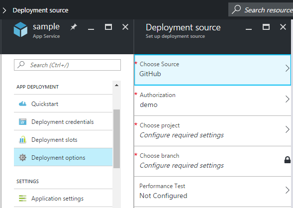

<properties
    pageTitle="Fortlaufender Bereitstellung auf Azure App-Verwaltungsdienst | Microsoft Azure"
    description="Erfahren Sie, wie fortlaufender Bereitstellung in Azure App Service aktivieren."
    services="app-service"
    documentationCenter=""
    authors="dariagrigoriu"
    manager="wpickett"
    editor="mollybos"/>

<tags
    ms.service="app-service"
    ms.workload="na"
    ms.tgt_pltfrm="na"
    ms.devlang="na"
    ms.topic="article"
    ms.date="10/28/2016"
    ms.author="dariagrigoriu"/>
    
# Fortlaufender Bereitstellung Azure App-Dienst

In diesem Lernprogramm erfahren Sie, wie einen Bereitstellungsworkflow fortlaufender für Ihre [App-Verwaltungsdienst Azure] -app konfiguriert. App-Dienst-Integration in BitBucket, GitHub und Visual Studio Team Services (VSTS) ermöglicht einen kontinuierliche Bereitstellungsworkflow Azure, in die letzten Aktualisierungen aus Ihrem Projekt auf eine der folgenden Dienste veröffentlicht abruft. Fortlaufender Bereitstellung ist eine gute Option für Projekte, in dem mehrere und häufig verwendeten Spenden integriert sind.

## Fortlaufender Bereitstellung aktivieren

Fortlaufender Bereitstellung zu aktivieren 

1. Veröffentlichen Sie Ihre app-Inhalten zum Repository, das für kontinuierliche Bereitstellung verwendet werden.  
    Weitere Informationen zum Veröffentlichen von Ihrem Projekts zu dieser Dienste finden Sie unter [Erstellen einer Repo (GitHub)], [Erstellen Sie eine Repo (BitBucket)]und [Erste Schritte mit VSTS].

2. Klicken Sie in der app Menü Blade im [Azure-Portal]auf **APP DEPLOYMENT > Bereitstellungsoptionen**. Klicken Sie auf **Quelle auswählen**, und wählen Sie dann die Quelle für die Bereitstellung.  

    
    
    > [AZURE.NOTE] Zum Konfigurieren einer VSTS Konto für die Bereitstellung der App-Dienst finden Sie in diesem [Lernprogramm](https://github.com/projectkudu/kudu/wiki/Setting-up-a-VSTS-account-so-it-can-deploy-to-a-Web-App).
    
3. Führen Sie den Autorisierung Workflow an. 

4. Wählen Sie in der **Bereitstellung Quelle** Blade Project und Verzweigung zur Bereitstellung von aus. Wenn Sie fertig sind, klicken Sie auf **OK**.
  
    

    > [AZURE.NOTE] Wenn Sie mit GitHub oder BitBucket fortlaufender Bereitstellung aktivieren, werden öffentlichen und privaten Projekte angezeigt.

    App-Dienst erstellt eine Zuordnung mit dem ausgewählten Repository, in der Dateien aus dem angegebenen Zweig abruft und unterhält eine Klonen des Repositorys für Ihre App-Service-app. Wenn Sie VSTS fortlaufender Bereitstellung vom Azure-Portal konfigurieren, die Integration verwendet das App-Dienst [Kudu Bereitstellung-Engine](https://github.com/projectkudu/kudu/wiki), erstellen und Bereitstellen von Aufgaben mit bereits automatisieren, wird jede `git push`. Sie müssen nicht kontinuierliche Bereitstellung in VSTS separat einrichten. Nach Abschluss dieses Vorgangs, wird das app-Blade **Bereitstellungsoptionen** anzeigen eine aktive Bereitstellung, die Bereitstellung angibt erfolgreich war.

5. Um zu überprüfen, dass die app erfolgreich bereitgestellt wird, klicken Sie auf die **URL** am oberen Rand des app vorher in der Azure-Portal. 

6. Um zu überprüfen, dass fortlaufender Bereitstellung aus dem Repository Ihrer Wahl durchgeführt wird, drücken Sie eine Änderung an den Repository aus. Ihre app sollte aktualisieren, kurz nach Abschluss der Pushbenachrichtigungen zum Repository aktualisiert. Sie können überprüfen, dass es in das Update in Ihre app Falz **Bereitstellungsoptionen** gezogen wurde.

## Fortlaufender Bereitstellung von Visual Studio-Lösung 

Eine Visual Studio-Lösung in Azure App Service gegangen wird ebenso einfach wie das Verschieben einer Datei einfache index.html. Das App-Dienst Bereitstellung vereinfacht die Besprechungsdetails einschließlich NuGet Abhängigkeiten wiederherstellen und die Anwendungsbinärdateien erstellen. Sie können die Quelle Steuerelement bewährte Methoden Code nur in Ihrem Git Repository zu verwalten, und lassen Sie den Rest erledigen App-Service-Bereitstellung.

Die Schritte für Ihre Visual Studio-Lösung nach App-Dienst drücken sind die gleichen wie im [vorherigen Abschnitt](#overview)vorausgesetzt, dass Sie Ihre Lösung und Repository wie folgt konfigurieren:

-   Verwenden Sie die Option Visual Studio Datenquellen-Steuerelement zum Generieren einer `.gitignore` ablegen, wie das Bild unten oder manuell hinzufügen einer `.gitignore` Datei im Stammverzeichnis Repository, mit dem Inhalt ähnlich wie dieses [Beispiel .gitignore](https://github.com/github/gitignore/blob/master/VisualStudio.gitignore). 

    
 
-   Hinzufügen der gesamten Lösung Directory-Struktur an Ihre Repository, mit der SLN-Datei im Stammverzeichnis Repository.

Nachdem Sie Ihr Repository als beschrieben einrichten und Ihre app in Azure für die kontinuierliche Veröffentlichung von einem den online Git Repositorys konfiguriert haben, können Sie Ihrer Anwendung ASP.NET lokal in Visual Studio entwickeln und kontinuierlich Code einfach, indem Sie drücken die Änderungen an Ihrer online Git Repository bereitstellen.

## Fortlaufender Bereitstellung deaktivieren

So deaktivieren Sie kontinuierliche Bereitstellung, 

1. Klicken Sie in der app Menü Blade im [Azure-Portal]auf **APP DEPLOYMENT > Bereitstellungsoptionen**. Klicken Sie dann auf **Trennen** in das Blade **Bereitstellungsoptionen** .

        

2. Nach dem in der bestätigungsmeldung beantworten **Ja** , können Sie zu Ihrer app Blade zurückkehren und klicken Sie auf **APP DEPLOYMENT > Bereitstellungsoptionen** , wenn Sie aus einer anderen Quelle für die Veröffentlichung einrichten möchten.

## Zusätzliche Ressourcen

* [So häufige Probleme mit fortlaufender Bereitstellung ermitteln.](https://github.com/projectkudu/kudu/wiki/Investigating-continuous-deployment)
* [Verwendung von PowerShell für Azure]
* [So verwenden Sie die Azure Line Tools für Mac und Linux]
* [Git Dokumentation]
* [Project-Kudu](https://github.com/projectkudu/kudu/wiki)

>[AZURE.NOTE] Wenn Sie mit Azure-App-Verwaltungsdienst Schritte vor dem für ein Azure-Konto anmelden möchten, wechseln Sie zu [App-Verwaltungsdienst versuchen](http://go.microsoft.com/fwlink/?LinkId=523751), in dem Sie eine kurzlebige Starter Web app sofort im App-Dienst erstellen können. Keine Kreditkarten erforderlich; keine Zusagen.

[Azure App-Verwaltungsdienst]: https://azure.microsoft.com/en-us/documentation/articles/app-service-changes-existing-services/ 
[Azure-portal]: https://portal.azure.com
[VSTS Portal]: https://www.visualstudio.com/en-us/products/visual-studio-team-services-vs.aspx
[Installing Git]: http://git-scm.com/book/en/Getting-Started-Installing-Git
[Verwendung von PowerShell für Azure]: ../articles/powershell-install-configure.md
[So verwenden Sie die Azure Line Tools für Mac und Linux]: ../articles/xplat-cli-install.md
[Git Dokumentation]: http://git-scm.com/documentation

[Erstellen einer Repo (GitHub)]: https://help.github.com/articles/create-a-repo
[Erstellen einer Repo (BitBucket)]: https://confluence.atlassian.com/display/BITBUCKET/Create+an+Account+and+a+Git+Repo
[Erste Schritte mit VSTS]: https://www.visualstudio.com/get-started/overview-of-get-started-tasks-vs
[Continuous delivery to Azure using Visual Studio Team Services]: ../articles/cloud-services/cloud-services-continuous-delivery-use-vso.md
