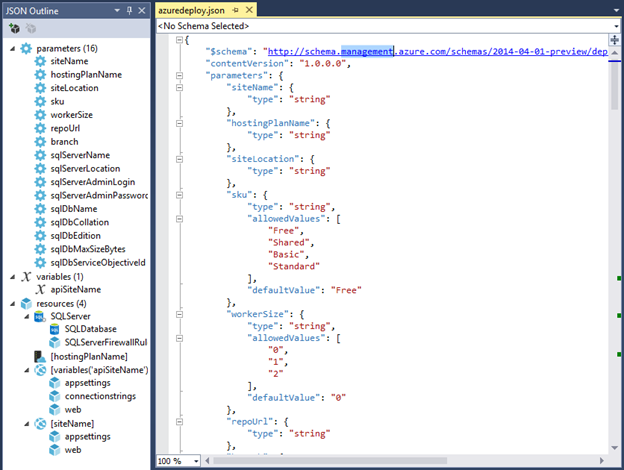
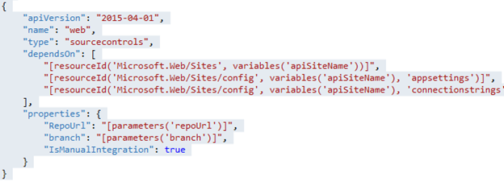
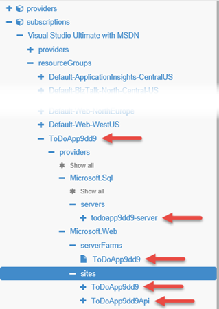
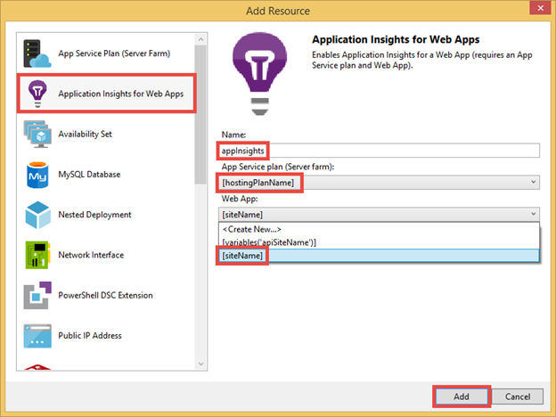
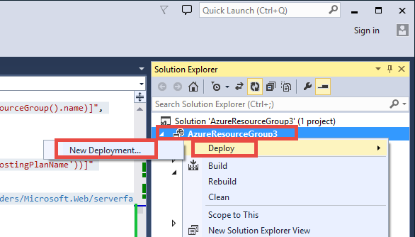
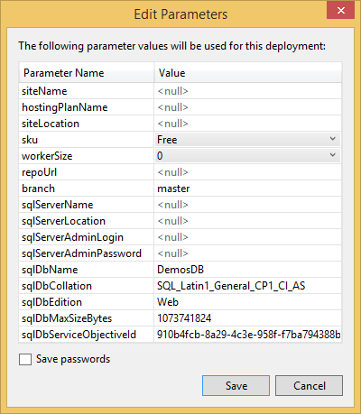
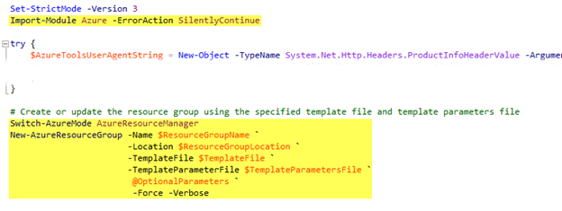

<properties
    pageTitle="Bereitstellen und Microservices vorhersehbar in Azure bereitstellen"
    description="Informationen Sie zum Bereitstellen einer Anwendungs erstellter Microservices Azure-App-Verwaltungsdienst als einzelne Einheit und in vorhersehbar Weise mit JSON Ressource Gruppenvorlagen und PowerShell-Skripting."
    services="app-service"
    documentationCenter=""
    authors="cephalin"
    manager="wpickett"
    editor="jimbe"/>

<tags
    ms.service="app-service"
    ms.workload="na"
    ms.tgt_pltfrm="na"
    ms.devlang="na"
    ms.topic="article"
    ms.date="01/06/2016"
    ms.author="cephalin"/>

# Bereitstellen und Microservices vorhersehbar in Azure bereitstellen #

In diesem Lernprogramm erfahren, wie bereitstellen und Bereitstellen einer Anwendungs erstellter [Microservices](https://en.wikipedia.org/wiki/Microservices) in [Azure-App-Verwaltungsdienst](/services/app-service/) als einzelne Einheit und mithilfe von JSON Ressource Gruppenvorlagen und PowerShell-Skripting kontrolliert. 

Wenn bereitgestellt und Bereitstellen von Applications hochgradig skalierbar, die von hochgradig abgekoppelt bestehen sind Microservices, Wiederholbarkeit und Vorhersagbarkeit entscheidend zum Erfolg. [App-Verwaltungsdienst Azure](/services/app-service/) ermöglicht es Ihnen Microservices zu erstellen, die Web-apps, mobilen apps, apps API und Logik apps enthalten. [Ressourcenmanager Azure](../azure-resource-manager/resource-group-overview.md) können Sie alle im Microservices als Einheit, zusammen mit den Ressourcen Abhängigkeiten z. B. Datenbank verwalten und steuerungseinstellungen Datenquelle. Nun können Sie auch eine solche Anwendung mit JSON-Vorlagen und einfache PowerShell-Skripting bereitstellen. 

[AZURE.INCLUDE [app-service-web-to-api-and-mobile](../../includes/app-service-web-to-api-and-mobile.md)] 

## Vorgehensweise ##

Im Lernprogramm wird eine Anwendung bereitgestellt werden, die umfasst:

-   Zwei web apps (d. h. zwei Microservices)
-   Back-End-SQL-Datenbank
-   Einstellungen für die App, Verbindungszeichenfolgen und Datenquellen-Steuerelements
-   Anwendung Einblicken, Benachrichtigungen, Einstellungen für automatische Skalierung

## Tools, die verwendet werden soll ##

In diesem Lernprogramm verwenden Sie die folgenden Tools. Da es nicht umfassende Diskussion auf Extras, werde ich mit dem End-to-End-Szenario für übernommen und einfach bieten Ihnen eine kurze Einführung zu den einzelnen, und wo finde Sie weitere Informationen. 

### Azure Ressourcenmanager Vorlagen (JSON) ###
 
Jedes Mal, wenn Sie eine Web app im App-Verwaltungsdienst Azure erstellen, beispielsweise verwendet Azure Ressourcenmanager eine JSON-Vorlage können Sie die gesamte Ressourcengruppe mit den Komponentenressourcen erstellen. Komplexe Vorlage aus dem [Azure Marketplace](/marketplace) , wie die app [Skalierbare WordPress](/marketplace/partners/wordpress/scalablewordpress/) enthalten, der MySQL-Datenbank, Speicherkonten, der App Serviceplan der Web-app ähneln sein kann, sind Warnungsregeln, Einstellungen für die app, automatisch skalieren Einstellungen und weitere, und alle diese Vorlagen über PowerShell zur Verfügung. Informationen zum Herunterladen und verwenden Sie diese Vorlagen finden Sie unter [Verwenden von Azure PowerShell Azure Ressourcenmanager](../powershell-azure-resource-manager.md).

Weitere Informationen zu den Ressourcenmanager Azure-Vorlagen finden Sie unter [Authoring Azure Ressourcenmanager Vorlagen](../resource-group-authoring-templates.md)

### Azure SDK 2.6 für Visual Studio ###

Das neueste SDK enthält Verbesserungen an den Support Ressourcenmanager Vorlage im JSON-Editor. Sie können Hiermit können Sie schnell Neuerstellen einer Ressource Gruppenvorlage, oder öffnen eine vorhandene JSON-Vorlage (beispielsweise eine Vorlage heruntergeladenen Katalog) zur Bearbeitung, füllen die Parameterdatei und sogar die Ressourcengruppe direkt aus einer Ressourcengruppe Azure-Lösung bereitstellen.

Weitere Informationen finden Sie unter [Azure SDK 2.6 für Visual Studio](/blog/2015/04/29/announcing-the-azure-sdk-2-6-for-net/).

### Azure PowerShell 0.8.0 oder höher ###

Ab Version 0.8.0, enthält die Installation Azure PowerShell das Modul Azure Ressourcenmanager zusätzlich zu den Azure-Modul. Diese neue Modul ermöglicht Ihnen, die Bereitstellung von Ressourcengruppen Skripts.

Weitere Informationen finden Sie unter [Verwenden von Azure PowerShell Azure Ressourcenmanager](../powershell-azure-resource-manager.md)

### Azure-Explorers ###

Dieses [Vorschautool](https://resources.azure.com) können Sie die JSON-Definitionen aller Ressourcen Gruppen in Ihrem Abonnement und den einzelnen Ressourcen zu durchsuchen. Klicken Sie im Tool können Sie die JSON-Definitionen einer Ressource bearbeiten, löschen eine gesamte Hierarchie von Ressourcen und erstellen neue Ressourcen.  Die Informationen in diesem Tool verfügbar ist sehr hilfreich, für die Vorlage Texterstellung, da es welche Eigenschaften zeigt Sie für einen bestimmten Typ von Ressourcen, die richtigen Werte usw. festlegen müssen. Sie können sogar Erstellen Ihrer Ressourcengruppe im [Portal Azure](https://portal.azure.com/)und dann seine JSON-Definitionen im Explorer-Tool können Sie Sie nicht als Vorlage, dienen die Ressourcengruppe zu prüfen.

### Bereitstellen von Azure-Schaltfläche ###

Wenn Sie GitHub für Datenquellen-Steuerelement verwenden, können Sie in der Infodatei zu einer [bereitstellen, Azure Schaltfläche](/blog/2014/11/13/deploy-to-azure-button-for-azure-websites-2/) einfügen. MD, die eine Bereitstellung von einsatzbereiten Benutzeroberfläche in Azure ermöglicht. Dies ist eine einfache Web App zwar können, können Sie hier, um mit einer azuredeploy.json-Datei im Stammverzeichnis Repository Bereitstellen einer gesamten Ressourcengruppe aktivieren erweitern. Diese JSON-Datei, die die Ressource Gruppenvorlage enthält, wird durch das bereitstellen, Azure-Schaltfläche zum Erstellen der Ressourcengruppe verwendet. Ein Beispiel finden Sie unter dem [ToDoApp](https://github.com/azure-appservice-samples/ToDoApp) -Beispiel in diesem Lernprogramm soll verwendet werden.

## Abrufen der Ressource Gruppe Beispielvorlage ##

Jetzt erfahren Sie, nach rechts, um ihn.

1.  Navigieren Sie zu der [ToDoApp](https://github.com/azure-appservice-samples/ToDoApp) App Dienst Stichprobe.

2.   Klicken Sie in readme.md auf **Bereitstellen in Azure**.
 
3.  Sie zu der Website [bereitstellen zu Azure](https://deploy.azure.com) geöffnet und aufgefordert werden, die Bereitstellungsparameter einzugeben. Beachten Sie, dass die meisten Felder mit den Namen des Repository und einige zufälligen Zeichenfolgen für Sie ausgefüllt werden. Sie können alle Felder ändern, wenn Sie möchten, aber nur Maßnahmen, die Sie eingeben müssen, sind die administrativen SQL Server-Benutzernamen und das Kennwort und dann auf **Weiter**.
 
    

4.  Klicken Sie anschließend auf **Bereitstellen** , um die Bereitstellung zu starten. Nachdem der Prozess bis zum Abschluss ausgeführt wird, klicken Sie auf die http://todoapp*XXXX*. azurewebsites.net Link bereitgestellte Anwendung zu durchsuchen. 

    

    Die Benutzeroberfläche würde etwas langsam sein, wenn Sie zuerst zu durchsuchen, da der apps nur gestartet werden, aber überzeugen sich, dass sie eine voll funktionsfähige Anwendung ist.

5.  Klicken Sie in der Seite Bereitstellen auf den Link **Verwalten** , um die neue Anwendung im Portal Azure anzuzeigen.

6.  Klicken Sie in der Dropdownliste **Essentials** auf den Link der Ressource Gruppe. Beachten Sie auch, dass das Web app an der GitHub Repository unter **Externen Projekt**bereits verbunden ist. 

    
 
7.  Beachten Sie in der Gruppe Ressourcen Blade-, dass es bereits zwei Web apps und eine SQL-Datenbank in der Ressourcengruppe aus.

    
 
Alles, was Sie gerade gesehen haben in wenigen Minuten eine vollständig bereitgestellte zwei-Microservice-Anwendung mit allen Komponenten, Abhängigkeiten, Einstellungen, Datenbank und fortlaufender Veröffentlichung, von einer automatisierten Orchestrierung in Azure Ressourcenmanager eingerichtet ist. Alle Dies erfolgte durch zwei Faktoren:

-   Das bereitstellen, Azure-Schaltfläche
-   azuredeploy.JSON im Stammverzeichnis repo

Sie können in derselben Anwendung bereitstellen Dutzende, Hunderte oder Tausende von Zeiten und genaue die gleiche Konfiguration jedes Mal haben. Die Wiederholbarkeit und die Vorhersagbarkeit des dieser Ansatz ermöglicht es Ihnen hochgradig skalierbar Applikationen mit einfachen und KONFIDENZ bereitstellen.

## AZUREDEPLOY untersuchen (oder bearbeiten). JSON ##

Jetzt sehen wir uns wie GitHub Repository eingerichtet wurde. Sie werden mit dem JSON-Editor in Azure .NET SDK, also wenn Sie noch nicht geschehen ist installiert haben [Azure .NET SDK 2.6](/downloads/), gehen sie wie.

1.  Klonen Sie [ToDoApp](https://github.com/azure-appservice-samples/ToDoApp) Repository mithilfe Ihrer bevorzugten Git Tool an. In den folgenden Screenshot mache dies im Team Explorer in Visual Studio 2013 ich.

    

2.  Öffnen Sie in der Stammwebsitesammlung Repository azuredeploy.json in Visual Studio aus. Wenn Sie im Bereich JSON-Gliederung angezeigt werden, müssen Sie Azure .NET SDK installieren.

    

Im Abschnitt [Weitere Ressourcen](#resources) besitzt Links für die Ressource Gruppe Vorlagensprache learning, aber ich werde nicht jedes Detail das JSON-Format zu beschreiben. Hier werde ich nur Sie sehen, dass die interessante Features, die Ihnen helfen können Einstieg in das Erstellen einer eigenen benutzerdefinierten Vorlage für die Bereitstellung der app.

### Parameter ###

Sehen Sie sich im Abschnitt Parameter zu sehen, dass die meisten der folgenden Parameter werden, was die Schaltfläche **bereitstellen zu Azure** Eingabe aufgefordert werden. Die Website hinter der Schaltfläche **bereitstellen zu Azure** füllt die Eingabe Benutzeroberfläche mit den Parametern in azuredeploy.json definiert. Diese Parameter werden in der gesamten Ressourcendefinitionen, z. B. Ressourcennamen, Immobilienwerte usw. verwendet.

### Ressourcen ###

Klicken Sie im Ressourcenknoten sehen Sie sich, dass 4 auf oberster Ebene Ressourcen definiert sind, einschließlich einer SQL Server-Instanz, eine App Serviceplan und zwei Web apps. 

#### App-Serviceplan ####

Beginnen wir mit einer einfachen auf der Stammebene Ressource in den JSON. Klicken Sie in der Gliederung JSON auf der App Serviceplan mit der Bezeichnung **[HostingPlanName]** in den entsprechenden JSON-Code hervorheben. 

Beachten Sie, dass die `type` Element gibt die Zeichenfolge für eine App-Serviceplan (es wurde Serverfarm genannt wird eine vor lange, lange Zeit), und andere Elemente und Eigenschaften ausgefüllt werden mit den Parametern in der Datei JSON definiert diese Ressource verfügt nicht über eine beliebige geschachtelten Ressourcen.

>[AZURE.NOTE] Beachten Sie auch, dass den Wert der `apiVersion` teilt Azure, welche Version von die REST-API die Definition der JSON-Ressource mit verwenden, und es kann beeinflussen, wie die Ressource innerhalb formatiert werden sollen, die `{}`. 

#### SqlServer ####

Klicken Sie auf Weiter, klicken Sie auf die SQL Server-Ressource mit der Bezeichnung **SQLServer** in der Gliederung JSON.

 
Beachten Sie die folgenden Informationen zu den hervorgehobenen JSON-Code ein:

-   Die Verwendung von Parametern wird sichergestellt, dass die Erstellen von Ressourcen mit dem Namen und auf eine Weise, die sie mit einer konsistent macht konfiguriert sind.
-   SQLServer Ressource weist zwei geschachtelte Ressourcen, jede hat einen anderen Wert für `type`.
-   Die geschachtelten Ressourcen innerhalb `“resources”: […]`, in dem die Datenbank und die Firewall-Regeln definiert werden, haben eine `dependsOn` Element, das die Ressourcen-ID, der auf der Stammebene SQLServer Ressource angibt. Dies weist Azure Ressourcenmanager, "vor dem Erstellen von dieser Ressource, die andere Ressource bereits vorhanden sein; und wenn die anderen Ressourcen in der Vorlage definiert ist, erstellen Sie dann die zuerst".

    >[AZURE.NOTE] Ausführliche Informationen zum Verwenden der `resourceId()` funktionieren, finden Sie unter [Azure Ressourcenmanager Vorlage Funktionen](../resource-group-template-functions.md).

-   Das Verhalten der `dependsOn` Element ist, dass Azure Ressourcenmanager können wissen, welche Ressourcen parallel erstellt werden können und welche Ressourcen sequenziell erstellt werden müssen. 

#### Web app ####

Nun betrachten wir nun die ist-Web apps selbst, deren komplizierter ist. Klicken Sie auf das [variables('apiSiteName')] Web app in der JSON-Gliederung, um deren JSON-Code hervorheben. Sie sehen, dass Dinge viel interessanter abrufen. Zu diesem Zweck werde ich zu den Features einzeln:

##### Stamm-Ressourcen #####

Das Web app hängt von zwei verschiedenen Ressourcen ab. Dies bedeutet, dass Azure Ressourcenmanager das Web-app erstellen wird erst sowohl in der App-Serviceplan SQL Server-Instanz erstellt werden.

##### App-Einstellungen #####

Die Appeinstellungen werden auch als geschachtelte Ressource definiert.

In der `properties` Element für `config/appsettings`, Sie haben zwei app-Einstellungen im Format `“<name>” : “<value>”`.

-   `PROJECT`ist eine [KUDU-Einstellung](https://github.com/projectkudu/kudu/wiki/Customizing-deployments) , die Azure-Bereitstellung welches Projekt in ein Visual Studio-Lösung mit mehreren Projekten verwendet wird. Ich wird gezeigt, wie später Datenquellen-Steuerelement konfiguriert ist, aber da der ToDoApp-Code in einer Visual Studio-Lösung mit mehreren Projekten ist, benötigen wir diese Einstellung.
-   `clientUrl`ist einfach eine app festlegen, die den Anwendungscode verwendet.

##### Verbindungszeichenfolgen #####

Die Verbindungszeichenfolgen werden auch als geschachtelte Ressource definiert.

In der `properties` Element für `config/connectionstrings`, jede Verbindungszeichenfolge wird auch als ein Name: Wertpaar, mit dem bestimmte Format des definiert `“<name>” : {“value”: “…”, “type”: “…”}`. Für die `type` Element, um mögliche Werte sind `MySql`, `SQLServer`, `SQLAzure`, und `Custom`.

>[AZURE.TIP] Eine endgültige Liste der Verbindung Zeichenfolgentypen, führen Sie den folgenden Befehl in Azure PowerShell: \[Enum]::GetNames("Microsoft.WindowsAzure.Commands.Utilities.Websites.Services.WebEntities.DatabaseType")
    
##### Datenquellen-Steuerelements #####

Die Quelle steuerungseinstellungen werden auch als geschachtelte Ressource definiert. Azure Ressourcenmanager verwendet diese Ressource so konfigurieren Sie fortlaufender für die Veröffentlichung (finden Sie unter Vorbehalt auf `IsManualIntegration` später) und auch zum Deaktivieren der Bereitstellung der Anwendungscode automatisch während der Verarbeitung der Datei JSON Starten eines.

`RepoUrl`und `branch` sollten ziemlich intuitive, und zeigen Sie mit der sollte auf Git Repository sowie den Namen der Verzweigung veröffentlichen aus. In diesem Fall werden diese durch Eingabeparameter definiert. 

Beachten Sie der `dependsOn` Element, das über die Web app-Ressource selbst, `sourcecontrols/web` hängt auch `config/appsettings` und `config/connectionstrings`. Dies ist, da nachdem `sourcecontrols/web` ist so konfiguriert ist, der Prozess Azure-Bereitstellung versucht automatisch bereitstellen, erstellen und starten Sie den Anwendungscode. Daher können Sie diese Abhängigkeit einfügen Sie sicherstellen, dass die Anwendung hat Zugriff auf die erforderlichen app-Einstellungen und Verbindungszeichenfolgen, die vor der Anwendungscode ausgeführt wird. 

>[AZURE.NOTE] Beachten Sie auch, dass `IsManualIntegration` auf festgelegt ist `true`. Diese Eigenschaft ist in diesem Lernprogramm erforderlich, da Sie nicht tatsächlich GitHub Repository besitzen, und somit können nicht tatsächlich erteilen Azure fortlaufender für die Veröffentlichung von [ToDoApp](https://github.com/azure-appservice-samples/ToDoApp) (d. h. konfigurieren Drücken Sie Repository von automatischen Updates in Azure). Sie können den Standardwert `false` für das angegebene Repository nur, wenn Sie der Besitzer des GitHub Anmeldeinformationen in das [Azure-Portal](https://portal.azure.com/) neu konfiguriert haben. Kurzum, wenn Sie Datenquellen-Steuerelements GitHub oder BitBucket für eine beliebige app im [Portal Azure](https://portal.azure.com/) zuvor eingerichtet haben, werden unter Verwendung Ihrer Anmeldeinformationen, klicken Sie dann Azure die Anmeldeinformationen speichern und verwenden können, wenn Sie in Zukunft eine beliebige app aus GitHub oder BitBucket bereitstellen. Jedoch, wenn Sie dies noch nicht erfolgt tritt Bereitstellung der Vorlage JSON wenn Ressourcenmanager Azure versucht, Einstellungen für das Web-app Quelle zu konfigurieren, da es in GitHub oder BitBucket mit dem Repository-Eigentümer Anmeldeinformationen anmelden kann.

## Vergleichen Sie die JSON-Vorlage mit bereitgestellten Ressourcengruppe ##

Hier können Sie alle des Web app Karten im [Portal Azure](https://portal.azure.com/)wechseln, aber es ist ein weiteres Tool, der genauso wie hilfreich, If nicht mehr. Wechseln Sie zu der [Azure-Explorers](https://resources.azure.com) Vorschautool, das sodass Sie eine JSON-Darstellung aller Ressourcen Gruppen in Ihrer Abonnements, erhalten, wie sie in der Azure Back-End-tatsächlich vorhanden sind. Sie können auch sehen, wie der Hierarchie in der Vorlagendatei entspricht, mit der Erstellung, der Ressourcengruppe JSON-Hierarchie in Azure.

Beispielsweise kann ich beim Wechseln Sie zu der [Azure Ressource Explorer](https://resources.azure.com) -Tools, und erweitern Sie die Knoten im Explorer, sehen die Ressourcengruppe und den auf der Stammebene Ressourcen, die unter der jeweiligen Ressourcenart erfasst werden.

Wenn Sie eine Web app Drilldown, Sie sollten möglicherweise Web app-Konfiguration ähnlich wie Details finden Sie unter der unter Screenshot:

Erneut, die geschachtelten Ressourcen sollte eine Hierarchie sehr ähnlich wie in der JSON-Vorlagendatei, und finden Sie die Einstellungen für die app, Verbindungszeichenfolgen usw., im Bereich JSON ordnungsgemäß angezeigt. Die Abwesenheit Einstellungen hier möglicherweise ein Problem mit Ihrer JSON-Datei und Ihre JSON-Vorlagendatei bei der Problembehandlung helfen kann.

## Bereitstellen der Ressource Gruppenvorlage selbst ##

Die Schaltfläche **bereitstellen zu Azure** eignet sich hervorragend, aber es ermöglicht Ihnen, die Ressource Gruppenvorlage in azuredeploy.json bereitstellen, nur, wenn Sie bereits azuredeploy.json zu GitHub abgelegt haben. Azure .NET SDK enthält auch die Tools zum Bereitstellen von einem beliebigen JSON-Vorlagendatei direkt von Ihrem lokalen Computer. Führen Sie hierzu die folgenden Schritte aus:

1.  Klicken Sie auf **Datei**, klicken Sie in Visual Studio > **neu** > **Projekt**.

2.  Klicken Sie auf **Visual C#-** > **Cloud** > **Azure Ressourcengruppe**, klicken Sie dann auf **OK**.

    

3.  **Azure-Vorlage auswählen**wählen Sie **Leere Vorlage** aus, und klicken Sie auf **OK**.

4.  Ziehen Sie azuredeploy.json in **den Vorlagenordner Ihres neuen Projekts** aus.

    

5.  Lösung-Explorer öffnen Sie die kopierte azuredeploy.json.

6.  Nur aus Gründen der der Vorführung uns einige standard Anwendung Einblicke Ressourcen hinzufügen unserer JSON-Datei, indem Sie auf **Ressource hinzufügen**. Wenn Sie nur in den JSON-Datei bereitstellen möchten, fahren Sie mit den Schritten bereitstellen.

    

7.  Wählen Sie die **Anwendung Einsichten von Web Apps**, vergewissern Sie sich einem vorhandenen App-Dienst planen und Web app ausgewählt ist, und klicken Sie dann auf **Hinzufügen**.

    

    Jetzt zwar können auf mehrere neuen Ressourcen finden in Abhängigkeit von der Ressource, und was bedeutet anzeigen möchten, müssen die Abhängigkeiten von entweder der App-Serviceplan oder Web app. Diese Ressourcen werden nicht in ihrer vorhandenen Definition aktiviert, und dies geändert werden soll.

    
 
8.  Klicken Sie in der Gliederung JSON auf **AppInsights automatisch skalieren** , um deren JSON-Code zu markieren. Dies ist die Skalierung Einstellung für Ihre App-Serviceplan.

9.  Suchen Sie den hervorgehobenen JSON-Code, der `location` und `enabled` Eigenschaften, und legen Sie sie, wie unten dargestellt.

    

10. Klicken Sie in der Gliederung JSON auf **CPUHigh AppInsights** , um deren JSON-Code zu markieren. Dies ist eine Warnung aus.

11. Suchen Sie nach der `location` und `isEnabled` Eigenschaften, und legen Sie sie, wie unten dargestellt. Gehen Sie genauso für die anderen drei Benachrichtigungen (Lila Glühlampen).

    

12. Sie nun können zum Bereitstellen. Mit der rechten Maustaste in des Projekts, und wählen Sie **Bereitstellen** > **Neue Bereitstellung**.

    

13. Melden Sie sich bei Ihrem Konto Azure, wenn Sie dies nicht bereits getan haben.

14. Wählen Sie eine vorhandene Ressourcengruppe im Rahmen Ihres Abonnements oder erstellen Sie einen neuen, wählen Sie **azuredeploy.json**aus und klicken Sie dann auf **Parameter bearbeiten**.

    

    Sie können jetzt so bearbeiten Sie alle Parameter in die Vorlagendatei in eine übersichtliche Tabelle definiert sein. Parameter, die Standardeinstellungen definieren bereits Standardwerte und Parameter, die eine Liste der zulässigen Werte definieren als Dropdownmenüs angezeigt werden soll.

    

15. Füllen Sie alle leeren Parameter, und verwenden Sie die [GitHub Repo Adresse für ToDoApp](https://github.com/azure-appservice-samples/ToDoApp.git) in **RepoUrl**. Klicken Sie dann auf **Speichern**.
 
    

    >[AZURE.NOTE] Automatische Skalierung ist ein Feature in **Standard** Ebene oder höher angeboten und Plan Ebene Benachrichtigungen werden Features angeboten in **grundlegende** Ebene oder höher, müssen Sie den **Sku** -Parameter auf **Standard** oder **Premium** festlegen, damit alle Ihre neue App Einsichten Ressourcen Leuchten finden Sie unter.
    
16. Klicken Sie auf **Bereitstellen**. Wenn Sie **Kennwörter speichern**ausgewählt haben, wird das Kennwort in der Parameter Datei **im nur-Text**gespeichert. Andernfalls werden Sie aufgefordert, das Datenbankkennwort während der Bereitstellung Eingabemethoden.

Das war's schon! Jetzt müssen Sie nur das [Azure-Portal](https://portal.azure.com/) und das Tool [Azure Ressource Explorer](https://resources.azure.com) zu der neuen Benachrichtigungen finden Sie unter wechseln und automatisch skalieren Einstellungen der JSON hinzugefügt bereitgestellt Anwendung.

Die Schritte in diesem Abschnitt lesbar hauptsächlich Folgendes:

1.  Die Vorlagendatei vorbereitet
2.  Erstellt eine Parameterdatei, fahren Sie mit der Vorlagendatei
3.  Die Vorlagendatei mit der Parameterdatei bereitgestellt

Der letzte Schritt darin ist ganz einfach von PowerShell-Cmdlet ausgeführt. Öffnen Sie zum finden Sie unter Was Visual Studio konnten, wenn sie die Anwendung bereitgestellt, Scripts\Deploy-AzureResourceGroup.ps1 ein. Es gibt zahlreiche Code vorhanden, aber ich werde nur alle den relevanten Code hervorheben, den Sie die Vorlagendatei mit der Parameterdatei bereitstellen müssen.

Des letzten-Cmdlets `New-AzureResourceGroup`, ist das Schema, die die Aktion tatsächlich ausführt. All dies sollte Ihnen zeigen, dass mit Hilfe der Tools, relativ zum Bereitstellen von der Cloudanwendung vorhersehbar recht einfach ist. Jedes Mal, wenn Sie das Cmdlet auf derselben Vorlage mit der gleichen Parameterdatei ausführen, müssen Sie nun das gleiche Ergebnis erhalten.

## Zusammenfassung ##

In DevOps sind die Wiederholbarkeit und Vorhersagbarkeit Schlüssel für eine erfolgreiche Bereitstellung einer hochgradig skalierbar Anwendung erstellter Microservices. In diesem Lernprogramm haben Sie eine Anwendung zwei-Microservice in Azure als einzelne Ressourcengruppe mithilfe der Vorlage Ressourcenmanager Azure bereitgestellt. Hoffentlich, hat es Ihnen das Wissen gegeben, die, das Sie Konvertieren eines Ihrer Anwendung in Azure in einer Vorlage starten und bereitstellen und bereitstellen können sie vorhersehbar benötigen. 

## Nächste Schritte ##

Erfahren Sie, wie [agile Methoden anwenden und kontinuierlich Veröffentlichen Ihrer Anwendung Microservices mit steigern](app-service-agile-software-development.md) und erweiterte Bereitstellung Techniken wie [flighting Bereitstellung](app-service-web-test-in-production-controlled-test-flight.md) einfach.

## Weitere Ressourcen ##

-   [Azure Ressourcenmanager Vorlage Sprache](../resource-group-authoring-templates.md)
-   [Authoring Azure Ressourcenmanager Vorlagen](../resource-group-authoring-templates.md)
-   [Azure Ressourcenmanager Vorlage Funktionen](../resource-group-template-functions.md)
-   [Bereitstellen einer Anwendung mit Ressourcenmanager Azure-Vorlage](../resource-group-template-deploy.md)
-   [Mithilfe der Azure PowerShell mit Azure Ressourcenmanager](../powershell-azure-resource-manager.md)
-   [Problembehandlung bei Ressourcengruppe Bereitstellungen in Azure](../resource-manager-troubleshoot-deployments-portal.md)

 
