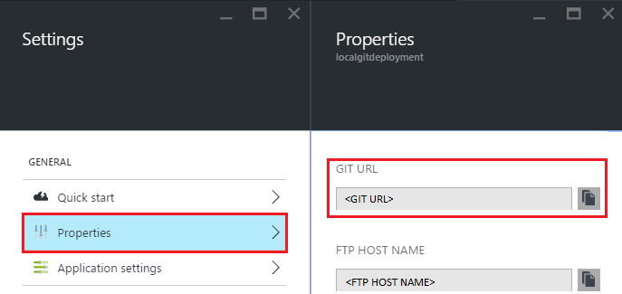

<properties
    pageTitle="Lokale Git Bereitstellung Azure App-Dienst"
    description="Informationen Sie zum Aktivieren der lokalen Bereitstellung von Git Azure-App-Dienst."
    services="app-service"
    documentationCenter=""
    authors="dariagrigoriu"
    manager="wpickett"
    editor="mollybos"/>

<tags
    ms.service="app-service"
    ms.workload="na"
    ms.tgt_pltfrm="na"
    ms.devlang="na"
    ms.topic="article"
    ms.date="06/13/2016"
    ms.author="dariagrigoriu"/>
    
# Lokale Git Bereitstellung Azure App-Dienst

In diesem Lernprogramm erfahren Sie, wie Ihre app [Azure-App-Verwaltungsdienst] aus einem Git Repository auf dem lokalen Computer bereitstellen. App-Dienst unterstützt dieser Ansatz mit die Option **Lokale Git** Bereitstellung der [Azure-Portal]an.  
Viele der in diesem Artikel beschriebenen Git Befehle werden automatisch ausgeführt, wenn eine App-Service-app die [Azure Line Benutzeroberfläche] als beschrieben [hier](app-service-web-get-started.md)erstellen.

## Erforderliche Komponenten

Um dieses Lernprogramms abgeschlossen haben, müssen Sie folgende Aktionen ausführen:

- Git. Sie können die Installation binäre [hier](http://www.git-scm.com/downloads)herunterladen.  
- Grundlegende Kenntnisse Git.
- Ein Microsoft Azure-Konto. Wenn Sie kein Konto haben, können Sie [Sie sich für eine kostenlose Testversion](https://azure.microsoft.com/pricing/free-trial) oder [die Vorteile Ihres Visual Studio Abonnenten aktivieren](https://azure.microsoft.com/pricing/member-offers/msdn-benefits-details).

>[AZURE.NOTE] Wenn Sie mit Azure-App-Verwaltungsdienst Schritte vor dem für ein Azure-Konto anmelden möchten, wechseln Sie zu [App-Verwaltungsdienst versuchen](http://go.microsoft.com/fwlink/?LinkId=523751), in dem Sie eine app kurzlebige Starter sofort im App-Dienst erstellen können. Keine Kreditkarten erforderlich; keine Zusagen.  

## Schritt 1: Erstellen Sie ein lokales repository

Führen Sie die folgenden Aufgaben aus, um ein neues Git Repository zu erstellen.

1. Starten eines Befehlszeilen Tools, wie z. B. **GitBash** (Windows) oder **Bash** (Unix Shell). OS X-Betriebssystemen können Sie die Befehlszeile durch die Anwendung **Terminal** zugreifen.

2. Navigieren Sie zu dem Verzeichnis, in dem die Inhalte bereitstellen gefunden werden.

3. Verwenden Sie den folgenden Befehl ein neues Git Repository Initialisierung aus:

        git init

## Schritt 2: Übernehmen von Inhalten

App-Dienst unterstützt Applications in einer Vielzahl von Sprachen erstellt. 

1. Wenn Ihr Repository bereits Inhalt überspringen umfasst dies zeigen und verweisen 2 unten verschieben. Wenn Ihr Repository nicht bereits Inhalt einfach einschließt füllen Sie mit einer statischen HTML-Datei wie folgt: 

    - Mit einem Text-Editor eine neue Datei namens **"Index.HTML"** im Stammverzeichnis der Git Repository erstellen
    - Fügen Sie den folgenden Text ein, wie der Inhalt für die index.html Datei, und speichern Sie es: *Hallo Git!*
        
2. Stellen Sie sicher, dass Sie im Stammverzeichnis der Git Repository befinden, über die Befehlszeile. Verwenden Sie dann den folgenden Befehl aus, um Ihr Repository Dateien hinzuzufügen:

        git add -A 

4. Als Nächstes commit die Änderungen an den Repository mit dem folgenden Befehl ein:

        git commit -m "Hello Azure App Service"

## Schritt 3: Aktivieren Sie das App-Dienst app repository

Führen Sie die folgenden Schritte aus, um ein Repository Git für Ihre App-Service-app zu aktivieren.

1. Melden Sie sich bei der [Azure-Portal].

2. Klicken Sie in der App-Service-app-Blade auf **Einstellungen > Bereitstellung Quelle**. Klicken Sie auf **Quelle auswählen**, und klicken Sie auf **Lokale Git Repository**, und klicken Sie dann auf **OK**.  

    

3. Ist dies der ersten Mal Einrichtung ein Repository in Azure, müssen Sie Anmeldedaten dafür zu erstellen. Diese wird zur Anmeldung bei der Azure Repository und Pushbenachrichtigungen ändert sich von Ihrem lokalen Git Repository verwendet werden. Aus Ihrer app Blade, klicken Sie auf **Einstellungen > Bereitstellung Anmeldeinformationen**, konfigurieren Sie Ihre Bereitstellung Benutzernamen und Ihr Kennwort ein. Wenn Sie fertig sind, klicken Sie auf **Speichern**.

    

## Schritt 4: Bereitstellen des Projekts

Gehen Sie folgendermaßen vor, Ihre app zu App-Diensts mithilfe des lokalen Git veröffentlichen.

1. Klicken Sie in Ihrer app-vorher in Azure-Portal, auf **Einstellungen > Eigenschaften** für die **Git URL**.

    

    **Git URL** ist die remote-Referenz zum Bereitstellen von Ihrem lokalen Repository. Sie verwenden diese URL in den folgenden Schritten.

2. Verwenden der Befehlszeilenoptionen, stellen Sie sicher, dass Sie sich im Stammverzeichnis der lokalen Git Repository befinden.

3. Verwenden Sie `git remote` Hinzufügen externer Bezug aufgeführten **Git** URL aus Schritt 1. Der Befehl wird ähnlich wie der folgende aus:

        git remote add azure https://<username>@localgitdeployment.scm.azurewebsites.net:443/localgitdeployment.git         
    > [AZURE.NOTE] Der **remote** -Befehl fügt ein benannter Verweis auf eine remote-Repository hinzu. In diesem Beispiel wird einen Verweis mit dem Namen 'Azure' für Ihre Web-app-Prozessrepository erstellt.

4. Drücken Sie den Inhalt mithilfe der neuen **Azure** remote soeben erstellte App-Dienst.

        git push azure master

    Sie werden aufgefordert, das Kennwort aufgefordert, die Sie zuvor erstellt haben, wenn Sie Ihre Anmeldeinformationen Bereitstellung der Azure-Portal zurücksetzen. Geben Sie das Kennwort (Beachten Sie, dass Gitbash nicht Sternchen angezeigt, um die Konsole auf dem Bildschirm werden während der Eingabe Ihres Kennworts). 
       
5. Wechseln Sie zu Ihrer Anwendung Azure-Portal zurück. Ein Eintrag für Ihre letzte Pushbenachrichtigungen sollte in das Blade **Bereitstellungen** angezeigt werden. 

    

6. Klicken Sie auf die Schaltfläche **Durchsuchen** am oberen Rand des app Blade zu überprüfen, ob der Inhalt bereitgestellt wurde. 
    
## Behandlung von Problemen

Im folgenden sind Fehlern oder Problemen, die häufig bei der Arbeit auftreten Git mit einer App-Dienst Azure veröffentlichen:

****

**Problem**: kein Zugriff auf "SiteURL": Fehler beim Verbinden mit [ScmAddress]

**Ursache**: Dieser Fehler kann auftreten, wenn die app nicht ausgeführt wird.

**Lösung**: Starten Sie die app in der Azure-Portal. Git Bereitstellung funktioniert nicht, wenn die app ausgeführt wird. 

****

**Problem**: Host 'Hostname' konnte nicht aufgelöst werden.

**Ursache**: Dieser Fehler kann auftreten, wenn die Adressinformationen eingegeben werden, wenn die 'Azure' remote erstellen falsch war.

**Auflösung**: Verwenden der `git remote -v` Befehl, um alle entfernten Datenbanken zusammen mit den zugehörigen URL aufzulisten. Stellen Sie sicher, dass die URL für die 'Azure' remote korrekt ist. Bei Bedarf entfernen und diese Remote verwenden die richtige URL neu zu erstellen.

****

**Problem**: keine Verweise gemeinsamer und keine angegeben. keine weiteren Schritte. Geben Sie vielleicht einen Zweig wie 'Master'.

**Ursache**: Dieser Fehler kann auftreten, wenn Sie eine Verzweigung nicht angeben, bei der Durchführung einer Git Pushbenachrichtigungen Vorgang und den push.default Wert Git untersuchten nicht festgelegt haben.

**Lösung**: Führen Sie den Pushbenachrichtigungen Vorgang erneut, die Gestaltungsvorlage Verzweigung angeben. Beispiel:

    git push azure master

****

**Problem**: Src Refspec [Branchname] stimmen nicht überein.

**Ursache**: Dieser Fehler kann auftreten, wenn Sie versuchen, auf einen Zweig als Master-Shape auf das 'Azure' remote Pushbenachrichtigungen.

**Lösung**: Führen Sie den Pushbenachrichtigungen Vorgang erneut, die Gestaltungsvorlage Verzweigung angeben. Beispiel:

    git push azure master

****

**Problem**: Fehler - Änderungen tritt für den remote-Repository aber Web app nicht aktualisiert.

**Ursache**: Dieser Fehler kann auftreten, wenn Sie eine Node.js-app mit einer package.json-Datei, die angibt, zusätzliche erforderlichen Module bereitstellen.

**Lösung**: zusätzliche Nachrichten mit 'Npm Fehler'! sollten protokollierten vor der folgende Fehler angezeigt, und kann zusätzlichen Kontext bereitstellen, klicken Sie auf den Fehler. Die folgenden sind Ursachen dieses Fehlers sowie die entsprechenden 'Npm Fehler!' bekannt. Nachricht:

* **Fehlerhafte package.json Datei**: Npm Fehler! Abhängigkeiten konnte nicht gelesen werden.

* **Systemeigene Modul, die eine binäre Verteilung für Windows nicht aufweisen**:

    * Npm Fehler! \`Cmd "/ C" "Knoten-Gyp neu erstellen"\` mit 1 fehlgeschlagen ist

        ODER

    * Npm Fehler! [modulename@version]Vorinstallieren: \`stellen || gmake\`

## Zusätzliche Ressourcen

* [Git Dokumentation](http://git-scm.com/documentation)
* [Project Kudu Dokumentation](https://github.com/projectkudu/kudu/wiki)
* [Die fortlaufende Bereitstellung Azure App-Dienst](app-service-continuous-deployment.md)
* [Verwendung von PowerShell für Azure](../powershell-install-configure.md)
* [So verwenden Sie die Azure Line-Benutzeroberfläche](../xplat-cli-install.md)

[Azure App-Verwaltungsdienst]: https://azure.microsoft.com/documentation/articles/app-service-changes-existing-services/
[Azure Developer Center]: http://www.windowsazure.com/en-us/develop/overview/
[Azure-Portal]: https://portal.azure.com
[Git website]: http://git-scm.com
[Installing Git]: http://git-scm.com/book/en/Getting-Started-Installing-Git
[Azure Line-Benutzeroberfläche]: https://azure.microsoft.com/en-us/documentation/articles/xplat-cli-azure-resource-manager/

[Using Git with CodePlex]: http://codeplex.codeplex.com/wikipage?title=Using%20Git%20with%20CodePlex&referringTitle=Source%20control%20clients&ProjectName=codeplex
[Quick Start - Mercurial]: http://mercurial.selenic.com/wiki/QuickStart
