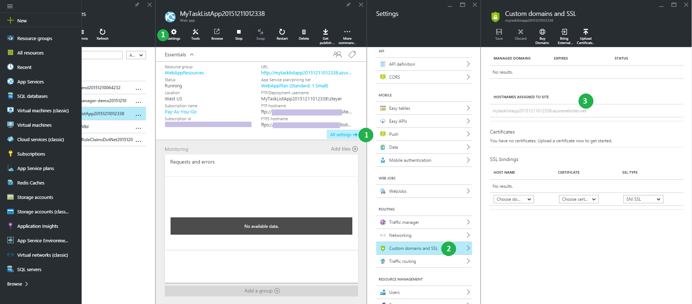

<properties
    pageTitle="Referenz für die Navigation in der Azure-portal"
    description="Informieren Sie sich die verschiedenen Benutzerfunktionalität für Dienst-Web App zwischen Verwaltungsportal und Azure-Portal"
    services="app-service"
    documentationCenter=""
    authors="jaime-espinosa"
    manager="wpickett"
    editor="jimbe"/>

<tags
    ms.service="app-service"
    ms.workload="na"
    ms.tgt_pltfrm="na"
    ms.devlang="na"
    ms.topic="article"
    ms.date="02/26/2016"
    ms.author="jaime-espinosa"/>

# Referenz für die Navigation in der Azure-portal

Azure Websites werden jetzt [App Dienst Web Apps](http://go.microsoft.com/fwlink/?LinkId=529714)bezeichnet. Wir haben alle unserer Dokumentation dieser Namensänderung widergespiegelt und Bereitstellen von Anweisungen für das Portal Azure aktualisieren. Bis dieser Vorgang abgeschlossen ist, können Sie dieses Dokument als Leitfaden verwenden, für die Arbeit mit Web Apps im Azure-Portal.

[AZURE.INCLUDE [app-service-web-to-api-and-mobile](../../includes/app-service-web-to-api-and-mobile.md)] 
 
## Die Zukunft der im klassischen Azure-Portal

Während Sie die branding Änderungen in der klassischen Azure-Portal sehen werden, ist die Portal gerade besetzt werden durch das Azure-Portal. Wie das klassische Portal demnächst geschlossen wird, wird der Fokus für die Entwicklung neuer Azure-Portal verlagern. Alle anstehenden neue Features für Web Apps werden im Portal Azure stammen. Erste Schritte mit Azure-Portal, um die neueste und beste nutzen, dass Web Apps anbieten müssen.

## Layout Unterschiede zwischen dem klassischen Azure-Portal und Azure-Portal

Im Portal klassischen werden alle Azure Dienste auf der linken Seite aufgelistet. Navigation in der klassischen Portal folgt eine Struktur ist, wo Sie vom Dienst starten und in jedes Element navigieren. Diese Struktur funktioniert auch, wenn unabhängige Komponenten verwalten. Allerdings entwickelte auf Azure sind eine Sammlung von miteinander verbundenen Diensten, und diese Baumstruktur ist nicht ideal für die Arbeit mit Websitesammlungen Dienste. 

Azure-Portal erleichtert das Erstellen von Applications-durchgehende mit Komponenten aus mehreren Diensten. Das Portal ist als *Reisen*organisiert. Eine *Reise* ist eine Reihe von *Blades*, die für die verschiedenen Komponenten Container sind. Zum Beispiel: Einrichten von Automatische Skalierung für eine Web app eine *Reise* , die Sie mehrere Blades annimmt ist, wie im folgenden Beispiel gezeigt: das Blade **Website** (die Blade Titel noch nicht zum Verwenden der neuen Terminologie aktualisiert wurde), das Blade **Einstellungen** , und die **Skalierung** Blade. Im Beispiel wird automatisch Skalierung von auf festgelegt, damit es auch eine **Prozentsatz der CPU** -Blade gibt CPU-Auslastung abhängig sind. Die Komponenten innerhalb der *Blades* werden als *Teile*bezeichnet die Kacheln aussieht. 

## Navigationsbereich-Beispiel: erstellen eine Web app

Erstellen von neuen Web apps ist immer noch so einfach wie das 1-2-3. Die folgende Abbildung zeigt die klassischen Portal und dem Portal nebeneinander zu veranschaulichen, dass die Anzahl der Schritte erforderlich, um eine Web app erhalten von und Ausführen der nicht viel geändert hat. 

Im Portal können Sie auf die am häufigsten verwendeten Typen von Web apps, einschließlich beliebte Gallery-Anwendungen wie WordPress auswählen. Eine vollständige Liste der verfügbaren Anwendungen finden Sie auf dem [Azure Marketplace].

Wenn Sie eine Web app erstellen, Sie die URL, angeben App-Serviceplan und Speicherort im Portal nur so, wie Sie in der klassischen Portal. 

Darüber hinaus können mit das Portal Sie weitere allgemeinen Einstellungen festlegen. Beispielsweise machen [Ressourcengruppen](../azure-resource-manager/resource-group-overview.md) Sie es einfach zu finden und Azure Ressourcenübersicht verwalten. 

## Beispiel für die Navigation: Einstellungen und Funktionen

Alle Einstellungen und Features sind jetzt logisch in einem einzelnen Blade, gruppiert aus denen Sie navigieren können.

Beispielsweise können Sie benutzerdefinierte Domänen erstellen, indem Sie auf **benutzerdefinierte Domänen und SSL** in den **Einstellungen** Blade.

Klicken Sie zum Einrichten einer Benachrichtigung überwachen auf **Anfragen und Fehler** , und klicken Sie dann **Benachrichtigung hinzufügen**.

Wenn Diagnose aktivieren möchten, klicken Sie auf **Diagnose Protokolle** in das Blade **Einstellungen** .

 
Klicken Sie auf **ApplicationSettings** in den **Einstellungen** Blade, Anwendungseinstellungen um zu konfigurieren. 

Als den Namen Marke wurden ein paar Punkte im Portal umbenannt oder anders gruppiert, sodass Sie problemlos finden erleichtern. Im folgenden beträgt beispielsweise ein Bildschirmabbild des die zugehörige Seite für die app Einstellungen (**Konfigurieren**) in der klassischen Portal.

## Weitere Ressourcen

[Azure Portal]: https://portal.azure.com
[Azure Marketplace]: /marketplace/

>[AZURE.NOTE] Wenn Sie mit Azure-App-Verwaltungsdienst Schritte vor dem für ein Azure-Konto anmelden möchten, wechseln Sie zu [App-Verwaltungsdienst versuchen](http://go.microsoft.com/fwlink/?LinkId=523751), in dem Sie eine kurzlebige Starter Web app sofort im App-Dienst erstellen können. Keine Kreditkarten erforderlich; keine Zusagen.

## Was hat sich geändert
* Ein Leitfaden zum Ändern von Websites-App-Dienst finden Sie unter: [Azure-App-Dienst und seinen Einfluss auf die vorhandenen Azure Services](http://go.microsoft.com/fwlink/?LinkId=529714)
 
