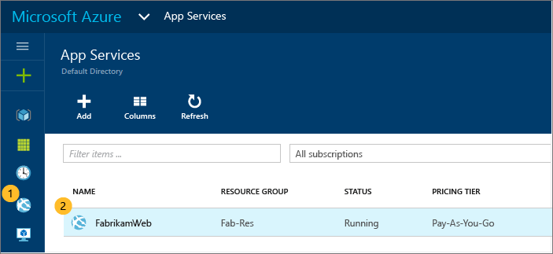
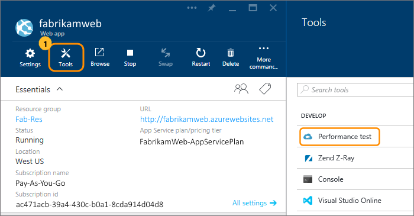
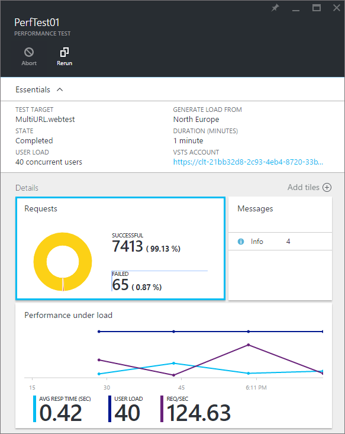
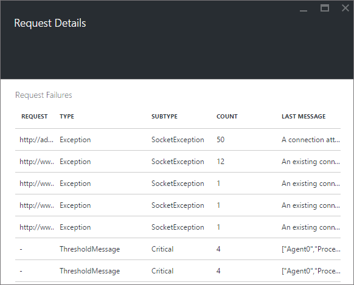
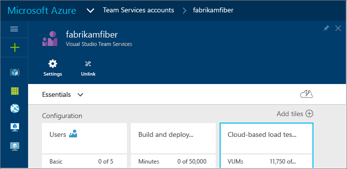

<properties
   pageTitle="Testen Sie Ihre Azure Web-app Leistung | Microsoft Azure"
   description="Führen Sie Azure Web app Leistungstests zum Überprüfen, wie Ihre app Benutzer laden verarbeitet. Messen Sie Antwortzeit, und Suchen nach Fehlern, die möglicherweise Probleme hinweisen."
   services="app-service\web"
   documentationCenter=""
   authors="ecfan"
   manager="douge"
   editor="jimbe"/>

<tags
   ms.service="app-service-web"
   ms.workload="web"
   ms.tgt_pltfrm="na"
   ms.devlang="na"
   ms.topic="article"
   ms.date="05/25/2016"
   ms.author="estfan; manasma; ahomer"/>

# <a name="performance-test-your-azure-web-app-under-load"></a>Leistung testen Auslastung Azure Web app

Überprüfen Sie Ihre Web-app Leistung, bevor Sie es starten oder Herstellung Updates bereitstellen. Auf diese Weise können Sie besser beurteilen, ob Ihre app zum Release bereit ist. Verhalten sicher, dass Ihre app den Datenverkehr während der Höchstwert verwenden oder zu Ihrer nächsten marketing Pushbenachrichtigungen helfen kann.

Bei öffentlichen Vorschau können Sie Leistung testen die app kostenlos im Portal Azure.
Diese Tests simulieren Benutzer beim Laden der App über einen bestimmten Zeitraum und Ihre app Antwort messen. Ergebnisse des beispielsweise anzeigen, wie schnell Ihre app auf eine bestimmte Anzahl von Benutzern reagiert. Außerdem wird gezeigt, wie viele Anfragen fehlgeschlagen ist, die möglicherweise Probleme mit der app angeben.      


## <a name="before-you-start"></a>Bevor Sie beginnen

* Sie benötigen eine [Azure-Abonnement](https://account.windowsazure.com/subscriptions), wenn Sie eine bereits besitzen. Erfahren Sie, wie Sie [ein Azure-Konto kostenlos öffnen](https://azure.microsoft.com/pricing/free-trial/?WT.mc_id=A261C142F)können.

* Sie benötigen ein [Visual Studio Team Services](https://www.visualstudio.com/products/what-is-visual-studio-online-vs) -Konto, um Ihre Leistung Test Verlauf beibehalten. Ein geeignetes Konto wird automatisch erstellt, wenn Sie Ihre Leistung testen einrichten. Sie können ein neues Konto erstellen oder vorhandenes Konto verwenden, wenn Sie der Kontobesitzer sind. 

* Stellen Sie Ihre app zu Testzwecken in einer Umgebung nicht Herstellung bereit. Haben Sie Ihre app ein App-Serviceplan als den Plan Herstellung verwendete verwenden. Auf diese Weise nicht Sie Einfluss auf vorhandenen Kunden oder die app im Herstellung verlangsamen. 

## <a name="set-up-and-run-your-performance-test"></a>Richten Sie ein und führen Sie der Leistung testen aus

0.  Melden Sie sich bei der [Azure-Portal](https://portal.azure.com). Wenn Sie ein Konto für Visual Studio Team Services verwenden, die Sie besitzen, melden Sie sich als Kontobesitzer.

0.  Wechseln Sie zu der Web-app.

    

0.  Wechseln Sie zum **Testen der Leistung**.

    
 
0. Jetzt können Sie ein Konto für [Visual Studio Team Services](https://www.visualstudio.com/products/what-is-visual-studio-online-vs) den Leistung Test Verlauf beibehalten verknüpfen.

    Wenn Sie ein Team Services-Konto verwendet haben, wählen Sie diesem Konto. Wenn Sie nicht möchten, erstellen Sie ein neues Konto.

    

0.  Erstellen der Leistung testen. Legen Sie die Details, und führen Sie den Test. 

Sie können die Ergebnisse in Echtzeit anschauen, während der Test ausgeführt wird.

Nehmen Sie beispielsweise an, dass wir eine app haben, die sich Coupons am letztes Jahr "Feiertag" Verkauf gegeben hat. Dieses Ereignis dauerte 15 Minuten mit einer Höchstwert Auslastung 100 gleichzeitige Kunden. Sollen die Anzahl der Kunden dieses Jahr doppelklicken. Wir möchten Kunden zufrieden zu verbessern, indem Sie die Seite laden Zeit von 5 Sekunden auf 2 Sekunden zu verringern. Testen Sie Ja, unsere aktualisierten app Leistung mit 250 Benutzern 15 Minuten.

Wir werden laden unsere App simulieren, indem Sie virtuelle Benutzer (Kunden) generieren, die finden Sie auf der Microsoft-Website zur gleichen Zeit. Hieraus sehen uns wie viele Anfragen sind weiß nicht oder langsam reagiert.

  

   *  Standard-URL für Ihre Web-app wird automatisch hinzugefügt. 
   Sie können die URL zum Testen von anderen Seiten (nur HTTP GET-Anfragen) ändern.

   *  Lokale Bedingungen simulieren und Wartezeit reduzieren, wählen Sie einen Speicherort für Ihre Benutzer am nächsten zum Generieren von laden.

  So sieht der Test wird ausgeführt. Während der ersten Minute langsamer möchten wir unsere Seite geladen.

  

  Nach Abschluss des Tests lernen wir, dass viel schneller der Seite nach der ersten Minute laden. Auf diese Weise zu identifizieren, in denen wir die Problembehandlung beginnen möchten.

  

## <a name="test-multiple-urls"></a>Testen Sie mehrere URLs

Sie können auch Leistungstests Einbinden von mehreren URLs, die ein End-to-End-Benutzerszenario darstellen durch Hochladen einer Datei Visual Studio Web Test ausführen. Einige der Methoden können Sie Erstellen einer Visual Studio-Web-Test-Datei sind:

* [Datenverkehr mit Fiddler erfassen und als Visual Studio-Web-Test-Datei exportieren](http://docs.telerik.com/fiddler/Save-And-Load-Traffic/Tasks/VSWebTest)
* [Erstellen einer laden Test-Datei in Visual Studio](https://www.visualstudio.com/docs/test/performance-testing/run-performance-tests-app-before-release)

Hochladen, und führen Sie eine Datei für Visual Studio-Web-Test:
 
0. Führen Sie die oben beschriebenen Schritte zum Öffnen Sie des Blades **neue Leistung zu testen** .
   Wählen Sie in diesem Blade die Option CONFIGFURE testen verwenden, um das **Konfigurieren Test mit** Blade zu öffnen.  

    

0. Überprüfen Sie den Typ der TEST auf **Visual Studio Web Test** festgelegt ist, und wählen Sie die HTTP-Archivdatei.
    Verwenden Sie das Symbol "Ordner", um die Datei Ansichtsauswahl Dialogfeld zu öffnen.

    

    Nachdem die Datei hochgeladen wurde, wird die Liste der URLs in der URL Detailabschnitt getestet werden.
 
0. Geben Sie die Benutzer laden und Testen Sie der Dauer, und wählen Sie dann **Test ausgeführt**.

    

    Nachdem der Test abgeschlossen ist, sehen Sie die Ergebnisse in zwei Bereiche an. Im linke Bereich zeigt die Performnace Informationen als eine Reihe von Diagrammen.

    

    Im rechte Bereich zeigt eine Liste mit fehlgeschlagener Anfragen, mit den Typ des Fehlers und wie oft die stattgefunden hat.

    

0. Führen Sie den Test erneut aus, indem Sie auf das Symbol **erneut ausführen** oben im rechten Bereich.

    

##  <a name="q--a"></a>F & A

#### <a name="q-is-there-a-limit-on-how-long-i-can-run-a-test"></a>F: Gibt es eine Beschränkung auf wie lange ich einen Test ausgeführt werden kann? 

**A**: Ja, Ihre Test bis zu einer Stunde im Portal Azure ausgeführt werden kann.

#### <a name="q-how-much-time-do-i-get-to-run-performance-tests"></a>F: wie viel Zeit erhalte Leistungstests ausführen? 

**A**: nach public Preview-Version, werden 20.000 virtueller Benutzer-Minuten (VUMs) kostenlosen jeden Monat mit Ihrem Konto Visual Studio Team Services. Eine VUM ist die Anzahl der virtuellen Benutzer die Anzahl der Minuten in Ihrem Test multipliziert. Wenn Ihre Bedürfnisse den kostenlosen Grenzwert überschreiten, können Sie kaufen mehr Zeit und bezahlen nur für was Sie verwenden.

#### <a name="q-where-can-i-check-how-many-vums-ive-used-so-far"></a>F: Wo kann ich prüfen, wie viele VUMs ich bisher verwendet haben?

**A**: Sie können diesen Betrag im Portal Azure überprüfen.




#### <a name="q-what-is-the-default-option-and-are-my-existing-tests-impacted"></a>F: Was ist die Standardoption und sind meine vorhandene Tests betroffen?

**A**: die Standardoption für Performance Laden überprüft wird einen manuellen Test - derselben vor dem mehrere URL Option testen Portal hinzugefügt wurde.
Die vorhandene Tests weiterhin die konfigurierte URL verwenden und wie zuvor funktionieren.

#### <a name="q-what-features-not-supported-in-the-visual-studio-web-test-file"></a>F: Welche features in der Visual Studio-Web-Test-Datei nicht unterstützt?

**A**: Zurzeit unterstützen dieses Feature nicht Web Test-Plug-ins, Datenquellen und von Extraktionsregeln. Sie müssen Ihre Web Test-Datei, um diese entfernen bearbeiten. Wir hoffen, zum Hinzufügen von Unterstützung für diese Funktionen in zukünftigen Updates.

#### <a name="q-does-it-support-any-other-web-test-file-formats"></a>F: unterstützt wird andere Web Test-Dateiformate?
  
**A**: beim präsentieren nur Visual Studio Web Test Dateien im Format unterstützt werden.
Wir möchten gerne von Ihnen hören, wenn Sie Unterstützung für andere Dateiformate benötigen werden. Uns eine e-Mail an [vsoloadtest@microsoft.com](mailto:vsoloadtest@microsoft.com).

#### <a name="q-what-else-can-i-do-with-a-visual-studio-team-services-account"></a>F: Was kann ich mit einem Visual Studio Team Services-Konto Verfahren?

**A**: um Ihr neues Konto zu finden, wechseln Sie zu ```https://{accountname}.visualstudio.com```. Freigeben von Code, erstellen, testen und Nachverfolgen von Arbeit und Lieferort den Software – alle in der Cloud mithilfe eines beliebigen Tool oder Sprache. Erfahren Sie mehr darüber, wie [Visual Studio Team Services](https://www.visualstudio.com/products/what-is-visual-studio-online-vs) -Features und Dienste Ihr Team einfacher zusammenarbeiten und kontinuierlich bereitstellen.

## <a name="see-also"></a>Siehe auch

* [Einfache Cloud Leistungstests ausführen](https://www.visualstudio.com/docs/test/performance-testing/getting-started/get-started-simple-cloud-load-test)
* [Führen Sie die Leistungstests Apache Jmeter](https://www.visualstudio.com/docs/test/performance-testing/getting-started/get-started-jmeter-test)
* [Zeichnen Sie auf und wiedergeben Sie cloudbasierten Laden überprüft](https://www.visualstudio.com/docs/test/performance-testing/getting-started/record-and-replay-cloud-load-tests)
* [Leistung testen die app in der cloud](https://www.visualstudio.com/docs/test/performance-testing/getting-started/getting-started-with-performance-testing)
