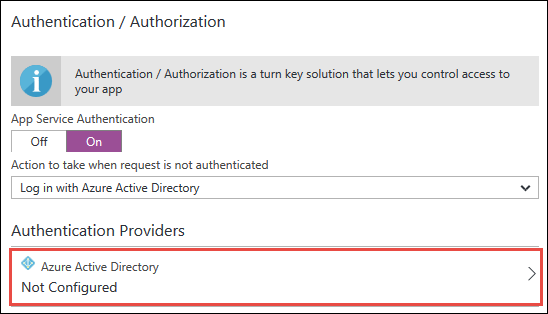
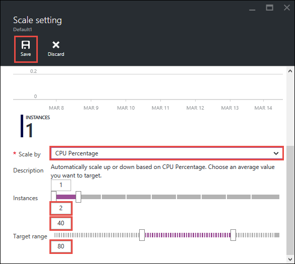

<properties
    pageTitle="Hinzufügen von Funktionen zum ersten Web app"
    description="Hinzufügen von aussagekräftige Features zur ersten Web app in wenigen Minuten."
    services="app-service\web"
    documentationCenter=""
    authors="cephalin"
    manager="wpickett"
    editor=""
/>

<tags
    ms.service="app-service-web"
    ms.workload="web"
    ms.tgt_pltfrm="na"
    ms.devlang="na"
    ms.topic="hero-article"
    ms.date="05/12/2016"
    ms.author="cephalin"
/>

# Hinzufügen von Funktionen zum ersten Web app

In [Ihre erste Azure in fünf Minuten Web app-bereitstellen](app-service-web-get-started.md)bereitgestellt Sie eine Stichprobe Web app auf [App-Verwaltungsdienst Azure](../app-service/app-service-value-prop-what-is.md). In diesem Artikel erhalten Sie einige großartige Funktionen schnell bereitgestellten Web app hinzufügen. In wenigen Minuten führen Sie folgende Aktionen ausführen:

- Erzwingen der Authentifizierung für Ihre Benutzer
- Ihre app automatisch skalieren
- erhalten von Benachrichtigungen für die Leistung der app

Unabhängig davon, welche Beispiel-app, die Sie in diesem Artikel bereitgestellt, können Sie im Lernprogramm folgen.

Die drei Aktivitäten in diesem Lernprogramm sind nur ein paar Beispiele für die viele praktische Funktionen, die Sie erhalten, wenn Sie die Web app im App-Dienst setzen. Viele der Funktionen stehen in der Ebene **Free** (das ist was Ihre erste Web app ausgeführt wird), und Sie Ihre Testversion Gutschriften zum Testen von Features, die erfordern Preise höher stufen verwenden können. Unterliegen Web app in **Free** Ebene bleibt, es sei denn, Sie explizit an eine andere Preisgestaltung Ebene ändert.

>[AZURE.NOTE] Die Web-app mit Azure CLI erstellten **Free** Ebene, die nur eine Instanz der freigegebenen virtueller Computer mit Serverressourcen ermöglicht wird ausgeführt. Weitere Informationen Sie mit **Free** Ebene erhalten finden Sie unter [Grenzwerte für App-Dienst](../azure-subscription-service-limits.md#app-service-limits).

## Ihre Benutzer authentifiziert

Nun sehen, wie einfach es ist, Authentifizierung zu Ihrer Anwendung (Lektüre am [App Dienst Authentifizierung/Autorisierung](https://azure.microsoft.com/blog/announcing-app-service-authentication-authorization/)) hinzufügen.

1. Klicken Sie in das Portal Blade für Ihre app, die Sie soeben geöffnet, und klicken Sie auf **Einstellungen** > **Authentifizierung / Autorisierung**.  
    

2. Klicken Sie **auf** Authentifizierung aktivieren.  

4. Klicken Sie im Dialogfeld **Authentifizierungsanbieter**auf **Azure Active Directory**.  
    

5. Klicken Sie in das Blade **Azure-Active Directory-Einstellungen** klicken Sie auf **Express**und dann auf **OK**. Erstellen Sie ein neues Standardeinstellungen Azure AD-Anwendung in Ihrem standardmäßigen Verzeichnis.  
 

6. Klicken Sie auf **Speichern**.  
    

    Nachdem die Änderung erfolgreich ist, sehen Sie die Benachrichtigung Bell Grün, zusammen mit einer angezeigten Meldung aktivieren.

7. Zurück in das Portal Blade der app klicken Sie auf die **URL** -Verknüpfung (oder **wechseln** Sie in der Menüleiste). Die Verknüpfung ist eine HTTP-Adresse.  
      
    Aber, nachdem sie die app in einer neuen Registerkarte geöffnet wird, wird die URL im Feld leitet mehrmals und endet an Ihre app mit HTTPS-Adresse. Was sind Sie sehen, dass Sie bereits sind angemeldet ist für Ihr Abonnement Azure, und Sie werden automatisch in der app authentifiziert.  
      
    Also, wenn Sie nun eine nicht authentifizierte Sitzung in einen anderen Browser öffnen, wird einen Anmeldebildschirm angezeigt, wenn Sie dieselbe URL navigieren.  
    <!--   -->
   Sie nie etwas mit Azure Active Directory vorgenommen haben, müssen Ihr Standardverzeichnis keine Azure AD-Benutzer. In diesem Fall ist das einzige Konto in dort wahrscheinlich das Microsoft-Konto mit Ihrem Azure-Abonnement. Warum wird Sie automatisch die app im selben Browserfenster zuvor angemeldet wurden.
   Das Microsoft-Konto können Sie auf dieser Seite Login sowie anmelden.

Herzlichen Glückwunsch, werden die gesamten Verkehr zu Ihrem Web app Authentifizierung.

Haben Sie möglicherweise bemerkt der **Authentifizierung / Autorisierung** Blade, die die vieles mehr wie möglich:

- Aktivieren der Anmeldung für soziale Netzwerke
- Aktivieren Sie mehrerer Anmeldeoptionen
- Ändern Sie das Standardverhalten, wenn Personen zuerst navigieren Sie zu Ihrer Anwendung

App-Dienst bietet eine einsatzbereiten Lösung für einige der allgemeinen Authentifizierung muss, damit Sie nicht die Authentifizierungslogik selbst bereitstellen.
Weitere Informationen finden Sie unter [App Dienst Authentifizierung/Autorisierung](https://azure.microsoft.com/blog/announcing-app-service-authentication-authorization/).

## Skalieren Sie Ihre app automatisch basierend auf demand

Nächste, lassen Sie uns automatisch Skalieren der app, damit sie ihn Kapazität reagieren auf Benutzer bei Bedarf (Lektüre am [Skalieren Ihrer App in Azure](web-sites-scale.md) und [Skalieren der Anzahl der Instanzen manuell oder automatisch](../monitoring-and-diagnostics/insights-how-to-scale.md)) automatisch angepasst werden.

Kurz gesagt skalieren Sie Ihre Web app auf zwei Arten:

- [Skalieren](https://en.wikipedia.org/wiki/Scalability#Horizontal_and_vertical_scaling): erhalten Sie weitere CPU, Speicher, Speicherplatz und zusätzliche Features wie dedizierten virtuellen Computern, benutzerdefinierte Domänen und Zertifikate, das staging Steckplätze, automatische Skalierung und mehr. Sie Skalierung durch Ändern der Preisgestaltung Ebene von der App-Serviceplan, Ihre app gehört.
- [Skalierung](https://en.wikipedia.org/wiki/Scalability#Horizontal_and_vertical_scaling): die Anzahl der virtuellen Computer erhöhen, die ausgeführt werden Ihre app Instanzen.
Sie können bis zu 50 gehörendes je nach Ihrem Partner-Level Preisgestaltung skalieren.

Darstellung richten Sie uns automatische Skalierung.

1. Zunächst uns Skalieren von Automatische Skalierung aktivieren. In dem Portal Blade der app, klicken Sie auf **Einstellungen** > **Skalierung nach oben (App planen Service)**.  
    

2. Führen Sie einen Bildlauf aus, und wählen Sie die **Standardmäßigen S1** Ebene der niedrigsten Ebene, die automatische Skalierung (Eingekreiste in Screenshot) unterstützt, und klicken Sie auf **auswählen**.  
    

    Schon Skalierung nach oben.

    >[AZURE.IMPORTANT] Diese Ebene expends Ihrer kostenlosen Testversion Gutschriften an. Wenn Sie eine Bezahlung pro Einsatz-Konto besitzen, bringt jedoch Gebühren bei Ihrem Konto an.

3. Als Nächstes konfigurieren wir automatische Skalierung. In dem Portal Blade der app, klicken Sie auf **Einstellungen** > **Dezimalstellen ab (App planen Service)**.  
    

4. Ändern Sie **nach skalieren** auf **Prozentsatz der CPU**an. Entsprechend den Schieberegler unterhalb der Dropdown-Liste zu aktualisieren. Definieren Sie anschließend einen Bereich **Instanzen** zwischen **1** und **2** und einem **Zielbereich** zwischen **40** und **80**. Führen Sie es aus, indem Sie in den Feldern eingeben oder indem Sie den Schieberegler.  
 

    Auf Grundlage dieser Konfiguration die app wird automatisch skaliert Wenn CPU-Auslastung mehr als 80 beträgt % und skaliert werden, wenn Sie weniger als 40 % CPU-Auslastung ist.

5. Klicken Sie in der Menüleiste auf **Speichern** .

Herzlichen Glückwunsch, Ihre app ist automatische Skalierung.

In der **Skalierungseinstellungen** Blade aufgefallen, denen die vieles mehr wie möglich:

- Manuelles skalieren Sie auf eine bestimmte Anzahl von Instanzen
- Skalieren Sie, indem Sie andere Performance-Werte, wie z. B. Arbeitsspeicher Prozentsatz oder die Festplatte Warteschlange
- Passen Sie Anpassungsbereich für Verhalten an, wenn eine Leistungsregel ausgelöst wird
- Automatisch skalieren nach einem Zeitplan
- Legen Sie automatische Skalierung Verhalten für eine zukünftige Veranstaltung

Weitere Informationen zum Einrichten Ihrer app Skalierung finden Sie unter [Skalieren Ihrer App in Azure](../app-service-web/web-sites-scale.md). Weitere Informationen zum Skalierung finden Sie unter [Skalieren der Anzahl der Instanzen manuell oder automatisch](../monitoring-and-diagnostics/insights-how-to-scale.md).

## Erhalten von Benachrichtigungen für Ihre app

Jetzt, da Ihre app ist automatische Skalierung, was passiert, wenn sie die Anzahl der maximalen Instanzen (2) erreicht und CPU über die gewünschte Auslastung (80 %)?
Sie können eine Benachrichtigung (Lektüre am [empfangen-Benachrichtigung](../monitoring-and-diagnostics/insights-receive-alert-notifications.md)) einrichten, informieren über diese Situation, sodass Sie weiter oben/aus der app, beispielsweise skaliert werden können. Lassen Sie uns schnell Einrichten einer Benachrichtigung für dieses Szenario.

1. Klicken Sie auf **Extras**, in dem Portal Blade der app, > **Benachrichtigungen**.  
    

2. Klicken Sie auf die **Benachrichtigung hinzufügen**. Wählen Sie dann in das Feld **Ressourcen** der Ressource, die mit **(Serverfarms)**endet. Dies ist Ihre App-Serviceplan.  
    

3. Geben Sie die **Namen** folgendermaßen `CPU Maxed`, **Metrik** als **Prozentsatz der CPU**und dem **Schwellenwert** als `90`, wählen Sie dann **e-Mail-Besitzer, Mitwirkenden, und Leser**, und klicken Sie dann auf **OK**.   
 

    Wenn Azure abgeschlossen ist, erstellen die Benachrichtigung, sehen Sie es in das Blade **Benachrichtigungen** .  
    

Herzlichen Glückwunsch, Sie sind jetzt Benachrichtigungen erhalten.

Diese Einstellung benachrichtigen überprüft CPU-Auslastung fünf Minuten. Wenn die Zahl über 90 % geht, erhalten Sie eine e-Mail-Benachrichtigung, sowie Personen, die autorisiert ist. Um alle anzuzeigen, die berechtigt ist, die Benachrichtigungen erhalten möchten, kehren Sie zu dem Portal Blade der app, und klicken Sie auf die Schaltfläche **Zugriff** .  

**Abonnement Administratoren** sind bereits der **Besitzer** der app sollte angezeigt werden. Dieser Gruppe zählen Sie, wenn Sie das Kontoadministrator Ihres Azure-Abonnements (z. B. Ihr Testabonnement) sind. Weitere Informationen zu Azure rollenbasierte Access Control finden Sie unter [Azure_Role-Based Access Control](../active-directory/role-based-access-control-configure.md).

> [AZURE.NOTE] Warnungsregeln ist ein Azure Feature. Weitere Informationen finden Sie unter [-Benachrichtigung empfangen](../monitoring-and-diagnostics/insights-receive-alert-notifications.md).

## Nächste Schritte

Klicken Sie auf zurecht so konfigurieren Sie die Benachrichtigung eine umfangreiche Sammlung von Tools in der **Tools** Blade aufgefallen. Sie können hier beheben Leistung überwachen, Probleme Schwachstellen prüfen, Ressourcen verwalten, interagieren mit der Verwaltungskonsole virtueller Computer und hilfreiche Erweiterungen hinzufügen. Wir möchten Sie einladen, klicken Sie auf jede dieser Tools, um die einfache und dennoch leistungsfähige Tools an Ihre Finger Tipps zu ermitteln.

Erfahren Sie, wie mehr erreichen bereitgestellten-App. Hier ist nur eine Teilliste aus:

- [Kaufen, und konfigurieren einen benutzerdefinierten Domänennamen](custom-dns-web-site-buydomains-web-app.md) - kaufen eine attraktive Domäne für Ihre Web-app, anstatt die *. azurewebsites.net Domäne. Oder eine Domäne, die Sie bereits verwenden.
- [Einrichten von staging-Umgebungen](web-sites-staged-publishing.md) - Ihre app staging-URL bereitstellen, bevor Sie es in Betrieb. Aktualisieren Sie Ihre live-Web app ohne Sicherheitsrisiko aus. Richten Sie eine weiter verfeinern DevOps-Lösung mit mehreren der Bereitstellung.
- [Einrichten von kontinuierlichen Bereitstellung](app-service-continuous-deployment.md) - Bereitstellung der app in Ihrem System Steuerelement integrieren. Bereitstellen Sie in Azure mit jeder Commit ausführen.
- [Zugriff auf lokale Ressourcen](web-sites-hybrid-connection-get-started.md) - Zugriff eine vorhandene lokale Datenbank oder CRM-System.
- [Sichern Sie Ihre app](web-sites-backup.md) - Back einrichten und Wiederherstellung für Web app. Vorbereiten für unerwartete Fehler und behoben werden können.
- [Aktivieren von Diagnoseprotokollen](web-sites-enable-diagnostic-log.md) - lesen Sie die IIS-Protokolle aus Azure oder Anwendung auf. In einem Stream zu lesen, diese herunterladen oder diese [Anwendung Einblicke](../application-insights/app-insights-overview.md) in für die Analyse von einsatzbereiten port.
- [Scannen Sie Ihre app-Anfälligkeiten](https://azure.microsoft.com/blog/web-vulnerability-scanning-for-azure-app-service-powered-by-tinfoil-security/) -
Web app gegen moderne mithilfe von [Folie Sicherheit](https://www.tinfoilsecurity.com/)bereitgestellten scannen.
- [Hintergrund Einzelvorgänge ausführen](../azure-functions/functions-overview.md) - Ausführen von Projekten für Datenverarbeitung, reporting usw..
- [Erfahren Sie, wie funktioniert der App-Dienst](../app-service/app-service-how-works-readme.md)
