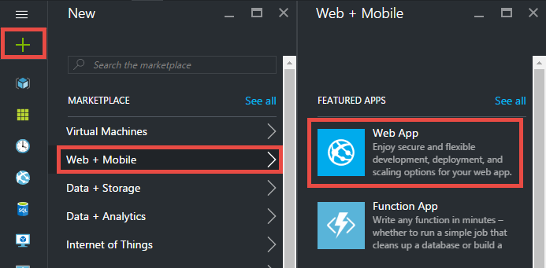
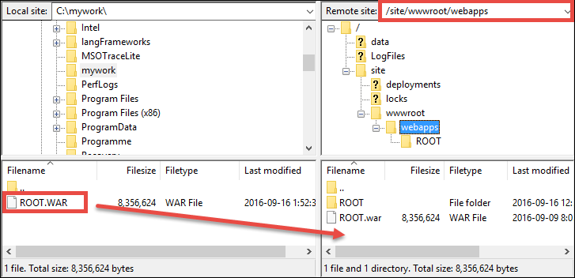

<properties 
    pageTitle="Bereitstellen von der ersten Java Web app für Azure in fünf Minuten | Microsoft Azure" 
    description="Erfahren Sie, wie einfach es ist, Web apps in App-Dienst ausführen, indem Sie eine Beispiel-app. Starten Sie real Entwicklung schnell ausführen und sehen Sie Ergebnisse sofort." 
    services="app-service\web"
    documentationCenter=""
    authors="cephalin"
    manager="wpickett"
    editor=""
/>

<tags
    ms.service="app-service-web"
    ms.workload="web"
    ms.tgt_pltfrm="na"
    ms.devlang="na"
    ms.topic="hero-article"
    ms.date="10/13/2016" 
    ms.author="cephalin"
/>
    
# Bereitstellen von der ersten Java Web app für Azure in fünf Minuten

In diesem Lernprogramm hilft Ihnen, eine einfache Java Web app für [App-Verwaltungsdienst Azure](../app-service/app-service-value-prop-what-is.md)bereitstellen.
App-Dienst können Sie um Web-apps, [mobile-app sichern enden](/documentation/learning-paths/appservice-mobileapps/)und [API-apps](../app-service-api/app-service-api-apps-why-best-platform.md)zu erstellen.

Sie werden: 

- Erstellen einer Web-app in Azure-App-Dienst an.
- Bereitstellen einer Stichprobe Java-app.
- Finden Sie unter Code in Herstellung live ausgeführt.

## Erforderliche Komponenten

- Abrufen von einem FTP-/ FTPS-Client, z. B. [FileZilla](https://filezilla-project.org/).
- Erhalten eines Microsoft Azure-Kontos an. Wenn Sie kein Konto haben, können Sie [Sie sich für eine kostenlose Testversion](/pricing/free-trial/?WT.mc_id=A261C142F) oder [die Vorteile Ihres Visual Studio Abonnenten aktivieren](/pricing/member-offers/msdn-benefits-details/?WT.mc_id=A261C142F).

>[AZURE.NOTE] Sie können [App-Verwaltungsdienst versuchen](http://go.microsoft.com/fwlink/?LinkId=523751) , ohne ein Azure-Konto. Erstellen Sie eine app Starter und wiedergeben Sie keine Kreditkarte erforderlich, keine Zusagen mit für bis zu einer Stunde –.

## Erstellen Sie eine Web-app

1. Melden Sie sich mit Ihrem Konto Azure- [Azure-Portal](https://portal.azure.com) aus.

2. Klicken Sie auf **neu**, wählen Sie im Menü links > **Web + Mobile** > **Web App**.

    

3. Verwenden Sie in der app Erstellung Blade die folgenden Einstellungen für Ihre neue app aus:

    - **App-Name**: Geben Sie einen eindeutigen Namen ein.
    - **Ressourcengruppe**: Wählen Sie **neu erstellen** und benennen Sie der Ressourcengruppe aus.
    - **App-Dienst Plan/Speicherort**: Klicken Sie auf ihn konfigurieren und dann auf **Neu erstellen** , um die Name, Position und Preisgestaltung Ebene von der App-Serviceplan festlegen. Die Preise Stufe **Free** verwenden können.

    Wenn Sie fertig sind, sollte Ihre app Erstellung Blade wie folgt aussehen:

    

3. Klicken Sie unten auf **Erstellen** . Sie können **das Benachrichtigungssymbol nach oben, um den Fortschritt anzeigen** klicken.

    

4. Wenn die Bereitstellung abgeschlossen ist, sollte diese Benachrichtigung angezeigt werden. Klicken Sie auf die Nachricht, um die Bereitstellung des Blade zu öffnen.

    

5. Klicken Sie in der Blade- **Bereitstellung erfolgreich verlaufen ist** auf die **Ressource** -Link, um Ihre neue Web app Blade öffnen.

    

## Bereitstellen einer Java-app zu Ihrer Web app

Jetzt, lassen Sie uns Bereitstellen einer Java-app in Azure FTPS verwenden.

5. Führen Sie einen Bildlauf nach unten bis zum **Anwendungseinstellungen** oder suchen sie das Web app-Blade und anschließend klicken Sie darauf. 

    

6. **Java-Version**wählen Sie **Java 8** aus, und klicken Sie auf **Speichern**.

    

    Wenn Sie die **Aktualisierung erfolgreich Web app-Einstellungen**Benachrichtigung erhalten möchten, navigieren Sie zu http://*&lt;Appname >*. azurewebsites.net das standardmäßige JSP Servlet in Aktion sehen.

7. Wieder in das Web app-Blade führen Sie einen Bildlauf nach unten bis zum **Bereitstellung Anmeldeinformationen** oder dafür suchen und dann klicken Sie darauf.

8. Legen Sie Ihre Anmeldeinformationen für die Bereitstellung, und klicken Sie auf **Speichern**.

7. Klicken Sie in das Web app-Blade auf **Übersicht**. Klicken Sie neben **FTP-Bereitstellung/Benutzername** und **FTPS Hostname**auf die Schaltfläche **Kopieren** , um diese Werte zu kopieren.

    

    Sie nun können Ihre Java-app mit FTPS bereitstellen.

8. Melden Sie in Ihrem FTP-/ FTPS-Client sich mit Ihrer Azure Online FTP-Server mit den Werten, die Sie im letzten Schritt kopiert haben. Verwenden Sie das Bereitstellung Kennwort ein, das Sie zuvor erstellt haben.

    Das folgende Bildschirmabbild zeigt FileZilla mit anmelden.

    

    Sicherheit Warnungen für das unbekannte SSL-Zertifikat aus Azure wird angezeigt. Fortfahren und Vorgang fortsetzen.

9. Klicken Sie auf [diesen Link](https://github.com/Azure-Samples/app-service-web-java-get-started/raw/master/webapps/ROOT.war) , um die WAR-Datei auf Ihrem lokalen Computer herunterzuladen.

9. Navigieren Sie in Ihrem FTP-/ FTPS-Client zu **/site/wwwroot/webapps** der remote-Website, und ziehen Sie die heruntergeladene WAR-Datei auf Ihrem lokalen Computer in remote-Verzeichnis.

    

    Klicken Sie auf **OK** , um die Datei in Azure außer Kraft setzen.

    >[AZURE.NOTE] Nach Maßgabe des Tomcat Standardverhalten, Filename **ROOT.war** in /site/wwwroot/webapps bietet Ihnen die Quadratwurzel Web app (http://*&lt;Appname >*. azurewebsites.net), und den Dateinamen ** * &lt;EinName >*.war** bietet Ihnen eine benannte Web app (http://*&lt;Appname >*.azurewebsites.net/*&lt;EinName >*).

Das war's schon! Ihre Java-app ist jetzt live in Azure ausgeführt. Navigieren Sie in Ihrem Browser zu http://*&lt;Appname >*. azurewebsites.net ihn in Aktion sehen. 

## Stellen Sie Aktualisierungen zu Ihrer Anwendung

Immer, wenn Sie ein Update vornehmen müssen, nur Hochladen der neuen WAR-Datei im selben remote Verzeichnis mit Ihren Kunden FTP-/ FTPS an.

## Nächste Schritte

[Erstellen einer Java-Web-app aus einer Vorlage in der Azure Marketplace](web-sites-java-get-started.md#marketplace). Sie können eigene vollständig anpassbaren Tomcat Container abrufen und der vertrauten Manager-UI erhalten. 

Debuggen Sie Azure Web app, direkt in [IntelliJ](app-service-web-debug-java-web-app-in-intellij.md) oder [Ellipse](app-service-web-debug-java-web-app-in-eclipse.md).

Oder möchten Sie Ihre erste Web app. Beispiel:

- Testen Sie [andere Methoden zum Bereitstellen von Codes in Azure](../app-service-web/web-sites-deploy.md)aus. 
- Nehmen Sie Ihre Azure-app auf die nächste Ebene an. Ihre Benutzer authentifiziert. Anzahl der Dezimalstellen bei Bedarf zugrunde liegenden. Richten Sie einige Leistung Benachrichtigungen aus. Alle mit wenigen Mausklicks. Finden Sie unter [Hinzufügen von Funktionen zum ersten Web app](app-service-web-get-started-2.md).

