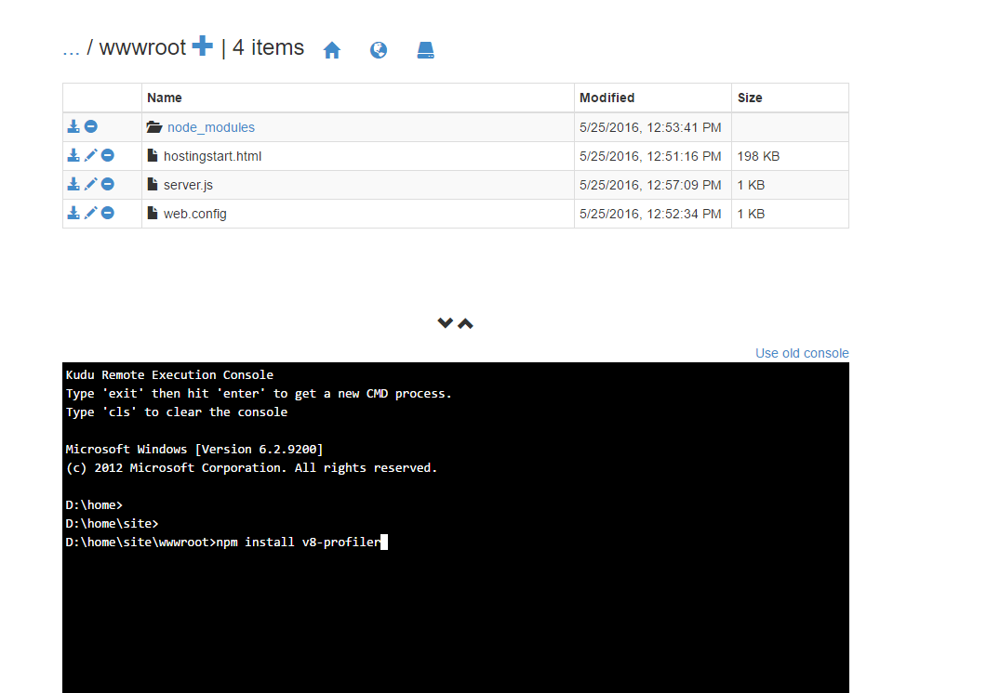
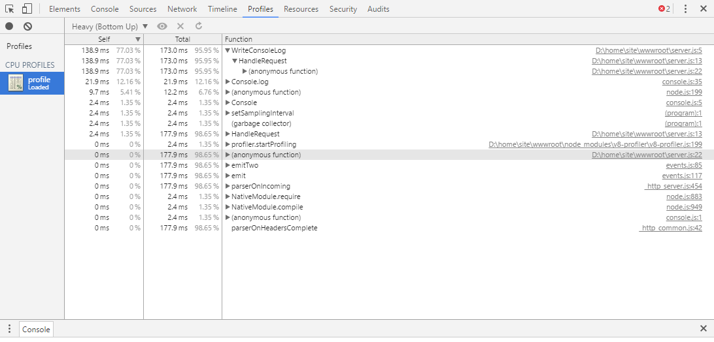

<properties
    pageTitle="Bewährte Methoden und zur Problembehandlung Leitfaden für Applikationen Knoten auf Azure Web Apps"
    description="Erfahren Sie, den bewährten Methoden und Schritte zur Problembehandlung für Applikationen Knoten auf Azure Web Apps."
    services="app-service\web"
    documentationCenter="nodejs"
    authors="ranjithr"
    manager="wadeh"
    editor=""/>

<tags
    ms.service="app-service-web"
    ms.workload="web"
    ms.tgt_pltfrm="na"
    ms.devlang="nodejs"
    ms.topic="article"
    ms.date="06/06/2016"
    ms.author="ranjithr;wadeh"/>
    
# <a name="best-practices-and-troubleshooting-guide-for-node-applications-on-azure-web-apps"></a>Bewährte Methoden und zur Problembehandlung Leitfaden für Applikationen Knoten auf Azure Web Apps

[AZURE.INCLUDE [tabs](../../includes/app-service-web-get-started-nav-tabs.md)]

In diesem Artikel lernen Sie bewährte Methoden und Schritte zur Problembehandlung für [Applikationen Knoten](app-service-web-nodejs-get-started.md) Azure Webapps (mit [Iisnode](https://github.com/azure/iisnode)) ausgeführt.

>[AZURE.WARNING] Verwenden Sie Schritte zur Problembehandlung auf Ihrer Website Herstellung. Problembehandlung bei der app auf einem Produktionseinstellungen beispielsweise Ihre staging Slot und wenn das Problem behoben wird, austauschen Ihrer staging Slot mit der Herstellung Slot wird empfohlen.

## <a name="iisnode-configuration"></a>IISNODE Konfiguration

Diese [Schemadatei](https://github.com/Azure/iisnode/blob/master/src/config/iisnode_schema_x64.xml) zeigt alle Einstellungen, die für Iisnode konfiguriert werden können. Einige der Einstellungen, die für eine Anwendung nützlich sind:

* nodeProcessCountPerApplication

    Diese Einstellung steuert die Anzahl der Knoten Prozessen, die pro IIS-Anwendung gestartet werden. Standardwert ist 1. Sie können beliebig viele Node.exe als die Anzahl der virtuellen Computer Core starten, indem Sie diese Einstellung auf 0. Empfohlene Wert ist 0 für die meisten Anwendung, sodass Sie alle Kerne auf Ihrem Computer nutzen können. Node.exe ist single threaded, damit eine node.exe einem Maximum von 1 Core sowie optimale Leistung von Ihrer Anwendung Knoten sinnvoll ist alle Kerne nutzen nutzen.

* nodeProcessCommandLine

    Diese Einstellung steuert den Pfad für die node.exe. Sie können diesen Wert auf die Version node.exe verweisen festlegen.

* maxConcurrentRequestsPerProcess

    Diese Einstellung steuert die maximale Anzahl von gleichzeitige Anforderungen von Iisnode an jeder node.exe gesendet wird. Auf Azure Webapps ist der Standardwert für diese Infinite. Sie müssen nicht zu dieser Einstellung zu sorgen. Außerhalb Azure Webapps ist der Standardwert 1024. Möglicherweise möchten dies konfigurieren, je nachdem wie viele anfordert, dass eine Anwendung erhält und wie schnell die Anwendung jede Anforderung verarbeitet werden.

* maxNamedPipeConnectionRetry

    Diese Einstellung steuert die maximale Anzahl an, wie oft Iisnode alle Verbindung der benannten Pipe zum Senden der Anforderung über zu node.exe wiederholt wird. Diese Einstellung in Kombination mit NamedPipeConnectionRetryDelay bestimmt das gesamte Timeout jeder Anforderung in Iisnode. Standardwert ist 200 auf Azure Webapps. Gesamte Timeout in Sekunden = (MaxNamedPipeConnectionRetry \* NamedPipeConnectionRetryDelay) / 1000

* namedPipeConnectionRetryDelay

    Diese Einstellung steuert die Menge des Iisnode Zeit (in Millisekunden) zwischen den einzelnen "Wiederholen", um die Anforderung an node.exe über die named Pipe senden wartet. Standardwert ist 250ms.
    Gesamte Timeout in Sekunden = (MaxNamedPipeConnectionRetry \* NamedPipeConnectionRetryDelay) / 1000

    Standardmäßig ist das gesamte Timeout in Iisnode auf Azure Webapps 200 \* 250ms = 50 Sekunden.

* logDirectory

    Diese Einstellung steuert Verzeichnis, in dem Iisnode Stdout/Stderr protokolliert. Standardwert ist Iisnode also relativ zu dem Hauptfenster Skriptverzeichnis (Verzeichnis, in dem Hauptfenster server.js vorhanden ist)

* debuggerExtensionDll

    Diese Einstellung steuert, welche Version von Knoten-Inspektor Iisnode beim Debuggen Ihrer Anwendung Knoten verwendet wird. Iisnode-Inspektor-0.7.3.dll und Iisnode-inspector.dll sind derzeit nur 2 gültige Werte für diese Einstellung. Standardwert ist Iisnode-Inspektor-0.7.3.dll. Iisnode-Inspektor-0.7.3.dll Version verwendet Knoten-Inspektor-0.7.3 und Websockets, sodass Sie Websockets auf Ihre Azure Webapp mit dieser Version aktivieren werden müssen. Finden Sie unter <http://www.ranjithr.com/?p=98> Weitere Details zum Konfigurieren von Iisnode, um den neuen Knoten-Inspektor verwenden.

* flushResponse

    Das Standardverhalten der IIS ist, dass sie die Antwort Datenpuffer von 4 MB vor dem leeren oder bis zum Ende der Antwort, je nachdem, was nicht erfolgt ist. Iisnode bietet eine Konfigurations-Einstellung, um dieses Verhalten außer Kraft setzen: um ein Fragment der Antwort Entität Stelle zu leeren, sobald Iisnode aus node.exe empfängt, müssen Sie festlegen der iisnode/@flushResponse Attribut in web.config auf "True":
    
    ```
    <configuration>    
        <system.webServer>    
            <!-- ... -->    
            <iisnode flushResponse="true" />    
        </system.webServer>    
    </configuration>
    ```

    Aktivieren von jeder Fragment der Antwort Entität Stelle leeren Leistung Verwaltungsaufwand, der reduziert den Durchsatz des Systems um ~ 5 % (Stand v0.1.13), addiert, sodass es empfiehlt sich, diese Einstellung nur für Endpunkte Bereich, die Antwort streaming erfordern (z. B. unter Verwendung der <location> Element in der Datei web.config)

    Darüber hinaus müssen für das streaming von Applications, Sie auch von Ihrem Iisnode Ereignishandler ResponseBufferLimit auf 0 festgelegt.
    
    ```
    <handlers>    
        <add name="iisnode" path="app.js" verb="\*" modules="iisnode" responseBufferLimit="0"/>    
    </handlers>
    ```

* watchedFiles

    Dies ist eine durch Semikolons getrennte Liste von Dateien, die für Änderungen überwacht werden. Eine Änderung an einer Datei bewirkt, dass die Anwendung Papierkorb. Jeder Eintrag besteht aus einer optionalen Verzeichnisnamen plus erforderlichen Dateinamen die relativ zu dem Verzeichnis sind, wo sich der Hauptfenster der Anwendungseinstiegspunkt befindet. Platzhalter sind in der Datei Namen Anteil nur zulässig. Standardwert ist "\*. js;web.config"

* recycleSignalEnabled

    Standardwert ist "false". Wenn aktiviert, Ihrer Anwendung Knoten kann eine Verbindung mit einer benannten Pipe (Umgebungsvariable IISNODE\_Steuerelement\_senkrechter Strich) und Senden einer Nachricht "Papierkorb". Dadurch wird die w3wp freizugebenden ordnungsgemäß.

* idlePageOutTimePeriod

    Standardwert ist 0, was bedeutet, dass dieses Feature deaktiviert ist. Beim Festlegen auf einen Wert größer als 0, wird Iisnode sich alle untergeordneten Prozesse alle 'IdlePageOutTimePeriod' Millisekunden Seite. Um zu verstehen, welche Seite, bedeutet, lesen Sie diese [Dokumentation](https://msdn.microsoft.com/library/windows/desktop/ms682606.aspx). Diese Einstellung wird für Applikationen hilfreich sein, die viele Arbeitsspeicher nutzen und ausgehende Seite Speicher auf den Datenträger Gelegentlich möchten, um einige RAM freizugeben.

>[AZURE.WARNING] Vorsichtig, wenn Sie die folgenden Einstellungen Konfiguration Herstellung Applikationen aktivieren. Es wird empfohlen, nicht auf live Herstellung Applications zu aktivieren.

* debugHeaderEnabled

    Der Standardwert ist "false". Wenn festlegen, um Iisnode wahr ist, wird jeder HTTP-Antwort eine HTTP-Antwort Kopfzeile Iisnode-Debuggen hinzufügen wird gesendet, dass der Iisnode-Debuggen Kopfzeile Wert einer URL ist. Einzelnen Bestandteile der Diagnoseinformationen können gelesenen werden, indem Sie die URL-Fragment, aber eine viel bessere Visualisierung erreichen Sie durch die URL im Browser öffnen.

* loggingEnabled

    Diese Einstellung steuert die Protokollierung von Stdout und Stderr durch Iisnode. Iisnode wird Stdout/Stderr aus Knoten Prozessen, die es startet erfassen und in der Einstellung 'LogDirectory' angegebene Verzeichnis schreiben. Nachdem Sie hier aktivieren Ihrer Anwendung wird Protokolle schreiben, auf das Dateisystem und abhängig von der Menge der Protokollierung durch die Anwendung fertig, Leistung Auswirkungen könnte.

* devErrorsEnabled

    Standardwert ist "false". Wenn festlegen, um WAHR, Iisnode die HTTP-Statuscode und Win32-Fehlercode in Ihrem Browser angezeigt werden. Der Win32-Code wird in Debuggen von bestimmter Typen von Problemen hilfreich sein.
    
* DebuggingEnabled (live Herstellung Website nicht aktivieren)

    Diese Einstellung steuert Debuggen Funktion. Iisnode ist Knoten-Inspektor integriert. Diese Einstellung aktivieren, aktivieren Sie das Debuggen von Ihrer Anwendung Knoten. Nachdem Sie diese Einstellung aktiviert ist, Iisnode wird Layout die notwendigen Knoten-Inspektor Dateien im Verzeichnis 'DebuggerVirtualDir' bei der ersten Debuggen Anforderung an Ihrer Anwendung Knoten. Sie können den Knoten-Inspektor durch Senden einer Anforderung an http://yoursite/server.js/debug laden. Sie können das Debuggen URL Segment mit 'DebuggerPathSegment' Einstellung steuern. Nach Standard DebuggerPathSegment = 'Debuggen'. Sie können dies in einen GUID beispielsweise festlegen, damit sie von anderen gefunden werden schwieriger ist.

    Überprüfen Sie diesen [Link](https://tomasz.janczuk.org/2011/11/debug-nodejs-applications-on-windows.html) für weitere Details für das Debuggen.

## <a name="scenarios-and-recommendationstroubleshooting"></a>Szenarien und Empfehlungen/Problembehandlung

### <a name="my-node-application-is-making-too-many-outbound-calls"></a>Meine Anwendung Knoten macht zu viele ausgehende Anrufe.

Viele Clientanwendungen würden, ausgehende Verbindungen als Teil ihrer regulären Betrieb vornehmen möchten. Beispielsweise, wenn eine Anforderung eingeht, möchten Ihre app Knoten wenden Sie sich an einem REST-API an anderer Stelle und erhalten Sie einige Informationen für die Anforderung. Würde einen aktiv bleiben-Agent verwenden möchten beim http oder Https aufrufen. Beispielsweise können Sie das Modul Agentkeepalive beantwortet Ihre aktiv bleiben, wenn Sie diese ausgehende Anrufe vornehmen. Dadurch wird sichergestellt, dass die Sockets auf Ihre Azure Webapp virtueller Computer wiederverwendet werden und den Aufwand für das Erstellen von neuen Sockets für jede ausgehende Anforderung verringern. Darüber hinaus wird dadurch sichergestellt, dass Sie weniger Anzahl Sockets viele ausgehende anzufordern und können daher nicht Sie die MaxSockets, die pro virtueller Computer zugewiesen sind überschreiten. Empfehlungen auf Azure Webapps wäre für insgesamt 160 Sockets pro virtueller Computer den AgentKeepAlive MaxSockets-Wert festzulegen. Dies bedeutet, dass wenn Sie 4 node.exe des virtuellen Computers ausgeführt haben, Sie möchten die AgentKeepAlive MaxSockets zu 40 pro node.exe festlegen möchten 160 pro virtueller Computer insgesamt also ein.

Beispiel für eine AgentKeepALive Konfiguration:

```
var keepaliveAgent = new Agent({    
    maxSockets: 40,    
    maxFreeSockets: 10,    
    timeout: 60000,    
    keepAliveTimeout: 300000    
});
```

In diesem Beispiel wird davon ausgegangen, dass Sie 4 node.exe Ihrer virtuellen Computers ausgeführt haben. Wenn Sie dieselbe Anzahl von node.exe des virtuellen Computers ausgeführt haben, müssen Sie die MaxSockets entsprechend zu ändern.

### <a name="my-node-application-is-consuming-too-much-cpu"></a>Meine Knoten Anwendung belegt zu viel CPU.

Sie erhalten vermutlich empfohlen aus Azure Webapps auf das Portal zu hoher CPU-Auslastung. Sie können auch Monitore für bestimmte [Metrik](web-sites-monitor.md)die Überwachung einrichten. Wenn die CPU-Auslastung auf dem [Dashboard der Azure-Portal](../application-insights/app-insights-web-monitor-performance.md)zu aktivieren, überprüfen Sie die MAX-Werte CPU, damit Sie die Werte Höchstwert verpasst haben, nicht.
In Fällen, wo Sie vorstellen Ihrer Anwendung verbraucht viel CPU, und Sie können keine erläutern, warum, müssen Sie die Anwendung Knoten analysiert.

### 

#### <a name="profiling-your-node-application-on-azure-webapps-with-v8-profiler"></a>Profil Ihrer Anwendung Knoten auf Azure Webapps mit V8-Profiler

Beispielsweise können sagen Sie eine Hallo Welt app haben die gewünschte Profil, wie unten dargestellt:

```
var http = require('http');    
function WriteConsoleLog() {    
    for(var i=0;i<99999;++i) {    
        console.log('hello world');    
    }    
}

function HandleRequest() {    
    WriteConsoleLog();    
}

http.createServer(function (req, res) {    
    res.writeHead(200, {'Content-Type': 'text/html'});    
    HandleRequest();    
    res.end('Hello world!');    
}).listen(process.env.PORT);
```

Wechseln Sie zu Ihrer Website-https://yoursite.scm.azurewebsites.net/DebugConsole scm

Sie sehen eine Befehlszeile, wie unten dargestellt. Wechseln Sie in Ihrem Verzeichnis Website/wwwroot



Führen Sie den Befehl "Npm installieren v8-Profiler"

Sollte dieses v8-Profiler unter Knoten installieren\_Modulverzeichnis und alle zugehörigen Abhängigkeiten.
Nun bearbeiten Sie Ihrer server.js, wenn Sie ein Profil Ihrer Anwendung.

```
var http = require('http');    
var profiler = require('v8-profiler');    
var fs = require('fs');

function WriteConsoleLog() {    
    for(var i=0;i<99999;++i) {    
        console.log('hello world');    
    }    
}

function HandleRequest() {    
    profiler.startProfiling('HandleRequest');    
    WriteConsoleLog();    
    fs.writeFileSync('profile.cpuprofile', JSON.stringify(profiler.stopProfiling('HandleRequest')));    
}

http.createServer(function (req, res) {    
    res.writeHead(200, {'Content-Type': 'text/html'});    
    HandleRequest();    
    res.end('Hello world!');    
}).listen(process.env.PORT);
```

Die oben aufgeführten Änderungen werden die Funktion WriteConsoleLog Profil und Schreiben Sie dann die Ausgabe Profil in 'profile.cpuprofile' Datei unter Ihrer Website Wwwroot. Senden Sie eine Besprechungsanfrage an Ihrer Anwendung. Eine 'profile.cpuprofile'-Datei, die unter Ihrer Website Wwwroot erstellt werden angezeigt.


Diese Datei herunterladen und Sie müssen diese Datei mit Chrome F12 Tools zu öffnen. Drücken Sie F12 auf Chrome, und klicken Sie auf der Registerkarte"Profile" auf. Klicken Sie auf die Schaltfläche "Laden". Wählen Sie die profile.cpuprofile-Datei, die Sie gerade heruntergeladen haben. Klicken Sie auf das Profil, das Sie gerade geladen.



Sie sehen, dass 95 % der Zeit von WriteConsoleLog-Funktion verwendet wurde, wie unten dargestellt. Dies wird auch der genauen Zeilennummern und Quelldateien, die das Problem verursachen.

### <a name="my-node-application-is-consuming-too-much-memory"></a>Meine Anwendung Knoten ist zu viel Speicher in Anspruch.

Sie erhalten vermutlich empfohlen aus Azure Webapps auf Ihr Portal zu hoher Arbeitsspeicher belegt. Sie können auch Monitore für bestimmte [Metrik](web-sites-monitor.md)die Überwachung einrichten. Beim Überprüfen der arbeitsspeicherauslastung auf dem [Portal-Dashboard Azure](../application-insights/app-insights-web-monitor-performance.md), überprüfen Sie die MAX-Werte für den Speicher, damit Sie nicht die Werte Höchstwert verpasst.

#### <a name="leak-detection-and-heap-diffing-for-nodejs"></a>Verlust Erkennung und Vergleichen von Heap für node.js 

Sie können [Knoten-Memwatch](https://github.com/lloyd/node-memwatch) um freigegebenem Speicher zu identifizieren.
Können Memwatch wie v8-Profiler installieren und Bearbeiten von Code zu erfassen und Vergleich zum Identifizieren des Arbeitsspeichers Heaps verliert in Ihrer Anwendung.

### <a name="my-nodeexes-are-getting-killed-randomly"></a>Meine Node.exe der sind erste zufällig abgebrochen. 

Es gibt verschiedene Gründe, warum dies durchgeführt werden kann:

1.  Eine Anwendung wird nicht abgefangen Ausnahmen – Bitte überprüfen d: Auslösen\\Start\\Protokolldateien\\Anwendung\\Protokollierung errors.txt Datei für die Details der Ausnahmefehler. Diese Datei hat den Stapel Spur, damit Sie Ihre Anwendung dies abhängig beheben können.

2.  Eine Anwendung ist zu viel Speicher in Anspruch die andere Prozesse überfordert auswirkt. Wenn der gesamte virtueller Computer Speicher nahezu 100 % ist, konnte Ihre Node.exe des durch den Prozessmanager, damit andere Prozesse Gelegenheit, einige Arbeit erledigen können abgebrochen werden. Um dieses Problem zu beheben, stellen Sie sicher, dass die Anwendung nicht Arbeitsspeicher nicht wieder freigibt ist oder wenn muss die Anwendung Sie wirklich viel Speicher verwenden, wenden Sie sich bitte skalieren Sie später auf einen größeren virtuellen Computer mit viel mehr RAM.

### <a name="my-node-application-does-not-start"></a>Meine Knoten Anwendung wird nicht gestartet.

Wenn die Anwendung, 500 Fehler beim Start zurückgibt, kann hierfür es verschiedene Gründe:

1.  Node.exe ist nicht vorhanden, an der richtigen Position. Überprüfen Sie die Einstellung der NodeProcessCommandLine ein.

2.  Hauptfenster Skriptdatei ist nicht vorhanden, an der richtigen Position. Aktivieren Sie web.config, und stellen Sie sicher, dass der Name der Skriptdatei im Abschnitt Ereignishandler Hauptfenster Hauptfenster Skriptdatei entspricht.

3.  Konfiguration von Web.config ist nicht korrekt – überprüfen Sie die Einstellungen Namen/Werte.

4.  Kalt Start – ist eine Anwendung zu starten zu lange dauert. Wenn eine Anwendung länger als dauert (MaxNamedPipeConnectionRetry \* NamedPipeConnectionRetryDelay) / 1000 Sekunden Iisnode 500 Fehler zurück. Erhöhen Sie die Werte für diese Einstellungen entsprechend Ihrer Anwendung Startzeit zu verhindern, dass Iisnode Timeout und die 500 Fehler zurückgegeben wird.

### <a name="my-node-application-crashed"></a>Meine Absturz Knoten-Anwendung

Eine Anwendung wird nicht abgefangen Ausnahmen – Bitte überprüfen d: Auslösen\\Start\\Protokolldateien\\Anwendung\\Protokollierung errors.txt Datei für die Details der Ausnahmefehler. Diese Datei hat den Stapel Spur, damit Sie Ihre Anwendung dies abhängig beheben können.

### <a name="my-node-application-takes-too-much-time-to-startup-cold-start"></a>Meine Anwendung Knoten Zeitspanne zu viel Zeit für den Start (kalt starten)

Häufigste Ursache hierfür ist, dass die Anwendung viele Dateien in den Knoten\_Module und die Anwendung versucht, die meisten dieser Dateien beim Start zu laden. Standardmäßig da Ihre Dateien auf der Netzwerkfreigabe auf Azure Webapps, befinden sich kann so viele Dateien geladen eine Weile dauern.
Einige Lösungsvorschläge, schneller anlegen sind:

1.  Stellen Sie sicher, dass Sie einer flachen Abhängigkeitenstruktur und keine doppelten Abhängigkeiten mithilfe von npm3 Ihre Module installiert haben.

2.  Versuchen Sie, aus-laden den Knoten\_Module und alle Module beim Start nicht geladen. Dies bedeutet, dass der Anruf an require('module') geschehen soll, wenn Sie tatsächlich innerhalb der Funktion Sie versuchen benötigen, das Modul verwenden.

3.  Azure Webapps bietet ein Feature namens lokalen Cache. Dieses Feature kopiert den Inhalt von der Netzwerkfreigabe auf die lokale Festplatte des virtuellen Computers. Da die Dateien lokal die Anzeigedauer laden Knoten erfolgen\_Module ist viel schneller. -Dieser [Dokumentation](../app-service/app-service-local-cache.md) wird erläutert, wie ausführlicher lokalen Cache verwenden.

## <a name="iisnode-http-status-and-substatus"></a>IISNODE HTTP-Status und untergeordnete Status

Diese [Quelldatei](https://github.com/Azure/iisnode/blob/master/src/iisnode/cnodeconstants.h) Listet alle der möglichen Status untergeordnete Status Kombination Iisnode bei Fehler zurückgegeben werden kann.

Aktivieren Sie für die Anwendung auf den Win32-Fehlercode finden Sie unter FREB (Vergewissern Sie sich FREB nur auf nicht Herstellung Websites aus Gründen der Leistungsfähigkeit Anzeigeberechtigungen).

| HTTP-Status | HTTP untergeordneter | Mögliche Ursache?                                                                                                                                                                                            
|-------------|----------------|--------------------------------------------------------------------------------------------------------------------------------------------------------------
| 500         | 1000           | Enthielt einige Problem Weiterleiten der Anforderung zum IISNODE – prüfen, ob node.exe gestartet wurde. Klicken Sie auf Start konnte Node.exe Absturz haben. Überprüfen Sie Ihre Konfiguration web.config Fehler.                                                                                                                                                                                                                                                                                     |
| 500         | 1001           | -Win32Error 0 x 2 - App ist die URL nicht reagiert. Überprüfen Sie die URL zum erneuten Schreiben von Regeln oder wenn Sie Ihre express-Anwendung die richtige leitet definiert ist. -Win32Error 0x6d – named Pipes ist ausgelastet – Node.exe nimmt keine Besprechungsanfragen, da die Pipe ausgelastet ist. Aktivieren Sie hohe CPU-Auslastung. -Andere Fehler – prüfen, ob node.exe Absturz.
| 500         | 1002           | Absturz von Node.exe – sehen Sie d:\\Start\\Protokolldateien\\Protokollierung-errors.txt für Stapel Spur.                                                                                                                                                                                                                                                                                                                                                                                        |
| 500         | 1003           | Pipe-Konfiguration Problem – Sie sollten nie angezeigt, aber in diesem Fall der benannten Pipe ist falsch konfiguriert.                                                                                                                                                                                                                                                                                                                                                          |
| 500         | 1004-1018      | Ein Fehler ist aufgetreten Senden der Anforderung oder die Antwort an/von node.exe verarbeitet. Überprüfen Sie, ob node.exe Absturz. d: Überprüfen\\Start\\Protokolldateien\\Protokollierung-errors.txt für Stapel Spur.                                                                                                                                                                                                                                                                                    |
| 503         | 1000           | Nicht genügend Speicherplatz zum Reservieren mehr benannten Pipe-Verbindungen. Überprüfen, warum die app so viel Speicher in Anspruch nimmt. Überprüfen Sie die Einstellungswert MaxConcurrentRequestsPerProcess. Wenn nicht Infinite und Sie haben Sie zahlreiche Besprechungsanfragen, erhöhen Sie diesen Wert, um diesen Fehler zu vermeiden.                                                                                                                                                                                                                                                                                                                  |
| 503         | 1001           | Anforderung konnte nicht zu node.exe verteilt werden, da die Anwendung wiederverwendet. Nachdem Sie die Anwendung erneuert wurde, sollte normalerweise Anfragen bereitgestellt werden.                                                                                                                                                                                                                                                                                                               |
| 503         | 1002           | Kontrollkästchen Win32-Fehlercode tatsächliche Ursache – Anforderung konnte nicht zu einer node.exe verteilt werden.                                                                                                                                                                                                                                                                                                                                                                               |
| 503         | 1003           | Named Pipes ist ausgelastet – überprüfen, ob Knoten zahlreiche CPU in Anspruch nimmt                                                                                                                                                                                                                                                                                                                                                                                                        
                                                                                                                                                                                                                                                                                                            
                                                                                                                                                                                                                                                                                                                                                                                                                                                                                                         
Es gibt eine Einstellung in Knoten bezeichnet NODE.exe\_ausstehend\_PIPE\_Instanzen. Dieser Wert ist standardmäßig außerhalb Azure Webapps 4. Dies bedeutet, dass die node.exe 4 Anfragen nur jeweils auf named Pipes annehmen können. Klicken Sie auf Azure Webapps diesen Wert auf 5000 festgelegt ist und dieser Wert sollte für die meisten Knoten Applikationen ausgeführt Azure Webapps zufrieden sein. Sie sollten nicht finden Sie unter 503.1003 auf Azure Webapps da wir einen hohen Wert für den Knoten haben\_ausstehend\_PIPE\_Instanzen.  |

## <a name="more-resources"></a>Weitere Ressourcen

Führen Sie die folgenden Links, um weitere Informationen zur node.js Applikationen Azure-App-Dienst.

* [Erste Schritte mit Node.js Web apps in Azure-App-Verwaltungsdienst](app-service-web-nodejs-get-started.md)
* [Das Debuggen einer Node.js Web app in Azure-App-Verwaltungsdienst](web-sites-nodejs-debug.md)
* [Verwenden von Node.js Module mit Azure applications](../nodejs-use-node-modules-azure-apps.md)
* [App-Verwaltungsdienst Azure Web Apps: Node.js](https://blogs.msdn.microsoft.com/silverlining/2012/06/14/windows-azure-websites-node-js/)
* [Node.js-Entwicklercenter](../nodejs-use-node-modules-azure-apps.md)
* [Untersuchen der großes Geheimnis Kudu Debuggen Konsole](https://azure.microsoft.com/documentation/videos/super-secret-kudu-debug-console-for-azure-web-sites/)