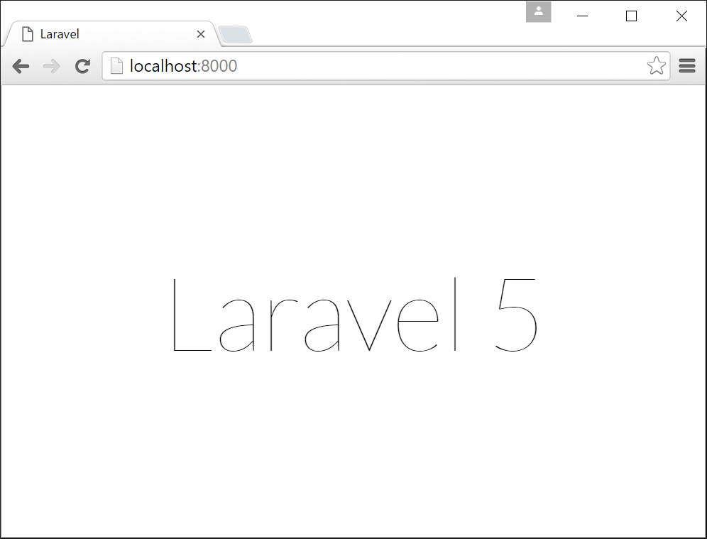
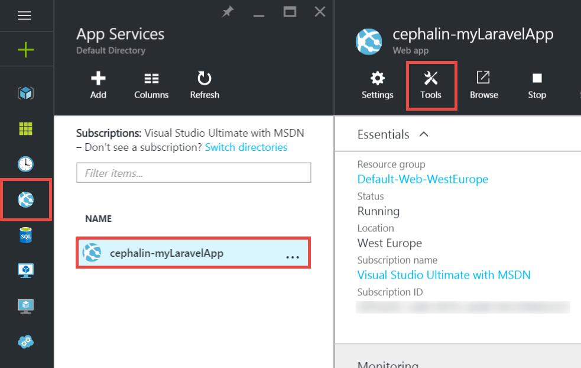
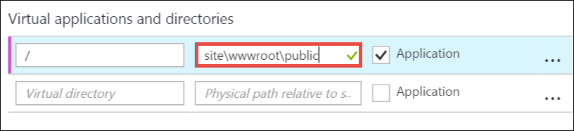
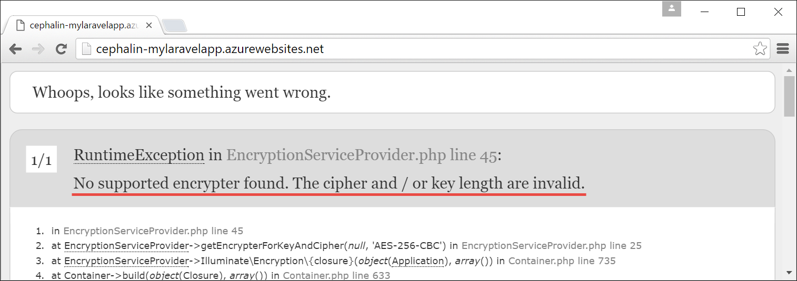

<properties
    pageTitle="Erstellen, konfigurieren und Bereitstellen einer Web-app von PHP in Azure"
    description="Ein Lernprogramm, die wird gezeigt, wie eine Web-app von PHP (Laravel) in der App-Verwaltungsdienst Azure ausgeführt werden soll. Informationen Sie zum Konfigurieren der Azure-App-Verwaltungsdienst zum Erfüllen von PHP Framework ausgewählt haben."
    services="app-service\web"
    documentationCenter="php"
    authors="cephalin"
    manager="wpickett"
    editor=""
    tags="mysql"/>

<tags
    ms.service="app-service-web"
    ms.workload="web"
    ms.tgt_pltfrm="na"
    ms.devlang="PHP"
    ms.topic="article"
    ms.date="06/03/2016" 
    ms.author="cephalin"/>

# Erstellen, konfigurieren und Bereitstellen einer Web-app von PHP in Azure

[AZURE.INCLUDE [tabs](../../includes/app-service-web-get-started-nav-tabs.md)]

In diesem Lernprogramm erfahren Sie, wie Sie erstellen, konfigurieren und Bereitstellen einer Web-app von PHP für Azure und Konfigurieren von Azure-App-Verwaltungsdienst zum Erfüllen von PHP Web app. Am Ende des Lernprogramms müssen Sie ein aktives [Laravel](https://www.laravel.com/) Web app live in [Azure-App-Verwaltungsdienst](../app-service/app-service-value-prop-what-is.md)ausgeführt.

Als Entwickler PHP bringen Sie Ihre bevorzugten Framework von PHP in Azure. In diesem Lernprogramm verwendet Laravel einfach als ein Beispiel Beton app an. Lernen Sie Folgendes: 

- Bereitstellen mit Git
- Festlegen von PHP-version
- Verwenden einer Startdatei, die nicht im Stammverzeichnis der Anwendung befindet
- Access-Umgebung-spezifische Variablen
- Aktualisieren Sie Ihre app in Azure

Sie können die hier bei anderen Web apps von PHP Gelernte, das auf Azure bereitgestellt anwenden.

>[AZURE.INCLUDE [app-service-linux](../../includes/app-service-linux.md)] 

## Erforderliche Komponenten

- Installieren von [PHP 5.6.x](http://php.net/downloads.php) (Unterstützung von PHP 7 ist Beta)
- [Composer](https://getcomposer.org/download/) installieren
- Installieren von [Azure CLI](../xplat-cli-install.md)
- Installieren der [Git](http://www.git-scm.com/downloads)
- Erhalten eines Microsoft Azure-Kontos an. Wenn Sie kein Konto haben, können Sie [Sie sich für eine kostenlose Testversion](/pricing/free-trial/?WT.mc_id=A261C142F) oder [die Vorteile Ihres Visual Studio Abonnenten aktivieren](/pricing/member-offers/msdn-benefits-details/?WT.mc_id=A261C142F).

>[AZURE.NOTE] Finden Sie eine Web-app in Aktion aus. [Wiederholen Sie den App-Verwaltungsdienst](http://go.microsoft.com/fwlink/?LinkId=523751) sofort und erstellen Sie eine app kurzlebige Starter – keine Kreditkarte erforderlich, keine Zusagen.

## Erstellen Sie eine app von PHP (Laravel) auf Ihrem Computer Entwickler

1. Öffnen Sie eine neue Windows-Befehlszeile, PowerShell-Fenster, Linux Shell oder OS X Terminal. Führen Sie die folgenden Befehle zu überprüfen, ob die erforderlichen Tools ordnungsgemäß auf Ihrem Computer installiert sind. 

        php --version
        composer --version
        azure --version
        git --version

    

    Wenn Sie die Tools installiert haben, finden Sie unter [Voraussetzungen für](#Prerequisites) Downloadlinks.
    
2. Installieren Laravel wie hier:

        composer global require "laravel/installer

3. `CD`in einer geöffneten Verzeichnis und erstellen Sie eine neue Laravel Anwendung wie hier:

        cd <working_directory>
        laravel new <app_name>

4. `CD`in der neu erstellten `<app_name>` Directory und Testen der app wie hier:

        cd <app_name>
        php artisan serve
        
    Sie sollten möglicherweise navigieren Sie zu Http://localhost:8000 in einem Browser jetzt und finden Sie unter der Laravel-Begrüßungsbildschirm.
    
    
    
Daher sind ganz, nur reguläre Laravel Workflows, und Sie nicht Hier lernen <a href="https://laravel.com/docs/5.2" rel="nofollow">Laravel</a>. Also verschieben.

## Erstellen einer Azure Web app und Einrichten von Git Bereitstellung

>[AZURE.NOTE] "Warten! Was geschieht, wenn ich mit FTP bereitstellen möchten?" Es gibt eine [FTP-Lernprogramm](web-sites-php-mysql-deploy-use-ftp.md) für Ihre Anforderungen an. 

Mit der CLI Azure können eine Web app im App-Verwaltungsdienst Azure erstellen und es für die Bereitstellung der Git mit einer einzigen Zeile des Befehls eingerichtet wurde. Lassen Sie uns diesen Schritt ausführen.

1. Ändern in ASM Modus, und melden Sie sich bei Azure:

        azure config mode asm
        azure login
    
    Führen Sie die Meldung Hilfe den Anmeldevorgang fortsetzen aus.
    
    

4. Führen Sie den Befehl zum Erstellen des Azure Web app mit Git Bereitstellung. Wenn Sie dazu aufgefordert werden, geben Sie die Anzahl der die gewünschte Region aus.

        azure site create --git <app_name>
    
    
    
    >[AZURE.NOTE] Wenn Sie für Ihr Abonnement Azure nie Bereitstellung Anmeldeinformationen eingerichtet haben, werden Sie aufgefordert, den sie erstellen. Diese Anmeldeinformationen, die nicht Ihre Kontoanmeldeinformationen Azure-, werden nur für Git Bereitstellungen und FTP-Benutzernamen von App-Dienst verwendet. 
    
    Dieser Befehl erstellt ein neues Git Repository für das aktuelle Verzeichnis (mit `git init`) und stellt es in das Repository in Azure als eine Remote Git (mit `git remote add`).

<a name="configure"/>
## Konfigurieren der Azure Web app

Für Ihre app Laravel Azure nicht funktioniert müssen Sie verschiedene Funktionen besonderem Interesse. Dieser ähnliche Übung führen Sie für Ihre PHP Framework Wahl.

- Konfigurieren von PHP 5.5.9 oder höher. Die gesamte Liste der serveranforderungen finden Sie unter [Neuesten Laravel 5.2 Serveranforderungen](https://laravel.com/docs/5.2#server-requirements) . Die restlichen Listenelemente werden Erweiterungen, die bereits von PHP-Installationen des Azure aktiviert sind. 
- Einrichten den Umgebungsvariablen Ihre app muss. Laravel verwendet die `.env` Datei für einfache Einstellung der Umgebungsvariablen. Jedoch, da sie nicht sollte in Datenquellen-Steuerelements zugesichert werden (finden Sie unter [Die Konfiguration der Umgebung Laravel](https://laravel.com/docs/5.2/configuration#environment-configuration), legen Sie die Appeinstellungen der Azure Web app stattdessen.
- Stellen Sie sicher, dass die Laravel-app Einstiegspunkt, `public/index.php`, zuerst geladen wird. Siehe [Laravel Lebenszyklus – Übersicht](https://laravel.com/docs/5.2/lifecycle#lifecycle-overview). Kurzum, müssen Sie die Web-app Stamm-URL zum Verweisen Festlegen der `public` Directory.
- Aktivieren Sie die Erweiterung Composer in Azure, da Sie eine composer.json haben. Auf diese Weise können Sie dazu, wie Sie die erforderlichen Pakete erhalten, wenn Sie mit bereitstellen sorgen Composer lassen `git push`. Es ist eine Frage der Komfort. Wenn Sie Composer Automatisierung nicht aktiviert haben, einfach müssen Sie entfernen `/vendor` aus der `.gitignore` ablegen, sodass die Git enthält ("heben Sie die Markierung-ignoriert") alles in die `vendor` Verzeichnis, wenn Commit und Bereitstellen von Code.

Wir konfigurieren die folgenden Aufgaben nacheinander ein.

4. Legen Sie die Version von PHP, die Ihre app Laravel erforderlich sind.

        azure site set --php-version 5.6

    Dies sind die Version von PHP festlegen! 
    
4. Generieren einer neuen `APP_KEY` für Ihre Azure web app, und legen Sie es als eine app-Einstellung für Ihre Azure Web app.

        php artisan key:generate --show
        azure site appsetting add APP_KEY="<output_of_php_artisan_key:generate_--show>"

4. Darüber hinaus Laravel Debuggen um beliebiger nicht unmittelbar verständlicher trennen aktivieren `Whoops, looks like something went wrong.` Seite.

        azure site appsetting add APP_DEBUG=true

    Einstellung Umgebungsvariablen schon!
    
    >[AZURE.NOTE] Warten Sie, lassen Sie uns ein bisschen verlangsamen und erläutert, was bedeutet, dass Laravel und Funktionsweise Azure hier. Laravel verwendet die `.env` Datei im Stammverzeichnis zum Angeben der Umgebungsvariablen bei der app, hier Sie die Linie finden `APP_DEBUG=true` (und auch `APP_KEY=...`). Diese Variable erfolgt `config/app.php` durch den Code     `'debug' => env('APP_DEBUG', false),`. [env()](https://laravel.com/docs/5.2/helpers#method-env) ist eine Laravel, die die PHP [getenv()](http://php.net/manual/en/function.getenv.php) im Hintergrund verwendet.
    >
    >Jedoch `.env` wird von Git ignoriert, da es von aufgerufen wird die `.gitignore` Datei im Stammverzeichnis. Kurz gesagt, `.env`  
 in Ihrer lokalen Git Repository wird nicht verschoben, Azure mit den restlichen Dateien. Natürlich können Sie nur die Linie aus entfernen `.gitignore`, aber wir haben bereits festgestellt, dass die Commit von dieser Datei im Datenquellen-Steuerelement nicht empfohlen wird. Sie benötigen dennoch weiterhin eine Möglichkeit, diese Umgebungsvariablen in Azure anzugeben. 
    >
    >Die gute Nachricht ist, dass die app-Einstellungen in der App-Verwaltungsdienst Azure unterstützt [getenv()](http://php.net/manual/en/function.getenv.php)  
 in PHP. Also, während Sie FTP oder auf andere Weise verwenden können manuell Hochladen einer `.env` Datei in Azure, können Sie nur die gewünschten Variablen als Azure app-Einstellungen ohne Angeben eines `.env` in Azure, wie Sie einfach gemacht haben. Darüber hinaus ist eine Variable in beiden einer `.env` ablegen und in Azure Appeinstellungen die Einstellung Azure app wins.     

4. Die letzten zwei Aufgaben (virtuelle Verzeichnis einrichten und Aktivieren von Composer) erfordert die [Azure-Portal](https://portal.azure.com), also melden Sie sich mit Ihrem Konto Azure- [Portal](https://portal.azure.com) .

4. Beginnend mit dem linken Menü, und klicken Sie auf **App-Services** > **&lt;App_name >** > **Tools**.

    
    
    >[AZURE.TIP] Wenn Sie die **Einstellungen** anstelle von **Tools**geklickt haben, können zwar die **Anwendungseinstellungen** Zugriff auf 
 Blade, dem Sie können festlegen, Versionen von PHP, Einstellungen für die app, und virtuelle Verzeichnisse durchsuchen, wie Sie einfach hat. 
    
4. Klicken Sie auf **Erweiterungen** > **Hinzufügen** , um eine Erweiterung hinzuzufügen.

4. Wählen Sie in der **Erweiterung auswählen** [Blade](../azure-portal-overview.md) **Composer** (*Blade*: eine Portalseite, der horizontal angezeigt wird).

4. Klicken Sie in das Blade **Vertragsbedingungen akzeptieren** auf **OK** . 

5. Das **Hinzufügen der Erweiterung** Blade klicken Sie auf **OK** .

    Abschluss Azure hinzufügen die Erweiterung, sollte eine Meldung angezeigt, geeignet Popupmenü in der Ecke sowie das Blade **Erweiterungen**  **Composer** aufgeführt.

    

    Aktivieren von Composer schon!
    
4. Klicken Sie in der Web-app-Blade auf **Einstellungen** > **Application Settings**.

    

    Beachten Sie die Version von PHP zuvor festgelegten in das Blade **Anwendungseinstellungen** :

    

    und der Einstellungen für die app, die Sie hinzugefügt haben:
    
    

4. Führen Sie einen Bildlauf an das Ende der Blade und Ändern des virtuellen Stammverzeichnisses auf **Site\wwwroot\public** statt **Site\wwwroot**verweisen.

    

4. Klicken Sie auf die am oberen Rand der Blade **Speichern** .

    Schon virtuelle Verzeichnis festlegen! 

## Bereitstellen von Web app mit Git (und Festlegen von Umgebungsvariablen)

Sie können nun Code bereitstellen. Sie werden dieser wieder in Ihrem Eingabeaufforderungsfenster oder Terminal ausführen.

4. Übernehmen Sie alle Ihre Änderungen zu und Bereitstellen Sie Code zu Azure Web app, wie Sie in einer beliebigen Git Repository:

        git add .
        git commit -m "Hurray! My first commit for my Azure app!"
        git push azure master 

    Beim Ausführen `git push`, werden Sie aufgefordert, das Git Bereitstellung Kennwort einzugeben. Wenn Sie aufgefordert werden, die Bereitstellung von Anmeldeinformationen bei erstellen `azure site create` zuvor, geben Sie das Kennwort ein, die Sie verwendet haben.
    
5. Lassen Sie uns finden sie im Browser ausgeführt werden, indem Sie diesen Befehl ausführen:

        azure site browse

    Ihr Browser sollte den Laravel Begrüßungsbildschirm angezeigt werden.
    
    
    
    Herzlichen Glückwunsch, Sie nun eine Laravel Web-app in Azure ausführen.
             
## Problembehandlung bei häufigen

Hier sind einige der Fehler, die, denen Sie auftreten, wenn in diesem Lernprogramm folgen:

- [Azure CLI zeigt "'Website' keinen Azure-Befehl ist"](#clierror)
- [Web app zeigt HTTP-Fehler 403](#http403)
- [Web app zeigt "Whoops sieht wie ein Fehler aufgetreten ist."](#whoops)
- [Web app zeigt "Keine unterstützten Encryptor gefunden".](#encryptor)

### Azure CLI zeigt "'Website' keinen Azure-Befehl ist"

Beim Ausführen `azure site *` in die Befehlszeile Terminal finden Sie den Fehler`error:   'site' is not an azure command. See 'azure help'.` 

Dies ist in der Regel Ergebnis zu "Cloud" (Azure Ressourcenmanager) Modus wechseln. Um dieses Verhalten zu beheben, wechseln Sie wieder im Modus "ASM" (Azure Service Management) durch Ausführen `azure config mode asm`.

### Web app zeigt HTTP-Fehler 403

Sie haben Ihre Web app erfolgreich in Azure bereitgestellt, aber wenn Sie Ihre Azure Web app suchen, erhalten Sie eine `HTTP 403` oder`You do not have permission to view this directory or page.`

Dies ist wahrscheinlich, da das Web-app der Einstieg in die Laravel app nicht finden kann. Stellen Sie sicher, dass die Änderung des virtuellen Stammverzeichnisses auf verweisen `site\wwwroot\public`, wobei Laravels `index.php` ist (siehe [Konfigurieren des Azure Web app](#configure)).

### Web app zeigt "Whoops sieht wie ein Fehler aufgetreten ist."

Sie haben Ihre Web app erfolgreich in Azure bereitgestellt, aber wenn Sie zu Ihrer Anwendung Azure Web durchsuchen, erhalten Sie die Nachricht nicht unmittelbar verständlicher`Whoops, looks like something went wrong.`

Um einen aussagekräftigeren Fehler ausgegeben wird, aktivieren Sie das Laravel Debuggen durch Festlegen `APP_DEBUG` Umgebungsvariable zu `true` (siehe [Konfigurieren des Azure Web app](#configure)).

### Web app zeigt "Keine unterstützten Encryptor gefunden".

Sie haben Ihre Web app erfolgreich in Azure bereitgestellt, aber wenn Sie zu Ihrer Anwendung Azure Web durchsuchen, erhalten Sie die folgende Fehlermeldung:

    
Dies ist eine unangenehme zurück, aber mindestens jedoch kein nicht unmittelbar verständlicher, da Sie Laravel Debuggen aktiviert. Eine oberflächliche Suchen nach die Zeichenfolge zurück, in den Foren Laravel wird gezeigt, dass es aufgrund der APP_KEY in nicht festgelegt ist `.env`, oder klicken Sie in Ihrem Fall nicht Probleme `.env` in Azure überhaupt. Sie können dies beheben, indem Sie die Einstellung hinzufügen `APP_KEY` als eine Azure-app festlegen (siehe [Konfigurieren des Azure Web app](#configure)).
    
## Nächste Schritte

Informationen Sie zum Hinzufügen von Daten zu Ihrer Anwendung durch [Erstellen einer MySQL-Datenbank in Azure](../store-php-create-mysql-database.md). Sehen Sie sich auch weitere hilfreiche Links für PHP in Azure unten:

- [Developer Center von PHP](/develop/php/).
- [Erstellen Sie eine Web-app aus dem Azure Marketplace](app-service-web-create-web-app-from-marketplace.md)
- [Konfigurieren von PHP in Azure App-Verwaltungsdienst Web Apps](web-sites-php-configure.md)
- [Konvertieren von WordPress in mehreren Sites in Azure App-Verwaltungsdienst](web-sites-php-convert-wordpress-multisite.md)
- [Enterprise-Klasse WordPress Azure App-Diensts](web-sites-php-enterprise-wordpress.md)
