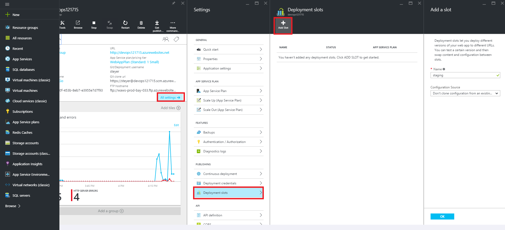
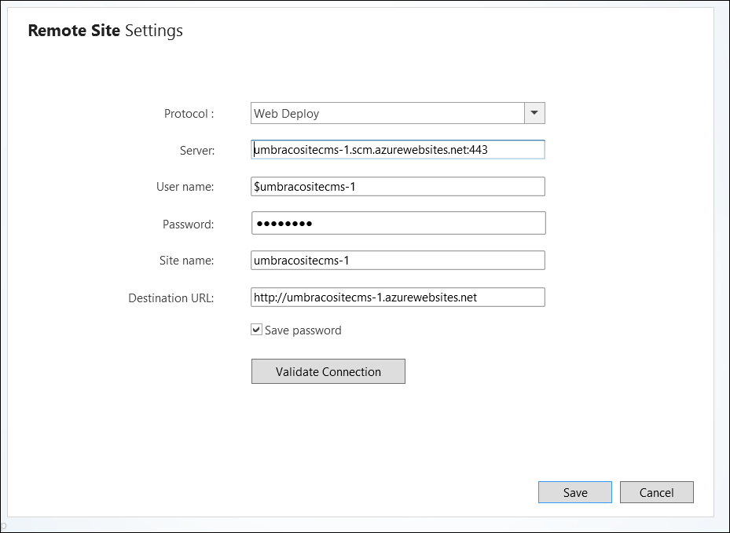
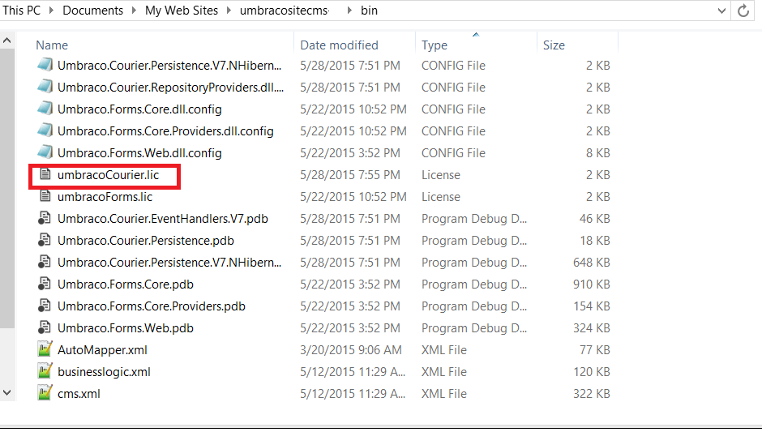
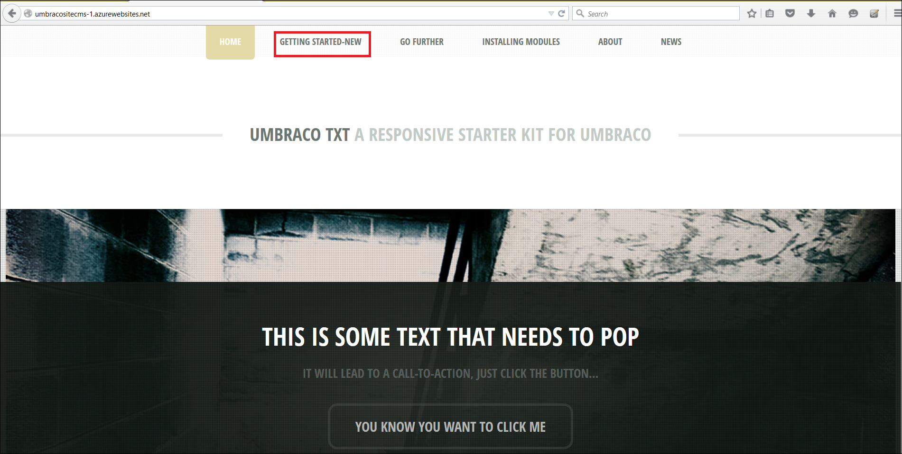

<properties
  pageTitle="Effektives Verwenden von DevOps Umgebungen für Web app"
  description="Informationen Sie zum Verwenden der Bereitstellung Steckplätze zum Einrichten und Verwalten von mehreren Entwicklung Umgebungen für eine Anwendung"
  services="app-service\web"
  documentationCenter=""
  authors="sunbuild"
  manager="yochayk"
  editor=""/>

<tags
  ms.service="app-service"
  ms.devlang="na"
  ms.topic="article"
  ms.tgt_pltfrm="na"
  ms.workload="web"
  ms.date="10/24/2016"
  ms.author="sumuth"/>

# <a name="use-devops-environments-effectively-for-your-web-apps"></a>Effektives Verwenden von DevOps Umgebungen für von Web apps

Dieser Artikel zeigt Ihnen, einrichten und Verwalten von Web-Anwendung Bereitstellungen für mehrere Versionen einer Anwendung wie z. B. Entwicklung, staging, f & a und Fertigung. Jeder Version Ihrer Anwendung kann als Entwicklungsumgebung für bestimmte müssen von innerhalb des Bereitstellungsprozesses angesehen werden. F & a-Umgebung kann beispielsweise von Ihrem Team von Entwicklern verwendet werden, um die Qualität der Anwendung testen, bevor Sie die Änderungen zu Herstellung Pushbenachrichtigungen.
Einrichten von mehreren Entwicklung Umgebungen kann eine Herausforderung sein, wie Sie benötigen, um das Nachverfolgen, verwalten die Ressourcen (berechnen Web app, Datenbank, Cache usw.) und Code in Umgebungen bereitstellen.

## <a name="setting-up-a-non-production-environment-stagedevqa"></a>Einrichten einer Umgebung nicht Herstellung (Phase, Entwickler, f & a)
Nachdem Sie eine Herstellung Web app Stand und ausgeführt haben, besteht der nächste Schritt zum Erstellen einer nicht Herstellung-Umgebung. Damit verwendet stellen Bereitstellung Steckplätze sicher, dass Sie in der **Standard-** oder die App-Verwaltungsdienst **Premium** Plan Modus ausgeführt werden. Bereitstellung Steckplätze sind tatsächlich live-Web-apps mit ihrer eigenen Hostnamen. Web app Inhalts- und Elemente können zwischen zwei Bereitstellung Steckplätzen, einschließlich den Herstellung Slot ausgetauscht werden. Bereitstellen der Anwendung auf ein Slot Bereitstellung weist die folgenden Vorteile:

1. Sie können Web app Änderungen in einem staging Bereitstellung Slot überprüfen, bevor Sie es mit der Herstellung Slot austauschen.
2. Bereitstellen einer Web app auf einem Slot zuerst und es in Betrieb austauschen: Damit ist sichergestellt, dass alle Instanzen von den Slot vor, die in Betrieb vertauscht Standardserverhardware sind. Dadurch werden Ausfallzeiten, wenn Sie die Web-app bereitstellen. Eine Umleitung des Datenverkehrs nahtlose ist und keine Anfragen aufgrund austauschen Vorgänge gelöscht werden. Diesen Workflow gesamte kann automatisierte werden, durch Konfigurieren [Automatisch austauschen](web-sites-staged-publishing.md#configure-auto-swap-for-your-web-app) , wenn vor dem Austauschen Überprüfung nicht erforderlich ist.
3. Nach einem Austausch hat der Slot mit zuvor bereitgestellte Web app jetzt des vorherigen Herstellung Web app an. Wenn die Änderungen in der Herstellung Slot ausgetauscht werden nicht wie erwartet, können, führen Sie die gleichen austauschen sofort zum Abrufen "letzten bekannten guten Web app" zurück.

Um einen staging Bereitstellung Slot eingerichtet haben, finden Sie unter [Einrichten von staging-Umgebungen von Web apps in Azure-App-Dienst](web-sites-staged-publishing.md). Jede Umgebung sollte eine eigene Gruppe von Ressourcen, enthalten, für Beispiel, wenn Sie-app Web eine Datenbank wird verwendet, und klicken Sie dann andere Datenbanken sowohl Herstellung und staging Web app verwendet werden sollen. Fügen Sie staging Entwicklung Umgebung Ressourcen wie Datenbank, Speicher oder Cache für das Festlegen von Ihrem staging Entwicklungsumgebung.

## <a name="examples-of-using-multiple-development-environments"></a>Beispiele für die Verwendung von mehreren Entwicklung Umgebungen

Jedes Projekt sollte führen Sie eine Quellcode-Management mit mindestens zwei Umgebungen, eine Entwicklung und Herstellung-Umgebung, aber wenn mit Content Management-Systemen Anwendungsframeworks usw. wir auftreten können Probleme, die Anwendung dieses Szenario im Paket nicht unterstützt. Dies gilt für einen Teil der beliebte Framework erläutert. Viele Fragen Hier Beachten Sie beim Arbeiten mit einer CMS/Framework wie

1. Wie sie verkleinern in verschiedenen Umgebungen aufgehoben werden
2. Welche Dateien kann ich ändern und startet nicht können beeinflussen, versionsaktualisierungen Framework
3. So verwalten Sie die Konfiguration pro Umgebung
4. Zum Verwalten von Module /-Plug-Ins versionsaktualisierungen, Core Framework Version-updates

Es gibt viele Methoden zum Einrichten einer Umgebung für ein Projekt mit mehreren und die folgenden Beispielen sind eine nur eine solche Methode der jeweiligen Applikationen.

### <a name="wordpress"></a>WordPress
In diesem Abschnitt erfahren Sie, wie einen Bereitstellungsworkflow mit Steckplätzen für WordPress einrichten. Arbeiten mit mehreren Entwicklung Umgebungen im Paket wie die meisten CMS Lösungen WordPress nicht unterstützt. App-Dienst Web Apps enthält einige Features, die zum Speichern der Einstellungen für die Konfiguration außerhalb des Code erleichtern.

Vor dem Erstellen eines staging Slot, richten Sie zur Unterstützung von mehreren Umgebungen Ihrer Anwendungscode. Zur Unterstützung von mehreren Umgebungen in WordPress Sie bearbeiten müssen `wp-config.php` fügen Sie den folgenden Code am Anfang der Datei, klicken Sie auf die lokale Entwicklung Web app. Hierdurch haben die Möglichkeit Ihrer Anwendungs, um die richtige Konfiguration basierend auf der ausgewählten Umgebung auszuwählen.

```
// Support multiple environments
// set the config file based on current environment
if (strpos($_SERVER['HTTP_HOST'],'localhost') !== false) {
// local development
 $config_file = 'config/wp-config.local.php';
}
elseif ((strpos(getenv('WP_ENV'),'stage') !== false) || (strpos(getenv('WP_ENV'),'prod' )!== false ))
//single file for all azure development environments
 $config_file = 'config/wp-config.azure.php';
}
$path = dirname(__FILE__). '/';
if (file_exists($path. $config_file)) {
// include the config file if it exists, otherwise WP is going to fail
require_once $path. $config_file;
```

Erstellen Sie einen Ordner unter Web app Wurzel mit dem Namen `config` und fügen Sie eine Datei zwei Dateien: `wp-config.azure.php` und `wp-config.local.php` Ihrer Umgebung Azure und lokale Hilfethemas darstellt.

Kopieren Sie die folgenden `wp-config.local.php` :

```
<?php
// MySQL settings
/** The name of the database for WordPress */

define('DB_NAME', 'yourdatabasename');

/** MySQL database username */
define('DB_USER', 'yourdbuser');

/** MySQL database password */
define('DB_PASSWORD', 'yourpassword');

/** MySQL hostname */
define('DB_HOST', 'localhost');
/**
 * For developers: WordPress debugging mode.
 * * Change this to true to enable the display of notices during development.
 * It is strongly recommended that plugin and theme developers use WP_DEBUG
 * in their development environments.
 */
define('WP_DEBUG', true);

//Security key settings
define('AUTH_KEY', 'put your unique phrase here');
define('SECURE_AUTH_KEY','put your unique phrase here');
define('LOGGED_IN_KEY','put your unique phrase here');
define('NONCE_KEY', 'put your unique phrase here');
define('AUTH_SALT', 'put your unique phrase here');
define('SECURE_AUTH_SALT', 'put your unique phrase here');
define('LOGGED_IN_SALT', 'put your unique phrase here');
define('NONCE_SALT', 'put your unique phrase here');

/**
 * WordPress Database Table prefix.
 *
 * You can have multiple installations in one database if you give each a unique
 * prefix. Only numbers, letters, and underscores please!
 */
$table_prefix = 'wp_';
```

Festlegen der Sicherheit Tasten oben können verhindern, dass Web app gehackt helfen, verwenden Sie also die eindeutigen Werte. Wenn Sie die Zeichenfolge für Sicherheitsschlüssel weiter oben erwähnten generieren müssen, können Sie zu der automatischen Generator zum Erstellen von neuen Schlüssel/Werte mit diesem [Link] (https://api.wordpress.org/secret-key/1.1/salt) wechseln.

Kopieren Sie den folgenden Code in `wp-config.azure.php`:


``` <?php
    // MySQL settings
    /** The name of the database for WordPress */
    
    define('DB_NAME', getenv('DB_NAME'));
    
    /** MySQL database username */
    define('DB_USER', getenv('DB_USER'));
    
    /** MySQL database password */
    define('DB_PASSWORD', getenv('DB_PASSWORD'));
    
    /** MySQL hostname */
    define('DB_HOST', getenv('DB_HOST'));
    
    /**
    * For developers: WordPress debugging mode.
    *
    * Change this to true to enable the display of notices during development.
    * It is strongly recommended that plugin and theme developers use WP_DEBUG
    * in their development environments.
    * Turn on debug logging to investigate issues without displaying to end user. For WP_DEBUG_LOG to
    * do anything, WP_DEBUG must be enabled (true). WP_DEBUG_DISPLAY should be used in conjunction
    * with WP_DEBUG_LOG so that errors are not displayed on the page */
    
    */
    define('WP_DEBUG', getenv('WP_DEBUG'));
    define('WP_DEBUG_LOG', getenv('TURN_ON_DEBUG_LOG'));
    define('WP_DEBUG_DISPLAY',false);
    
    //Security key settings
    /** If you need to generate the string for security keys mentioned above, you can go the automatic generator to create new keys/values: https://api.wordpress.org/secret-key/1.1/salt **/
    define('AUTH_KEY',getenv('DB_AUTH_KEY'));
    define('SECURE_AUTH_KEY', getenv('DB_SECURE_AUTH_KEY'));
    define('LOGGED_IN_KEY', getenv('DB_LOGGED_IN_KEY'));
    define('NONCE_KEY', getenv('DB_NONCE_KEY'));
    define('AUTH_SALT', getenv('DB_AUTH_SALT'));
    define('SECURE_AUTH_SALT', getenv('DB_SECURE_AUTH_SALT'));
    define('LOGGED_IN_SALT',  getenv('DB_LOGGED_IN_SALT'));
    define('NONCE_SALT',  getenv('DB_NONCE_SALT'));
    
    /**
    * WordPress Database Table prefix.
    *
    * You can have multiple installations in one database if you give each a unique
    * prefix. Only numbers, letters, and underscores please!
    */
    $table_prefix = getenv('DB_PREFIX');
```

#### <a name="use-relative-paths"></a>Relative Pfade verwenden
Eine Sache ist so konfigurieren Sie die app WordPress, um die relative Pfade verwenden. WordPress speichert die URL-Informationen in der Datenbank. Auf diese Weise Verschieben von Inhalten aus einer Umgebung in eine andere schwieriger, wie Sie benötigen, um die Datenbank zu aktualisieren, jedes Mal, wenn beim Wechseln von lokalen zu Phase oder Phasen Herstellung Umgebungen. Klicken Sie zum verringern das Risiko von Problemen, die mit Bereitstellen einer Datenbank jedes Mal, wenn Sie von einer Umgebung in eine andere bereitstellen verursacht werden kann, verwenden Sie die [Relative Stamm-Links-Plug-Ins](https://wordpress.org/plugins/root-relative-urls/) mit WordPress Administrator Dashboard installiert werden oder manuell aus [hier](https://downloads.wordpress.org/plugin/root-relative-urls.zip)herunterladen.


Fügen Sie die folgenden Einträge zu Ihrer `wp-config.php` Datei vor der `That's all, stop editing!` Kommentar:

```

  define('WP_HOME', 'http://'. filter_input(INPUT_SERVER, 'HTTP_HOST', FILTER_SANITIZE_STRING));
    define('WP_SITEURL', 'http://'. filter_input(INPUT_SERVER, 'HTTP_HOST', FILTER_SANITIZE_STRING));
    define('WP_CONTENT_URL', '/wp-content');
    define('DOMAIN_CURRENT_SITE', filter_input(INPUT_SERVER, 'HTTP_HOST', FILTER_SANITIZE_STRING));
```

Aktivieren Sie das Plug-in über die `Plugins` Dashboard WordPress Administrator-Menü. Speichern der Permalink Einstellungen für WordPress-app.

#### <a name="the-final-wp-configphp-file"></a>Die endgültige `wp-config.php` Datei
Alle Updates WordPress Core hat keinen Einfluss auf Ihre `wp-config.php`, `wp-config.azure.php` und `wp-config.local.php` Dateien. Am Ende dieses wie `wp-config.php` Datei wird wie folgt aussehen

```
<?php
/**
 * The base configurations of the WordPress.
 *
 * This file has the following configurations: MySQL settings, Table Prefix,
 * Secret Keys, and ABSPATH. You can find more information by visiting
 *
 * Codex page. You can get the MySQL settings from your web host.
 *
 * This file is used by the wp-config.php creation script during the
 * installation. You don't have to use the web web app, you can just copy this file
 * to "wp-config.php" and fill in the values.
 *
 * @package WordPress
 */

// Support multiple environments
// set the config file based on current environment
if (strpos($_SERVER['HTTP_HOST'],'localhost') !== false) { // local development
  $config_file = 'config/wp-config.local.php';
}
elseif ((strpos(getenv('WP_ENV'),'stage') !== false) ||(strpos(getenv('WP_ENV'),'prod' )!== false )){
  $config_file = 'config/wp-config.azure.php';
}


$path = dirname(__FILE__). '/';
if (file_exists($path. $config_file)) {
  // include the config file if it exists, otherwise WP is going to fail
  require_once $path. $config_file;
}

/** Database Charset to use in creating database tables. */
define('DB_CHARSET', 'utf8');

/** The Database Collate type. Don't change this if in doubt. */
define('DB_COLLATE', '');


/* That's all, stop editing! Happy blogging. */

define('WP_HOME', 'http://'. $_SERVER['HTTP_HOST']);
define('WP_SITEURL', 'http://'. $_SERVER['HTTP_HOST']);
define('WP_CONTENT_URL', '/wp-content');
define('DOMAIN_CURRENT_SITE', $_SERVER['HTTP_HOST']);

/** Absolute path to the WordPress directory. */
if ( !defined('ABSPATH') )
    define('ABSPATH', dirname(__FILE__). '/');

/** Sets up WordPress vars and included files. */
require_once(ABSPATH. 'wp-settings.php');
```

#### <a name="set-up-a-staging-environment"></a>Einrichten einer Staging-Umgebung
Wenn Sie bereits eine WordPress Web app Azure Web, melden Sie sich [Azure Management Preview-Portal](http://portal.azure.com) ausgeführt, und wechseln Sie zu WordPress Web app. If-Apps nicht Sie können eine vom Marketplace erstellen. Weitere, [hier klicken Sie auf](web-sites-php-web-site-gallery.md)Informationen.
Klicken Sie auf Einstellungen-Bereitstellung > Steckplätze -> hinzufügen, um ein Slot Bereitstellung mit Namen für die Phase zu erstellen. Ein Slot Bereitstellung ist ein anderes Web Anwendungsfreigabe dieselben Ressourcen wie die primäre online über erstellt.



Hinzufügen von einem anderen MySQL-Datenbank, sagen `wordpress-stage-db` der Ressourcengruppe `wordpressapp-group`.

 

Aktualisieren die Verbindungszeichenfolgen für Ihre Phase Bereitstellung Slot auf neu erstellte Datenbank verweisen `wordpress-stage-db`. Beachten Sie, dass Ihre Herstellung-app Web, `wordpressprodapp` und staging Web app `wordpressprodapp-stage` muss auf verschiedene Datenbanken verweisen.

#### <a name="configure-environment-specific-app-settings"></a>Konfigurieren von Einstellungen für die spezielle Umgebung-app
Entwickler können Schlüssel / Wert-Zeichenfolgenpaare in Azure als Teil einer Web app-Einstellungen für die App aufgerufen zugeordnet über die Konfiguration speichern. Zur Laufzeit App Dienst Web Apps automatisch ruft diese Werte für Sie und stellt sie zum Ausführen im Web app zur Verfügung. Von eines Wertpapiers profitieren Perspektive, die eine übersichtliche Seite befindet sich seit vertrauliche Informationen wie Datenbank Verbindungszeichenfolgen mit Kennwörtern nie als Klartext in einer Datei wie angezeigt `wp-config.php`.

Dieses Verfahren unter definiert ist nützlich, wenn Sie ausführen, wie er ändert sich die Datei, und Datenbank Änderungen für WordPress app enthält:
- WordPress Versionsupgrade
- Neu fügen Sie hinzu, bearbeiten Sie oder aktualisieren Sie-Plug-Ins
- Hinzufügen neuer oder bearbeiten oder Aktualisieren von Designs

Konfigurieren der Appeinstellungen für:

- Datenbankinformationen
- ein-/ausschalten WordPress Protokollierung aktivieren
- WordPress Sicherheitseinstellungen


Stellen Sie sicher, dass Sie die folgenden Einstellungen für die app für Ihre Herstellung-Web app und Phase Slot hinzugefügt haben. Beachten Sie, dass die Herstellung Web app und Staging Web app andere Datenbanken verwenden.
Deaktivieren Sie die **Einstellung Slot** Kontrollkästchen für alle Einstellungen Parameter außer WP_ENV. Dadurch wird die Konfiguration für Ihre Web-app, zusammen mit Dateiinhalt und Datenbank austauschen. Wenn **Slot-Einstellung** **aktiviert**ist, Einstellungen für das Web-app-app und Konfiguration Verbindungszeichenfolge werden nicht verschoben, in Umgebungen beim Ausführen eines Vorgangs AUSTAUSCHEN und daher Wenn Änderungen Datenbank vorhanden sind dies wird nicht der Herstellung Web app.

Bereitstellen Sie die lokale Entwicklung Umgebung Web app auf Phase Web app und Datenbank mithilfe von WebMatrix oder Tools Ihrer Wahl z. B. FTP, Git oder PhpMyAdmin.


Durchsuchen Sie, und Testen Sie Ihre staging Web app. In einem Szenario, in dem das Design des Web app aktualisiert werden, Anbetracht so sieht das staging Web app.


 Wenn alles in Ordnung, klicken Sie auf die Schaltfläche **austauschen** staging Web app zum Verschieben von Inhalten in dieser Umgebung. In diesem Fall vertauschen Sie die Web app und die Datenbank in Umgebungen bei jedem Vorgang **austauschen** .


 > [AZURE.NOTE]
 >Wenn Sie ein Szenario haben, in denen Sie nur Pushbenachrichtigungen Dateien (keine Datenbankupdates) müssen, verbundene klicken Sie dann **Aktivieren Sie** die **Einstellung Slot** für alle Datenbank *app-Einstellungen* und *Zeichenfolgen Verbindungseinstellungen* im Web app Einstellung Blade innerhalb des Portals Azure Vorschau vor dem Ausführen der AUSTAUSCHEN. In diesem Fall DB_NAME, DB_HOST, DB_PASSWORD, DB_USER sollte Zeichenfolge Standardeinstellung für die Verbindung nicht in der Vorschau der Änderungen angezeigt beim Ausführen einer **austauschen**. AT dieses Mal, wenn Sie abgeschlossen des Vorgangs **austauschen** des WordPress Web app die Updates verfügen, wird **nur**Dateien.

Bevor Sie dies eine AUSTAUSCHEN, hier die Herstellung WordPress Web app 

Nach dem Vorgang AUSTAUSCHEN wurde das Design der Herstellung Web App aktualisiert.


In einer Situation bei Bedarf **Zurücksetzen**, können wechseln Sie zu der Herstellung Web app-Einstellungen und klicken Sie auf die Schaltfläche **austauschen** , die Web app und die Datenbank aus Herstellung zum staging Slot vertauschen. Wichtiger Hinweis zu merken ist, wenn Datenbank Änderungen in einem Vorgang **austauschen** zu einem beliebigen Zeitpunkt enthalten sind, klicken Sie dann das nächste Mal, die Sie zu Ihrem staging Web app erneut bereitstellen, die Sie die Datenbank bereitstellen müssen, auf die aktuelle Datenbank für Ihre staging Web app ändert sich der vorherigen Herstellung oder der Phase Datenbank handeln.

#### <a name="summary"></a>Zusammenfassung
Um den Vorgang für jede Anwendung mit einer Datenbank generalize

1. Installieren der Anwendung auf Ihrem lokalen Umgebung
2. Einschließen Sie bestimmter Konfiguration der Umgebung (lokale und Azure Web App)
3. Richten Sie Ihrer Umgebung im App-Dienst Web Apps – Staging, Fertigung ein
4. Wenn Sie eine Herstellung Anwendung Azure bereits ausgeführt haben, synchronisieren Sie Ihre Herstellung Inhalte (Dateien/Code + Datenbank), die lokale und staging-Umgebung.
5. Entwickeln Sie Ihrer Anwendung auf Ihrem lokalen Umgebung
6. Platzieren Sie Ihre Herstellung Web-app unter Wartung oder gesperrten Modus und synchronisieren Datenbank aus Herstellung Staging und Entwickler Umgebungen Inhalt
7. Bereitstellen Sie für das Staging-Umgebung und testen
8. Bereitstellen für die Herstellung-Umgebung
9. Wiederholen Sie die Schritte 4 bis 6

### <a name="umbraco"></a>Umbraco
In diesem Abschnitt erfahren Sie, wie Umbraco CMS ein benutzerdefiniertes Modul zur Bereitstellung von in-Umgebung, die mehrere DevOps verwendet werden. In diesem Beispiel bietet eine andere Vorgehensweise zum Verwalten von mehreren Entwicklung Umgebungen.

[Umbraco CMS](http://umbraco.com/) ist eine der popular.NET CMS Solutions von vielen Entwicklern verwendet die [Courier2](http://umbraco.com/products/more-add-ons/courier-2) -Modul für die Bereitstellung von der Entwicklung auf Staging Herstellung Umgebungen bereitstellt. Sie können ganz einfach eine lokalen Umgebung für eine mit Visual Studio oder WebMatrix Umbraco CMS Web-app erstellen.

1. Erstellen einer Umbraco Web app mit Visual Studio, [Klicken Sie hier](https://our.umbraco.org/documentation/Installation/install-umbraco-with-nuget).
2. So erstellen eine Umbraco Web app mit WebMatrix, [Klicken Sie hier](http://umbraco.com/help-and-support/video-tutorials/getting-started/working-with-webmatrix).

So entfernen Sie stets den `install` Ordner unter Ihrer Anwendung und nie Hochladen auf Phase oder Herstellung Web apps. In diesem Lernprogramm werden ich WebMatrix verwenden

#### <a name="set-up-a-staging-environment"></a>Einrichten von staging-Umgebung
- Erstellen Sie einen Slot Bereitstellung oben erwähnten Umbraco CMS Web App, unter der Voraussetzung, dass eine Umbraco CMS Web app bereits von und ausgeführt wird. Andernfalls können Sie eine vom Marketplace erstellen.

- Aktualisieren Sie die Verbindungszeichenfolge für Ihre Phase Bereitstellung Slot auf neu erstellten Datenbank **Umbraco-Phase-Db**verweisen. Ihre Herstellung Web app (Umbraositecms-1) und staging Web app (Umbracositecms-1-Phase) **muss** verweisen auf verschiedene Datenbanken.


- Klicken Sie auf **erste veröffentlichen Einstellungen** für die Bereitstellung Slot **Phase**. Dadurch wird eine veröffentlichen Einstellungsdatei herunterladen, die alle Informationen erforderlich Visual Studio oder Web Matrix Veröffentlichen Ihrer Anwendung von Web-app lokale Entwicklung bei Azure Web app speichern.

 

- Öffnen Sie die lokale Entwicklung Web app in **WebMatrix** oder **Visual Studio**. In diesem Lernprogramm verwende ich Web Matrix, und Sie müssen zuerst die veröffentlichen Einstellungsdatei für Ihre staging Web app importieren



- Überprüfen Sie der Änderungen im Dialogfeld und Bereitstellen Sie lokale Web app zu Ihrer Azure Web-app, *Umbracositecms-1-Phase*. Wenn Sie Dateien direkt an Ihre staging Web app bereitstellen werden Sie keine Dateien im Auslassen der `~/app_data/TEMP/` Ordner wie diese erneut generiert werden, wenn die Phase Web app zum ersten Mal gestartet. Sie sollten auch auslassen der `~/app_data/umbraco.config` auch, wie dieser, Datei wird neu generiert werden.


- Navigieren Sie nach der erfolgreichen Veröffentlichung das Umbraco lokalen Web app auf das staging von Web-app zu Ihrem staging Web app, und führen Sie einige Tests Probleme auszuschließen.

#### <a name="set-up-courier2-deployment-module"></a>Einrichten von Courier2 Bereitstellung Modul
Mit [Courier2](http://umbraco.com/products/more-add-ons/courier-2) Modul können Sie Pushbenachrichtigungen Inhalt, Stylesheets, Entwicklung Module und weitere mit einem einfachen mit der rechten Maustaste in eine staging Web app bei Herstellung Web app für eine weitere Umstände Bereitstellungen kostenlosen und Reduzieren von Risiken der Bruchfestigkeit der Herstellung Web app aus, wenn Sie ein Update bereitstellen.
Erwerben Sie eine Lizenz für die Domäne für Courier2 `*.azurewebsites.net` und Ihrer benutzerdefinierten Domäne (z. B. http://abc.com), nachdem Sie die Lizenz erworben haben, setzen Sie die heruntergeladene Lizenz (. LIC-Datei) in der `bin` Ordner.



Courier2 Paket aus [hier](https://our.umbraco.org/projects/umbraco-pro/umbraco-courier-2/)herunterladen. Melden Sie sich bei der Phase Web app, http://umbracocms-site-stage.azurewebsites.net/umbraco angenommen, und klicken Sie auf **Entwicklertools** Menü und wählen **Pakete**. Klicken Sie auf lokale Paket **Installieren**


Hochladen des courier2-Pakets über das Installationsprogramm.


Wenn Sie konfigurieren muss courier.config Datei unter **Config** Ordner der Web app zu aktualisieren.

```xml
<!-- Repository connection settings -->
 <!-- For each site, a custom repository must be configured, so Courier knows how to connect and authenticate-->
 <repositories>
    <!-- If a custom Umbraco Membership provider is used, specify login & password + set the passwordEncoding to clear: -->
    <repository name="production web app" alias="stage" type="CourierWebserviceRepositoryProvider" visible="true">
      <url>http://umbracositecms-1.azurewebsites.net</url>
      <user>0</user>
      <!--<login>user@email.com</login> -->
      <!-- <password>user_password</password>-->
      <!-- <passwordEncoding>Clear</passwordEncoding>-->
      </repository>
 </repositories>
 ```

Klicken Sie unter `<repositories>`, Fertigung URL und Benutzer Standortinformationen eingeben. Wenn Sie Standard Umbraco Mitgliedschaft Anbieter verwenden, fügen Sie die ID für den Benutzer Administration in <user> Abschnitt. Wenn Sie einen benutzerdefinierten Umbraco Mitgliedschaftsanbieter verwenden, verwenden Sie `<login>`,`<password>` Courier2 Modul wissen, wie die Verbindung zu der Website für die Herstellung. Weitere Informationen hierzu Überprüfen der [Dokumentation](http://umbraco.com/help-and-support/customer-area/courier-2-support-and-download/developer-documentation) zur Courier Modul.

Auf ähnliche Weise auf Ihrer Website Herstellung installieren Sie Courier-Modul und konfigurieren Sie ihn, zeigen Sie auf Phase Web app in den entsprechenden courier.config Datei wie hier dargestellt

```xml
 <!-- Repository connection settings -->
 <!-- For each site, a custom repository must be configured, so Courier knows how to connect and authenticate-->
 <repositories>
    <!-- If a custom Umbraco Membership provider is used, specify login & password + set the passwordEncoding to clear: -->
    <repository name="Stage web app" alias="stage" type="CourierWebserviceRepositoryProvider" visible="true">
      <url>http://umbracositecms-1-stage.azurewebsites.net</url>
      <user>0</user>
      </repository>
 </repositories>
```

Klicken Sie auf der Registerkarte Courier2 Umbraco CMS Web app-Dashboard, und wählen Sie Orte aus. Den Namen des Repository auftreten wie angegeben `courier.config`. Klicken Sie auf der Herstellung sowohl das staging von Web apps dazu.


Jetzt können einige Inhalte von staging-Website zur Herstellung Website bereitstellen. Wechseln Sie zu dem Inhalt, und wählen Sie eine vorhandene Seite oder Erstellen einer neuen Seite. Wähle ich eine vorhandene Seite mit meinem Web app, der Titel der Seite **erste** Schritte – neue geändert wird, und klicken Sie auf jetzt **Speichern**und veröffentlichen.


Wählen Sie jetzt das geänderte Seite, und *Klicken Sie mit der rechten Maustaste* , um alle Optionen anzuzeigen. Klicken Sie auf **Courier** Bereitstellung Dialogfeld anzeigen. Klicken Sie auf **Bereitstellen** Bereitstellung einleiten.


Überprüfen Sie die Änderungen vor, und klicken Sie auf Weiter.


Bereitstellung Log zeigt, wenn die Bereitstellung erfolgreich war.

 

Durchsuchen Sie Ihre Herstellung Web app, um festzustellen, ob die entsprechend geändert wurden.

 

Lesen Sie die Dokumentation, um weitere Informationen zum Verwenden von Courier.

#### <a name="how-to-upgrade-umbraco-cms-version"></a>So aktualisieren Sie Umbraco CMS version

Courier hilft nicht bei einer Aktualisierung von einer Version von Umbraco CMS auf ein anderes bereitstellen. Bei der Aktualisierung Umbraco CMS Version müssen Sie Inkompatibilität mit Ihrer benutzerdefinierten Module oder Drittanbieter-Module und die Bibliotheken Umbraco Core überprüfen. Als bewährte Methode

1. Sichern Sie immer Ihre Web app und die Datenbank, bevor Sie ein Upgrade durchführen. Azure-Web-App, können Sie Einrichten der automatischen Sicherung für Ihre Websites verwenden die Sicherung bereitstellen und Ihrer Website wiederherstellen Wenn mit Feature wiederherstellen erforderlich. Weitere Informationen hierzu finden Sie unter [Web app sichern](web-sites-backup.md) und [Wiederherstellen die Web-app](web-sites-restore.md).

2. Überprüfen Sie, ob die Drittanbieter-Paketen, die Sie verwenden, mit der Version kompatibel, die beim Aktualisieren sind auf. Downloadseite für des Pakets des, überprüfen Sie die Project-Kompatibilität mit Umbraco CMS Version.

Weitere Details zum lokal die Web-app upgraden befolgen Sie die Richtlinien als erwähnten [hier](https://our.umbraco.org/documentation/getting-started/set up/upgrading/general)ein.

Nachdem Sie Ihre Website lokale Entwicklung durchgeführt wurde, veröffentlichen Sie die Änderungen staging Web app. Testen Sie die Anwendung, und wenn alles in Ordnung, verwenden Sie **austauschen** Schaltfläche **austauschen** Ihrer Website staging Herstellung Web app. Bei der Durchführung der **austauschen** Operation können Sie die Änderungen, die betroffen sind in der Web-app-Konfiguration anzeigen. Mit diesem Vorgang **austauschen** sind wir der Web apps und Datenbanken austauschen. Dies bedeutet, nachdem die AUSTAUSCHEN der Herstellung Web app jetzt mit Umbraco-Phase-Db Datenbank zeigen wird und staging Web app wird auf Umbraco-Prod-Db-Datenbank.


Der Vorteil der austauschen, die Web app und die Datenbank:
1. Gibt Ihnen die Möglichkeit, die vorherige Version der Web app mit einem anderen **austauschen** zurücksetzen, wenn Anwendungsprobleme vorhanden sind.
2. Für eine Aktualisierung müssen Sie Dateien und das staging von Web app zum Herstellung Web app und Datenbank-Datenbank bereitstellen. Es gibt viele Dinge, die beim Bereitstellen von Dateien und die Datenbank falsche wechseln können. Indem Sie mit dem Feature zum **austauschen** von Zeitnischen können wir geringere Ausfallzeiten während einer Aktualisierung und reduzieren das Risiko von Fehlern, die auftreten können, wenn Sie Änderungen bereitstellen.
3. Bietet Ihnen die Möglichkeit, gehen Sie wie folgt **A / B testen** [Testen Herstellung](https://azure.microsoft.com/documentation/videos/introduction-to-azure-websites-testing-in-production-with-galin-iliev/) Features verwenden

Dieses Beispiel zeigt Sie die Flexibilität der Plattform, in dem Sie benutzerdefinierte Module wie Umbraco Courier-Modul für die Verwaltung Bereitstellung in Umgebungen erstellen.

## <a name="references"></a>Verweise
[Agiles Software-Entwicklung mit Azure-App-Verwaltungsdienst](app-service-agile-software-development.md)

[Einrichten von staging-Umgebungen von Web apps in Azure-App-Verwaltungsdienst](web-sites-staged-publishing.md)

[Blockieren von Webzugriff auf die Bereitstellung nicht Herstellung slots](http://ruslany.net/2014/04/azure-web-sites-block-web-access-to-non-production-deployment-slots/)
