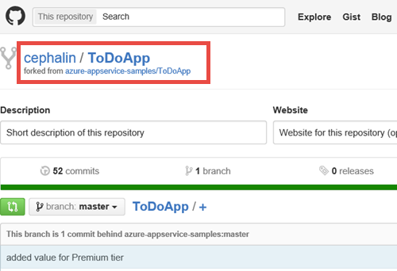
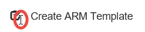
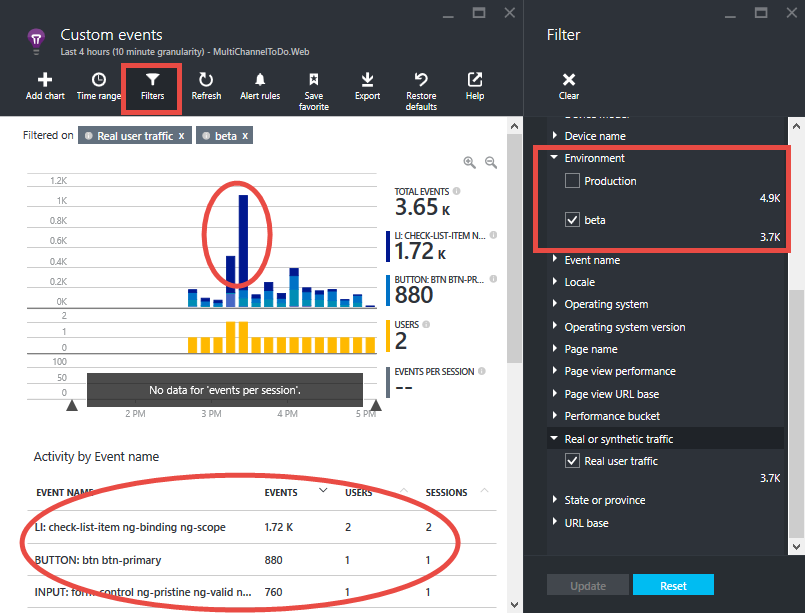

<properties
    pageTitle="Flighting Bereitstellung (beta-Tests) in Azure-App-Verwaltungsdienst"
    description="Informationen Sie zu neuen Features in Ihrer app flight oder beta testen Sie Ihre Aktualisierungen in diesem Lernprogramm End-to-End. Es vereint App Service-Features wie fortlaufender Veröffentlichung, Steckplätze, Datenverkehrs-routing und Anwendung Einsichten Integration."
    services="app-service\web"
    documentationCenter=""
    authors="cephalin"
    manager="wpickett"
    editor=""/>

<tags
    ms.service="app-service-web"
    ms.workload="web"
    ms.tgt_pltfrm="na"
    ms.devlang="na"
    ms.topic="article"
    ms.date="02/02/2016"
    ms.author="cephalin"/>
# Flighting Bereitstellung (beta-Tests) in Azure-App-Verwaltungsdienst

In diesem Lernprogramm erfahren Sie, wie *flighting Bereitstellungen* führen Sie durch die verschiedenen Funktionen des [App-Verwaltungsdienst Azure](http://go.microsoft.com/fwlink/?LinkId=529714) und [Azure Anwendung Einsichten](/services/application-insights/)integrieren. 

*Flighting* umfasst Bereitstellung, die ein neues Feature oder Änderung mit eine eingeschränkte Anzahl von real Kunden erfolgreich überprüft wird, und ist eine Hauptversion in Herstellung Szenario testen. Es wird mit hoher Wahrscheinlichkeit Beta testen und manchmal als "gesteuert Test Flug" bezeichnet. Dieser Ansatz Formular viele große Unternehmen mit einem Web-Anwesenheit mit frühen Überprüfung auf ihre app-Updates in ihre [agilen Entwicklung](https://en.wikipedia.org/wiki/Agile_software_development)zur Gewohnheit erhalten. App-Verwaltungsdienst Azure ermöglicht es Ihnen Test bei Herstellung mit fortlaufenden Veröffentlichung und Anwendung Einsichten das gleiche DevOps Szenario implementiert integriert werden soll. Dieser Ansatz bietet folgende Vorteile:

- **Gewinn real Feedback _bevor_ Updates freigegeben werden** – das einzige besser als Feedback erhalten, sobald Sie freigeben ist Feedback erhalten, bevor Sie freigeben. Sie können mit realen Benutzerdatenverkehr und-Verhalten aktualisiert so früh im Lebenszyklus eines Produkts gewünschte testen.
- **Verbessern [fortlaufender Test leistungsgesteuert Entwicklung (CTDD)](https://en.wikipedia.org/wiki/Continuous_test-driven_development) ** – geschieht durch die Integration von Test bei Herstellung mit fortlaufender Integration und Instrumentation mit Anwendung Einblicken, Benutzer Überprüfung frühes und automatisch in die Lebensdauer eines Produkts. Dadurch wird Zeit Investitionen in manuellen Test Ausführung verringert.
- **Optimieren testen Workflow** - können durch die Automatisierung Test bei Herstellung mit einer kontinuierlichen Überwachung Ausstattung potenziell die Zielsetzung der verschiedenen Arten von Tests in einem einzigen Prozess, wie z. B. [Integration](https://en.wikipedia.org/wiki/Integration_testing), [Regression](https://en.wikipedia.org/wiki/Regression_testing), [Nutzbarkeit](https://en.wikipedia.org/wiki/Usability_testing), Eingabehilfen, Lokalisierung, [Leistung](https://en.wikipedia.org/wiki/Software_performance_testing), [Sicherheit](https://en.wikipedia.org/wiki/Security_testing)und [Annahme](https://en.wikipedia.org/wiki/Acceptance_testing)ausgeführt werden.

Eine flighting Bereitstellung ist nicht fast live Datenverkehrs-routing. In eine solche Bereitstellung Einblick so schnell wie möglich sein soll, ob werden: ein unerwarteter Fehler, Leistungsabfall, Benutzer Erfahrung Probleme. Beachten Sie, dass Sie real Kunden zuständig sind. Daher müssen Vorgehensweise rechts, Sie sicherstellen, dass Sie Ihre flighting Bereitstellung eingerichtet haben, um alle Daten zu erfassen, die benötigen Sie eine fundierte Entscheidung für den nächsten Schritt treffen. In diesem Lernprogramm erfahren Sie, wie zum Sammeln von Daten mit der Anwendung Einblicken, jedoch können Sie neue Relic oder andere Technologien, die Ihrem Szenario geeignet ist. 

## Vorgehensweise

In diesem Lernprogramm erfahren Sie, so bringen Sie die folgenden Szenarien zusammen, um Ihre App-Service-app in der Herstellung testen:

- [Produktionsverkehr](app-service-web-test-in-production-get-start.md) zu Ihrer Beta-Anwendung
- [Urkunde Ihre app](../application-insights/app-insights-web-track-usage.md) zu nützliche Kennzahlen zu erhalten
- Kontinuierlich Ihre Beta-app bereitstellen und Nachverfolgen von Kennzahlen live-app
- Vergleich zwischen der Herstellung app und die Beta-app, um zu sehen, wie Code Änderungen zu Ergebnissen übersetzen Kennzahlen

## Sie benötigen

-   Ein Azure-Konto
-   Ein [GitHub](https://github.com/) -Konto
- Visual Studio 2015 - können Sie die [Community Edition](https://www.visualstudio.com/en-us/products/visual-studio-express-vs.aspx)herunterladen.
-   Git Shell (installiert mit [GitHub für Windows](https://windows.github.com/)) – Dies können Sie sowohl die Git und PowerShell-Befehle in der gleichen Sitzung ausführen
-   Neueste [Azure PowerShell](https://github.com/Azure/azure-powershell/releases/download/v0.9.8-September2015/azure-powershell.0.9.8.msi) bits
-   Grundlegende Kenntnisse Folgendes:
    -   [Ressourcenmanager Azure](../azure-resource-manager/resource-group-overview.md) Vorlage Bereitstellung (siehe [Bereitstellen einer komplexen Anwendung vorhersehbar in Azure](app-service-deploy-complex-application-predictably.md))
    -   [Git](http://git-scm.com/documentation)
    -   [PowerShell](https://technet.microsoft.com/library/bb978526.aspx)

> [AZURE.NOTE] Benötigen Sie ein Azure-Konto zum Bearbeiten dieses Lernprogramms:
> + Sie können [ein Azure-Konto kostenlos öffnen](/pricing/free-trial/) – Sie erhalten Gutschriften können Sie kostenpflichtiges Azure Services ausprobieren und auch nachdem sie es von gewohnt sind können Sie das Konto behalten und Verwendung frei Azure Dienste, wie z. B. Web Apps.
> + Können Sie die [Vorteile für Visual Studio Abonnenten aktivieren](/pricing/member-offers/msdn-benefits-details/) : Ihr Visual Studio-Abonnement bietet Ihnen Gutschriften jeden Monat, die Sie für kostenpflichtiges Azure-Dienste verwenden können.
>
> Wenn Sie mit Azure-App-Verwaltungsdienst Schritte vor dem für ein Azure-Konto anmelden möchten, wechseln Sie zu [App-Verwaltungsdienst versuchen](http://go.microsoft.com/fwlink/?LinkId=523751), in dem Sie eine kurzlebige Starter Web app sofort im App-Dienst erstellen können. Keine Kreditkarten erforderlich; keine Zusagen.

## Einrichten der Herstellung Web app

>[AZURE.NOTE] Das Skript in diesem Lernprogramm verwendeten konfiguriert automatisch fortlaufender Veröffentlichung aus Ihrer GitHub Repository. Dies ist erforderlich, dass Ihre Anmeldeinformationen GitHub sind bereits in Azure gespeichert ist, andernfalls die Bereitstellung per Batchdatei schlägt fehl, wenn Sie versuchen, Konfigurieren von Einstellungen für Quelle Steuerelemente für Web apps.
>
>Erstellen Sie eine Web app zum Speichern Ihrer Anmeldeinformationen GitHub in Azure [Azure-Portal](https://portal.azure.com/) und [GitHub Bereitstellung konfigurieren](app-service-continuous-deployment.md#Step7). Sie müssen nur einmal erforderlich.

In einer DevOps Situation stehen Ihnen eine Anwendung, die in Azure live ausgeführt wird und Änderungen daran durch fortlaufender Veröffentlichung vornehmen möchten. In diesem Szenario werden Sie für die Herstellung eine Vorlage bereitstellen, die Sie entwickelt und getestet.

1.  Erstellen Sie eigener Verzweigung des Repositorys [ToDoApp](https://github.com/azure-appservice-samples/ToDoApp) . Informationen zum Erstellen der Verzweigung finden Sie unter [Verzweigung einer Repo](https://help.github.com/articles/fork-a-repo/). Nachdem Ihre Verzweigung erstellt wurde, können Sie in Ihrem Browser angezeigt.

    

2.  Öffnen Sie eine Git Shell-Sitzung ein. Wenn Sie noch nicht über Git Shell verfügen, installieren Sie jetzt [GitHub für Windows](https://windows.github.com/) .
3.  Erstellen Sie eine lokale datenbeschriftungsreihe von Ihrem Verzweigung durch den folgenden Befehl ausführen:

        git clone https://github.com/<your_fork>/ToDoApp.git

4.  Nachdem Sie Ihre lokale datenbeschriftungsreihe haben, navigieren Sie zu * &lt;Repository_root >*\ARMTemplates, und führen Sie die deploy.ps1 Skripts mit einem eindeutigen Suffix, wie unten dargestellt:

        .\deploy.ps1 –RepoUrl https://github.com/<your_fork>/todoapp.git -ResourceGroupSuffix <your_suffix>

4.  Wenn Sie dazu aufgefordert werden, geben Sie in den gewünschten Benutzernamen und das Kennwort für den Zugriff auf. Beachten Sie Ihre Datenbankanmeldeinformationen, da Sie diese erneut angeben benötigen, wenn die Ressourcengruppe aktualisiert werden soll.

    Sie sollten provisioning Fortschritt der verschiedenen Azure Ressourcen angezeigt. Wenn die Bereitstellung abgeschlossen ist, wird das Skript starten Sie die Anwendung im Browser und bieten Ihnen einen Signalton geeignet.
    

6.  Wieder in der Git Shell-Sitzung ausführen:

        .\swap –Name ToDoApp<your_suffix>

    

7.  Wenn das Skript abgeschlossen ist, kehren Sie zum Navigieren Sie zu der Front-End-Adresse (http://ToDoApp*&lt;Your_suffix >*.azurewebsites.net/) in der Herstellung Ausführung die Anwendung angezeigt.
5.  Melden Sie sich bei der [Azure-Portal](https://portal.azure.com/) , und schauen Sie sich, was erstellt wird.

    Sie sollten möglicherweise in derselben Ressourcengruppe, mit zwei Web-apps finden Sie unter der `Api` Suffix im Namen. Wenn Sie sich die Gruppe Ressourcenansicht anschauen, sehen Sie auch die SQL-Datenbank und Server, der App-Serviceplan und den staging Steckplätzen für den Web apps. Durchsuchen Sie die verschiedenen Ressourcen und vergleichen Sie diese mit * &lt;Repository_root >*\ARMTemplates\ProdAndStage.json sehen, wie sie in der Vorlage konfiguriert werden.

    

Sie haben die Herstellung app eingerichtet.  Nun angenommen, Sie Feedback erhalten, dass Nutzbarkeit für die app beeinträchtigt wird. Damit Sie ermitteln möchten. Sie nun Ihre app, um Feedback an Sie instrumentieren.

## Untersuchen: Instrumentieren Sie Ihrer Client-app für die Überwachung/Kennzahlen

5. Open * &lt;Repository_root >*\src\MultiChannelToDo.sln in Visual Studio.
6. Alle Nuget-Pakete wiederherstellen, indem Sie mit der rechten Maustaste Lösung > **NuGet-Pakete verwalten, für die Lösung** > **Wiederherstellen**.
6. Mit der rechten Maustaste **MultiChannelToDo.Web** > **Hinzufügen Anwendung Einsichten werden** > **Einstellungen konfigurieren** > ändern Ressourcengruppe zu ToDoApp*&lt;Your_suffix >* > **Anwendung-Einsichten zu Projekt hinzufügen**.
7. Öffnen Sie im Portal Azure das Blade für die **MultiChannelToDo.Web** Anwendung Einblicke Ressource ein. Klicken Sie dann im Webpart **Anwendung Dienststatus** auf **Informationen zum Sammeln von Daten für Browser Seite laden** > Code kopieren.
7. Fügen Sie den kopierten JS Instrumentationscode zu * &lt;Repository_root >*\src\MultiChannelToDo.Web\app\Index.cshtml, unmittelbar vor dem schließenden `<heading>` Kategorie. Sie sollten den Schlüssel eindeutige Instrumentation Ihrer Anwendung Einblicke Ressource enthalten.

        

11. Senden Sie benutzerdefinierte Ereignisse an Anwendung Einsichten für Maus Mausklicks durch den folgenden Code an das Ende der Textkörper hinzufügen:

        

    Diese JavaScript-Codeausschnitt sendet ein benutzerdefiniertes Ereignis zu Einsichten Anwendung jedes Mal, wenn ein Benutzer auf eine beliebige Stelle in der Web-app klickt.

12. Commit Git Shell und drücken Sie die gewünschten Änderungen vor, um Ihre Verzweigung in GitHub. Warten Sie dann, Clients Browser aktualisieren aus.

        git add -A :/
        git commit -m "add AI configuration for client app"
        git push origin master

6.  Austauschen der Herstellung bereitgestellten app Änderungen an:

        .\swap –Name ToDoApp<your_suffix>

13. Navigieren Sie zu der Anwendung Einsichten Ressource, die Sie konfiguriert. Klicken Sie auf benutzerdefinierte Ereignisse.

    

    Wenn die Kennzahlen für benutzerdefinierte Ereignisse angezeigt wird, warten Sie einige Minuten, und klicken Sie auf **Aktualisieren**.

Angenommen, Sie sehen, wie ein Diagramm unter:

Und das Ereignis-Raster, darunter:

Nach Ihrer Anwendung ToDoApp Code das Ereignis **Schaltfläche** entspricht der Sendeschaltfläche, und das Ereignis **Eingabe** im Textfeld entspricht. Punkte bisher sinnvoll sein. Es sieht jedoch ist es eine gute Menge der Klicks und nur wenige Klicks auf die Aufgabenelemente ( **LI** -Ereignisse).

Anhand dieser Formular Sie Ihre Hypothese, die für einige Benutzer sind verwechselt welcher Teil der Benutzeroberfläche geklickt werden kann und hierfür ist, dass sich der Cursor für den markierten Text formatiert wird, wenn sie auf die Listenelemente und ihre Symbole bewegt wird.

Dies möglicherweise eine erfundene Beispiel. Sie nun dennoch eine Verbesserung zu Ihrer Anwendung, und führen Sie dann eine flighting Bereitstellung um Feedback Nutzbarkeit von live-Kunden zu gelangen.

### Der Server-app für die Überwachung/Kennzahlen Instrumentieren
Dies ist eine Tangens seit das Szenario in diesem Lernprogramm gezeigt mit der Clientanwendung befasst sich nur. Vollständigkeit werden Sie jedoch die serverseitige App festgelegt.

6. Mit der rechten Maustaste **MultiChannelToDo** > **Hinzufügen Anwendung Einsichten werden** > **Einstellungen konfigurieren** > ändern Ressourcengruppe zu ToDoApp*&lt;Your_suffix >* > **Anwendung-Einsichten zu Projekt hinzufügen**.
12. Commit Git Shell und drücken Sie die gewünschten Änderungen vor, um Ihre Verzweigung in GitHub. Warten Sie dann, Clients Browser aktualisieren aus.

        git add -A :/
        git commit -m "add AI configuration for server app"
        git push origin master

6.  Austauschen der Herstellung bereitgestellten app Änderungen an:

        .\swap –Name ToDoApp<your_suffix>

Das war's schon!

## Ermitteln: Hinzufügen von Slot-spezifische Tags zu Client app metrischen

In diesem Abschnitt Konfigurieren Sie die verschiedenen Bereitstellung Steckplätze um Slot-spezifische werden auf dieselbe Anwendung Einsichten Ressource zu senden. Auf diese Weise können Sie werden Daten zwischen den Datenverkehr aus verschiedenen Steckplätzen (Bereitstellung Umgebungen) vergleichen, um einfach die Auswirkungen Ihrer app Änderungen anzuzeigen. Zur gleichen Zeit können Sie den Datenverkehr Herstellung vom restlichen trennen, damit Sie weiterhin Ihre app Herstellung Bedarf überwachen können.

Da Sie Daten auf Clientverhalten tragen sind, werden Sie in index.cshtml [eine Initialisierung werden an Ihre JavaScript-Code hinzufügen](../application-insights/app-insights-api-custom-events-metrics.md#js-initializer) . Wenn Sie die serverseitige Leistung testen möchten, beispielsweise auch möglich auf ähnliche Weise im Servercode (siehe [Anwendung Einsichten API für eine benutzerdefinierte Ereignisse und Kriterien](../application-insights/app-insights-api-custom-events-metrics.md).

1. Fügen Sie zunächst den Code Bewteen der beiden `//` Kommentare unterhalb des JavaScript blockieren, die Sie hinzugefügt der `<heading>` Kategorisieren von einer früheren Version.

        window.appInsights = appInsights;

        // Begin new code
        appInsights.queue.push(function () {
            appInsights.context.addTelemetryInitializer(function (envelope) {
                var telemetryItem = envelope.data.baseData;
                telemetryItem.properties = telemetryItem.properties || {};
                telemetryItem.properties["Environment"] = "@System.Configuration.ConfigurationManager.AppSettings["environment"]";
            });
        });
        // End new code

        appInsights.trackPageView();

    Diese Initialisierung Code bewirkt, dass die `appInsights` hinzuzufügende Objekt der eine benutzerdefinierte Eigenschaft namens `Environment` auf jeden Teil gesendet werden.

2. Fügen Sie diese benutzerdefinierte Eigenschaft als [Slot Einstellung](web-sites-staged-publishing.md#AboutConfiguration) für Ihre Web-app in Azure. Dazu führen Sie die folgenden Befehle in der Git Shell-Sitzung ein.

        $app = Get-AzureWebsite -Name todoapp<your_suffix> -Slot production
        $app.AppSettings.Add("environment", "Production")
        $app.SlotStickyAppSettingNames.Add("environment")
        $app | Set-AzureWebsite -Name todoapp<your_suffix> -Slot production

    Die Web.config im Projekt bereits definiert die `environment` app-Einstellung. Mit dieser Einstellung, wenn Sie die app lokal, Testen metrischen markiert mit `VS Debugger`. Jedoch, wenn Sie Ihre Änderungen zu Azure drücken, Azure wird suchen und Verwenden der `environment` app stattdessen in der Web-app-Konfiguration festlegen und metrischen werden mit markiert `Production`.

3. Commit und Laden Sie Ihre Änderungen Code auf Ihre Verzweigung auf GitHub, und warten Sie für Ihre Benutzer verwenden die neue app (müssen im Browser aktualisieren). Es dauert ungefähr 15 Minuten für die neue Eigenschaft in Ihrer Anwendung Einsichten angezeigt `MultiChannelToDo.Web` Ressource.

        git add -A :/
        git commit -m "add environment property to AI events for client app"
        git push origin master

4. Jetzt, schalten Sie erneut auf das **benutzerdefinierte Ereignisse** Blade und Filtern Sie die Metrik auf `Environment=Production`. Sie sollten jetzt alle neuen benutzerdefinierten Ereignisse in der Herstellung Slot mit diesem Filter finden Sie unter sein.

    

5. Klicken Sie auf die Schaltfläche **Favoriten** zum Speichern die aktuellen Kennzahlen Explorer-Einstellungen auf ungefähr wie folgt **benutzerdefinierte Ereignisse: Herstellung**. Sie können später problemlos zwischen dieser Ansicht und ein Slot Bereitstellung wechseln.

    > [AZURE.TIP] Erwägen Sie für noch mehr leistungsfähige Analytics die [Integration Ihrer Anwendung Einsichten Ressource mit Power BI](../application-insights/app-insights-export-power-bi.md).

### Server-app metrischen Slot-spezifische Tags hinzufügen
Erneut auf Vollständigkeit richten Sie die app serverseitigen ein. Im Gegensatz zu den Client-app die in JavaScript instrumentiert wird, wird der Slot-spezifische Tags für die app Server mit .NET Code instrumentiert.

1. Open * &lt;Repository_root >*\src\MultiChannelToDo\Global.asax.cs. Hinzufügen den Codeblock anhand der unmittelbar vor dem schließenden Namespace geschweifte Klammer.

        namespace MultiChannelToDo
        {
                ...

                // Begin new code
            public class ConfigInitializer
            : ITelemetryInitializer
            {
                void ITelemetryInitializer.Initialize(ITelemetry telemetry)
                {
                    telemetry.Context.Properties["Environment"] = System.Configuration.ConfigurationManager.AppSettings["environment"];
                }
            }
                // End new code
        }

2. Korrigieren Sie die Namen mit einer Auflösung von Fehlern durch Hinzufügen der `using` Anweisungen unter an den Anfang der Datei ein:

        using Microsoft.ApplicationInsights.Channel;
        using Microsoft.ApplicationInsights.Extensibility;

3. Fügen Sie den folgenden Code an den Anfang des der `Application_Start()` Methode:

        TelemetryConfiguration.Active.TelemetryInitializers.Add(new ConfigInitializer());

3. Commit und Laden Sie Ihre Änderungen Code auf Ihre Verzweigung auf GitHub, und warten Sie für Ihre Benutzer verwenden die neue app (müssen im Browser aktualisieren). Es dauert ungefähr 15 Minuten für die neue Eigenschaft in Ihrer Anwendung Einsichten angezeigt `MultiChannelToDo` Ressource.

        git add -A :/
        git commit -m "add environment property to AI events for server app"
        git push origin master

## Update: Richten Sie Ihrer Beta Verzweigung ein

2. Open * &lt;Repository_root >*\ARMTemplates\ProdAndStagetest.json und suchen Sie nach der `appsettings` Ressourcen (Suchen nach `"name": "appsettings"`). Es gibt 4 von ihnen, eine für jeden Slot ein. 

2. Für jede `appsettings` Ressourcen, Hinzufügen einer `"environment": "[parameters('slotName')]"` app-Einstellung an das Ende der `properties` Matrix. Vergessen Sie nicht, um die vorherige Zeile mit einem Komma zu beenden.

    
    
    Sie gerade hinzugefügt haben die `environment` app-Einstellung auf alle Slots in der Vorlage.
    
2. Suchen in derselben Datei, die `slotconfignames` Ressourcen (Suchen nach `"name": "slotconfignames"`). Es gibt 2 von ihnen, eine für jede app aus.

2. Für jede `slotconfignames` Ressource hinzufügen `"environment"` an das Ende der `appSettingNames` Matrix zurück. Vergessen Sie nicht, um die vorherige Zeile mit einem Komma zu beenden.

    Nur vorgenommen haben die `environment` app Speicherstick auf deren jeweiligen Bereitstellung Slot für beide apps festlegen.  

3. Führen Sie folgende Befehle in der Git Shell-Sitzung mit dem gleichen Ressource Gruppe Suffix, dem noch verwendet.

        git checkout -b beta
        git push origin beta
        .\deploy.ps1 -RepoUrl https://github.com/<your_fork>/ToDoApp.git -ResourceGroupSuffix <your_suffix> -SlotName beta -Branch beta

4. Wenn Sie dazu aufgefordert werden, geben Sie die gleichen SQL-Datenbankanmeldeinformationen als vor. Geben Sie dann, wenn Sie aufgefordert werden, aktualisieren die Ressourcengruppe, `Y`, dann `ENTER`.

    Nachdem das Skript endet, alle Ihre Ressourcen in der ursprünglichen Ressourcengruppe aufbewahrt werden, aber ein neues Feld mit dem Namen "Beta" wird es mit der gleichen Konfiguration wie den Slot "Staging" erstellt, die am Anfang erstellt wurde.

    >[AZURE.NOTE] Diese Methode zum Erstellen von anderen Bereitstellung Umgebungen unterscheidet sich von der [agiles Software-Entwicklung mit Azure-App-Verwaltungsdienst](app-service-agile-software-development.md)-Methode. Hier erstellen Sie Bereitstellung Umgebungen mit der Bereitstellung, in dem es als Sie Bereitstellung Umgebungen mit Ressourcengruppen erstellen. Verwalten der Bereitstellung Umgebungen mit Ressourcengruppen können Sie dieser Umgebung für Entwickler gesperrt bleiben, aber es ist nicht einfach zu tun ist in der Herstellung, was Sie einfach mit der möglich testen.

Wenn Sie möchten, können Sie auch eine alpha-app durch Ausführen erstellen

    git checkout -b alpha
    git push origin alpha
    .\deploy.ps1 -RepoUrl https://github.com/<your_fork>/ToDoApp.git -ResourceGroupSuffix <your_suffix> -SlotName beta -Branch alpha

In diesem Lernprogramm werden haben nur Ihre app Beta weiterhin verwenden.

## Update: Drücken Sie Ihre Aktualisierungen zur Beta-app

Zurück zu Ihrer Anwendung, die Sie zu verbessern möchten.

1. Vergewissern Sie sich, dass Sie jetzt in der Beta-Verzweigung

        git checkout beta

2. In * &lt;Repository_root >*\src\MultiChannelToDo.Web\app\Index.cshtml, finden Sie die `<li>` kategorisieren und Hinzufügen der `style="cursor:pointer"` Attribut, wie unten dargestellt.

    

3. Commit und Pushbenachrichtigungen in Azure.

4. Stellen Sie sicher, dass die Änderung jetzt im Slot Beta angezeigt durch Navigieren zur http://todoapp*&lt;Your_suffix >*-beta.azurewebsites.net/. Wenn Sie die Änderung noch nicht angezeigt werden, aktualisieren Sie Ihren Browser, um den neuen Javascript-Code zu erhalten.

    

Jetzt, da Sie die Änderungen im Slot Beta ausgeführt haben, sind Sie bereit sind, eine flighting Bereitstellung durchführen.

## Zu überprüfen: Weiterleitung von Verkehr zur Beta-app

In diesem Abschnitt werden Sie bei der app Beta Datenverkehr leiten. Für die Übersichtlichkeit der Demo würden Sie einen großen Teil des Datenverkehrs an sie weiterleiten. In der Praxis wird die Menge des Datenverkehrs, die Sie weiterleiten möchten Ihre Situation abhängig sind. Beispielsweise, wenn Ihre Website auf die Skalierung der microsoft.com ist, müssen Sie weniger als 1 % am gesamten Verkehr möglicherweise um hilfreiche Daten zugreifen zu können.

1. In der Git Shell-Sitzung, führen Sie die folgenden Befehle zum Weiterleiten von Hälfte des Datenverkehrs Herstellung an den Slot Beta:

        $siteName = "ToDoApp<your suffix>"
        $rule = New-Object Microsoft.WindowsAzure.Commands.Utilities.Websites.Services.WebEntities.RampUpRule
        $rule.ActionHostName = "$siteName-beta.azurewebsites.net"
        $rule.ReroutePercentage = 50
        $rule.Name = "beta"
        Set-AzureWebsite $siteName -Slot Production -RoutingRules $rule

  Die `ReroutePercentage=50` -Eigenschaft gibt an, dass 50 % des Datenverkehrs Herstellung der Beta-app-URL weitergeleitet wird (durch die `ActionHostName` Eigenschaft).

2. Navigieren Sie nun zu http://ToDoApp*&lt;Your_suffix >*. azurewebsites.net. 50 % des Datenverkehrs sollten jetzt in der Beta-Slot umgeleitet werden.

3. Filtern Sie in Ihrer Anwendung Einsichten Ressourcen, die Metrik ein, indem Sie Umgebung = "Beta".

    > [AZURE.NOTE] Wenn Sie diese gefilterten Ansicht als ein anderes Favorit speichern, können Sie einfach die metrischen Explorer-Ansichten zwischen Herstellung und Beta-Ansichten umdrehen.

Nehmen Sie an in der Anwendung Einsichten etwas ähnlich wie die folgende angezeigt:

Nicht nur ist dies angezeigt wird, dass es gibt viele weitere Klicks auf die `<li>` Tags, aber es scheint eines Überspannung Mausklicks sein muss, `<li>` Kategorien. Sie können dann davon ausgehen, dass Personen das neue ermittelt haben `<li>` Tags geklickt werden kann und alle ihre zuvor abgeschlossenen Vorgänge in der app sind jetzt löschen.

Basierend auf den Daten der flighting Bereitstellung, entscheiden Sie, dass die neue Benutzeroberfläche für die Herstellung bereit ist.

## Wechseln Sie live: Verschieben Sie den neuen Code in Betrieb

Sie nun können die Aktualisierung zur Herstellung zu navigieren. Gute ist, dass es nun Sie wissen, dass die Aktualisierung bereits überprüften _vor_ wurde ans Herstellung verschoben wird. Nun können Sie diese zuverlässig bereitstellen. Da Sie ein Update zur app-Client AngularJS vorgenommen haben, überprüft Sie nur den clientseitigen Code. Wenn Sie die Back-End-API Web app ändern wollten, konnte die Änderungen auf ähnliche Weise und einfach überprüft werden.

1. Entfernen Sie in Git Shell die Regel für den Datenverkehr routing, indem Sie den folgenden Befehl ausführen:

        Set-AzureWebsite $siteName -Slot Production -RoutingRules @()

2. Führen Sie die Git Befehle:

        git checkout master
        git pull origin master
        git merge beta
        git push origin master

2. Warten Sie einige Minuten, damit der neue Code in den staging Slot bereitgestellt werden, und starten Sie http://ToDoApp*&lt;Your_suffix >*-staging.azurewebsites.net, um sicherzustellen, dass das neue Update im staging Slot aufgewärmt ist. Denken Sie daran, die die Ihrer Verzweigung des master Verzweigung mit den staging Slot der app verknüpft ist.

3. Nun den staging Slot in Betrieb austauschen

        cd <ROOT>\ToDoApp\ARMTemplates
        .\swap.ps1 -Name todoapp<your_suffix>

## Zusammenfassung ##

Azure App Service erleichtert für kleine-mittelständische Unternehmen So testen Sie ihre Kunden zugänglichen apps eines Beitrags in Fertigung, die bisher geleistet wurde in großen Unternehmen. Hoffentlich, haben Sie in diesem Lernprogramm erhalten, die Kenntnisse benötigten Kombinieren von App-Dienst und Anwendung Einsichten mögliche flighting Bereitstellung und sogar anderen Szenarien Test-in-Herstellung in der Welt DevOps werden kann. 

## Weitere Ressourcen ##

-   [Agiles Software-Entwicklung mit Azure-App-Verwaltungsdienst](app-service-agile-software-development.md)
-   [Einrichten von staging-Umgebungen von Web apps in Azure-App-Verwaltungsdienst](web-sites-staged-publishing.md)
-   [Bereitstellen einer komplexen Anwendungs vorhersehbar in Azure](app-service-deploy-complex-application-predictably.md)
-   [Authoring Azure Ressourcenmanager Vorlagen](../resource-group-authoring-templates.md)
-   [JSONLint - die JSON-Bestätigung](http://jsonlint.com/)
-   [Git Verzweigen – grundlegende Verzweigen und Zusammenführen](http://www.git-scm.com/book/en/v2/Git-Branching-Basic-Branching-and-Merging)
-   [Azure PowerShell](../powershell-install-configure.md)
-   [Project Kudu Wiki](https://github.com/projectkudu/kudu/wiki)
