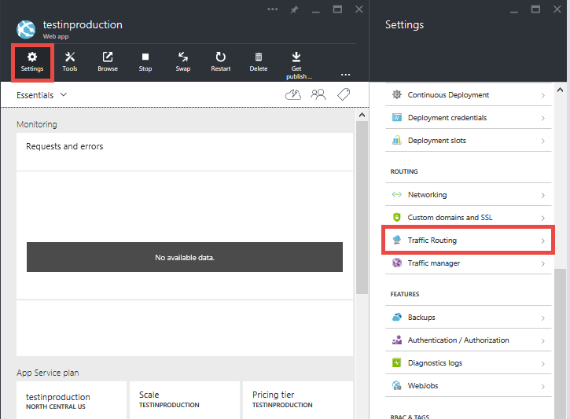

<properties
    pageTitle="Erste Schritte mit Test bei Herstellung von Web Apps"
    description="Informationen Sie zu den Test im Herstellung (TiP) Feature in Azure App Dienst Web Apps."
    services="app-service\web"
    documentationCenter=""
    authors="cephalin"
    manager="wpickett"
    editor=""/>

<tags
    ms.service="app-service-web"
    ms.workload="web"
    ms.tgt_pltfrm="na"
    ms.devlang="na"
    ms.topic="article"
    ms.date="01/13/2016"
    ms.author="cephalin"/>

# Erste Schritte mit Test bei Herstellung von Web Apps

Testen der Herstellung oder Web app mit live Kunden Datenverkehr, live-testen ist eine Teststrategie, die app-Entwickler zunehmend in ihre [agilen](https://en.wikipedia.org/wiki/Agile_software_development) Entwicklungsmethodik integrieren. Sie können die Qualität Ihrer Apps mit live den Benutzerdatenverkehr in Ihrem Unternehmen, im Gegensatz zu synthetisierte Daten in einer testumgebung zu testen. Durch Ihre neue app real Benutzer verfügbar zu machen, können Sie auf die tatsächlichen Probleme informiert werden, die Ihre app möglicherweise stoßen, nachdem es bereitgestellt wird. Sie können überprüfen, ob der Funktionalität, Leistung und Wert Ihrer app Updates gegen die Lautstärke, Geschwindigkeit und Vielzahl von real Benutzerdatenverkehr, die nie in einer testumgebung annähernd übereinstimmen.

## Datenverkehr Routing in der App-Dienst Web Apps

Sie können mithilfe des Datenverkehrs-Routing-Features in [Azure-App-Dienst](http://go.microsoft.com/fwlink/?LinkId=529714)einen Teil des live den Benutzerdatenverkehr auf eine oder mehrere [Bereitstellung Steckplätze](web-sites-staged-publishing.md)direkte und analysieren Sie Ihre app mit [Azure Anwendung Einblicken](/services/application-insights/) oder [Azure HDInsight](/services/hdinsight/)oder eines Drittanbieter-Tools, wie [Neue Relic](/marketplace/partners/newrelic/newrelic/) , um die Änderungen zu überprüfen. Beispielsweise können Sie die folgenden Szenarien mit App-Dienst implementieren:

- Ermitteln von Fehlern funktionsübergreifendes oder pinpoint Leistungsengpässe in Ihre Aktualisierungen vor der Bereitstellung in der gesamten Website
- Ausführen von "gesteuert Test Flüge" Ihrer Änderungen durch Messen Usibility Kennzahlen Beta-App
- Auf ein neues Update ineinander verlaufen und ordnungsgemäß in die aktuelle Version unten zurück, wenn ein Fehler auftritt 
- Optimieren Ihrer app geschäftliche Ergebnisse durch Ausführen [A / B überprüft](https://en.wikipedia.org/wiki/A/B_testing) oder [multivariate Tests](https://en.wikipedia.org/wiki/Multivariate_testing_in_marketing) in mehreren Bereitstellung Steckplätzen

### Anforderungen für die Verwendung von Routing Datenverkehr in Web Apps

- Web app muss in **Standard** oder **Premium** Ebene ausführen, wie es für mehrere Bereitstellung Steckplätze erforderlich ist.
- Damit Sie ordnungsgemäß funktioniert, erfordert Datenverkehrs-Routing Cookies im Browser des Benutzers aktiviert sein. Datenverkehr Routing verwendet Cookies, um einem Clientbrowser, um ein Slot Bereitstellung für die Dauer der Client-Sitzung anheften.
- Datenverkehr Routing unterstützt erweiterte Tipp Szenarien durch Azure PowerShell-Cmdlets.

## Routing Datenverkehr Segment auf ein Slot Bereitstellung

Die grundlegende Ebene in jeder Tipp Szenario leiten Sie einen vordefinierten Prozentsatz am live Verkehr an ein Slot nicht Herstellung Bereitstellung an. Führen Sie hierzu die folgenden Schritte aus:

>[AZURE.NOTE] Hier die Schritte wird davon ausgegangen, dass Sie bereits ein [Slot nicht Herstellung Bereitstellung](web-sites-staged-publishing.md) und den gewünschten Web app-Inhalten noch [bereitgestellt](web-sites-deploy.md) , damit ist.

1. Melden Sie sich bei der [Azure-Portal](https://portal.azure.com/).
2. Klicken Sie in der Web-app-Blade **Einstellungen**auf > **Datenverkehrs-Routing**.
  
3. Wählen Sie den Slot, den Sie weiterleiten Datenverkehr an und den Prozentsatz des gesamten Datenverkehrs Sie wünschen, und klicken Sie auf **Speichern**möchten.

    

4. Wechseln Sie zu der Bereitstellung-Slot Blade. Es sollte jetzt live Datenverkehr an sie weitergeleitet wird angezeigt.

    

Nachdem Datenverkehrs-Routing konfiguriert ist, wird der angegebene Prozentsatz des Clients zufällig an Ihre nicht Herstellung Slot weitergeleitet werden. Es ist jedoch zu beachten, dass, nachdem ein Client automatisch an einem bestimmten Slot weitergeleitet wird, es "zu diesem Slot für die Dauer dieser Clientsitzung angeheftet sein wird". Dies erledigt mithilfe eines Cookies, um die Benutzer-Sitzung zu fixieren. Wenn Sie die HTTP-Anfragen untersuchen, finden Sie eine `TipMix` Cookie in jeder nachfolgenden Anfrage.

## Erzwingen, dass Client-Anfragen an einem bestimmten slot

Automatische Datenverkehrs-routing ist – App-Dienst können Anfragen an einem bestimmten Slot. Dies ist nützlich, wenn Sie Ihre Benutzer können Suchbegriffen in oder melden Sie sich von Ihrem Beta-app sein soll. Verwenden Sie hierzu die `x-ms-routing-name` Abfrage Parameter.

So erstellen Sie Benutzer bei der Verwendung von einer bestimmten Slot erneut `x-ms-routing-name`, achten Sie darauf, dass der Slot bereits in der Liste Datenverkehrs-Routing hinzugefügt wird. Da Sie explizit auf ein Slot weiterleiten möchten, spielt keine Rolle der tatsächliche Weiterleitung Prozentsatz, die, den Sie festlegen. Wenn Sie möchten, können Sie gestalten "Beta Link" die Benutzer klicken können, um die app Beta zuzugreifen.

### Beta-app für Benutzer, Suchbegriffen

Damit die Benutzer, die von der app Beta Suchbegriffen können, können Sie diesen Link zum Beispiel, in Ihrer Webseite einfügen:

    <a href="<webappname>.azurewebsites.net/?x-ms-routing-name=self">Go back to production app</a>

Die Zeichenfolge `x-ms-routing-name=self` gibt der Herstellung Slot an. Sobald der Browser des Clients Zugriff auf den Link werden nicht nur auf die Herstellung Slot umgeleitet, sondern wird jeder nachfolgenden Anfrage enthalten die `x-ms-routing-name=self` Cookie, das die Sitzung in der Herstellung Slot fixiert.

### Benutzer in Beta-app Suchbegriffen

Zum zulassen, dass Benutzer entscheiden Sie sich für Ihre app Beta, legen Sie den gleichen Abfrageparameter auf den Namen des den Slot nicht Herstellung, z. B.:

        <webappname>.azurewebsites.net/?x-ms-routing-name=staging

## Weitere Ressourcen ##

-   [Einrichten von staging-Umgebungen von Web apps in Azure-App-Verwaltungsdienst](web-sites-staged-publishing.md)
-   [Bereitstellen einer komplexen Anwendungs vorhersehbar in Azure](app-service-deploy-complex-application-predictably.md)
-   [Agiles Software-Entwicklung mit Azure-App-Verwaltungsdienst](app-service-agile-software-development.md)
-   [Effektives Verwenden von DevOps Umgebungen für von Web apps](app-service-web-staged-publishing-realworld-scenarios.md)