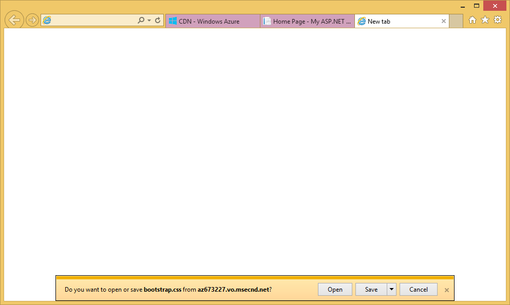

<properties 
    pageTitle="Verwenden von Azure CDN in Azure App-Verwaltungsdienst" 
    description="Ein Lernprogramm, die Sie, wie eine Web app auf Azure-App-Dienst bereitgestellt, die Inhalte aus einem integrierten Azure CDN Endpunkt dient zum Erstellen" 
    services="app-service\web,cdn" 
    documentationCenter=".net" 
    authors="cephalin" 
    manager="wpickett" 
    editor="jimbe"/>

<tags 
    ms.service="app-service" 
    ms.workload="tbd" 
    ms.tgt_pltfrm="na" 
    ms.devlang="dotnet" 
    ms.topic="article" 
    ms.date="07/01/2016" 
    ms.author="cephalin"/>


# <a name="use-azure-cdn-in-azure-app-service"></a>Verwenden von Azure CDN in Azure App-Verwaltungsdienst

[App-Dienst](http://go.microsoft.com/fwlink/?LinkId=529714) kann [Azure CDN](/services/cdn/), hinzufügen zu globalen Anpassungsbereich für Funktionen gehörende in [App Dienst Web Apps](http://go.microsoft.com/fwlink/?LinkId=529714) durch Ihre Web app Inhalte global vom Serverknoten in der Nähe der Kunden integriert werden (eine aktualisierte Liste der aktuellen Knotenpositionen finden Sie [hier](http://msdn.microsoft.com/library/azure/gg680302.aspx)). Szenarien wie statische Bilder erstellen diese Integration kann die Leistung Ihrer Azure App Dienst Web Apps beträchtlich erhöhen und Ihre Web-app Erfahrungen weltweit deutlich verbessert. 

Integrieren von Web Apps in Azure CDN bietet Ihnen die folgenden Vorteile:

- Integrieren Sie Bereitstellung von Inhalten (Bildern, Skripts und Stylesheets) als Teil der Web-app [Bereitstellung kontinuierlichen](app-service-continuous-deployment.md) Prozess
- Einfaches upgrade NuGet Pakete im Web app in Azure-App-Dienst, wie z. B. jQuery oder Bootstrap Versionen 
- Verwalten Sie Ihrer Web-Anwendung und Ihre Inhalte CDN served über die gleiche Visual Studio-Oberfläche
- Integrieren von ASP.NET bündeln und Skriptladeprogrammen mit Azure CDN

[AZURE.INCLUDE [app-service-web-to-api-and-mobile](../../includes/app-service-web-to-api-and-mobile.md)] 

## <a name="what-you-will-build"></a>Was werden Sie erstellen ##

Sie werden eine Web app zu App-Verwaltungsdienst Azure mit der standardmäßigen ASP.NET-MVC-Vorlage in Visual Studio bereitstellen, auch Schreiben von Code zum Konfigurieren der Fallbackmechanismus für den Fall, dass das CDN offline ist served bündeln und Code hinzufügen, um den Inhalt aus einer integrierten Azure CDN, beispielsweise ein Bild, Controller Aktionsergebnisse, und die standardmäßigen JavaScript und CSS-Dateien, dienen.

## <a name="what-you-will-need"></a>Sie benötigen ##

In diesem Lernprogramm weist die folgenden Komponenten:

-   Ein aktives [Microsoft Azure-Konto](/account/)
-   Visual Studio 2015 mit dem [Azure SDK für .NET](http://go.microsoft.com/fwlink/p/?linkid=323510&clcid=0x409). Wenn Sie Visual Studio verwenden, können die Schritte variieren.

> [AZURE.NOTE] Benötigen Sie ein Azure-Konto zum Bearbeiten dieses Lernprogramms:
> + Sie können [ein Azure-Konto kostenlos öffnen](/pricing/free-trial/) – Sie erhalten Gutschriften können Sie kostenpflichtiges Azure Services ausprobieren und auch nachdem sie es von gewohnt sind können Sie das Konto behalten und Verwendung frei Azure Dienste, wie z. B. Web Apps.
> + Können Sie die [Vorteile für Visual Studio Abonnenten aktivieren](/pricing/member-offers/msdn-benefits-details/) : Ihr Visual Studio-Abonnement bietet Ihnen Gutschriften jeden Monat, die Sie für kostenpflichtiges Azure-Dienste verwenden können.
>
> Wenn Sie mit Azure-App-Verwaltungsdienst Schritte vor dem für ein Azure-Konto anmelden möchten, wechseln Sie zu [App-Verwaltungsdienst versuchen](http://go.microsoft.com/fwlink/?LinkId=523751), in dem Sie eine kurzlebige Starter Web app sofort im App-Dienst erstellen können. Keine Kreditkarten erforderlich; keine Zusagen.

## <a name="deploy-a-web-app-to-azure-with-an-integrated-cdn-endpoint"></a>Bereitstellen einer Web-app in Azure mit integrierten CDN Endpunkt ##

In diesem Abschnitt werden Sie Standard ASP.NET-MVC-Anwendungsvorlage in Visual Studio 2015 App-Dienst bereitstellen, und klicken Sie dann einen neuen CDN Endpunkt integriert. Führen Sie die folgenden Schritte aus:

1. In Visual Studio 2015, erstellen Sie eine neue ASP.NET Web-Anwendung in der Menüleiste auf **Datei > Neu > Projekt > Web > ASP.NET Web-Anwendung**. Geben sie einen Namen ein, und klicken Sie auf **OK**.

    

3. Wählen Sie **MVC** aus, und klicken Sie auf **OK**.

    

4. Wenn Sie in Ihrer Azure-Konto noch nicht angemeldet nicht geschehen ist, klicken Sie auf das Symbol "Konto" in der oberen rechten Ecke, und führen Sie im Dialogfeld zur Anmeldung bei Ihrem Konto Azure. Konfigurieren der app aus, wie unten dargestellt, sobald Sie fertig sind, und dann klicken Sie auf **neu** , um eine neue App-Serviceplan für Ihre app zu erstellen.  

    

5. Klicken Sie im Dialogfeld konfigurieren Sie einen neuen App-Serviceplan, wie unten dargestellt, und klicken Sie auf **OK**. 

    

8. Klicken Sie auf **Erstellen** , um das Web app erstellen.

    

9. Nachdem eine Anwendung ASP.NET erstellt wurde, veröffentlichen Azure Azure App Dienst Aktivität im Bereich durch Klicken auf **Veröffentlichen `<app name>` diese Web App jetzt**. Klicken Sie auf **Veröffentlichen** , um den Vorgang abzuschließen.

    

    Nach Abschluss der Veröffentlichung, werden Sie veröffentlichten Web app im Browser angezeigt. 

1. Wenn Sie um einen Endpunkt CDN zu erstellen, melden Sie sich in der [Azure-Portal](https://portal.azure.com). 
2. Klicken Sie auf **+ neue** > **Medien + CDN** > **CDN**.

    

3. Geben Sie die **CDN**, **Speicherort**, **Ressourcengruppe**, **Preise Ebene**, und klicken Sie auf **Erstellen**

       

4. Im **Profil CDN** Blade klicken Sie auf die Schaltfläche **+ Endpunkt** . Geben sie einen Namen, wählen Sie in der Dropdownliste **Typ Origin** und Web app in der Dropdownliste den **Ursprung Hostname** **Web App** aus, und klicken Sie auf **Hinzufügen**.  

    


    > [AZURE.NOTE] Nachdem Ihre CDN-Endpunkt erstellt wurde, wird das Blade **Endpunkt** gezeigt werden deren CDN URL und der Origin-Domäne, der sie in integriert ist. Es kann jedoch eine Weile für den neuen CDN Endpunkt Konfiguration vollständig an allen Standorten die CDN Knoten weitergegeben werden dauern. 

3. Klicken Sie in das Blade **Endpunkt** auf den Namen des gerade erstellten CDN Endpunkts an.

    

3. Klicken Sie auf die Schaltfläche **Konfigurieren** . Das Blade **Konfigurieren** im Dropdownmenü **Abfragezeichenfolge Zwischenspeichern Verhalten** wählen Sie **Zwischenspeichern jeder eindeutigen URL** , und klicken Sie auf die Schaltfläche **Speichern** .


    

Nachdem Sie dies zu aktivieren, wird die Verknüpfung mit einer anderen Abfragezeichenfolgen zugegriffen als separate Einträge zwischengespeichert werden.

>[AZURE.NOTE] Beim Aktivieren der Abfragezeichenfolge nicht für dieses Lernprogramm Abschnitt erforderlich sind, möchten Sie dazu, wie früh wie möglich zur Vereinfachung seit geändert hier gezeigt wird, dauern, bis Sie allen CDN Knoten verteilen und keine nicht-Abfrage-Zeichenfolge-fähige Inhalten möchten CDN Cache verstopfen (Aktualisierung CDN Inhalt wird später erläutert werden).

2. Navigieren Sie nun auf die Adresse der CDN-Endpunkt. Wenn der Endpunkt bereit ist, sollte die Web-app angezeigt angezeigt werden. Wenn ein **HTTP 404** -Fehler ausgegeben wird, ist der Endpunkt CDN nicht bereit. Sie müssen möglicherweise warten, bis zu einer Stunde für die Konfiguration CDN an alle Kante Knoten weitergegeben werden. 

    

1. Versuchen Sie danach auf die Datei **~/Content/bootstrap.css** im Projekt ASP.NET zugreifen. Navigieren Sie im Browserfenster zu * *http://*&lt;CdnName >*.azureedge.net/Content/bootstrap.css**. In meinem einrichten wird dieser URL:

        http://az673227.azureedge.net/Content/bootstrap.css

    Die folgenden Origin URL am Endpunkt CDN entspricht:

        http://cdnwebapp.azurewebsites.net/Content/bootstrap.css

    Wenn Sie navigieren Sie zu * *http://*&lt;CdnName >*.azureedge.net/Content/bootstrap.css**, werden Sie aufgefordert, den bootstrap.css herunterzuladen, die in Azure Web app stammen. 

    

Sie können eine öffentlich zugängliche URL am auf ähnliche Weise zugreifen * *http://*&lt;ServiceName >*.cloudapp.net/**, direkt aus Ihrem Endpunkt CDN. Beispiel:

-   JS-Datei aus dem Pfad/Script
-   Eine Inhaltsdatei aus den/Content Pfad
-   Controller/Aktion 
-   Wenn die Abfragezeichenfolge an Ihre CDN Endpunkt, einen beliebigen URL mit Abfragezeichenfolgen aktiviert ist
-   Wenn alle Inhalte öffentlich ist die gesamte Azure Web app

Beachten Sie, dass es möglicherweise nicht immer eine gute Idee (oder in der Regel eine gute Idee) zu eine gesamten Azure Web-app durch Azure CDN dienen. Einige der Vorsichtsmaßnahmen sind:

-   Dieser Ansatz erfordert eine gesamte Website öffentlich sein, da Azure CDN privaten Inhalt dienen kann.
-   Wenn aus irgendeinem Grund der Endpunkt CDN Offlinemodus wechselt, gibt an, ob geplante Wartung oder Benutzer zurück, die gesamte Web app offline geschaltet wird, wenn die Kunden auf den Ursprung URL umgeleitet werden können * *http://*&lt;Sitename >*.azurewebsites.net/**. 
-   Auch mit der benutzerdefinierten Cache-Control-Einstellungen (finden Sie unter [Konfigurieren von Optionen für statische Dateien in Ihrer Azure Web app zum Zwischenspeichern](#configure-caching-options-for-static-files-in-your-azure-web-app)), ein Endpunkt CDN wird die Leistung von hochgradig dynamische Inhalte nicht verbessert. Wenn Sie versucht, der Homepage der aus Ihrer CDN Endpunkt als oben dargestellten Mitteilung zu laden, die der standardmäßigen Homepage beim ersten Laden einer Seite recht einfach also mindestens 5 Sekunden gedauert hat. Stellen Sie sich vor, was der Client-Benutzeroberfläche passiert, wenn diese Seite dynamische Inhalte enthält, die pro Minute aktualisiert werden müssen. Erstellen von dynamischen Inhalt von einem Endpunkt CDN erfordert kurze Cache Ablauf, der auf häufige Cachefehler am Endpunkt CDN übersetzt. Dies beeinträchtigt die Leistung der Azure Web app und einem CDN Seiteninstanz.

Die Alternative ist zu bestimmen, welche Inhalte, die auf Grundlage von Fall in Azure Web app aus Azure CDN dienen. Zu diesem Zweck wurde bereits einzelne Inhalt Zugriff auf Dateien aus dem CDN Endpunkt gezeigt, wie. Ich werde Ihnen zeigen, wie Sie eine bestimmten Controller Aktion durch den Endpunkt CDN in [dienen Inhalte von Controller-Aktionen über Azure CDN](#serve-content-from-controller-actions-through-azure-cdn)dienen.

## <a name="configure-caching-options-for-static-files-in-your-azure-web-app"></a>Konfigurieren von Optionen zum Zwischenspeichern für statische Dateien in Azure Web app ##

Azure CDN Integration in Ihrer Azure Web-app ist können Sie angeben, wie Sie statischen Inhalt in den Endpunkt CDN zwischengespeichert werden sollen. Klicken Sie hierzu *Web.config* aus Ihrem Projekt ASP.NET (z. B. **Cdnwebapp**) öffnen, und fügen Sie eine `<staticContent>` Element `<system.webServer>`. Die folgenden XML-Daten konfiguriert den Cache, um in 3 Tagen ablaufen.  

    <system.webServer>
      <staticContent>
        <clientCache cacheControlMode="UseMaxAge" cacheControlMaxAge="3.00:00:00"/>
      </staticContent>
      ...
    </system.webServer>

Sobald Sie dies tun, werden alle statische Dateien in Ihrer Azure Web app die gleiche Regel in Ihren Cache CDN beobachten. Eine präzisere Steuerung der Einstellungen des Caches *Web.config* -Datei in einem anderen Ordner hinzufügen und Ihre Einstellungen es hinzufügen. Beispielsweise fügen Sie *Web.config* -Datei in den Ordner *\Content hinzu* , und Ersetzen Sie den Inhalt mit den folgenden XML-Code:

    <?xml version="1.0"?>
    <configuration>
      <system.webServer>
        <staticContent>
          <clientCache cacheControlMode="UseMaxAge" cacheControlMaxAge="15.00:00:00"/>
        </staticContent>
      </system.webServer>
    </configuration>

Diese Einstellung bewirkt, dass alle statische Dateien aus dem Ordner *\Content* 15 Tage lang zwischengespeichert werden.

Weitere Informationen zum Konfigurieren der `<clientCache>` Element, finden Sie unter [Client Cache &lt;ClientCache >](http://www.iis.net/configreference/system.webserver/staticcontent/clientcache).

Im nächsten Abschnitt wird auch aufgezeigt, wie Sie die Einstellungen des Caches für Controller Aktionsergebnisse im Cache CDN konfigurieren können.

## <a name="serve-content-from-controller-actions-through-azure-cdn"></a>Inhalt von Controller-Aktionen über Azure CDN bedienen ##

Wenn Sie Web Apps mit Azure CDN integrieren, ist es relativ einfach, Inhalte von Controller-Aktionen über die Azure CDN dienen. Wenn Sie wieder das gesamte Azure Web-app durch Ihre CDN dienen, brauchen Sie erneut, dies überhaupt nicht, da alle Controlleraktionen bereits über das CDN erreichbar sind. Aber für die Gründe, die ich bereits bereits in [Bereitstellen einer Azure Web-app mit integrierten CDN Endpunkt](#deploy-a-web-app-to-azure-with-an-integrated-cdn-endpoint)dargelegt, kann dies entscheiden und wählen Sie stattdessen die Aktion Controller auswählen, die aus Azure CDN dienen soll. [Maarten Balliauw](https://twitter.com/maartenballiauw) wird gezeigt, wie mit einem Spaß MemeGenerator Controller im [verkürzen Wartezeit im Web mit dem Azure CDN](http://channel9.msdn.com/events/TechDays/Techdays-2014-the-Netherlands/Reducing-latency-on-the-web-with-the-Windows-Azure-CDN)erledigen. Ich werden Sie einfach hier reproduzieren.

Nehmen Sie an in der Web-app, die memes basierend auf einem jungen Chuck Norris Bild (Foto von [Dieter Light](http://www.flickr.com/photos/alan-light/218493788/)) wie folgt generiert werden sollen:


Sie haben eine einfache `Index` Aktion, die die Kunden geben Sie das Bild, die Superlativen kann generiert dann der Meme, nachdem sie mit der Aktion bereitstellen. Da es Chuck Norris ist, erwarten Sie diese Seite Global bekannter vorgesehen ist. Dies ist ein Beispiel für gute halb dynamischen Inhalt mit Azure CDN erstellen. 

Führen Sie die oben beschriebenen Schritte zum Einrichten dieser Controller Aktion aus:

1. Klicken Sie im Ordner *\Controllers* Erstellen einer neuen .cs-Datei als *MemeGeneratorController.cs* bezeichnet, und Ersetzen Sie den Inhalt mit den folgenden Code. Ersetzen der Dateipfad für `~/Content/chuck.bmp` und Ihren Namen CDN für `yourCDNName`.


        using System;
        using System.Collections.Generic;
        using System.Diagnostics;
        using System.Drawing;
        using System.IO;
        using System.Net;
        using System.Web.Hosting;
        using System.Web.Mvc;
        using System.Web.UI;

        namespace cdnwebapp.Controllers
        {
          public class MemeGeneratorController : Controller
          {
            static readonly Dictionary<string, Tuple<string ,string>> Memes = new Dictionary<string, Tuple<string, string>>();

            public ActionResult Index()
            {
              return View();
            }

            [HttpPost, ActionName("Index")]
            public ActionResult Index_Post(string top, string bottom)
            {
              var identifier = Guid.NewGuid().ToString();
              if (!Memes.ContainsKey(identifier))
              {
                Memes.Add(identifier, new Tuple<string, string>(top, bottom));
              }

              return Content("<a href=\"" + Url.Action("Show", new {id = identifier}) + "\">here's your meme</a>");
            }

            [OutputCache(VaryByParam = "*", Duration = 1, Location = OutputCacheLocation.Downstream)]
            public ActionResult Show(string id)
            {
              Tuple<string, string> data = null;
              if (!Memes.TryGetValue(id, out data))
              {
                return new HttpStatusCodeResult(HttpStatusCode.NotFound);
              }

              if (Debugger.IsAttached) // Preserve the debug experience
              {
                return Redirect(string.Format("/MemeGenerator/Generate?top={0}&bottom={1}", data.Item1, data.Item2));
              }
              else // Get content from Azure CDN
              {
                return Redirect(string.Format("http://<yourCDNName>.azureedge.net/MemeGenerator/Generate?top={0}&bottom={1}", data.Item1, data.Item2));
              }
            }

            [OutputCache(VaryByParam = "*", Duration = 3600, Location = OutputCacheLocation.Downstream)]
            public ActionResult Generate(string top, string bottom)
            {
              string imageFilePath = HostingEnvironment.MapPath("~/Content/chuck.bmp");
              Bitmap bitmap = (Bitmap)Image.FromFile(imageFilePath);

              using (Graphics graphics = Graphics.FromImage(bitmap))
              {
                SizeF size = new SizeF();
                using (Font arialFont = FindBestFitFont(bitmap, graphics, top.ToUpperInvariant(), new Font("Arial Narrow", 100), out size))
                {
                    graphics.DrawString(top.ToUpperInvariant(), arialFont, Brushes.White, new PointF(((bitmap.Width - size.Width) / 2), 10f));
                }
                using (Font arialFont = FindBestFitFont(bitmap, graphics, bottom.ToUpperInvariant(), new Font("Arial Narrow", 100), out size))
                {
                    graphics.DrawString(bottom.ToUpperInvariant(), arialFont, Brushes.White, new PointF(((bitmap.Width - size.Width) / 2), bitmap.Height - 10f - arialFont.Height));
                }
              }
              MemoryStream ms = new MemoryStream();
              bitmap.Save(ms, System.Drawing.Imaging.ImageFormat.Png);
              return File(ms.ToArray(), "image/png");
            }

            private Font FindBestFitFont(Image i, Graphics g, String text, Font font, out SizeF size)
            {
              // Compute actual size, shrink if needed
              while (true)
              {
                size = g.MeasureString(text, font);

                // It fits, back out
                if (size.Height < i.Height &&
                     size.Width < i.Width) { return font; }

                // Try a smaller font (90% of old size)
                Font oldFont = font;
                font = new Font(font.Name, (float)(font.Size * .9), font.Style);
                oldFont.Dispose();
              }
            }
          }
        }

2. Mit der rechten Maustaste in der standardmäßigen `Index()` Aktion, und wählen Sie **Ansicht hinzufügen**.

    

3.  Übernehmen Sie die folgenden Einstellungen, und klicken Sie auf **Hinzufügen**.

    

4. Öffnen Sie die neue *Views\MemeGenerator\Index.cshtml* und Ersetzen Sie den Inhalt mit den folgenden einfachen HTML-Code zum Senden der Superlativen:

        <h2>Meme Generator</h2>
        
        <form action="" method="post">
            <input type="text" name="top" placeholder="Enter top text here" />
            <br />
            <input type="text" name="bottom" placeholder="Enter bottom text here" />
            <br />
            <input class="btn" type="submit" value="Generate meme" />
        </form>

5. Veröffentlichen Sie wieder zur Azure Web-app, und navigieren Sie zu * *http://*&lt;ServiceName >*.cloudapp.net/MemeGenerator/Index** in Ihrem Browser. 

Wenn Sie das Formularwerte übermitteln `/MemeGenerator/Index`, die `Index_Post` Aktionsmethode gibt einen Link zu der `Show` Aktionsmethode mit den jeweiligen Eingabewerte Bezeichner enthält. Wenn Sie den Link klicken, gelangen Sie den folgenden Code:  

    [OutputCache(VaryByParam = "*", Duration = 1, Location = OutputCacheLocation.Downstream)]
    public ActionResult Show(string id)
    {
      Tuple<string, string> data = null;
      if (!Memes.TryGetValue(id, out data))
      {
        return new HttpStatusCodeResult(HttpStatusCode.NotFound);
      }

      if (Debugger.IsAttached) // Preserve the debug experience
      {
        return Redirect(string.Format("/MemeGenerator/Generate?top={0}&bottom={1}", data.Item1, data.Item2));
      }
      else // Get content from Azure CDN
      {
        return Redirect(string.Format("http://<yourCDNName>.azureedge.net/MemeGenerator/Generate?top={0}&bottom={1}", data.Item1, data.Item2));
      }
    }

Wenn Ihre lokale Debugger verbunden ist, klicken Sie dann erhalten die reguläre Debuggen Erfahrung mit einer lokalen Umleitung Sie. Wenn sie in Azure Web app ausgeführt wird, leitet klicken Sie dann auf Weiter:

    http://<yourCDNName>.azureedge.net/MemeGenerator/Generate?top=<formInput>&bottom=<formInput>

Die folgenden Origin URL an Ihre CDN Endpunkt entspricht:

    http://<yourSiteName>.azurewebsites.net/cdn/MemeGenerator/Generate?top=<formInput>&bottom=<formInput>

Nach URL schreiben Regel, die zuvor angewendet haben, wird die eigentliche Datei, die auf Ihre CDN Endpunkt zwischengespeichert wird:

    http://<yourSiteName>.azurewebsites.net/MemeGenerator/Generate?top=<formInput>&bottom=<formInput>

Anschließend können Sie die `OutputCacheAttribute` Attribut für die `Generate` Methode, um anzugeben, wie das Aktionsergebnis zwischengespeichert werden soll, welche Azure CDN berücksichtigt,. Geben Sie der folgenden Code ein Cache Ablauf von 1 Stunde (3.600 Sekunden) an.

    [OutputCache(VaryByParam = "*", Duration = 3600, Location = OutputCacheLocation.Downstream)]

Ebenso können Sie von Inhalten aus allen Controller Aktionen in Ihrer Azure Web-app durch Ihre Azure CDN, mit die gewünschte Option zum Zwischenspeichern dienen.

Im nächsten Abschnitt zeige ich Ihnen so gebündelten und verkleinerte Skripts und CSS bis Azure CDN dienen. 

## <a name="integrate-aspnet-bundling-and-minification-with-azure-cdn"></a>Integrieren von ASP.NET bündeln und Skriptladeprogrammen mit Azure CDN ##

Skripts und CSS-Stylesheets selten ändern und sind primäre Kandidaten für den Cache Azure CDN. Erstellen die gesamte Web-app durch Ihre Azure CDN ist die einfachste Möglichkeit bündeln und Skriptladeprogrammen mit Azure CDN integriert werden soll. Jedoch, wie Sie in [integrieren einen Endpunkt Azure CDN mit Ihrer Azure Web app und Serve statischen Inhalt in Ihren Webseiten aus Azure CDN](#deploy-a-web-app-to-azure-with-an-integrated-cdn-endpoint)beschriebenen Gründen anhand dieser Ansatz auszuwählen, können zeige Sie Vorgehensweise Beibehaltung der gewünschten Develper Erfahrung ASP.NET bündeln und Skriptladeprogrammen, wie ich:

-   Großartige Debuggen Modus-Benutzeroberfläche
-   Optimierte Bereitstellung
-   Sofortige Updates an Clients für Upgrades auf Skript/CSS-version
-   Wenn Ihre CDN Endpunkt fehlschlägt Fallbackmechanismus
-   Minimieren Code Änderung

Öffnen Sie im Projekt, die Sie in der [integrieren einen Endpunkt Azure CDN mit Ihrer Azure Web app und Serve statischen Inhalt in Ihren Webseiten aus Azure CDN](#deploy-a-web-app-to-azure-with-an-integrated-cdn-endpoint)erstellt ASP.NET *App_Start\BundleConfig.cs* , und schauen Sie sich die `bundles.Add()` Methode Anrufe.

    public static void RegisterBundles(BundleCollection bundles)
    {
        bundles.Add(new ScriptBundle("~/bundles/jquery").Include(
                    "~/Scripts/jquery-{version}.js"));
        ...
    }

Die erste `bundles.Add()` Anweisung fügt Skript bündeln am virtuelle Verzeichnis `~/bundles/jquery`. Öffnen Sie dann *Views\Shared ebenfalls einen\_Layout.cshtml* zu sehen, wie das Skript-Paket Tag wiedergegeben wird. Sie sollten die folgende Zeile der Razor-Code finden können:

    @Scripts.Render("~/bundles/jquery")

Wenn diese Razor-Code in Azure Web app ausgeführt wird, wird es gerendert ein `<script>` -Tag für das Skript-Paket wie die folgende: 

    <script src="/bundles/jquery?v=FVs3ACwOLIVInrAl5sdzR2jrCDmVOWFbZMY6g6Q0ulE1"></script>

Jedoch beim Ausführen im Visual Studio durch Eingeben der `F5`, wird jede Skriptdatei im Paket einzeln gerendert (in der obigen Fall nur eine Skriptdatei ist im Paket):

    <script src="/Scripts/jquery-1.10.2.js"></script>

So können Sie den JavaScript-Code in Ihrer Entwicklungsumgebung Debuggen, während gleichzeitige Clientverbindungen (bündeln) verringern und Verbessern der Datei Herstellung Leistung (Skriptladeprogrammen) herunterladen. Es ist ein großartiges Feature zur Azure CDN Integration verpflichtet. Darüber hinaus, da das gerenderte Paket bereits eine automatisch generierte Versionszeichenfolge enthält, möchten Sie die Funktionalität repliziert werden, damit bei jeder Aktualisierung Workflowversion jQuery über NuGet es auf dem Client so früh wie möglich aktualisiert werden kann.

Folgen Sie den Schritten unter Integration ASP.NET bündeln und Skriptladeprogrammen mit Ihrer CDN Endpunkt aus.

1. Wieder im *App_Start\BundleConfig.cs*, Ändern der `bundles.Add()` Methoden, um einen anderen [Konstruktor Paket](http://msdn.microsoft.com/library/jj646464.aspx), eine verwendet, die eine Adresse CDN angibt. Ersetzen Sie hierzu die `RegisterBundles` Methodendefinition mit den folgenden Code:  
    
        public static void RegisterBundles(BundleCollection bundles)
        {
          bundles.UseCdn = true;
          var version = System.Reflection.Assembly.GetAssembly(typeof(Controllers.HomeController))
            .GetName().Version.ToString();
          var cdnUrl = "http://<yourCDNName>.azureedge.net/{0}?" + version;

          bundles.Add(new ScriptBundle("~/bundles/jquery", string.Format(cdnUrl, "bundles/jquery")).Include(
                "~/Scripts/jquery-{version}.js"));

          bundles.Add(new ScriptBundle("~/bundles/jqueryval", string.Format(cdnUrl, "bundles/jqueryval")).Include(
                "~/Scripts/jquery.validate*"));

          // Use the development version of Modernizr to develop with and learn from. Then, when you're
          // ready for production, use the build tool at http://modernizr.com to pick only the tests you need.
          bundles.Add(new ScriptBundle("~/bundles/modernizr", string.Format(cdnUrl, "bundles/modernizr")).Include(
                "~/Scripts/modernizr-*"));

          bundles.Add(new ScriptBundle("~/bundles/bootstrap", string.Format(cdnUrl, "bundles/bootstrap")).Include(
                "~/Scripts/bootstrap.js",
                "~/Scripts/respond.js"));

          bundles.Add(new StyleBundle("~/Content/css", string.Format(cdnUrl, "Content/css")).Include(
                "~/Content/bootstrap.css",
                "~/Content/site.css"));
        }


    Ersetzen Sie unbedingt `<yourCDNName>` mit dem Namen der Ihrer Azure CDN.

    In einfarbigen Wörter, legen Sie fest `bundles.UseCdn = true` und eine umsichtig formulierte CDN URL jedes hinzugefügt. Um beispielsweise den ersten Konstruktor den Code ein:

        new ScriptBundle("~/bundles/jquery", string.Format(cdnUrl, "bundles/jquery"))

    ist das gleiche wie: 

        new ScriptBundle("~/bundles/jquery", string.Format(cdnUrl, "http://<yourCDNName>.azureedge.net/bundles/jquery?<W.X.Y.Z>"))

    Dieser Konstruktor weist ASP.NET bündeln und Skriptladeprogrammen rendern einzelne Skriptdateien beim lokal debuggen, jedoch mithilfe der angegebenen CDN-Adresse das betreffenden Skript zuzugreifen. Beachten Sie jedoch zwei wichtige Eigenschaften mit dieser umsichtig formulierte CDN-URL ein:
    
    - Der Ursprung für diese CDN-URL ist `http://<yourSiteName>.azurewebsites.net/bundles/jquery?<W.X.Y.Z>`, welche tatsächlich das virtuelle Verzeichnis der das Skript-Paket in der Web-Anwendung ist.
    - Da CDN Konstruktor verwendet wird, enthält das CDN Skript-Tag für das Paket nicht mehr die automatisch generierte Versionszeichenfolge in der gerenderten URL ein. Sie müssen manuell eine eindeutige Versionszeichenfolge generieren, jedes Mal, wenn das Skript-Paket geändert wird, um einen Cache entgehen bei Ihrer Azure CDN erzwingen. Zur gleichen Zeit muss diese Zeichenfolge eindeutige Version konstant bleiben das Leben der Bereitstellung-Cache-Treffer bei Ihrer Azure CDN maximieren, nachdem das Paket bereitgestellt wird.

3. Der Abfragezeichenfolge `<W.X.Y.Z>` aus *Properties\AssemblyInfo* im Projekt ASP.NET abruft. Sie können einen Bereitstellungsworkflow haben, der die Assemblyversion erhöhen, jedes Mal, wenn Sie in Azure veröffentlichen enthält. Oder Sie können nur *Properties\AssemblyInfo* in Ihrem Projekt die Versionszeichenfolge automatisch erhöht, jedes Mal, wenn Sie mit dem Platzhalterzeichen erstellen, ändern ' *'. Ändern Sie beispielsweise `AssemblyVersion` wie unten dargestellt:
    
        [assembly: AssemblyVersion("1.0.0.*")]
    
    Alle anderen Strategie zur Optimierung generieren eine eindeutige Zeichenfolge für die gesamte Dauer einer Bereitstellung von funktionieren hier.

3. Veröffentlichen Sie die Anwendung ASP.NET und den Zugriff von der Homepage.
 
4. Anzeigen des HTML-Codes für die Seite. Sie sollten die CDN URL gerendert werden, mit einer Zeichenfolge eindeutige Version jedes Mal, wenn Sie Änderungen an Ihre Azure Web app zentral sehen. Beispiel:  
    
        ...
        <link href="http://az673227.azureedge.net/Content/css?1.0.0.25449" rel="stylesheet"/>
        <script src="http://az673227.azureedge.net/bundles/modernizer?1.0.0.25449"></script>
        ...
        <script src="http://az673227.azureedge.net/bundles/jquery?1.0.0.25449"></script>
        <script src="http://az673227.azureedge.net/bundles/bootstrap?1.0.0.25449"></script>
        ...

5. In Visual Studio Debuggen der ASP.NET in Visual Studio durch Eingeben der `F5`., 

6. Anzeigen des HTML-Codes für die Seite. Sie werden weiterhin angezeigt, dass jede Skriptdatei einzeln gerendert werden, sodass Sie eine konsistente Debuggen in Visual Studio auftreten können.  
    
        ...
        <link href="/Content/bootstrap.css" rel="stylesheet"/>
        <link href="/Content/site.css" rel="stylesheet"/>
        <script src="/Scripts/modernizr-2.6.2.js"></script>
        ...
        <script src="/Scripts/jquery-1.10.2.js"></script>
        <script src="/Scripts/bootstrap.js"></script>
        <script src="/Scripts/respond.js"></script>
        ...    

## <a name="fallback-mechanism-for-cdn-urls"></a>Fallbackmechanismus für CDN-URLs ##

Wenn Ihre Azure CDN Endpunkt aus irgendeinem Grund fehlschlägt, soll Ihrer Webseite smart genug Ihrer ursprünglichen Webserver als Ersatz Option für das Laden von JavaScript oder Bootstrap Zugriff auf sein. Es ist schwerwiegende genug Bilder auf Web app aufgrund CDN nicht verfügbar sind, aber viel mehr schwerwiegende entscheidend Seite Funktionen zur Verfügung gestellt, indem Sie die Skripts und Stylesheets nicht mehr verlieren möchten.

Die [Paket](http://msdn.microsoft.com/library/system.web.optimization.bundle.aspx) -Klasse enthält eine Eigenschaft namens [CdnFallbackExpression](http://msdn.microsoft.com/library/system.web.optimization.bundle.cdnfallbackexpression.aspx) , die Sie der Fallbackmechanismus für CDN Fehler konfigurieren können. Um diese Eigenschaft verwenden zu können, führen Sie die folgenden Schritte aus:

1. Öffnen Sie in Ihrem Projekt ASP.NET *App_Start\BundleConfig.cs*, in denen Sie CDN URL in jedem [Paket Konstruktor hinzugefügt](http://msdn.microsoft.com/library/jj646464.aspx), und fügen Sie `CdnFallbackExpression` Fehlercode in vier Stellen, wie die standardmäßige bündeln einen Fallbackmechanismus hinzuzufügende dargestellt.  
    
        public static void RegisterBundles(BundleCollection bundles)
        {
          var version = System.Reflection.Assembly.GetAssembly(typeof(BundleConfig))
            .GetName().Version.ToString();
          var cdnUrl = "http://cdnurl.azureedge.net/.../{0}?" + version;
          bundles.UseCdn = true;

          bundles.Add(new ScriptBundle("~/bundles/jquery", string.Format(cdnUrl, "bundles/jquery")) 
                { CdnFallbackExpression = "window.jquery" }
                .Include("~/Scripts/jquery-{version}.js"));

          bundles.Add(new ScriptBundle("~/bundles/jqueryval", string.Format(cdnUrl, "bundles/jqueryval")) 
                { CdnFallbackExpression = "$.validator" }
                .Include("~/Scripts/jquery.validate*"));

          // Use the development version of Modernizr to develop with and learn from. Then, when you're
          // ready for production, use the build tool at http://modernizr.com to pick only the tests you need.
          bundles.Add(new ScriptBundle("~/bundles/modernizr", string.Format(cdnUrl, "bundles/modernizer")) 
                { CdnFallbackExpression = "window.Modernizr" }
                .Include("~/Scripts/modernizr-*"));

          bundles.Add(new ScriptBundle("~/bundles/bootstrap", string.Format(cdnUrl, "bundles/bootstrap"))     
                { CdnFallbackExpression = "$.fn.modal" }
                .Include(
                        "~/Scripts/bootstrap.js",
                        "~/Scripts/respond.js"));

          bundles.Add(new StyleBundle("~/Content/css", string.Format(cdnUrl, "Content/css")).Include(
                "~/Content/bootstrap.css",
                "~/Content/site.css"));
        }

    Wenn `CdnFallbackExpression` ist nicht null Skript wird in den HTML-Code zu testen, ob das Paket erfolgreich geladen wird, und andernfalls Zugriff auf das Paket direkt aus dem Web Ausgangsserver eingefügt. Diese Eigenschaft muss einen JavaScript-Ausdruck festgelegt werden, die überprüft, ob das jeweilige CDN-Paket ordnungsgemäß geladen wird. Der Ausdruck zum Testen der einzelnen Paket erforderlich sind, die nach Maßgabe des Inhalts unterscheidet sich. Für die oben angegebenen Standard-Paketen:
    
    - `window.jquery`ist in Jquery-{Version} js definiert.
    - `$.validator`wird in jquery.validate.js definiert.
    - `window.Modernizr`ist in Modernizer-{Version} js definiert.
    - `$.fn.modal`wird in bootstrap.js definiert.
    
    Haben Sie gesehen, dass ich CdnFallbackExpression für nicht festgelegt haben die `~/Cointent/css` Paket. Dies ist, da ein [Fehler in System.Web.Optimization](https://aspnetoptimization.codeplex.com/workitem/104) , die Barcode aktuell vorhanden ist ein `<script>` -Tag für den fallbackabfragen CSS anstelle der erwarteten `<link>` Kategorie.
    
    Es ist jedoch ein guter [Formatvorlage Paket Ersatz](https://github.com/EmberConsultingGroup/StyleBundleFallback) von [Ember bietet Beratungsdienste Gruppe](https://github.com/EmberConsultingGroup)angeboten. 

2. Die Umgehung für CSS verwenden, erstellen eine neue CS-Datei in Ihres Projekts ASP.NET *App_Start* Ordner mit dem Namen *StyleBundleExtensions.cs*, und seinen Inhalt mit dem [Code aus GitHub](https://github.com/EmberConsultingGroup/StyleBundleFallback/blob/master/Website/App_Start/StyleBundleExtensions.cs)ersetzen. 

4. Benennen Sie den Namespace in *App_Start\StyleFundleExtensions.cs*zu Ihrer Anwendung ASP.NET Namespace (z. B. **Cdnwebapp**). 

3. Wechseln Sie zurück zu `App_Start\BundleConfig.cs` , und Ersetzen Sie die letzte `bundles.Add` -Anweisung mit den folgenden Code:  

        bundles.Add(new StyleBundle("~/Content/css", string.Format(cdnUrl, "Content/css"))
          .IncludeFallback("~/Content/css", "sr-only", "width", "1px")
          .Include(
            "~/Content/bootstrap.css",
            "~/Content/site.css"));

    Diese neue Erweiterungsmethode verwendet die gleiche Idee zum Einfügen von Skripts in den HTML-Code so überprüfen Sie das DOM für die eine übereinstimmende Klassennamen, Regelname und Regelwert definiert in der CSS-Paket und auf dem ursprünglichen Webserver zurück, wenn die Übereinstimmung nicht gefunden.

4. Veröffentlichen Sie erneut auf Azure Web app und Zugriff auf der Startseite. 
5. Anzeigen des HTML-Codes für die Seite. Eingefügte Skripts sollte ähnlich wie der folgende suchen:    
    
    ```
    ...
    <link href="http://az673227.azureedge.net/Content/css?1.0.0.25474" rel="stylesheet"/>
<script>(function() {
                var loadFallback,
                    len = document.styleSheets.length;
                for (var i = 0; i < len; i++) {
                    var sheet = document.styleSheets[i];
                    if (sheet.href.indexOf('http://az673227.azureedge.net/Content/css?1.0.0.25474') !== -1) {
                        var meta = document.createElement('meta');
                        meta.className = 'sr-only';
                        document.head.appendChild(meta);
                        var value = window.getComputedStyle(meta).getPropertyValue('width');
                        document.head.removeChild(meta);
                        if (value !== '1px') {
                            document.write('<link href="/Content/css" rel="stylesheet" type="text/css" />');
                        }
                    }
                }
                return true;
            }())||document.write('<script src="/Content/css"><\/script>');</script>

    <script src="http://az673227.azureedge.net/bundles/modernizer?1.0.0.25474"></script>
    <script>(window.Modernizr)||document.write('<script src="/bundles/modernizr"><\/script>');</script>
    ... 
    <script src="http://az673227.azureedge.net/bundles/jquery?1.0.0.25474"></script>
    <script>(window.jquery)||document.write('<script src="/bundles/jquery"><\/script>');</script>

    <script src="http://az673227.azureedge.net/bundles/bootstrap?1.0.0.25474"></script>
    <script>($.fn.modal)||document.write('<script src="/bundles/bootstrap"><\/script>');</script>
    ...
    ```

    Beachten Sie, dass eingefügtes Skript für die CSS-Paket enthält immer noch die fehlerhafte Rest aus der `CdnFallbackExpression` Eigenschaft in der Zeile:

        }())||document.write('<script src="/Content/css"><\/script>');</script>

    Aber seit dem ersten Teil der || Ausdruck gibt immer true (in der Zeile, die direkt oberhalb) zurück, die Funktion document.write() nie ausgeführt.

6. Klicken Sie zum Testen, ob das Skript fallbackabfragen arbeitet, kehren Sie zu der CDN-Endpunkts Blade, und klicken Sie auf **Beenden**.

    

7. Aktualisieren Sie Ihr Browser-Fenster für die Azure Web app an. Sie sollten jetzt sehen, dass alle Skripts und Stylesheets ordnungsgemäß geladen sind.

## <a name="more-information"></a>Weitere Informationen 
- [Übersicht über die Azure Content Delivery Network (CDN)](../cdn/cdn-overview.md)
- [Verwenden von Azure CDN](../cdn/cdn-create-new-endpoint.md)
- [Integrieren von einem Cloud-Dienst mit Azure CDN](../cdn/cdn-cloud-service-with-cdn.md)
- [ASP.NET bündeln und Skriptladeprogrammen](http://www.asp.net/mvc/tutorials/mvc-4/bundling-and-minification)

