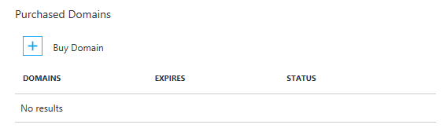
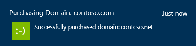

<properties
    pageTitle="So kaufen Sie einen benutzerdefinierten Domänennamen in Azure App Dienst Web Apps"
    description="Erfahren Sie, wie Sie einen benutzerdefinierten Domänennamen mit einem Web-app in Azure-App-Verwaltungsdienst erwerben."
    services="app-service\web"
    documentationCenter=""
    authors="rmcmurray"
    manager="wpickett"
    editor=""/>

<tags
    ms.service="app-service-web"
    ms.workload="web"
    ms.tgt_pltfrm="na"
    ms.devlang="na"
    ms.topic="article"
    ms.date="08/11/2016"
    ms.author="robmcm"/>

# Kaufen Sie, und konfigurieren Sie einen benutzerdefinierten Domänennamen in Azure-App-Verwaltungsdienst

[AZURE.INCLUDE [web-selector](../../includes/websites-custom-domain-selector.md)]

Beim Erstellen einer Web-app von Azure an Unterdomäne des azurewebsites.net weist. Wenn Ihre Web app **Contoso**benannt wird, ist die URL beispielsweise **contoso.azurewebsites.net**. Azure weist auch eine virtuelle IP-Adresse.

Für eine Herstellung Web app möchten Sie möglicherweise Benutzer, um einen benutzerdefinierten Domänennamen anzuzeigen. In diesem Artikel wird erläutert, wie kaufen, und konfigurieren eine benutzerdefinierte Domäne mit [App Dienst Web Apps](http://go.microsoft.com/fwlink/?LinkId=529714). 

[AZURE.INCLUDE [introfooter](../../includes/custom-dns-web-site-intro-notes.md)]

## (Übersicht)

Wenn Sie einen Domänennamen für Ihre Web app nicht besitzen, können Sie einfach eine [Azure](https://portal.azure.com/)-Portal erwerben. Bei der Bestellung können Sie auswählen, haben Sie "www" und Stamm DNS Einträge bei Ihrem Web app nicht automatisch zugeordnet werden. Darüber hinaus können Sie Ihre Domäne rechts innerhalb der Azure-Portal verwalten.

Gehen Sie folgendermaßen vor, um Domänennamen kaufen, und weisen Sie die Web app.

1. Öffnen Sie in Ihrem Browser das [Azure-Portal](https://portal.azure.com/)aus.

2. Klicken Sie auf der Registerkarte **Web Apps** auf den Namen der Web app, wählen Sie **Einstellungen**aus, und wählen Sie dann auf **benutzerdefinierte Domänen**

    

3. Klicken Sie in das Blade **benutzerdefinierte Domänen** auf **Domänen kaufen**.

    

4. Verwenden Sie das Textfeld in das Blade **Domänen kaufen** Geben Sie den Namen der Domäne, die, den Sie verwenden möchten, kaufen, und drücken Sie die EINGABETASTE. Die vorgeschlagenen verfügbaren Domänen werden nur unter dem Textfeld angezeigt. Wählen Sie welche Domäne, die Sie erwerben möchten. Sie können auswählen, um gleichzeitig mehrere Domänen zu erwerben. 

  

5. Klicken Sie auf die **Kontaktinformationen** aus, und füllen Sie die Domäne Kontaktinformationen Formular.

  

    > [AZURE.NOTE] Es ist sehr wichtig, dass Sie alle erforderlichen Angaben mit soviel Genauigkeit wie möglich, insbesondere die e-Mail-Adresse eingeben. Bei erwerben der Domäne ohne "Datenschutz", können Sie aufgefordert, Ihre e-Mail-Adresse überprüfen, bevor die Domäne aktiviert wurde. In einigen Fällen führt falsche Daten für Kontaktinformationen Fehler Domänen erwerben. 

6. Sie können nun die verwenden,

    eine) ""automatisch Erneuern"Ihrer Domäne jedes Jahr
    
    b) opt-in-für "Datenschutz" die in den Einkaufspreis kostenlos enthalten ist (eine Ausnahme bilden jedoch TLDs, wer Registrierung kann nicht unterstützen Datenschutz. For example:. co.in,. co.uk usw..)  
    
    c) "weisen Sie Standard Hostnamen" für "www" und root-Domäne in der aktuellen Web App. 

  
  
    > [AZURE.NOTE] Die Option C konfiguriert DNS-Bindungen und Hostname Bindungen automatisch für Sie.  Auf diese Weise können mit benutzerdefinierten Domäne, sobald die Bestellung abgeschlossen (DNS-Verteilung verspätungen in einigen Fällen baring) ist der Web-App zugegriffen werden. Falls die Web App hinter Azure Datenverkehr Manager ist, sehen Sie als A-Datensätze mit dem Datenverkehr-Manager nicht funktionieren keine Option zum Stammdomäne zuweisen. Sie können stets die Domänen/sub-domains über eine Web-App mit einem anderen Web App und umgekehrt erworben zuweisen. Schritt 8 Weitere Informationen hierzu finden Sie unter. 
    
7. Klicken Sie auf die **Wählen Sie** auf **Domänen kaufen** Blade und dann die Informationen werden auf Blade **kaufen Bestätigung** angezeigt. Wenn Sie die Vertragsbedingungen annehmen, und klicken Sie auf **Buy**, Ihre Bestellung gesendet wird, und Sie können den Erwerb des **Benachrichtigung**überwachen. Domäne erwerben kann einige Minuten dauern. 

  

  

8. Wenn Sie eine Domäne erfolgreich bestellt, können Sie die Domäne verwalten und Web app zuweisen. Klicken Sie auf der **"..."** auf der rechten Seite Ihrer Domäne. Dann können Sie **Abbrechen erwerben** oder eine **Domäne verwalten**. Klicken Sie auf **Domäne verwalten**, und dann die **Unterdomäne** mit unsere Web app auf **Domäne verwalten** Blade gebunden werden kann. Wenn Sie eine **Subdomain** an eine andere Web App binden möchten dann führen Sie diesen Schritt aus innerhalb des Kontexts der entsprechenden Web App. Hier benennen Sie ein auswählen (Wenn Web App hinter TM ist) die Domäne, um den Datenverkehr Manager Endpunkt zuweisen, indem Sie einfach auswählen eines Datenverkehr-Manager aus dem Dropdownmenü aus. Auf diese Weise wird Domäne/Unterdomäne der Web Apps hinter diesen Datenverkehr Manager-Endpunkt automatisch zugewiesen. 

    

    > [AZURE.NOTE] Sie können "kaufen innerhalb von 5 Tagen für Rückerstattung Abbrechen". Nach 5 Tagen, die Sie werden nicht in der Lage, "" Abbrechen "erwerben", wird stattdessen eine Option aus, um die Domäne "löschen" angezeigt. Löschen die Domäne führt zu Fehlern im, indem Sie Sie aus Ihrem Abonnement ohne Erstattung freigeben und werden erst verfügbar Domäne. 

Nach Abschluss der Konfiguration wird der benutzerdefinierten Domänennamen im Abschnitt **Hostname Bindungen** der Web app aufgeführt sein.

An diesem Punkt sollte es möglich sein, geben den Namen der benutzerdefinierten Domäne in Ihrem Browser, und sehen, dass Sie dieses erfolgreich Web app hat.
 
## Was geschieht mit der benutzerdefinierten Domäne, die Sie erworben haben

Die benutzerdefinierte Domäne, die Sie in das **benutzerdefinierte Domänen und SSL** Blade gekauft haben, ist mit Azure-Abonnement verknüpft. Als Azure Ressource ist diese benutzerdefinierten Domäne getrennt und unabhängig von der App-Service-app, der Sie zuerst die Domäne für erworben haben. Dies bedeutet, dass:

- Innerhalb der Azure-Portal können Sie die benutzerdefinierte Domäne, die Sie erworben haben mehrere App-Service-app, und nicht nur für die app, der Sie zuerst die benutzerdefinierte Domäne für erworben haben. 
- Sie können alle benutzerdefinierten Domänen verwalten, das, die Sie im Azure-Abonnement gekauft haben, indem Sie auf **benutzerdefinierte Domänen und SSL** Falz *Alle* App-Service-app in dieser Abonnement.
- Sie können eine beliebige App-Service-app aus dem gleichen Azure-Abonnement eine Unterdomäne in die benutzerdefinierte Domäne zuweisen.
- Wenn Sie eine App-Dienst app löschen möchten, können Sie auswählen, nicht auf die benutzerdefinierte Domäne zu löschen, die, der es gebunden ist, wenn Sie für andere apps weiterhin verwenden möchten.

## Wenn Sie die benutzerdefinierte Domäne nicht angezeigt wird, gekauft haben Sie

Wenn Sie die benutzerdefinierte Domäne aus, in die **benutzerdefinierte Domänen und SSL** Blade gekauft haben, aber nicht die benutzerdefinierte Domäne unter **verwaltete Domänen**angezeigt, überprüfen Sie die folgenden Elemente:

- Die Erstellung der benutzerdefinierten Domäne möglicherweise noch nicht abgeschlossen wurde. Aktivieren Sie die Benachrichtigung Bell am oberen Rand der Azure-Portal für den Fortschritt.
- Die Erstellung der benutzerdefinierten Domäne möglicherweise wurde aus irgendeinem Grund nicht. Aktivieren Sie die Benachrichtigung Bell am oberen Rand der Azure-Portal für den Fortschritt.
- Die benutzerdefinierte Domäne möglicherweise wurden erfolgreich abgeschlossen, aber das Blade möglicherweise noch nicht aktualisiert werden. Versuchen Sie, das **benutzerdefinierte Domänen und SSL** Blade werden.
- Möglicherweise haben Sie die benutzerdefinierte Domäne zu einem bestimmten Zeitpunkt gelöscht. Überprüfen der Überwachungsprotokolle, indem Sie auf **Einstellungen** > **Überwachenden Protokolle** aus Ihrer app Hauptfenster Blade. 
- Das **benutzerdefinierte Domänen und SSL** Blade, die, das Sie benötigen, möglicherweise zu einer app gehören, die in ein anderes Azure-Abonnement erstellt wird. Wechseln Sie zu einer anderen Anwendung in ein anderes Abonnement aus, und aktivieren Sie die **benutzerdefinierte Domänen und SSL** Blade.  
  Innerhalb des Portals können Sie nicht mehr anzeigen oder Verwalten von benutzerdefinierten Domänen in ein anderes Azure-Abonnement als die app erstellt wurden. Jedoch, wenn Sie **Erweiterte Management** in der Domäne **Verwalten Domäne** Blade klicken, Sie geleitet zu der Domäne der Website, können Sie zum   [manuellen Konfigurieren von Ihrer benutzerdefinierten Domäne wie alle externen benutzerdefinierten Domäne](web-sites-custom-domain-name.md) , in dem zwar 
   für apps in ein anderes Azure-Abonnement erstellt. 

