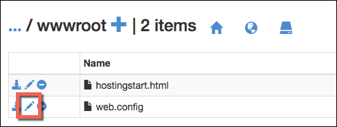

<properties
    pageTitle="Sichern Ihrer app benutzerdefinierte Domäne mit HTTPS | Microsoft Azure"
    description="Erfahren Sie, wie sicher des benutzerdefinierten Domänennamens für die app im App-Verwaltungsdienst Azure durch eine SSL Zertifikat Bindung konfigurieren. Sie lernen auch so erhalten Sie ein SSL-Zertifikat aus verschiedenen Tools."
    services="app-service"
    documentationCenter=".net"
    authors="cephalin"
    manager="wpickett"
    editor="jimbe"
    tags="top-support-issue"/>

<tags
    ms.service="app-service"
    ms.workload="na"
    ms.tgt_pltfrm="na"
    ms.devlang="na"
    ms.topic="article"
    ms.date="08/08/2016"
    ms.author="cephalin"/>

# Sichern Sie Ihrer app benutzerdefinierte Domäne mit HTTPS

> [AZURE.SELECTOR]
- [SSL-Zertifikat in Azure kaufen](web-sites-purchase-ssl-web-site.md)
- [Verwenden von SSL-Zertifikat an anderer Stelle](web-sites-configure-ssl-certificate.md)

In diesem Artikel wird gezeigt, wie aktivieren HTTPS für eine Web app, eine mobile-app Back-End- oder einer API-app im [App-Verwaltungsdienst Azure](../app-service/app-service-value-prop-what-is.md) , einen benutzerdefinierten Domänennamen verwendet, werden kann. Es werden nur Server-Authentifizierung behandelt. Wenn Sie die gemeinsamen Authentifizierung (einschließlich Client-Authentifizierung) benötigen, finden Sie unter [How To konfigurieren TLS gemeinsamen Authentication für App-Dienst](app-service-web-configure-tls-mutual-auth.md).

Um mit HTTPS eine app zu sichern, die über einen benutzerdefinierten Domänennamen verfügt, fügen Sie ein Zertifikat für diesen Domänennamen ein. Standardmäßig Azure sichert die ** \*. azurewebsites.net** Platzhalterzeichen Domäne mit einem einzelnen SSL Zertifikat, damit Kunden Ihre app am bereits zugreifen können * *https://*&lt;Appname >*. azurewebsites.net**. Aber wenn Sie eine benutzerdefinierte Domäne verwenden möchten, wie **www.contoso.com "contoso.com"**; ****, und ** \*. contoso.com**, das Standardzertifikat kann keine sichern. Darüber hinaus ist das standardmäßige Zertifikat wie alle [Platzhalterzeichen Zertifikate](https://casecurity.org/2014/02/26/pros-and-cons-of-single-domain-multi-domain-and-wildcard-certificates/), nicht sicher als das Verwenden einer benutzerdefinierten Domäne und ein Zertifikat für die benutzerdefinierte Domäne.   

>[AZURE.NOTE] Hilfe erhalten Sie von Azure-Experten jederzeit in den [Azure-Foren](https://azure.microsoft.com/support/forums/). Wechseln Sie zur [Unterstützung von Azure](https://azure.microsoft.com/support/options/) angepasstes Support und klicken Sie auf **Erste unterstützen**.

## Was Sie benötigen
Um Ihren benutzerdefinierten Domänennamen mit HTTPS zu sichern, binden Sie ein Zertifikat einer benutzerdefinierten Zertifizierungsstelle mit dieser benutzerdefinierten Domäne in Azure. Vor dem Binden einer benutzerdefinierten Zertifikat, müssen Sie die folgenden Aktionen ausführen:

- **Konfigurieren der benutzerdefinierten Domäne** - App-Dienst lässt nur das Hinzufügen von ein Zertifikat für einen Domänennamen aus, der bereits in Ihrer app konfiguriert ist. Anweisungen finden Sie unter [zuordnen einen benutzerdefinierten Domänennamen zu einer Azure-app](web-sites-custom-domain-name.md). 
- **Skalieren auf grundlegende Ebene oder höher** App-Dienstpläne in der unteren Preisgestaltung Stufen unterstützt nicht benutzerdefinierten SSL-Zertifikate. Anweisungen finden Sie unter [Einrichten einer app in Azure skalieren](web-sites-scale.md). 
- **Abrufen ein SSL-Zertifikats** – Wenn Sie nicht bereits eine verfügen, müssen Sie eins von einer vertrauenswürdigen [Zertifizierungsstelle](http://en.wikipedia.org/wiki/Certificate_authority) (CA) zu erhalten. Das Zertifikat muss alle folgenden Vorschriften erfüllen:

    - Es wird von einer vertrauenswürdigen Zertifizierungsstelle (keine privaten Servern CA) signiert.
    - Es enthält einen privaten Schlüssel.
    - Es ist für Key Exchange erstellt und zu exportiert ein. PFX-Datei.
    - Es wird mindestens 2048-Bit-Verschlüsselung verwendet.
    - Der Namen der Betreff entspricht die benutzerdefinierte Domäne, die gesichert werden muss. Um mehrere Domänen mit einem Zertifikat zu sichern, müssen Sie einen Namen für die Platzhalterzeichen verwenden (z. B. ** \*. "contoso.com"**) oder SubjectAltName Werte angeben.
    - Es wird mit allen **[zwischen-XT für Zertifikate](http://en.wikipedia.org/wiki/Intermediate_certificate_authorities)** von der Zertifizierungsstelle verwendeten zusammengeführt. Andernfalls können Sie auf einige Clients irreproducible Interoperabilität Probleme ausführen.

        >[AZURE.NOTE] Die einfachste Möglichkeit, ein SSL-Zertifikat zu erhalten, die alle die Anforderungen erfüllt ist         [eine direkt im Azure-Portal](web-sites-purchase-ssl-web-site.md)zu erwerben. In diesem Artikel wird gezeigt, wie manuell erledigen, und klicken Sie dann auf Ihrer benutzerdefinierten Domäne in der App-Dienst gebunden werden kann.
        >   
        > **Elliptische Kurve Verschlüsselung (ECC) Zertifikate** funktionieren mit App-Dienst, jedoch außerhalb des Gültigkeitsbereichs des in diesem Artikel. Arbeiten Sie mit der CA auf die genauen Schritte zum Erstellen von ECC Zertifikate.

## Schritt 1. Abrufen eines SSL-Zertifikats

Da bereit, die die verschiedenen Typen der SSL-Zertifikat zu einem anderen Preis, sollten Sie zunächst entscheiden, welche Art von SSL-Zertifikat erwerben. Um einen einzigen Domänennamen (**www.contoso.com**) zu sichern, benötigen Sie nur eine einfache Zertifikat. Zum Sichern von mehreren Domänennamen (**contoso.com** *und* **www.contoso.com** 
*und* **mail.contoso.com**), benötigen Sie entweder ein [Platzhalterzeichen Zertifikat](http://en.wikipedia.org/wiki/Wildcard_certificate) oder ein Zertifikat mit [Alternativnamen Betreff](http://en.wikipedia.org/wiki/SubjectAltName) (`subjectAltName`).

Sobald Sie, welche SSL-Zertifikat Wissen erwerben, senden Sie ein Zertifikat bei der Anmeldung anfordern (CSR) mit einer Zertifizierungsstelle. Wenn Sie angeforderte Zertifikat wieder von der Zertifizierungsstelle erhalten, generieren Sie eine PFX-Datei aus dem Zertifikat. Sie können die folgenden Schritte aus, die mit dem Tool Ihrer Wahl ausführen. Hier sind die Anweisungen für die gemeinsame Tools aus:

- [Certreq.exe Schritte](#bkmk_certreq) – dem Windows-Programm für Zertifikatsanfragen zu erstellen. Es wurde seit Windows XP/Windows Server 2000 Teil von Windows.
- [IIS-Manager Schritte](#bkmk_iismgr) – das Tool Wahl, wenn Sie bereits mit vertraut sind.
- [OpenSSL Schritte](#bkmk_openssl) – ein [offener Quelle, Plattform - Tool](https://www.openssl.org). Verwenden Sie diese Sie ein SSL-Zertifikat aus einer beliebigen Plattform optimal nutzen können.
- [SubjectAltName Schritte mithilfe von OpenSSL](#bkmk_subjectaltname) – für erste Schritte `subjectAltName` Zertifikate.

Wenn Sie die Einrichtung im App-Dienst vor dem Kauf eines Zertifikats zu testen möchten, können Sie ein [selbst signiertes Zertifikat](https://en.wikipedia.org/wiki/Self-signed_certificate)generieren. In diesem Lernprogramm bietet Ihnen zwei Möglichkeiten, um es zu generieren:

- [Selbst signiertes Zertifikat, Certreq.exe Schritte](#bkmk_sscertreq)
- [Selbst signiertes Zertifikat, OpenSSL Schritte](#bkmk_ssopenssl)

### Fordern Sie ein Zertifikat bei Verwendung von Certreq.exe

1. Erstellen Sie eine Datei (z. B. **myrequest.txt**), und kopieren Sie in den folgenden Text, und speichern Sie es im Arbeitsverzeichnis. Ersetzen der `<your-domain>` Platzhalter mit den benutzerdefinierten Domänennamen der app.

        [NewRequest]
        Subject = "CN=<your-domain>"  ; E.g. "CN=www.contoso.com", or "CN=*.contoso.com" for a wildcard certificate
        Exportable = TRUE
        KeyLength = 2048              ; Required minimum is 2048
        KeySpec = 1
        KeyUsage = 0xA0
        MachineKeySet = True
        ProviderName = "Microsoft RSA SChannel Cryptographic Provider"
        ProviderType = 12
        HashAlgorithm = SHA256

        [EnhancedKeyUsageExtension]
        OID=1.3.6.1.5.5.7.3.1         ; Server Authentication

    Weitere Informationen zu den Optionen in der Kundenservicemitarbeiter und anderen verfügbaren Optionen finden Sie in der [Dokumentation zur Certreq](https://technet.microsoft.com/library/dn296456.aspx).

4. In einem Eingabeaufforderungsfenster `CD` in das geöffneten Verzeichnis und dem folgenden zum Erstellen des Kundenservicemitarbeiters Befehl ausführen:

        certreq -new myrequest.txt myrequest.csr

    **myRequest.CSR** wird jetzt in der aktuell geöffneten Verzeichnis erstellt.

5. Einreichen Sie **myrequest.csr** an eine Zertifizierungsstelle, um ein Zertifikat einer Zertifizierungsstelle zu erhalten. Sie entweder Hochladen der Datei, oder kopieren deren Inhalt aus einem Text-Editor in eines Webformulars.

    Eine Liste der von Microsoft vertrauenswürdige Zertifizierungsstellen, finden Sie unter [Microsoft vertrauenswürdigen Root Certificate Program: Teilnehmer][cas].

6. Sobald die Zertifizierungsstelle Sie mit einem Zertifikat geantwortet hat (. CER)-Datei, speichern Sie diese in Ihrem Arbeitsverzeichnis. Führen Sie dann den folgenden Befehl zum Ausführen der ausstehenden CSR aus.

        certreq -accept -user <certificate-name>.cer

    Dieser Befehl speichert das Zertifikat fertige im Windows Store Zertifikat.

6. Wenn Ihre Zertifizierungsstelle zwischen-XT für Zertifikate verwendet, installieren Sie sie, bevor Sie fortfahren. Sie stehen in der Regel als separate Download der Zertifizierungsstelle aus, und klicken Sie in verschiedene Formate für verschiedene Web Servertypen. Wählen Sie die Version für Microsoft IIS aus.

    Nachdem Sie die Zertifikate heruntergeladen haben, mit der rechten Maustaste jede von ihnen in Windows-Explorer, und wählen Sie aus,  **Installieren Sie ein Zertifikat**. Verwenden Sie die Standardwerte im **Zertifikat-Import-Assistenten**und weiterhin **nächsten** auswählen, bis der Import abgeschlossen ist.

7. Um Ihr Zertifikat SSL aus dem Store Zertifikat exportieren möchten, drücken Sie die `Win` + `R` , und führen Sie **certmgr.msc** zum Zertifikat-Manager zu starten. Wählen Sie **Persönliche** > **Zertifikate**. In der Spalte **Ausgestellt für** sollte Sie einen Eintrag angezeigt, mit Ihren benutzerdefinierten Domänennamen und die Zertifizierungsstelle Sie verwendet, um das Zertifikat in der Spalte **Ausgestellt von** zu erzeugen.

    ![Abbildung des Zertifikat-Managers hier einfügen][certmgr]

9. Mit der rechten Maustaste in des Zertifikats, und wählen Sie **Alle Vorgänge** > **Exportieren**. Das **Zertifikat Export-Assistenten**klicken Sie auf **Weiter**, und klicken Sie dann wählen Sie **Ja, privaten Schlüssel exportieren**aus, und klicken Sie dann auf **Weiter** .

    ![Privaten Schlüssel exportieren][certwiz1]

10. Wählen Sie **Personal Information Exchange - PKCS #12**, **in der Pfad des Zertifikats falls möglich, alle Zertifikate einbeziehen**und **alle erweiterten Eigenschaften exportieren**. Klicken Sie dann auf **Weiter**.

    ![Alle Zertifikate und erweiterte Eigenschaften einbeziehen][certwiz2]

11. Wählen Sie **das Kennwort ein**, und geben Sie ein, und bestätigen Sie das Kennwort. Klicken Sie auf **Weiter**.

    ![Geben Sie ein Kennwort][certwiz3]

12. Geben Sie einen Pfad und Dateinamen für die exportierte Zertifikat, mit der Erweiterung **PFX-Datei**ein. Klicken Sie auf **Weiter** um fertig zu stellen.

    ![Geben Sie einen Dateipfad][certwiz4]

Sie können nun die exportierte PFX-Datei in die App-Dienst hochladen. Siehe [Schritt 2. Hochladen und binden das benutzerdefinierte SSL-Zertifikat](#bkmk_configuressl).

### Fordern Sie ein Zertifikat, das mit dem IIS-Manager

1. Generieren einer CSR mit IIS-Manager, an die Zertifizierungsstelle zu senden. Weitere Informationen zum Erstellen von einem CSR finden Sie unter [Anfordern einer Internet Serverzertifikat (IIS 7)][iiscsr].

3. Einreichen Sie Ihrer CSR an eine Zertifizierungsstelle, um ein Zertifikat einer Zertifizierungsstelle zu erhalten. Eine Liste der von Microsoft vertrauenswürdige Zertifizierungsstellen, finden Sie unter [Microsoft vertrauenswürdigen Root Certificate Program: Teilnehmer][cas].

3. Führen Sie die CSR mit das Zertifikat, das die Zertifizierungsstelle vorlesen sendet. Weitere Informationen zum Durchführen des Kundenservicemitarbeiters, finden Sie unter [Installieren eines Internet-Serverzertifikat (IIS 7)][installcertiis].

4. Wenn Ihre Zertifizierungsstelle zwischen-XT für Zertifikate verwendet, installieren Sie sie, bevor Sie fortfahren. Sie stehen in der Regel als separate Download der Zertifizierungsstelle aus, und klicken Sie in verschiedene Formate für verschiedene Web Servertypen. Wählen Sie die Version für Microsoft IIS aus.

    Nachdem Sie die Zertifikate heruntergeladen haben, mit der rechten Maustaste jede von ihnen in Windows-Explorer, und wählen Sie aus, **Installieren Sie ein Zertifikat**. 
    Verwenden Sie die Standardwerte im **Zertifikat-Import-Assistenten**und weiterhin **nächsten** auswählen, bis der Import abgeschlossen ist.

4. Exportieren Sie das SSL-Zertifikat aus dem IIS-Manager. Weitere Informationen über das Zertifikat exportieren, finden Sie unter [Exportieren eines Zertifikats (IIS 7)][exportcertiis]. 

    >[AZURE.IMPORTANT] Vergewissern Sie sich, dass Sie wählen Sie **Ja, privaten Schlüssel exportieren** in im **Zertifikat Export-Assistenten**  
    >
    >![Privaten Schlüssel exportieren][certwiz1]  
    >
    > und wählen Sie auch **Personal Information Exchange - PKCS #12**, **Alle Zertifikate in der Pfad des Zertifikats falls möglich**, und     **alle erweiterten Eigenschaften exportieren**.
    >
    >![Alle Zertifikate und erweiterte Eigenschaften einbeziehen][certwiz2]

Sie können nun die exportierte PFX-Datei in die App-Dienst hochladen. Siehe [Schritt 2. Hochladen und binden das benutzerdefinierte SSL-Zertifikat](#bkmk_configuressl).

### Abrufen eines Zertifikats mit OpenSSL

1. In einer Befehlszeile Terminal `CD` in einer geöffneten Verzeichnis generieren, einen privaten Schlüssel und CSR, indem Sie den folgenden Befehl ausführen:

        openssl req -sha256 -new -nodes -keyout myserver.key -out server.csr -newkey rsa:2048

2. Wenn Sie dazu aufgefordert werden, geben Sie die entsprechenden Informationen ein. Beispiel:

        Country Name (2 letter code)
        State or Province Name (full name) []: Washington
        Locality Name (eg, city) []: Redmond
        Organization Name (eg, company) []: Microsoft
        Organizational Unit Name (eg, section) []: Azure
        Common Name (eg, YOUR name) []: www.microsoft.com
        Email Address []:

        Please enter the following 'extra' attributes to be sent with your certificate request

        A challenge password []:

    Wenn Sie fertig sind, sollten Sie haben zwei Dateien in Ihrem Arbeitsverzeichnis: **myserver.key** und **server.csr**. 
    Die **server.csr** enthält die CSR und **myserver.key** später benötigen.

3. Einreichen Sie Ihrer CSR an eine Zertifizierungsstelle, um ein Zertifikat einer Zertifizierungsstelle zu erhalten. Eine Liste der von Microsoft vertrauenswürdige Zertifizierungsstellen, finden Sie unter [Microsoft vertrauenswürdigen Root Certificate Program: Teilnehmer][cas].

4. Sobald die Zertifizierungsstelle das angeforderte Zertifikat sendet, speichern Sie es in eine Datei namens **myserver.crt** in Ihrem Arbeitsverzeichnis. Wenn Ihre Zertifizierungsstelle diese in einem Textformat bereitstellt, einfach kopieren Sie den Inhalt in **myserver.crt** in einem Text-Editor, und speichern sie. Die Datei sollte wie folgt aussehen:

        -----BEGIN CERTIFICATE-----
        MIIDJDCCAgwCCQCpCY4o1LBQuzANBgkqhkiG9w0BAQUFADBUMQswCQYDVQQGEwJV
        UzELMAkGA1UECBMCV0ExEDAOBgNVBAcTB1JlZG1vbmQxEDAOBgNVBAsTB0NvbnRv
        c28xFDASBgNVBAMTC2NvbnRvc28uY29tMB4XDTE0MDExNjE1MzIyM1oXDTE1MDEx
        NjE1MzIyM1owVDELMAkGA1UEBhMCVVMxCzAJBgNVBAgTAldBMRAwDgYDVQQHEwdS
        ZWRtb25kMRAwDgYDVQQLEwdDb250b3NvMRQwEgYDVQQDEwtjb250b3NvLmNvbTCC
        ASIwDQYJKoZIhvcNAQEBBQADggEPADCCAQoCggEBAN96hBX5EDgULtWkCRK7DMM3
        enae1LT9fXqGlbA7ScFvFivGvOLEqEPD//eLGsf15OYHFOQHK1hwgyfXa9sEDPMT
        3AsF3iWyF7FiEoR/qV6LdKjeQicJ2cXjGwf3G5vPoIaYifI5r0lhgOUqBxzaBDZ4
        xMgCh2yv7NavI17BHlWyQo90gS2X5glYGRhzY/fGp10BeUEgIs3Se0kQfBQOFUYb
        ktA6802lod5K0OxlQy4Oc8kfxTDf8AF2SPQ6BL7xxWrNl/Q2DuEEemjuMnLNxmeA
        Ik2+6Z6+WdvJoRxqHhleoL8ftOpWR20ToiZXCPo+fcmLod4ejsG5qjBlztVY4qsC
        AwEAATANBgkqhkiG9w0BAQUFAAOCAQEAVcM9AeeNFv2li69qBZLGDuK0NDHD3zhK
        Y0nDkqucgjE2QKUuvVSPodz8qwHnKoPwnSrTn8CRjW1gFq5qWEO50dGWgyLR8Wy1
        F69DYsEzodG+shv/G+vHJZg9QzutsJTB/Q8OoUCSnQS1PSPZP7RbvDV9b7Gx+gtg
        7kQ55j3A5vOrpI8N9CwdPuimtu6X8Ylw9ejWZsnyy0FMeOPpK3WTkDMxwwGxkU3Y
        lCRTzkv6vnHrlYQxyBLOSafCB1RWinN/slcWSLHADB6R+HeMiVKkFpooT+ghtii1
        A9PdUQIhK9bdaFicXPBYZ6AgNVuGtfwyuS5V6ucm7RE6+qf+QjXNFg==
        -----END CERTIFICATE-----

5. Führen Sie in der Befehlszeile Terminal zum Exportieren von **myserver.pfx** aus **myserver.key** und **myserver.crt**den folgenden Befehl aus:

        openssl pkcs12 -export -out myserver.pfx -inkey myserver.key -in myserver.crt

    Wenn Sie dazu aufgefordert werden, definieren Sie ein Kennwort zum Schutz der PFX-Datei ein.

    > [AZURE.NOTE] Wenn Ihre Zertifizierungsstelle zwischen-XT für Zertifikate verwendet, müssen Sie können Sie diese mit der `-certfile` Parameter. Sie stehen in der Regel als separate Download der Zertifizierungsstelle aus, und klicken Sie in verschiedene Formate für verschiedene Web Servertypen. Wählen Sie die Version mit der `.pem` Erweiterung.
    >
    > Ihre `openssl -export` Befehl sollte wie im folgenden Beispiel, die eine PFX-Datei erstellt, die die mittlere Zertifikate aus der **Tags-cets.pem** Datei enthält aussehen:
    >  
    > `openssl pkcs12 -chain -export -out myserver.pfx -inkey myserver.key -in myserver.crt -certfile intermediate-cets.pem`

Sie können nun die exportierte PFX-Datei in die App-Dienst hochladen. Siehe [Schritt 2. Hochladen und binden das benutzerdefinierte SSL-Zertifikat](#bkmk_configuressl).

### Abrufen eines SubjectAltName Zertifikats mit OpenSSL

1. Erstellen Sie eine Datei mit dem Namen **sancert.cnf**, kopieren Sie den folgenden Text in, und speichern Sie es im Arbeitsverzeichnis:

        # -------------- BEGIN custom sancert.cnf -----
        HOME = .
        oid_section = new_oids
        [ new_oids ]
        [ req ]
        default_days = 730
        distinguished_name = req_distinguished_name
        encrypt_key = no
        string_mask = nombstr
        req_extensions = v3_req # Extensions to add to certificate request
        [ req_distinguished_name ]
        countryName = Country Name (2 letter code)
        countryName_default =
        stateOrProvinceName = State or Province Name (full name)
        stateOrProvinceName_default =
        localityName = Locality Name (eg, city)
        localityName_default =
        organizationalUnitName  = Organizational Unit Name (eg, section)
        organizationalUnitName_default  =
        commonName              = Your common name (eg, domain name)
        commonName_default      = www.mydomain.com
        commonName_max = 64
        [ v3_req ]
        subjectAltName=DNS:ftp.mydomain.com,DNS:blog.mydomain.com,DNS:*.mydomain.com
        # -------------- END custom sancert.cnf -----

    Klicken Sie in der Zeile, beginnt mit `subjectAltName`, ersetzen Sie den Wert für alle Domänennamen, die Sie sichern möchten (zusätzlich zu  `commonName`). Beispiel:

        subjectAltName=DNS:sales.contoso.com,DNS:support.contoso.com,DNS:fabrikam.com

    Sie müssen nicht zu einem anderen Feld ändern einschließlich `commonName`. Sie werden aufgefordert, den sie in den nächsten Schritten angeben.

1. In einer Befehlszeile Terminal `CD` über Ihre gesamte Arbeitsverzeichnis und Ausführen den folgenden Befehl aus:

        openssl req -sha256 -new -nodes -keyout myserver.key -out server.csr -newkey rsa:2048 -config sancert.cnf

2. Wenn Sie dazu aufgefordert werden, geben Sie die entsprechenden Informationen ein. Beispiel:

        Country Name (2 letter code) []: US
        State or Province Name (full name) []: Washington
        Locality Name (eg, city) []: Redmond
        Organizational Unit Name (eg, section) []: Azure
        Your common name (eg, domain name) []: www.microsoft.com

    Sobald Sie fertig sind, sollten Sie haben zwei Dateien in Ihrem Arbeitsverzeichnis: **myserver.key** und **server.csr**. 
    Die **server.csr** enthält die CSR und **myserver.key** später benötigen.

3. Einreichen Sie Ihrer CSR an eine Zertifizierungsstelle, um ein Zertifikat einer Zertifizierungsstelle zu erhalten. Eine Liste der von Microsoft vertrauenswürdige Zertifizierungsstellen, finden Sie unter [Microsoft vertrauenswürdigen Root Certificate Program: Teilnehmer][cas].

4. Sobald die Zertifizierungsstelle das angeforderte Zertifikat sendet, speichern Sie es in eine Datei namens **myserver.crt**. Wenn Ihre Zertifizierungsstelle diese in einem Textformat bereitstellt, einfach kopieren Sie den Inhalt in **myserver.crt** in einem Text-Editor, und speichern sie. Die Datei sollte wie folgt aussehen:

        -----BEGIN CERTIFICATE-----
        MIIDJDCCAgwCCQCpCY4o1LBQuzANBgkqhkiG9w0BAQUFADBUMQswCQYDVQQGEwJV
        UzELMAkGA1UECBMCV0ExEDAOBgNVBAcTB1JlZG1vbmQxEDAOBgNVBAsTB0NvbnRv
        c28xFDASBgNVBAMTC2NvbnRvc28uY29tMB4XDTE0MDExNjE1MzIyM1oXDTE1MDEx
        NjE1MzIyM1owVDELMAkGA1UEBhMCVVMxCzAJBgNVBAgTAldBMRAwDgYDVQQHEwdS
        ZWRtb25kMRAwDgYDVQQLEwdDb250b3NvMRQwEgYDVQQDEwtjb250b3NvLmNvbTCC
        ASIwDQYJKoZIhvcNAQEBBQADggEPADCCAQoCggEBAN96hBX5EDgULtWkCRK7DMM3
        enae1LT9fXqGlbA7ScFvFivGvOLEqEPD//eLGsf15OYHFOQHK1hwgyfXa9sEDPMT
        3AsF3iWyF7FiEoR/qV6LdKjeQicJ2cXjGwf3G5vPoIaYifI5r0lhgOUqBxzaBDZ4
        xMgCh2yv7NavI17BHlWyQo90gS2X5glYGRhzY/fGp10BeUEgIs3Se0kQfBQOFUYb
        ktA6802lod5K0OxlQy4Oc8kfxTDf8AF2SPQ6BL7xxWrNl/Q2DuEEemjuMnLNxmeA
        Ik2+6Z6+WdvJoRxqHhleoL8ftOpWR20ToiZXCPo+fcmLod4ejsG5qjBlztVY4qsC
        AwEAATANBgkqhkiG9w0BAQUFAAOCAQEAVcM9AeeNFv2li69qBZLGDuK0NDHD3zhK
        Y0nDkqucgjE2QKUuvVSPodz8qwHnKoPwnSrTn8CRjW1gFq5qWEO50dGWgyLR8Wy1
        F69DYsEzodG+shv/G+vHJZg9QzutsJTB/Q8OoUCSnQS1PSPZP7RbvDV9b7Gx+gtg
        7kQ55j3A5vOrpI8N9CwdPuimtu6X8Ylw9ejWZsnyy0FMeOPpK3WTkDMxwwGxkU3Y
        lCRTzkv6vnHrlYQxyBLOSafCB1RWinN/slcWSLHADB6R+HeMiVKkFpooT+ghtii1
        A9PdUQIhK9bdaFicXPBYZ6AgNVuGtfwyuS5V6ucm7RE6+qf+QjXNFg==
        -----END CERTIFICATE-----

5. Führen Sie in der Befehlszeile Terminal zum Exportieren von **myserver.pfx** aus **myserver.key** und **myserver.crt**den folgenden Befehl aus:

        openssl pkcs12 -export -out myserver.pfx -inkey myserver.key -in myserver.crt

    Wenn Sie dazu aufgefordert werden, definieren Sie ein Kennwort zum Schutz der PFX-Datei ein.

    > [AZURE.NOTE] Wenn Ihre Zertifizierungsstelle zwischen-XT für Zertifikate verwendet, müssen Sie können Sie diese mit der `-certfile` Parameter. Sie stehen in der Regel als separate Download der Zertifizierungsstelle aus, und klicken Sie in verschiedene Formate für verschiedene Web Servertypen. Wählen Sie die Version mit der `.pem` Erweiterung).
    >
    > Ihre `openssl -export` Befehl sollte wie im folgenden Beispiel, die eine PFX-Datei erstellt, die die mittlere Zertifikate aus der **Tags-cets.pem** Datei enthält aussehen:
    >  
    > `openssl pkcs12 -chain -export -out myserver.pfx -inkey myserver.key -in myserver.crt -certfile intermediate-cets.pem`

Sie können nun die exportierte PFX-Datei in die App-Dienst hochladen. Siehe [Schritt 2. Hochladen und binden das benutzerdefinierte SSL-Zertifikat](#bkmk_configuressl).

### Generieren Sie ein selbst signiertes Zertifikat bei Verwendung von Certreq.exe ###

>[AZURE.IMPORTANT] Selbstsignierte Zertifikaten sind nur zu Testzwecken. Die meisten Browser zurück Fehler, wenn Sie eine Website besuchen, die durch ein selbst signiertes Zertifikat gesichert wird. Navigieren Sie zu der Website können auch einigen Browsern ablehnen. 

1. Erstellen Sie eine Textdatei (z. B. **mycert.txt**), kopieren Sie in den folgenden Text, und speichern Sie die Datei im Arbeitsverzeichnis. Ersetzen der `<your-domain>` Platzhalter mit den benutzerdefinierten Domänennamen der app.

        [NewRequest]
        Subject = "CN=<your-domain>"  ; E.g. "CN=www.contoso.com", or "CN=*.contoso.com" for a wildcard certificate
        Exportable = TRUE
        KeyLength = 2048              ; KeyLength can be 2048, 4096, 8192, or 16384 (required minimum is 2048)
        KeySpec = 1
        KeyUsage = 0xA0
        MachineKeySet = True
        ProviderName = "Microsoft RSA SChannel Cryptographic Provider"
        ProviderType = 12
        HashAlgorithm = SHA256
        RequestType = Cert            ; Self-signed certificate
        ValidityPeriod = Years
        ValidityPeriodUnits = 1

        [EnhancedKeyUsageExtension]
        OID=1.3.6.1.5.5.7.3.1         ; Server Authentication

    Der Parameter wichtige ist `RequestType = Cert`, der angibt, dass eines selbst signierten Zertifikats. 
    Weitere Informationen zu den Optionen in der Kundenservicemitarbeiter und anderen verfügbaren Optionen finden Sie in der [Dokumentation zur Certreq](https://technet.microsoft.com/library/dn296456.aspx).

4. In der Eingabeaufforderung `CD` geöffneten Verzeichnis und Ausführen den folgenden Befehl aus:

        certreq -new mycert.txt mycert.crt
    
    Ihr neue selbst signierte Zertifikat ist jetzt im Zertifikatspeicher installiert.

7. Um das Zertifikat aus dem Zertifikatspeicher exportieren möchten, drücken Sie die `Win` + `R` , und führen Sie **certmgr.msc** zum Zertifikat-Manager zu starten. Wählen Sie **Persönliche** > **Zertifikate**. In der Spalte **Ausgestellt für** sollte Sie einen Eintrag angezeigt, mit Ihren benutzerdefinierten Domänennamen und die Zertifizierungsstelle Sie verwendet, um das Zertifikat in der Spalte **Ausgestellt von** zu erzeugen.

    ![Abbildung des Zertifikat-Managers hier einfügen][certmgr]

9. Mit der rechten Maustaste in des Zertifikats, und wählen Sie **Alle Vorgänge** > **Exportieren**. Das **Zertifikat Export-Assistenten**klicken Sie auf **Weiter**, und klicken Sie dann wählen Sie **Ja, privaten Schlüssel exportieren**aus, und klicken Sie dann auf **Weiter** .

    ![Privaten Schlüssel exportieren][certwiz1]

10. Wählen Sie **Personal Information Exchange - PKCS #12**, **in der Pfad des Zertifikats falls möglich, alle Zertifikate einbeziehen**und **alle erweiterten Eigenschaften exportieren**. Klicken Sie dann auf **Weiter**.

    ![Alle Zertifikate und erweiterte Eigenschaften einbeziehen][certwiz2]

11. Wählen Sie **das Kennwort ein**, und geben Sie ein, und bestätigen Sie das Kennwort. Klicken Sie auf **Weiter**.

    ![Geben Sie ein Kennwort][certwiz3]

12. Geben Sie einen Pfad und Dateinamen für die exportierte Zertifikat, mit der Erweiterung **PFX-Datei**ein. Klicken Sie auf **Weiter** um fertig zu stellen.

    ![Geben Sie einen Dateipfad][certwiz4]

Sie können nun die exportierte PFX-Datei in die App-Dienst hochladen. Siehe [Schritt 2. Hochladen und binden das benutzerdefinierte SSL-Zertifikat](#bkmk_configuressl).

###Generieren Sie ein selbst signiertes Zertifikat mithilfe von OpenSSL ###

>[AZURE.IMPORTANT] Selbstsignierte Zertifikaten sind nur zu Testzwecken. Die meisten Browser zurück Fehler, wenn Sie eine Website besuchen, die durch ein selbst signiertes Zertifikat gesichert wird. Navigieren Sie zu der Website können auch einigen Browsern ablehnen. 

1. Erstellen Sie eine Textdatei namens **serverauth.cnf**, und kopieren Sie den folgenden Inhalt in, und speichern Sie es im Arbeitsverzeichnis:

        [ req ]
        default_bits           = 2048
        default_keyfile        = privkey.pem
        distinguished_name     = req_distinguished_name
        attributes             = req_attributes
        x509_extensions        = v3_ca

        [ req_distinguished_name ]
        countryName         = Country Name (2 letter code)
        countryName_min         = 2
        countryName_max         = 2
        stateOrProvinceName     = State or Province Name (full name)
        localityName            = Locality Name (eg, city)
        0.organizationName      = Organization Name (eg, company)
        organizationalUnitName      = Organizational Unit Name (eg, section)
        commonName          = Common Name (eg, your app's domain name)
        commonName_max          = 64
        emailAddress            = Email Address
        emailAddress_max        = 40

        [ req_attributes ]
        challengePassword       = A challenge password
        challengePassword_min       = 4
        challengePassword_max       = 20

        [ v3_ca ]
         subjectKeyIdentifier=hash
         authorityKeyIdentifier=keyid:always,issuer:always
         basicConstraints = CA:false
         keyUsage=nonRepudiation, digitalSignature, keyEncipherment
         extendedKeyUsage = serverAuth

2. In einer Befehlszeile Terminal `CD` über Ihre gesamte Arbeitsverzeichnis und Ausführen den folgenden Befehl aus:

        openssl req -sha256 -x509 -nodes -days 365 -newkey rsa:2048 -keyout myserver.key -out myserver.crt -config serverauth.cnf

    Dieser Befehl erstellt zwei Dateien: **myserver.crt** (das selbst signierte Zertifikat) und **myserver.key** (der private Schlüssel), basierend auf der Einstellungen für **serverauth.cnf**.

3. Exportieren Sie das Zertifikat in eine PFX-Datei, indem Sie den folgenden Befehl ausführen:

        openssl pkcs12 -export -out myserver.pfx -inkey myserver.key -in myserver.crt

    Wenn Sie dazu aufgefordert werden, definieren Sie ein Kennwort zum Schutz der PFX-Datei ein.

Sie können nun die exportierte PFX-Datei in die App-Dienst hochladen. Siehe [Schritt 2. Hochladen und binden das benutzerdefinierte SSL-Zertifikat](#bkmk_configuressl).

## Schritt 2. Hochladen und Binden des benutzerdefinierten SSL-Zertifikats

Bevor Sie fortfahren, lesen Sie den Abschnitt [, benötigen Sie](#bkmk_domainname) ein, und überprüfen Sie Folgendes:

- Sie haben eine benutzerdefinierte Domäne, die Ihre Azure app zugeordnet ist,
- die app in **grundlegende** Ebene oder höher ausgeführt wird und
- Sie verfügen über ein SSL-Zertifikat für die benutzerdefinierte Domäne von einer Zertifizierungsstelle.

1. Öffnen Sie in Ihrem Browser die ** [Azure-Portal.](https://portal.azure.com/)**
2.  Klicken Sie auf die Option **App-Dienst** auf der linken Seite der Seite.
3.  Klicken Sie auf den Namen der app, die Sie dieses Zertifikat zuweisen möchten. 
4.  Klicken Sie unter **Einstellungen**auf **SSL-Zertifikate**
5.  Klicken Sie auf **Zertifikat hochladen**
6.  Wählen Sie die PFX-Datei, die Sie exportiert in [Schritt 1](#bkmk_getcert) aus, und geben Sie das Kennwort ein, dem Sie vor dem erstellen. Klicken Sie dann auf **Hochladen** , um das Zertifikat hochladen. Sie sollten jetzt Ihre hochgeladene Zertifikat wieder in das **SSL-Zertifikat** Blade angezeigt werden.
7. In den **Ssl Bindungen** Abschnitt auf **Bindungen hinzufügen**
8. In das **Hinzufügen von SSL Bindung** Blade mithilfe der Dropdownmenüs gesichert mit SSL und das Zertifikat mit den Domänennamen aus. Können Sie auch auswählen, ob Sie **[Server Namen Angabe (SNI)](http://en.wikipedia.org/wiki/Server_Name_Indication)** verwenden oder IP-basierte SSL.

    

       •    IP based SSL associates a certificate with a domain name by mapping the dedicated public IP address of the server to the domain name. This requires each domain name (contoso.com, fabricam.com, etc.) associated with your service to have a dedicated IP address. This is the traditional          method of associating SSL certificates with a web server.
       •    SNI based SSL is an extension to SSL and **[Transport Layer Security](http://en.wikipedia.org/wiki/Transport_Layer_Security)** (TLS) that allows multiple domains to share the same IP address, with separate security certificates for each domain. Most modern browsers (including Internet Explorer, Chrome, Firefox and Opera) support SNI, however older browsers may not support SNI. For more information on SNI, see the **[Server Name Indication](http://en.wikipedia.org/wiki/Server_Name_Indication)** article on Wikipedia.
     
9. Klicken Sie auf **Bindung hinzufügen** , um die Änderungen zu speichern, und aktivieren Sie SSL.

## Schritt 3. Ändern Sie Ihre Domäne namenszuordnung (IP SSL nur basiert)

Wenn Sie nur **SNI SSL** Bindungen verwenden, überspringen Sie diesen Abschnitt. Klicken Sie auf die vorhandenen freigegebenen IP-Adresse zu Ihrer Anwendung zugewiesen können mehrere **SNI SSL** Bindungen zusammenarbeiten. Wenn Sie eine **IP-basierte SSL** Bindung erstellen, erstellt jedoch App-Dienst eine dedizierte IP-Adresse für die Bindung, da die **IP-basierte SSL** eine erfordert. Nur ein dedizierter von IP-Adresse erstellt werden kann, kann nur eine **IP-basierte SSL** Bindung möglicherweise hinzugefügt werden.

Da dieser dedizierte IP-Adresse müssen Sie Ihre app weiteren Wenn konfigurieren:

- Sie zur Azure-Anwendung, und Sie [verwendet einen A-Eintrag zum Zuordnen einer benutzerdefinierten Domäne](web-sites-custom-domain-name.md#a) hinzugefügt nur eine **IP-basierte SSL** Bindung aus. In diesem Szenario müssen Sie neu zuordnen des aktuellen eines Datensatzes zu der dedizierten IP-Adresse verweisen, indem Sie folgende Schritte aus:

    1. Nachdem Sie konfiguriert haben eine IP-basierte SSL Bindung, eine dedizierte IP-Adresse Ihre app zugeordnet ist. Sie können diese IP-Adresse auf der Seite **benutzerdefinierte Domäne** , klicken Sie unter Einstellungen der app, rechts oben im Abschnitt **Hostnamen** suchen. Es wird als **Externe IP-Adresse** aufgeführt sein
    
        

    2. [Ordnen Sie den A-Eintrag für diese neue IP-Adresse Ihren benutzerdefinierten Domänennamen](web-sites-custom-domain-name.md#a).

- Sie haben bereits eine oder mehrere **SNI SSL** Bindungen in der app, und Sie gerade hinzugefügt haben, eine **IP-basierte SSL** Bindung. Sobald die Bindung abgeschlossen ist, wird Ihre * &lt;Appname >*. azurewebsites.net Domain Name Wert für verweist auf die neue IP-Adresse. Daher alle vorhandenen [CNAME-Zuordnung aus der benutzerdefinierten Domäne](web-sites-custom-domain-name.md#cname) zu * &lt;Appname >*. azurewebsites.net, einschließlich diejenigen, die die **SNI SSL** zu sichern, empfängt auch den Datenverkehr auf die neue Adresse, die für die **IP-basierte SSL** nur erstellt wird. In diesem Szenario müssen Sie den **SNI SSL** -Datenverkehr wieder in die ursprünglichen freigegebenen IP-Adresse zu senden, indem Sie wie folgt vor:

    1. Identifizieren Sie alle [CNAME Zuordnungen von benutzerdefinierten Domänen](web-sites-custom-domain-name.md#cname) zu Ihrer Anwendung, die eine **SNI SSL** Bindung verfügt.

    2. Ordnen Sie jede CNAME-Eintrag zu **Sni.** &lt;Appname >. azurewebsites.net anstelle von &lt;Appname >. azurewebsites.net.

## Schritt 4. Test HTTPS für Ihre benutzerdefinierte Domäne

Zum Ausführen offen steht jetzt lediglich um sicherzustellen, dass HTTPS für Ihre benutzerdefinierte Domäne verwendet werden kann. Navigieren Sie zu verschiedenen Browsern, `https://<your.custom.domain>` zu sehen, dass sie Ihre app bereitstellt.

- Wenn Ihre app bietet Sie Überprüfungsfehler Zertifikat, verwenden Sie wahrscheinlich ein selbst signiertes Zertifikat.

- Wenn dies nicht der Fall ist, Sie möglicherweise, mittlere Zertifikate verlassen haben, wenn Sie Ihr Zertifikat PFX-Datei exportieren möchten. Kehren Sie zu [den gewünschten](#bkmk_domainname) stellen Sie sicher, dass Ihre Kundenservicemitarbeiter alle die vom Dienst App erfüllt.

## Erzwingen von HTTPS auf Ihre app

Wenn Sie weiterhin HTTP-Zugriff auf Ihre app zulassen möchten, überspringen Sie diesen Schritt. App-Dienst wird *nicht* erzwingen Sie HTTPS hinzu, damit Besucher Ihre app über HTTP weiterhin zugreifen können. Wenn Sie HTTPS für Ihre app erzwingen möchten, können Sie eine Regel zum erneuten Schreiben von in definieren die `web.config` Datei für Ihre app. Jeder App-Service-Anwendung ist dieser Datei, unabhängig von der Sprache Framework der app.

> [AZURE.NOTE] Es gibt sprachspezifischen Umleitung von Besprechungsanfragen. ASP.NET-MVC können mithilfe des [s](http://msdn.microsoft.com/library/system.web.mvc.requirehttpsattribute.aspx) -Filters anstelle der Regel zum erneuten Schreiben von `web.config` (siehe [Bereitstellen einer secure ASP.NET MVC 5-app mit einem Web-app](web-sites-dotnet-deploy-aspnet-mvc-app-membership-oauth-sql-database.md)).

Gehen Sie folgendermaßen vor:

1. Navigieren Sie zu der Kudu Debuggen Konsole für Ihre app. Ist die Adresse `https://<appname>.scm.azurewebsites.net/DebugConsole`.

2. In der Verwaltungskonsole Debuggen CD zu `D:\home\site\wwwroot`.

3. Open `web.config` durch Klicken auf die Schaltfläche mit dem Stift.

    

    Wenn Sie Ihre app mit Visual Studio oder Git bereitstellen, App-Dienst generiert automatisch die entsprechende `web.config` für Ihre app .NET, PHP, Node.js oder Python im Stammverzeichnis Anwendung. 
    Wenn `web.config` nicht vorhanden ist, führen Sie `touch web.config` in der Befehlszeile webbasierten zu erstellen. Alternativ können Sie es in einem lokalen Projekt erstellen und erneut von Code.

4. Wenn Sie zum Erstellen einer `web.config`, kopieren Sie den folgenden Code darin, und speichern Sie es. Wenn Sie eine vorhandene web.config geöffnet, und klicken Sie dann Sie nur die gesamte kopieren müssen `<rule>` kategorisieren in Ihrer `web.config`des `configuration/system.webServer/rewrite/rules` Element.

        <?xml version="1.0" encoding="UTF-8"?>
        <configuration>
          <system.webServer>
            <rewrite>
              <rules>
                <!-- BEGIN rule TAG FOR HTTPS REDIRECT -->
                <rule name="Force HTTPS" enabled="true">
                  <match url="(.*)" ignoreCase="false" />
                  <conditions>
                    <add input="{HTTPS}" pattern="off" />
                  </conditions>
                  <action type="Redirect" url="https://{HTTP_HOST}/{R:1}" appendQueryString="true" redirectType="Permanent" />
                </rule>
                <!-- END rule TAG FOR HTTPS REDIRECT -->
              </rules>
            </rewrite>
          </system.webServer>
        </configuration>

    Mit dieser Regel gibt HTTP 301 (permanente Umleitung) auf das HTTPS-Protokoll immer, wenn der Benutzer eine Seite mit HTTP anfordert. Aus http://contoso.com wird an https://contoso.com umgeleitet.

    >[AZURE.IMPORTANT] Wenn es gibt noch andere `<rule>` tags in Ihrer `web.config`, platzieren Sie dann den kopierten `<rule>` Tag vor dem anderen `<rule>` Kategorien.

4. Speichern Sie die Datei in der Kudu Debuggen-Verwaltungskonsole. Sollte wirksam sofort alle Anfragen zu HTTPS umleiten.

Weitere Informationen über das Schreiben Sie IIS-URL-Modul finden Sie in der Dokumentation [URL neu zu schreiben](http://www.iis.net/downloads/microsoft/url-rewrite) .

## Weitere Ressourcen ##
- [Microsoft Azure-Trust Center](/support/trust-center/security/)
- [Nicht gesperrte Websites in Azure Konfigurationsoptionen](/blog/2014/01/28/more-to-explore-configuration-options-unlocked-in-windows-azure-web-sites/)
- [Diagnoseprotokollierung aktivieren](web-sites-enable-diagnostic-log.md)
- [Konfigurieren der App-Verwaltungsdienst Azure Web apps](web-sites-configure.md)
- [Azure-Verwaltungsportal](https://manage.windowsazure.com)

>[AZURE.NOTE] Wenn Sie mit Azure-App-Verwaltungsdienst Schritte vor dem für ein Azure-Konto anmelden möchten, wechseln Sie zu [App-Verwaltungsdienst versuchen](http://go.microsoft.com/fwlink/?LinkId=523751), in dem Sie eine app kurzlebige Starter sofort im App-Dienst erstellen können. Keine Kreditkarten erforderlich; keine Zusagen.

[customdomain]: web-sites-custom-domain-name.md
[iiscsr]: http://technet.microsoft.com/library/cc732906(WS.10).aspx
[cas]: http://social.technet.microsoft.com/wiki/contents/articles/31634.microsoft-trusted-root-certificate-program-participants-v-2016-april.aspx
[installcertiis]: http://technet.microsoft.com/library/cc771816(WS.10).aspx
[exportcertiis]: http://technet.microsoft.com/library/cc731386(WS.10).aspx
[openssl]: http://www.openssl.org/
[portal]: https://manage.windowsazure.com/
[tls]: http://en.wikipedia.org/wiki/Transport_Layer_Security
[staticip]: ./media/web-sites-configure-ssl-certificate/staticip.png
[website]: ./media/web-sites-configure-ssl-certificate/sslwebsite.png
[scale]: ./media/web-sites-configure-ssl-certificate/sslscale.png
[standard]: ./media/web-sites-configure-ssl-certificate/sslreserved.png
[pricing]: /pricing/details/
[configure]: ./media/web-sites-configure-ssl-certificate/sslconfig.png
[uploadcert]: ./media/web-sites-configure-ssl-certificate/ssluploadcert.png
[uploadcertdlg]: ./media/web-sites-configure-ssl-certificate/ssluploaddlg.png
[sslbindings]: ./media/web-sites-configure-ssl-certificate/sslbindings.png
[sni]: http://en.wikipedia.org/wiki/Server_Name_Indication
[certmgr]: ./media/web-sites-configure-ssl-certificate/waws-certmgr.png
[certwiz1]: ./media/web-sites-configure-ssl-certificate/waws-certwiz1.png
[certwiz2]: ./media/web-sites-configure-ssl-certificate/waws-certwiz2.png
[certwiz3]: ./media/web-sites-configure-ssl-certificate/waws-certwiz3.png
[certwiz4]: ./media/web-sites-configure-ssl-certificate/waws-certwiz4.png

