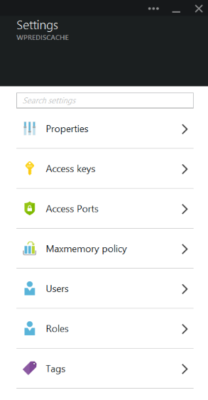
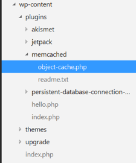

<properties
    pageTitle="Verbinden eine Web app im App-Verwaltungsdienst Azure Cache Redis über das Protokoll den Memcache | Microsoft Azure"
    description="Herstellen einer Verbindung mit dem Protokoll den Memcache Redis-Cache mit einer Web-app in Azure-App-Dienst"
    services="app-service\web"
    documentationCenter="php"
    authors="SyntaxC4"
    manager="wpickett"
    editor="riande"/>

<tags
    ms.service="app-service-web"
    ms.devlang="php"
    ms.topic="get-started-article"
    ms.tgt_pltfrm="windows"
    ms.workload="na"
    ms.date="02/29/2016"
    ms.author="cfowler"/>

# <a name="connect-a-web-app-in-azure-app-service-to-redis-cache-via-the-memcache-protocol"></a>Verbinden einer Web app im App-Verwaltungsdienst Azure Redis Cache über den Memcache Protokoll

In diesem Artikel erfahren Sie, wie Sie [Azure Redis Cache] eine WordPress Web app im [App-Verwaltungsdienst Azure](http://go.microsoft.com/fwlink/?LinkId=529714) Verbindung[ 12] mithilfe der [den Memcache] [ 13] Protokoll. Wenn Sie eine vorhandene Web app, die einen Memcached Server zum Zwischenspeichern von im Speicher verwendet haben, können auf die App-Verwaltungsdienst Azure migrieren, und verwenden die Zwischenspeichern von Erstanbietern-Lösung in Microsoft Azure mit wenig oder gar Änderung an Ihrer Anwendungscode. Darüber hinaus können Sie Ihre vorhandene den Memcache Fachwissen hochgradig skalierbare erstellen apps in Azure-App-Verwaltungsdienst mit Azure Redis Cache für die im Arbeitsspeicher zwischenspeichern, während der Verwendung von beliebte Anwendungsframeworks wie .NET, PHP, Node.js, Java und Python verteilt.  

App-Dienst Web Apps ermöglicht dieses Anwendungsszenario mit Web Apps den Memcache Shims, also eine lokale Memcached Server, der als den Memcache Proxy fungiert für Anrufe an Azure Redis Cache zwischenspeichern. Dadurch wird eine beliebige app, die mithilfe des Memcache-Protokolls zum Zwischenspeichern von Daten mit Redis Cache kommuniziert. Dieser Shim den Memcache funktioniert Protokoll auf oberster Ebene, damit es von einer anderen Anwendung oder einer Anwendungsframework verwendet werden kann, solange er kommuniziert mit den Memcache-Protokoll.

[AZURE.INCLUDE [app-service-web-to-api-and-mobile](../../includes/app-service-web-to-api-and-mobile.md)] 

## <a name="prerequisites"></a>Erforderliche Komponenten

Das Web Apps den Memcache Shim kann bei jeder Anwendung verwendet werden, sofern es kommuniziert mit den Memcache-Protokoll. In diesem Beispiel bestimmten ist die Verweis-Anwendung einer skalierbare WordPress-Website die aus dem Azure Marketplace bereitgestellt werden kann.

Führen Sie die Schritte in den folgenden Artikeln:

* [Bereitstellen einer Instanz von Azure Redis Cachedienst][0]
* [Bereitstellen einer Website skalierbare WordPress in Azure][1]

Nachdem Sie die skalierbare WordPress Website bereitgestellt und eine Redis Cache Instanz bereitgestellt haben, werden Sie bereit sind, fahren Sie mit der Aktivierung des Shims den Memcache in Azure App Dienst Web Apps sein.

## <a name="enable-the-web-apps-memcache-shim"></a>Aktivieren Sie das Web Apps den Memcache shim

Um den Memcache Shim konfigurieren zu können, müssen Sie drei Einstellungen für die app erstellen. Dies kann mithilfe einer Vielzahl von Methoden, einschließlich der [Azure-Portal](http://go.microsoft.com/fwlink/?LinkId=529715)im [Portal klassischen][3], die [PowerShell-Cmdlets Azure] [ 5] oder die [Azure Line Benutzeroberflächen][5]. Im Sinne dieser Beitrag, werde ich mit dem [Portal Azure] [ 4] zum Festlegen der Appeinstellungen. Die folgenden Werte können aus **Einstellungen** Blade Ihrer Redis Cache Instanz abgerufen werden.



### <a name="add-redishost-app-setting"></a>Fügen Sie die app-Einstellung REDIS_HOST

Die erste zu erstellenden app-Einstellung wird der **REDIS\_HOST** app-Einstellung. Diese Einstellung legt das Ziel, an dem das Shim Cacheinformationen weiterleitet. Der Wert für die app-Einstellung REDIS_HOST erforderlichen kann aus dem Blade **Eigenschaften** Ihrer Redis Cache Instanz abgerufen werden.


Legen Sie die app-Einstellung für den Schlüssel **REDIS\_HOST** und den Wert der app-Einstellung, die der Cache Redis Instanz der **Hostname** .


### <a name="add-rediskey-app-setting"></a>Fügen Sie die app-Einstellung REDIS_KEY

Die zweite zu erstellenden app-Einstellung wird der **REDIS\_KEY** app-Einstellung. Diese Einstellung bietet, dass das Authentifizierungstoken für den sicheren Zugriff auf die Instanz Redis Cache erforderlich. Sie können den Wert für die Einstellung REDIS_KEY app aus dem Blade **Zugriffstasten** der Cache Redis Instanz erforderlichen abrufen.


Legen Sie die app-Einstellung für den Schlüssel **REDIS\_Schlüssel** und den Wert der app-Einstellung, die den **Primärschlüssel** der Cache Redis Instanz.


### <a name="add-memcacheshimredisenable-app-setting"></a>Fügen Sie die app-Einstellung MEMCACHESHIM_REDIS_ENABLE

Die letzte app-Einstellung wird verwendet, um das Shim den Memcache im Web Apps, aktivieren das mithilfe der REDIS_HOST und REDIS_KEY eine Verbindung mit dem Azure Redis Cache und den Cache weiterleiten Anrufe. Legen Sie die app-Einstellung für den Schlüssel **MEMCACHESHIM\_REDIS\_aktivieren** und den Wert **true**.


Sobald Sie fertig sind Hinzufügen der Einstellungen für die app drei (3), klicken Sie auf **Speichern**.

## <a name="enable-memcache-extension-for-php"></a>Aktivieren Sie den Memcache Erweiterung für PHP

In der Reihenfolge der Anwendung, das Memcache Protokoll zu sprechen ist es erforderlich sind, um die Erweiterung für den Memcache PHP – das Framework Sprache für Ihre Website WordPress installiert werden.

### <a name="download-the-phpmemcache-extension"></a>Laden Sie die Erweiterung php_memcache

Navigieren Sie zu [PECL][6]. Klicken Sie unter der Kategorie Zwischenspeichern auf [den Memcache][7]. Klicken Sie auf den Link DLL, unter der Spalte Downloads zur Verfügung.


Herunterladen des Non-Thread sichere (NTS) X86 Links für die Version von PHP im Web Apps aktiviert. (Der Standardwert liegt 5.4 von PHP)


### <a name="enable-the-phpmemcache-extension"></a>Aktivieren Sie die Erweiterung php_memcache

Nachdem Sie die Datei herunterladen, Entzippen Sie ihn und Hochladen der **Php\_memcache.dll** in der **d:\\Start\\Website\\Wwwroot\\Papierkorb\\App.\\ ** Directory. Nachdem die php_memcache.dll in die Web app hochgeladen wurde, müssen Sie die Erweiterung für die Laufzeit von PHP zu aktivieren. Um die Erweiterung den Memcache Azure-Portal zu aktivieren, das Blade **Anwendungseinstellungen** für das Web app öffnen, und dann fügen Sie eine neue app-Einstellung mit den Schlüssel **PHP\_ERWEITERUNGEN** und den Wert **Papierkorb\\Durchwahl\\php_memcache.dll**.


> [AZURE.NOTE] Wenn das Web-app mehrere Erweiterungen von PHP laden muss, sollte der Wert von PHP_EXTENSIONS eine kommagetrennte Liste von relativen Pfaden auf DLL-Dateien sein.


Sobald Sie fertig sind, klicken Sie auf **Speichern**.

## <a name="install-memcache-wordpress-plugin"></a>Installieren von Memcache WordPress-Plug-Ins

> [AZURE.NOTE] Sie können auch das [Memcached Objekt-Cache-Plug-Ins](https://wordpress.org/plugins/memcached/) von WordPress.org herunterladen.

Klicken Sie auf der Seite WordPress-Plug-Ins auf **Neu hinzufügen**.


Geben Sie in das Suchfeld ein **Memcached** ein und drücken die **EINGABETASTE**.


Blättern Sie **Memcached Objektcache** in der Liste, und klicken Sie auf **Jetzt installieren**.


### <a name="enable-the-memcache-wordpress-plugin"></a>Aktivieren Sie das Plug-in Memcache WordPress

>[AZURE.NOTE] Führen Sie die Schritte in diesem Blog [eine Website-Erweiterung im Web Apps aktivieren] von[ 8] , Visual Studio Team Services zu installieren.

In der `wp-config.php` ablegen, fügen Sie den folgenden Code über dem Symbol Kommentar am Ende der Datei bearbeiten.

```php
$memcached_servers = array(
    'default' => array('localhost:' . getenv("MEMCACHESHIM_PORT"))
);
```

Nachdem dieser Code eingefügt wurden, wird das Dokument von Monaco automatisch gespeichert.

Im nächsten Schritt wird die Objekt-Cache-Plug-in aktivieren. Dies erfolgt per Drag & Drop **cache.php Objekt** **wp-Inhalt /-Plug-Ins/Memcached** Ordner in den Ordner **wp-Inhalt** , um die Funktion den Memcache Objektcache aktivieren.



Nachdem Sie nun die **Objekt-cache.php** -Datei im Ordner **wp-Inhalt** ist, ist jetzt Memcached Objektcache aktiviert.


## <a name="verify-the-memcache-object-cache-plugin-is-functioning"></a>Stellen Sie sicher, dass das Plug-in den Memcache Objektcache fungiert

Alle Schritte zum Aktivieren des Web Apps den Memcache Shims sind jetzt abgeschlossen. Schritt besteht darin, stellen Sie sicher, dass die Daten die Instanz Redis Cache gefüllt werden.

### <a name="enable-the-non-ssl-port-support-in-azure-redis-cache"></a>Aktivieren Sie die Unterstützung von nicht-SSL Port Azure Redis Cache

>[AZURE.NOTE] Zum Zeitpunkt der in diesem Artikel schreiben unterstützt Redis die CLI nicht SSL-Konnektivität, daher sind die folgenden Schritte erforderlich.

Navigieren Sie zu der Cache Redis-Instanz, die Sie für diese Web-app erstellt haben, im Portal Azure. Nachdem Sie den Cache für Dokumente Blade geöffnet ist, klicken Sie auf das Symbol **Einstellungen** .


Wählen Sie **Access Ports** aus der Liste aus.


Klicken Sie für den **Zugriff nur über SSL zulassen**auf **Nein** .


Sie sehen nun der Port ohne SSL festgelegt ist. Klicken Sie auf **Speichern**.


### <a name="connect-to-azure-redis-cache-from-redis-cli"></a>Verbinden Sie mit Azure Redis Cache aus Redis-cli

>[AZURE.NOTE] Dieser Schritt setzt voraus, die Redis auf Ihrem Entwicklungscomputer lokal installiert ist. [Installieren Sie anhand der folgenden Schritte lokal Redis][9].

Öffnen Sie Ihre Befehlszeile Konsole Wahl, und geben Sie den folgenden Befehl ein:

```shell
redis-cli –h <hostname-for-redis-cache> –a <primary-key-for-redis-cache> –p 6379
```

Ersetzen der ** &lt;Hostname für Redis Cache&gt; ** mit den tatsächlichen xxxxx.redis.cache.windows.net Hostname und der ** &lt;primären Schlüssel für Redis Cache&gt; ** zusammen mit der Tastenkombination für den Cache, drücken Sie dann die **EINGABETASTE**. Sobald die CLI zur Redis Cache Instanz eine Verbindung hergestellt hat, geben Sie eine beliebige Redis-Befehl aus. In den folgenden Screenshot habe ich die Schlüssel aufgelistet.


Der Anruf an die Tasten Liste sollte einen Wert zurückgeben. Wenn nicht, versuchen Sie, navigieren zur Web-app, und versuchen Sie es erneut.

## <a name="conclusion"></a>Abschluss

Herzlichen Glückwunsch! Die app WordPress verfügt jetzt über einen zentralen in-Memory-Cache in zunehmender Durchsatz helfen. Beachten Sie, dass das Web Apps den Memcache Shim mit einem beliebigen Client den Memcache unabhängig davon Programmiersprache oder Anwendungsframework verwendet werden kann. Ihr Feedback zu übermitteln oder über das Web Apps den Memcache Shim bereitstellen zu [MSDN-Foren] Fragen[ 10] oder [Stackoverflow][11].

>[AZURE.NOTE] Wenn Sie mit Azure-App-Verwaltungsdienst Schritte vor dem für ein Azure-Konto anmelden möchten, wechseln Sie zu [App-Verwaltungsdienst versuchen](http://go.microsoft.com/fwlink/?LinkId=523751), in dem Sie eine kurzlebige Starter Web app sofort im App-Dienst erstellen können. Keine Kreditkarten erforderlich; keine Zusagen.

## <a name="whats-changed"></a>Was hat sich geändert
* Ein Leitfaden zum Ändern von Websites-App-Dienst finden Sie unter: [Azure-App-Dienst und deren Einfluss auf die vorhandenen Azure Services](http://go.microsoft.com/fwlink/?LinkId=529714)


[0]: ../redis-cache/cache-dotnet-how-to-use-azure-redis-cache.md#create-a-cache
[1]: http://bit.ly/1t0KxBQ
[2]: http://manage.windowsazure.com
[3]: http://portal.azure.com
[4]: ../powershell-install-configure.md
[5]: /downloads
[6]: http://pecl.php.net
[7]: http://pecl.php.net/package/memcache
[8]: http://blog.syntaxc4.net/post/2015/02/05/how-to-enable-a-site-extension-in-azure-websites.aspx
[9]: http://redis.io/download#installation
[10]: https://social.msdn.microsoft.com/Forums/home?forum=windowsazurewebsitespreview
[11]: http://stackoverflow.com/questions/tagged/azure-web-sites
[12]: /services/cache/
[13]: http://memcached.org
