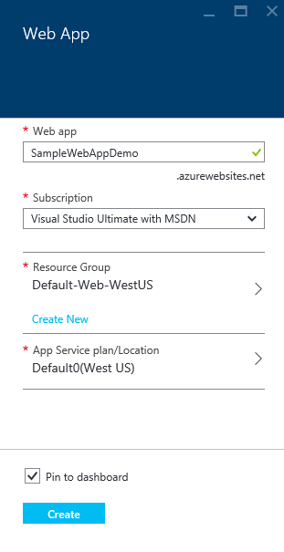
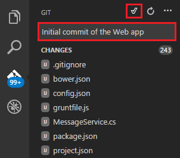

<properties
   pageTitle="Erstellen einer ASP.NET 5 Web app in Visual Studio-Code"
   description="In diesem Lernprogramm veranschaulicht, wie eine ASP.NET 5 Web app mit Visual Studio-Code erstellen."
   services="app-service\web"
   documentationCenter=".net"
   authors="erikre"
   manager="wpickett"
   editor="jimbe"/>

<tags
    ms.service="app-service-web" 
    ms.workload="web" 
    ms.tgt_pltfrm="dotnet" 
    ms.devlang="na" 
    ms.topic="article" 
    ms.date="02/26/2016" 
    ms.author="cephalin"/>

# Erstellen einer ASP.NET 5 Web app in Visual Studio-Code

## (Übersicht)

In diesem Lernprogramm erfahren Sie, wie eine ASP.NET 5 Web app verwenden [Visual Studio-Code (Code im Vergleich mit einer)](http://code.visualstudio.com//Docs/whyvscode) erstellen und in der [App-Verwaltungsdienst Azure](../app-service/app-service-value-prop-what-is.md)bereitzustellen. 

> [AZURE.NOTE] Obwohl in diesem Artikel bei Web apps verweist, gilt jedoch auch für API apps und mobile-apps. 

ASP.NET 5 ist eine signifikante Überarbeitung des ASP.NET. ASP.NET 5 ist ein neues öffnen-Quell- und Plattformen Framework für moderne cloudbasierten Web apps mit .NET erstellen. Weitere Informationen finden Sie unter [Einführung in ASP.NET 5](http://docs.asp.net/en/latest/conceptual-overview/aspnet.html). Informationen zu Azure-App-Verwaltungsdienst Web apps finden Sie unter [Übersicht über die Web Apps](app-service-web-overview.md).

[AZURE.INCLUDE [app-service-web-try-app-service.md](../../includes/app-service-web-try-app-service.md)]

## Erforderliche Komponenten  

* [Code im Vergleich](http://code.visualstudio.com/Docs/setup)zu installieren.
* Installieren [Node.js](http://nodejs.org) - Node.js ist eine Plattform zum Erstellen von schnelle und skalierbare Server-Clientanwendungen mithilfe von JavaScript. Knoten ist die Laufzeit (Knoten), und [Npm](http://www.npmjs.com/) ist das Paket-Manager für Knoten Module. Sie können Npm verwenden, um einer ASP.NET 5 Web app in diesem Lernprogramm scaffold.
* Installieren Git – Sie können aus jedem der folgenden Orte installieren: [Chocolatey](https://chocolatey.org/packages/git) oder [Git-scm.com](http://git-scm.com/downloads). Wenn Sie neu bei Git sind, wählen Sie [Git-scm.com](http://git-scm.com/downloads) , und wählen Sie die Option zum **Verwenden Git aus der Windows-Befehlszeile**. Nachdem Sie Git installiert haben, müssen Sie auch den Benutzernamen Git festlegen und per e-Mail senden, wie sie später im Lernprogramm benötigt wird (Wenn Sie einen Commit von im Vergleich mit einer Code ausführen zu können).  

## Installieren Sie ASP.NET 5 und DNX
ASP.NET 5/DNX (der Umgebung .NET Ausführung) ist einem schlanken .NET Stapel zum Erstellen von modernen Cloud und Web-apps, die unter OS X, Linux und Windows ausgeführt werden. Es wurde von Grund auf neu erstellt von einer optimierten Entwicklungsframework für apps bereitstellen, die in der Cloud bereitgestellt oder lokal ausgeführt werden. Es besteht aus mit minimalen Verwaltungsaufwand, zusätzliche Komponenten, damit Sie beim Erstellen Ihrer Lösungen Flexibilität beibehalten.

In diesem Lernprogramm soll Ihnen den Einstieg mit den neuesten Versionen der Entwicklung von ASP.NET 5 und DNX Applications erstellen. Die folgenden Anweisungen gelten nur für Windows. Ausführlichere Installation Anweisungen für OS X, Linux und Windows finden Sie unter [Installieren von ASP.NET 5 und DNX](https://code.visualstudio.com/Docs/ASPnet5#_installing-aspnet-5-and-dnx). 

1. Um .NET Version Manager (DNVM) unter Windows installieren, öffnen Sie ein Eingabeaufforderungsfenster, und führen Sie den folgenden Befehl aus.

        @powershell -NoProfile -ExecutionPolicy unrestricted -Command "&{$Branch='dev';iex ((new-object net.webclient).DownloadString('https://raw.githubusercontent.com/aspnet/Home/dev/dnvminstall.ps1'))}"

    Dadurch wird das Skript DNVM herunterladen und in Ihrem Benutzerprofil-Verzeichnis ablegen. 

2. **Windows neu starten** zum Abschließen der Installation DNVM. 

    Nachdem Sie Windows neu gestartet haben, können Sie den Befehl aufgefordert werden, überprüfen den Speicherort der DNVM durch Eingabe der folgenden öffnen:

        where dnvm

    Die Befehlszeile wird ein Pfads ähnlich wie der folgende angezeigt.

    

3. Jetzt, da Sie DNVM haben, müssen Sie es verwenden, um die Ausführung der Anwendung DNX herunterladen. Führen Sie in der Befehlszeile Folgendes ein:

        dnvm upgrade

    Überprüfen Sie Ihre DNVM, und zeigen Sie die aktive Laufzeit an, indem Sie in der Befehlszeile Folgendes eingeben:

        dnvm list

    Im Eingabeaufforderungsfenster wird die Details der aktiven Runtime angezeigt.

    

    Wenn mehrere DNX Runtime aufgeführt ist, können Sie auswählen, die folgenden (oder eine neuere Version) Befehl aufgefordert werden, legen Sie die aktive DNX Laufzeit eingeben. Legen Sie dafür den dieselbe Version, die vom ASP.NET 5-Generator verwendet wird, wenn Sie später in diesem Lernprogramm Web app erstellen. *Sie müssen möglicherweise nicht die aktive Laufzeit ändern, wenn sie die neuesten festgelegt ist.*

        dnvm use 1.0.0-update1 –p

> [AZURE.NOTE] Ausführlichere Installation Anweisungen für OS X, Linux und Windows finden Sie unter [Installieren von ASP.NET 5 und DNX](https://code.visualstudio.com/Docs/ASPnet5#_installing-aspnet-5-and-dnx). 

## Erstellen Sie die Web app 

In diesem Abschnitt wird gezeigt, wie Sie eine neue app ASP.NET Web app scaffold. Verwenden Sie den Knoten Paket-Manager (Npm) [Yeoman](http://yeoman.io/) installieren (Anwendung Gerüstbau Tool - Code im Vergleich mit einer vergleichbar mit Visual Studio **Datei > Neues Projekt** Vorgang), [mühselige](http://gruntjs.com/) (JavaScript Vorgang Läufer) und [Bower](http://bower.io/) (Client Seite Paketmanager). 

1. Öffnen Sie ein Eingabeaufforderungsfenster mit Administratorrechten an, und navigieren Sie zu der Stelle, an der Sie Ihr Projekt ASP.NET zu erstellen. Erstellen Sie beispielsweise ein Verzeichnis *Vscodeprojects* im Stammverzeichnis C:\.

2. Geben Sie Folgendes an der Eingabeaufforderung, Yeoman und unterstützende Tools zu installieren.

        npm install -g yo grunt-cli generator-aspnet bower

    > [AZURE.NOTE] Möglicherweise erhalten Sie eine Warnung vorgeschlagen wird, Ihre Version Npm älter ist. Diese Warnung sollte keine Auswirkung auf die in diesem Lernprogramm.

3. Geben Sie die folgenden Befehl aufgefordert werden, den Ordner des Projekts erstellen und die app scaffold aus.

        yo aspnet

4. Wählen Sie den Typ der **Web-Anwendung grundlegende** die ASP.NET 5-Generator im Menü, und drücken Sie mithilfe die Pfeiltasten ** &lt;Eingabetaste >**.

    

5. Legen Sie den Namen der neuen ASP.NET Web app auf **SampleWebApp**ein. Wie dieser Name in der gesamten im Lernprogramm verwendet wird, wenn Sie einen anderen Namen auswählen, müssen Sie es für jede Wiederholung von **SampleWebApp**ersetzt. Wenn Sie drücken ** &lt;Eingabetaste >**, Yeoman wird einen neuen Ordner namens **SampleWebApp** und die erforderlichen Dateien für Ihre neue app erstellen.

6. Wechseln Sie an der Eingabeaufforderung in Ihrem neuen Projektordner:

        cd SampleWebApp

7. Auch an der Befehlszeile zum Installieren der notwendigen NuGet Pakete zum Ausführen der Anwendung geben Sie den folgenden Befehl aus:

        dnu restore

8. Öffnen Sie im Vergleich mit einer Code durch Eingabe der in der Befehlszeile Folgendes ein:

        code .

## Führen Sie die Web app lokal

Jetzt, da das Web-app erstellt haben, und alle NuGet-Pakete für die app abgerufen, können Sie die Web app lokal ausführen.

1. Geben Sie aus der **Palette Befehl** im Vergleich mit einer Code vor, um die verfügbaren ausführen Befehlsoptionen anzuzeigen:

        dnx: Run Command

    > [AZURE.NOTE] Wenn der Server Omnisharp derzeit nicht ausgeführt wird, wird es gestartet. Geben Sie den oben angegebenen Befehl erneut ein.

    Wählen Sie dann den folgenden Befehl zum Ausführen der Web-app:
        
        dnx web - (SampleWebApp)

    Im Befehlsfenster wird angezeigt, dass die Anwendung gestartet hat. Aktivieren Sie das Befehlsfenster diese Nachricht nicht angezeigt wird, im unteren linken corning im Vergleich mit einer Code Fehler in Ihrem Projekt aus.
    
    > [AZURE.NOTE]Senden eines Befehls aus der **Palette Befehl** erfordert eine **>** -Zeichen am Anfang der Befehlszeile. Sie können die Details im Zusammenhang mit der **Web** -Befehl in der Datei *project.json* anzeigen.   
    > Wenn der Befehl nicht angezeigt werden, oder nicht verfügbar ist, müssen Sie die C#-Erweiterung zu installieren. Führen Sie `>Extensions: Install Extension` und `ext install c#` , die C#-Erweiterungen zu installieren.

2. Öffnen Sie einen Browser, und navigieren Sie zu folgendem URL.

    **http://localhost:5000**

    Die Standardseite des Web app wird wie folgt angezeigt.

    

3. Schließen Sie den Browser. Klicken Sie im **Fenster Befehl**drücken Sie **STRG + C** zum Beenden der Anwendungs, und schließen Sie das **Fenster Befehl**aus. 

## Erstellen einer Web app im Azure-Portal

Die folgenden Schritte führt Sie durch die Erstellung einer Web app im Portal Azure.

1. Melden Sie sich bei der [Azure-Portal](https://portal.azure.com).

2. Klicken Sie auf **neu** im Kopfbereich des Portals nach links.

3. Klicken Sie auf **Web Apps > Web App**.

    

4. Geben Sie einen Wert für **Name**, wie beispielsweise **SampleWebAppDemo**. Notiz, die dieser Name muss eindeutig sein, und das Portal erzwingen, dass beim Versuch, den Namen eingeben. Wenn Sie a Geben Sie einen anderen Wert auswählen, müssen Sie daher dieser Wert wird für jede Wiederholung von **SampleWebAppDemo** ersetzt werden, die Sie in diesem Lernprogramm finden Sie unter. 

5. Wählen Sie aus einer vorhandenen **App Dienst planen** oder erstellen Sie einen neuen. Wenn Sie einen neuen Plan erstellen, wählen Sie die Ebene Preisgestaltung, Position und andere Optionen. Weitere Informationen zu App-Service-Pläne finden Sie im Artikel, [Azure-App-Verwaltungsdienst Pläne detaillierter Überblick](../app-service/azure-web-sites-web-hosting-plans-in-depth-overview.md).

    

6. Klicken Sie auf **Erstellen**.

    

## Aktivieren der Git Veröffentlichung für die neue Web app

Git ist ein System mit verteilten Version Steuerelement, mit denen Sie Ihre App-Verwaltungsdienst Azure Web app bereitstellen. Sie können den Code, den Sie für Ihre Web-app in einem lokalen Git Repository schreiben speichern, und erhalten Sie von Code in Azure bereitstellen, drücken Sie nach einem remote-Repository.   

1. Melden Sie sich bei der [Azure-Portal](https://portal.azure.com).

2. Klicken Sie auf **Durchsuchen**.

3. Klicken Sie auf **Web Apps** zum Anzeigen einer Liste der Web apps, die mit Ihrem Azure-Abonnement verknüpft ist.

4. Wählen Sie die Web-app, die Sie in diesem Lernprogramm erstellt haben.

5. Klicken Sie auf **Einstellungen**, in das Web app-Blade > **fortlaufender Bereitstellung**. 

    

6. Klicken Sie auf **Quelle auswählen > lokalen Git Repository**.

7. Klicken Sie auf **OK**.

    

8. Wenn Sie von der Bereitstellung von Anmeldeinformationen für die Veröffentlichung einer Web app oder andere App-Service-app keine zuvor eingerichtet haben, richten Sie diese jetzt ein:

    * Klicken Sie auf **Einstellungen** > **Bereitstellung Anmeldeinformationen**. Das **Festlegen von Anmeldeinformationen für Bereitstellung** Blade wird angezeigt.

    * Erstellen Sie einen Benutzernamen und ein Kennwort ein.  Sie benötigen dieses Kennwort später, wenn Git einrichten.

    * Klicken Sie auf **Speichern**.

9. Klicken Sie in der Web-app-Blade auf **Einstellungen > Eigenschaften**. Unter **GIT URL**ist die URL des remote Git Repositorys, die Sie bereitstellen werden angezeigt.

10. Kopieren Sie den Wert **GIT URL** zur späteren Verwendung im Lernprogramm aus.

    

## Veröffentlichen Sie Ihre Web app auf Azure-App-Verwaltungsdienst

In diesem Abschnitt werden Sie einen lokalen Git Repository und Pushbenachrichtigungen aus diesem Repository in Azure für die Bereitstellung von Web app auf Azure erstellen.

1. Wählen Sie im Vergleich mit einer Code **Git** Option in der linken Navigationsleiste aus.

    

2. Wählen Sie die **Initialisierung Git Repository** , um sicherzustellen, dass der Arbeitsbereich unter Git Datenquellen-Steuerelements ist. 

    

3. Öffnen Sie das Fenster Befehl, und wechseln Sie in das Verzeichnis der Web app. Geben Sie dann den folgenden Befehl aus:

        git config core.autocrlf false

    Dieser Befehl wird verhindert, dass ein Problem zu Text, in dem CRLF Ende und das Ende der LF beteiligt sind.

4. Im Vergleich mit einer Code fügen Sie eine Nachricht Commit ausführen, und klicken Sie auf das Symbol für **Commit alle** Kontrollkästchen.

    

5. Nach Abschluss der Git Verarbeitung, sehen Sie sich, dass es keine Dateien im Fenster Git unter **Änderungen**aufgeführt. 

    

6. Ändern Sie wieder zum Befehlsfenster, in dem der Eingabeaufforderung auf das Verzeichnis zeigt, wo sich Ihre Web app befindet.

7. Erstellen Sie eine remote über Drücken von Aktualisierungen nach Web app mithilfe der Git-URL (Enddatum in ".git"), die Sie zuvor kopiert haben.

        git remote add azure [URL for remote repository]

8. Konfigurieren von Git, um Ihre Anmeldeinformationen lokal speichern, damit diese automatisch an die Pushbenachrichtigungen Befehle aus im Vergleich mit einer Code generiert angefügt werden.

        git config credential.helper store

9. Drücken Sie die Änderungen in Azure durch Eingeben von den folgenden Befehl ein. Nach dieser anfänglichen Pushbenachrichtigungen in Azure werden Sie führen alle Pushbenachrichtigungen Befehle vom Code im Vergleich mit einer sein. 

        git push -u azure master

    Sie werden aufgefordert, das Kennwort aufgefordert, die Sie zuvor in Azure erstellt haben. **Hinweis: Ihr Kennwort wird nicht angezeigt.**

    Die Ausgabe der obigen Befehls endet mit einer Meldung, dass die Bereitstellung erfolgreich ist.

        remote: Deployment successful.
        To https://user@testsite.scm.azurewebsites.net/testsite.git
        [new branch]      master -> master

> [AZURE.NOTE] Wenn Sie Ihre app ändern, können Sie direkt in im Vergleich mit einer Code mithilfe der integrierten Git Funktionen der Option **Alle Commit** gefolgt von der Option **Pushbenachrichtigungen** erneut veröffentlichen. Sie finden die Option **Pushbenachrichtigungen** im Dropdown-Menü neben den Schaltflächen **Alle abzuschließen** und **Aktualisieren** zur Verfügung.

Wenn Sie für die Zusammenarbeit an einem Projekt müssen, sollten Sie berücksichtigen, drücken Sie nach GitHub zwischen nach Azure drücken.

## Führen Sie die app in Azure
Jetzt, da Sie die Web app bereitgestellt haben, führen Sie die app während in Azure gehostet wir. 

Dies kann auf zwei Arten erfolgen:

* Öffnen Sie einen Browser, und geben Sie den Namen der Web app wie folgt.   

        http://SampleWebAppDemo.azurewebsites.net
 
* Klicken Sie im Portal Azure suchen Sie das Web app Blade für Ihre Web app, und klicken Sie auf **Durchsuchen** , um Ihre app anzeigen. 
* in Ihrem Standardbrowser.

## Zusammenfassung
In diesem Lernprogramm haben Sie gelernt, wie eine Web app im Vergleich mit einer Code erstellen und auf Azure bereitgestellt. Weitere Informationen zu im Vergleich mit einer Code, finden Sie im Artikel, [Warum Visual Studio-Code?](https://code.visualstudio.com/Docs/) Informationen zu App-Dienst Web apps finden Sie unter [Übersicht über die Web Apps](app-service-web-overview.md). 
