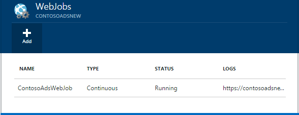
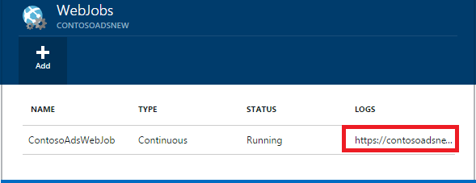

<properties 
    pageTitle="Führen Sie die Hintergrundaufgaben mit WebJobs" 
    description="Erfahren Sie, wie auf Hintergrundaufgaben Azure Web apps ausgeführt werden." 
    services="app-service" 
    documentationCenter="" 
    authors="tdykstra" 
    manager="wpickett" 
    editor="jimbe"/>

<tags 
    ms.service="app-service" 
    ms.workload="na" 
    ms.tgt_pltfrm="na" 
    ms.devlang="na" 
    ms.topic="article" 
    ms.date="04/27/2016" 
    ms.author="tdykstra"/>

# <a name="run-background-tasks-with-webjobs"></a>Führen Sie die Hintergrundaufgaben mit WebJobs

## <a name="overview"></a>(Übersicht)

Sie können Programme oder Skripts in WebJobs ausführen, in der [App-Dienst](http://go.microsoft.com/fwlink/?LinkId=529714) Web app gibt es drei Möglichkeiten: bei Bedarf kontinuierlich, oder nach einem Zeitplan. Es ist keine zusätzliche Kosten WebJobs verwenden.

In diesem Artikel wird gezeigt, wie WebJobs mithilfe der [Azure-Portal](https://portal.azure.com)bereitstellen. Informationen darüber, wie Sie mithilfe von Visual Studio oder eines Prozesses kontinuierlichen Bereitstellung bereitstellen finden Sie unter [So bereitstellen Azure WebJobs bei Web Apps](websites-dotnet-deploy-webjobs.md).

Die Azure WebJobs SDK vereinfacht viele WebJobs programming Aufgaben. Weitere Informationen finden Sie unter [Was ist das SDK WebJobs](websites-dotnet-webjobs-sdk.md).

 Azure-Funktionen (aktuell in der Seitenansicht) ist eine weitere Möglichkeit auf Programme und Skripts Azure-App-Verwaltungsdienst ausgeführt werden. Weitere Informationen finden Sie unter [Übersicht über Funktionen Azure](../azure-functions/functions-overview.md).

[AZURE.INCLUDE [app-service-web-to-api-and-mobile](../../includes/app-service-web-to-api-and-mobile.md)] 

## <a name="a-nameacceptablefilesaacceptable-file-types-for-scripts-or-programs"></a><a name="acceptablefiles"></a>Zulässige Dateitypen für Programme oder Skripts

Die folgenden Dateitypen werden akzeptiert:

* .cmd, bat, .exe (mit Windows Cmd)
* ps1 (mit Powershell)
* .sh (mit Bash)
* PHP (mithilfe von Php)
* .py (mit Python)
* js (mit Knoten)
* .jar (mit Java)

## <a name="a-namecreateondemandacreate-an-on-demand-webjob-in-the-portal"></a><a name="CreateOnDemand"></a>Erstellen einer auf Demand WebJob im portal

1. Klicken Sie in das **Web App** Blade des [Azure-Portal](https://portal.azure.com), auf **Alle Einstellungen > WebJobs** das Blade **WebJobs** angezeigt.
    
    
    
5. Klicken Sie auf **Hinzufügen**. Das Dialogfeld **WebJob hinzufügen** wird angezeigt.
    
    
    
2. Geben Sie unter **Name**einen Namen für die WebJob ein. Der Name muss mit einem Buchstaben oder einer Zahl beginnen und kann nicht keine Sonderzeichen mit anderen als "-" und "_".
    
4. Wählen Sie im Feld **zum Ausführen** **bei Bedarf ausführen**.
    
3. Klicken Sie auf das Ordnersymbol, und navigieren Sie zu der Zip-Datei, die Ihr Skript enthält, im Feld **Datei hochladen** . Die Zip-Datei sollte die EXE-Datei (.exe .cmd bat .sh PHP .py js) sowie alle Hilfsdateien benötigt, um das Programm oder Skript ausführen enthalten.
    
5. Aktivieren Sie **Erstellen** , um das Skript in der Web-app hochladen. 
    
    Der Name, den Sie für die WebJob angegeben wird in der Liste auf das Blade **WebJobs** angezeigt.
    
6. Klicken Sie zum Ausführen der WebJob mit der rechten Maustaste in deren Namens in der Liste, und klicken Sie auf **Ausführen**.
    
    
    
## <a name="a-namecreatecontinuousacreate-a-continuously-running-webjob"></a><a name="CreateContinuous"></a>Erstellen einer kontinuierlich laufenden WebJob

1. Führen Sie zum Erstellen einer fortlaufend ausgeführten WebJob die gleichen Schritte zum Erstellen einer WebJob ausgeführt einmal, aber in das Feld **So ausführen** **fortlaufend**wählen.

2. Um zu beginnen oder Beenden einer kontinuierlichen WebJob, mit der rechten Maustaste im WebJob in der Liste aus, und klicken Sie auf **Starten** und **Beenden**.
    
> [AZURE.NOTE] Wenn Ihre Web app auf mehr als eine Instanz ausgeführt wird, wird eine kontinuierlich laufenden WebJob auf alle Ihre Instanzen ausgeführt werden. Führen Sie bei Bedarf und geplante WebJobs auf einer einzelnen Instanz für den Lastenausgleich, indem Sie Microsoft Azure ausgewählt.
    
> Aktivieren Sie für kontinuierliche WebJobs zuverlässig und klicken Sie auf alle Instanzen ausführen, die immer auf * Konfiguration Einstellung für das Web app andernfalls sie aufhören können, wenn die SCM-Hostingwebsite zu lange im Leerlauf ausgeführt.

## <a name="a-namecreatescheduledcronacreate-a-scheduled-webjob-using-a-cron-expression"></a><a name="CreateScheduledCRON"></a>Erstellen einer geplanten WebJob mithilfe eines Ausdrucks CRON

Diese Methode steht für Web Apps in Basic, Standard oder Premium-Modus ausgeführt und erfordert die Einstellung **Immer auf** die App aktiviert werden.

Um ein auf Demand WebJob in einer geplanten WebJob umwandeln möchten, einfach einschließen einer `settings.job` Datei im Stammverzeichnis der WebJob Zip-Datei. Diese JSON-Datei enthalten soll eine `schedule` Eigenschaft mit einem [CRON-Ausdruck](https://en.wikipedia.org/wiki/Cron), pro Beispiel unten.

CRON-Ausdruck besteht aus 6 Felder: `{second} {minute} {hour} {day} {month} {day of the week}`.

Um beispielsweise Ihre WebJob 15 Minuten Auslösen der `settings.job` müssten:

```json
{
    "schedule": "0 */15 * * * *"
}
``` 

Weitere Beispiele CRON Terminplan aufgeführt:

- Jede Stunde (d. h., wenn die Anzahl der Minuten 0 ist):`0 0 * * * *` 
- Stündlich von 9: 00 Uhr 5:`0 0 9-17 * * *` 
- Um 9:30 Uhr jeden Tag:`0 30 9 * * *`
- Um 9:30 Uhr jeden Wochentag:`0 30 9 * * 1-5`

**Hinweis**: Wenn Sie eine WebJob aus Visual Studio bereitstellen, stellen Sie sicher, markieren Sie Ihre `settings.job` Dateieigenschaften als 'Kopieren, wenn neuer'.


## <a name="a-namecreatescheduledacreate-a-scheduled-webjob-using-the-azure-scheduler"></a><a name="CreateScheduled"></a>Erstellen einer geplanten WebJob mithilfe der Scheduler Azure

Die folgende Alternative Technik nutzt der Scheduler Azure. In diesem Fall verfügt der WebJob nicht keine direkte Kenntnisse des Zeitplans festzulegen. Der Scheduler Azure ruft stattdessen so konfiguriert, dass Ihre WebJob nach einem Zeitplan ausgelöst werden. 

Das Azure-Portal keine noch nicht die Möglichkeit zum Erstellen einer geplanten WebJob, doch Feature wird bis, hinzugefügt, es möglich mithilfe des [klassischen Portal](http://manage.windowsazure.com).

1. In der [klassischen Portal](http://manage.windowsazure.com) wechseln Sie zur Seite WebJob, und klicken Sie auf **Hinzufügen**.

1. Wählen Sie im Feld **zum Ausführen** **nach einem Zeitplan ausgeführt**.
    
    ![Neue geplanten Auftrag][NewScheduledJob]
    
2. Wählen Sie den **Scheduler Region** für Ihr Projekt, und klicken Sie dann auf den Pfeil unten rechts im Dialogfeld auf zum nächsten Fenster wechseln.

3. Klicken Sie im Dialogfeld **Auftrag erstellen** wählen Sie den Typ der **Serie** werden sollen: **einmaligen Position** oder **Periodisch Position**.
    
    ![Serie planen][SchdRecurrence]
    
4. Wählen Sie auch **eine Startzeit** : **jetzt** oder **zu einem bestimmten Zeitpunkt**.
    
    ![Startzeit planen][SchdStart]
    
5. Wenn Sie zu einem bestimmten Zeitpunkt beginnen möchten, wählen Sie Ihre Zeit Startwerte unter **Starten auf**.
    
    ![Starten der Terminplan zu einem bestimmten Zeitpunkt][SchdStartOn]
    
6. Wenn Sie ein wiederkehrendes Projekt ausgewählt haben, verfügen Sie möglicherweise die **als Serie festlegen jeder** Option, um die Häufigkeit von Vorkommen und die Option **Wird demnächst eingestellt auf** , um eine Endzeit anzugeben, anzugeben.
    
    ![Serie planen][SchdRecurEvery]
    
7. Wenn Sie **Wochen**auswählen, können Sie **Ein bestimmtes termingerecht** das Kontrollkästchen und geben die Tage der Woche, an der der Auftrag ausgeführt werden soll.
    
    ![Zeitplan Tage der Woche][SchdWeeksOnParticular]
    
8. Wenn Sie **Monate** auswählen und aktivieren Sie das **Auf ein bestimmtes planen** , können Sie den Auftrag für bestimmte nummerierten **Tagen** des Monats ausgeführt festlegen. 
    
    ![Zeitplan bestimmten Datumsangaben des Monats][SchdMonthsOnPartDays]
    
9. Wenn Sie die **Tage der Woche**auswählen, können Sie welche Tag oder die Tage der Woche im Monat auswählen den Auftrag ausgeführt werden soll.
    
    ![Planen von bestimmter Wochentage in einem Monat][SchdMonthsOnPartWeekDays]
    
10. Schließlich können Sie auch die Option **Vorkommen** die Woche im Monat auswählen (ersten, zweiten, dritten usw.) den Auftrag für die Wochentage ausgeführt Sie angegeben haben soll.
    
    ![Planen von bestimmter Wochentage auf bestimmten Wochen in einem Monat][SchdMonthsOnPartWeekDaysOccurences]
    
11. Nachdem Sie ein oder mehrere Aufträge erstellt haben, werden deren Namen auf der Registerkarte WebJobs, mit deren Status, Zeitplantyp und andere Informationen angezeigt. Verlaufsinformationen für die letzten 30 WebJobs wird beibehalten.
    
    ![Liste der Aufträge][WebJobsListWithSeveralJobs]
    
### <a name="a-nameschedulerascheduled-jobs-and-azure-scheduler"></a><a name="Scheduler"></a>Geplante Aufträge und Azure Scheduler

Geplante Aufträge können weiteren in Azure Scheduler Seiten des [klassischen Portal](http://manage.windowsazure.com)konfiguriert sein.

1.  Klicken Sie auf der Seite WebJobs auf des Projekts **Terminplan** Link zu der Portalseite Azure Scheduler navigieren. 
    
    ![Link zur Azure Scheduler][LinkToScheduler]
    
2. Klicken Sie auf der Seite Zeitplan auf den Auftrag.
    
    ![Position auf der Portalseite Scheduler][SchedulerPortal]
    
3. Die Seite **Auftrag Aktion** wird angezeigt, in dem Sie den Auftrag weiter konfigurieren können. 
    
    ![Position Aktion PageInScheduler][JobActionPageInScheduler]
    
## <a name="a-nameviewjobhistoryaview-the-job-history"></a><a name="ViewJobHistory"></a>Anzeigen des Verlaufs Position

1. Zum Anzeigen des Verlaufs Ausführung eines Auftrags, einschließlich Einzelvorgänge erstellt, mit dem SDK WebJobs klicken Sie auf die entsprechende Verknüpfung unter der Spalte " **Protokolle** " des WebJobs Blades. (Mit das Zwischenablagensymbol können Sie um die URL der Logseite-Datei in die Zwischenablage zu kopieren, wenn Sie möchten.)
    
    
        
2. Klicken auf den Link klicken, wird die Detailseite für die WebJob geöffnet. Diese Seite enthält den Namen des Befehls ausführen, die letzte, die sie ausgeführt wird, die wie oft und deren erfolgreichen oder nicht. Klicken Sie unter **zuletzt verwendete Job ausgeführt wird**klicken Sie auf eine Uhrzeit aus, um weitere Details anzuzeigen.
    
    ![WebJobDetails][WebJobDetails]
    
3. Die Detailseite **WebJob ausgeführt** wird. Klicken Sie auf **Den Schalter Ausgabe** um den Text des Inhalts der Log anzuzeigen. Die Ausgabelog befindet sich im Text-Format. 
    
    ![Führen Sie die Details Web-Position][WebJobRunDetails]
    
4. Wenn den Ausgabetext in einem eigenen Browserfenster anzeigen möchten, klicken Sie auf den Link zum **herunterladen** . Klicken Sie zum Herunterladen des Texts selbst mit der rechten Maustaste in des Links, und verwenden Sie Ihre Browseroptionen, um den Inhalt der Datei zu speichern.
    
    ![Logausgabe herunterladen][DownloadLogOutput]
    
5. Der Link **WebJobs** am oberen Rand der Seite bietet eine geeignete Möglichkeit, um eine Liste der WebJobs auf dem Dashboard Verlauf zu gelangen.
    
    ![Link zu WebJobs Liste][WebJobsLinkToDashboardList]
    
    ![Liste der WebJobs im Verlauf dashboard][WebJobsListInJobsDashboard]
    
    Klicken Sie auf einen der folgenden Links gelangen Sie zur Seite WebJob Details für das Projekt, das Sie ausgewählt haben.


## <a name="a-namewhpnotesanotes"></a><a name="WHPNotes"></a>Notizen
    
- Web apps in kostenlosen Modus können Timeout nach 20 Minuten, wenn es gibt keine Anfragen zu der Website Scm (Bereitstellung) und der Web-app-Portal ist nicht in Azure zu öffnen. Anfragen zu der ist-Website werden nicht dadurch zurückgesetzt.
- Code für ein Projekt mit fortlaufender muss geschrieben werden können, auf einer Schleife endlos ausgeführt werden.
- Fortlaufender Aufträge werden nur bei das Web-app nach oben fortlaufend ausführen.
- Grundlegende und Standard Modi anbieten, die immer auf bereitstellen, die bei aktivierter verhindert, dass Web apps Leerlauf.
- Sie können nur Debuggen WebJobs fortlaufend ausgeführt. Für das Debuggen geplanten oder bei Bedarf WebJobs wird nicht unterstützt.

## <a name="a-namenextstepsanext-steps"></a><a name="NextSteps"></a>Nächste Schritte
 
Weitere Informationen finden Sie unter [Azure WebJobs empfohlen Ressourcen][WebJobsRecommendedResources].

[PSonWebJobs]:http://blogs.msdn.com/b/nicktrog/archive/2014/01/22/running-powershell-web-jobs-on-azure-websites.aspx
[WebJobsRecommendedResources]:http://go.microsoft.com/fwlink/?LinkId=390226

[OnDemandWebJob]: ./media/web-sites-create-web-jobs/01aOnDemandWebJob.png
[WebJobsList]: ./media/web-sites-create-web-jobs/02aWebJobsList.png
[NewContinuousJob]: ./media/web-sites-create-web-jobs/03aNewContinuousJob.png
[NewScheduledJob]: ./media/web-sites-create-web-jobs/04aNewScheduledJob.png
[SchdRecurrence]: ./media/web-sites-create-web-jobs/05SchdRecurrence.png
[SchdStart]: ./media/web-sites-create-web-jobs/06SchdStart.png
[SchdStartOn]: ./media/web-sites-create-web-jobs/07SchdStartOn.png
[SchdRecurEvery]: ./media/web-sites-create-web-jobs/08SchdRecurEvery.png
[SchdWeeksOnParticular]: ./media/web-sites-create-web-jobs/09SchdWeeksOnParticular.png
[SchdMonthsOnPartDays]: ./media/web-sites-create-web-jobs/10SchdMonthsOnPartDays.png
[SchdMonthsOnPartWeekDays]: ./media/web-sites-create-web-jobs/11SchdMonthsOnPartWeekDays.png
[SchdMonthsOnPartWeekDaysOccurences]: ./media/web-sites-create-web-jobs/12SchdMonthsOnPartWeekDaysOccurences.png
[RunOnce]: ./media/web-sites-create-web-jobs/13RunOnce.png
[WebJobsListWithSeveralJobs]: ./media/web-sites-create-web-jobs/13WebJobsListWithSeveralJobs.png
[WebJobLogs]: ./media/web-sites-create-web-jobs/14WebJobLogs.png
[WebJobDetails]: ./media/web-sites-create-web-jobs/15WebJobDetails.png
[WebJobRunDetails]: ./media/web-sites-create-web-jobs/16WebJobRunDetails.png
[DownloadLogOutput]: ./media/web-sites-create-web-jobs/17DownloadLogOutput.png
[WebJobsLinkToDashboardList]: ./media/web-sites-create-web-jobs/18WebJobsLinkToDashboardList.png
[WebJobsListInJobsDashboard]: ./media/web-sites-create-web-jobs/19WebJobsListInJobsDashboard.png
[LinkToScheduler]: ./media/web-sites-create-web-jobs/31LinkToScheduler.png
[SchedulerPortal]: ./media/web-sites-create-web-jobs/32SchedulerPortal.png
[JobActionPageInScheduler]: ./media/web-sites-create-web-jobs/33JobActionPageInScheduler.png
 
