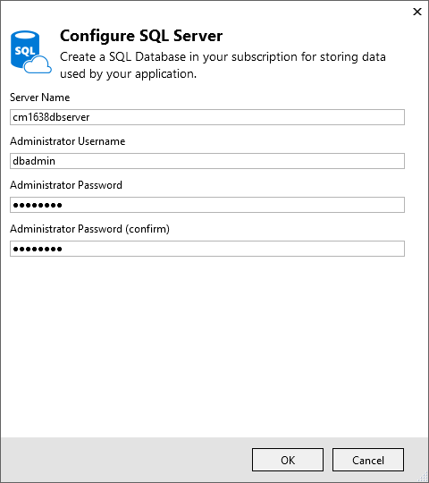
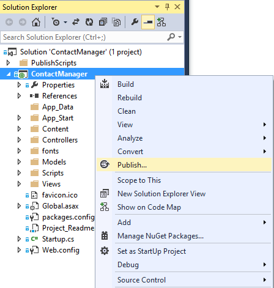
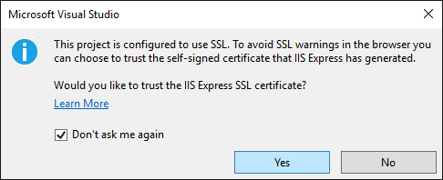
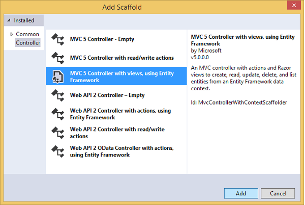
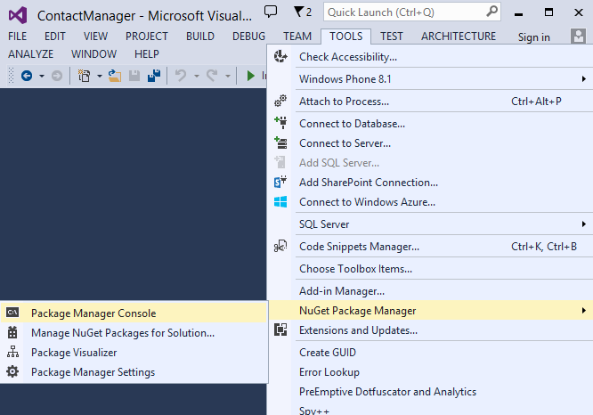

<properties 
    pageTitle="Erstellen Sie eine app ASP.NET-MVC mit autorisierende und SQL-DB und Bereitstellen für Azure-App-Verwaltungsdienst" 
    description="Informationen Sie zum Entwickeln einer ASP.NET MVC 5-app mit einer SQL-Datenbank Back-End-Authentifizierung und Autorisierung hinzufügen und in Azure bereitzustellen." 
    services="app-service\web" 
    documentationCenter=".net" 
    authors="Rick-Anderson" 
    writer="Rick-Anderson" 
    manager="wpickett" 
    editor=""/>

<tags 
    ms.service="app-service-web" 
    ms.workload="web" 
    ms.tgt_pltfrm="na" 
    ms.devlang="dotnet" 
    ms.topic="article" 
    ms.date="03/21/2016" 
    ms.author="riande"/> 

# Erstellen Sie eine app ASP.NET-MVC mit autorisierende und SQL-DB und Bereitstellen für Azure-App-Verwaltungsdienst

In diesem Lernprogramm erfahren, wie Sie eine sichere ASP.NET MVC 5 Web app erstellen, mit die Benutzern die Anmeldung mit den Anmeldeinformationen Facebook oder Google können. Die app ist eine einfache Kontaktliste, die für den Zugriff auf ADO.NET Entität Framework verwendet wird. Sie erhalten die app [Azure-App-Verwaltungsdienst](http://go.microsoft.com/fwlink/?LinkId=529714)bereitstellen. 

Klicken Sie auf das Abschließen des Lernprogramms, müssen Sie eine sichere Daten basierende Webanwendung nach oben und in der Cloud ausgeführt und mithilfe einer Cloud-Datenbank. Die folgende Abbildung zeigt die Anmeldeseite der fertigen Anwendung.

![Anmeldeseite][rxb]

Lernen Sie:

* Informationen zum Erstellen eines sicheren ASP.NET MVC 5-Projekts in Visual Studio.
* Informationen zum Authentifizieren und autorisieren Benutzer anmelden mit Anmeldeinformationen aus ihren Google oder Facebook-Konten (Anbieter für soziale Netzwerke Authentifizierung [OAuth 2.0](http://oauth.net/2 "http://oauth.net/2")verwenden).
* Informationen zum Authentifizieren und Autorisieren von Benutzern, die in einer Datenbank, die von der Anwendung (lokale Authentifizierung mit [ASP.NET Identität](http://asp.net/identity/)) verwaltete zu registrieren.
* So verwenden Sie ADO.NET Entität Framework 6 Code First zum Lesen und Schreiben von Daten in einer SQL-Datenbank.
* Informationen zum ersten Migration von Entität Framework Code zum Bereitstellen einer Datenbank zu verwenden.
* So relationale Daten mithilfe von Azure SQL-Datenbank in der Cloud zu speichern.
* So ein Webprojekt bereitstellen, die eine Datenbank zu einer [Web-app](http://go.microsoft.com/fwlink/?LinkId=529714) in Azure-App-Dienst verwendet werden.

>[AZURE.NOTE] Dies ist eine lange Lernprogramm. Wenn Sie eine schnelle Einführung in Azure-App-Dienst und Visual Studio-Projekte möchten, finden Sie unter [Erstellen einer ASP.NET Web-app in Azure-App-Dienst](web-sites-dotnet-get-started.md). Behandlung von Problemen Informationen finden Sie im Abschnitt [Problembehandlung](#troubleshooting) .
>
>Oder wenn Sie mit Azure-App-Verwaltungsdienst Schritte vor dem für ein Azure-Konto anmelden möchten, wechseln Sie zur [App-Verwaltungsdienst versuchen](http://go.microsoft.com/fwlink/?LinkId=523751), in dem Sie eine kurzlebige Starter Web app sofort im App-Dienst erstellen können. Keine Kreditkarten erforderlich; keine Zusagen.

## Erforderliche Komponenten

Damit dieses Lernprogramm abgeschlossen, benötigen Sie ein Microsoft Azure-Konto an. Wenn Sie kein Konto haben, können Sie [die Vorteile Ihres Visual Studio Abonnenten aktivieren](/pricing/member-offers/msdn-benefits-details/?WT.mc_id=A261C142F) , oder [Melden Sie sich für eine kostenlose Testversion](/pricing/free-trial/?WT.mc_id=A261C142F)an.

Installieren Sie zum Einrichten Ihrer Entwicklungsumgebung [Visual Studio 2013 Update 5](http://go.microsoft.com/fwlink/?LinkId=390521) oder höher, und die neueste Version des [Azure SDK für .NET](http://go.microsoft.com/fwlink/?linkid=324322&clcid=0x409). In diesem Artikel wurde für Visual Studio Update 4 und SDK 2.8.1 geschrieben. Arbeiten die gleichen Schritte für Visual Studio 2015 mit der neuesten [Azure SDK für .NET](http://go.microsoft.com/fwlink/?linkid=518003&clcid=0x409) installiert, aber einige Bildschirme werden aus der Illustrationen anders.

## Erstellen einer ASP.NET MVC 5-Anwendung

### Erstellen Sie das Projekt

1. Klicken Sie im Menü **Datei** auf **Neues Projekt**.

    

1. Klicken Sie im Dialogfeld **Neues Projekt** erweitern Sie **c#** und wählen Sie **Web** unter **Installierte Vorlagen**aus, und wählen Sie **ASP.NET Web-Anwendung**. Nennen Sie die Anwendung **ContactManager**, und klicken Sie dann auf **OK**.

    
 
    **Hinweis:** Stellen Sie sicher, dass Sie "ContactManager" eingeben. Code bereit, mit denen Sie später kopieren werden, werden angenommen, der Namen des Projekts ContactManager. 

1. Wählen Sie im Dialogfeld **Neues Projekt von ASP.NET** **MVC** -Vorlage aus. Überprüfen Sie die **Authentifizierung** auf **Einzelne Benutzerkonten**festgelegt ist, **in der Cloud Host** aktiviert ist, und **App-Dienst** aktiviert ist.

    

1. Klicken Sie auf **OK**.

1. Im Dialogfeld **Microsoft Azure Web App-Einstellungen konfigurieren** wird angezeigt. Möglicherweise müssen sich anmelden, wenn Sie dies noch nicht getan haben, oder Ihre Anmeldeinformationen erneut eingeben, wenn es sich bei die Anmeldung abgelaufen ist.

1. Optional – ändern Sie der Wert im **Web App-Namen** im Feld (siehe Abbildung unten).

    Die URL des Web app werden {Name} .azurewebsites .net, damit der Name in der Domäne azurewebsites.net eindeutig sein muss. Im Kontokonfigurations-Assistenten schlägt einen eindeutigen Namen durch Anhängen einer Zahl an den Namen des Projekts "ContactManager", und das ist in Ordnung in diesem Lernprogramm.

5. In der **Ressourcengruppe** Dropdown-wählen Sie aus einer vorhandenen Gruppe oder einer **neuen Ressourcengruppe erstellen**(siehe Abbildung unten). 

    Wenn Sie es vorziehen, können Sie eine Ressourcengruppe auswählen, die Sie bereits besitzen. Wenn Sie eine neue Ressourcengruppe erstellen und diese nur in diesem Lernprogramm verwenden, es ist aber einfach alle Azure Ressourcen zu löschen, die Sie für das Lernprogramm erstellt haben, wenn Sie mit ihnen fertig sind. Informationen zu Ressourcengruppen finden Sie unter [Übersicht Azure Ressourcenmanager](../azure-resource-manager/resource-group-overview.md). 

5. In den **App-Serviceplan** Dropdownmenü auswählen wählen Sie eine vorhandene Plan oder **erstellen neue App-Verwaltungsdienst planen**(siehe Abbildung unten).

    Wenn Sie es vorziehen, können Sie eine App Serviceplan auswählen, die Sie bereits besitzen. Informationen über App-Service-Pläne finden Sie unter [Azure-App-Verwaltungsdienst Pläne detaillierter Überblick](../app-service/azure-web-sites-web-hosting-plans-in-depth-overview.md). 

1. Tippen Sie auf **Durchsuchen zusätzlicher Azure Dienste** zum Hinzufügen einer SQL­Datenbank.

    

1. Tippen Sie auf die **+** Symbol für das Hinzufügen einer SQL-Datenbank.

    

1. Tippen Sie auf **neu** , klicken Sie im Dialogfeld **SQL-Datenbank konfigurieren** :

    

1. Geben Sie einen Namen für den Administrator und ein sicheres Kennwort ein.

    

    Den Namen des Servers muss eindeutig sein. Sie können die Kleinbuchstaben, Ziffern und Bindestriche enthalten. Es kann keines abschließenden Bindestrichs enthalten. Benutzername und Kennwort sind neue Anmeldeinformationen, die Sie für den neuen Server erstellen möchten. 

    Wenn Sie bereits einen Datenbankserver verfügen, können Sie, die anstelle eines erstellen auswählen. Datenbankserver sind eine wertvolle Ressource, und Sie in der Regel mehrere Datenbanken auf demselben Server testen und Entwicklung anstatt Erstellen eines Datenbankservers pro Datenbank erstellen möchten. Allerdings in diesem Lernprogramm benötigen Sie nur des Servers vorübergehend, und durch die Server in derselben Ressourcengruppe wie die Website erstellen Sie ganz einfach beide Web app und Ressourcen nach der Ressourcengruppe löschen, wenn Sie nach Abschluss des Lernprogramms löschen. 

    Wenn Sie einen vorhandenen Datenbankserver auswählen, stellen Sie sicher, dass Ihre Web app und die Datenbank im selben Bereich befinden.

    

4. Tippen Sie auf **Erstellen**.

    Visual Studio erstellt das Projekt ContactManager Web, erstellt die Ressourcengruppe und die App Serviceplan, die Sie angegeben haben, und erstellt eine Web app in Azure-App-Verwaltungsdienst mit dem Namen, die Sie angegeben haben.

### Festlegen der Kopf- und Fußzeile

1. Öffnen Sie im **Explorer Lösung** *Layout.cshtml* Datei im *Views\Shared ebenfalls einen* Ordner ein.

    ![_Layout.cshtml in Lösung Explorer][newapp004]

1. Ersetzen Sie die ActionLink in der Datei *Layout.cshtml* mit den folgenden Code ein.

    @Html.ActionLink("CMDemo","Index","Kontakte", neue {Bereich =" "}, neue { @class ="Navigationsleiste-Brand"})
                   

    Stellen Sie sicher, dass Sie den dritten Parameter aus "Start" auf "Kontakte" ändern. Das oben aufgeführten Markup erstellt einen Link "Kontakte" auf jeder Seite an die Index-Methode der Kontakte Controller. Ändern Sie den Namen der Anwendung, in der Kopf- oder Fußzeile von "Meine ASP.NET Application" und "Anwendungsname" in "Contact Manager" und "CM Demo" ein. 
 
### Führen Sie die Anwendung lokal

1. Drücken Sie STRG + F5, um die app auszuführen.

    Homepage der Anwendung wird im Standardbrowser angezeigt.

    

Dies ist alles, Sie müssen, jetzt die Anwendung zu erstellen, das auf Azure bereitgestellt werden. 

## In Azure bereitzustellen

1. Klicken Sie in Visual Studio mit der rechten Maustaste im Projekts im **Solution Explorer** , und wählen Sie aus dem Kontextmenü **Veröffentlichen** .

    
    
    Der **Web veröffentlichen** -Assistent wird geöffnet.

1. Klicken Sie im Dialogfeld **Web veröffentlichen** auf **Veröffentlichen**.

    

    Die Anwendung, die Sie erstellt haben, wird jetzt in der Cloud ausgeführt. Das nächste Mal Bereitstellen von der Anwendung, werden nur die geänderten (oder neuen) Dateien bereitgestellt werden.

    

## Aktivieren von SSL für das Projekt ##

1. Klicken Sie im **Explorer Lösung**klicken Sie auf die **ContactManager** Projekt und dann auf F4, um das Fenster **Eigenschaften** zu öffnen.

3. Ändern Sie **SSL aktiviert** auf **True**. 

4. Kopieren Sie die **SSL-URL**ein.

    Kann ich die SSL-URL Https://localhost:44300 / es sei denn, Sie SSL Web apps zuvor erstellt haben.

    ![Aktivieren von SSL][rxSSL]
 
1. Klicken Sie im **Explorer Lösung**mit der rechten Maustaste im Projekt **Contact Manager** , und klicken Sie auf **Eigenschaften**.

1. Klicken Sie auf die Registerkarte **Web** .

1. Ändern Sie die **Project-Url** ein, um die **SSL-URL** , und speichern Sie die Seite (S-Steuerelement).

    
 
1. Stellen Sie sicher, dass Internet Explorer der Browser, der Visual Studio ist startet, wie in der folgenden Abbildung dargestellt:

    

    Der Ansichtsauswahl Browser können Sie im Browser angeben, die, den Visual Studio startet. Können Sie wählen Sie aus mehreren Browsern und Visual Studio jeden Browser aktualisieren, wenn Sie Änderungen vornehmen müssen. Weitere Informationen finden Sie unter [Browser-Link in Visual Studio 2013 verwenden](http://www.asp.net/visual-studio/overview/2013/using-browser-link).

    

1. Drücken Sie STRG + F5, um die Anwendung ausführen. Klicken Sie auf **Ja,** um Starten des Vertrauen des selbst signierten Zertifikats, das IIS Express generiert hat.

     

1. Lesen Sie im Dialogfeld **Sicherheitswarnung** , und klicken Sie dann auf **Ja** , wenn Sie das Zertifikat, das darstellt **Localhost**installieren möchten.

    

1. IE zeigt die *Home* -Seite, und es werden keine Warnungen SSL.

     

     Internet Explorer ist eine gute Wahl, wenn Sie SSL verwenden, da es das Zertifikat akzeptiert und HTTPS-Inhalten ohne Warnung zeigt. Google Chrome und Microsoft Edge akzeptieren auch das Zertifikat. Firefox verwendet ihren eigenen Zertifikatspeicher, sodass es eine Warnung angezeigt wird.

     

## Hinzufügen einer Datenbank mit der Anwendung

Aktualisieren Sie als Nächstes die app, um die Möglichkeit zum Anzeigen und Aktualisieren von Kontakten und speichern Sie die Daten in einer Datenbank hinzufügen. Die app wird Entität Framework (EF) verwenden, um die Datenbank zu erstellen und zu lesen ist und Aktualisieren von Daten.

### Fügen Sie Datenmodell Klassen für die Kontakte hinzu

Sie zunächst ein einfaches Datenmodell Code erstellen.

1. Im- **Lösung Explorer**mit der rechten Maustaste in des Ordner "Modelle", klicken Sie auf **Hinzufügen**, und klicken Sie dann auf **Class**.

    

2. Benennen Sie die neue Klassendatei *Contact.cs*klicken Sie im Dialogfeld **Neues Element hinzufügen** , und klicken Sie dann auf **Hinzufügen**.

    ![Klicken Sie im Dialogfeld Neues Element hinzufügen][adddb002]

3. Ersetzen Sie den Inhalt der Datei Contact.cs mit den folgenden Code ein.

        using System.ComponentModel.DataAnnotations;
        using System.Globalization;
        namespace ContactManager.Models
        {
            public class Contact
            {
                public int ContactId { get; set; }
                public string Name { get; set; }
                public string Address { get; set; }
                public string City { get; set; }
                public string State { get; set; }
                public string Zip { get; set; }
                [DataType(DataType.EmailAddress)]
                public string Email { get; set; }
            }
        }
**Wenden Sie sich an** Klasse definiert die Daten, die Sie speichern möchten, für jeden Kontakt sowie einen Primärschlüssel *Kontakt-Nr*, die von der Datenbank erforderlich ist.

### Erstellen von Webseiten für die app-Benutzer für die Arbeit mit den Kontakten aktivieren

Das Feature ASP.NET-MVC Gerüstbau kann automatisch generieren Code, durchführt erstellen, lesen, aktualisieren und Löschen von Aktionen (CRUD). 

1. Erstellen Sie das Projekt **(STRG + UMSCHALT + B)**. (Sie müssen das Projekt erstellen, bevor der Gerüstbau verwenden.)
 
1. Im **Explorer Lösung**mit der rechten Maustaste in des Ordners Controller, und klicken Sie auf **Hinzufügen**und dann auf **Controller**.

    ![Fügen Sie im Kontextmenü Ordner Controller Controller][addcode001]

5. Klicken Sie im Dialogfeld **Scaffold hinzufügen** wählen Sie **MVC 5 Controller mit Ansichten, die mithilfe von EF** , und klicken Sie dann auf **Hinzufügen**.
    
    

1. Wählen Sie in der Dropdownliste **Modell Class** **Kontakt (ContactManager.Models)**ein. (Siehe nachfolgende Abbildung).

1. Wählen Sie in der **Klasse** **ApplicationDbContext (ContactManager.Models)**ein. Die **ApplicationDbContext** wird für die Zugehörigkeit DB und unsere Kontakt Daten verwendet werden.

    

1. Klicken Sie auf **Hinzufügen**.

   Visual Studio erstellt einen Controller mit Methoden und Ansichten für die Datenbankvorgänge für **Kontakt** Objekte an.

## Aktivieren der Migration, erstellen Sie die Datenbank, Hinzufügen von Beispieldaten und eine Initialisierung Daten ##

Die nächste Aufgabe ist das [Erste Migration Code](http://msdn.microsoft.com/library/hh770484.aspx) -Feature aktivieren und Erstellen von Datenbanktabellen basierend auf dem Datenmodell, das Sie erstellt haben.

1. Wählen Sie im Menü **Extras** **NuGet-Paket-Manager** , und klicken Sie dann **Paket-Manager-Konsole**aus.

    

2. Geben Sie im Fenster **Paket-Manager-Konsole** den folgenden Befehl aus:

        enable-migrations

    Der Befehl **Aktivieren-Migration** erstellt einen *Migration* -Ordner, und es setzt eine *Configuration.cs* -Datei, die Sie bearbeiten können, um die Namen der Datenbank, und konfigurieren die Migration in diesen Ordner. 

2. Geben Sie im Fenster **Paket-Manager-Konsole** den folgenden Befehl aus:

        add-migration Initial

    Der Befehl **Hinzufügen Migration Initiale** generiert eine Datei namens ** &lt;Date_stamp&gt;anfänglichen** in den Ordner für die *Migration* . In dieser Datei wird die Datenbanktabellen erstellt. Erste Parameter ( **Initial** ) wird verwendet, um den Namen der Datei zu erstellen. Sie können Klassendateien der neuen **Lösung Explorer**anzeigen.

    In der **ersten** Klasse die Methode **von** die Kontakttabelle erstellt, und die Methode **nach unten** (wird verwendet, wenn Sie in den vorherigen Zustand zurückkehren möchten) fällt es.

3. Öffnen Sie die Datei *Migrations\Configuration.cs* . 

4. Fügen Sie den folgenden `using` Anweisung. 

         using ContactManager.Models;

5. Ersetzen Sie die Methode *Startwert* mit den folgenden Code ein:

        protected override void Seed(ContactManager.Models.ApplicationDbContext context)
        {
            context.Contacts.AddOrUpdate(p => p.Name,
               new Contact
               {
                   Name = "Debra Garcia",
                   Address = "1234 Main St",
                   City = "Redmond",
                   State = "WA",
                   Zip = "10999",
                   Email = "debra@example.com",
               },
                new Contact
                {
                    Name = "Thorsten Weinrich",
                    Address = "5678 1st Ave W",
                    City = "Redmond",
                    State = "WA",
                    Zip = "10999",
                    Email = "thorsten@example.com",
                },
                new Contact
                {
                    Name = "Yuhong Li",
                    Address = "9012 State st",
                    City = "Redmond",
                    State = "WA",
                    Zip = "10999",
                    Email = "yuhong@example.com",
                },
                new Contact
                {
                    Name = "Jon Orton",
                    Address = "3456 Maple St",
                    City = "Redmond",
                    State = "WA",
                    Zip = "10999",
                    Email = "jon@example.com",
                },
                new Contact
                {
                    Name = "Diliana Alexieva-Bosseva",
                    Address = "7890 2nd Ave E",
                    City = "Redmond",
                    State = "WA",
                    Zip = "10999",
                    Email = "diliana@example.com",
                }
                );
        }

    Dieser Code initialisiert (Basis) die Datenbank mit Kontaktinformationen. Weitere Informationen über die Datenbank sendet finden Sie unter [Ausgangswert und Datenbanken für das Debuggen Entität Framework (EF)](http://blogs.msdn.com/b/rickandy/archive/2013/02/12/seeding-and-debugging-entity-framework-ef-dbs.aspx). Erstellen Sie das Projekt, um zu überprüfen, dass keine Kompilierungsfehler vorliegen.

6. Geben Sie in das **Paket-Manager-Konsole** den Befehl aus:

        update-database

    ![Paket-Manager-Konsole Befehle][addcode009]

    Die **Update-Datenbank** ausgeführt wird, die erste Migration, die die Datenbank erstellt wird. Standardmäßig ist die Datenbank als SQL Server Express LocalDB Datenbank erstellt. 

7. Drücken Sie STRG + F5, um die Anwendung ausführen, und klicken Sie dann auf den Link **CM Demo** ; oder navigieren Sie zu https://localhost:(port#)/Cm. 

    Die Anwendung zeigt die Ausgangswerte sowie Details, bearbeiten und löschen links. Sie erstellen, bearbeiten, löschen und Anzeigen von Daten.

    ![MVC-Ansicht von Daten][rx2]

## Hinzufügen eines OAuth2-Dienstanbieters

>[AZURE.NOTE] Weitere Informationen zur Verwendung der Google und Facebook Developer Portalwebsites, dieses Lernprogramms Links zu Lernprogrammen auf der Website ASP.NET. Jedoch ändern, Google und Facebook ihrer Websites häufiger als diesen Lernprogrammen aktualisiert werden und nun veraltet sind. Wenn Sie den Anweisungen folgen Probleme haben, finden Sie unter den bereitgestellten Disqus Kommentar am Ende dieses Lernprogramms für eine Liste der was sich geändert hat. 

[OAuth] (http://oauth.net/ "http://OAuth.NET/") ist ein offenes Protokoll, das sichere Autorisierung in einer einfachen und den Standardversionen Methode aus, Geräte und desktop Webanwendungen ermöglicht. Die Vorlage ASP.NET-MVC Internet wird mit OAuth um als Authentifizierungsanbieter Facebook, Twitter, Google und Microsoft verfügbar zu machen. Obwohl in diesem Lernprogramm nur Google als Authentifizierungsanbieter verwendet wird, können Sie den Code, um eine der folgenden Anbieter verwenden einfach ändern. Die Schritte zum Implementieren der anderen Anbietern sind sehr ähnlich mit den Schritten fort, die in diesem Lernprogramm angezeigt werden. Um Facebook als eine Authentifizierungsanbieter verwenden zu können, finden Sie unter [MVC 5-App mit Facebook, Twitter, LinkedIn und Google OAuth2 anmelden ](http://www.asp.net/mvc/tutorials/mvc-5/create-an-aspnet-mvc-5-app-with-facebook-and-google-oauth2-and-openid-sign-on).

Zusätzlich zu Authentifizierung verwendet dieses Lernprogramms Rollen Autorisierung implementiert wird. Nur die Benutzer, die Sie die Rolle *CanEdit* hinzufügen können Sie zum Ändern von Daten sind (d. h., erstellen, bearbeiten oder Löschen von Kontakten).

1. Folgen Sie den Anweisungen in [MVC 5-App mit Facebook, Twitter, LinkedIn und Google OAuth2 anmelden](http://www.asp.net/mvc/tutorials/mvc-5/create-an-aspnet-mvc-5-app-with-facebook-and-google-oauth2-and-openid-sign-on#goog) , geben Sie unter **Erstellen einer app Google für OAuth 2 eine Google-app für OAuth2 einrichten**.

3. Führen und Testen der app, um sicherzustellen, dass Sie mithilfe der Google-Authentifizierung anmelden können.

2. Wenn Sie die Schaltflächen für soziale Netzwerke Login mit anbieterspezifische Symbole erstellen möchten, finden Sie unter [ziemlich sozialen Login Schaltflächen für ASP.NET MVC 5](http://www.jerriepelser.com/blog/pretty-social-login-buttons-for-asp-net-mvc-5)

## Verwenden die Mitgliedschaft API

In diesem Abschnitt fügen Sie ein lokaler Benutzer und die Rolle *CanEdit* zur Mitgliedschaftsdatenbank. Nur die Benutzer in der Rolle *CanEdit* werden Daten bearbeiten zu können. Bewährte Methode ist, die Rollen von Namen durch die Aktionen, die sie ausführen können, die also *CanEdit* bevorzugte über eine Rolle namens *Administrator*. Wenn eine Anwendung weiterentwickelt, können Sie neue Rollen, z. B. *CanDeleteMembers* anstelle der weniger beschreibenden *SuperAdmin*hinzufügen.

1. Öffnen Sie die Datei *migrations\configuration.cs* , und fügen Sie den folgenden `using` Anweisungen:

        using Microsoft.AspNet.Identity;
        using Microsoft.AspNet.Identity.EntityFramework;

1. Die folgende **AddUserAndRole** -Methode der Klasse hinzufügen:

        bool AddUserAndRole(ContactManager.Models.ApplicationDbContext context)
        {
            IdentityResult ir;
            var rm = new RoleManager<IdentityRole>
                (new RoleStore<IdentityRole>(context));
            ir = rm.Create(new IdentityRole("canEdit"));
            var um = new UserManager<ApplicationUser>(
                new UserStore<ApplicationUser>(context));
            var user = new ApplicationUser()
            {
                UserName = "user1@contoso.com",
            };
            ir = um.Create(user, "P_assw0rd1");
            if (ir.Succeeded == false)
                return ir.Succeeded;
            ir = um.AddToRole(user.Id, "canEdit");
            return ir.Succeeded;
        }

1. Rufen Sie die neue Methode aus der **Startwert** Methode:

        protected override void Seed(ContactManager.Models.ApplicationDbContext context)
        {
            AddUserAndRole(context);
            context.Contacts.AddOrUpdate(p => p.Name,
                // Code removed for brevity
        }

    Die folgenden Bilder zeigt die Änderungen *Startwert* Methode:

    

    Dieser Code erstellt eine neue Rolle *CanEdit*aufgerufen, erstellt einen neuen lokalen Benutzer *user1@contoso.com*, und fügt *user1@contoso.com* , die der Rolle *CanEdit* . Weitere Informationen finden Sie auf der Website ASP.NET die [ASP.NET Identität Lernprogramme](http://www.asp.net/identity/overview/features-api) .

## Verwenden Sie temporäre Code zum Hinzufügen neuer sozialen Login Benutzer, um die CanEdit Rolle  ##

In diesem Abschnitt ändern Sie vorübergehend die Methode **ExternalLoginConfirmation** in dem Kontocontroller zum Hinzufügen neuer Benutzer, die mit einem OAuth-Anbieter, die der Rolle *CanEdit* registrieren. Wir hoffen ein Tools [WSAT](http://msdn.microsoft.com/library/ms228053.aspx) ähnlich wie in der Zukunft angeben, das Sie Benutzerkonten und Rollen erstellen und bearbeiten können. Bis zu diesem Zeitpunkt können Sie die gleiche Funktion mit temporäre Code ausführen.

1. Öffnen Sie die Datei **Controllers\AccountController.cs** , und navigieren Sie zu der Methode **ExternalLoginConfirmation** .

1. Fügen Sie den folgenden Anruf **AddToRoleAsync** unmittelbar vor den Anruf **SignInAsync** hinzu.

        await UserManager.AddToRoleAsync(user.Id, "canEdit");

   Der obige Code addiert neu registrierten Benutzer, die der Rolle "CanEdit", in dem sie auf die Aktionsmethoden zugreifen kann, die Ändern von Daten (Bearbeiten). Im folgenden Codeausschnitt wird die neue Zeile des Codes im Kontext an.

          // POST: /Account/ExternalLoginConfirmation
          [HttpPost]
          [AllowAnonymous]
          [ValidateAntiForgeryToken]
          public async Task ExternalLoginConfirmation(ExternalLoginConfirmationViewModel model, string returnUrl)
          {
             if (User.Identity.IsAuthenticated)
             {
                return RedirectToAction("Index", "Manage");
             }
             if (ModelState.IsValid)
             {
                // Get the information about the user from the external login provider
                var info = await AuthenticationManager.GetExternalLoginInfoAsync();
                if (info == null)
                {
                   return View("ExternalLoginFailure");
                }
                var user = new ApplicationUser { UserName = model.Email, Email = model.Email };
                var result = await UserManager.CreateAsync(user);
                if (result.Succeeded)
                {
                   result = await UserManager.AddLoginAsync(user.Id, info.Login);
                   if (result.Succeeded)
                   {
                      await UserManager.AddToRoleAsync(user.Id, "canEdit");
                      await SignInManager.SignInAsync(user, isPersistent: false, rememberBrowser: false);
                      return RedirectToLocal(returnUrl);
                   }
                }
                AddErrors(result);
             }
             ViewBag.ReturnUrl = returnUrl;
             return View(model);
          }

Später im Lernprogramm werden Sie die Anwendung Azure bereitstellen, Stelle, an der Sie mit Google oder einem anderen Anbieter von Drittanbieter-Authentifizierung Anmeldung werden. Dadurch wird Ihr Konto neu registrierte, die der Rolle *CanEdit* hinzugefügt. Jede Person, die Ihre Web-app-URL findet und hat eine Google-ID kann dann registrieren und die Datenbank aktualisieren. Um zu verhindern, dass andere Personen, die ausführen, können Sie die Website beenden. Sie zwar können zur Überprüfung, wer die Rolle *CanEdit* ist, indem Sie die Datenbank.

Drücken Sie in der **Paket-Manager Console** -oben-Taste, um den folgenden Befehl anzuzeigen:

        Update-Database

Der Befehl **Update-Datenbank** ausgeführt wird, die Methode **Startwert** , und die **AddUserAndRole** Methode, die Sie zuvor hinzugefügt ausgeführt wird. Die Methode **AddUserAndRole** erstellt den Benutzer *user1@contoso.com* und sich die Rolle *CanEdit* hinzugefügt.

## Schützen der Anwendungs SSL und das Attribut autorisieren ##

In diesem Abschnitt wenden Sie das Attribut [Autorisieren](http://msdn.microsoft.com/library/system.web.mvc.authorizeattribute.aspx) zum Einschränken des Zugriffs auf die Aktionsmethoden aus. Anonyme Benutzer werden nur die **Index** Aktionsmethode der home-Controller angezeigt werden sollen. Registrierte Benutzer werden Kontaktdaten (den **Index** und **Details** Seiten mit dem Controller Cm), die Seite "Info" und der Seite sehen können. Nur Benutzer mit der Rolle *CanEdit* werden können Access Aktionsmethoden, die Daten zu ändern.

1. Öffnen Sie die Datei *App_Start\FilterConfig.cs* , und Ersetzen Sie die *RegisterGlobalFilters* -Methode durch die folgende (die zwei Filter hinzugefügt):

        public static void RegisterGlobalFilters(GlobalFilterCollection filters)
        {
            filters.Add(new HandleErrorAttribute());
            filters.Add(new System.Web.Mvc.AuthorizeAttribute());
            filters.Add(new RequireHttpsAttribute());
        }
        
    Dieser Code fügt der [Autorisieren](http://msdn.microsoft.com/library/system.web.mvc.authorizeattribute.aspx) und den [s](http://msdn.microsoft.com/library/system.web.mvc.requirehttpsattribute.aspx) Filter mit der Anwendung. Der Filters [Autorisieren](http://msdn.microsoft.com/library/system.web.mvc.authorizeattribute.aspx) verhindert, dass anonyme Benutzer zugreifen auf Methoden in der Anwendung. Sie verwenden das Attribut [AllowAnonymous](http://blogs.msdn.com/b/rickandy/archive/2012/03/23/securing-your-asp-net-mvc-4-app-and-the-new-allowanonymous-attribute.aspx) um zu überspringen, damit anonyme Benutzer anmelden können und der Homepage anzeigen der Anforderung Autorisierung in einige Methoden. Die [s](http://msdn.microsoft.com/library/system.web.mvc.requirehttpsattribute.aspx) erfordert, dass alle Zugriff auf die Web-app durch HTTPS.

    Eine weitere Möglichkeit besteht darin, das Attribut [Autorisieren](http://msdn.microsoft.com/library/system.web.mvc.authorizeattribute.aspx) und das Attribut [s](http://msdn.microsoft.com/library/system.web.mvc.requirehttpsattribute.aspx) jeder Controller hinzufügen, aber es gilt als Sicherheitsgründen Sie auf die gesamte Anwendung anwenden. Global hinzufügen, indem Sie jede neue Methode Controller und Aktion, die Sie hinzufügen automatisch geschützt ist – Sie brauchen Denken Sie daran, die sie anwenden. Weitere Informationen finden Sie unter [Sichern Ihrer ASP.NET MVC-App und das neue AllowAnonymous Attribut](http://blogs.msdn.com/b/rickandy/archive/2012/03/23/securing-your-asp-net-mvc-4-app-and-the-new-allowanonymous-attribute.aspx). 

1. Fügen Sie das Attribut [AllowAnonymous](http://blogs.msdn.com/b/rickandy/archive/2012/03/23/securing-your-asp-net-mvc-4-app-and-the-new-allowanonymous-attribute.aspx) an die **Index** -Methode der Home-Controller hinzu. Das Attribut [AllowAnonymous](http://blogs.msdn.com/b/rickandy/archive/2012/03/23/securing-your-asp-net-mvc-4-app-and-the-new-allowanonymous-attribute.aspx) können Sie die gewünschten von Autorisierung Suchbegriffen Methoden weißen Liste. 

        public class HomeController : Controller
        {
          [AllowAnonymous]
          public ActionResult Index()
          {
             return View();
          }

    Wenn Sie eine globale Suche nach *AllowAnonymous*ausführen, sehen Sie sich, dass sie die Anmeldung und Registrierung Methoden der dem Kontocontroller verwendet wird.

1. Hinzufügen von *CmController.cs*, `[Authorize(Roles = "canEdit")]` an die HttpGet und HttpPost Methoden, die Ändern von Daten, die im Controller *Cm* (erstellen, bearbeiten, löschen, mit Ausnahme von Index und Details jeder Aktionsmethode). Ein Teil der vollständige Code sieht folgendermaßen aus: 

        // GET: Cm/Create
        [Authorize(Roles = "canEdit")]
        public ActionResult Create()
        {
           return View(new Contact { Address = "123 N 456 W",
            City="Great Falls", Email = "ab@cd.com", Name="Joe Smith", State="MT",
           Zip = "59405"});
        }
        // POST: Cm/Create
        // To protect from overposting attacks, please enable the specific properties you want to bind to, for 
        // more details see http://go.microsoft.com/fwlink/?LinkId=317598.
        [HttpPost]
        [ValidateAntiForgeryToken]
         [Authorize(Roles = "canEdit")]
        public ActionResult Create([Bind(Include = "ContactId,Name,Address,City,State,Zip,Email")] Contact contact)
        {
            if (ModelState.IsValid)
            {
                db.Contacts.Add(contact);
                db.SaveChanges();
                return RedirectToAction("Index");
            }
            return View(contact);
        }
        // GET: Cm/Edit/5
        [Authorize(Roles = "canEdit")]
        public ActionResult Edit(int? id)
        {
            if (id == null)
            {
                return new HttpStatusCodeResult(HttpStatusCode.BadRequest);
            }
            Contact contact = db.Contacts.Find(id);
            if (contact == null)
            {
                return HttpNotFound();
            }
            return View(contact);
        }
        
1. Drücken Sie STRG + F5, um die Anwendung ausführen.

1. Wenn Sie weiterhin aus einer früheren Sitzung angemeldet sind, drücken Sie den Link **Melden Sie sich ab** .

1. Klicken Sie auf die **zu** oder den **Kontakt** Links aus. Sie werden zur Anmeldeseite umgeleitet, da anonyme Benutzer die Seiten anzeigen können.

1. Klicken Sie auf den Link **als einen neuen Benutzer registrieren** , und fügen Sie einen lokalen Benutzer mit e-Mail *joe@contoso.com*. Überprüfen Sie *Helmut* können zum Anzeigen von Start, und wenden Sie sich an Seiten. 

    

1. Klicken Sie auf den Link *CM Demo* , und stellen Sie sicher, dass die Daten angezeigt werden.

1. Klicken Sie auf einen Link auf der Seite, die Sie auf der Anmeldeseite umgeleitet, (da ein neuer lokaler Benutzer nicht die Rolle *CanEdit* hinzugefügt wird).

1. Melden Sie sich als *user1@contoso.com* mit Kennwort "P_assw0rd1" (die "0" in "Word" ist eine Null). Sie werden zur Bearbeitungsseite umgeleitet, die Sie zuvor ausgewählt haben. 
2. 

    Wenn Sie sich mit diesem Konto und Kennwort, versuchen Sie das Kennwort aus dem Quellcode kopieren und Einfügen anmelden können. Wenn Sie sich noch nicht anmelden können, überprüfen Sie die **UserName** -Spalte der Tabelle **AspNetUsers** zur Überprüfung *user1@contoso.com* hinzugefügt wurde. 

1. Stellen Sie sicher, dass Sie Daten Änderungen vornehmen können.

## Die app in Azure bereitstellen

1. Klicken Sie in Visual Studio mit der rechten Maustaste im Projekts im **Solution Explorer** , und wählen Sie aus dem Kontextmenü **Veröffentlichen** .

    ![Veröffentlichen Sie in Project-Kontextmenü][firsdeploy003]

    Der **Web veröffentlichen** -Assistent wird geöffnet.

1. Klicken Sie auf der Registerkarte **Einstellungen** auf der linken Seite des Dialogfelds **Web veröffentlichen** . 

2. Wählen Sie die Datenbank, die Sie beim Erstellen des Projekts erstellt haben, unter **ApplicationDbContext** .
   

1. Wählen Sie unter **ContactManagerContext** **Code ersten Migration ausführen**aus.

    

1. Klicken Sie auf **Veröffentlichen**.

1. Melden Sie sich als *user1@contoso.com* (mit dem Kennwort des "P_assw0rd1"), und überprüfen Sie die Daten bearbeiten können.

1. Melden Sie sich ab.

1. Wechseln Sie zur [Google Entwickler Console](https://console.developers.google.com/) und die **Anmeldeinformationen** Registerkarte aktualisieren die Umleitung URIS und JavaScript Orgins Azure-URL verwenden.

1. Melden Sie sich mithilfe von Google oder Facebook. Die Rolle des **CanEdit** wird, die Google oder Facebook-Konto hinzufügen. Wenn ein HTTP 400-Fehler mit der Meldung angezeigt wird *die Umleitung URI in der Besprechungsanfrage: https://contactmanager {Meine version}.azurewebsites.net/signin-google stimmt nicht mit eine registrierte Umleitung URI.*, müssen Sie warten, bis die vorgenommenen Änderungen weitergegeben werden. Wenn dieser Fehler nach mehr als ein paar Minuten angezeigt wird, vergewissern Sie sich die URIs korrekt sind.

### Beenden Sie das Web-app, um zu verhindern, dass andere Personen registrieren  

1. **Server-Explorer**, navigieren Sie zu **Azure > App-Dienst > {Ressourcengruppe} > {Web app}**.

4. Mit der rechten Maustaste im Web app, und wählen Sie **Beenden**aus. 

    Sie können auch im im [Portal Azure](https://portal.azure.com/)können Sie wechseln Sie zu der Web-app Blade, dann klicken Sie auf das Symbol **Beenden** am oberen Rand der Blade.

    

### Entfernen von AddToRoleAsync, veröffentlichen und testen

1. Kommentieren Sie oder entfernen Sie den folgenden Code aus der **ExternalLoginConfirmation** -Methode in dem Kontocontroller:

        await UserManager.AddToRoleAsync(user.Id, "canEdit");

1. Erstellen Sie das Projekt (das speichert der Datei Änderungen und stellt sicher, dass Sie mit Kompilierungsfehlern besitzen).

5. Mit der rechten Maustaste im Projekts im **Solution Explorer** , und wählen Sie **Veröffentlichen**aus.

       
    
4. Klicken Sie auf die Schaltfläche **Vorschau zu starten** . Es werden nur die Dateien, die aktualisiert werden müssen bereitgestellt.

5. Starten Sie die Web-app von Visual Studio oder im Portal. **Nicht möglich zu veröffentlichen, während das Web app angehalten ist**.

    

5. Kehren Sie zu Visual Studio, und klicken Sie auf **Veröffentlichen**.

3. Ihre App Azure wird in Ihrem Standardbrowser geöffnet. Wenn Sie angemeldet sind, melden Sie sich ab, damit Sie auf der Homepage als anonymer Benutzer anzeigen können.  

4. Klicken Sie auf den Link **Info** . Sie können in das Protokoll Seite umgeleitet werden.

5. Klicken Sie auf den Link **Register** Protokoll der Seite und erstellen Sie lokales Konto. Wir werden diese lokales Konto verwenden, um zu überprüfen, können Sie nur gelesen Seiten zugreifen, aber Sie können Seiten, die Daten ändern (die durch die Rolle *CanEdit* geschützt sind) nicht zugreifen. In diesem Lernprogramm werden Sie höher lokalen Kontozugriffs auf Entfernen. 

    

1. Stellen Sie sicher, dass Sie auf den Seiten *zu* und *Kontakt* navigieren können.

    

1. Klicken Sie auf den Link **CM Demo** zu dem Controller **Cm** navigieren. Alternativ können Sie *Cm* zur URL anfügen. 

    
 
1. Klicken Sie auf einen Bearbeitungslink. 

    Sie sind auf der Anmeldeseite umgeleitet. 

2. Klicken Sie unter **einem anderen Dienst bei der Anmeldung beim Verwenden**, klicken Sie auf Google oder Facebook und Log mit dem Konto, das Sie bereits registriert. (Wenn Sie schnell arbeiten und Ihre Sitzungscookie ist noch nicht abgelaufen, werden Sie automatisch mit dem Google oder Facebook-Konto zuvor von Ihnen verwendete angemeldet sein.)

2. Stellen Sie sicher, dass die Daten, während Sie in diesem Konto angemeldet bearbeitet werden können.

    **Hinweis:** Sie können nicht aus Google aus dieser app und Log in einer anderen Gmail-Konto mit den gleichen Browser anmelden. Wenn Sie einen anderen Browser verwenden, müssen Sie zum Google zu navigieren, und melden Sie sich ab. Durch einen anderen Browser verwenden, können Sie sich mit einem anderen Konto aus der gleichen Drittanbieter-Authentifizierung (z. B. Google) anmelden.

    Wenn Sie den vor- und Nachnamen Namen von Google-Kontoinformationen nicht ausgefüllt haben, wird eine NullReferenceException auftreten.

## Überprüfen die SQL Azure-DB ##

1. **Server-Explorer**, navigieren Sie zu **Azure > SQL-Datenbanken > {Ihrer Datenbank}**

2. Klicken Sie mit der rechten Maustaste auf die Datenbank, und wählen Sie dann **in der SQL Server-Objekt-Explorer öffnen**.
 
    
 
3. Wenn Sie Zugriff auf diese Datenbank zuvor verbunden nicht geschehen ist, können Sie aufgefordert, eine Firewall-Regel zum Aktivieren des Zugriffs für Ihre aktuelle IP-Adresse hinzufügen. Die IP-Adresse werden bereits ausgefüllt. Klicken Sie einfach auf **Firewall-Regel hinzufügen** , um den Zugriff gewähren.

    

3. Melden Sie sich der Datenbank mit den Benutzernamen und das Kennwort, die Sie angegeben haben, wenn Sie den Datenbankserver erstellt haben. 
 
1. Klicken Sie mit der rechten Maustaste auf der Tabelle **AspNetUsers** , und wählen Sie die **Daten anzeigen**.

    
 
1. Beachten Sie die Id aus der Gmail-Konto, das Sie mit der Rolle **CanEdit** sein registriert und die Id des *user1@contoso.com*. Diese sollten nur Benutzer in der Rolle **CanEdit** . (Sie werden im nächsten Schritt überprüfen, ob.)

    
 
2. Klicken Sie im **SQL Server-Objekt-Explorer**klicken Sie mit der rechten Maustaste auf **AspNetUserRoles** , und wählen Sie die **Daten anzeigen**.

    
 
3. Stellen Sie sicher, dass die **Benutzer-ID** aus *user1@contoso.com* und der Gmail-Konto, das Sie registriert haben. 

## Behandlung von Problemen

Wenn Probleme auftreten, sind hier einige Vorschläge für die Vorgehensweise zur Behebung.

* Fehler bei der Bereitstellung von SQL-Datenbank: Stellen Sie sicher, dass das aktuelle SDK installiert. Ältere Versionen von 2.8.1 haben, einen Fehler, der in einigen Szenarien Fehler verursacht, wenn im Vergleich mit einer versucht, auf dem Datenbankserver oder die Datenbank zu erstellen.
* Fehlermeldung "der Vorgang ist für Ihr Angebot Abonnementtyp nicht unterstützt" beim Erstellen von Azure Ressourcen – wie oben.
* Fehler beim Bereitstellen von - sollten Sie im Artikel [grundlegende ASP.NET-Bereitstellung](web-sites-dotnet-get-started.md) . Bereitstellungsszenario ist es einfacher und stehen Ihnen das gleiche Problem gibt es so kann sein einfacher isolieren. Beispielsweise kann in einigen Enterprise-Umgebungen eine Unternehmens-Firewall hindert Web bereitstellen die Arten von Verbindungen, zu Azure, die erforderlich ist.
* Keine Option, um die Verbindungszeichenfolge im Web veröffentlichen-Assistenten bei der Bereitstellung aktivieren – Wenn Sie eine andere Methode zum Erstellen von Azure Ressourcen verwendet (z. B. Sie versuchen, eine Web app bereitstellen und eine SQL-Datenbank im Portal erstellt), die SQL-Datenbank möglicherweise nicht die Web app zugeordnet. Die einfachste Lösung besteht im Erstellen einer neuen Web-app und die Datenbank mithilfe von im Vergleich mit einer wie im Lernprogramm dargestellt. Sie müssen nicht über das Lernprogramm starten--im Web veröffentlichen-Assistenten können Sie zum Erstellen einer neuen Web app ablehnen, und erhalten Sie im Dialogfeld von derselben Azure Ressource erstellen, das Sie erhalten, wenn Sie das Projekt erstellen.
* Erfahren Sie, wie Google oder Facebook-Entwicklerportal veraltet sind – finden Sie unter den bereitgestellten Disqus Kommentar am Ende dieses Lernprogramms.

## Nächste Schritte

Sie haben eine einfache Web ASP.NET-MVC-Anwendung erstellt, die Benutzer authentifiziert. Weitere Informationen zu allgemeinen Authentifizierungsaufgaben und so vertrauliche Daten zu gewährleisten finden Sie unter den folgenden Lernprogramme.

- [Erstellen einer secure ASP.NET MVC 5 Web app mit Log in e-Mail-Bestätigung und das Kennwort zurücksetzen](http://www.asp.net/mvc/overview/getting-started/create-an-aspnet-mvc-5-web-app-with-email-confirmation-and-password-reset)
- [ASP.NET-MVC 5-app mit SMS- und e-Mail-Authentifizierung mit zwei Faktoren](http://www.asp.net/mvc/overview/getting-started/aspnet-mvc-5-app-with-sms-and-email-two-factor-authentication)
- [Bewährte Methoden für die Bereitstellung von Kennwörtern und andere vertraulichen Daten ASP.NET und Azure](http://www.asp.net/identity/overview/features-api/best-practices-for-deploying-passwords-and-other-sensitive-data-to-aspnet-and-azure) 
- [Erstellen einer App ASP.NET-MVC 5 mit Facebook und Google OAuth2](http://www.asp.net/mvc/tutorials/mvc-5/create-an-aspnet-mvc-5-app-with-facebook-and-google-oauth2-and-openid-sign-on ) Dies umfasst Anweisungen zum Profildaten in der Registrierung Benutzer DB und Weitere Informationen zur Verwendung von Facebook als eine Authentifizierungsanbieter hinzufügen.
- [Erste Schritte mit ASP.NET-MVC 5](http://www.asp.net/mvc/tutorials/mvc-5/introduction/getting-started)

Eine erweiterte Lernprogramm dazu, wie Sie die Entität Framework verwenden finden Sie unter [Erste Schritte mit EF und MVC](http://www.asp.net/mvc/tutorials/getting-started-with-ef-using-mvc/creating-an-entity-framework-data-model-for-an-asp-net-mvc-application).

In diesem Lernprogramm geschrieben wurde, indem Sie [Mit der rechten Maustaste Schmidt](http://blogs.msdn.com/b/rickandy/) (Twitter- [@RickAndMSFT](https://twitter.com/RickAndMSFT)) mit Unterstützung von Tom Dykstra und Barry Dorrans (Twitter- [@blowdart](https://twitter.com/blowdart)). 

***Bitte abgeben,*** was Sie befunden oder was Sie sehen möchten verbessert, nicht nur über das Lernprogramm selbst, sondern auch zu den Produkten, die es veranschaulicht. Ihr Feedback hilft uns Verbesserungen priorisieren. Sie können auch anfordern und Abstimmen auf neue Themen bei [Mir wie mit Code anzeigen](http://aspnet.uservoice.com/forums/228522-show-me-how-with-code).

## Was hat sich geändert

* Ein Leitfaden zum Ändern von Websites-App-Dienst finden Sie unter: [Azure-App-Dienst und seinen Einfluss auf die vorhandenen Azure Services](http://go.microsoft.com/fwlink/?LinkId=529714)

<!-- bookmarks -->
[Add an OAuth Provider]: #addOauth
[Using the Membership API]:#mbrDB
[Create a Data Deployment Script]:#ppd
[Update the Membership Database]:#ppd2

[setupwindowsazureenv]: #bkmk_setupwindowsazure
[createapplication]: #bkmk_createmvc4app
[deployapp1]: #bkmk_deploytowindowsazure1
[deployapp11]: #bkmk_deploytowindowsazure11
[adddb]: #bkmk_addadatabase

<!-- images-->
[rx2]: ./media/web-sites-dotnet-deploy-aspnet-mvc-app-membership-oauth-sql-database/rx2.png

[rx5]: ./media/web-sites-dotnet-deploy-aspnet-mvc-app-membership-oauth-sql-database-vs2013/rx5.png
[rx6]: ./media/web-sites-dotnet-deploy-aspnet-mvc-app-membership-oauth-sql-database-vs2013/rx6.png
[rx7]: ./media/web-sites-dotnet-deploy-aspnet-mvc-app-membership-oauth-sql-database-vs2013/rx7.png
[rx8]: ./media/web-sites-dotnet-deploy-aspnet-mvc-app-membership-oauth-sql-database-vs2013/rx8.png
[rx9]: ./media/web-sites-dotnet-deploy-aspnet-mvc-app-membership-oauth-sql-database-vs2013/rx9.png

[rxb]: ./media/web-sites-dotnet-deploy-aspnet-mvc-app-membership-oauth-sql-database/rxb.png

[rxSSL]: ./media/web-sites-dotnet-deploy-aspnet-mvc-app-membership-oauth-sql-database/rxSSL.png

[rxNOT]: ./media/web-sites-dotnet-deploy-aspnet-mvc-app-membership-oauth-sql-database-vs2013/rxNOT.png
[rxNOT2]: ./media/web-sites-dotnet-deploy-aspnet-mvc-app-membership-oauth-sql-database-vs2013/rxNOT2.png

[rxNOT]: ./media/web-sites-dotnet-deploy-aspnet-mvc-app-membership-oauth-sql-database-vs2013/rxNOT.png
[rxNOT]: ./media/web-sites-dotnet-deploy-aspnet-mvc-app-membership-oauth-sql-database-vs2013/rxNOT.png
[rxNOT]: ./media/web-sites-dotnet-deploy-aspnet-mvc-app-membership-oauth-sql-database-vs2013/rxNOT.png
[rr1]: ./media/web-sites-dotnet-deploy-aspnet-mvc-app-membership-oauth-sql-database-vs2013/rr1.png

[rxPrevDB]: ./media/web-sites-dotnet-deploy-aspnet-mvc-app-membership-oauth-sql-database-vs2013/rxPrevDB.png

[rxWSnew]: ./media/web-sites-dotnet-deploy-aspnet-mvc-app-membership-oauth-sql-database-vs2013/rxWSnew2.png
[rxCreateWSwithDB]: ./media/web-sites-dotnet-deploy-aspnet-mvc-app-membership-oauth-sql-database-vs2013/rxCreateWSwithDB.png

[setup007]: ./media/web-sites-dotnet-deploy-aspnet-mvc-app-membership-oauth-sql-database-vs2013/dntutmobile-setup-azure-site-004.png

[newapp004]: ./media/web-sites-dotnet-deploy-aspnet-mvc-app-membership-oauth-sql-database/dntutmobile-createapp-004.png

[firsdeploy003]: ./media/web-sites-dotnet-deploy-aspnet-mvc-app-membership-oauth-sql-database/dntutmobile-deploy1-publish-001.png

[adddb002]: ./media/web-sites-dotnet-deploy-aspnet-mvc-app-membership-oauth-sql-database/dntutmobile-adddatabase-002.png
[addcode001]: ./media/web-sites-dotnet-deploy-aspnet-mvc-app-membership-oauth-sql-database/dntutmobile-controller-add-context-menu.png

[addcode008]: ./media/web-sites-dotnet-deploy-aspnet-mvc-app-membership-oauth-sql-database-vs2013/dntutmobile-migrations-package-manager-menu.png
[addcode009]: ./media/web-sites-dotnet-deploy-aspnet-mvc-app-membership-oauth-sql-database/dntutmobile-migrations-package-manager-console.png

[Important information about ASP.NET in Azure web apps]: #aspnetwindowsazureinfo
[Next steps]: #nextsteps

[ImportPublishSettings]: ./media/web-sites-dotnet-deploy-aspnet-mvc-app-membership-oauth-sql-database-vs2013/ImportPublishSettings.png
 
