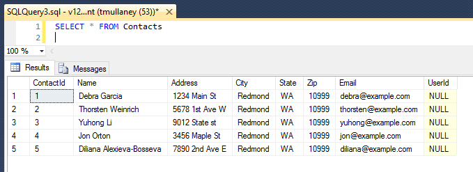

<properties
    pageTitle="Lernprogramm: Web app mit einer mit Entität Framework und Sicherheit auf Benutzerebene Zeile mit mehreren Mandanten-Datenbank"
    description="Informationen Sie zum Entwickeln einer ASP.NET MVC 5 Web app mit einem mit mehreren Mandanten SQL-Datenbank backent, Entität Framework und Sicherheit auf Benutzerebene Zeile verwenden."
  metaKeywords="azure asp.net mvc entity framework multi tenant row level security rls sql database"
    services="app-service\web"
    documentationCenter=".net"
    manager="jeffreyg"
  authors="tmullaney"/>

<tags
    ms.service="app-service-web"
    ms.workload="web"
    ms.tgt_pltfrm="na"
    ms.devlang="dotnet"
    ms.topic="article"
    ms.date="04/25/2016"
    ms.author="thmullan"/>

# <a name="tutorial-web-app-with-a-multi-tenant-database-using-entity-framework-and-row-level-security"></a>Lernprogramm: Web app mit einer mit Entität Framework und Sicherheit auf Benutzerebene Zeile mit mehreren Mandanten-Datenbank

In diesem Lernprogramm erfahren, wie eine mit mehreren Mandanten Web-app mit einem "[freigegebene Datenbank, freigegebenen Schema](https://msdn.microsoft.com/library/aa479086.aspx)" Mandanten Modell mit Entität Framework und [Sicherheit auf Benutzerebene Zeile](https://msdn.microsoft.com/library/dn765131.aspx)zu erstellen. In diesem Modell eine einzelne Datenbank enthält viele Mandanten Daten und jede Zeile in jeder Tabelle mit einer "Mandanten-ID" verknüpft ist Zeile Ebene Sicherheit Datensatzebene, ein neues Feature für SQL Azure-Datenbank wird verwendet, um zu verhindern, dass Mandanten den Zugriff auf Daten gegenseitig. Dies ist nur eine einzelne, kleine Änderung zur Anwendung erforderlich. Durch die zentrale Speicherung die Mandanten Access-Logik in der Datenbank selbst, RLS Code der Anwendung vereinfacht und reduziert das Risiko von unbeabsichtigtes Datenverlust zwischen Mandanten.

Beginnen wir mit der einfachen Contact Manager-Anwendung aus [eine ASP.NET MVP-app mit autorisierende und SQL-DB erstellen und Bereitstellen für App-Verwaltungsdienst Azure](web-sites-dotnet-deploy-aspnet-mvc-app-membership-oauth-sql-database.md). Rechts ermöglicht die Anwendung nun alle Benutzer (Mandanten), um alle Kontakte anzuzeigen:


Mit nur wenigen kleinen Änderungen werden wir Unterstützung für mehrere Mandanten hinzufügen, sodass die Benutzer können nur die Kontakte angezeigt, die sie angehören.

## <a name="step-1-add-an-interceptor-class-in-the-application-to-set-the-sessioncontext"></a>Schritt 1: Hinzufügen einer Interceptor Klasse in der Anwendung, um die SESSION_CONTEXT festlegen

Es ist eine Anwendung ändern, die wir vornehmen müssen. Da alle Anwendungsbenutzer zur Verwendung dieselbe Verbindungszeichenfolge (d. h. dieselbe SQL-Anmeldung) Datenbank herstellen, gibt es Möglichkeit zurzeit keine nach einer Richtlinie RLS wissen, welche Benutzer für filter verwenden, sollten. Dieser Ansatz ist sehr häufig in Webanwendungen, da es ermöglicht effiziente Verbindungspooling, aber dies bedeutet, dass ein anderes Verfahren zum Identifizieren des aktuellen Anwendung Benutzers innerhalb der Datenbank benötigt. Die Lösung ist, damit die Anwendung legen Sie ein paar Schlüsselwert für die aktuelle Benutzer-ID in der [SESSION_CONTEXT](https://msdn.microsoft.com/library/mt590806) unmittelbar nach dem Öffnen einer Verbindungs aus, bevor sie eine beliebige Abfragen ausgeführt wird. SESSION_CONTEXT ist eine Sitzung ausgelegte Schlüsselwert Store und unsere RLS-Richtlinien werden die darin gespeicherte Benutzer-ID verwenden, um den aktuellen Benutzer zu identifizieren.

Wir fügen Sie einen [Interceptor](https://msdn.microsoft.com/data/dn469464.aspx) (insbesondere ein [DbConnectionInterceptor](https://msdn.microsoft.com/library/system.data.entity.infrastructure.interception.idbconnectioninterceptor)), wird ein neues Feature Framework (EF) 6, in Entität festlegen automatisch die aktuelle Benutzer-ID in der SESSION_CONTEXT durch eine T-SQL-Anweisung ausführen, sobald EF eine Verbindung geöffnet wird.

1.  Öffnen Sie das Projekt ContactManager in Visual Studio.
2.  Mit der rechten Maustaste auf den Ordner Modelle Explorer Lösung, und wählen Sie hinzufügen > Class.
3.  Benennen Sie die neue Klasse "SessionContextInterceptor.cs", und klicken Sie auf Hinzufügen.
4.  Ersetzen Sie den Inhalt der SessionContextInterceptor.cs mit den folgenden Code ein.

```
using System;
using System.Collections.Generic;
using System.Linq;
using System.Web;
using System.Data.Common;
using System.Data.Entity;
using System.Data.Entity.Infrastructure.Interception;
using Microsoft.AspNet.Identity;

namespace ContactManager.Models
{
    public class SessionContextInterceptor : IDbConnectionInterceptor
    {
        public void Opened(DbConnection connection, DbConnectionInterceptionContext interceptionContext)
        {
            // Set SESSION_CONTEXT to current UserId whenever EF opens a connection
            try
            {
                var userId = System.Web.HttpContext.Current.User.Identity.GetUserId();
                if (userId != null)
                {
                    DbCommand cmd = connection.CreateCommand();
                    cmd.CommandText = "EXEC sp_set_session_context @key=N'UserId', @value=@UserId";
                    DbParameter param = cmd.CreateParameter();
                    param.ParameterName = "@UserId";
                    param.Value = userId;
                    cmd.Parameters.Add(param);
                    cmd.ExecuteNonQuery();
                }
            }
            catch (System.NullReferenceException)
            {
                // If no user is logged in, leave SESSION_CONTEXT null (all rows will be filtered)
            }
        }
        
        public void Opening(DbConnection connection, DbConnectionInterceptionContext interceptionContext)
        {
        }

        public void BeganTransaction(DbConnection connection, BeginTransactionInterceptionContext interceptionContext)
        {
        }

        public void BeginningTransaction(DbConnection connection, BeginTransactionInterceptionContext interceptionContext)
        {
        }

        public void Closed(DbConnection connection, DbConnectionInterceptionContext interceptionContext)
        {
        }

        public void Closing(DbConnection connection, DbConnectionInterceptionContext interceptionContext)
        {
        }

        public void ConnectionStringGetting(DbConnection connection, DbConnectionInterceptionContext<string> interceptionContext)
        {
        }

        public void ConnectionStringGot(DbConnection connection, DbConnectionInterceptionContext<string> interceptionContext)
        {
        }

        public void ConnectionStringSet(DbConnection connection, DbConnectionPropertyInterceptionContext<string> interceptionContext)
        {
        }

        public void ConnectionStringSetting(DbConnection connection, DbConnectionPropertyInterceptionContext<string> interceptionContext)
        {
        }

        public void ConnectionTimeoutGetting(DbConnection connection, DbConnectionInterceptionContext<int> interceptionContext)
        {
        }

        public void ConnectionTimeoutGot(DbConnection connection, DbConnectionInterceptionContext<int> interceptionContext)
        {
        }

        public void DataSourceGetting(DbConnection connection, DbConnectionInterceptionContext<string> interceptionContext)
        {
        }

        public void DataSourceGot(DbConnection connection, DbConnectionInterceptionContext<string> interceptionContext)
        {
        }

        public void DatabaseGetting(DbConnection connection, DbConnectionInterceptionContext<string> interceptionContext)
        {
        }

        public void DatabaseGot(DbConnection connection, DbConnectionInterceptionContext<string> interceptionContext)
        {
        }

        public void Disposed(DbConnection connection, DbConnectionInterceptionContext interceptionContext)
        {
        }

        public void Disposing(DbConnection connection, DbConnectionInterceptionContext interceptionContext)
        {
        }

        public void EnlistedTransaction(DbConnection connection, EnlistTransactionInterceptionContext interceptionContext)
        {
        }

        public void EnlistingTransaction(DbConnection connection, EnlistTransactionInterceptionContext interceptionContext)
        {
        }

        public void ServerVersionGetting(DbConnection connection, DbConnectionInterceptionContext<string> interceptionContext)
        {
        }

        public void ServerVersionGot(DbConnection connection, DbConnectionInterceptionContext<string> interceptionContext)
        {
        }

        public void StateGetting(DbConnection connection, DbConnectionInterceptionContext<System.Data.ConnectionState> interceptionContext)
        {
        }

        public void StateGot(DbConnection connection, DbConnectionInterceptionContext<System.Data.ConnectionState> interceptionContext)
        {
        }
    }

    public class SessionContextConfiguration : DbConfiguration
    {
        public SessionContextConfiguration()
        {
            AddInterceptor(new SessionContextInterceptor());
        }
    }
}
```

Dies ist der einzige Anwendung Änderung erforderlich. Fortfahren Sie und erstellen Sie und veröffentlichen Sie die Anwendung.

## <a name="step-2-add-a-userid-column-to-the-database-schema"></a>Schritt 2: Hinzufügen einer Benutzer-ID-Spalteninhalts mit dem Datenbankschema

Als Nächstes müssen wir hinzufügen eine Benutzer-ID-Spalte der Tabelle "Kontakte", jede Zeile mit einem Benutzer (Mandant) zugeordnet werden soll. Wir werden das Schema direkt in die Datenbank ändern, damit wir nicht dieses Feld in unseren EF Datenmodell einbezogen werden sollen.

Herstellen einer Verbindung mit der Datenbank direkt mit SQL Server Management Studio oder Visual Studio, und klicken Sie dann führen Sie die folgende T-SQL-Anweisung aus:

```
ALTER TABLE Contacts ADD UserId nvarchar(128)
    DEFAULT CAST(SESSION_CONTEXT(N'UserId') AS nvarchar(128))
```

Hierdurch werden eine Benutzer-ID-Spalte der Tabelle Kontakte hinzugefügt. Wir verwenden den Datentyp nvarchar(128) aus, um die Benutzer-IDs in der Tabelle AspNetUsers gespeicherten entsprechen, und erstellen wir eine DEFAULT-Einschränkung, die automatisch festgelegt werden die Benutzer-ID für neu eingefügten Zeilen angewendet werden, werden die Benutzer-ID, die derzeit in SESSION_CONTEXT gespeichert wird.

Nun sieht die Tabelle wie folgt aus:



Wenn Sie neue Kontakte erstellt werden, werden sie automatisch die richtige Benutzer-ID zugewiesen werden. Aus Gründen der Demo jedoch uns zuweisen nur einige dieser vorhandene Kontakte mit einem vorhandenen Benutzer.

Wenn Sie einige Benutzer in der Anwendung bereits erstellt haben (z. B. mithilfe der lokalen, Google oder Facebook Konten), sehen sie in der Tabelle AspNetUsers. In den folgenden Screenshot ist es nur ein Benutzer bisher.


Kopieren Sie die Id für user1@contoso.com, und fügen Sie ihn in die folgenden T-SQL-Anweisung. Führen Sie diese Anweisung um drei der Kontakte diese Benutzer-ID zuzuordnen.

```
UPDATE Contacts SET UserId = '19bc9b0d-28dd-4510-bd5e-d6b6d445f511'
WHERE ContactId IN (1, 2, 5)
```

## <a name="step-3-create-a-row-level-security-policy-in-the-database"></a>Schritt 3: Erstellen einer Richtlinie für die Sicherheit auf Benutzerebene Zeile in der Datenbank

Der letzte Schritt besteht im Erstellen einer Sicherheitsrichtlinie, die die Benutzer-ID in SESSION_CONTEXT verwendet, um die Ergebnisse von Abfragen zurückgegeben werden automatisch zu filtern.

Während Sie immer noch in der Datenbank verbunden sind, führen Sie folgende T-SQL-Anweisung aus:

```
CREATE SCHEMA Security
go

CREATE FUNCTION Security.userAccessPredicate(@UserId nvarchar(128))
    RETURNS TABLE
    WITH SCHEMABINDING
AS
    RETURN SELECT 1 AS accessResult
    WHERE @UserId = CAST(SESSION_CONTEXT(N'UserId') AS nvarchar(128))
go

CREATE SECURITY POLICY Security.userSecurityPolicy
    ADD FILTER PREDICATE Security.userAccessPredicate(UserId) ON dbo.Contacts,
    ADD BLOCK PREDICATE Security.userAccessPredicate(UserId) ON dbo.Contacts
go

```

Dieser Code führt die drei Punkte. Zunächst wird ein neues Schema als bewährte Methode für zentrale und Einschränken des Zugriffs auf die Objekte RLS erstellt. Als Nächstes erstellt es eine Prädikatfunktion, die "1" zurückgibt, wenn die Benutzer-ID in einer Zeile die Benutzer-ID in SESSION_CONTEXT entspricht. Es erstellt dann eine Sicherheitsrichtlinie, mit dem diese Funktion als ein Filter und die blockieren Prädikat der Tabelle "Kontakte" hinzufügen. Bewirkt, dass das Filterprädikat Abfragen nur Zeilen zurückgeben, die für den aktuellen Benutzer gehören, und das Blockieren Prädikat fungiert, zur Sicherheit zu verhindern, dass die Anwendung jemals versehentlich eine Zeile für den falschen Benutzer einfügen.

Jetzt führen Sie die Anwendung, und melden Sie sich als user1@contoso.com. Nun sieht dieser Benutzer nur die Kontakte, die wir zuvor auf diese Benutzer-ID zugewiesen:


Um dies zu weiteren überprüfen, versuchen Sie, einen neuen Benutzer registrieren. Keine Kontakte wird angezeigt, da keine zu zugewiesen wurden. Wenn sie einen neuen Kontakt erstellen, wird Ihnen zugewiesen, und nur diese werden in der Lage, diese Informationen sehen.

## <a name="next-steps"></a>Nächste Schritte

Das war's schon! Die einfache Contact Manager Web app wurde in einem mit mehreren Mandanten eine konvertiert, bei denen jeden Benutzer einen eigenen Kontaktliste enthalten ist. Mithilfe von Sicherheit auf Benutzerebene Zeile haben wir die Komplexität des Mandanten Access-Logik in unsere Anwendungscode erzwingen vermieden. Diese Transparenz ermöglicht der Anwendung, die auf der geschäftlichen Problem zur hand konzentrieren, und es reduziert außerdem das Risiko von Verluste im versehentlich Daten, wie die Anwendung der Codebasis vergrößert wird.

In diesem Lernprogramm hat nur oberflächlich was RLS möglich ist. Beispielsweise kann ausgefeilter haben oder Logik präzise zugreifen und es möglich, die mehr als nur die aktuelle Benutzer-ID in der SESSION_CONTEXT gespeichert ist. Kann auch zur [Integration RLS mit der Datenbank flexible Tools Client-Bibliotheken](../sql-database/sql-database-elastic-tools-multi-tenant-row-level-security.md) mit mehreren Mandanten mehrere Shards hinweg in einer Skalierung Datenebene unterstützen.

Über diese Optionen arbeiten wir auch daran um RLS noch besser zu gestalten. Wenn Sie alle Fragen, Ideen, oder Dinge, die Sie anzeigen möchten, informieren Sie uns in den Kommentaren. Vielen Dank für Ihr Feedback!
