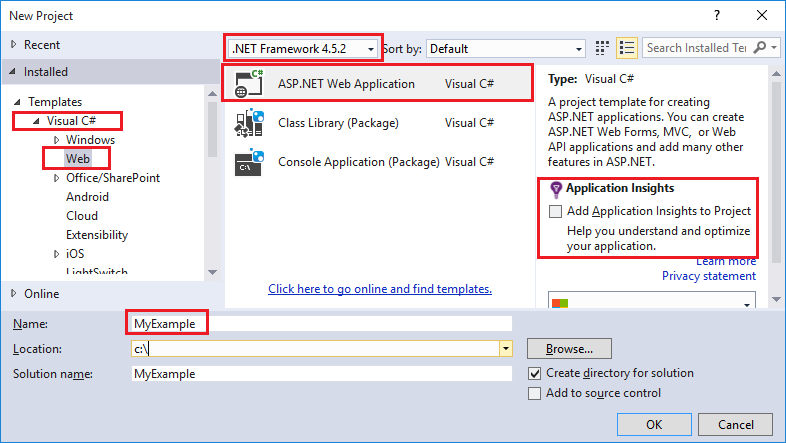
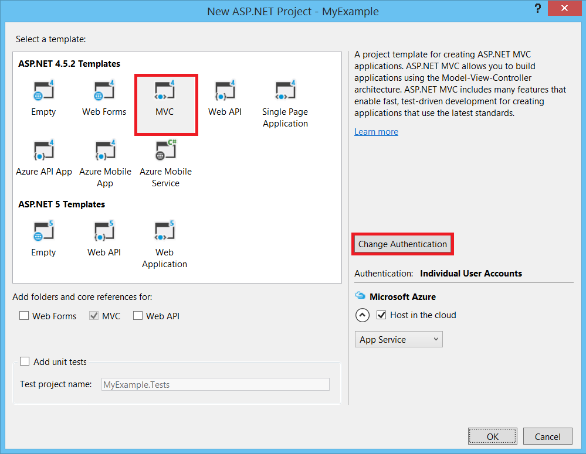

<properties
    pageTitle="Bereitstellen einer ASP.NET-app zu Azure-App-Diensts mithilfe des Visual Studio | Microsoft Azure"
    description="Erfahren Sie, wie ein ASP.NET Web-Projekt auf eine neue Web-app in Azure-App-Dienst, mit Visual Studio bereitstellen."
    services="app-service\web"
    documentationCenter=".net"
    authors="tdykstra"
    manager="wpickett"
    editor=""/>

<tags
    ms.service="app-service-web"
    ms.workload="web"
    ms.tgt_pltfrm="na"
    ms.devlang="dotnet"
    ms.topic="get-started-article"
    ms.date="07/22/2016"
    ms.author="rachelap"/>

# Bereitstellen einer ASP.NET Web app Azure-App-Dienst, mit Visual Studio

[AZURE.INCLUDE [tabs](../../includes/app-service-web-get-started-nav-tabs.md)]

## (Übersicht)

In diesem Lernprogramm erfahren, wie Sie eine ASP.NET Web-Anwendung zu einer [Web app im App-Verwaltungsdienst Azure](app-service-web-overview.md) mithilfe von Visual Studio 2015 bereitstellen.

Das Lernprogramm wird davon ausgegangen, dass Sie eine ASP.NET Developer befinden, keine Erfahrung hat mit Azure verwenden. Wenn Sie fertig sind, müssen Sie eine einfache Webanwendung nach oben und in der Cloud ausgeführt werden.

Lernen Sie:

* Wie Sie eine neue App-Dienst Web app erstellen, während Sie ein neues Webprojekt in Visual Studio erstellen.
* Informationen zum Bereitstellen eines Projekts in einer App-Dienst Web app mit Visual Studio.

Das Diagramm zeigt an, was Sie das Lernprogramm führen.

Am Ende des Lernprogramms bietet ein Abschnitt [Problembehandlung](#troubleshooting) Ideen, was zu tun ist, wenn Sie etwas funktioniert nicht, und ein [Weitere Schritte](#next-steps) Abschnitt enthält Links zu anderen Lernprogramme, die in Informationen zum Verwenden des App-Verwaltungsdienst Azure genauer zu wechseln.

Wie folgt ein Lernprogramm Erste Schritte ist, ist das Webprojekt, das es wird gezeigt, wie bereitstellen eine einfache, die eine Datenbank verwendet wird nicht, und führen Sie keine Authentifizierung oder Autorisierung aus. Links zu Themen, erweiterte Bereitstellung finden Sie unter [Gewusst wie: Bereitstellen eine Azure Web app](web-sites-deploy.md).

Abgesehen von den Zeitaufwand, das Azure SDK für .NET zu installieren dauert dieses Lernprogramms ungefähr 10 bis 15 Minuten.

## Erforderliche Komponenten

* Das Lernprogramm wird davon ausgegangen, dass Sie mit ASP.NET-MVC und Visual Studio gearbeitet haben. Wenn Sie eine Einleitung benötigen, finden Sie unter [Erste Schritte mit ASP.NET MVC 5](http://www.asp.net/mvc/overview/getting-started/introduction/getting-started).

* Sie benötigen ein Azure-Konto. Sie können [ein kostenloses Azure-Konto öffnen](/pricing/free-trial/?WT.mc_id=A261C142F) oder [Vorteile für Abonnenten Visual Studio aktivieren](/pricing/member-offers/msdn-benefits-details/?WT.mc_id=A261C142F). 

    Wenn Sie mit Azure-App-Verwaltungsdienst anzufangen, bevor Sie für ein Azure-Konto anmelden möchten, wechseln Sie zu [App-Verwaltungsdienst versuchen](http://go.microsoft.com/fwlink/?LinkId=523751). Sie können es eine kurzlebige Starter-app erstellen, in der App-Dienst – keine Kreditkarte erforderlich, und keine Zusagen.

## Einrichten der Entwicklungsumgebung

Das Lernprogramm wird für Visual Studio 2015 mit [Azure SDK für .NET](../dotnet-sdk.md) 2,9 oder höher geschrieben. 

* [Laden Sie die neuesten Azure SDK für Visual Studio 2015](http://go.microsoft.com/fwlink/?linkid=518003). Das SDK installiert Visual Studio 2015 aus, wenn Sie noch nicht vorhanden ist.

    >[AZURE.NOTE] Je nachdem, wie viele der Abhängigkeiten SDK auf Ihrem Computer bereits könnte ein Installieren des SDK langem aus eine halbe Stunde oder mehrere mehrere Minuten dauern.

Wenn Sie Visual Studio 2013 haben und dieses verwenden möchten, können Sie [die neuesten Azure SDK für Visual Studio 2013 herunterladen](http://go.microsoft.com/fwlink/?LinkID=324322). Einige Bildschirme werden aus der Illustrationen anders angezeigt.

## Konfigurieren eines neuen Webprojekts

Im nächste Schritt besteht im Erstellen eines Projekts in Visual Studio und eine Web-app in Azure-App-Dienst. In diesem Abschnitt des Lernprogramms konfigurieren Sie das Webprojekt aus. 

1. Öffnen Sie Visual Studio 2015.

2. Klicken Sie auf **Datei > Neu > Projekt**.

3. Klicken Sie im Dialogfeld **Neues Projekt** auf **C#-> Web > ASP.NET Web-Anwendung**.

3. Stellen Sie sicher, dass **.NET Framework 4.5.2** als die Ziel-Framework aktiviert ist.

4.  [Die Anwendung Einsichten Azure](../application-insights/app-insights-overview.md) überwacht Web app für Verfügbarkeit, Leistung und Verwendung. Das Kontrollkästchen **Hinzufügen Anwendung Einsichten zu Projekt** ist durch Standard das erste Mal aktiviert ein Webprojekt nach der Installation von Visual Studio zu erstellen. Deaktivieren Sie das Kontrollkästchen, wenn es ausgewählt ist, aber Sie nicht die Anwendung Einsichten ausprobieren möchten.

4. Nennen Sie die Anwendung **EIGENESBEISPIEL**, und klicken Sie dann auf **OK**.

    

5. Klicken Sie im Dialogfeld **Neues Projekt von ASP.NET** wählen Sie **MVC** -Vorlage aus, und klicken Sie dann auf **Authentifizierung ändern**.

    In diesem Lernprogramm stellen Sie eine Web ASP.NET-MVC-Projekt bereit. Wenn Sie erfahren, wie ein Projekt ASP.NET Web API bereitstellen möchten, finden Sie im Abschnitt [Weitere Schritte](#next-steps) . 

    

6. Führen Sie im Dialogfeld **Authentifizierung ändern** klicken Sie auf **Keine Authentifizierung**, und klicken Sie dann auf **OK**.

    

    In diesem Lernprogramm Erste Schritte sind Sie eine einfache app bereitstellen, die Benutzer anmelden kann nicht.

5. Im Dialogfeld **Neues Projekt von ASP.NET** im Abschnitt **Microsoft Azure** Vergewissern Sie sich, dass **in der Cloud zu hosten** ausgewählt ist, dass die **App-Dienst** in der Dropdown-Liste ausgewählt ist.

    

    Diese Einstellungen direkte Visual Studio für eine Azure Web-app für ein Webprojekt erstellen.

6. Klicken Sie auf **OK**

## Konfigurieren von Azure Ressourcen für eine neue Web app

Informieren Sie jetzt Visual Studio, über die Azure Ressourcen, die Sie erstellen möchten.

5. Klicken Sie auf **Konto hinzufügen**, und melden Sie sich in Azure mit dem-ID und das Kennwort für das Konto, das Sie verwenden, um Ihr Azure-Abonnement zu verwalten, klicken Sie im Dialogfeld **App-Verwaltungsdienst erstellen** .

    

    Wenn Sie bereits zuvor auf dem gleichen Computer angemeldet, möglicherweise nicht die Schaltfläche **Hinzufügen eines Kontos** angezeigt. In diesem Fall können Sie diesen Schritt überspringen, oder Sie müssen Ihre Anmeldeinformationen erneut.
 
3. Geben Sie einen **Web App-Name** , der in der Domäne *azurewebsites.net* eindeutig ist. Beispielsweise können Sie es EIGENESBEISPIEL mit Zahlen nach rechts, um es eindeutig sein, beispielsweise MyExample810 Stellen benennen. Wenn Sie ein Standard-Web-Namen für Sie erstellt wurde, wird eindeutig sein und können, die.

    Wenn Person bereits den Namen, den Sie eingeben verwendet, ein rotes Ausrufezeichen rechts anstelle von einem grünen Häkchen angezeigt, und Sie müssen einen anderen Namen eingeben.

    Die URL für eine Anwendung wird dieser Name plus *. azurewebsites.net*. Beispielsweise ist der Name `MyExample810`, ist die URL `myexample810.azurewebsites.net`.

    Sie können auch eine benutzerdefinierte Domäne mit einer Azure Web app verwenden. Weitere Informationen finden Sie unter [Konfigurieren eines benutzerdefinierten Domänennamens in Azure-App-Dienst](web-sites-custom-domain-name.md).

6. Klicken Sie auf die **neue** Schaltfläche neben dem Feld **Ressourcengruppe** , und klicken Sie dann geben Sie ein "EIGENESBEISPIEL" oder einen anderen Namen, wenn Sie es vorziehen. 

    

    Eine Ressourcengruppe ist eine Sammlung von Azure Ressourcen wie Web apps, Datenbanken und virtuellen Computern an. Ein Lernprogramm empfiehlt es sich in der Regel eine neue Ressourcengruppe zu erstellen, da können sie leicht Azure Ressourcen in einem Schritt löschen, die Sie für das Lernprogramm erstellen. Weitere Informationen finden Sie unter [Übersicht Azure Ressourcenmanager](../azure-resource-manager/resource-group-overview.md).

4. Klicken Sie auf die Schaltfläche " **neu** " neben der Dropdownliste **App Dienst planen** .

    

    Das Dialogfeld **Konfigurieren planen App Service** wird angezeigt.

    

    In den folgenden Schritten konfigurieren Sie eine App Serviceplan für die neue Ressourcengruppe ein. Eine App Serviceplan gibt den berechnen Ressourcen, die Web app ausgeführt wird, klicken Sie auf an. Beispielsweise, wenn Sie die kostenlose Ebene auswählen, während der Ausführung der app API auf freigegebenen virtuellen Computern, für einige kostenpflichtigen Ebenen, die sie auf dedizierten virtuellen Computern ausgeführt wird. Weitere Informationen finden Sie unter [Übersicht über die App-Service-Pläne](../app-service/azure-web-sites-web-hosting-plans-in-depth-overview.md).

5. Geben Sie im Dialogfeld **Konfigurieren der App Dienst planen** Wenn Sie lieber "MyExamplePlan" oder einen anderen Namen.

5. Wählen Sie in der Dropdown-Liste **Speicherort** den Speicherort aus, der Ihnen am nächsten ist.

    Diese Einstellung gibt an, welche Azure Datacenter Ihre app ausgeführt wird. In diesem Lernprogramm können Sie eine beliebige Region auswählen, und es wird keinen auffällig Unterschied machen. Aber, dass für eine app Herstellung den Server so nah wie möglich an die Clients sein, die darauf, um [Wartezeit](http://www.bing.com/search?q=web%20latency%20introduction&qs=n&form=QBRE&pq=web%20latency%20introduction&sc=1-24&sp=-1&sk=&cvid=eefff99dfc864d25a75a83740f1e0090)minimieren zugreifen.

5. Klicken Sie in der Dropdownliste **Größe** auf **frei**.

    In diesem Lernprogramm wird die kostenlose Preisgestaltung Ebene gut genug Performance bieten.

6. Klicken Sie im Dialogfeld **Konfigurieren planen App Service** klicken Sie auf **OK**.

7. Klicken Sie im Dialogfeld **App-Verwaltungsdienst erstellen** auf **Erstellen**.

## Visual Studio erstellt die Projekt und Web app

Visual Studio erstellt in kurzer Zeit, in der Regel weniger als einer Minute der Project Web und der Web app an.  

**Solution Explorer** -Fenster zeigt die Dateien und Ordner in das neue Projekt ein.

Das Fenster **Azure App Dienst Aktivität** zeigt, dass das Web-app erstellt wurde.

**Cloud-Explorer** -Fenster können Sie die anzeigen und Verwalten von Azure Ressourcen, einschließlich der neuen Web-app, die Sie soeben erstellt haben.

    
## Bereitstellen der Project Web zu Azure Web app

In diesem Abschnitt bereitgestellt der Project Web für das Web app.

1. **Lösung-Explorer**mit der rechten Maustaste in des Projekts, und wählen Sie **Veröffentlichen**.

    

    In ein paar Sekunden wird im **Web veröffentlichen** -Assistenten. Der Assistent öffnet ein *Profil veröffentlichen* , die Einstellungen für die Bereitstellung von der Project Web zu neuen Web app hat.

    Veröffentlichungsprofil enthält einen Benutzernamen und ein Kennwort für die Bereitstellung.  Diese Anmeldeinformationen für Sie generiert wurden, und Sie müssen nicht diese eingeben. Das Kennwort verschlüsselt ist, in einer ausgeblendeten benutzerspezifische Datei in die `Properties\PublishProfiles` Ordner.
 
8. Klicken Sie auf der Registerkarte **Verbindung** des **Web veröffentlichen** -Assistenten auf **Weiter**.

    

    Als Nächstes wird die Registerkarte **Einstellungen** aus. Hier können Sie auf die Generator-Konfiguration, um einen Build Debuggen für das [Debuggen Remoteprozeduraufruf](../app-service-web/web-sites-dotnet-troubleshoot-visual-studio.md#remotedebug)bereitstellen ändern. Die Registerkarte enthält außerdem [Dateioptionen veröffentlichen](https://msdn.microsoft.com/library/dd465337.aspx#Anchor_2).

10. Klicken Sie auf der Registerkarte **Einstellungen** auf **Weiter**.

    

    Die Registerkarte **Vorschau** geht's weiter. Hier haben Sie die Möglichkeit, finden Sie unter Was Dateien abgelegt werden aus Ihrem Projekt in der app API kopiert werden. Wenn Sie ein Projekt für eine app API, die Sie bereits Bereitstellen in einer früheren Version bereitgestellt, werden nur die geänderte Dateien kopiert. Wenn eine Liste der was kopiert werden soll, können Sie die Schaltfläche **Start Vorschau** klicken.

11. Klicken Sie auf der Registerkarte **Vorschau** auf **Veröffentlichen**.

    

    Wenn Sie **Veröffentlichen**klicken, beginnt Visual Studio die Vorgehensweise zum Kopieren der Dateien auf dem Server Azure. Dies kann eine oder zwei Minuten dauern.

    Die **Ausgabe** und **Azure App Dienst Aktivität** Fenster anzeigen, welche Aktionen für die Bereitstellung ausgeführt wurden und melden erfolgreichen Abschluss der Bereitstellung.

    

    Nach der erfolgreichen Bereitstellung der Standardbrowser automatisch geöffnet wird, die URL des bereitgestellten Web app und die Anwendung, die Sie erstellt haben, wird jetzt in der Cloud ausgeführt. Die URL in der Adressleiste des Browsers zeigt, dass das Web-app aus dem Internet geladen wird.

    

    > [AZURE.TIP]Sie können die Symbolleiste **Web eine klicken Sie auf Veröffentlichen** für eine schnelle Installation aktivieren. Klicken Sie auf **Ansicht > Symbolleisten**, und wählen Sie dann auf **Web eine klicken Sie auf Veröffentlichen**. Verwenden Sie die Symbolleiste, wählen ein Profil, klicken Sie auf eine Schaltfläche Veröffentlichen oder klicken Sie auf eine Schaltfläche zum Öffnen des Assistenten **Web veröffentlichen** .
    > 

## Behandlung von Problemen

Wenn Sie ein Problem auftreten, während Sie in diesem Lernprogramm durchgehen, stellen Sie sicher, dass Sie die neueste Version des Azure SDK für .NET verwenden. Die einfachste Möglichkeit zum erledigen ist [Der Azure SDK für Visual Studio 2015](http://go.microsoft.com/fwlink/?linkid=518003)herunterladen. Wenn Sie die aktuelle Version installiert haben, können die Web Platform Installer Sie wissen, dass keine Installation erforderlich ist.

Wenn Sie mit einem Unternehmensnetzwerk verbunden sind, und versuchen, über eine Firewall Azure App Dienst bereitstellen, stellen Sie sicher, dass die Ports 443 und 8172 für Web bereitstellen geöffnet sind. Wenn Sie diese Ports öffnen können, finden Sie unter den folgenden nächsten Schritte Abschnitt für andere Bereitstellungsoptionen.

Nachdem Sie Ihre ASP.NET Web app im App-Verwaltungsdienst Azure ausgeführt haben, sollten Sie weitere Informationen zu Visual Studio-Features, die Problembehandlung zu vereinfachen. Informationen zur Protokollierung remote Debuggen und vieles mehr, finden Sie unter [Problembehandlung Azure Web apps in Visual Studio](web-sites-dotnet-troubleshoot-visual-studio.md).

## Nächste Schritte

In diesem Lernprogramm haben Sie erfahren, wie zum Erstellen einer einfachen Webanwendung und auf einer Azure Web app bereitstellen können. Hier sind einige der verwandten Themen und Ressourcen für mehr über das App-Verwaltungsdienst Azure aus:

* Überwachen und Verwalten von Web app im [Azure-Portal](https://portal.azure.com/). 

    Weitere Informationen finden Sie unter [Übersicht über die Azure-Portal](/services/management-portal/) und [Konfigurieren Web apps in Azure-App-Dienst](web-sites-configure.md).

* Bereitstellen von einem vorhandenen Webprojekt für eine neue Web-app, die mit Visual Studio

    Mit der rechten Maustaste im Projekts im **Solution Explorer**, und klicken Sie dann auf **Veröffentlichen**. Wählen Sie **Microsoft Azure-App-Verwaltungsdienst** als Veröffentlichungsziel aus, und klicken Sie dann auf **neu**. Die Dialogfelder sind in diesem Lernprogramm gesehen identisch.

* Bereitstellen eines Projekts aus Datenquellen-Steuerelement

    Informationen zur [Automatisierung der Bereitstellung](http://www.asp.net/aspnet/overview/developing-apps-with-windows-azure/building-real-world-cloud-apps-with-windows-azure/continuous-integration-and-continuous-delivery) von einer [Quelle Steuerelement System](http://www.asp.net/aspnet/overview/developing-apps-with-windows-azure/building-real-world-cloud-apps-with-windows-azure/source-control)finden Sie unter [Erste Schritte mit Web apps in Azure-App-Dienst](app-service-web-get-started.md) und [zum Bereitstellen von einer Azure Web app](web-sites-deploy.md).

* Bereitstellen einer ASP.NET-Webseite API mit einer API Azure App-Verwaltungsdienst

    Sie haben erfahren, wie Sie eine Instanz der App-Verwaltungsdienst Azure erstellen, die hauptsächlich für eine Website gehostet vorgesehen ist. App-Dienst bietet auch Features für das Web-APIs hosten, wie CORS unterstützt und API-Metadaten-Unterstützung für Client-Code generieren. Können Sie API-Funktionen in einer Web app verwenden, aber wenn Sie hauptsächlich eine API in eine Instanz des App-Diensts hosten möchten, wäre **API app** besser geeignet. Weitere Informationen finden Sie unter [Erste Schritte mit Apps API und ASP.NET in Azure-App-Dienst](../app-service-api/app-service-api-dotnet-get-started.md). 

* Hinzufügen eines benutzerdefinierten Domänennamen und SSL

    Informationen zur Verwendung von SSL und eine eigene Domäne (beispielsweise www.contoso.com statt contoso.azurewebsites.net) verwenden finden Sie unter den folgenden Ressourcen:

    * [Konfigurieren Sie einen benutzerdefinierten Domänennamen in Azure-App-Verwaltungsdienst](web-sites-custom-domain-name.md)
    * [Aktivieren Sie HTTPS für eine Azure-Website.](web-sites-configure-ssl-certificate.md)

* Löschen Sie die Ressourcengruppe aus, die Web app und alle zugehörigen Azure Ressourcen enthält, wenn Sie mit ihnen fertig sind.

    Informationen zum Arbeiten mit Ressourcen Azure-Portal finden Sie unter [Bereitstellen von Ressourcen mit Ressourcenmanager Vorlagen und Azure-Portal](../resource-group-template-deploy-portal.md).   

*   Weitere Beispiele für das Erstellen einer ASP.NET Web App im App-Dienst, finden Sie unter [Erstellen und Bereitstellen einer ASP.NET Web-app in Azure-App-Verwaltungsdienst](https://github.com/Microsoft/HealthClinic.biz/wiki/Create-and-deploy-an-ASP.NET-web-app-in-Azure-App-Service) und [Erstellen und Bereitstellen einer mobile app im App-Verwaltungsdienst Azure](https://github.com/Microsoft/HealthClinic.biz/wiki/Create-and-deploy-a-mobile-app-in-Azure-App-Service) aus [HealthClinic.biz](https://github.com/Microsoft/HealthClinic.biz) 2015 verbinden [Demo](https://blogs.msdn.microsoft.com/visualstudio/2015/12/08/connectdemos-2015-healthclinic-biz/). Weitere Schnellstart aus HealthClinic.biz anschauen finden Sie unter [Azure Developer Tools Schnellstart](https://github.com/Microsoft/HealthClinic.biz/wiki/Azure-Developer-Tools-Quickstarts).
