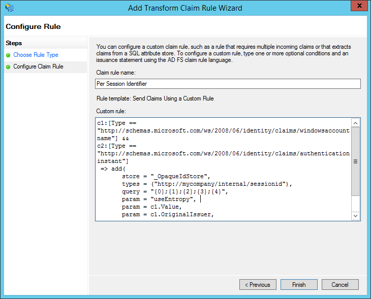
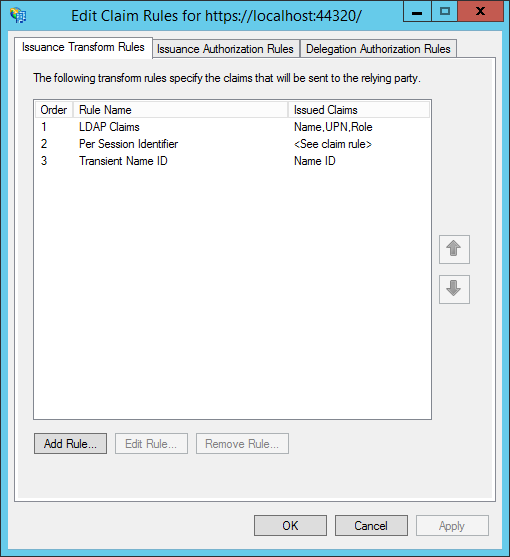
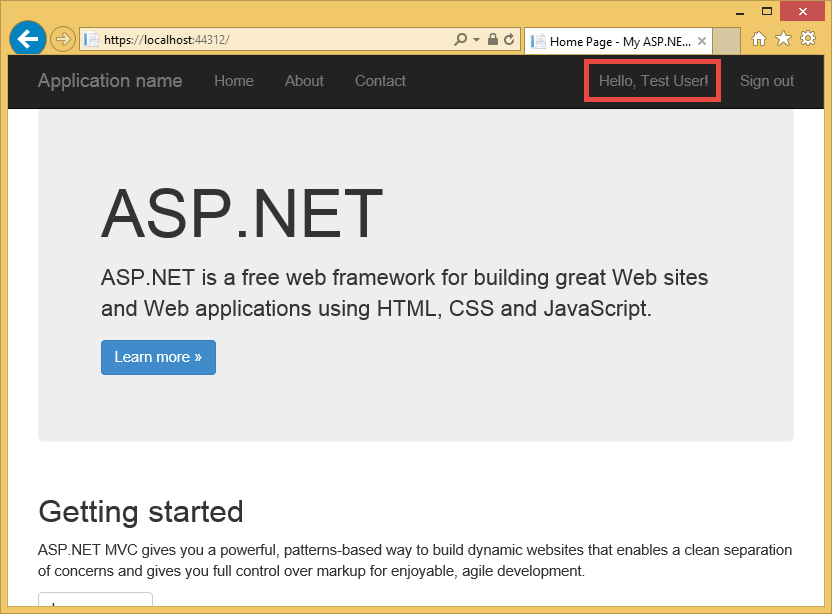
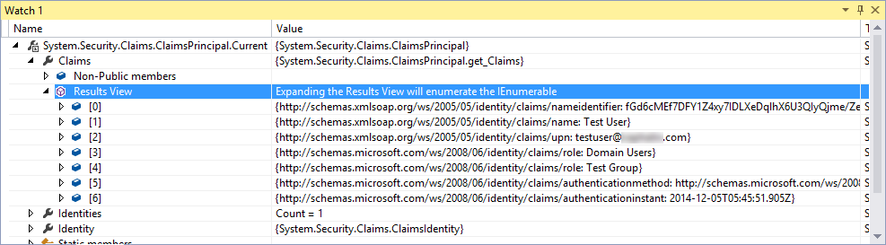

<properties 
    pageTitle="Erstellen Sie eine Azure Line-of-Business-app mit AD FS-Authentifizierung | Microsoft Azure" 
    description="Informationen Sie zum Erstellen einer Line-of-Business-app in Azure App-Dienst, der authentifiziert mit lokal STS. In diesem Lernprogramm richtet sich AD FS als der STS lokal an." 
    services="app-service\web" 
    documentationCenter=".net" 
    authors="cephalin" 
    manager="wpickett" 
    editor=""/>

<tags 
    ms.service="app-service-web" 
    ms.devlang="dotnet" 
    ms.topic="article" 
    ms.tgt_pltfrm="na" 
    ms.workload="web" 
    ms.date="08/31/2016" 
    ms.author="cephalin"/>

# Erstellen Sie eine Azure Line-of-Business-app mit AD FS-Authentifizierung

In diesem Artikel wird gezeigt, wie zum Erstellen einer ASP.NET-MVC-Anwendung Branchen in [Azure-App-Verwaltungsdienst](../app-service/app-service-value-prop-what-is.md) mit einer lokalen [Active Directory Federation Services](http://technet.microsoft.com/library/hh831502.aspx) als Identitätsanbieter. Dieses Szenario kann arbeiten, wenn Sie Zeile branchenanwendungen in Azure-App-Verwaltungsdienst erstellen möchten, jedoch Ihrer Organisation erfordert Directory Daten vor Ort gespeichert werden.

>[AZURE.NOTE] Eine Übersicht der verschiedenen Enterprise Authentifizierung und Autorisierung Optionen für App-Verwaltungsdienst Azure finden Sie unter [Authentifizieren mit lokalen Active Directory in Ihrer Azure-app](web-sites-authentication-authorization.md).

## Was werden Sie erstellen ##

Erstellen Sie eine einfache ASP.NET-Anwendung in Azure App Dienst Web Apps mit den folgenden Features:

- Authentifiziert Benutzer mit AD FS
- Verwendet `[Authorize]` für Benutzerberechtigungen für verschiedene Aktionen
- Statische Konfiguration für Debuggen in Visual Studio und Veröffentlichen auf App-Dienst Web Apps (einmal konfigurieren, Debuggen und jederzeit veröffentlichen)  

## Was Sie benötigen ##

[AZURE.INCLUDE [free-trial-note](../../includes/free-trial-note.md)]

Sie benötigen die folgenden zum Bearbeiten dieses Lernprogramms:

- Klicken Sie auf eine lokale AD FS-Bereitstellung (eine End-to-End-exemplarische des Testlabors in diesem Lernprogramm verwendet, finden Sie unter [Übung testen: eigenständigen STS mit AD FS Azure-virtuellen Computer (nur für Test)](https://blogs.msdn.microsoft.com/cephalin/2014/12/21/test-lab-standalone-sts-with-ad-fs-in-azure-vm-for-test-only/))
- Berechtigungen zum Erstellen von verlassen party Vertrauensstellungen in AD FS-Verwaltung
- Update für Visual Studio 2013 4 oder höher
- [Azure SDK 2.8.1](http://go.microsoft.com/fwlink/p/?linkid=323510&clcid=0x409) oder höher

## Verwenden Sie Beispiel-Anwendung für Branchen Vorlage ##

Die Anwendung Beispiel in diesem Lernprogramm [WebApp-WSFederation-DotNet)](https://github.com/AzureADSamples/WebApp-WSFederation-DotNet), wird durch das Team Azure Active Directory erstellt. Da AD FS WS-Verbund unterstützt, können Sie es als Vorlage verwenden, Linie branchenanwendungen einfach zu erstellen. Es weist die folgenden Features:

- Verwendet [WS-Verbund](http://msdn.microsoft.com/library/bb498017.aspx) Authentifizierung mit einer lokalen AD FS-Bereitstellung
- Anmelden und Abmelden Funktionalität
- Verwendet [Microsoft.Owin](http://www.asp.net/aspnet/overview/owin-and-katana/an-overview-of-project-katana) (anstelle von Windows Identität Foundation), welche von ASP.NET zukünftigen und viel einfacher Authentifizierung und Autorisierung als WIF eingerichtet ist

## Einrichten der Stichprobe-Anwendung ##

2.  Klonen, oder die Stichprobe Lösung am [WebApp-WSFederation-DotNet](https://github.com/AzureADSamples/WebApp-WSFederation-DotNet) in Ihrem lokalen Verzeichnis herunterladen.

    > [AZURE.NOTE] Die Anweisungen am [README.md](https://github.com/AzureADSamples/WebApp-WSFederation-DotNet/blob/master/README.md) gezeigt, wie die Anwendung mit Azure Active Directory einrichten. Aber in diesem Lernprogramm mit AD FS einrichten, also gehen Sie stattdessen die Schritte aus.

3.  Öffnen Sie die Lösung, und öffnen Sie in der **Lösung Explorer**Controllers\AccountController.cs.

    Sie sehen, dass der Code einfach eine Authentifizierung Herausforderung zum Authentifizieren des Benutzers mit WS-Verbund Probleme. Alle Authentifizierung wird in App_Start\Startup.Auth.cs konfiguriert.

4.  Öffnen Sie App_Start\Startup.Auth.cs. In der `ConfigureAuth` Methode, beachten Sie die Zeile:

        app.UseWsFederationAuthentication(
            new WsFederationAuthenticationOptions
            {
                Wtrealm = realm,
                MetadataAddress = metadata                                      
            });

    In der Welt OWIN wird dieser Ausschnitt wirklich das absolute Minimum, das Sie WS-Verbund-Authentifizierung konfigurieren müssen. Es ist viel einfacher und weitere elegante als WIF, wo Web.config mit XML überall auf eingefügt wird. Nur Sie die erforderlichen Informationen ist, die sich verlassen Party (RP)-ID und die URL der Datei mit dem AD FS-Dienst Metadaten. Hier ist ein Beispiel:

    -   RP Bezeichner:`https://contoso.com/MyLOBApp`
    -   Metadaten-Adresse:`http://adfs.contoso.com/FederationMetadata/2007-06/FederationMetadata.xml`

5.  In App_Start\Startup.Auth.cs ändern Sie die folgenden statische Zeichenfolgendefinitionen ein:  
    <pre class="prettyprint">
    Private statische Zeichenfolge Bereich = ConfigurationManager.AppSettings["ida:<mark>RPIdentifier</mark>"]; <mark><del>private statische Zeichenfolge AadInstance ConfigurationManager.AppSettings["ida:AADInstance ="];</del></mark> 
     <mark><del>private statische Zeichenfolge Mandanten ConfigurationManager.AppSettings["ida:Tenant ="];</del></mark> 
     <mark><del>private statische Zeichenfolge Metadaten = Zeichenfolge. Format ("{0} / {1} /federationmetadata/2007-06/federationmetadata.xml", AadInstance, Mandanten);</del></mark> 
     <mark>private statische Zeichenfolge Metadaten = Zeichenfolge. Format ("https:// {0} /federationmetadata/2007-06/federationmetadata.xml" ConfigurationManager.AppSettings["ida:ADFS"]);</mark>

    <mark><del>Zertifizierungsstelle Zeichenfolge = String.Format (CultureInfo.InvariantCulture, AadInstance, Mandanten);</del></mark>
    </pre>

6.  Nehmen Sie die entsprechenden vor nun in Web.config. Öffnen Sie die Web.config und ändern Sie die folgenden Einstellungen für die app:  
    <pre class="prettyprint">
    &lt;appSettings&gt;
    &lt;add key="webpages:Version" value="3.0.0.0" /&gt;
    &lt;add key="webpages:Enabled" value="false" /&gt;
    &lt;add key="ClientValidationEnabled" value="true" /&gt;
    &lt;add key="UnobtrusiveJavaScriptEnabled" value="true" /&gt;
      <mark><del>&lt;add key="ida:Wtrealm" value="[Enter the App ID URI of WebApp-WSFederation-DotNet https://contoso.onmicrosoft.com/WebApp-WSFederation-DotNet]" /&gt;</del></mark>
      <mark><del>&lt;add key="ida:AADInstance" value="https://login.windows.net" /&gt;</del></mark>
      <mark><del>&lt;add key="ida:Tenant" value="[Enter tenant name, e.g. contoso.onmicrosoft.com]" /&gt;</del></mark>
      <mark>&lt;add key="ida:RPIdentifier" value="[Enter the relying party identifier entsprechend der Konfiguration in AD FS, z. B. Https://localhost:44320 /] "/&gt;</mark>
      <mark>&lt;fügen Sie Key ="Ida: ADFS"Value ="[Geben Sie den vollqualifizierten Domänennamen des AD FS-Dienst, z. B. adfs.contoso.com]"/&gt; </mark>        

    &lt;/appSettings&gt;
    </pre>

    Füllen Sie die Schlüsselwerte ausgehend von der jeweiligen Umgebung.

7.  Erstellen Sie die Anwendung, um sicherzustellen, dass keine Fehler vorliegen.

Das war's auch. Jetzt kann die Anwendung Stichprobe für die Arbeit mit AD FS. Sie müssen immer noch eine Vertrauensstellung RP mit dieser Anwendung später in AD FS konfigurieren.

## Bereitzustellen Sie Beispiel in Azure App Dienst Web Apps

Hier, veröffentlichen Sie die Anwendung, um eine Web app im App-Dienst Web Apps Beibehaltung der Umgebung Debuggen ein. Beachten Sie, dass Sie die Anwendung veröffentlichen, bevor sie eine Vertrauensstellung RP mit AD FS, hat daher Authentifizierung noch immer noch funktioniert vertraut sind. Jedoch wenn haben sie folgende können jetzt Sie Web app-URL erhalten, mit denen Sie die RP Vertrauensstellung später konfigurieren.

1. Mit der rechten Maustaste in Ihrem Projekts, und wählen Sie **Veröffentlichen**aus.

    

2. Wählen Sie **Microsoft Azure-App-Verwaltungsdienst**aus.
3. Wenn Sie in Azure angemeldet haben, klicken Sie auf **Anmelden** , und verwenden Sie das Microsoft-Konto für Ihr Abonnement Azure anmelden.
4. Sobald Sie angemeldet haben, klicken Sie auf **neu** , um eine Web-app zu erstellen.
5. Füllen Sie alle Pflichtfelder aus. Sie werden jetzt verbinden, um Daten später lokal, sodass keine Datenbank für diese Web-app erstellen.

    

6. Klicken Sie auf **Erstellen**. Nachdem das Web app erstellt wurde, wird das Dialogfeld "Web veröffentlichen" geöffnet.
7. Ändern Sie in der **Ziel-URL** **http** zu **Https**. Kopieren Sie die gesamte URL in einen Text-Editor zur späteren Verwendung. Klicken Sie dann auf **Veröffentlichen**.

    

11. Öffnen Sie in Visual Studio **Web.Release.config** im Projekt aus. Fügen Sie die folgende XML in der `<configuration>` kategorisieren, und Ersetzen Sie den Schlüsselwert durch Ihre veröffentlichen Web app-URL.  
    <pre class="prettyprint">
&lt;AppSettings&gt;
   &lt;fügen Sie Key = "Ida: RPIdentifier" Value = "<mark>[z.B. https://mylobapp.azurewebsites.net/]</mark>" XDT "SetAttributes" xdt:Locator="Match(key) =" /&gt;
&lt;/appSettings&gt;</pre>

Wenn Sie fertig sind, haben Sie zwei RP Bezeichner in Ihrem Projekt, Ihre Umgebung Debuggen in Visual Studio und der veröffentlichten Web app im Azure konfiguriert. Für jede der beiden Umgebungen in AD FS wird eine Vertrauensstellung RP eingerichtet werden. Beim Debuggen, die Appeinstellungen in Web.config verwendet, um Ihre Konfiguration **Debuggen** AD FS konzipiert. Wann ist es veröffentlicht (standardmäßig die **Release** -Konfiguration wurde veröffentlicht), einer umgewandelte Web.config, der die Änderungen der app-Einstellungen in Web.Release.config hochgeladen wird.

Wenn das veröffentlichten Web app im Azure zu angefügt werden soll der Debugger (d. h. müssen Sie hochladen Debuggen Symbole des Codes in der veröffentlichten Web app), können Sie eine datenbeschriftungsreihe der Konfiguration Debuggen für das Debuggen von Azure, jedoch mit einem eigenen benutzerdefinierten Web.config Transformation (z. B. Web.AzureDebug.config), die Appeinstellungen für die aus Web.Release.config verwendet erstellen. So können Sie eine statische Konfiguration in verschiedenen Umgebungen verwalten.

## Konfigurieren Sie sich zu verlassen Partei Vertrauensstellungen in AD FS-Verwaltung ##

Jetzt müssen Sie eine Vertrauensstellung RP in AD FS-Verwaltung konfigurieren, bevor Sie eine Stichprobe Anwendung verwenden und tatsächlich mit AD FS authentifizieren können. Sie müssen zwei separate RP Vertrauensstellungen, eine für Ihre Umgebung Debuggen und eine für Ihre veröffentlichten Web app einrichten.

> [AZURE.NOTE] Stellen Sie sicher, dass Sie die folgenden Schritte für beide Ihrer Umgebungen wiederholen.

4.  Auf dem ADFS-Server melden Sie sich mit den Anmeldeinformationen, die Verwaltung von Informationsrechten zu AD FS aufweisen.
5.  AD FS-Verwaltung zu öffnen. Mit der rechten Maustaste **AD FS\Trusted Relationships\Relying vertrauen** , und wählen Sie die **Partner vertrauen verlassen hinzufügen**.

    

5.  Wählen Sie auf der Seite **Datenquelle auswählen** **Manuelles Eingeben von Daten über die Teilnehmer sich zu verlassen**. 

    

6.  Geben Sie in der Seite **Anzeigename angeben** einen Anzeigenamen für die Anwendung, und klicken Sie auf **Weiter**.
7.  Klicken Sie auf der Seite **Protokoll auswählen** auf **Weiter**.
8.  Klicken Sie auf der Seite **Zertifikat konfigurieren** auf **Weiter**.

    > [AZURE.NOTE] Da HTTPS bereits verwendet werden sollte, sind verschlüsselte Token optional. Wenn Sie aus dem AD FS auf dieser Seite Token verschlüsseln möchten, müssen Sie auch Token entschlüsseln Logik in Ihren Code hinzufügen. Weitere Informationen finden Sie unter [manuell konfigurieren OWIN WS-Verbund Middleware und annehmen von verschlüsselten Token](http://chris.59north.com/post/2014/08/21/Manually-configuring-OWIN-WS-Federation-middleware-and-accepting-encrypted-tokens.aspx).
  
5.  Bevor Sie auf den nächsten Schritt verschieben möchten, benötigen Sie ein Teil der Informationen aus Ihrem Visual Studio-Projekt aus. Beachten Sie die Projekteigenschaften die **SSL-URL** der Anwendung. 

    

6.  Wählen Sie wieder in AD FS-Verwaltung, auf der Seite **URL konfigurieren** im **Verlassen Partei vertrauen Assistenten zum Hinzufügen von** **Unterstützung für das WS-Federation Passive Protokoll aktivieren** , geben Sie die SSL-URL des Projekts Visual Studio, die Sie im vorherigen Schritt notiert haben. Klicken Sie dann auf **Weiter**.

    

    > [AZURE.NOTE] URL gibt an, wo der Client senden, nachdem Authentifizierung erfolgreich war. Für das Debuggen-Umgebung, sollten sie <code>https://localhost:&lt;port&gt;/</code>. Für die veröffentlichten Web-app sollten sie Web app-URL.

7.  Stellen Sie auf der Seite **Bezeichnern konfigurieren** sicher, dass Ihr Projekt SSL-URL bereits aufgeführt ist, und klicken Sie auf **Weiter**. Klicken Sie auf **nächste** ganz bis zum Ende des Assistenten mit Standardauswahl.

    > [AZURE.NOTE] In App_Start\Startup.Auth.cs Ihres Projekts Visual Studio, wird dieser Bezeichner anhand des Werts eines abgeglichen <code>WsFederationAuthenticationOptions.Wtrealm</code> während der partnerverbundkontakte Authentifizierung. Standardmäßig ist die URL der Anwendung aus dem vorherigen Schritt als Bezeichner RP hinzugefügt.

8.  Konfigurieren der RP-Anwendungs für ein Projekt in AD FS ist jetzt beendet. Als Nächstes konfigurieren Sie diese Anwendung, die von Ihrer Anwendung benötigt Ansprüche zu senden. Im Dialogfeld **Regeln bearbeiten, anfordern** ist standardmäßig für Sie am Ende des Assistenten geöffnet, damit Sie sofort starten können werden. Lassen Sie uns konfigurieren mindestens die folgenden Ansprüche (mit Schemas in Klammern):

    -   Name (http://schemas.xmlsoap.org/ws/2005/05/identity/claims/name) – von ASP.NET verwendet, um unterbrechen `User.Identity.Name`.
    -   Benutzerprinzipalnamen (http://schemas.xmlsoap.org/ws/2005/05/identity/claims/upn) - Benutzer in der Organisation eindeutig identifiziert.
    -   Gruppenmitgliedschaft als Rollen (http://schemas.microsoft.com/ws/2008/06/identity/claims/role) – verwendet werden kann, mit `[Authorize(Roles="role1, role2,...")]` Ergänzung zu autorisieren Controller/Aktionen. Tatsächlich ist dieser Ansatz möglicherweise nicht die meisten leistungsfähigen für Rolle Autorisierung. Wenn Ihr Active Directory-Benutzer zu hundert Sicherheitsgruppen gehören, werden sie hundert Rollenansprüche im SAML-Token. Eine weitere Möglichkeit besteht darin, eine einzelne Rolle anfordern bedingt je nach Mitgliedschaft des Benutzers in einer bestimmten Gruppe zu senden. Allerdings werden wir einfache in diesem Lernprogramm behalten.
    -   Benennen Sie die ID (http://schemas.xmlsoap.org/ws/2005/05/identity/claims/nameidentifier) – für Anti-Fälschung Überprüfung verwendet werden kann. Weitere Informationen zu vereinfachen Anti-Fälschung Überprüfung konzipiert finden Sie unter Abschnitt **Hinzufügen Branchen Funktionen** zum [Erstellen einer - Branchen Azure app mit Azure-Active Directory-Authentifizierung](web-sites-dotnet-lob-application-azure-ad.md#bkmk_crud).

    > [AZURE.NOTE] Die Typen von anfordern, die Sie für eine Anwendung konfigurieren müssen, hängt von Ihrer Anwendung Anforderungen. Eine Liste der Ansprüche von Azure Active Directory-Anwendungen (d. h. RP Vertrauensstellungen) unterstützt beispielsweise finden Sie unter [Token unterstützt und Ansprüche](http://msdn.microsoft.com/library/azure/dn195587.aspx).

8.  Klicken Sie im Dialogfeld Regeln anfordern bearbeiten, klicken Sie auf **Regel hinzufügen**.
9.  Konfigurieren Sie der Name, UPN und Rolle Ansprüche aus, wie in den Screenshot dargestellt, und klicken Sie auf **Fertig stellen**.

    

    Als Nächstes erstellen Sie einen vorübergehenden Namen ID beanspruchen mithilfe der Schritte im [Namen Bezeichner in SAML-Assertionen](http://blogs.msdn.com/b/card/archive/2010/02/17/name-identifiers-in-saml-assertions.aspx)veranschaulicht.

9.  Klicken Sie erneut auf **Regel hinzufügen** .
10. Wählen Sie **Senden mithilfe einer benutzerdefinierten Regel Ansprüche** aus, und klicken Sie auf **Weiter**.
11. Fügen Sie die folgende Regel Sprache in das Feld **benutzerdefinierte Regel** , benennen Sie die Regel **Pro Sitzung Bezeichner enthält** , und klicken Sie auf **Fertig stellen**.  
    <pre class="prettyprint">
    C1: [Typ == "http://schemas.microsoft.com/ws/2008/06/identity/claims/windowsaccountname"] &amp; &amp; 
    c2: [Typ == "http://schemas.microsoft.com/ws/2008/06/identity/claims/authenticationinstant"] = > hinzufügen (Speichern = "_OpaqueIdStore", Typen = ("<mark>http://contoso.com/internal/sessionid</mark>"), Abfrage = "{0}, {} 1}; {2}; {3}; {4} ", Parameter"UseEntropy"Parameter = c1 =. Wert, der Parameter = c1. OriginalIssuer, Parameter = "", Parameter = c2. Wert);
    </pre>

    Die benutzerdefinierte Regel sollte diese Abbildung aussehen:

    

9.  Klicken Sie erneut auf **Regel hinzufügen** .
10. Wählen Sie **Transformieren einer eingehenden Anspruch** aus, und klicken Sie auf **Weiter**.
11. Konfigurieren Sie die Regel aus, wie dem Screenshot (mit den Typ von anfordern, die, den Sie in der benutzerdefinierten Regel erstellt haben), und klicken Sie auf **Fertig stellen**.

    

    Ausführliche Informationen zu den Schritten für den vorübergehenden Namen ID anfordern finden Sie unter [Namen Bezeichner in SAML-Assertionen](http://blogs.msdn.com/b/card/archive/2010/02/17/name-identifiers-in-saml-assertions.aspx).

12. Klicken Sie auf **Übernehmen** , klicken Sie im Dialogfeld **Regeln bearbeiten, anfordern** . Es sollte jetzt wie den folgenden Screenshot aussehen:

    

    > [AZURE.NOTE] Erneut, stellen Sie sicher, dass Sie diese Schritte für Ihre Umgebung Debuggen und die veröffentlichten Online wiederholen.

## Testen Sie partnerverbundkontakte Authentifizierung für eine Anwendung

Sie können die Logik Ihrer Anwendung Authentifizierung gegen AD FS testen. Ich habe in Meine Übung AD FS-Umgebung einen Testbenutzer, der zu einer Testgruppe in Active Directory (AD) gehört.

Klicken Sie zum Testen Authentifizierung im Debugger Sie müssen jetzt lediglich Typ `F5`. Wenn Sie die Authentifizierung in veröffentlichten Web app testen möchten, navigieren Sie zu der URL.

Nachdem Sie die Webanwendung lädt, klicken Sie auf **Anmelden**. Sie sollten jetzt entweder ein Anmeldedialogfeld oder der Anmeldeseite von AD FS, je nach der ausgewählten per AD FS Authentifizierungsmethode served abrufen. Hier ist das Ergebnis ich in Internet Explorer 11.

Nachdem Sie sich mit einem Benutzer in der AD-Domäne der Bereitstellung AD FS anmelden, sollte nun erneut mit Startseite angezeigt **Hallo, <User Name>!** in der Ecke. Hier sind, erhalte ich.

Sie haben bisher auf folgende Weise erfolgreich:

- Ihrer Anwendung wurde erfolgreich AD FS erreicht und übereinstimmenden RP Bezeichners befindet sich in der AD FS-Datenbank
- AD FS wurde erfolgreich authentifiziert einer AD-Benutzer und umleiten, die Sie zur Homepage der Anwendung zurück
- AD FS als gesendet wurde erfolgreich den Anspruch (http://schemas.xmlsoap.org/ws/2005/05/identity/claims/name) an Ihrer Anwendung, wie die Fakultät angegeben, dass der Benutzername in der Ecke angezeigt wird. 

Wenn Sie der Anspruch nicht vorhanden ist, Sie möchten haben gelernt, **Hallo,!**. Wenn Sie Views\Shared ebenfalls einen betrachten\_LoginPartial.cshtml, finden Sie, dass er verwendet `User.Identity.Name` den Benutzernamen angezeigt werden. Wie zuvor erwähnt, wenn Sie der Anspruch des authentifizierten Benutzers in das SAML-Token verfügbar ist, hydrates ASP.NET diese Eigenschaft mit auf. Um alle Claims anzuzeigen, die per AD FS gesendet werden, setzen Sie eine fortzuschreiten in Controllers\HomeController, in der Index Aktionsmethode ein. Nachdem der Benutzer authentifiziert wird, Prüfen der `System.Security.Claims.Current.Claims` Websitesammlung.

 

## Autorisieren von Benutzern für bestimmte Controller oder Aktionen

Da Sie Gruppenmitgliedschaft als Rollenansprüche in der RP Trust Konfiguration eingefügt wurden, jetzt können sie direkt in die `[Authorize(Roles="...")]` Ergänzung für Controller und Aktionen. In einer Line-of-Business-Anwendung mit dem Muster erstellen – lesen-Update-löschen (CRUD) können Sie jede Aktion Zugriff auf bestimmte Rollen autorisieren. Jetzt werden Sie diese Funktion auf dem vorhandenen Start Controller nur ausprobieren.

1. Öffnen Sie Controllers\HomeController.
2. Passen Sie die `About` und `Contact` Aktionsmethoden ähnelt dem folgenden Code, mit der Sicherheit Mitgliedschaft aus, die Ihre authentifizierte Benutzer hat.  
    <pre class="prettyprint">
    <mark>[Autorisieren (Rollen = "Test Group")]</mark> 
    öffentlichen ActionResult About() {ViewBag.Message = "Ihrer Anwendung Beschreibung (Seite.");

        return View();
    }

    <mark>[Autorisieren (Rollen = "Domänen-Admins")]</mark> 
    öffentlichen ActionResult Contact() {ViewBag.Message = "Ihr Kontakt (Seite.");

        return View();
    }  </pre>

    Da ich **Testen Benutzer** in meiner AD FS Übung Umgebung **Test Gruppe** hinzugefügt, verwende ich Test Group Autorisierung auf Testen `About`. Für `Contact`, ich wird die negative Groß-/Kleinschreibung von **Domänen-Admins**, zu denen **Benutzer testen** gehören nicht zu testen.

3. Zunächst den Debugger `F5` melden Sie sich an, und klicken Sie auf **Info**. Sie sollten jetzt Anzeigen der `~/About/Index` Seite erfolgreich, wenn der authentifizierte Benutzer für diese Aktion berechtigt ist.
4. Klicken Sie jetzt auf **Kontakt**, die in meinem Fall nicht **Testbenutzer** , für die Aktion autorisieren soll. Im Browser wird jedoch auf AD FS, umgeleitet, der schließlich diese Meldung angezeigt wird:

    

    Wenn Sie diesen Fehler in der Ereignisanzeige auf dem ADFS-Server untersuchen möchten, wird diese Ausnahme angezeigt:  
    <pre class="prettyprint">
   Microsoft.IdentityServer.Web.InvalidRequestException: MSIS7042: <mark>die gleichen Clientbrowsersitzung weist '6' Besprechungsanfragen in den letzten '11' Sekunden vorgenommen.</mark> Weitere Informationen wenden Sie sich an den Administrator.
   bei Microsoft.IdentityServer.Web.Protocols.PassiveProtocolHandler.UpdateLoopDetectionCookie (WrappedHttpListenerContext Kontext) am Microsoft.IdentityServer.Web.Protocols.WSFederation.WSFederationProtocolHandler.SendSignInResponse (WSFederationContext Kontext, MSISSignInResponse Antwort) am Microsoft.IdentityServer.Web.PassiveProtocolListener.ProcessProtocolRequest (ProtocolContext ProtocolContext, PassiveProtocolHandler ProtocolHandler) bei Microsoft.IdentityServer.Web.PassiveProtocolListener.OnGetContext (WrappedHttpListenerContext Kontext) </pre>

    Der Grund für diesen Fehler ist, dass standardmäßig MVC eine 401 nicht autorisiert zurückgibt, wenn Rollen des Benutzers nicht autorisiert sind. Dadurch wird eine erneute Anforderung an Ihren Identitätsanbieter (AD FS) ausgelöst. Da der Benutzer bereits authentifiziert ist, gibt sich AD FS auf derselben Seite, die ein anderes 401 dann Probleme, Erstellen einer Schleife umleiten. Sie werden AuthorizeAttributes außer Kraft setzen `HandleUnauthorizedRequest` Methode mit einfachen Logik etwas angezeigt, die die Umleitung Schleife fortzusetzen sinnvoll ist.

5. Erstellen Sie eine Datei im AuthorizeAttribute.cs-Projekt, und fügen Sie den folgenden Code ein.

        using System;
        using System.Web.Mvc;
        using System.Web.Routing;
        
        namespace WebApp_WSFederation_DotNet
        {
            [AttributeUsage(AttributeTargets.Class | AttributeTargets.Method, Inherited = true, AllowMultiple = true)]
            public class AuthorizeAttribute : System.Web.Mvc.AuthorizeAttribute
            {
                protected override void HandleUnauthorizedRequest(AuthorizationContext filterContext)
                {
                    if (filterContext.HttpContext.Request.IsAuthenticated)
                    {
                        filterContext.Result = new System.Web.Mvc.HttpStatusCodeResult((int)System.Net.HttpStatusCode.Forbidden);
                    }
                    else
                    {
                        base.HandleUnauthorizedRequest(filterContext);
                    }
                }
            }
        }

    Der Code außer Kraft setzen sendet eine HTTP 403 (Verboten) statt HTTP 401 (nicht autorisiert) in authentifizierten aber nicht autorisierte Fällen an.

6. Führen Sie den Debugger erneut mit `F5`. Jetzt auf **Kontakt** zeigt eine aufschlussreichere (obgleich unansehnliche) Fehlermeldung angezeigt:

    

7. Veröffentlichen Sie die Anwendung bei Azure App Dienst Web Apps, und Testen Sie das Verhalten der Anwendung live.

## Herstellen einer Verbindung lokaler Daten mit

Ein Grund für das Implementieren der Line-of-Business-Anwendung mit AD FS statt Azure Active Directory sinnvoll ist Konformitätsproblemen daran Organisation Daten besteht. Dies kann auch bedeuten, dass Web app in Azure lokal Datenbanken zugreifen darf, da Sie nicht mit [SQL-Datenbank](/services/sql-database/) als Datenebene für Ihre Web apps zulässig sind.

Azure App Dienst Web Apps unterstützt den Zugriff auf lokale Datenbanken mit zwei Vorgehensweisen: [Hybrid Verbindungen](../biztalk-services/integration-hybrid-connection-overview.md) und [Virtuelle Netzwerke](web-sites-integrate-with-vnet.md). Weitere Informationen finden Sie unter [verwenden VNET Integration und Hybrid Verbindungen mit Azure App Dienst Web Apps](https://azure.microsoft.com/blog/2014/10/30/using-vnet-or-hybrid-conn-with-websites/).

## Weitere Ressourcen

- [Schützen der Anwendungs SSL und das Attribut autorisieren](web-sites-dotnet-deploy-aspnet-mvc-app-membership-oauth-sql-database.md#protect-the-application-with-ssl-and-the-authorize-attribute)
- [Authentifizieren Sie mit lokalen Active Directory in Ihrer Azure-app](web-sites-authentication-authorization.md)
- [Erstellen Sie eine Azure Line-of-Business-app mit Azure-Active Directory-Authentifizierung](web-sites-dotnet-lob-application-azure-ad.md)
- [Verwenden Sie die Option lokalen Organisations-Authentifizierung (ADFS) mit ASP.NET in Visual Studio 2013](http://www.cloudidentity.com/blog/2014/02/12/use-the-on-premises-organizational-authentication-option-adfs-with-asp-net-in-visual-studio-2013/)
- [Migrieren eines Projekts VS2013 WIF auf Katana](http://www.cloudidentity.com/blog/2014/09/15/MIGRATE-A-VS2013-WEB-PROJECT-FROM-WIF-TO-KATANA/)
- [Active Directory Federation Services (Übersicht)](http://technet.microsoft.com/library/hh831502.aspx)
- [WS-Verbund 1.1-Spezifikation](http://download.boulder.ibm.com/ibmdl/pub/software/dw/specs/ws-fed/WS-Federation-V1-1B.pdf?S_TACT=105AGX04&S_CMP=LP)

