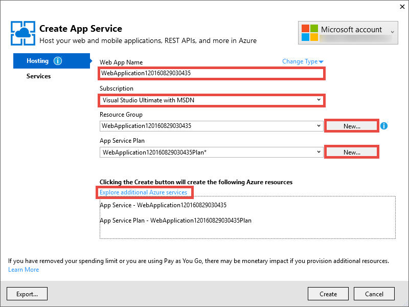
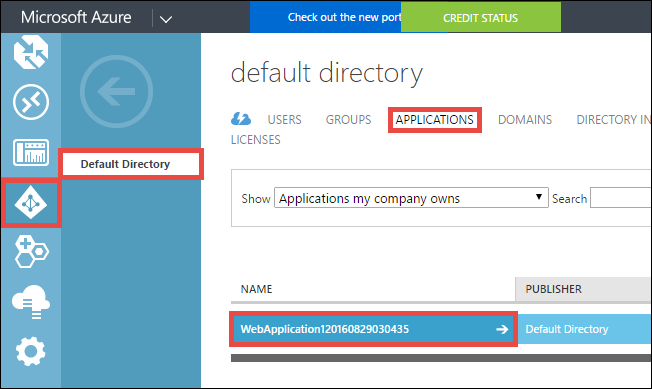
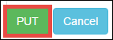
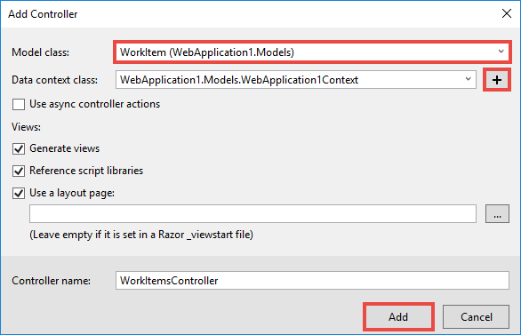
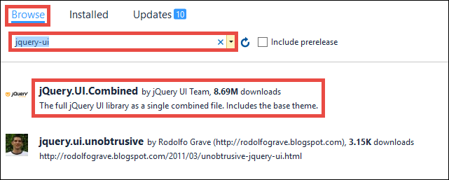

<properties 
    pageTitle="Erstellen Sie eine Azure Line-of-Business-app mit Azure-Active Directory-Authentifizierung | Microsoft Azure" 
    description="Informationen Sie zum Erstellen einer ASP.NET-MVC Line-of-Business-app in Azure App-Dienst, der authentifiziert mit Azure Active Directory" 
    services="app-service\web, active-directory" 
    documentationCenter=".net" 
    authors="cephalin" 
    manager="wpickett" 
    editor=""/>

<tags 
    ms.service="app-service-web" 
    ms.devlang="dotnet" 
    ms.topic="article" 
    ms.tgt_pltfrm="na" 
    ms.workload="web" 
    ms.date="09/01/2016" 
    ms.author="cephalin"/>

# Erstellen Sie eine Azure Line-of-Business-app mit Azure-Active Directory-Authentifizierung #

In diesem Artikel wird gezeigt, wie Sie zum Erstellen einer .NET Line-of-Business-app in [Azure App Dienst Web Apps](http://go.microsoft.com/fwlink/?LinkId=529714) mit der [Authentifizierung / Autorisierung](../app-service/app-service-authentication-overview.md) Features. Es wird gezeigt, wie die [Azure Active Directory-Diagramm-API](https://msdn.microsoft.com/Library/Azure/Ad/Graph/api/api-catalog) zum Verzeichnis Abfragen von Daten in der Anwendung verwenden.

Der Azure-Active Directory-Mandanten, mit denen Sie können einem nur Azure-Verzeichnis sein. Oder kann es sein [mit Ihrem lokalen Active Directory synchronisiert](../active-directory/active-directory-aadconnect.md) , eine einzelne anmelden Erfahrung für Kollegen zu erstellen, die lokal und Remote sind. In diesem Artikel wird das Standardverzeichnis für Ihr Konto Azure verwendet.

## Was werden Sie erstellen ##

Erstellen Sie einer einfache Linie-of-Business erstellen – lesen-Update-löschen (CRUD) Anwendung in App Dienst Web Apps, dass Spuren Elemente mit den folgenden Funktionen verwendet:

- Authentifiziert Benutzer mit Azure Active Directory
- Abfragen Directory-Benutzer und Gruppen mit [Azure Active Directory-Diagramm-API](http://msdn.microsoft.com/library/azure/hh974476.aspx)
- Verwenden Sie die Vorlage ASP.NET-MVC *Keine Authentifizierung*

Wenn Sie die Steuerung des Benutzerzugriffs rollenbasierte (RBAC) für Ihre app Branchen in Azure benötigen, finden Sie unter [Nächsten Schritt fort](#next).

## Was Sie benötigen ##

[AZURE.INCLUDE [free-trial-note](../../includes/free-trial-note.md)]

Sie benötigen die folgenden zum Bearbeiten dieses Lernprogramms:

- Ein Azure Active Directory-Mandanten mit verschiedenen Gruppen
- Berechtigungen zum Erstellen von Applications auf den Azure-Active Directory-Mandanten
- Update für Visual Studio 2013 4 oder höher
- [Azure SDK 2.8.1 oder höher](https://azure.microsoft.com/downloads/)

## Erstellen und Bereitstellen einer Web-app in Azure ##

1. Klicken Sie auf **Datei**, aus der Visual Studio > **neu** > **Projekt**.

2. Wählen Sie **ASP.NET Web-Anwendung**, benennen Sie Ihr Projekt, und klicken Sie auf **OK**.

3. Wählen Sie die **MVC** -Vorlage aus, und ändern Sie die Authentifizierung in **Keine Authentifizierung**. Stellen Sie sicher, dass **in der Cloud Host** ausgewählt ist, und klicken Sie auf **OK**.

    

4. Klicken Sie auf **Konto hinzufügen** (und dann auf **Konto hinzufügen** in der Dropdownliste) zu melden Sie sich bei Ihrem Konto Azure, klicken Sie im Dialogfeld **App-Verwaltungsdienst erstellen** .

5. Konfigurieren Sie nach der Anmeldung Ihre Web app. Erstellen einer Ressourcengruppe und eine neue App-Serviceplan durch Klicken auf die entsprechende Schaltfläche für **neu** klicken. Klicken Sie auf **Durchsuchen zusätzlicher Azure Dienste** fortsetzen.

    

6. Klicken Sie auf der Registerkarte **Dienste** auf **+** einer SQL-Datenbank für Ihre app hinzufügen. 

    

7. **Konfigurieren der SQL-Datenbank**klicken Sie auf **neu** , um eine SQL Server-Instanz erstellen.

8. **Konfigurieren von SQL Server**-Instanz von SQL Server konfigurieren. Klicken Sie dann auf **OK**, **OK**und **Erstellen** zum Deaktivieren der Erstellung der app in Azure Starten eines.

9. In **Azure App Dienst Aktivität**können Sie sehen, wenn die app Erstellung abgeschlossen ist. Klicken Sie auf * *Veröffentlichen &lt; *Appname*> dieses Web App jetzt**Klicken Sie dann auf **veröffentlichen **. 

    Nachdem Visual Studio abgeschlossen ist, wird die app Veröffentlichen im Browser geöffnet. 

    

## Konfigurieren der Authentifizierung und Directory access

1. Melden Sie sich mit dem [Azure-Portal](https://portal.azure.com)an.

2. Klicken Sie im Menü links auf **App-Dienste** > **&lt;*Appname*>** > **Authentifizierung / Autorisierung **.

    

3. Aktivieren der Azure-Active Directory-Authentifizierung, indem Sie **auf** > **Azure Active Directory** > **Express** > **OK**.

    

4. Klicken Sie in der Befehlsleiste auf **Speichern** .

    

    Nachdem Sie die Authentifizierungseinstellungen erfolgreich gespeichert haben, versuchen Sie, navigieren zu Ihrer Anwendung erneut im Browser. Ihre Standardeinstellungen erzwingen Authentifizierung auf die gesamte app. Wenn Sie sich noch nicht angemeldet nicht zur Verfügung, werden Sie zu einem Anmeldebildschirm umgeleitet. Sobald Sie angemeldet sind, wird Ihre app durch HTTPS gesichert. Als Nächstes müssen Sie Zugriff auf Directory-Daten zu ermöglichen. 

5. Navigieren Sie zum [klassischen-Portal](https://manage.windowsazure.com)an.

6. Klicken Sie im Menü links auf **Active Directory** > **Directory Standard** > **Anwendungen** > **&lt;*Appname*> **.

    

    Dies ist der Azure-Active Directory-Anwendung, die App-Dienst für Sie erstellt die Autorisierung aktivieren / Authentifizierungsfeature.

7. Klicken Sie auf **Benutzer** und **Gruppen** , um sicherzustellen, dass Sie einige Benutzer und Gruppen im Verzeichnis haben. Wenn nicht, erstellen Sie ein paar Testbenutzer und Gruppen aus.

    

7. Klicken Sie auf **Konfigurieren** , um diese Anwendung zu konfigurieren.

8. Führen Sie einen Bildlauf nach unten bis zum Abschnitt **Tasten** , und fügen Sie einen Schlüssel hinzu, indem Sie eine Dauer auswählen. Klicken Sie dann, klicken Sie auf **Delegierte Berechtigungen** , und wählen Sie **Directory-Daten lesen**. Klicken Sie auf **Speichern**.

    

8. Nachdem Sie Ihre Einstellungen gespeichert haben, führen Sie einen Bildlauf zurück nach Zeitphasen bis zum Abschnitt **Tasten** , und klicken Sie auf die Schaltfläche **Kopieren** , um den Clientschlüssel kopieren. 

    

    >[AZURE.IMPORTANT] Wenn Sie diese Seite jetzt verlassen, können Sie diesen Clientschlüssel nie wieder zugreifen nicht.

9. Als Nächstes müssen Sie die Web app mit dieser Taste konfigurieren. Melden Sie sich mit Ihrem Konto Azure der [Azure-Explorers](https://resources.azure.com) .

10. Klicken Sie am oberen Rand der Seite auf **Schreibgeschützt** , um Azure Ressource Explorer Änderungen vorzunehmen.

    

11. Suchen nach der Authentifizierungseinstellungen für Ihre app, die am Abonnements > * *&lt;*Subscriptionname*>** > **ResourceGroups** > **&lt;*Resourcegroupname*>** > **Anbieter** > **Microsoft.Web** > **Websites** > **&lt;*Appname*>** > **Config** > **Authsettings **.

12. Klicken Sie auf **Bearbeiten**.

    

13. Legen Sie die Bearbeitung im Bereich der `clientSecret` und `additionalLoginParams` Eigenschaften wie folgt.

        ...
        "clientSecret": "<client key from the Azure Active Directory application>",
        ...
        "additionalLoginParams": ["response_type=code id_token", "resource=https://graph.windows.net"],
        ...

14. Klicken Sie auf **setzen** , nach oben, um die Änderungen zu übermitteln.

    

14. Nun zum Testen, wenn Sie das Autorisierungstoken zum Zugreifen auf die Azure Active Directory Graph-API haben, einfach navigieren Sie zu * *https://&lt;*Appname*>.azurewebsites.net/.auth/me** in Ihrem Browser. Wenn Sie alles richtig konfiguriert, sollten Sie sehen die `access_token` Eigenschaft in die JSON-Antwort.

    Die `~/.auth/me` URL-Pfad erfolgt durch das App-Authentifizierung / Autorisierung erteilen Sie alle Informationen im Zusammenhang mit Ihrem authentifizierten Sitzung. Weitere Informationen finden Sie unter [Authentifizierung und Autorisierung in Azure-App-Verwaltungsdienst](../app-service/app-service-authentication-overview.md).

    >[AZURE.NOTE] Die `access_token` weist einen Ablaufzeitraum. Jedoch App-Authentifizierung / Autorisierung Funktionsumfang token Aktualisieren mit `~/.auth/refresh`. Weitere Informationen zur gemeinsamen Nutzung finden Sie unter     [App Dienst Token Store](https://cgillum.tech/2016/03/07/app-service-token-store/).

Als Nächstes werden Sie etwas Nützliches mit Verzeichnisdaten ausführen.

## Hinzufügen von Line-of-Business-Funktionen zu Ihrer Anwendung

Sie erstellen nun eine einfache CRUD Arbeit Elemente Tracker.  

5.  Klicken Sie im Ordner ~\Models erstellen Sie eine Klassendatei WorkItem.cs aufgerufen, und Ersetzen `public class WorkItem {...}` mit den folgenden Code:

        using System.ComponentModel.DataAnnotations;

        public class WorkItem
        {
            [Key]
            public int ItemID { get; set; }
            public string AssignedToID { get; set; }
            public string AssignedToName { get; set; }
            public string Description { get; set; }
            public WorkItemStatus Status { get; set; }
        }

        public enum WorkItemStatus
        {
            Open,
            Investigating,
            Resolved,
            Closed
        }

7.  Erstellen Sie das Projekt, um Ihre neue Modell in Visual Studio Gerüstlogik zugänglich zu machen.

8.  Hinzufügen eines neuen scaffolded Elements `WorkItemsController` in den Ordner ~\Controllers ( **Controller**wird mit der rechten Maustaste, zeigen Sie auf **Hinzufügen**, und wählen Sie **Neues Gerüstbau Element**). 

9.  Wählen Sie **MVC 5 Controller mit Ansichten, die mithilfe von Entität Framework** , und klicken Sie auf **Hinzufügen**.

10. Wählen Sie das Modell, das Sie erstellt haben, und klicken Sie auf **+** , und klicken Sie dann **Hinzufügen** zu einen Datenkontext hinzufügen, und klicken Sie dann auf **Hinzufügen**.

    

14. ~\Views\WorkItems\Create.cshtml (ein Element automatisch scaffolded), suchen Sie die `Html.BeginForm` Helper Methode und nehmen Sie die folgenden hervorgehobenen Änderungen vor:  
<pre class="prettyprint">
    @modelWebApplication1.Models.WorkItem

    @{ViewBag.Title = &quot;erstellen&quot;; }

    &lt;H2&gt;erstellen&lt;/h2&gt;

    @using(Html.BeginForm (<mark>&quot;erstellen&quot;, &quot;Arbeitselementen&quot;, FormMethod.Post, neu {Id = &quot;Hauptformular&quot; }</mark>)) {@Html.AntiForgeryToken()

        &lt;div class=&quot;form-horizontal&quot;&gt;
            &lt;h4&gt;WorkItem&lt;/h4&gt;
            &lt;hr /&gt;
            @Html.ValidationSummary(true, &quot;&quot;, new { @class = &quot;text-danger&quot; })
            &lt;div class=&quot;form-group&quot;&gt;
                @Html.LabelFor(model =&gt; model.AssignedToID, htmlAttributes: new { @class = &quot;control-label col-md-2&quot; })
                &lt;div class=&quot;col-md-10&quot;&gt;
                    @Html.EditorFor(model =&gt; model.AssignedToID, new { htmlAttributes = new { @class = &quot;form-control&quot;<mark>, @type = &quot;hidden&quot;</mark> } })
                    @Html.ValidationMessageFor(model =&gt; model.AssignedToID, &quot;&quot;, new { @class = &quot;text-danger&quot; })
                &lt;/div&gt;
            &lt;/div&gt;

            &lt;div class=&quot;form-group&quot;&gt;
                @Html.LabelFor(model =&gt; model.AssignedToName, htmlAttributes: new { @class = &quot;control-label col-md-2&quot; })
                &lt;div class=&quot;col-md-10&quot;&gt;
                    @Html.EditorFor(model =&gt; model.AssignedToName, new { htmlAttributes = new { @class = &quot;form-control&quot; } })
                    @Html.ValidationMessageFor(model =&gt; model.AssignedToName, &quot;&quot;, new { @class = &quot;text-danger&quot; })
                &lt;/div&gt;
            &lt;/div&gt;

            &lt;div class=&quot;form-group&quot;&gt;
                @Html.LabelFor(model =&gt; model.Description, htmlAttributes: new { @class = &quot;control-label col-md-2&quot; })
                &lt;div class=&quot;col-md-10&quot;&gt;
                    @Html.EditorFor(model =&gt; model.Description, new { htmlAttributes = new { @class = &quot;form-control&quot; } })
                    @Html.ValidationMessageFor(model =&gt; model.Description, &quot;&quot;, new { @class = &quot;text-danger&quot; })
                &lt;/div&gt;
            &lt;/div&gt;

            &lt;div class=&quot;form-group&quot;&gt;
                @Html.LabelFor(model =&gt; model.Status, htmlAttributes: new { @class = &quot;control-label col-md-2&quot; })
                &lt;div class=&quot;col-md-10&quot;&gt;
                    @Html.EnumDropDownListFor(model =&gt; model.Status, htmlAttributes: new { @class = &quot;form-control&quot; })
                    @Html.ValidationMessageFor(model =&gt; model.Status, &quot;&quot;, new { @class = &quot;text-danger&quot; })
                &lt;/div&gt;
            &lt;/div&gt;

            &lt;div class=&quot;form-group&quot;&gt;
                &lt;div class=&quot;col-md-offset-2 col-md-10&quot;&gt;
                    &lt;input type=&quot;submit&quot; value=&quot;Create&quot; class=&quot;btn btn-default&quot;<mark> id=&quot;submit-button&quot;</mark> /&gt;
                &lt;/div&gt;
            &lt;/div&gt;
        &lt;/div&gt;
    }

    &lt;Div&gt;
    @Html.ActionLink(&quot;zurück zur Liste&quot;, &quot;Index&quot;) &lt;/div    &gt;

    @sectionSkripts { @Scripts.Render( &quot;~/bundles/jqueryval&quot;)     <mark> &lt;Skript&gt; 
     / / Benutzer/Gruppe Datumsauswahl Code Var MaxResultsPerPage = 14;         Varianz Eingabesprache document.getElementById = (&quot;AssignedToName&quot;);

            // Access token from request header, and tenantID from claims identity
            var token = &quot;@Request.Headers[&quot;X-MS-TOKEN-AAD-ACCESS-TOKEN&quot;]&quot;;
            var tenant =&quot;@(System.Security.Claims.ClaimsPrincipal.Current.Claims
                            .Where(c => c.Type == &quot;http://schemas.microsoft.com/identity/claims/tenantid&quot;)
                            .Select(c => c.Value).SingleOrDefault())&quot;;

            var picker = new AadPicker(maxResultsPerPage, input, token, tenant);

            // Submit the selected user/group to be asssigned.
            $(&quot;#submit-button&quot;).click({ picker: picker }, function () {
                if (!picker.Selected())
                    return;
                $(&quot;#main-form&quot;).get()[0].elements[&quot;AssignedToID&quot;].value = picker.Selected().objectId;
            });
        &lt;/script&gt;</mark>
    }
    </pre>
    
    Beachten Sie, dass `token` und `tenant` werden verwendet, indem Sie die `AadPicker` Objekt Azure Active Directory-Diagramm-API Anrufe tätigen. Fügen Sie `AadPicker` später.   
    
    >[AZURE.NOTE] Gelangen Sie genauso gut `token` und `tenant` mit clientseitig `~/.auth/me`, aber, dass ein Zusätzliche Servertypen Anruf wäre. Beispiel:
    >  
    >     $.ajax({
    >         dataType: "json",
    >         url: "/.auth/me",
    >         success: function (data) {
    >             var token = data[0].access_token;
    >             var tenant = data[0].user_claims
    >                             .find(c => c.typ === 'http://schemas.microsoft.com/identity/claims/tenantid')
    >                             .val;
    >         }
    >     });
    
15. Nehmen Sie die gleichen Änderungen mit ~ \Views\WorkItems\Edit.cshtml.

15. Die `AadPicker` Objekt in ein Skript, das Sie zu Ihrem Projekt hinzufügen müssen definiert ist. Mit der rechten Maustaste in des Ordners ~\Scripts, zeigen Sie auf **Hinzufügen**, und klicken Sie auf **JavaScript-Datei**. Typ `AadPickerLibrary` für den Dateinamen, und klicken Sie auf **OK**.

16. Kopieren Sie den Inhalt von [hier](https://raw.githubusercontent.com/cephalin/active-directory-dotnet-webapp-roleclaims/master/WebApp-RoleClaims-DotNet/Scripts/AadPickerLibrary.js) in ~ \Scripts\AadPickerLibrary.js.

    Im Skript die `AadPicker` Objekt ruft [Azure Active Directory-Diagramm-API](https://msdn.microsoft.com/Library/Azure/Ad/Graph/api/api-catalog) für die Suche nach Benutzer und Gruppen, die die Eingabe entsprechen.  

17. ~\Scripts\AadPickerLibrary.js verwendet auch das [jQuery UI AutoVervollständigen-Widget](https://jqueryui.com/autocomplete/). Daher müssen Sie jQuery-Benutzeroberfläche zum Projekt hinzufügen. Mit der rechten Maustaste in Ihrem Projekts in, und klicken Sie auf **NuGet-Pakete verwalten**.

18. Klicken Sie im NuGet Package Manager auf Durchsuchen, geben Sie in der Suchleiste **Jquery-Benutzeroberfläche** und klicken Sie auf **jQuery.UI.Combined**.

    

19. Klicken Sie im rechten Bereich klicken Sie auf **Installieren**und dann auf **OK** , um den Vorgang fortzusetzen.

19. Öffnen Sie ~\App_Start\BundleConfig.cs, und nehmen Sie die folgenden hervorgehobenen Änderungen vor:  
    <pre class="prettyprint">
    Öffentliche statische void RegisterBundles(BundleCollection bundles) {Pakete. Hinzufügen (neue ScriptBundle (&quot;~/bundles/jquery&quot;). Einschließen ( &quot;~/Scripts/jquery-{version}.js&quot;<mark>, &quot;~/Scripts/jquery-ui-{version}.js&quot;, &quot;~/Scripts/AadPickerLibrary.js&quot;</mark>));

        bundles.Add(new ScriptBundle(&quot;~/bundles/jqueryval&quot;).Include(
                    &quot;~/Scripts/jquery.validate*&quot;));

        // Use the development version of Modernizr to develop with and learn from. Then, when you&#39;re
        // ready for production, use the build tool at http://modernizr.com to pick only the tests you need.
        bundles.Add(new ScriptBundle(&quot;~/bundles/modernizr&quot;).Include(
                    &quot;~/Scripts/modernizr-*&quot;));

        bundles.Add(new ScriptBundle(&quot;~/bundles/bootstrap&quot;).Include(
                    &quot;~/Scripts/bootstrap.js&quot;,
                    &quot;~/Scripts/respond.js&quot;));

        bundles.Add(new StyleBundle(&quot;~/Content/css&quot;).Include(
                    &quot;~/Content/bootstrap.css&quot;,
                    &quot;~/Content/site.css&quot;<mark>,
                    &quot;~/Content/themes/base/jquery-ui.css&quot;</mark>));
    }
    </pre>

    Es gibt weitere leistungsfähige Methoden zum Verwalten von JavaScript und CSS-Dateien in Ihrer app. Jedoch zur Vereinfachung nun Sie einfach auf die Pakete zu übernehmen, die mit jeder Ansicht geladen werden.

12. Schließlich in ~ \Global.asax, fügen Sie die folgende Zeile des Codes in der `Application_Start()` Methode. `Ctrl`+`.`Klicken Sie auf jeden naming Auflösung Fehler zu beheben.

        AntiForgeryConfig.UniqueClaimTypeIdentifier = ClaimTypes.NameIdentifier;
    
    > [AZURE.NOTE] Sie benötigen diese Zeile des Codes, da die Standardvorlage für MVC verwendet <code>[ValidateAntiForgeryToken]</code> Ergänzung auf einige Aktionen. Durch das Verhalten von [Brock bei Allen](https://twitter.com/BrockLAllen) am     [MVC 4, AntiForgeryToken und Ansprüche](http://brockallen.com/2012/07/08/mvc-4-antiforgerytoken-and-claims/) beschriebenen möglicherweise Ihren Beitrag HTTP-Anti-Fälschung token da fehlgeschlagener Überprüfung:

    > - Azure-Active Directory sendet keine der http://schemas.microsoft.com/accesscontrolservice/2010/07/claims/identityprovider, die standardmäßig für die Antifälschungstoken erforderlich ist.
    > - Ist Azure Active Directory Directory synchronisiert mit AD FS, sendet der AD FS-Trust standardmäßig den http://schemas.microsoft.com/accesscontrolservice/2010/07/claims/identityprovider Anspruch entweder, keine Obwohl Sie AD FS zum Senden dieser Anspruch manuell konfigurieren können.

    > `ClaimTypes.NameIdentifies`Gibt den Anspruch `http://schemas.xmlsoap.org/ws/2005/05/identity/claims/nameidentifier`, welche Azure Active Directory bereitstellt.  

20. Jetzt, veröffentlichen Sie Ihre Änderungen an. Mit der rechten Maustaste in Ihrem Projekts, und klicken Sie auf **Veröffentlichen**.

21. Klicken Sie auf **Einstellungen**, stellen Sie sicher, dass eine Verbindungszeichenfolge für die SQL-Datenbank vorhanden ist, wählen Sie die **Datenbank aktualisieren** , nehmen Sie die Schemänderungen für Ihr Modell, und klicken Sie auf **Veröffentlichen**.

    

22. Navigieren Sie im Browser zu https://&lt;*Appname*>.azurewebsites.net/workitems, und klicken Sie auf **Neu erstellen**.

23. Klicken Sie im Feld **AssignedToName** auf. Benutzer und Gruppen sollte jetzt aus Ihrem Mandanten Azure Active Directory in einer Dropdownliste angezeigt werden. Geben Sie zum Filtern, oder Verwenden der `Up` oder `Down` wichtiger, oder klicken Sie auf, um dem Benutzer oder der Gruppe auszuwählen. 

    

24. Klicken Sie auf **Erstellen** , um die Änderungen zu speichern. Klicken Sie dann auf **Bearbeiten** klicken Sie auf das Element erstellten Arbeit zu sehen, das gleiche Verhalten.

Herzlichen Glückwunsch, werden Sie jetzt eine Line-of-Business-app in Azure mit Directory Access ausgeführt! Es gibt eine Vielzahl weiterer mit dem Diagramm-API möglich ist. Finden Sie unter [Azure AD Graph-API-Referenz](https://msdn.microsoft.com/library/azure/ad/graph/api/api-catalog).

## Als Nächstes

Wenn Sie die Steuerung des Benutzerzugriffs rollenbasierte (RBAC) für Ihre app Branchen in Azure benötigen, finden Sie unter [WebApp-RoleClaims-DotNet](https://github.com/Azure-Samples/active-directory-dotnet-webapp-roleclaims) einer Stichprobe aus dem Team Azure Active Directory. Es wird gezeigt, wie die Rollen für eine Anwendung Azure Active Directory aktivieren, und klicken Sie dann Autorisieren von Benutzern mit der `[Authorize]` eine Weihnachtsdekoration.

Wenn Ihre app Branchen Zugriff auf lokale Daten benötigt werden, finden Sie unter [Zugriff auf lokale Ressourcen Hybrid Verbindungen in Azure-App-Dienst verwenden](web-sites-hybrid-connection-get-started.md).

## Weitere Ressourcen

- [Authentifizierung und Autorisierung in Azure-App-Verwaltungsdienst](../app-service/app-service-authentication-overview.md)
- [Authentifizieren Sie mit lokalen Active Directory in Ihrer Azure-app](web-sites-authentication-authorization.md)
- [Erstellen einer Line-of-Business-app in Azure mit AD FS-Authentifizierung](web-sites-dotnet-lob-application-adfs.md)
- [App-Dienst Authentifizierung und der Azure AD Graph-API](https://cgillum.tech/2016/03/25/app-service-auth-aad-graph-api/)
- [Microsoft Azure-Active Directory-Beispielen und der Dokumentation](https://github.com/AzureADSamples)
- [Azure-Active Directory unterstützt Token und Ansprüche](http://msdn.microsoft.com/library/azure/dn195587.aspx)

[Protect the Application with SSL and the Authorize Attribute]: web-sites-dotnet-deploy-aspnet-mvc-app-membership-oauth-sql-database.md#protect-the-application-with-ssl-and-the-authorize-attribute
