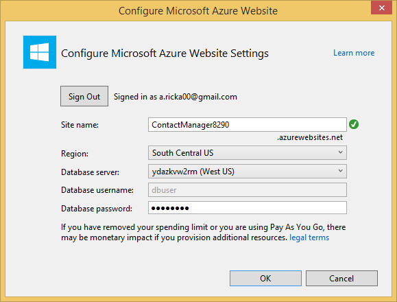
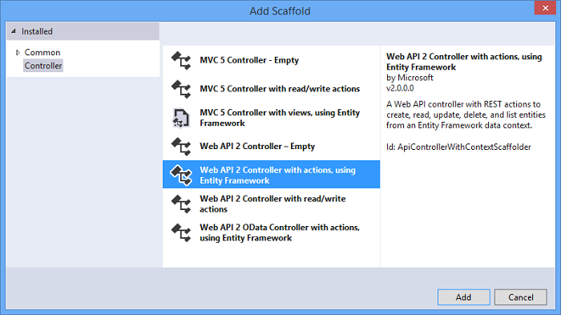

<properties 
    pageTitle="Erstellen eines REST-Diensts verwenden ASP.NET Web API und SQL-Datenbank in Azure-App-Verwaltungsdienst" 
    description="Ein Lernprogramm, in dem Sie vermittelt, wie eine app bereitstellen, die die ASP.NET Web API zu einer Azure Web app mit Visual Studio verwendet." 
    services="app-service\web" 
    documentationCenter=".net" 
    authors="Rick-Anderson" 
    writer="Rick-Anderson" 
    manager="wpickett" 
    editor=""/>

<tags 
    ms.service="app-service-web" 
    ms.workload="web" 
    ms.tgt_pltfrm="na" 
    ms.devlang="dotnet" 
    ms.topic="article" 
    ms.date="02/29/2016" 
    ms.author="riande"/>

# Erstellen eines REST-Diensts verwenden ASP.NET Web API und SQL-Datenbank in Azure-App-Verwaltungsdienst

In diesem Lernprogramm erfahren, wie mithilfe des Web veröffentlichen-Assistenten in Visual Studio 2013 oder Visual Studio 2013 Community Edition eine ASP.NET Web app eine [App-Verwaltungsdienst Azure](http://go.microsoft.com/fwlink/?LinkId=529714) bereitgestellt. 

Ein Azure-Konto können kostenlos öffnen, und wenn Sie noch keine Visual Studio 2013 haben, installiert das SDK Visual Studio 2013 automatisch für Web Express. So können Sie die Entwicklung von kostenlosen für Azure vollständig für starten.

In diesem Lernprogramm wird davon ausgegangen, dass Sie keine vorherige Erfahrung mit Azure haben. Klicken Sie auf dieses Lernprogramms abgeschlossen haben, müssen Sie eine einfache Web-app nach oben und in der Cloud ausgeführt.
 
Lernen Sie:

* Wie Sie Ihrem Computer für die Entwicklung von Azure aktivieren, indem Sie die Installation von Azure SDK.
* So erstellen Sie ein Projekt Visual Studio ASP.NET MVC 5 und Azure-Anwendung veröffentlichen.
* Wie die ASP.NET Web-API um REST API-Anrufe zu aktivieren.
* Informationen zum Speichern von Daten in Azure SQL-Datenbank verwenden.
* Informationen zum Veröffentlichen der Anwendung aktualisierten Azure.

Sie erhalten eine einfache Kontaktliste Web-Anwendung erstellen, die basiert auf ASP.NET MVC 5 und ADO.NET Entität Framework für den Datenbankzugriff verwendet. Die folgende Abbildung zeigt die fertige Anwendung:

![Screenshot der Website][intro001]

<!-- the next line produces the "Set up the development environment" section as see at http://azure.microsoft.com/documentation/articles/web-sites-dotnet-get-started/ -->
[AZURE.INCLUDE [create-account-and-websites-note](../../includes/create-account-and-websites-note.md)]

### Erstellen Sie das Projekt

1. Starten Sie Visual Studio 2013.
1. Klicken Sie im Menü **Datei** auf **Neues Projekt**.
3. Erweitern Sie **Visual c#** Sie im Dialogfeld **Neues Projekt** **Web** , und wählen Sie dann auf **ASP.NET Web-Anwendung**. Nennen Sie die Anwendung **ContactManager** , und klicken Sie auf **OK**.

    

1. Klicken Sie im Dialogfeld **Neues Projekt von ASP.NET** wählen Sie die Vorlage **MVC** , aktivieren Sie **Web-API** , und klicken Sie dann auf **Authentifizierung ändern**.

1. Führen Sie im Dialogfeld **Authentifizierung ändern** klicken Sie auf **Keine Authentifizierung**, und klicken Sie dann auf **OK**.

    

    Die Beispiel-Anwendung, die Sie erstellen möchten, nicht Features muss, die Benutzer sich anmelden müssen. Informationen zum Implementieren der Authentifizierung und Autorisierung Features finden Sie unter Abschnitt [Weitere Schritte](#nextsteps) am Ende dieses Lernprogramms. 

1. Klicken Sie im Dialogfeld **Neues Projekt von ASP.NET** stellen Sie sicher, dass der **Host in der Cloud** aktiviert ist, und klicken Sie auf **OK**.

Wenn Sie sich nicht zuvor Azure angemeldet haben, werden Sie aufgefordert werden, anmelden.

1. Der Assistent schlägt einen eindeutigen Namen basierend auf *ContactManager* (siehe nachfolgende Abbildung). Wählen Sie einen Bereich in der Nähe Sie ein. [Azurespeed.com](http://www.azurespeed.com/ "AzureSpeed.com") können Sie um das niedrigste Wartezeit Data Center zu suchen. 
2. Wenn Sie vor einen Datenbankserver erstellt haben, wählen Sie **neuen Server erstellen**, geben Sie einen Datenbank-Benutzernamen und Ihr Kennwort ein.

    

Wenn Sie einen Datenbankserver verfügen, verwenden Sie, um eine neue Datenbank zu erstellen. Datenbankserver sind eine wertvolle Ressource, und Sie in der Regel mehrere Datenbanken auf demselben Server testen und Entwicklung anstatt Erstellen eines Datenbankservers pro Datenbank erstellen möchten. Stellen Sie sicher, dass Ihre Website und die Datenbank in derselben Region befinden.

### Festlegen der Kopf- und Fußzeile

1. Im **Explorer Lösung**erweitern Sie den *Views\Shared ebenfalls einen* Ordner, und öffnen Sie die Datei *_Layout.cshtml* .

    ![_Layout.cshtml in Lösung Explorer][newapp004]

1. Ersetzen Sie den Inhalt der Datei *Views\Shared_Layout.cshtml* mit den folgenden Code ein:

        <!DOCTYPE html>
        <html lang="en">
        <head>
            <meta charset="utf-8" />
            <title>@ViewBag.Title - Contact Manager</title>
            <link href="~/favicon.ico" rel="shortcut icon" type="image/x-icon" />
            <meta name="viewport" content="width=device-width" />
            @Styles.Render("~/Content/css")
            @Scripts.Render("~/bundles/modernizr")
        </head>
        <body>
            <header>
                

                    

                        
@Html.ActionLink("Contact Manager", "Index", "Home")

                    

                

            </header>
            

                @RenderSection("featured", required: false)
                <section class="content-wrapper main-content clear-fix">
                    @RenderBody()
                </section>
            

            <footer>
                

                    

                        
&copy; @DateTime.Now.Year - Contact Manager

                    

                

            </footer>
            @Scripts.Render("~/bundles/jquery")
            @RenderSection("scripts", required: false)
        </body>
        </html>
            
Das Markup über ändert den Namen der Anwendung von "Meine ASP.NET App" auf "Contact Manager", und es werden die Verknüpfungen zu **Hause**, **zu** und **Kontakt**entfernt.

### Führen Sie die Anwendung lokal

1. Drücken Sie STRG + F5, um die Anwendung ausführen.
Homepage der Anwendung wird im Standardbrowser angezeigt.
    

Dies ist alles, Sie müssen, jetzt die Anwendung zu erstellen, das auf Azure bereitgestellt werden. Später fügen Sie die Datenbankfunktionalität.

## In Azure bereitzustellen

1. Klicken Sie in Visual Studio mit der rechten Maustaste im Projekts im **Solution Explorer** , und wählen Sie aus dem Kontextmenü **Veröffentlichen** .

    ![Veröffentlichen Sie in Project-Kontextmenü][PublishVSSolution]

    Der **Web veröffentlichen** -Assistent wird geöffnet.

12. Klicken Sie auf **Veröffentlichen**.

Visual Studio beginnt den Vorgang des Kopierens von Dateien auf dem Server Azure. **Das Ausgabefenster** zeigt, welche Aktionen für die Bereitstellung ausgeführt wurden und Berichte erfolgreichen Abschluss der Bereitstellung.

14. Der Standardbrowser wird automatisch an die URL der bereitgestellten Website geöffnet.

    Die Anwendung, die Sie erstellt haben, wird jetzt in der Cloud ausgeführt.
    
    ![Zur Homepage von Aufgabenliste in Azure ausgeführt][rxz2]

## Hinzufügen einer Datenbank mit der Anwendung

Aktualisieren Sie als Nächstes die MVC-Anwendung, die Möglichkeit zum Anzeigen und Aktualisieren von Kontakten und speichern Sie die Daten in einer Datenbank hinzufügen. Die Anwendung wird die Entität Framework verwenden, die Datenbank erstellt und zum Lesen und Aktualisieren von Daten in der Datenbank.

### Fügen Sie Datenmodell Klassen für die Kontakte hinzu

Sie zunächst ein einfaches Datenmodell Code erstellen.

1. Im- **Lösung Explorer**mit der rechten Maustaste in des Ordner "Modelle", klicken Sie auf **Hinzufügen**, und klicken Sie dann auf **Class**.

    ![Fügen Sie im Kontextmenü Ordner Modelle Klasse][adddb001]

2. Benennen Sie die neue Klassendatei *Contact.cs*klicken Sie im Dialogfeld **Neues Element hinzufügen** , und klicken Sie dann auf **Hinzufügen**.

    ![Klicken Sie im Dialogfeld Neues Element hinzufügen][adddb002]

3. Ersetzen Sie den Inhalt der Datei Contacts.cs mit den folgenden Code ein.

        using System.Globalization;
        namespace ContactManager.Models
        {
            public class Contact
            {
                public int ContactId { get; set; }
                public string Name { get; set; }
                public string Address { get; set; }
                public string City { get; set; }
                public string State { get; set; }
                public string Zip { get; set; }
                public string Email { get; set; }
                public string Twitter { get; set; }
                public string Self
                {
                    get { return string.Format(CultureInfo.CurrentCulture,
                         "api/contacts/{0}", this.ContactId); }
                    set { }
                }
            }
        }

**Wenden Sie sich an** Klasse definiert die Daten, die Sie speichern möchten, für jeden Kontakt sowie einen Primärschlüssel Kontakt-Nr, die von der Datenbank erforderlich ist. Sie erhalten weitere Informationen zu Datenmodellen im Abschnitt [Weitere Schritte](#nextsteps) am Ende dieses Lernprogramms.

### Erstellen von Webseiten für die app-Benutzer für die Arbeit mit den Kontakten aktivieren

ASP.NET-MVC das Feature Gerüstbau kann automatisch ausführt-Code generieren erstellen, lesen, aktualisieren und Löschen von Aktionen (CRUD).

## Fügen Sie einen Controller und eine Ansicht für die Daten

1. Erweitern Sie im **Explorer Lösung**den Ordner Controller aus.

3. Erstellen Sie das Projekt **(STRG + UMSCHALT + B)**. (Sie müssen das Projekt erstellen, bevor Sie Gerüstbau verwenden.) 

4. Mit der rechten Maustaste in des Ordners Controller, und klicken Sie auf **Hinzufügen**, und klicken Sie dann auf **Controller**.

    ![Fügen Sie im Kontextmenü Ordner Controller Controller][addcode001]

1. Klicken Sie im Dialogfeld **Scaffold hinzufügen** wählen Sie **MVC Controller mit Ansichten, die mithilfe von Entität Framework** , und klicken Sie auf **Hinzufügen**.

 

6. Legen Sie den Controllernamen auf **HomeController**ein. Wählen Sie als Ihr Modellklasse **Kontakt** ein. Übernehmen Sie den Standardwert "ContactManager.Models.ContactManagerContext" für den **neuen Datentyp Kontext**, und klicken Sie auf die Schaltfläche **neue Datenkontext** . Klicken Sie auf **Hinzufügen**.

    Ein Dialogfeld fordert Sie: "eine Datei mit dem Namen HomeController bereits beendet. Möchten Sie es ersetzen? ". Klicken Sie auf **Ja**. Wir werden dem Start Controller überschrieben wird, die mit dem neuen Projekt erstellt wurde. Wir verwenden Sie den neuen Start Controller für unsere Kontaktliste.

    Visual Studio erstellt Controllermethoden und Ansichten für die Datenbankvorgänge für **Kontakt** Objekte.

## Aktivieren der Migration, erstellen Sie die Datenbank, Hinzufügen von Beispieldaten und eine Initialisierung Daten ##

Der nächste Vorgang ist das [Ersten Migration Code](http://curah.microsoft.com/55220) -Feature aktivieren die Datenbank basierend auf den erstellten Datenmodell zu erstellen.

1. Wählen Sie im Menü **Extras** **Bibliothek Paket-Manager** , und klicken Sie dann **Paket-Manager-Konsole**aus.

    ![Paket-Manager-Verwaltungskonsole im Menü ' Extras '][addcode008]

2. Geben Sie im Fenster **Paket-Manager-Konsole** den folgenden Befehl aus:

        enable-migrations 
  
    Der Befehl **Aktivieren-Migration** erstellt einen *Migration* -Ordner, und es setzt eine *Configuration.cs* -Datei, die Sie bearbeiten können, um die Migration konfigurieren in diesen Ordner. 

2. Geben Sie im Fenster **Paket-Manager-Konsole** den folgenden Befehl aus:

        add-migration Initial

    Der Befehl **Hinzufügen Migration Initiale** generiert eine Klasse namens ** &lt;Date_stamp&gt;anfänglichen** , die die Datenbank erstellt. Erste Parameter ( *Initial* ) ist zufällige und verwendet wird, um den Namen der Datei zu erstellen. Sie können Klassendateien der neuen **Lösung Explorer**anzeigen.

    In der **ersten** Klasse die Methode **von** die Kontakttabelle erstellt, und die Methode **nach unten** (wird verwendet, wenn Sie in den vorherigen Zustand zurückkehren möchten) fällt es.

3. Öffnen Sie die Datei *Migrations\Configuration.cs* . 

4. Fügen Sie die folgenden Namespaces hinzu. 

         using ContactManager.Models;

5. Ersetzen Sie die Methode *Startwert* mit den folgenden Code ein:
        
        protected override void Seed(ContactManager.Models.ContactManagerContext context)
        {
            context.Contacts.AddOrUpdate(p => p.Name,
               new Contact
               {
                   Name = "Debra Garcia",
                   Address = "1234 Main St",
                   City = "Redmond",
                   State = "WA",
                   Zip = "10999",
                   Email = "debra@example.com",
                   Twitter = "debra_example"
               },
                new Contact
                {
                    Name = "Thorsten Weinrich",
                    Address = "5678 1st Ave W",
                    City = "Redmond",
                    State = "WA",
                    Zip = "10999",
                    Email = "thorsten@example.com",
                    Twitter = "thorsten_example"
                },
                new Contact
                {
                    Name = "Yuhong Li",
                    Address = "9012 State st",
                    City = "Redmond",
                    State = "WA",
                    Zip = "10999",
                    Email = "yuhong@example.com",
                    Twitter = "yuhong_example"
                },
                new Contact
                {
                    Name = "Jon Orton",
                    Address = "3456 Maple St",
                    City = "Redmond",
                    State = "WA",
                    Zip = "10999",
                    Email = "jon@example.com",
                    Twitter = "jon_example"
                },
                new Contact
                {
                    Name = "Diliana Alexieva-Bosseva",
                    Address = "7890 2nd Ave E",
                    City = "Redmond",
                    State = "WA",
                    Zip = "10999",
                    Email = "diliana@example.com",
                    Twitter = "diliana_example"
                }
                );
        }

    Dieser Code oben Initialisierung wird der Datenbank mit den Kontaktdaten. Weitere Informationen über die Datenbank sendet finden Sie unter [Datenbanken für das Debuggen Entität Framework (EF)](http://blogs.msdn.com/b/rickandy/archive/2013/02/12/seeding-and-debugging-entity-framework-ef-dbs.aspx).

1. Geben Sie in das **Paket-Manager-Konsole** den Befehl aus:

        update-database

    ![Paket-Manager-Konsole Befehle][addcode009]

    Die **Update-Datenbank** ausgeführt wird, die erste Migration, die die Datenbank erstellt wird. Standardmäßig ist die Datenbank als SQL Server Express LocalDB Datenbank erstellt.

1. Drücken Sie STRG + F5, um die Anwendung ausführen. 

Die Anwendung zeigt die Ausgangswerte sowie Details, bearbeiten und löschen links.

![MVC-Ansicht von Daten][rxz3]

## Bearbeiten der Ansicht

1. Öffnen Sie die Datei *Views\Home\Index.cshtml* . Im nächsten Schritt werden wir das generierte Markup durch Code ersetzen, die [jQuery](http://jquery.com/) und [Knockout.js](http://knockoutjs.com/)verwendet. Diese neue Code Ruft die Liste der Kontakte von mit Web-API und JSON und bindet dann in der Benutzeroberfläche knockout.js mithilfe die Kontaktdaten. Weitere Informationen finden Sie im Abschnitt für die [Nächsten Schritte](#nextsteps) am Ende dieses Lernprogramms. 

2. Ersetzen Sie den Inhalt der Datei durch den folgenden Code ein.

        @model IEnumerable<ContactManager.Models.Contact>
        @{
            ViewBag.Title = "Home";
        }
        @section Scripts {
            @Scripts.Render("~/bundles/knockout")
            
        }
        <ul id="contacts" data-bind="foreach: contacts">
            <li class="ui-widget-content ui-corner-all">
                <h1 data-bind="text: Name" class="ui-widget-header"></h1>
                

                

                    ,
                    
                    
                

                

                
Email?

                

                
Twitter?

                
<a data-bind="attr: { href: Self }, click: $root.removeContact" class="removeContact ui-state-default ui-corner-all">Remove</a>

            </li>
        </ul>
        <form id="addContact" data-bind="submit: addContact">
            <fieldset>
                <legend>Add New Contact</legend>
                <ol>
                    <li>
                        <label for="Name">Name</label>
                        <input type="text" name="Name" />
                    </li>
                    <li>
                        <label for="Address">Address</label>
                        <input type="text" name="Address" >
                    </li>
                    <li>
                        <label for="City">City</label>
                        <input type="text" name="City" />
                    </li>
                    <li>
                        <label for="State">State</label>
                        <input type="text" name="State" />
                    </li>
                    <li>
                        <label for="Zip">Zip</label>
                        <input type="text" name="Zip" />
                    </li>
                    <li>
                        <label for="Email">E-mail</label>
                        <input type="text" name="Email" />
                    </li>
                    <li>
                        <label for="Twitter">Twitter</label>
                        <input type="text" name="Twitter" />
                    </li>
                </ol>
                <input type="submit" value="Add" />
            </fieldset>
        </form>

3. Mit der rechten Maustaste in des Ordners Inhalt und klicken Sie auf **Hinzufügen**, und klicken Sie dann auf **Neues Element**.

    ![Kontextmenü für Inhalte Ordner Stylesheet hinzufügen][addcode005]

4. Klicken Sie im Dialogfeld **Neues Element hinzufügen** Geben Sie die **Formatvorlage** in das Suchfeld der oberen rechten, und wählen Sie dann **Stylesheet**.
    ![Klicken Sie im Dialogfeld Neues Element hinzufügen][rxStyle]

5. Benennen Sie die Datei *Contacts.css* , und klicken Sie auf **Hinzufügen**. Ersetzen Sie den Inhalt der Datei durch den folgenden Code ein.
    
        .column {
            float: left;
            width: 50%;
            padding: 0;
            margin: 5px 0;
        }
        form ol {
            list-style-type: none;
            padding: 0;
            margin: 0;
        }
        form li {
            padding: 1px;
            margin: 3px;
        }
        form input[type="text"] {
            width: 100%;
        }
        #addContact {
            width: 300px;
            float: left;
            width:30%;
        }
        #contacts {
            list-style-type: none;
            margin: 0;
            padding: 0;
            float:left;
            width: 70%;
        }
        #contacts li {
            margin: 3px 3px 3px 0;
            padding: 1px;
            float: left;
            width: 300px;
            text-align: center;
            background-image: none;
            background-color: #F5F5F5;
        }
        #contacts li h1
        {
            padding: 0;
            margin: 0;
            background-image: none;
            background-color: Orange;
            color: White;
            font-family: Trebuchet MS, Tahoma, Verdana, Arial, sans-serif;
        }
        .removeContact, .viewImage
        {
            padding: 3px;
            text-decoration: none;
        }

    Wir verwenden diese Stylesheet für das Layout, Farben und Formatvorlagen in der Kontakt-Manager-app verwendet werden.

6. Öffnen Sie die Datei *App_Start\BundleConfig.cs* .

7. Fügen Sie den folgenden Code ein, um die [erstellt](http://knockoutjs.com/index.html "KO") -Plug-in zu registrieren.

        bundles.Add(new ScriptBundle("~/bundles/knockout").Include(
                    "~/Scripts/knockout-{version}.js"));
    In diesem Beispiel erstellt verwenden, um dynamische JavaScript-Code zu vereinfachen, die die Bildschirmvorlagen behandelt.

8. Ändern Sie den Inhalt/Css-Eintrag, um das Stylesheet *contacts.css* registrieren. Ändern Sie die folgende Zeile ein:

                 bundles.Add(new StyleBundle("~/Content/css").Include(
                   "~/Content/bootstrap.css",
                   "~/Content/site.css"));
An:

        bundles.Add(new StyleBundle("~/Content/css").Include(
                   "~/Content/bootstrap.css",
                   "~/Content/contacts.css",
                   "~/Content/site.css"));

1. Führen Sie in der Paket-Manager-Konsole den folgenden Befehl zum Installieren von erstellt.

        Install-Package knockoutjs

## Fügen Sie einen Controller für die Web-API Rest-Benutzeroberfläche

1. Mit der rechten Maustaste Controller **Lösung-Explorer**und klicken Sie auf **Hinzufügen** , und klicken Sie dann **Controller...** 

1. Geben Sie im Dialogfeld **Scaffold hinzufügen** **Web API 2 Controller Steuerelementaktionen Entität Framework verwenden** , und klicken Sie dann auf **Hinzufügen**.

    

4. Geben Sie im Dialogfeld **Controller hinzufügen** "ContactsController" als Ihren Controllernamen. Wählen Sie "Kontakt (ContactManager.Models)" für das **Modell Class**.  Behalten Sie den Standardwert für die **Daten Kontext Class**. 

6. Klicken Sie auf **Hinzufügen**.

### Führen Sie die Anwendung lokal

1. Drücken Sie STRG + F5, um die Anwendung ausführen.

    ![Seite ' Index '][intro001]

2. Geben Sie einen Kontakt, und klicken Sie auf **Hinzufügen**. Die app zur Startseite zurück und zeigt den Kontakt, den Sie eingegeben haben.

    ![Seite ' Index ' mit Listenelementen Aufgabe][addwebapi004]

3. Fügen Sie im Browser **/api/contacts** an die URL ein.

    Die resultierende URL sieht in etwa Http://localhost:1234/api/Kontakte aus. Das Rest Web API, das Sie hinzugefügt haben, gibt die gespeicherten Kontakte. Firefox und Chrome werden die Daten im XML-Format angezeigt.

    ![Seite ' Index ' mit Listenelementen Aufgabe][rxFFchrome]
    

    IE fordert Sie zum Öffnen oder speichern die Kontakte.

    ![Dialogfeld "Speichern" Web API][addwebapi006]
    
    
    Sie können die zurückgegebenen Kontakte in Editor oder in einem Browser öffnen.
    
    Diese Ausgabe kann von einer anderen Anwendung wie mobile Webseite oder einer Anwendung genutzt werden.

    ![Dialogfeld "Speichern" Web API][addwebapi007]

    **Sicherheitshinweis**: an diesem Punkt, ist eine Anwendung unsicher und CSRF Angriffen gefährdet. Später im Lernprogramm werden wir dieses Sicherheitsrisiko entfernt. Weitere Informationen finden Sie unter [verhindern websiteübergreifende anfordern Fälschung (CSRF) Angriffen][prevent-csrf-attacks].
## Schützen von XSRF

Websiteübergreifende Anforderung Fälschung (auch bekannt als XSRF oder CSRF) ist ein Angriffen gegen Web gehosteten Applications vererbungseinstellungen eine bösartige Website für die Interaktion zwischen einem Clientbrowser und eine Website, die von diesem Browser vertrauenswürdige beeinflussen kann. Diesen Angriffen sind ermöglicht, da Webbrowser Authentifizierungstoken automatisch mit jeder Anforderung an eine Website gesendet werden. Beispiel ist eine Authentifizierungscookie, z. B. ASP. Netz des Formularauthentifizierungsticket. Websites, die alle beständigen Authentifizierungsmethode (beispielsweise Windows-Authentifizierung, Basic usw.) verwenden kann jedoch von diesen Angriffen ausgerichtet werden.

XSRF Angriffen unterscheidet sich von einem Phishing-Angriffen. Phishing-Angriffen erfordern Interaktion aus dem Opfer. In einer Phishing-Angriffen eine bösartige Website wird die Zielwebsite Nachbilden, und das Opfer geleistet hat, vertraulichen Informationen an den Angreifer erkennen Sie ist. In einer XSRF Angriffen gibt es häufig keine Interaktion aus dem Opfer erforderlich. Lieber, ist der Angreifer auf im Browser, senden alle entsprechenden Cookies automatisch auf die Zielwebsite verlassen.

Weitere Informationen finden Sie in der [Geöffneten Web Anwendung Sicherheitsprojekt](https://www.owasp.org/index.php/Main_Page) (OWASP) [XSRF](https://www.owasp.org/index.php/Cross-Site_Request_Forgery_(CSRF)).

1. Im **Explorer Lösung**nach rechts **ContactManager** Project und klicken Sie auf **Hinzufügen** und dann auf **Klasse**.

2. Benennen Sie die Datei *ValidateHttpAntiForgeryTokenAttribute.cs* , und fügen Sie den folgenden Code hinzu:

        using System;
        using System.Collections.Generic;
        using System.Linq;
        using System.Net;
        using System.Net.Http;
        using System.Web.Helpers;
        using System.Web.Http.Controllers;
        using System.Web.Http.Filters;
        using System.Web.Mvc;
        namespace ContactManager.Filters
        {
            public class ValidateHttpAntiForgeryTokenAttribute : AuthorizationFilterAttribute
            {
                public override void OnAuthorization(HttpActionContext actionContext)
                {
                    HttpRequestMessage request = actionContext.ControllerContext.Request;
                    try
                    {
                        if (IsAjaxRequest(request))
                        {
                            ValidateRequestHeader(request);
                        }
                        else
                        {
                            AntiForgery.Validate();
                        }
                    }
                    catch (HttpAntiForgeryException e)
                    {
                        actionContext.Response = request.CreateErrorResponse(HttpStatusCode.Forbidden, e);
                    }
                }
                private bool IsAjaxRequest(HttpRequestMessage request)
                {
                    IEnumerable<string> xRequestedWithHeaders;
                    if (request.Headers.TryGetValues("X-Requested-With", out xRequestedWithHeaders))
                    {
                        string headerValue = xRequestedWithHeaders.FirstOrDefault();
                        if (!String.IsNullOrEmpty(headerValue))
                        {
                            return String.Equals(headerValue, "XMLHttpRequest", StringComparison.OrdinalIgnoreCase);
                        }
                    }
                    return false;
                }
                private void ValidateRequestHeader(HttpRequestMessage request)
                {
                    string cookieToken = String.Empty;
                    string formToken = String.Empty;
                    IEnumerable<string> tokenHeaders;
                    if (request.Headers.TryGetValues("RequestVerificationToken", out tokenHeaders))
                    {
                        string tokenValue = tokenHeaders.FirstOrDefault();
                        if (!String.IsNullOrEmpty(tokenValue))
                        {
                            string[] tokens = tokenValue.Split(':');
                            if (tokens.Length == 2)
                            {
                                cookieToken = tokens[0].Trim();
                                formToken = tokens[1].Trim();
                            }
                        }
                    }
                    AntiForgery.Validate(cookieToken, formToken);
                }
            }
        }

1. Fügen Sie die folgende *using* -Anweisung an den Verträgen Controller, damit Sie Zugriff auf das Attribut **[ValidateHttpAntiForgeryToken]** haben.

        using ContactManager.Filters;

1. Fügen Sie das Attribut **[ValidateHttpAntiForgeryToken]** der Beitrag Methoden der **ContactsController** vor XSRF Risiken zu schützen. Es werden Sie die Methoden der Aktion "PutContact", "PostContact" und **DeleteContact** hinzufügen.

        [ValidateHttpAntiForgeryToken]
            public IHttpActionResult PutContact(int id, Contact contact)
            {

1. Aktualisieren Sie im Abschnitt *Skripts* der Datei *Views\Home\Index.cshtml* -Codes zum Abrufen der XSRF Tokens aufnehmen möchten.

         @section Scripts {
            @Scripts.Render("~/bundles/knockout")
            
         }

## Veröffentlichen Sie die Anwendung aktualisieren Azure und SQL-Datenbank

Wenn Sie die Anwendung veröffentlichen möchten, wiederholen Sie das Verfahren, die, das Sie zuvor gefolgt.

1. Klicken Sie im **Explorer Lösung**klicken Sie mit der rechten Maustaste auf das Projekt, und wählen Sie **Veröffentlichen**.

    ![Veröffentlichen][rxP]

5. Klicken Sie auf der Registerkarte **Einstellungen** .
    

1. Klicken Sie unter **ContactsManagerContext(ContactsManagerContext)**klicken Sie auf das Symbol **V** , um *Remote Verbindungszeichenfolge* in der Verbindungszeichenfolge für die Datenbank Kontakt zu ändern. Klicken Sie auf **ContactDB**.

    

7. Aktivieren Sie das Kontrollkästchen **Ausführen Code ersten Steuerdatei (wird beim Start der Anwendung ausgeführt)**für ein.

1. Klicken Sie auf **Weiter** , und klicken Sie dann auf **Vorschau**. Visual Studio zeigt eine Liste der Dateien, die hinzugefügt oder aktualisiert werden soll.

8. Klicken Sie auf **Veröffentlichen**.
Nachdem die Bereitstellung abgeschlossen ist, wird im Browser zur Homepage der Anwendung geöffnet.

    ![Keine Kontakte auf der Seite ' Index '][intro001]

    Visual Studio veröffentlichen Prozess automatisch so konfiguriert, dass die Verbindungszeichenfolge in der bereitgestellten *Web.config* -Datei auf der SQL-Datenbank verweisen. Es so konfiguriert, dass Code ersten Migration automatisch die Datenbank auf die neueste Version beim ersten Upgrade die Anwendung Zugriff auf die Datenbank nach der Bereitstellung.

    Als Ergebnis dieser Konfiguration erstellt Code First die Datenbank durch Ausführen des Codes in der **ursprünglichen** Klasse, die Sie zuvor erstellt haben. Hierzu wurde das erste Mal, das die Anwendung versucht, Zugriff auf die Datenbank nach der Bereitstellung.

9. Geben Sie einen Kontakt als Sie die app lokal Meinten, um sicherzustellen, dass die Bereitstellung der Datenbank war erfolgreich ausgeführt haben.

Wenn Sie sehen, dass das Element, das Sie eingeben gespeichert ist, und klicken Sie auf der Seite Contact Manager wird, wissen Sie, dass sie in der Datenbank gespeichert wurde.

![Seite ' Index ' mit Kontakten][addwebapi004]

Die Anwendung wird jetzt in der Cloud, ausgeführt SQL-Datenbank verwenden, um deren Daten zu speichern. Nach dem Beenden die Anwendung in Azure testen, löschen Sie ihn. Die Anwendung ist öffentlich und verfügt nicht über ein Verfahren zur Einschränkung von Access.

>[AZURE.NOTE] Wenn Sie mit Azure-App-Verwaltungsdienst Schritte vor dem für ein Azure-Konto anmelden möchten, wechseln Sie zu [App-Verwaltungsdienst versuchen](http://go.microsoft.com/fwlink/?LinkId=523751), in dem Sie eine kurzlebige Starter Web app sofort im App-Dienst erstellen können. Keine Kreditkarten erforderlich; keine Zusagen.

## Nächste Schritte

Eine reale Anwendung würde erfordern, Authentifizierung und Autorisierung, und Sie möchten die Mitgliedschaftsdatenbank für diesen Zweck verwenden. Das [Bereitstellen einer Secure ASP.NET-MVC-Anwendung mit OAuth, Mitgliedschaft und SQL-Datenbank](web-sites-dotnet-deploy-aspnet-mvc-app-membership-oauth-sql-database.md) Lernprogramm basiert auf dieses Lernprogramms und zeigt, wie eine Webanwendung mit der Mitgliedschaftsdatenbank bereitgestellt.

Eine weitere Möglichkeit zum Speichern von Daten in einer Azure-Anwendung besteht darin, Azure-Speicher verwenden, die nicht relationalen Datenspeicher in Form von Blobs und Tabellen ermöglichen. Die folgenden Links bieten weitere Informationen unter Web-API, ASP.NET-MVC und Azure-Fenster an.
 

* [Erste Schritte mit Entität Framework mit MVC][EFCodeFirstMVCTutorial]
* [Einführung in die ASP.NET-MVC 5](http://www.asp.net/mvc/tutorials/mvc-5/introduction/getting-started)
* [Ihre erste ASP.NET Web API](http://www.asp.net/web-api/overview/getting-started-with-aspnet-web-api/tutorial-your-first-web-api)
* [Für das Debuggen WAWS](web-sites-dotnet-troubleshoot-visual-studio.md)

In diesem Lernprogramm und der Stichprobe Anwendung von [Mit der rechten Maustaste Schmidt](http://blogs.msdn.com/b/rickandy/) geschrieben wurde (Twitter- [@RickAndMSFT](https://twitter.com/RickAndMSFT)) mit Unterstützung von Tom Dykstra und Barry Dorrans (Twitter- [@blowdart](https://twitter.com/blowdart)). 

Bitte verbesserte Feedback verlassen, was Sie befunden oder was Sie sehen möchten, nicht nur über das Lernprogramm selbst, sondern auch zu den Produkten, die es veranschaulicht. Ihr Feedback hilft uns Verbesserungen priorisieren. Wir sind besonders interessiert herausfinden, wie viel Zinsen in weitere Automatisierung für den Prozess der Konfiguration und Bereitstellung der Mitgliedschaftsdatenbank vorhanden ist. 

## Was hat sich geändert
* Ein Leitfaden zum Ändern von Websites-App-Dienst finden Sie unter: [Azure-App-Dienst und seinen Einfluss auf die vorhandenen Azure Services](http://go.microsoft.com/fwlink/?LinkId=529714)

<!-- bookmarks -->
[Add an OAuth Provider]: #addOauth
[Add Roles to the Membership Database]:#mbrDB
[Create a Data Deployment Script]:#ppd
[Update the Membership Database]:#ppd2
[setupdbenv]: #bkmk_setupdevenv
[setupwindowsazureenv]: #bkmk_setupwindowsazure
[createapplication]: #bkmk_createmvc4app
[deployapp1]: #bkmk_deploytowindowsazure1
[adddb]: #bkmk_addadatabase
[addcontroller]: #bkmk_addcontroller
[addwebapi]: #bkmk_addwebapi
[deploy2]: #bkmk_deploydatabaseupdate

<!-- links -->
[EFCodeFirstMVCTutorial]: http://www.asp.net/mvc/tutorials/getting-started-with-ef-using-mvc/creating-an-entity-framework-data-model-for-an-asp-net-mvc-application
[dbcontext-link]: http://msdn.microsoft.com/library/system.data.entity.dbcontext(v=VS.103).aspx

<!-- images-->
[rxE]: ./media/web-sites-dotnet-rest-service-aspnet-api-sql-database/rxE.png
[rxP]: ./media/web-sites-dotnet-rest-service-aspnet-api-sql-database/rxP.png
[rx22]: ./media/web-sites-dotnet-rest-service-aspnet-api-sql-database/
[rxb2]: ./media/web-sites-dotnet-rest-service-aspnet-api-sql-database/rxb2.png
[rxz]: ./media/web-sites-dotnet-rest-service-aspnet-api-sql-database/rxz.png
[rxzz]: ./media/web-sites-dotnet-rest-service-aspnet-api-sql-database/rxzz.png
[rxz2]: ./media/web-sites-dotnet-rest-service-aspnet-api-sql-database/rxz2.png
[rxz3]: ./media/web-sites-dotnet-rest-service-aspnet-api-sql-database/rxz3.png
[rxStyle]: ./media/web-sites-dotnet-rest-service-aspnet-api-sql-database/rxStyle.png
[rxz4]: ./media/web-sites-dotnet-rest-service-aspnet-api-sql-database/rxz4.png
[rxz44]: ./media/web-sites-dotnet-rest-service-aspnet-api-sql-database/rxz44.png
[rxNewCtx]: ./media/web-sites-dotnet-rest-service-aspnet-api-sql-database/rxNewCtx.png
[rxPrevDB]: ./media/web-sites-dotnet-rest-service-aspnet-api-sql-database/rxPrevDB.png
[rxOverwrite]: ./media/web-sites-dotnet-rest-service-aspnet-api-sql-database/rxOverwrite.png
[rxPWS]: ./media/web-sites-dotnet-rest-service-aspnet-api-sql-database/rxPWS.png
[rxNewCtx]: ./media/web-sites-dotnet-rest-service-aspnet-api-sql-database/rxNewCtx.png
[rxAddApiController]: ./media/web-sites-dotnet-rest-service-aspnet-api-sql-database/rxAddApiController.png
[rxFFchrome]: ./media/web-sites-dotnet-rest-service-aspnet-api-sql-database/rxFFchrome.png
[intro001]: ./media/web-sites-dotnet-rest-service-aspnet-api-sql-database/dntutmobil-intro-finished-web-app.png
[rxCreateWSwithDB]: ./media/web-sites-dotnet-rest-service-aspnet-api-sql-database/rxCreateWSwithDB.png
[setup007]: ./media/web-sites-dotnet-rest-service-aspnet-api-sql-database/dntutmobile-setup-azure-site-004.png
[setup009]: ../Media/dntutmobile-setup-azure-site-006.png
[newapp002]: ./media/web-sites-dotnet-rest-service-aspnet-api-sql-database/dntutmobile-createapp-002.png
[newapp004]: ./media/web-sites-dotnet-rest-service-aspnet-api-sql-database/dntutmobile-createapp-004.png
[firsdeploy007]: ./media/web-sites-dotnet-rest-service-aspnet-api-sql-database/dntutmobile-deploy1-publish-005.png
[firsdeploy009]: ./media/web-sites-dotnet-rest-service-aspnet-api-sql-database/dntutmobile-deploy1-publish-007.png
[adddb001]: ./media/web-sites-dotnet-rest-service-aspnet-api-sql-database/dntutmobile-adddatabase-001.png
[adddb002]: ./media/web-sites-dotnet-rest-service-aspnet-api-sql-database/dntutmobile-adddatabase-002.png
[addcode001]: ./media/web-sites-dotnet-rest-service-aspnet-api-sql-database/dntutmobile-controller-add-context-menu.png
[addcode002]: ./media/web-sites-dotnet-rest-service-aspnet-api-sql-database/dntutmobile-controller-add-controller-dialog.png
[addcode004]: ./media/web-sites-dotnet-rest-service-aspnet-api-sql-database/dntutmobile-controller-modify-index-context.png
[addcode005]: ./media/web-sites-dotnet-rest-service-aspnet-api-sql-database/dntutmobile-controller-add-contents-context-menu.png
[addcode007]: ./media/web-sites-dotnet-rest-service-aspnet-api-sql-database/dntutmobile-controller-modify-bundleconfig-context.png
[addcode008]: ./media/web-sites-dotnet-rest-service-aspnet-api-sql-database/dntutmobile-migrations-package-manager-menu.png
[addcode009]: ./media/web-sites-dotnet-rest-service-aspnet-api-sql-database/dntutmobile-migrations-package-manager-console.png
[addwebapi004]: ./media/web-sites-dotnet-rest-service-aspnet-api-sql-database/dntutmobile-webapi-added-contact.png
[addwebapi006]: ./media/web-sites-dotnet-rest-service-aspnet-api-sql-database/dntutmobile-webapi-save-returned-contacts.png
[addwebapi007]: ./media/web-sites-dotnet-rest-service-aspnet-api-sql-database/dntutmobile-webapi-contacts-in-notepad.png
[Add XSRF Protection]: #xsrf
[WebPIAzureSdk20NetVS12]: ./media/web-sites-dotnet-rest-service-aspnet-api-sql-database/WebPIAzureSdk20NetVS12.png
[Add XSRF Protection]: #xsrf
[ImportPublishSettings]: ./media/web-sites-dotnet-rest-service-aspnet-api-sql-database/ImportPublishSettings.png
[ImportPublishProfile]: ./media/web-sites-dotnet-rest-service-aspnet-api-sql-database/ImportPublishProfile.png
[PublishVSSolution]: ./media/web-sites-dotnet-rest-service-aspnet-api-sql-database/PublishVSSolution.png
[ValidateConnection]: ./media/web-sites-dotnet-rest-service-aspnet-api-sql-database/ValidateConnection.png
[WebPIAzureSdk20NetVS12]: ./media/web-sites-dotnet-rest-service-aspnet-api-sql-database/WebPIAzureSdk20NetVS12.png
[prevent-csrf-attacks]: http://www.asp.net/web-api/overview/security/preventing-cross-site-request-forgery-(csrf)-attacks
 
