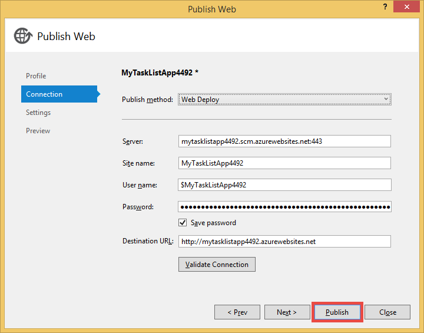

<properties 
    pageTitle="Erstellen Sie eine Web-app in Azure, die mit MongoDB auf einem virtuellen Computer verbunden" 
    description="Ein, die Sie hier wird erklärt, wie Git mithilfe eine app ASP.NET Azure App Dienst bereitstellen Lernprogramm mit MongoDB auf eine Azure-virtuellen Computern verbunden ist."
    tags="azure-portal" 
    services="app-service\web, virtual-machines" 
    documentationCenter=".net" 
    authors="cephalin" 
    manager="wpickett" 
    editor=""/>

<tags 
    ms.service="app-service-web" 
    ms.workload="web" 
    ms.tgt_pltfrm="na" 
    ms.devlang="dotnet" 
    ms.topic="article" 
    ms.date="02/29/2016" 
    ms.author="cephalin"/>

# Erstellen Sie eine Web-app in Azure, die mit MongoDB auf einem virtuellen Computer verbunden

Git verwenden, können Sie eine ASP.NET-Anwendung Azure App Dienst Web Apps bereitstellen. In diesem Lernprogramm werden eine einfache Front-End-ASP.NET-MVC Vorgang Liste erstellen Sie Anwendung, die Verbindung zu einer MongoDB Datenbank auf einem virtuellen Computer in Azure herzustellen.  [MongoDB] [ MongoDB] ist ein gängiger open Source, hohe Leistung NoSQL-Datenbank. Nach dem Ausführen und Testen der Anwendung ASP.NET auf Ihrem Computer, laden Sie die Anwendung auf App-Dienst Web Apps mit Git hoch.

>[AZURE.NOTE] Wenn Sie mit Azure-App-Verwaltungsdienst Schritte vor dem für ein Azure-Konto anmelden möchten, wechseln Sie zu [App-Verwaltungsdienst versuchen](http://go.microsoft.com/fwlink/?LinkId=523751), in dem Sie eine kurzlebige Starter Web app sofort im App-Dienst erstellen können. Keine Kreditkarten erforderlich; keine Zusagen.

## Hintergrund knowledge ##

Kenntnisse über die folgenden eignet sich für dieses Lernprogramm, jedoch nicht erforderlich:

* Der C#-Treiber für MongoDB. Weitere Informationen zur Entwicklung von Applications c# gegen MongoDB, finden Sie im MongoDB [CSharp Sprache Center][MongoC#LangCenter]. 
* ASP .NET Web Application Framework. Sie können alle Informationen finden sie unter der [Website ASP.net]erfahren[ASP.NET].
* ASP .NET MVC Web Application Framework. Lernen Sie, können alle auf der [Website ASP.NET-MVC][MVCWebSite].
* Azure. Sie können erste Schritte bei [Azure]lesen[WindowsAzure].

## Erforderliche Komponenten ##

- [Visual Studio Express 2013 für Web]  [ VSEWeb] oder [Visual Studio 2013] [VSUlt]
- [Azure SDK für .NET](http://go.microsoft.com/fwlink/p/?linkid=323510&clcid=0x409)
- Ein aktives Microsoft Azure-Abonnement

[AZURE.INCLUDE [create-account-and-websites-note](../../includes/create-account-and-websites-note.md)]

 
## Erstellen eines virtuellen Computers und MongoDB installieren ##

In diesem Lernprogramm wird davon ausgegangen, dass Sie einen virtuellen Computer in Azure erstellt haben. Nach dem Erstellen des virtuellen Computers müssen Sie MongoDB des virtuellen Computers zu installieren:

* Zum Erstellen von eines Windows-Computers, und installieren MongoDB, finden Sie unter [Installieren von MongoDB auf einem Computer unter Windows Server in Azure][InstallMongoOnWindowsVM].

Nachdem Sie den virtuellen Computer in Azure erstellt und MongoDB installiert haben, müssen Sie den DNS-Namen des virtuellen Computers (beispielsweise "testlinuxvm.cloudapp.net") und den externen Anschluss für MongoDB Denken Sie daran, die Sie in den Endpunkt angegeben haben.  Sie benötigen diese Informationen später im Lernprogramm.

## Erstellen Sie die Anwendung ##

In diesem Abschnitt eine ASP.NET-Anwendung mit dem Namen "Meine Aufgabenliste" mit Visual Studio erstellen und Ausführen eine anfängliche Bereitstellung bei Azure App Dienst Web Apps. Führen Sie die Anwendung lokal, jedoch werden Herstellen einer Verbindung Ihres virtuellen Computers auf Azure mit und führen Sie dort die MongoDB-Instanz, die Sie erstellt haben.

1. Klicken Sie in Visual Studio auf **Neues Projekt**.

    ![Seite Neues Projekt starten][StartPageNewProject]

1. Klicken Sie im Fenster **Neues Projekt** im linken Bereich Wählen Sie **Visual c#**, und wählen Sie dann auf **Web**. Wählen Sie im mittleren Bereich **ASP.NET Web-Anwendung**. Klicken Sie unten benennen Sie Ihr Projekt "MyTaskListApp", und klicken Sie dann auf **OK**.

    ![Dialogfeld "Neues Projekt"][NewProjectMyTaskListApp]

1. Klicken Sie im Dialogfeld **Neues Projekt von ASP.NET** **MVC**wählen Sie aus, und klicken Sie dann auf **OK**.

    ![Wählen Sie MVC-Vorlage aus.][VS2013SelectMVCTemplate]

1. Wenn Sie bereits in Microsoft Azure angemeldet sind, werden Sie aufgefordert, melden Sie sich an. Melden Sie sich bei Azure befolgen.
2. Sobald Sie angemeldet sind, können Sie das Konfigurieren der App-Dienst Web app starten. Geben Sie die **Web App-Name**, **App-Serviceplan**, **Ressourcengruppe**und **Region**, und klicken Sie auf **Erstellen**.

    

1. Nach dem Projekt Erstellung abgeschlossen ist, warten, bis das Web app im App-Verwaltungsdienst Azure erstellt werden, wie im Fenster **Azure App Dienst Aktivität** angegeben. Klicken Sie dann auf **Veröffentlichen MyTaskListApp jetzt diese Web App**.

1. Klicken Sie auf **Veröffentlichen**.

    

    Sobald die standardmäßige ASP.NET-Anwendung auf Azure App Dienst Web Apps veröffentlicht wird, wird es im Browser gestartet.

## Installieren Sie den MongoDB C#-Treiber

MongoDB bietet clientseitige Unterstützung für c# Applications durch einen Treiber, die auf Ihrem lokalen Computer installieren müssen. Der C#-Treiber ist über NuGet zur Verfügung.

So installieren Sie den MongoDB C#-Treiber

1. Klicken Sie im **Explorer Lösung**mit der rechten Maustaste in des Projekts **MyTaskListApp** , und wählen Sie **NuGetPackages verwalten**.

    ![NuGet-Pakete verwalten][VS2013ManageNuGetPackages]

2. Klicken Sie im Fenster **NuGet-Pakete verwalten** im linken Bereich auf **Online**. Geben Sie im Feld **Suche Online** auf der rechten Seite "mongodb.driver" ein.  Klicken Sie auf **Installieren** , um den Treiber zu installieren.

    ![Suchen nach MongoDB C#-Treiber][SearchforMongoDBCSharpDriver]

3. Klicken Sie auf **ich stimme** zum Annehmen der 10gen, Inc. Lizenzbedingungen.

4. Klicken Sie auf **Schließen** , nachdem der Treiber installiert wurde.
    ![MongoDB C#-Treiber installiert][MongoDBCsharpDriverInstalled]

Der MongoDB C#-Treiber ist nun installiert.  Verweise auf die Bibliotheken **MongoDB.Bson**, **MongoDB.Driver**und **MongoDB.Driver.Core** müssen dem Projekt hinzugefügt wurde.

![Verweise MongoDB C#-Treiber][MongoDBCSharpDriverReferences]

## Hinzufügen eines Modells ##
Klicken Sie im **Explorer Lösung**mit der rechten Maustaste die *Modelle* Ordner und **Hinzufügen** einer neuen **Klasse** , und nennen Sie es *TaskModel.cs*.  Ersetzen Sie in *TaskModel.cs*den vorhandenen Code durch den folgenden Code ein:

    using System;
    using System.Collections.Generic;
    using System.Linq;
    using System.Web;
    using MongoDB.Bson.Serialization.Attributes;
    using MongoDB.Bson.Serialization.IdGenerators;
    using MongoDB.Bson;
    
    namespace MyTaskListApp.Models
    {
        public class MyTask
        {
            [BsonId(IdGenerator = typeof(CombGuidGenerator))]
            public Guid Id { get; set; }
    
            [BsonElement("Name")]
            public string Name { get; set; }
    
            [BsonElement("Category")]
            public string Category { get; set; }
    
            [BsonElement("Date")]
            public DateTime Date { get; set; }
    
            [BsonElement("CreatedDate")]
            public DateTime CreatedDate { get; set; }
    
        }
    }

## Hinzufügen des Data Access Layers ##
**Lösung-Explorer**mit der Maustaste *MyTaskListApp* Projekt- und **Hinzufügen** eines **Neuen Ordner** mit dem Namen *DAL*.  Mit der rechten Maustaste im Ordner *DAL* und **Hinzufügen** einer neuen **Klasse**. Name der Klassendatei *Dal.cs*.  Ersetzen Sie in *Dal.cs*den vorhandenen Code durch den folgenden Code ein:

    using System;
    using System.Collections.Generic;
    using System.Linq;
    using System.Web;
    using MyTaskListApp.Models;
    using MongoDB.Driver;
    using MongoDB.Bson;
    using System.Configuration;
    
    
    namespace MyTaskListApp
    {
        public class Dal : IDisposable
        {
            private MongoServer mongoServer = null;
            private bool disposed = false;
    
            // To do: update the connection string with the DNS name
            // or IP address of your server. 
            //For example, "mongodb://testlinux.cloudapp.net"
            private string connectionString = "mongodb://mongodbsrv20151211.cloudapp.net";
    
            // This sample uses a database named "Tasks" and a 
            //collection named "TasksList".  The database and collection 
            //will be automatically created if they don't already exist.
            private string dbName = "Tasks";
            private string collectionName = "TasksList";
    
            // Default constructor.        
            public Dal()
            {
            }
    
            // Gets all Task items from the MongoDB server.        
            public List<MyTask> GetAllTasks()
            {
                try
                {
                    var collection = GetTasksCollection();
                    return collection.Find(new BsonDocument()).ToList();
                }
                catch (MongoConnectionException)
                {
                    return new List<MyTask>();
                }
            }
    
            // Creates a Task and inserts it into the collection in MongoDB.
            public void CreateTask(MyTask task)
            {
                var collection = GetTasksCollectionForEdit();
                try
                {
                    collection.InsertOne(task);
                }
                catch (MongoCommandException ex)
                {
                    string msg = ex.Message;
                }
            }
    
            private IMongoCollection<MyTask> GetTasksCollection()
            {
                MongoClient client = new MongoClient(connectionString);
                var database = client.GetDatabase(dbName);
                var todoTaskCollection = database.GetCollection<MyTask>(collectionName);
                return todoTaskCollection;
            }
    
            private IMongoCollection<MyTask> GetTasksCollectionForEdit()
            {
                MongoClient client = new MongoClient(connectionString);
                var database = client.GetDatabase(dbName);
                var todoTaskCollection = database.GetCollection<MyTask>(collectionName);
                return todoTaskCollection;
            }
    
            # region IDisposable
    
            public void Dispose()
            {
                this.Dispose(true);
                GC.SuppressFinalize(this);
            }
    
            protected virtual void Dispose(bool disposing)
            {
                if (!this.disposed)
                {
                    if (disposing)
                    {
                        if (mongoServer != null)
                        {
                            this.mongoServer.Disconnect();
                        }
                    }
                }
    
                this.disposed = true;
            }
    
            # endregion
        }
    }

## Fügen Sie einen controller ##
Öffnen Sie die Datei *Controllers\HomeController* in **Lösung-Explorer** , und Ersetzen Sie den Code mit den folgenden:

    using System;
    using System.Collections.Generic;
    using System.Linq;
    using System.Web;
    using System.Web.Mvc;
    using MyTaskListApp.Models;
    using System.Configuration;
    
    namespace MyTaskListApp.Controllers
    {
        public class HomeController : Controller, IDisposable
        {
            private Dal dal = new Dal();
            private bool disposed = false;
            //
            // GET: /MyTask/
    
            public ActionResult Index()
            {
                return View(dal.GetAllTasks());
            }
    
            //
            // GET: /MyTask/Create
    
            public ActionResult Create()
            {
                return View();
            }
    
            //
            // POST: /MyTask/Create
    
            [HttpPost]
            public ActionResult Create(MyTask task)
            {
                try
                {
                    dal.CreateTask(task);
                    return RedirectToAction("Index");
                }
                catch
                {
                    return View();
                }
            }
    
            public ActionResult About()
            {
                return View();
            }
    
            # region IDisposable
    
            new protected void Dispose()
            {
                this.Dispose(true);
                GC.SuppressFinalize(this);
            }
    
            new protected virtual void Dispose(bool disposing)
            {
                if (!this.disposed)
                {
                    if (disposing)
                    {
                        this.dal.Dispose();
                    }
                }
    
                this.disposed = true;
            }
    
            # endregion
    
        }
    }

## Einrichten von Formatvorlagen ##
Um den Titel am oberen Rand der Seite zu ändern, öffnen Sie die *Views\Shared ebenfalls einen\\_Layout.cshtml* Datei **-Explorer Lösung** , und Ersetzen Sie "Name der Anwendung" in der Navigationsleiste Kopfzeile durch "Meine Aufgabe Liste Anwendung", damit sie wie folgt aussieht:

    @Html.ActionLink("My Task List Application", "Index", "Home", null, new { @class = "navbar-brand" })

Akzeptieren, um das Menü Aufgabenliste eingerichtet haben, öffnen Sie die Datei *\Views\Home\Index.cshtml* , und Ersetzen Sie den Code mit den folgenden Code ein:
    
    @model IEnumerable<MyTaskListApp.Models.MyTask>
    
    @{
        ViewBag.Title = "My Task List";
    }
    
    <h2>My Task List</h2>
    
    <table border="1">
        <tr>
            <th>Task</th>
            <th>Category</th>
            <th>Date</th>
            
        </tr>
    
    @foreach (var item in Model) {
        <tr>
            <td>
                @Html.DisplayFor(modelItem => item.Name)
            </td>
            <td>
                @Html.DisplayFor(modelItem => item.Category)
            </td>
            <td>
                @Html.DisplayFor(modelItem => item.Date)
            </td>
            
        </tr>
    }
    
    </table>
    
  @Html.Partial("Create", new MyTaskListApp.Models.MyTask())

Wenn die Möglichkeit zum Erstellen einer neuen Aufgabe hinzufügen möchten, mit der rechten Maustaste im *Views\Home den\\ * Ordner und **Hinzufügen** einer **Ansicht**.  Name der Ansicht *Erstellen*. Ersetzen Sie den Code durch den folgenden Code ein:

    @model MyTaskListApp.Models.MyTask
    
    
    
    
    
    @using (Html.BeginForm("Create", "Home")) {
        @Html.ValidationSummary(true)
        <fieldset>
            <legend>New Task</legend>
    
            

                @Html.LabelFor(model => model.Name)
            

            

                @Html.EditorFor(model => model.Name)
                @Html.ValidationMessageFor(model => model.Name)
            

    
            

                @Html.LabelFor(model => model.Category)
            

            

                @Html.EditorFor(model => model.Category)
                @Html.ValidationMessageFor(model => model.Category)
            

    
            

                @Html.LabelFor(model => model.Date)
            

            

                @Html.EditorFor(model => model.Date)
                @Html.ValidationMessageFor(model => model.Date)
            

    
            

                <input type="submit" value="Create" />
            

        </fieldset>
    }

**Lösung Explorer** sollte wie folgt aussehen:

![Lösung-Explorer][SolutionExplorerMyTaskListApp]

## Legen Sie die Verbindungszeichenfolge MongoDB ##
Öffnen Sie im **Explorer Lösung**die *DAL/Dal.cs* -Datei ein. Suchen Sie die folgende Zeile Code ein:

    private string connectionString = "mongodb://<vm-dns-name>";

Ersetzen Sie `<vm-dns-name>` mit der DNS-Name des virtuellen Computers MongoDB ausgeführt, die Sie im Schritt [Erstellen Sie einen virtuellen Computer, und installieren Sie MongoDB][] dieses Lernprogramms erstellt.  Informationen zum Aufrufen um der DNS-Name des virtuellen Computers zu finden, wechseln Sie zu der Azure-Portal, wählen Sie **virtuellen Computern**und suchen Sie der **DNS-Name**.

Wenn der DNS-Name des virtuellen Computers ist "testlinuxvm.cloudapp.net" und MongoDB den Standardport 27017 hört, wird die Zeichenfolge Verbindungslinie Code aussehen:

    private string connectionString = "mongodb://testlinuxvm.cloudapp.net";

Wenn Sie der Endpunkt des virtuellen Computers einen anderen externen Anschluss für MongoDB gibt an, können Sie angeben der Port in der Verbindungszeichenfolge aus:

    private string connectionString = "mongodb://testlinuxvm.cloudapp.net:12345";

Weitere Informationen über MongoDB Verbindungszeichenfolgen finden Sie unter [Verbindungen][MongoConnectionStrings].

## Testen der lokalen bereitstellungs ##

Wenn Sie die Anwendung auf Ihrem Computer ausführen zu können, wählen Sie im Menü **Debuggen** **Debuggen starten** oder drücken Sie **F5**. IIS Express wird gestartet und ein Browser geöffnet, und startet Homepage der Anwendung.  Sie können eine neue Aufgabe hinzufügen, die zum Ausführen auf Ihrem Computer in Azure MongoDB Datenbank hinzugefügt werden.

![Meine Aufgabe Liste Anwendung][TaskListAppBlank]

## Veröffentlichen Sie auf Azure App-Verwaltungsdienst Web Apps

In diesem Abschnitt werden Sie Ihre Änderungen in Azure App Dienst Web Apps veröffentlichen.

1. Lösung-Explorer mit der rechten Maustaste erneut auf **MyTaskListApp** und dann auf **Veröffentlichen**.
2. Klicken Sie auf **Veröffentlichen**.

    Web app im App-Verwaltungsdienst Azure ausführen und den Zugriff auf die Datenbank MongoDB in Azure virtuellen Computern sollte jetzt angezeigt werden.

## Zusammenfassung ##

Sie haben nun erfolgreich Ihrer Anwendung ASP.NET bei Azure App Dienst Web Apps bereitgestellt. So zeigen Sie die Web app an:

1. Melden Sie sich bei der Azure-Portal.
2. Klicken Sie auf **Web apps**. 
3. Wählen Sie Web app in der **Web Apps** -Liste aus.

Weitere Informationen zur Entwicklung von Applications c# gegen MongoDB, finden Sie unter [CSharp Sprache Center][MongoC#LangCenter]. 

[AZURE.INCLUDE [app-service-web-whats-changed](../../includes/app-service-web-whats-changed.md)]
 

<!-- HYPERLINKS -->

[AzurePortal]: http://manage.windowsazure.com
[WindowsAzure]: http://www.windowsazure.com
[MongoC#LangCenter]: http://docs.mongodb.org/ecosystem/drivers/csharp/
[MVCWebSite]: http://www.asp.net/mvc
[ASP.NET]: http://www.asp.net/
[MongoConnectionStrings]: http://www.mongodb.org/display/DOCS/Connections
[MongoDB]: http://www.mongodb.org
[InstallMongoOnWindowsVM]: ../virtual-machines/virtual-machines-windows-classic-install-mongodb.md
[VSEWeb]: http://www.microsoft.com/visualstudio/eng/2013-downloads#d-2013-express
[VSUlt]: http://www.microsoft.com/visualstudio/eng/2013-downloads

<!-- IMAGES -->

[StartPageNewProject]: ./media/web-sites-dotnet-store-data-mongodb-vm/NewProject.png
[NewProjectMyTaskListApp]: ./media/web-sites-dotnet-store-data-mongodb-vm/NewProjectMyTaskListApp.png
[VS2013SelectMVCTemplate]: ./media/web-sites-dotnet-store-data-mongodb-vm/VS2013SelectMVCTemplate.png
[VS2013DefaultMVCApplication]: ./media/web-sites-dotnet-store-data-mongodb-vm/VS2013DefaultMVCApplication.png
[VS2013ManageNuGetPackages]: ./media/web-sites-dotnet-store-data-mongodb-vm/VS2013ManageNuGetPackages.png
[SearchforMongoDBCSharpDriver]: ./media/web-sites-dotnet-store-data-mongodb-vm/SearchforMongoDBCSharpDriver.png
[MongoDBCsharpDriverInstalled]: ./media/web-sites-dotnet-store-data-mongodb-vm/MongoDBCsharpDriverInstalled.png
[MongoDBCSharpDriverReferences]: ./media/web-sites-dotnet-store-data-mongodb-vm/MongoDBCSharpDriverReferences.png
[SolutionExplorerMyTaskListApp]: ./media/web-sites-dotnet-store-data-mongodb-vm/SolutionExplorerMyTaskListApp.png
[TaskListAppBlank]: ./media/web-sites-dotnet-store-data-mongodb-vm/TaskListAppBlank.png
[WAWSCreateWebSite]: ./media/web-sites-dotnet-store-data-mongodb-vm/WAWSCreateWebSite.png
[WAWSDashboardMyTaskListApp]: ./media/web-sites-dotnet-store-data-mongodb-vm/WAWSDashboardMyTaskListApp.png
[Image9]: ./media/web-sites-dotnet-store-data-mongodb-vm/RepoReady.png
[Image10]: ./media/web-sites-dotnet-store-data-mongodb-vm/GitInstructions.png
[Image11]: ./media/web-sites-dotnet-store-data-mongodb-vm/GitDeploymentComplete.png

<!-- TOC BOOKMARKS -->
[Erstellen eines virtuellen Computers und MongoDB installieren]: #virtualmachine
[Create and run the My Task List ASP.NET application on your development computer]: #createapp
[Create an Azure web site]: #createwebsite
[Deploy the ASP.NET application to the web site using Git]: #deployapp
 