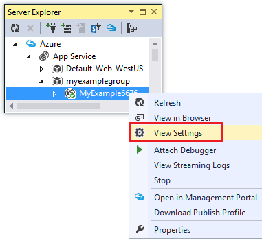
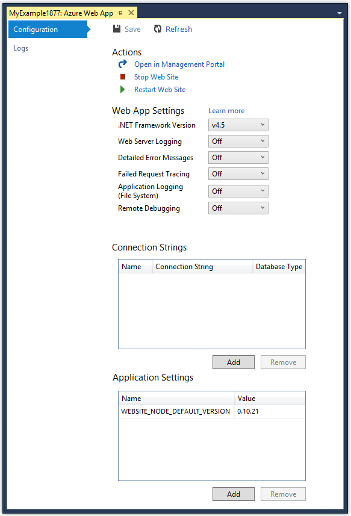
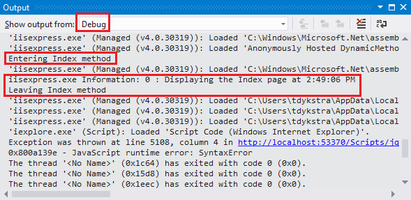
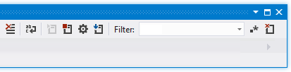
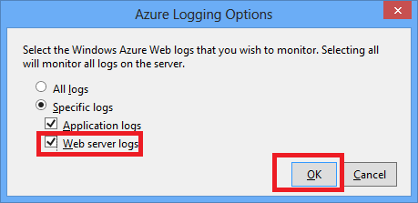
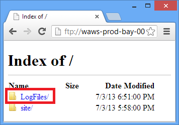

<properties 
    pageTitle="Behandeln von Problemen mit einer Web-app in Azure-App-Verwaltungsdienst mit Visual Studio" 
    description="Informationen Sie zum Behandeln von Problemen mit einer Azure Web app mithilfe der remote Debuggen, verfolgen und Protokollierungstools, die mit Visual Studio 2013 integriert sind." 
    services="app-service" 
    documentationCenter=".net" 
    authors="tdykstra" 
    manager="wpickett" 
    editor=""/>

<tags 
    ms.service="app-service" 
    ms.workload="na" 
    ms.tgt_pltfrm="na" 
    ms.devlang="dotnet" 
    ms.topic="article" 
    ms.date="08/29/2016" 
    ms.author="rachelap"/>

# Behandeln von Problemen mit einer Web-app in Azure-App-Verwaltungsdienst mit Visual Studio

## (Übersicht)

In diesem Lernprogramm erfahren, wie Sie Visual Studio-Tools verwenden, die Ihnen helfen, eine Web app im [App-Dienst](http://go.microsoft.com/fwlink/?LinkId=529714), indem Remote im [Modus Debuggen](http://www.visualstudio.com/get-started/debug-your-app-vs.aspx) ausführen oder Anwendungsprotokolle und Web Serverprotokolle anzeigen Debuggen.

[AZURE.INCLUDE [app-service-web-to-api-and-mobile](../../includes/app-service-web-to-api-and-mobile.md)]

Lernen Sie:

* Welche Azure Web app-Verwaltungsfunktionen in Visual Studio verfügbar sind.
* Informationen zum Visual Studio remote-Ansicht verwenden, um schnell geändert in einer remote-Web app zu gestalten.
* Ausführen von Remote während eines Projekts Debuggen-Modus wird für eine Web app sowohl für eine WebJob in Azure, ausgeführt.
* So erstellen die Anwendung Spur Protokolle, und zeigen Sie sie beim Ausführen der Anwendung wird diese erstellen.
* Zum Anzeigen der Web-Server-Protokolle, einschließlich detaillierte Fehlermeldungen und Fehler bei der Anfrage verfolgen.
* Informationen zum Senden von Diagnoseprotokollen zu einer Azure-Speicher zu berücksichtigen, und zeigen Sie sie es.

Wenn Sie Visual Studio Ultimate verfügen, können Sie auch [IntelliTrace](http://msdn.microsoft.com/library/vstudio/dd264915.aspx) für das Debuggen. IntelliTrace ist nicht in diesem Lernprogramm abgedeckt.

## Erforderliche Komponenten

In diesem Lernprogramm funktioniert mit Entwicklungsumgebung, Project Web und Azure Web-app, die Sie in die [Erste Schritte mit Azure und ASP.NET]eingerichtet[GetStarted]. Nach den Abschnitten WebJobs benötigen Sie die Anwendung, die Sie in die [Erste Schritte mit der Azure WebJobs SDK]erstellen[GetStartedWJ].

In den Codebeispielen in diesem Lernprogramm dargestellt sind für eine Webanwendung c# MVC, aber die Verfahren zur Problembehandlung für Visual Basic- und Web Forms Applications identisch.

Das Lernprogramm wird davon ausgegangen, dass Sie Visual Studio 2015 oder 2013 verwenden. Wenn Sie Visual Studio 2013 verwenden, wird durch die WebJobs-Features erfordern, [Update 4](http://go.microsoft.com/fwlink/?LinkID=510314) oder höher. 

Die Protokolle der streaming feature funktioniert nur für Applikationen, die als .NET Framework 4 oder höher Ziel.

## Web app-Konfiguration und Verwaltung

Visual Studio bietet Zugriff auf eine Teilmenge der Web app-Verwaltungsfunktionen und Konfiguration Einstellungen im [Azure-Portal](http://go.microsoft.com/fwlink/?LinkId=529715)zur Verfügung. In diesem Abschnitt sehen Sie, was mit dem **Server-Explorer**verfügbar ist. Um die neuesten Integrationsfunktionen von Azure angezeigt wird, probieren Sie **Cloud Explorer** auch ein. Sie können beide Fenster im Menü **Ansicht** öffnen. 

1. Wenn Sie bereits in Azure in Visual Studio angemeldet sind, klicken Sie auf die Schaltfläche **mit Azure verbinden** im **Server-Explorer**.

    Eine Alternative ist ein Zertifikat Management zu installieren, die Zugriff auf Ihr Konto aktiviert. Wenn Sie zum Installieren eines Zertifikats auswählen, mit der rechten Maustaste in des **Azure** -Knotens im **Server-Explorer**, und klicken Sie dann im Kontextmenü auf **Verwalten und Filter-Abonnements** . Klicken Sie im Dialogfeld **Azure-Abonnements verwalten** klicken Sie auf die Registerkarte **Zertifikate** , und klicken Sie dann auf **Importieren**. Führen Sie die Anweisungen zum Herunterladen, und klicken Sie dann Importieren einer Abonnementdatei (auch eine *publishsettings* -Datei genannt) für Ihr Konto Azure.

    > [AZURE.NOTE]
    > Wenn Sie eine Abonnementdatei herunterladen, speichern Sie es in einem Ordner außerhalb der Quelle Code Verzeichnisse (beispielsweise im Ordner Downloads), und löschen Sie ihn nach Abschluss des Importvorgangs hat. Ein bösartiger Benutzer, der Zugriff auf die Abonnementdatei Schaden kann bearbeiten, erstellen und löschen Ihre Azure-Dienste.

    Weitere Informationen zum Verbinden mit Azure Ressourcen aus Visual Studio finden Sie unter [Verwalten von Konten, Abonnements, und Administrative Rollen](http://go.microsoft.com/fwlink/?LinkId=324796#BKMK_AccountVCert).

2. Klicken Sie in **Server-Explorer**erweitern Sie **Azure** und **App-Dienst**.

3. Erweitern Sie die Ressourcengruppe aus, die das Web app enthält, die Sie in die [Erste Schritte mit Azure und ASP.NET]erstellt[GetStarted], und klicken Sie dann mit der rechten Maustaste in des Knoten Web-app aus, und klicken Sie auf **Einstellungen für die Ansicht**.

    

    Die Registerkarte **Azure Web App** wird angezeigt, und sehen Sie es im Web app Verwaltung und Konfiguration Aufgaben, die in Visual Studio verfügbar sind.

    

    In diesem Lernprogramm können Sie die Protokollierung und Tracing-Dropdownlisten verwenden. Sie werden auch für remote Debuggen verwendet, aber Sie werden eine andere Methode verwenden, um ihn zu aktivieren.
   
    Informationen über die Einstellungen für die App und Verbindungszeichenfolgen Felder in diesem Fenster finden Sie unter [Azure Web Apps: wie Anwendung Zeichenfolgen und Verbindung Zeichenfolgen Arbeit](http://blogs.msdn.com/b/windowsazure/archive/2013/07/17/windows-azure-web-sites-how-application-strings-and-connection-strings-work.aspx).

    Wenn eine Web app Management-Aufgabe ausführen möchten, die in diesem Fenster nicht möglich sein soll, klicken Sie auf **im Verwaltungsportal öffnen** , um ein Browserfenster Azure-Portal zu öffnen.

## Access Web app-Dateien im Server-Explorer

Sie normalerweise bereitstellen ein Projekts mit den `customErrors` Kennzeichnung in der Datei Web.config, legen Sie auf `On` oder `RemoteOnly`, was bedeutet, dass Sie eine hilfreich beim eines Beitrags Fehlermeldung nicht geklappt wechselt. Viele Fehler werden lediglich eine Seite wie eine der folgenden Probleme.

**Serverfehler in der Anwendung '/':**

**Ein Fehler ist aufgetreten:**

**Die Website kann nicht die Seite angezeigt werden.**

Häufig ist die einfachste Möglichkeit, die Ursache des Fehlers finden So aktivieren Sie ausführliche Fehlermeldungen, die der ersten von der vorhergehenden Screenshots wird erläutert, wie Sie vorgehen müssen. Die muss in der bereitgestellten Web.config-Datei geändert werden. Können Sie die Datei *Web.config* im Projekt bearbeiten und erneut bereitstellen des Projekts, oder Erstellen einer [Web.config transformieren](http://www.asp.net/mvc/tutorials/deployment/visual-studio-web-deployment/web-config-transformations) und Bereitstellen einer Debuggen erstellen, aber es gibt eine schnellere Möglichkeit: in **Lösung Explorer** Sie direkt anzeigen und Bearbeiten von Dateien in der remote-Web app mithilfe des *remote-Ansicht* Features können.

1. Im **Server-Explorer**erweitern Sie **Azure**, erweitern Sie die **App-Dienst**, erweitern Sie die Ressourcengruppe aus, der die Web-app in befindet, und dann den Knoten für Ihre Web app.

    Knoten, mit denen Sie Zugriff auf Inhalte und Protokolldateien des Web-app angezeigt.

2. Erweitern Sie den Knoten **Dateien** , und doppelklicken Sie auf die Datei *Web.config* .

    

    Visual Studio öffnet die Datei Web.config des remote Web app und zeigt [Remote] neben dem Dateinamen in der Titelleiste.

3. Fügen Sie folgende Zeile in der `system.web` Element:

    `<customErrors mode="Off"></customErrors>`

    

4. Aktualisieren Sie den Browser, der die Fehlermeldung angezeigt wird, und Sie nun eine detaillierte Fehlermeldung wie im folgenden Beispiel werden:

    

    (Der Fehler angezeigt wurde erstellt, indem Sie die Zeile für *Views\Home\Index.cshtml*in Rot angezeigt.)

Bearbeiten der Datei Web.config ist nur ein Beispiel für Szenarien, in denen die Möglichkeit zum Lesen und Bearbeiten von Dateien auf Ihrer Azure Web app stellen vereinfachte Problembehandlung.

## Remote Debuggen Web apps

Wenn die ausführliche Fehlermeldung nicht genügend Informationen bereitstellen und den Fehler lokal können keine neu erstellt werden, ist eine weitere Möglichkeit zum Behandeln von Problemen mit Remote im Debuggen-Modus ausgeführt. Sie können Haltepunkte, Arbeitsspeicher direkt bearbeitet, Code durchgehen, und ändern Sie auch den Codepfad. 

Remote Debuggen funktioniert nicht in Express-Editionen von Visual Studio.

In diesem Abschnitt wird das Debuggen Remote mithilfe des Projekts, das Sie, in die [Erste Schritte mit Azure und ASP.NET erstellen][GetStarted].

1. Öffnen Sie das Webprojekt, die Sie in die [Erste Schritte mit Azure und ASP.NET]erstellt[GetStarted].

1. Öffnen Sie *Controllers\HomeController*.

2. Löschen der `About()` Methode und Einfügen die folgenden in seine Position Code.

        public ActionResult About()
        {
            string currentTime = DateTime.Now.ToLongTimeString();
            ViewBag.Message = "The current time is " + currentTime;
            return View();
        }

2. [Festlegen einer fortzuschreiten](http://www.visualstudio.com/get-started/debug-your-app-vs.aspx) auf die `ViewBag.Message` Linie.

1. Im- **Lösung-Explorer**mit der rechten Maustaste in des Projekts, und klicken Sie auf **Veröffentlichen**.

2. Wählen Sie in der Dropdown-Liste **Profil** aus dem Profil identisch, die Sie in die [Erste Schritte mit Azure und ASP.NET]verwendet[GetStarted].

3. Klicken Sie auf der Registerkarte **Einstellungen** ändern Sie **Konfiguration** **Debuggen**, und klicken Sie dann auf **Veröffentlichen**.

    

4. Nach der Bereitstellung beendet hat und Ihr Browser zur Azure URL des Web app geöffnet wird, schließen Sie den Browser.

5. Im **Server-Explorer**mit der rechten Maustaste Web app, und klicken Sie dann auf **Debugger anfügen**. 

    

    Zur Startseite Ihrer in Azure ausgeführt wird automatisch im Browser geöffnet. Möglicherweise müssen warten, bis 20 Sekunden oder dies legt Azure Einrichten des Servers für das Debuggen. Diese Verzögerung tritt nur beim ersten, die Sie auf eine Web app im Debuggen-Modus ausgeführt werden. Nachfolgende Zeiten innerhalb der nächsten 48 Stunden beim start Debuggen erneut es können eine Verzögerung nicht.

    **Hinweis:** Wenn Sie Probleme beim Starten des Debuggers haben, versuchen Sie mithilfe der **Cloud Explorer** statt des **Server-Explorers**erledigen.

6. Klicken Sie auf das Menü **zu** .

    Visual Studio auf die fortzuschreiten beendet, und der Code in Azure, die sich nicht auf Ihrem lokalen Computer ausgeführt wird.

7. Zeigen Sie auf die `currentTime` Variable, um den Zeitwert anzuzeigen.

    

    Die Zeit, die angezeigt, wird der Azure Server-Zeit, die möglicherweise in einer anderen Zeitzone als Ihrem lokalen Computer.

8. Geben Sie einen neuen Wert für die `currentTime` Variable, wie etwa "Jetzt in Azure ausgeführt".

5. Drücken Sie F5, um weiterhin ausgeführt werden.

    Die Seite "Info" in Azure ausgeführt zeigt den neuen Wert ein, den Sie in die Variable CurrentTime eingegeben haben.

    

## Remote Debuggen WebJobs

Dieser Abschnitt listet das Debuggen Remote mit Project und Web app, die Sie in die [Erste Schritte mit der Azure WebJobs SDK](websites-dotnet-webjobs-sdk.md)erstellen. 

In diesem Abschnitt dargestellten Features sind nur in Visual Studio 2013 mit Update 4 oder höher verfügbar. 

Remote Debuggen funktioniert nur mit fortlaufender WebJobs. Geplante und bei Bedarf WebJobs Unterstützung keine für das Debuggen von.

1. Öffnen Sie das Webprojekt, die Sie in die [Erste Schritte mit der Azure WebJobs SDK]erstellt[GetStartedWJ].

1. Öffnen Sie im Projekt ContosoAdsWebJob *Functions.cs*ein.

2. Klicken Sie auf die erste Anweisung in [einem fortzuschreiten festlegen](http://www.visualstudio.com/get-started/debug-your-app-vs.aspx) der `GnerateThumbnail` Methode.

    

1. Im- **Lösung-Explorer**mit der rechten Maustaste in die Project Web (nicht das Projekt WebJob), und klicken Sie auf **Veröffentlichen**.

2. Wählen Sie in der Dropdown-Liste **Profil** das Profil identisch, das Sie in die [Erste Schritte mit der Azure WebJobs SDK](websites-dotnet-webjobs-sdk.md)verwendet.

3. Klicken Sie auf der Registerkarte **Einstellungen** ändern Sie **Konfiguration** **Debuggen**, und klicken Sie dann auf **Veröffentlichen**.

    Visual Studio bereitstellt, im Web und WebJob Projekte und Ihr Browser zur Azure URL des Web app geöffnet.

5. Erweitern Sie im **Server-Explorer** **Azure > App-Dienst > der Ressourcengruppe > Web app > WebJobs > fortlaufend**, und klicken Sie dann auf **ContosoAdsWebJob**.

7. Klicken Sie auf **Debugger anfügen**. 

    

    Zur Startseite Ihrer in Azure ausgeführt wird automatisch im Browser geöffnet. Möglicherweise müssen warten, bis 20 Sekunden oder dies legt Azure Einrichten des Servers für das Debuggen. Diese Verzögerung tritt nur beim ersten, die Sie auf eine Web app im Debuggen-Modus ausgeführt werden. Das nächste Mal Sie die es Debuggen kann einer kurzen Verzögerung nicht, wenn Sie innerhalb von 48 Stunden dies tun.

6. Erstellen Sie in den Webbrowser, der zur Homepage von Contoso Werbung geöffnet ist eine neue Anzeige aus. 

    Erstellen einer Ad bewirkt, dass eine Warteschlange Nachricht erstellt werden, die durch die WebJob übernommen und verarbeitet werden. Wenn das WebJobs SDK die Funktion zum Verarbeiten der Nachricht Warteschlange aufgerufen wird, erreicht der Code Ihrer fortzuschreiten.

7. Wenn bei der fortzuschreiten unterbricht, können Sie untersuchen und Variablenwerten ändern, während das Programm die Cloud ausgeführt wird. In der folgenden Abbildung zeigt der Debugger den Inhalt des BlobInfo-Objekts, das an die Methode GenerateThumbnail übergeben wurde.

    
 
5. Drücken Sie F5, um weiterhin ausgeführt werden.

    Der GenerateThumbnail-Methode abgeschlossen ist, erstellen die Miniaturansicht.

6. Aktualisieren Sie die Index-Seite im Browser und die Miniaturansicht angezeigt.

6. Drücken Sie in Visual Studio UMSCHALT + F5 beenden aus.

7. Im **Server-Explorer**mit der rechten Maustaste in des Knotens ContosoAdsWebJob, und klicken Sie auf **Ansicht Dashboard**.

8. Melden Sie sich mit Ihrer Azure Anmeldeinformationen, und klicken Sie dann auf den Namen WebJob, um zu der Seite für Ihre WebJob zu wechseln. 

    

    Das Dashboard zeigt, dass die GenerateThumbnail Funktion zuletzt ausgeführt.

    (Das nächste Mal Sie klicken Sie auf **Ansicht Dashboard**, müssen Sie nicht anmelden und im Browser, die direkt auf der Seite für Ihre WebJob geht).

9. Klicken Sie auf den Funktionsnamen, um Details zur Ausführung Funktion anzuzeigen.

    

Wenn Ihre Funktion, [Protokolle geschrieben](websites-dotnet-webjobs-sdk-storage-queues-how-to.md#logs)ist, Sie auf **ToggleOutput** damit befassen konnte.

## Hinweise zu remote Debuggen

* Im Modus Debuggen von Herstellung ausgeführt wird nicht empfohlen. Wenn die Herstellung Web app nicht auf mehrere Instanzen, skaliert wird, wird für das Debuggen Webserver verhindern, dass andere Besprechungsanfragen beantworten. Wenn Sie mehrere Instanzen von Web-Server verfügen, wenn Sie den Debugger anfügen erhalten Sie eine zufällige Instanz, und Sie haben keine Möglichkeit, um sicherzustellen, dass diese Instanz nachfolgende Browseranforderungen gehen. Darüber hinaus Sie kein Debuggen erstellen in der Regel bereitstellen, für die Herstellung und Compiler Optimierungen für Releasebuilds möglicherweise machen Sie es nicht möglich, was passiert in Ihrem Quellcode zeilenweise anzeigen. Für die Problembehandlung bei der Herstellung, ist die beste Ressource Anwendung von Protokollen Tracing und Web-Server.

* Vermeiden Sie lange Stopps an Haltepunkten beim remote Debuggen. Azure behandelt ein Prozesses, das länger als ein paar Minuten als nicht reagiert Prozess angehalten und schließt ihn an.

* Während Sie testen, ist der Server Daten in Visual Studio senden die Bandbreite Gebühren beeinflussen könnten. Informationen zu Bandbreite Sätzen finden Sie unter [Azure Preise](/pricing/calculator/).

* Stellen Sie sicher, dass die `debug` Attribut für die `compilation` Element in der Datei *Web.config* festgelegt ist true. Ist standardmäßig beim Veröffentlichen einer Debugbuildkonfiguration true.

        <system.web>
          <compilation debug="true" targetFramework="4.5" />
          <httpRuntime targetFramework="4.5" />
        </system.web>

* Wenn Sie feststellen, dass der Debugger Code schrittweise wird nicht, die Sie debuggen möchten, müssen Sie die Einstellung nur mein Code zu ändern.  Weitere Informationen finden Sie unter [Zeit, um nur mein Code einschränken](http://msdn.microsoft.com/library/vstudio/y740d9d3.aspx#BKMK_Restrict_stepping_to_Just_My_Code).

* Ein Zeitgeber startet auf dem Server nach 48 Stunden das Feature wird automatisch deaktiviert, wenn Sie Aktivieren des remote Debuggen Features. Dieser Grenzwert 48 Stunden ist Gründen der Sicherheit und Leistung abgeschlossen. Sie können einfach die Funktion wieder einschalten beliebig viele wiederholt. Es empfiehlt sich, sodass das Feld deaktiviert, wenn Sie nicht aktiv Debuggen.

* Sie können manuell die zu einem beliebigen Prozess, nicht nur die Web app-Prozess (w3wp.exe) Debuggen. Weitere Informationen dazu, wie Sie in Visual Studio Debuggen-Modus verwenden finden Sie unter [Debuggen in Visual Studio](http://msdn.microsoft.com/library/vstudio/sc65sadd.aspx).

## Diagnoseprotokolle (Übersicht)

Eine ASP.NET-Anwendung, die in einer Azure Web app ausgeführt wird, kann die folgenden Arten von Protokolle erstellen:

* **Anwendung Tracing Protokolle** 
  Die Anwendung erstellt diese Protokolle, indem er Methoden der [System.Diagnostics.Trace](http://msdn.microsoft.com/library/system.diagnostics.trace.aspx) -Klasse.
* **Web Serverprotokolle** 
  Der Webserver erstellt einen Eintrag für jede HTTP-Anforderung an das Web app an.
* **Ausführliche Nachricht Fehlerprotokolle** 
  Der Webserver erstellt eine HTML-Seite mit einige zusätzliche Informationen für Fehler beim HTTP-Anfragen (die Status des Codes 400 oder höher). 
* **Fehler bei der Anfrage verfolgen von Protokollen** 
  Der Webserver erstellt eine XML-Datei mit detaillierten Protokollierungsinformationen für Fehler beim HTTP-Anfragen. Der Webserver enthält auch eine XSL-Datei, um die XML-Daten in einem Browser zu formatieren.
  
Protokollierung wirkt sich auf Web app der Systemleistung, damit Azure Sie die Möglichkeit zum Aktivieren oder Deaktivieren jede Art von Protokoll bietet Bedarf. Für die Anwendungsprotokolle können Sie angeben, dass nur die Protokolle über ein gewisses schwere geschrieben werden soll. Wenn Sie eine neue Web-app, standardmäßig alle Protokollierung erstellen ist deaktiviert.

Protokolle werden in Dateien in einem Ordner *log-Dateien* im Dateisystem der Web app geschrieben und über FTP zugegriffen werden kann. Web Serverprotokolle und Anwendungsprotokolle können auch mit einer Firma Azure-Speicher geschrieben werden. Behalten Sie größere Mengen von Protokollen in einem Speicherkonto als im Dateisystem möglich ist. Sie sind auf bis zu 100 MB Protokolle beschränkt, wenn Sie das Dateisystem verwenden. (Datei Systemprotokolle sind nur für kurzfristig Aufbewahrungsrichtlinien. Azure Löscht alte Protokolldateien, um Platz für neue Berichte, nachdem dieser Wert erreicht ist.)  

## Erstellen und Anzeigen der Überwachungsprotokolle Anwendung

In diesem Abschnitt werden Sie die folgenden Aufgaben ausführen:

* Hinzufügen von gezeichnet, die Anweisungen des Web-Projekts, das Sie in die [Erste Schritte mit Azure und ASP.NET]erstellt[GetStarted].
* Zeigen Sie die Protokolle an, wenn Sie das Projekt lokal ausführen.
* Zeigen Sie die Protokolle aus, wie sie durch die Anwendung in Azure ausgeführt generiert werden. 

Finden Sie Informationen zum Erstellen der Anwendung in WebJobs protokolliert, [zum Arbeiten mit Azure Warteschlangenspeicher mithilfe des WebJobs-SDK - Protokolle Schreiben von](websites-dotnet-webjobs-sdk-storage-queues-how-to.md#logs). Die folgenden Anweisungen für die Anzeige von Protokollen und steuern, wie sie in Azure gespeichert sind gelten auch für Anwendungsprotokolle erstellte WebJobs. 

### Hinzufügen von gezeichnet, die Anweisungen zur Anwendung

1. *Controllers\HomeController*öffnen, und Ersetzen Sie die `Index`, `About`, und `Contact` Methoden mit den folgenden Code ein, und fügen Sie `Trace` Anweisungen und eine `using` -Anweisung für `System.Diagnostics`:

        public ActionResult Index()
        {
            Trace.WriteLine("Entering Index method");
            ViewBag.Message = "Modify this template to jump-start your ASP.NET MVC application.";
            Trace.TraceInformation("Displaying the Index page at " + DateTime.Now.ToLongTimeString());
            Trace.WriteLine("Leaving Index method");
            return View();
        }
        
        public ActionResult About()
        {
            Trace.WriteLine("Entering About method");
            ViewBag.Message = "Your app description page.";
            Trace.TraceWarning("Transient error on the About page at " + DateTime.Now.ToShortTimeString());
            Trace.WriteLine("Leaving About method");
            return View();
        }
        
        public ActionResult Contact()
        {
            Trace.WriteLine("Entering Contact method");
            ViewBag.Message = "Your contact page.";
            Trace.TraceError("Fatal error on the Contact page at " + DateTime.Now.ToLongTimeString());
            Trace.WriteLine("Leaving Contact method");
            return View();
        }       

2. Hinzufügen eines `using System.Diagnostics;` -Anweisung an den Anfang der Datei.
                
### Die Ausgabe der Tracing lokal anzeigen

3. Drücken Sie F5, um die Anwendung im Debuggen-Modus ausgeführt.

    Der standardmäßige Ablaufverfolgungslistener schreibt alle Spur Ausgabe im **Ausgabefenster** angezeigt, zusammen mit anderen Debuggen Ausgabe an. Die folgende Abbildung zeigt die Ausgabe der Spur-Anweisungen, die Sie hinzugefügt haben die `Index` Methode.

    

    Die folgenden Schritte zeigen, wie Spur Ausgabe in eine Webseite anzeigen, ohne Kompilierung im Debuggen-Modus.

2. Öffnen Sie die Anwendung Web.config-Datei (diejenige befindet sich im Ordner Projekts) und Hinzufügen einer `<system.diagnostics>` Element am Ende der Datei unmittelbar vor dem schließenden `</configuration>` Element:

        <system.diagnostics>
            <trace>
              <listeners>
                <add name="WebPageTraceListener"
                    type="System.Web.WebPageTraceListener, 
                    System.Web, 
                    Version=4.0.0.0, 
                    Culture=neutral,
                    PublicKeyToken=b03f5f7f11d50a3a" />
              </listeners>
            </trace>
          </system.diagnostics>

    Die `WebPageTraceListener` Hier können Sie Ausgabe verfolgen, indem Sie auf `/trace.axd`.

3. Fügen Sie ein <a href="http://msdn.microsoft.com/library/vstudio/6915t83k(v=vs.100).aspx">Element Spur</a> unter `<system.web>` in der Datei Web.config, wie im folgenden Beispiel:

        <trace enabled="true" writeToDiagnosticsTrace="true" mostRecent="true" pageOutput="false" />

3. Drücken Sie STRG + F5, um die Anwendung ausführen.

4. Klicken Sie in der Adressleiste des Browserfensters fügen Sie *trace.axd* zur URL hinzu, und drücken Sie dann die EINGABETASTE (die URL werden ähnlich wie Http://localhost:53370/trace.axd).

5. Klicken Sie auf der Seite **Anwendung Spur** in der ersten Zeile (nicht die Zeile BrowserLink) auf **Details anzeigen** .

    

    Die Seite **Details anfordern** angezeigt wird, und im Abschnitt **Spur Informationen** erhalten Sie die Ausgabe aus der Spur Anweisungen, die Sie hinzugefügt haben die `Index` Methode.

    

    Standardmäßig `trace.axd` steht nur lokal zur Verfügung. Wenn Sie es aus einer remote Web app zur Verfügung stellen möchten, können Sie hinzufügen `localOnly="false"` zu den `trace` Element in der Datei *Web.config* , wie im folgenden Beispiel gezeigt:

        <trace enabled="true" writeToDiagnosticsTrace="true" localOnly="false" mostRecent="true" pageOutput="false" />

    Aktivieren, werden `trace.axd` bei einem Web-app ist im Allgemeinen nicht empfohlen aus Gründen der Sicherheit und in den folgenden Abschnitten finden Sie einfacher zu lesen gezeichnet, die Protokolle in einer Azure Web app.

### Die Ausgabe der Protokollierung in Azure anzeigen

1. Mit der rechten Maustaste in die Project Web **Lösung-Explorer**und klicken Sie auf **Veröffentlichen**.

2. Klicken Sie im Dialogfeld **Web veröffentlichen** auf **Veröffentlichen**.

    Nachdem Visual Studio Ihre Update veröffentlicht, einem Browserfenster zu Ihrer Startseite (vorausgesetzt, dass Sie die **Ziel-URL** auf der Registerkarte **Verbindung** löschen haben) wird geöffnet.

3. Klicken Sie in **Server-Explorer**mit der rechten Maustaste Web app, und wählen Sie **Streaming Protokolle anzeigen**. 

    

    Im **Ausgabefenster** angezeigt wird, dass Sie mit der Log-streaming-Dienst verbunden sind, und eine Benachrichtigung Linie pro Minute, die ohne ein Protokoll fügt anzuzeigenden voranschreitet.

    

4. Klicken Sie im Browserfenster, in dem der Anwendung-Startseite angezeigt auf **Kontakt**.

    Die Ausgabe der Fehler Ebene in ein paar Sekunden verfolgen Sie hinzugefügt der `Contact` Methode, die im **Ausgabefenster** angezeigt wird.

    

    Visual Studio wird nur auf Fehler Ebene angezeigt werden, da dies die Standardeinstellung ist, wenn Sie das Protokoll Dienst Überwachung aktivieren. Wenn Sie eine neue Azure Web app erstellen, ist alle Protokollierung standardmäßig deaktiviert, wie Sie gesehen haben, wenn Sie die Einstellungsseite zuvor geöffnet haben:

    

    Wenn jedoch Sie **Streaming Protokolle anzeigen**ausgewählt haben, geändert Visual Studio automatisch **Anwendung Logging(File System)** auf **Fehler**, was bedeutet, dass Fehler Ebene Protokolle gemeldet werden. Damit alle Ihre Tracing Protokolle angezeigt wird, können Sie diese Einstellung in **ausführlich**ändern. Wenn Sie eine schwere Ebene niedriger als Fehler auswählen, werden alle Protokolle für besseren schwere auch gemeldet. Ja, wenn Sie ausführliche auswählen, wird auch Informationen, Warnung und Fehlerprotokolle.  

4. Im **Server-Explorer**mit der rechten Maustaste im Web app, und klicken Sie dann auf **Einstellungen für die Ansicht** wie zuvor.

5. Ändern Sie die **Anwendung Protokollierung (File System)** in **ausführlich**, und klicken Sie dann auf **Speichern**.
 
    

6. Klicken Sie im Browserfenster, das nun auf Ihrer Seite " **Kontakt** " angezeigt wird auf **Start**, und klicken Sie auf **Info**, und klicken Sie auf **Kontakt**.

    Innerhalb weniger Sekunden zeigt im **Ausgabefenster** aller Ihrer Ausgabe Tracing.

    

    In diesem Abschnitt aktiviert und deaktiviert Protokollierung mithilfe von Azure Web app-Einstellungen. Sie können auch aktivieren und deaktivieren Ablaufverfolgungslistener, indem Sie der Datei Web.config. Ändern der Datei Web.config bewirkt jedoch, dass die app-Domäne freizugebenden beim Aktivieren der Protokollierung über die Konfiguration des Web-app kann, die nicht. Wenn das Problem zu reproduzieren, lange dauert oder bei unterbrochener, Wiederverwendung der app-Domäne möglicherweise "beheben" und erzwingen Sie warten, bis es wieder auftritt. Aktivieren der Diagnose in Azure dazu nicht, damit Fehlerinformationen sofort erfassen begonnen werden kann.

### Funktionen für die Ausgabe-Fensters

Die Registerkarte **Azure-Protokolle** im **Ausgabefenster** weist verschiedene Schaltflächen und ein Textfeld an:

Diese führen Sie die folgenden Funktionen:

* Deaktivieren Sie im **Ausgabefenster** angezeigt.
* Aktivieren Sie oder deaktivieren Sie der Zeilenumbruch.
* Starten Sie und beenden Sie die Überwachung von Protokollen.
* Geben Sie an, die für überwachen protokolliert.
* Herunterladen von Protokollen an.
* Filtern Sie Protokolle basierend auf einer Suchzeichenfolge oder einen regulären Ausdruck ein.
* Schließen Sie im **Ausgabefenster** angezeigt.

Wenn Sie einen Suchbegriff oder reguläre Ausdrücke eingeben, filtert Visual Studio Protokollierungsinformationen auf dem Client. Dies bedeutet, dass Sie die Kriterien eingeben können, nachdem die Protokolle im **Ausgabefenster** angezeigt werden und Sie Filterkriterien ändern können, ohne die Protokolle neu erstellen.

## Web Server-Protokolle anzeigen

Web Serverprotokolle aufzeichnen alle HTTP-Aktivität für das Web app an. Um diese im **Ausgabefenster** angezeigt, müssen Sie für das Web app zu aktivieren, und teilen Sie Visual Studio, die sie überwachen möchten. 

1. Die **Konfiguration von Azure Web App** -Registerkarte, die Sie vom **Server-Explorer**geöffnet ändern Sie Web Server Protokollierung **auf**, und klicken Sie dann auf **Speichern**.

    

2. Klicken Sie im **Ausgabefenster** auf die Schaltfläche **angeben, dem Azure protokolliert um zu überwachen** .
    
    

3. Klicken Sie im Dialogfeld **Azure Protokollierungsoptionen** wählen Sie **Web-Server-Protokolle**, und klicken Sie dann auf **OK**.

    

4. Klicken Sie im Browserfenster, in dem die Web app angezeigt auf **Start**, und klicken Sie auf **Info**, und klicken Sie dann auf **Kontakt**.

    Die Anwendungsprotokolle im Allgemeinen zuerst angezeigt, gefolgt von Protokolle für das Web-Server. Sie müssen möglicherweise warten Sie eine Weile für die Protokolle angezeigt werden. 

    

Wenn Sie Web Serverprotokolle zuerst aktivieren, indem Sie mit Visual Studio, schreibt Azure standardmäßig die Protokolle im Dateisystem. Alternativ können Sie Azure-Portal dieser Webserver angeben, die Protokolle zu einem Container Blob in einem Speicherkonto geschrieben werden sollen.

Wenn Sie mithilfe von im Portal Webserver mit einer Firma Azure-Speicher Protokollierung aktivieren und deaktivieren Sie dann werden die Protokollierung in Visual Studio, wenn Sie die Protokollierung in Visual Studio erneut aktivieren Einstellungen für Ihr Konto Speicher wiederhergestellt. 

## Zeigen Sie detaillierter Nachricht Fehlerprotokolle an

Ausführliche Fehlerprotokolle bieten ergänzenden Informationen HTTP-Anfragen, die Fehlercodes Antwort (400 oder höher) führen. Um diese im **Ausgabefenster** angezeigt, müssen Sie für das Web app zu aktivieren, und teilen Sie Visual Studio, die sie überwachen möchten.

1. Die **Konfiguration von Azure Web App** -Registerkarte, die Sie vom **Server-Explorer**geöffnet ändern Sie **Detaillierte Fehlermeldungen** zu **auf**, und klicken Sie dann auf **Speichern**.

    

2. Klicken Sie im **Ausgabefenster** auf die Schaltfläche **angeben, dem Azure protokolliert um zu überwachen** .

3. Klicken Sie im Dialogfeld **Azure Protokollierungsoptionen** klicken Sie auf **alle Protokolle**, und klicken Sie dann auf **OK**.

    

4. Fügen Sie ein zusätzliches Zeichen in der Adressleiste des Browserfensters zur URL verursachen Fehler 404 (z. B. `http://localhost:53370/Home/Contactx`), und drücken Sie die EINGABETASTE.

    Angezeigt wird nach mehreren Sekunden Fehlerprotokolls für die detaillierte im Visual Studio- **Ausgabe** angezeigt.

    

    Ctrl + Klicken Sie auf den Link, um die Logausgabe in einem Browser formatiert finden Sie unter:

    

## Herunterladen der Datei Systemprotokolle

Alle Protokolle, die Sie im **Ausgabefenster** überwachen können können auch als *ZIP* -Datei heruntergeladen werden. 

1. Klicken Sie im **Ausgabefenster** auf **Streaming Protokolle herunterladen**.

    

    Datei-Explorer wird in den Ordner *Downloads* mit der ausgewählten heruntergeladene Datei geöffnet.

    

2. Extrahieren der *ZIP-* Datei, und Sie sehen die folgende Ordnerstruktur:

    

    * Anwendung Tracing Protokolle werden in *txt* -Dateien in den Ordner *LogFiles\Application* .
    * Web Serverprotokolle sind in der *Log* -Dateien im Ordner *LogFiles\http\RawLogs* . Sie können ein Tools, wie z. B. [Log Parser](http://www.microsoft.com/download/details.aspx?displaylang=en&id=24659) anzeigen und bearbeiten diese Dateien.
    * Ausführliche Nachricht Fehlerprotokolle werden in *HTML* -Dateien in den Ordner *LogFiles\DetailedErrors* .

    (Der Ordner *Bereitstellungen* gilt für Dateien, die Datenquellen-Steuerelements veröffentlichen; erstellte keinen nichts im Zusammenhang mit Visual Studio für die Veröffentlichung. Der Ordner *Git* wendet im Zusammenhang mit Datenquellen-Steuerelements auf Veröffentlichung und das Protokoll Datei streaming Service.)  

## Anzeigen von Protokollen Speicher

Anwendung Tracing Protokolle können auch mit einer Firma Azure-Speicher gesendet werden, und Sie können sie in Visual Studio anzeigen. Zum Ausführen, Sie ein Speicherkonto erstellen aktivieren Sie Speicher von Protokollen in der klassischen Portal, und zeigen Sie sie auf der Registerkarte **Protokolle** **Azure Web App** -Fenster.

Sie können Protokolle an einige oder alle der drei Ziele senden:

* Das Dateisystem.
* Tabellen für Speicher-Konto.
* Blobs für Speicher-Konto.

Sie können eine andere schwere Ebene für jedes Ziel angeben. 

Tabellen erleichtern die Details der Protokolle online anzeigen und streaming unterstützen; können Sie Abfragen von Protokollen in Tabellen und finden Sie unter neue Protokolle, während der Erstellung sind. BLOBs ganz einfach von Protokollen in Dateien herunterzuladen und zu analysieren, verwenden HDInsight, da HDInsight zum Arbeiten mit Blob-Speicher bekannt ist. Weitere Informationen finden Sie unter **Hadoop und MapReduce** in [Datenspeicheroptionen (Gebäude praktisches Cloud Apps mit Azure)](http://www.asp.net/aspnet/overview/developing-apps-with-windows-azure/building-real-world-cloud-apps-with-windows-azure/data-storage-options).

Sie haben derzeit Datei Systemprotokolle zu ausführlichen Ebene festlegen; die folgenden Schritte aus, die Sie einrichten Ebene Protokolle Informationen zu Tabellen für Speicher-Konto wechseln durchgehen. Informationsebene bedeutet, dass alle Protokolle aufrufen erstellte `Trace.TraceInformation`, `Trace.TraceWarning`, und `Trace.TraceError` wird angezeigt, aber nicht erstellt, indem Protokolle `Trace.WriteLine`.

Speicherkonten bieten mehr Speicher und mehr dauerhaften Aufbewahrungsrichtlinien für Protokolle im Dateisystem verglichen. Ein weiterer Vorteil des Sendens von Anwendung Tracing Protokolle an Speicher ist, dass Sie einige zusätzliche Informationen für jedes Protokoll erhalten, die Sie nicht aus Datei Systemprotokolle erhalten.

5. Mit der rechten Maustaste **Speicher** unter dem Azure Knoten, und klicken Sie dann auf **Speicher-Konto erstellen**.

3. Geben Sie einen Namen für das Speicherkonto, klicken Sie im Dialogfeld **Speicher-Konto erstellen** . 

    Der Name muss eindeutig sein (keine anderen Azure-Speicher-Konto kann denselben Namen haben). Wenn der eingegebene Name bereits verwendet wird, erhalten Sie Möglichkeit, diese zu ändern.

    Kann ich die URL Zugriff auf Ihr Speicherkonto *{Name}*. von Core.Windows.NET befinden.. 

5. Legen Sie im **Bereich oder Zugehörigkeit Gruppe** Dropdown-Liste in der Region, die Sie am nächsten ist.

    Diese Einstellung gibt an, welche Azure Datacenter Ihr Speicherkonto gehostet wird. In diesem Lernprogramm wird nicht Ihrer Wahl einen auffällig Unterschied machen, aber, dass für eine Herstellung Web app Ihr Webserver und Ihr Speicherkonto in derselben Region Wartezeit und Daten Ausgang Gebühren minimiert werden. Die Web-app (das Sie später erstellt werden) sollten in einem Bereich so nah wie möglich, den Zugriff auf Ihre Web app und Wartezeit minimieren Browsern ausführen.

6. Legen Sie die Dropdownliste **Replikation** auf **lokal redundante**ein. 

    Wenn Geo-Replikation für ein Speicherkonto aktiviert ist, wird in einem sekundären Datencenter Failover zu diesem Speicherort bei einem umfassenden Datenverlust primärer Speicherort aktivieren gespeicherten Inhalts repliziert. Geo-Replikation kann zusätzliche Kosten entstehen. Für Test- und Konten möchten Sie nicht im Allgemeinen Geo-Replikation bezahlen. Weitere Informationen finden Sie unter [erstellen, verwalten oder Löschen eines Kontos Speicher](../storage-create-storage-account/#replication-options).

5. Klicken Sie auf **Erstellen**. 

      

1. Klicken Sie im Fenster Visual Studio **Azure Web App** klicken Sie auf der Registerkarte " **Protokolle** ", und klicken Sie dann auf **Im Verwaltungsportal Protokollierung konfigurieren**.

    <!-- todo:screenshot of new portal if the VS page link goes to new portal -->
    

    Dadurch wird die Registerkarte **Konfigurieren** im klassischen Portal für Ihre Web app geöffnet.

2. Registerkarte **Konfigurieren** die klassischen Portal führen Sie einen Bildlauf nach unten bis zum Abschnitt Diagnose Anwendung, und ändern Sie dann **Anwendung Protokollierung (Table Storage)** , **Klicken Sie auf**.

3. Ändern Sie die **Ebene Protokollierung** auf **Informationen**.

4. Klicken Sie auf **Tabellenspeicher verwalten**.

    

    Im Feld **Verwalten Tabellenspeicher für Anwendung Diagnose** können Sie Ihr Speicherkonto auswählen, wenn Sie mehrere verwenden. Sie können eine neue Tabelle erstellen oder ein vorhandenes zu verwenden.

    

6. Klicken Sie im Feld **Verwalten Tabellenspeicher für Anwendung Diagnose** auf das Häkchen, um das Dialogfeld zu schließen.

6. Registerkarte **Konfigurieren** des Portals klassischen klicken Sie auf **Speichern**.

7. Klicken Sie im Browserfenster, das der Anwendung Web app angezeigt werden auf **Start**, und klicken Sie auf **Info**, und klicken Sie auf **Kontakt**.

    Die Protokollierungsinformationen, die durch diese Webseiten durchsuchen gefertigt wird mit dem Speicherkonto geschrieben werden.

8. Klicken Sie auf der Registerkarte **Protokolle** **Azure Web App** -Fenster in Visual Studio unter **Diagnostic Zusammenfassung**auf **Aktualisieren** .

    

    Im Abschnitt **Diagnostic Zusammenfassung** zeigt Protokolle für den letzten 15 Minuten standardmäßig an. Sie können den Zeitraum, um weitere Protokolle finden Sie unter ändern. 

    (Wenn Sie einen Fehler "Tabelle nicht gefunden" erhalten möchten, stellen Sie sicher, dass Sie nach Seiten gesucht, die das Tracing ausführen haben, nachdem Sie **Anwendung Protokollierung (Speicher)** aktiviert ist und Sie **Speichern**geklickt haben.)

    

    Beachten Sie, dass in dieser Ansicht Sie **Prozess-ID** und **Thread-ID** für jedes Protokoll finden Sie unter der Sie die Datei Systemprotokolle erhalten nicht. Sie können zusätzliche Felder anzeigen, indem Sie die Tabelle Azure-Speicher direkt anzeigen.

8. Klicken Sie auf **Alle Anwendungsprotokolle anzeigen**.

    Die Tabelle Spur Log erscheint in der Tabelle Azure-Speicher.
   
    (Wenn Sie eine Fehlermeldung "Sequenz enthält keine Elemente" erhalten, **Server-Explorer**öffnen, erweitern Sie den Knoten für Ihr Speicherkonto unter dem **Azure** -Knoten, und klicken Sie dann mit der rechten Maustaste in **Tabellen** und klicken Sie auf **Aktualisieren**.)

    

    Diese Ansicht enthält zusätzliche Felder, die in einer beliebigen anderen Ansichten nicht angezeigt wird. In dieser Ansicht können Sie Protokolle mithilfe der spezielle Abfrage-Generator-Benutzeroberfläche zum Erstellen einer Abfrage filtern. Weitere Informationen finden Sie unter Arbeiten mit Ressourcen der Tabelle - Filterung Personen in [Browsermodus Speicherressourcen mit Server-Explorer](http://msdn.microsoft.com/library/ff683677.aspx).

7. Doppelklicken Sie auf eine der Zeilen, wenn Sie sich die Details für eine einzelne Zeile.

    

## Fehler beim Anforderung Tracing Protokolle anzeigen

Fehlgeschlagene Anforderung Tracing Protokolle sind nützlich, wenn Sie die Details der wie IIS eine HTTP-Anforderung, in Szenarien wie URL-neuschreibung oder Authentifizierung Probleme behandelt verstehen müssen. 

Azure Web apps fehlgeschlagene Anforderung Tracing-Funktionen verwenden, die mit IIS 7.0 verfügbar und höher wurde. Sie haben keinen Zugriff auf die IIS-Einstellungen, die die Fehler aufgezeichnet werden, jedoch konfigurieren. Wenn Sie eine fehlgeschlagene Anforderung Protokollierung aktivieren, werden alle Fehler erfasst. 

Sie können fehlgeschlagene Anforderung Tracing mithilfe von Visual Studio aktivieren, aber Sie können sie in Visual Studio anzeigen. Diese Protokolle sind XML-Dateien. Der streaming anmelden Dienst überwacht nur Dateien, die als lesbaren im nur-Text-Modus eingestuft werden: *txt*, *HTML*und *.log* -Dateien.

Sie können in einem Browser direkt über FTP oder lokal mit einem FTP-Tool zum Herunterladen auf Ihrem lokalen Computer fehlgeschlagene Anforderung Tracing Protokolle anzeigen. In diesem Abschnitt werden Sie diese in einem Browser direkt anzeigen.

1. Klicken Sie auf der Registerkarte **Konfiguration** des Fensters **Azure Web App** , die Sie vom **Server-Explorer**geöffnet haben, **Failed Request Tracing** ändern Sie, um **auf**, und klicken Sie dann auf **Speichern**.

    

4. Klicken Sie in der Adressleiste des Browserfensters, in dem die Web app angezeigt, die URL ein zusätzliches Zeichen hinzu, und klicken Sie auf die EINGABETASTE, um einen 404-Fehler verursachen.

    Dadurch wird ein Fehler beim Anforderung Tracing-Protokoll erstellt werden, und die folgenden Schritte zeigen, wie Sie anzeigen oder das Protokoll herunterladen.

2. Klicken Sie in Visual Studio auf der Registerkarte **Konfiguration** des Fensters **Azure Web App** auf **in Verwaltungsportal geöffnet**.

3. Klicken Sie in der [Azure-Portal](https://portal.azure.com) **Einstellungen** Blade für Ihre Web-app auf **Bereitstellung Anmeldeinformationen**, und geben Sie dann einen neuen Benutzernamen und ein Kennwort.

    

    ** Bei der Anmeldung, müssen Sie den vollständigen Benutzernamen mit dem Web app-Namen mit dem Präfix zu verwenden. Angenommen, melden Sie sich, wenn Sie "Myid" als einen Benutzernamen eingeben und die Website ist "EIGENESBEISPIEL", Sie als "Myexample\myid".

5. In einem neuen Browserfenster wechseln Sie zu der URL, die unter **FTP-Hostname** oder **FTPS Hostname** in das **Web App** Blade für Ihre Web app angezeigt wird. 

6. Melden Sie sich mit den FTP-Anmeldeinformationen, die Sie zuvor (einschließlich der Web app ein Präfix für den Benutzernamen) erstellt.

    Im Browser wird den Stammordner des Web app an.

6. Öffnen Sie den Ordner *log-Dateien* .

    

7. Öffnen Sie den Ordner mit dem Namen W3SVC plus einen numerischen Wert ein.

    

    Der Ordner enthält XML-Dateien nach Fehlern, die protokolliert wurden, nachdem Sie fehlgeschlagene Anforderung Tracing aktiviert und einer XSL-Datei, die ein Browser verwenden können, um die XML-Daten zu formatieren.

    

8. Klicken Sie auf die XML-Datei für die fehlgeschlagene Anforderung, der Protokollierungsinformationen für angezeigt werden sollen.

    Die folgende Abbildung zeigt einen Teil die Protokollierungsinformationen für eine Stichprobe zurück.

    

## Nächste Schritte

Sie haben erfahren, wie Visual Studio auf einfache Weise Protokolle einer Azure Web app erstellte anzeigen können. Die folgenden Abschnitte enthalten Links zu weiteren Ressourcen zu verwandten Themen:

* Problembehandlung von Azure Web app
* Für das Debuggen in Visual Studio 
* Remote Debuggen in Azure
* Verfolgen von in ASP.NET applications
* Analysieren von Webserverprotokollen-server
* Fehler beim Analysieren Anforderung Tracing Protokolle
* Für das Debuggen Cloud Services

### Problembehandlung von Azure Web app

Weitere Informationen zur Problembehandlung bei Web apps in Azure-App-Dienst finden Sie unter den folgenden Ressourcen:

* [Zum Überwachen der Web apps](/manage/services/web-sites/how-to-monitor-websites/)
* [Untersuchung läuft Arbeitsspeicher verliert in Azure Web Apps mit Visual Studio 2013](http://blogs.msdn.com/b/visualstudioalm/archive/2013/12/20/investigating-memory-leaks-in-azure-web-sites-with-visual-studio-2013.aspx). Microsoft ALM Blogbeitrag zu Visual Studio-Features zum Analysieren von verwalteten Speicherprobleme.
* [Azure Web apps online-Tools, die, denen Sie kennen sollten](/blog/2014/03/28/windows-azure-websites-online-tools-you-should-know-about-2/). Blogbeitrag von Amit Apple.

Hilfe zu einer bestimmten zur Problembehandlung Frage starten Sie einen Thread in einem der folgenden Foren aus:

* [Der Azure-Forum auf der Website ASP.NET](http://forums.asp.net/1247.aspx/1?Azure+and+ASP+NET).
* [Der Azure-Forum im MSDN](http://social.msdn.microsoft.com/Forums/windowsazure/).
* [StackOverflow.com](http://www.stackoverflow.com).

### Für das Debuggen in Visual Studio 

Weitere Informationen dazu, wie Sie in Visual Studio Debuggen-Modus verwenden finden Sie unter der MSDN-Thema [Debuggen in Visual Studio](http://msdn.microsoft.com/library/vstudio/sc65sadd.aspx) und [Tipps für das Debuggen, mit Visual Studio 2010](http://weblogs.asp.net/scottgu/archive/2010/08/18/debugging-tips-with-visual-studio-2010.aspx).

### Remote Debuggen in Azure

Weitere Informationen zum remote Debuggen für Azure Web apps und WebJobs finden Sie unter den folgenden Ressourcen:

* [Einführung in Remote Debuggen Azure App-Verwaltungsdienst Web Apps](/blog/2014/05/06/introduction-to-remote-debugging-on-azure-web-sites/).
* [Einführung in Remote Debuggen Azure App Dienst Web Apps, Teil 2 - innerhalb Remote Debuggen](/blog/2014/05/07/introduction-to-remote-debugging-azure-web-sites-part-2-inside-remote-debugging/)
* [Einführung in Remotedebuggen auf Azure App Dienst Web Apps, Teil 3 - Umgebung mit mehreren Instanzen und GIT](/blog/2014/05/08/introduction-to-remote-debugging-on-azure-web-sites-part-3-multi-instance-environment-and-git/)
* [WebJobs für das Debuggen (Video)](https://www.youtube.com/watch?v=ncQm9q5ZFZs&list=UU_SjTh-ZltPmTYzAybypB-g&index=1)

Wenn die Web-app eine Azure-Web-API oder Mobile Dienste Back-End verwendet und Sie, das Debuggen müssen, finden Sie unter [Debuggen .NET Back-End in Visual Studio](http://blogs.msdn.com/b/azuremobile/archive/2014/03/14/debugging-net-backend-in-visual-studio.aspx).

### Verfolgen von in ASP.NET applications

Es gibt keine umfassend und auf dem neuesten Stand Einführung in ASP.NET Tracing im Internet verfügbar. Die optimale, die möglich, ist erleichtern den Einstieg alten Einführung Material für Web Forms Da MVC haben noch vorhanden und, die mit den neueren Blog ergänzen mit dem Schwerpunkt auf spezifische Probleme Beiträgen geschrieben. Einige gute Ausgangspunkt sind die folgenden Ressourcen:

* [Überwachung und Telemetrieprotokoll (Gebäude praktisches Cloud-Apps mit Azure)](http://www.asp.net/aspnet/overview/developing-apps-with-windows-azure/building-real-world-cloud-apps-with-windows-azure/monitoring-and-telemetry).  E-Mail-Adressbuch Kapitel mit empfohlenen für Tracing in Azure-Cloud-Clientanwendungen.
* [ASP.NET Tracing](http://msdn.microsoft.com/library/ms972204.aspx) 
  Alten aber immer noch eine gute Ressource für eine Einführung in die Grundlagen des Betreffs.
* [Ablaufverfolgungslistener](http://msdn.microsoft.com/library/4y5y10s7.aspx) 
  Informationen zu Ablaufverfolgungslistener jedoch die [WebPageTraceListener](http://msdn.microsoft.com/library/system.web.webpagetracelistener.aspx)erwähnen nicht.
* [Exemplarische Vorgehensweise: Integrieren von ASP.NET Tracing mit System.Diagnostics Tracing](http://msdn.microsoft.com/library/b0ectfxd.aspx) 
  Auch alten Dies ist enthält einige zusätzliche Informationen, die im Artikel Einführung verdeckt.
* [Verfolgen von in ASP.NET-MVC Razor-Ansichten](http://blogs.msdn.com/b/webdev/archive/2013/07/16/tracing-in-asp-net-mvc-razor-views.aspx) 
  Neben dem Tracing in Razor-Ansichten erläutert der Beitrag auch einen Fehler Filter zu erstellen, um alle Ausnahmefehler in einer MVC-Anwendung melden. Informationen dazu, wie Sie eine Web Forms-Anwendung alle Ausnahmefehler anmelden, finden im Beispiel Global.asax [Vollständiges Beispiel für Fehler Ereignishandler](http://msdn.microsoft.com/library/bb397417.aspx) auf MSDN. In MVC oder Web Forms Wenn Sie bestimmte Ausnahmen melden Sie sich aber lassen Sie das standardmäßigen Framework wirksam für diese Behandlung möchten können Sie dass abgefangen und wie im folgenden Beispiel gezeigt:

        try
        {
           // Your code that might cause an exception to be thrown.
        }
        catch (Exception ex)
        {
            Trace.TraceError("Exception: " + ex.ToString());
            throw;
        } 

* [Streaming Diagnose Spur Protokollierung über die Befehlszeile Azure (plus Blick auf!)](http://www.hanselman.com/blog/StreamingDiagnosticsTraceLoggingFromTheAzureCommandLinePlusGlimpse.aspx) 
  Wie Sie mithilfe der Befehlszeile führen Sie welche in diesem Lernprogramm wird gezeigt, wie in Visual Studio führen. [Blick auf](http://www.hanselman.com/blog/IfYoureNotUsingGlimpseWithASPNETForDebuggingAndProfilingYoureMissingOut.aspx) ist ein Tool für das Debuggen von ASP.NET Applications. 
* [Verwenden von Web Apps-Protokollierung und Diagnose - mit David Ebbo](/documentation/videos/azure-web-site-logging-and-diagnostics/) und [Streaming Protokolle aus Web Apps - mit David Ebbo](/documentation/videos/log-streaming-with-azure-web-sites/) 
  Videos nach Stefan Hanselman und David Ebbo.

Alternative zum Schreiben von eigenem Codes gezeichnet werden für Fehlerprotokolle, eine Open Source-Protokollierung Framework wie [ELMAH](http://nuget.org/packages/elmah/)verwendet. Weitere Informationen finden Sie unter [Scott Hanselmans Blogbeiträge zu ELMAH](http://www.hanselman.com/blog/NuGetPackageOfTheWeek7ELMAHErrorLoggingModulesAndHandlersWithSQLServerCompact.aspx).

Beachten Sie, dass Sie nicht mit ASP.NET oder System.Diagnostics tracing Protokolle aus Azure streaming erhalten soll. Azure Web app streaming anmelden Dienst werden alle *txt*, *HTML*oder *Log* -Datei übertragen, die sie in den Ordner *Protokolldateien* findet. Daher können Sie Ihre eigenen Protokollierungssystem, das im Dateisystem des Web app schreibt erstellen, und die Datei wird automatisch gestreamt und heruntergeladen. Sie müssen lediglich die Code Anwendung schreiben, die Dateien in den Ordner *d:\home\logfiles* erstellt. 

### Analysieren von Webserverprotokollen-server

Weitere Informationen zum Analysieren von Web-Server-Protokolle finden Sie unter den folgenden Ressourcen:

* [LogParser](http://www.microsoft.com/download/details.aspx?id=24659) 
  Ein Tool zum Anzeigen von Daten im Web Serverprotokolle (*Log* -Dateien).
* [Problembehandlung bei Leistungsproblemen IIS oder Anwendungsfehler LogParser verwenden](http://www.iis.net/learn/troubleshoot/performance-issues/troubleshooting-iis-performance-issues-or-application-errors-using-logparser) 
  Eine Einführung in das Log Parser-Tool, das Sie zum Analysieren von Webserverprotokollen-Server verwenden können.
* [Blogbeiträge von Robert McMurray mit LogParser](http://blogs.msdn.com/b/robert_mcmurray/archive/tags/logparser/) 
* [Der Status HTTP-Code in IIS 7.0, IIS 7.5 und IIS 8.0](http://support.microsoft.com/kb/943891)

### Fehler beim Analysieren Anforderung Tracing Protokolle

Die Microsoft TechNet-Website enthält eine [Using Failed Request Tracing](http://www.iis.net/learn/troubleshoot/using-failed-request-tracing) Bereich hilfreich beim verstehen, wie diese Protokolle verwenden können. Jedoch konzentriert sich diese Dokumentation hauptsächlich auf fehlgeschlagene Anforderung Tracing in IIS, die nicht mögliche in Azure Web Apps Aktionen konfigurieren.

[GetStarted]: web-sites-dotnet-get-started.md
[GetStartedWJ]: websites-dotnet-webjobs-sdk.md
 
