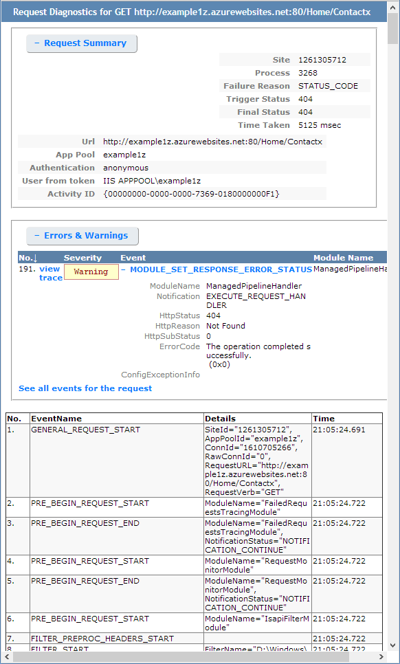

<properties
    pageTitle="Aktivieren Sie Diagnoseprotokolle für Web apps in Azure-App-Verwaltungsdienst"
    description="Erfahren Sie, wie Diagnoseprotokoll aktivieren und Instrumentation an Ihrer Anwendung hinzufügen sowie von Azure protokollierte Informationen zugreifen."
    services="app-service"
    documentationCenter=".net"
    authors="cephalin"
    manager="wpickett"
    editor="jimbe"/>

<tags
    ms.service="app-service"
    ms.workload="na"
    ms.tgt_pltfrm="na"
    ms.devlang="na"
    ms.topic="article"
    ms.date="06/06/2016"
    ms.author="cephalin"/>

# Aktivieren Sie Diagnoseprotokolle für Web apps in Azure-App-Verwaltungsdienst

## (Übersicht)

Azure bietet integrierten Diagnose zu unterstützen für das Debuggen einer [App-Dienst Web app](http://go.microsoft.com/fwlink/?LinkId=529714)an. In diesem Artikel erfahren Sie, wie Diagnoseprotokoll aktivieren und Instrumentation an Ihrer Anwendung hinzufügen sowie von Azure protokollierte Informationen zugreifen.

In diesem Artikel verwendet das [Azure-Portal](https://portal.azure.com), Azure PowerShell und der Azure Line Interface (CLI Azure) für die Arbeit mit Diagnoseprotokolle an. Informationen zum Arbeiten mit einer Diagnoseprotokollen mit Visual Studio finden Sie unter [Problembehandlung Azure in Visual Studio](web-sites-dotnet-troubleshoot-visual-studio.md).

[AZURE.INCLUDE [app-service-web-to-api-and-mobile](../../includes/app-service-web-to-api-and-mobile.md)]

## Web Server Diagnose und Anwendung Diagnose

App-Dienst Web apps werden diagnostic Funktionen zur Protokollinformationen aus den Webserver und der Anwendung bereit. Diese sind logisch in **Web Server Diagnose** und **Anwendung Diagnose**getrennt.

### Web Server-Diagnose

Sie können aktivieren oder deaktivieren die folgenden Arten von Protokollen:

- **Ausführliche Protokollierung-Fehler** - detaillierte Fehlerinformationen für HTTP Statuscodes, die einen Fehler (Statuscode 400 oder höher). Dies kann Informationen enthalten, die Ihnen festzustellen helfen, warum der Server den Fehlercode zurückgegeben.
- **Failed Anforderung Tracing** - ausführliche Informationen zu fehlgeschlagener Anfragen, einschließlich einer Spur zum Verarbeiten von Anfrage und die Verarbeitungszeit in jede Komponente verwendet IIS-Komponenten. Dies kann sinnvoll, wenn Sie versuchen, die Leistung der Site erhöhen oder isolieren, was mit einen bestimmten HTTP-Fehler, der zurückgegeben wird verursacht sein.
- **Web Server Protokollierung** - Informationen mithilfe des [W3C erweiterte Log-Dateiformat](http://msdn.microsoft.com/library/windows/desktop/aa814385.aspx)HTTP-Transaktionen. Dies ist hilfreich beim Bestimmen der übergeordneten Website Unternehmensdaten wie die Anzahl der Anfragen verarbeitet oder wie viele Anfragen von einer bestimmten IP-Adresse sind.

### Anwendung-Diagnose

Anwendung Diagnose können Sie von einer Webanwendung erzeugte erfassen. ASP.NET Applications können Informationen in der Anwendung Diagnose Ereignisprotokoll [System.Diagnostics.Trace](http://msdn.microsoft.com/library/36hhw2t6.aspx) -Klasse. Beispiel:

    System.Diagnostics.Trace.TraceError("If you're seeing this, something bad happened");

Zur Laufzeit können Sie diese Protokolle bei der Problembehandlung helfen abrufen. Weitere Informationen finden Sie unter [Problembehandlung Azure Web apps in Visual Studio](web-sites-dotnet-troubleshoot-visual-studio.md).

App-Dienst Web apps melden Sie sich auch Informationen zur Bereitstellung beim Veröffentlichen Inhalt auf einer Web app. In diesem Fall automatisch, und es werden keine Konfigurationen für die Bereitstellung Protokollierung. Bereitstellung Protokollierung können Sie feststellen, warum eine Bereitstellung fehlgeschlagen ist. Wenn Sie eine benutzerdefinierte Bereitstellungsskript verwenden, möglicherweise Sie ermitteln, warum das Skript fehlschlägt, kann beispielsweise Bereitstellung Protokollierung verwenden.

## Aktivieren der Diagnose

Wechseln Sie zu dem Blade für Ihre Web-app, und klicken Sie auf, um im [Portal Azure](https://portal.azure.com)-Diagnose aktivieren **Einstellungen > Diagnose Protokolle**.

<!-- todo:cleanup dogfood addresses in screenshot -->

Wenn Sie die **Anwendung Diagnose** aktivieren, wählen Sie auch die **Ebene**. Mit dieser Einstellung können Sie die Informationen erfasst, um Informationen **zur Information**, **Warnung** oder **Fehler** zu filtern. Dies zu **ausführlichen** festlegen werden alle Informationen, die von der Anwendung erstelltes protokolliert.

> [AZURE.NOTE] Im Gegensatz zum Ändern der Datei web.config, Diagnose Anwendung zu aktivieren, oder ändern Diagnoseprotokoll Ebenen nicht die app-Domäne Papierkorb, der innerhalb die Anwendung ausgeführt wird.

In der [klassischen Portal](https://manage.windowsazure.com) Web app **Konfigurieren** Registerkarte können Sie **Speicher** oder **Dateisystem** für **Webserver Protokollierung**auswählen. **Speicher** auswählen, können Sie auswählen, Speicher-Konto, und klicken Sie dann ein Blob-Container, dem die Protokolle geschrieben werden sollen. Alle anderen Protokolle für die **Website Diagnose** werden nur im Dateisystem geschrieben werden.

Die Registerkarte [klassischen Portal](https://manage.windowsazure.com) Web app **Konfigurieren** , weist ebenfalls zusätzliche Einstellungen für die Anwendung Diagnose:

* **Dateisystem** - speichert die Diagnose Anwendungsinformationen im Web app-Dateisystem. Diese Dateien können über FTP zugegriffen oder als Zip-Archiv mithilfe der PowerShell Azure oder Azure Line Interface (CLI Azure) heruntergeladen werden.
* **Table Storage** - speichert die Diagnose Anwendungsinformationen in dem angegebenen Azure-Speicher-Konto und Tabelle Namen ein.
* **Blob-Speicher** – speichert die Diagnose Anwendungsinformationen im angegebenen Azure-Speicher-Konto und Blob Container.
* **Aufbewahrungszeitraum** / standardmäßig Protokolle werden nicht automatisch gelöscht von **Blob-Speicher**. Wählen Sie **Aufbewahrung festlegen** , und geben Sie die Anzahl der Tage, die Protokolle aufbewahrt werden, wenn Sie Protokolle automatisch löschen möchten.

>[AZURE.NOTE] Wenn Sie [Tastenkombinationen für Ihre Speicher-Konto neu zu generieren](storage-create-storage-account.md#view-copy-and-regenerate-storage-access-keys), Sie die entsprechenden Protokollierungskonfiguration verwenden Sie die aktualisierten Schlüssel zurücksetzen müssen. Zweck
>
> 1. Legen Sie auf der Registerkarte **Konfigurieren** die entsprechenden Protokollierungsfunktion zu **Deaktivieren**. Speichern Sie Ihrer Einstellung an.
> 2. Aktivieren der Protokollierung auf die BLOB-Speicher-Konto oder die Tabelle erneut. Speichern Sie Ihrer Einstellung an.

Eine beliebige Kombination aus Dateisystem, Tabellenspeicher oder Blob-Speicher gleichzeitig aktiviert werden kann, und einzelne Log Ebene Konfigurationen haben. Möglicherweise möchten Sie melden von Fehlern und Warnungen zu als langfristig Protokollierung Lösung, BLOB-Speicher beim Aktivieren der Protokollierung von Datei System mit einer Ebene der ausführlichen.

Während die gleiche grundlegende Informationen für protokollierten Ereignisse alle drei Speicherorte zur Verfügung stellen, melden Sie sich **Tabellenspeicher** und **Blob-Speicher** zusätzlichen Informationen, wie etwa die Instanz-ID, Thread-ID und eine detailliertere Timestamp (Häkchen Format) als Protokollierung **Dateisystem**.

> [AZURE.NOTE] Im **Tabellenspeicher** oder **Blob-Speicher** gespeicherten Informationen kann nur mit einem Speicher-Client oder eine Anwendung, die direkt mit diesen Speichersystemen arbeiten kann zugegriffen werden. Beispielsweise Visual Studio 2013 enthält eine Speicher-Explorer, die zum Untersuchen der Tabelle oder Blob-Speicher verwendet werden können, und HDInsight im BLOB-Speicher gespeicherte Daten zugreifen kann. Sie können auch eine Anwendung schreiben, die Azure-Speicher greift mithilfe der [Azure SDKs](/downloads/#)auf.

> [AZURE.NOTE] Diagnose kann auch aus Azure PowerShell mithilfe des Cmdlets **Set-AzureWebsite** aktiviert werden. Wenn Sie Azure PowerShell nicht installiert haben oder nicht konfiguriert haben, um Ihr Abonnement Azure verwenden, finden Sie unter [Azure PowerShell verwenden](/develop/nodejs/how-to-guides/powershell-cmdlets/).

##So: Herunterladen von Protokollen

Diagnoseinformationen im Web app-Dateisystem gespeichert kann direkt über FTP zugegriffen werden. Sie können auch als Zip-Archiv mit Azure PowerShell oder der Benutzeroberfläche Azure Line heruntergeladen werden.

Die Directory-Struktur, der die Protokolle in gespeichert werden lautet wie folgt aus:

* **Anwendungsprotokolle** - /LogFiles/Anwendung /. Dieser Ordner enthält eine oder mehrere Textdateien von Anwendung Protokollierung erzeugte Informationen enthalten sind.

* **Fehler bei der Anforderung Spuren** - / Protokolldateien/W3SVC ### /. Dieser Ordner enthält eine XSL-Datendatei und eine oder mehrere XML-Dateien. Stellen Sie sicher, dass Sie die XSL-Datei in dasselbe Verzeichnis herunterladen, wie die XML-Daten Datei(en), da die XSL-Datei Funktionalität für Formatierung und den Inhalt der XML-Dateien in Internet Explorer Anzeigeergebnis Filtern bereitstellt.

* **Ausführliche Fehlerprotokolle** - /LogFiles/DetailedErrors /. Dieser Ordner enthält eine oder mehrere htm-Dateien, die umfassende Informationen zu Fehlern HTTP bereitstellen, die aufgetreten sind.

* **Web Serverprotokolle** - /LogFiles/http/RawLogs. Dieser Ordner enthält eine oder mehrere Textdateien formatiert [W3C erweiterte Log-Dateiformat](http://msdn.microsoft.com/library/windows/desktop/aa814385.aspx).

* **Bereitstellung von Protokollen** - / Protokolldateien/Git. Diesen Ordner durch die von Azure Web apps verwendeten internen Bereitstellungsprozesse erzeugten Protokolle enthält, als auch für Git Bereitstellungen protokolliert.

### FTP

Um Diagnoseinformationen über FTP zugreifen zu können, finden Sie auf dem **Dashboard** der Web app in der [klassischen Portal](https://manage.windowsazure.com). Verwenden Sie im Abschnitt **den ersten Blick** den **Diagnoseprotokollen FTP-** Link die Protokolldateien mithilfe von FTP-Zugriff auf ein. Der **Bereitstellung/FTP-Benutzer** -Eintrag enthält den Benutzernamen, der Zugriff auf die FTP-Website verwendet werden soll.

> [AZURE.NOTE] Wenn Sie der Eintrag **Bereitstellung/FTP-Benutzer** nicht festgelegt ist und das Kennwort für diesen Benutzer vergessen haben, können Sie mithilfe des **Bereitstellung Anmeldeinformationen zurücksetzen** links im Abschnitt **den ersten Blick** des **Dashboard**einen neuen Benutzer und ein Kennwort erstellen.

### Mit Azure PowerShell herunterladen

Laden Sie die Protokolldateien, starten eine neue Instanz von Azure PowerShell, und verwenden Sie den folgenden Befehl aus:

    Save-AzureWebSiteLog -Name webappname

Dies speichert die Protokolle für das Web app angegeben haben, indem Sie die **-Namen** Parameter in eine Datei mit dem Namen **logs.zip** im aktuellen Verzeichnis.

> [AZURE.NOTE] Wenn Sie Azure PowerShell nicht installiert haben oder nicht konfiguriert haben, um Ihr Abonnement Azure verwenden, finden Sie unter [Azure PowerShell verwenden](/develop/nodejs/how-to-guides/powershell-cmdlets/).

### Herunterladen von Azure Line-Benutzeroberfläche

Zum Herunterladen der Protokolldateien der Befehl Azure-Oberfläche mit öffnen Sie neuen Eingabeaufforderungsfenster, PowerShell, Bash oder Terminal Sitzung, und geben Sie den folgenden Befehl aus:

    azure site log download webappname

Dadurch wird die Protokolle für das Web app mit dem Namen 'Webappname' in einer Datei namens **diagnostics.zip** im aktuellen Verzeichnis gespeichert.

> [AZURE.NOTE] Wenn Sie die Azure Line Interface (CLI Azure) nicht installiert haben oder nicht konfiguriert haben, um Ihr Abonnement Azure verwenden, finden Sie unter [Verwenden von Azure CLI](../xplat-cli-install.md).

## So: Ansicht in der Anwendung Einsichten protokolliert

Visual Studio-Anwendung Einsichten stellt Tools zum Filtern, und suchen die Protokolle, und für das die Protokolle mit Besprechungsanfragen und andere Ereignisse abgleichen.

1. Fügen Sie die Anwendung Einsichten SDK zu einem Projekt in Visual Studio.
 * Explorer-Lösung klicken Sie mit der rechten Maustaste auf Ihr Projekt und wählen Sie die Anwendung Einsichten hinzufügen. Sie werden durch die Schritte geführt, die eine Ressource Anwendung Einsichten erstellen enthalten. [Weitere Informationen](../application-insights/app-insights-asp-net.md)
2. Hinzufügen des Pakets Zuhörer Spur zum Projekt.
 * Klicken Sie mit der rechten Maustaste auf Ihr Projekt, und wählen Sie NuGet-Pakete verwalten aus. Wählen Sie `Microsoft.ApplicationInsights.TraceListener` [erfahren Sie mehr](../application-insights/app-insights-asp-net-trace-logs.md)
3. Hochladen Sie des Projekts, und führen sie zum Generieren von Daten aus.
4. Klicken Sie im [Portal Azure](https://portal.azure.com/)navigieren Sie zu Ihrer neuen Anwendung Einsichten Ressource, und öffnen Sie **Suchen**. Sehen Sie Ihre Daten Log zusammen mit der Anfrage, Verwendung und anderen telemetrieprotokoll ein. Einige werden möglicherweise einige Minuten erreicht dauern: Klicken Sie auf aktualisieren. [Weitere Informationen](../application-insights/app-insights-diagnostic-search.md)

[Weitere Informationen zu mit Anwendung Einsichten Nachverfolgen der Leistung](../application-insights/app-insights-azure-web-apps.md)

##So: Übertragen von Protokollen

Bei der Entwicklung einer Anwendungs, ist es häufig sinnvoll, Protokollieren von Informationen in nahezu in Echtzeit angezeigt. Dies kann streaming Protokollierungsinformationen, die bei der Entwicklungsumgebung mit Azure PowerShell oder der Azure Line Interface erfolgen.

> [AZURE.NOTE] Einige Arten von Protokollierung Puffer Schreiben in die Protokolldatei, was in der falschen Reihenfolge Ereignisse im Stream führen kann. Ein Anwendungseintrag für das Protokoll, der auftritt, wenn ein Benutzer auf eine Seite besucht möglicherweise beispielsweise im Stream vor dem entsprechenden HTTP-Protokoll-Eintrag für die Anforderung der Seite angezeigt werden.

> [AZURE.NOTE] Log streaming werden auch Informationen in eine beliebige Textdatei gehörende Kehrmatrix geschrieben gestreamt der **D:\\Start\\Protokolldateien\\ ** Ordner.

### Streaming mit Azure PowerShell

Streamen Protokollierungsinformationen, starten eine neue Instanz von Azure PowerShell und verwenden Sie den folgenden Befehl aus:

    Get-AzureWebSiteLog -Name webappname -Tail

Dies wird bei der Web-app vom angegebenen Verbinden der **-Namen** Parameter und Informationen zum Fenster PowerShell streaming, wie Log im Web-App Ereignissen zu beginnen. Alle Informationen in Dateien, die in TXT, htm oder .log, die im Verzeichnis /LogFiles (d:/Start/log-Dateien) gespeichert werden geschrieben werden an der lokalen Konsole gestreamt werden.

Verwenden Sie zum Filtern von bestimmter Ereignisse, z. B. Fehler, die **-Nachricht** Parameter. Beispiel:

    Get-AzureWebSiteLog -Name webappname -Tail -Message Error

Verwenden Sie zum Filtern von bestimmter Log Typen, wie z. B. HTTP, die **-Pfad** Parameter. Beispiel:

    Get-AzureWebSiteLog -Name webappname -Tail -Path http

Um eine Liste der verfügbaren Pfade anzuzeigen, verwenden Sie den Parameter - ListPath aus.

> [AZURE.NOTE] Wenn Sie Azure PowerShell nicht installiert haben oder nicht konfiguriert haben, um Ihr Abonnement Azure verwenden, finden Sie unter [Azure PowerShell verwenden](/develop/nodejs/how-to-guides/powershell-cmdlets/).

### Streaming mit Azure Line-Benutzeroberfläche

Zum Streamen Protokollierungsinformationen, öffnen Sie eine neue Eingabeaufforderungsfenster, PowerShell, Bash oder Terminal Sitzung, und geben Sie den folgenden Befehl aus:

    azure site log tail webappname

Dies Herstellen einer Verbindung mit dem Namen 'Webappname' der Web-app mit, und beginnen Informationen zum Fenster streaming, sobald Ereignisse protokollieren der Web-App auftreten. Alle Informationen in Dateien, die in TXT, htm oder .log, die im Verzeichnis /LogFiles (d:/Start/log-Dateien) gespeichert werden geschrieben werden an der lokalen Konsole gestreamt werden.

Verwenden Sie zum Filtern von bestimmter Ereignisse, z. B. Fehler, die **– Filter** Parameter. Beispiel:

    azure site log tail webappname --filter Error

Verwenden Sie zum Filtern von bestimmter Log Typen, wie z. B. HTTP, die **– Pfad** Parameter. Beispiel:

    azure site log tail webappname --path http

> [AZURE.NOTE] Wenn Sie die Azure Line-Benutzeroberfläche nicht installiert haben oder nicht konfiguriert haben, um Ihr Abonnement Azure verwenden, Informationen Sie [zum Verwenden von Azure Line Benutzeroberflächen](../xplat-cli-install.md).

##So: verstehen Diagnose von Protokollen

### Anwendung Diagnose von Protokollen

Anwendung Diagnose speichert die Informationen in einem bestimmten Format für .NET Applications, je nachdem, ob Sie Protokolle im Dateisystem, Tabellenspeicher oder Blob-Speicher gespeichert werden. Basis Festlegen der gespeicherten Daten ist dieselbe in allen drei Speicher - Datum und Uhrzeit des Ereignisses, die Prozess-ID, die das Ereignis, den Ereignistyp (Informationen, Warnung, Fehler) und die Ereignisnachricht erzeugt.

__Dateisystem__

Jede Zeile in das Dateisystem angemeldet oder mit streaming empfangen werden in folgendem Format:

    {Date}  PID[{process id}] {event type/level} {message}

Ein Fehlerereignis würde beispielsweise ähnlich wie die folgende angezeigt:

    2014-01-30T16:36:59  PID[3096] Error       Fatal error on the page!

Protokollierung im Dateisystem bietet grundlegende Informationen der drei verfügbaren Methoden, Uhrzeit, Prozess-Id, Ereignisebene und Nachricht bereitstellen.

__Tabellenspeicher__

Bei der Anmeldung Tabellenspeicher, werden zusätzliche Eigenschaften verwendet, um zu erleichtern, suchen die Daten in der Tabelle als auch detailliertere Informationen über das Ereignis gespeichert. Die folgenden Eigenschaften (Spalten) werden für jede Entität (Zeile) in der Tabelle gespeicherten verwendet.

Eigenschaftsname|Wert-format
---|---
PartitionKey|Datum/Uhrzeit des Ereignisses im Format yyyyMMddHH
RowKey|Ein GUID-Wert, der diese Entität eindeutig
Zeitstempel|Das Datum und die Uhrzeit, zu denen das Ereignis
EventTickCount|Das Datum und die Uhrzeit, zu denen das Ereignis, Teilstriche Format (größere Genauigkeit)
ApplicationName|Der Name der Web-app
Ebene|Ereignisebene (z. B. Fehler, Warnung, Informationen)
EventId|Die Ereignis-ID dieses Ereignisses

Hat den Standardwert 0, wenn keine angegeben
InstanceId|Instanz des Web app, der auf die gerade aufgetreten
PID|Prozess-ID
TID|Die Thread-ID des der, die das Ereignis erzeugt
Nachricht|Ereignis detaillierte Meldung

__BLOB-Speicher__

Bei der Anmeldung BLOB-Speicher, werden Daten in durch Trennzeichen getrennte Werte (CSV) Format gespeichert. Ähnlich wie Tabellenspeicher, um detailliertere Informationen über das Ereignis bieten zusätzliche Felder angemeldet sind. Die folgenden Eigenschaften werden für jede Zeile in der CSV-verwendet:

Eigenschaftsname|Wert-format
---|---
Datum|Das Datum und die Uhrzeit, zu denen das Ereignis
Ebene|Ereignisebene (z. B. Fehler, Warnung, Informationen)
ApplicationName|Der Name der Web-app
InstanceId|Instanz des Web app, der dem Ereignis auftrat
EventTickCount|Das Datum und die Uhrzeit, zu denen das Ereignis, Teilstriche Format (größere Genauigkeit)
EventId|Die Ereignis-ID dieses Ereignisses

Hat den Standardwert 0, wenn keine angegeben
PID|Prozess-ID
TID|Die Thread-ID des der, die das Ereignis erzeugt
Nachricht|Ereignis detaillierte Meldung

In einer Blob gespeicherten Daten würde etwa wie folgt aussehen:

    date,level,applicationName,instanceId,eventTickCount,eventId,pid,tid,message
    2014-01-30T16:36:52,Error,mywebapp,6ee38a,635266966128818593,0,3096,9,An error occurred

> [AZURE.NOTE] Die erste Zeile des das Protokoll wird die Spaltenüberschriften enthalten, wie in diesem Beispiel dargestellt.

### Fehler bei der Anforderung auf

Fehler bei der Anforderung, die auf in XML-Dateien mit dem Namen __Französisch ### .xml__gespeichert werden Wenn Sie um die protokollierte Informationen anzeigen zu erleichtern, wird ein XSL-Stylesheet namens __freb.xsl__ in demselben Verzeichnis wie die XML-Dateien bereitgestellt. Öffnen eine XML-Dateien in Internet Explorer wird das XSL-Stylesheet verwendet, um eine formatierte Anzeige der Spur Informationen bereitzustellen. Dadurch werden ähnlich wie die folgende angezeigt:

### Ausführliche Fehlerprotokolle

Ausführliche Fehlerprotokolle werden HTML-Dokumenten, die ausführlichen Informationen zum HTTP-Fehler enthalten, die aufgetreten sind. Da sie einfach HTML-Dokumente sind, können sie über einen Webbrowser angezeigt werden.

### Web Serverprotokolle

Die Protokolle für das Web Server werden unter Verwendung des [W3C erweiterte Log-Dateiformat](http://msdn.microsoft.com/library/windows/desktop/aa814385.aspx)formatiert. Diese Informationen kann gelesen werden, verwenden einen Text-Editor oder mit Dienstprogrammen wie [Log Parser](http://go.microsoft.com/fwlink/?LinkId=246619)analysiert.

> [AZURE.NOTE] Die Protokolle, Azure Web apps erzeugt unterstützt die Felder __s-Computername__, __Ip-s__oder __Cs-Version__ nicht.

##Nächste Schritte

- [Zum Überwachen der Web Apps](/manage/services/web-sites/how-to-monitor-websites/)
- [Problembehandlung bei Azure Web apps in Visual Studio](web-sites-dotnet-troubleshoot-visual-studio.md)
- [Analysieren von Web app anmelden HDInsight](http://gallery.technet.microsoft.com/scriptcenter/Analyses-Windows-Azure-web-0b27d413)

> [AZURE.NOTE] Wenn Sie mit Azure-App-Verwaltungsdienst Schritte vor dem für ein Azure-Konto anmelden möchten, wechseln Sie zu [App-Verwaltungsdienst versuchen](http://go.microsoft.com/fwlink/?LinkId=523751), in dem Sie eine kurzlebige Starter Web app sofort im App-Dienst erstellen können. Keine Kreditkarten erforderlich; keine Zusagen.

## Was hat sich geändert
* Ein Leitfaden zum Ändern von Websites-App-Dienst finden Sie unter: [Azure-App-Dienst und seinen Einfluss auf die vorhandenen Azure Services](http://go.microsoft.com/fwlink/?LinkId=529714)
* Leitfaden für die Änderung des Portals alten in das neue Portal finden Sie unter: [Verweis für die Navigation in der Azure-Portal](http://go.microsoft.com/fwlink/?LinkId=529715)
 
