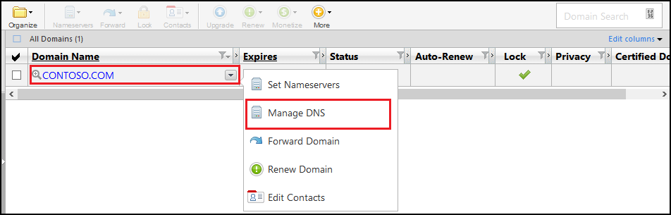

<properties
    pageTitle="Konfigurieren Sie einen benutzerdefinierten Domänennamen in Azure-App-Verwaltungsdienst (GoDaddy)"
    description="Informationen Sie zum Verwenden von GoDaddy Domänennamen mit Azure Web Apps"
    services="app-service"
    documentationCenter=""
    authors="erikre"
    manager="wpickett"
    editor="jimbe"/>

<tags
    ms.service="app-service"
    ms.workload="na"
    ms.tgt_pltfrm="na"
    ms.devlang="na"
    ms.topic="article"
    ms.date="01/12/2016"
    ms.author="cephalin"/>

# Konfigurieren Sie einen benutzerdefinierten Domänennamen in Azure-App-Verwaltungsdienst (direkt aus GoDaddy erworben)

[AZURE.INCLUDE [web-selector](../../includes/websites-custom-domain-selector.md)]

[AZURE.INCLUDE [intro](../../includes/custom-dns-web-site-intro.md)]

Wenn Sie die Domäne durch Azure App Dienst Web Apps erworben haben finden Sie dann in der letzten Schritt zum [Kaufen Domäne für Web Apps](custom-dns-web-site-buydomains-web-app.md).

Dieser Artikel enthält Anweisungen zur Verwendung eines benutzerdefinierten Domänennamens, der direkt bei [GoDaddy](https://godaddy.com) mit [App Dienst Web Apps](http://go.microsoft.com/fwlink/?LinkId=529714)erworben haben.

[AZURE.INCLUDE [introfooter](../../includes/custom-dns-web-site-intro-notes.md)]

##Grundlegendes zu DNS-Einträge

[AZURE.INCLUDE [understandingdns](../../includes/custom-dns-web-site-understanding-dns-raw.md)]

## Hinzufügen eines DNS-Eintrags für Ihre benutzerdefinierte Domäne

Um eine Web app im App-Dienst Ihre benutzerdefinierte Domäne zuzuordnen, müssen Sie einen neuen Eintrag in der Tabelle DNS für Ihre benutzerdefinierte Domäne hinzufügen mithilfe von GoDaddy bereitgestellten Tools. Gehen Sie folgendermaßen vor, um die DNS-Tools für go suchen

1. Melden Sie sich bei Ihrem Konto bei go, und wählen Sie **My Account** und dann auf **Meine Domänen verwalten**. Wählen Sie abschließend das Dropdownmenü für den Namen der Domäne, den Sie mit Ihrem Azure Web app verwenden, und wählen **DNS verwalten**möchten.

    

2. Von der Seite **Domain Details** einen Bildlauf zur Registerkarte **DNS Zone File** . Dies ist im Abschnitt zum Hinzufügen und Ändern von DNS-Einträge für Ihren Domänennamen ein.

    

    Wählen Sie **Add Record** einen vorhandenen Datensatz hinzufügen.

    So **Bearbeiten** Sie einen vorhandenen Datensatz wählen Sie den Stift und Papier Symbol neben dem Datensatz aus.

    > [AZURE.NOTE] Beachten Sie vor dem Hinzufügen neuer Datensätze, GoDaddy DNS-Einträge für beliebte Unterdomänen (in-Editor als **Host** bezeichnet) wie **e-Mail**, **Dateien**, **e-Mail**und andere bereits erstellt hat. Wenn vorhanden der Name, den Sie bereits verwenden möchten ist, ändern Sie den vorhandenen Datensatz statt einen neuen zu erstellen.

4. Wenn Sie einen Datensatz hinzufügen zu können, müssen Sie zuerst den Datensatztyp auswählen.

    

    Als Nächstes geben Sie den **Host** (der benutzerdefinierten Domäne oder Unterdomäne) und welche It **für verweist auf die**.

    

    * Beim Hinzufügen einer **Eintrag A (Host)** - müssen Sie das Feld **Host** festlegen, um entweder **@** (Dies steht für Stamm-Domänennamen, wie etwa **"contoso.com"**) *(Platzhalter für mehrere Unterdomänen entsprechende) oder die Unterdomäne, die Sie verwenden möchten (beispielsweise * *"www"**.) Müssen Sie festlegen der * *für verweist auf die** die IP-Adresse der Azure Web app-Feld.

    * Beim Hinzufügen eines **CNAME-Eintrag (Alias)** – müssen Sie das Feld **Host** an die Unterdomäne festlegen, die Sie verwenden möchten. Beispielsweise **"www"**. Müssen Sie das Feld **für verweist auf die** zum Festlegen der **. azurewebsites.net** Domänennamen der Azure Web app. Beispielsweise **contoso.azurewebsites.net**.

5. Klicken Sie auf **Weitere hinzufügen**.
6. Wählen Sie **TXT** als den Datensatztyp aus, und geben Sie den Wert **für Hostname** **@** und den Wert **für verweist auf die** ** &lt;Yourwebappname&gt;. azurewebsites.net**.

    > [AZURE.NOTE] Diese TXT-Eintrag wird von Azure zum Überprüfen, die Sie die von den A-Eintrag oder den ersten TXT-Eintrag beschrieben Domäne besitzen. Nachdem Sie die Domäne der Web-app im Portal Azure zugeordnet wurde, kann diesen Datensatz TXT-Eintrag entfernt werden.

5. Beim hinzugefügt haben, oder Ändern von Datensätzen, klicken Sie auf **Fertig stellen** , um die Änderungen zu speichern.

## Aktivieren Sie den Namen der Domäne auf Web app

[AZURE.INCLUDE [modes](../../includes/custom-dns-web-site-enable-on-web-site.md)]

>[AZURE.NOTE] Wenn Sie mit Azure-App-Verwaltungsdienst Schritte vor dem für ein Azure-Konto anmelden möchten, wechseln Sie zu [App-Verwaltungsdienst versuchen](http://go.microsoft.com/fwlink/?LinkId=523751), in dem Sie eine kurzlebige Starter Web app sofort im App-Dienst erstellen können. Keine Kreditkarten erforderlich; keine Zusagen.

## Was hat sich geändert
* Ein Leitfaden zum Ändern von Websites-App-Dienst finden Sie unter: [Azure-App-Dienst und seinen Einfluss auf die vorhandenen Azure Services](http://go.microsoft.com/fwlink/?LinkId=529714)
