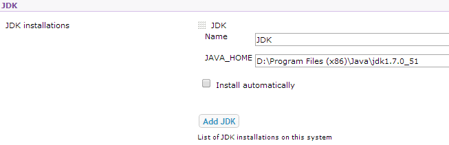

<properties 
    pageTitle="Hochladen einer benutzerdefinierten Java Web app zu Azure" 
    description="In diesem Lernprogramm erfahren Sie, wie Sie eine benutzerdefinierte Java Web app in Azure App Dienst Web Apps hochladen." 
    services="app-service\web" 
    documentationCenter="java" 
    authors="rmcmurray" 
    manager="wpickett" 
    editor=""/>

<tags 
    ms.service="app-service-web" 
    ms.workload="web" 
    ms.tgt_pltfrm="na" 
    ms.devlang="Java" 
    ms.topic="article" 
    ms.date="08/11/2016" 
    ms.author="robmcm"/>

# Hochladen einer benutzerdefinierten Java Web app zu Azure

In diesem Thema wird erläutert, wie Sie eine benutzerdefinierte Java Web app in [Azure-App-Verwaltungsdienst] Web Apps hochladen. Enthält Informationen, die auf eine beliebige Java-Website oder Web app und auch einige Beispiele für bestimmte Applikationen angewendet wird.

Beachten Sie, dass Azure ein Verfahren zum Erstellen von Java Web apps mit der Azure-Portal Konfiguration Benutzeroberfläche und dem Azure Marketplace, wie bei [eine Java Web app im App-Verwaltungsdienst Azure erstellen](web-sites-java-get-started.md)festgehalten bereitstellt. In diesem Lernprogramm ist für Szenarios, in denen Sie nicht die Konfiguration Azure-Portal verwenden möchten, Benutzeroberfläche oder die Azure Marketplace.  

## Richtlinien für die Konfiguration

Im folgenden wird beschrieben, die Einstellungen für benutzerdefinierte Java Web apps auf Azure erwartet.

- Der HTTP-Port vom Java-Prozess verwendet wird dynamisch zugewiesen.  Der Prozess muss verwenden den Port aus der Umgebungsvariablen `HTTP_PLATFORM_PORT`.
- Alle Abhören Ports als die einzelnen HTTP Zuhörer sollte deaktiviert werden.  In Tomcat, enthält, die die war(en), HTTPS und AJP Ports.
- Der Container muss für nur IPv4-Datenverkehr konfiguriert sein.
- **Befehl für die Anwendung** muss in der Konfiguration festgelegt werden.
- Anwendungen, die mit Verzeichnisse erfordern schreiben Berechtigung müssen Inhalte der Azure Web-app im Verzeichnis **D:\home**also befinden.  Die Umgebung Variable `HOME` bezieht sich auf D:\home.  

Sie können Umgebungsvariablen nach Bedarf in der Datei web.config festlegen.

## Web.config HttpPlatform Konfiguration

Die folgende Informationen werden im Format **HttpPlatform** in web.config.
                                 
**Argumente auf:** (Standard = ""). Die Argumente für die ausführbare Datei oder das Skript, die in der Einstellung **ProcessPath** angegeben.

Beispiele für (Siehe mit **ProcessPath** enthalten):

    processPath="%HOME%\site\wwwroot\bin\tomcat\bin\catalina.bat"
    arguments="start"
    
    processPath="%JAVA_HOME\bin\java.exe"
    arguments="-Djava.net.preferIPv4Stack=true -Djetty.port=%HTTP\_PLATFORM\_PORT% -Djetty.base=&quot;%HOME%\site\wwwroot\bin\jetty-distribution-9.1.0.v20131115&quot; -jar &quot;%HOME%\site\wwwroot\bin\jetty-distribution-9.1.0.v20131115\start.jar&quot;"

**ProcessPath** - Pfad für die ausführbare Datei oder das Skript, die einen HTTP-Anfragen Abhören Prozess startet.

Beispiele:

    processPath="%JAVA_HOME%\bin\java.exe"

    processPath="%HOME%\site\wwwroot\bin\tomcat\bin\startup.bat"

    processPath="%HOME%\site\wwwroot\bin\tomcat\bin\catalina.bat"
                                                                                       
**rapidFailsPerMinute** (Standard = 10.) Anzahl der Häufigkeit, mit der angegebenen **ProcessPath** Prozess zum Absturz pro Minute zulässig ist. Wenn dieser Grenzwert überschritten wird, wird **HttpPlatformHandler** ebenso Aktualisierungsprozess für den Rest der Minute gestoppt.
                                    
**requestTimeout** (Standard = "00: 02:00".) Dauer für die **HttpPlatformHandler** auf eine Antwort vom Aktualisierungsprozess Abhören wartet `%HTTP_PLATFORM_PORT%`.

**startupRetryCount** (Standard = 10.) Anzahl der **HttpPlatformHandler** versuchen wird zum Starten des Prozesses in **ProcessPath**angegeben. **StartupTimeLimit** Weitere Informationen hierzu finden Sie unter.

**startupTimeLimit** (Standard = 10 Sekunden.) Dauer auf die **HttpPlatformHandler** für das ausführbare Datei/Skript zum Starten eines Prozesses, der den Port überwacht wartet.  Wenn dieses Zeitlimit überschritten wird, wird **HttpPlatformHandler** beenden Sie den Prozess und versuchen Sie es erneut **StartupRetryCount** Mal starten.
                                                                                      
**stdoutLogEnabled** (Standard = "true".) Wenn wahr, **Stdout** und **Stderr** für die Einstellung **ProcessPath** angegebene Prozess in einer Datei in **StdoutLogFile** umgeleitet werden soll (Siehe den Abschnitt **StdoutLogFile** ).
                                    
**stdoutLogFile** (Default="d:\home\LogFiles\httpPlatformStdout.log".) Absoluter Dateipfad für den **Stdout** und **Stderr** aus dem angegebenen **ProcessPath** Prozess angemeldet sein.
                                    
> [AZURE.NOTE] `%HTTP_PLATFORM_PORT%`ist ein spezieller Platzhalter, die Sie als Teil der **Argumente** oder als Teil der **HttpPlatform** **EnvironmentVariables** Liste angegeben benötigt. Dieser wird durch einen intern erzeugten Anschluss durch **HttpPlatformHandler** ersetzt werden, damit dieser Port durch **ProcessPath** angegebene Prozess abhören kann.

## Bereitstellung

Java basierend Web apps problemlos durch die meisten der gleichen Mittel bereitgestellt werden können, die mit Internet Information Services (IIS) verwendet werden, basiert Webanwendungen.  FTP, Git und Kudu werden als Deployment-Verfahren unterstützt, wie die integrierte SCM-Funktion von Web apps ist. WebDeploy funktioniert als ein Protokoll, jedoch wie Java nicht in Visual Studio entwickelt wird WebDeploy nicht mit Java Web app-Bereitstellung verwenden Fällen passt.

## Anwendungskonfiguration Beispiele

Für die folgenden Programme, eine Datei web.config und die Anwendung wird Konfiguration als Beispiele zum Aktivieren der Java-Anwendungs auf App-Dienst Web Apps veranschaulichen bereitgestellt.

### Tomcat
Während es zwei Variationen Tomcat, die mit App-Dienst Web Apps bereitgestellt werden gibt, ist es immer noch ganz möglich, bestimmte Instanzen Kunden hochladen. Es folgt ein Beispiel für eine Installation von Tomcat mit einem anderen Java-virtuellen Computern (JVM).

    <?xml version="1.0" encoding="UTF-8"?>
    <configuration>
      <system.webServer>
        <handlers>
          <add name="httpPlatformHandler" path="*" verb="*" modules="httpPlatformHandler" resourceType="Unspecified" />
        </handlers>
        <httpPlatform processPath="%HOME%\site\wwwroot\bin\tomcat\bin\startup.bat" 
            arguments="">
          <environmentVariables>
            <environmentVariable name="CATALINA_OPTS" value="-Dport.http=%HTTP_PLATFORM_PORT%" />
            <environmentVariable name="CATALINA_HOME" value="%HOME%\site\wwwroot\bin\tomcat" />
            <environmentVariable name="JRE_HOME" value="%HOME%\site\wwwroot\bin\java" /> <!-- optional, if not specified, this will default to %programfiles%\Java -->
            <environmentVariable name="JAVA_OPTS" value="-Djava.net.preferIPv4Stack=true" />
          </environmentVariables>
        </httpPlatform>
      </system.webServer>
    </configuration>

Es gibt ein Paar Konfiguration Änderungen, die vorgenommen werden müssen, klicken Sie auf der Seite Tomcat. Die server.xml muss bearbeitet werden, um festzulegen:

-   War(en) Port =-1
-   HTTP-Connector Port = ${port.http}
-   HTTP-Connector Adresse = "127.0.0.1"
-   Kommentieren Sie HTTPS und AJP Verbinder
-   Die IPv4-Einstellung kann auch in der Datei catalina.properties festgelegt werden, die Sie hinzufügen können`java.net.preferIPv4Stack=true`
    
Direct3d Anrufe werden auf der App-Dienst Web Apps nicht unterstützt. Fügen Sie die folgende Java-Option um die deaktivieren Ihrer Anwendung solche Anrufe tätigen sollten:`-Dsun.java2d.d3d=false`

### Pier

Die Anfrage Tomcat ausgeführt wird, können Kunden ihre eigenen Instanzen für Pier hochladen. Bei der Ausführung der vollständigen Installation von Pier, würde die Konfiguration wie folgt aussehen:

    <?xml version="1.0" encoding="UTF-8"?>
    <configuration>
      <system.webServer>
        <handlers>
          <add name="httppPlatformHandler" path="*" verb="*" modules="httpPlatformHandler" resourceType="Unspecified" />
        </handlers>
        <httpPlatform processPath="%JAVA_HOME%\bin\java.exe" 
             arguments="-Djava.net.preferIPv4Stack=true -Djetty.port=%HTTP_PLATFORM_PORT% -Djetty.base=&quot;%HOME%\site\wwwroot\bin\jetty-distribution-9.1.0.v20131115&quot; -jar &quot;%HOME%\site\wwwroot\bin\jetty-distribution-9.1.0.v20131115\start.jar&quot;"
            startupTimeLimit="20"
          startupRetryCount="10"
          stdoutLogEnabled="true">
        </httpPlatform>
      </system.webServer>
    </configuration>

Die Konfiguration der Pier in der start.ini festlegen geändert werden muss `java.net.preferIPv4Stack=true`.

### Springboot
Um eine Springboot erhalten muss Anwendung ausführen, müssen Sie Ihre JAR- oder WAR-Datei hochladen, und fügen Sie die folgende Datei web.config. Die Datei web.config wechselt in den wwwroot-Ordner. Passen Sie die Argumente in der JAR-Datei im folgenden Beispiel verweisen, die die JAR-Datei sich in den wwwroot-Ordner ebenfalls befindet web.config.  

    <?xml version="1.0" encoding="UTF-8"?>
    <configuration>
      <system.webServer>
        <handlers>
          <add name="httpPlatformHandler" path="*" verb="*" modules="httpPlatformHandler" resourceType="Unspecified" />
        </handlers>
        <httpPlatform processPath="%JAVA_HOME%\bin\java.exe"
            arguments="-Djava.net.preferIPv4Stack=true -Dserver.port=%HTTP_PLATFORM_PORT% -jar &quot;%HOME%\site\wwwroot\my-web-project.jar&quot;">
        </httpPlatform>
      </system.webServer>
    </configuration>

### Hudson

Unserem Test verwendet wird, die Hudson 3.1.2 War und die Tomcat 7.0.50 Standardinstanz, aber ohne die Benutzeroberfläche Dinge einrichten.  Da Hudson eine Software Tool zu erstellen ist, wird empfohlen auf bestimmte Instanzen zu installieren, in dem die Kennzeichnung **AlwaysOn** für das Web app festgelegt werden können.

1. Erstellen Sie in der Web-app Stammverzeichnisses, d. h., **d:\home\site\wwwroot**ein Verzeichnis **Webapps** (sofern nicht bereits vorhanden) und versehen Sie **d:\home\site\wwwroot\webapps**Hudson.war.
2. Herunterladen Sie Apache Maven 3.0.5 (kompatibel mit Hudson), und platzieren Sie es in **d:\home\site\wwwroot**.
3. Erstellen Sie web.config in **d:\home\site\wwwroot** , und fügen Sie folgenden Themen darin:
    
        <?xml version="1.0" encoding="UTF-8"?>
        <configuration>
          <system.webServer>
            <handlers>
              <add name="httppPlatformHandler" path="*" verb="*" 
        modules="httpPlatformHandler" resourceType="Unspecified" />
            </handlers>
            <httpPlatform processPath="%AZURE_TOMCAT7_HOME%\bin\startup.bat"
        startupTimeLimit="20"
        startupRetryCount="10">
        <environmentVariables>
          <environmentVariable name="HUDSON_HOME" 
        value="%HOME%\site\wwwroot\hudson_home" />
          <environmentVariable name="JAVA_OPTS" 
        value="-Djava.net.preferIPv4Stack=true -Duser.home=%HOME%/site/wwwroot/user_home -Dhudson.DNSMultiCast.disabled=true" />
        </environmentVariables>            
            </httpPlatform>
          </system.webServer>
        </configuration>

    Die Web-app kann zu diesem Zeitpunkt neu gestartet werden, um die Änderungen zu übernehmen.  Verbinden Sie mit http://yourwebapp/hudson Hudson zu starten.

4. Nachdem Hudson selbst konfiguriert hat, sollte der folgenden Abbildung angezeigt werden:

    
    
5. Zugriff auf die Seite Hudson Konfiguration: Klicken Sie auf **Hudson verwalten**, und klicken Sie dann auf **System konfigurieren**.
6. Konfigurieren Sie das JDK an, wie unten dargestellt:

    

7. Konfigurieren Sie Maven aus, wie unten dargestellt:

    

8. Speichern Sie die Einstellungen. Hudson sollte nun konfiguriert und können verwendet werden.

Weitere Informationen zu Hudson finden Sie unter [http://hudson-ci.org](http://hudson-ci.org).

### Liferay

Liferay wird auf der App-Dienst Web Apps unterstützt. Da Liferay erheblichen Arbeitsspeicher anfordern kann, muss das Web-app auf einer mittleren oder großen dedizierten Worker ausgeführt, das genügend Speicherplatz bereitgestellt werden. Liferay dauert auch einige Minuten zu starten. Aus diesem Grund empfiehlt es sich, dass Sie die Web app auf **Immer im**festgelegt.  

Mit Tomcat Liferay 6.1.2, die Community Edition GA3 gebündelten verwendet, wurden die folgenden Dateien bearbeitet, nach dem Herunterladen von Liferay:

**Server.Xml**

- Ändern Sie war(en) Port auf-1 ein.
- Ändern von HTTP Verbinder      `<Connector port="${port.http}" protocol="HTTP/1.1" connectionTimeout="600000" address="127.0.0.1" URIEncoding="UTF-8" />`
- Kommentieren Sie den Verbinder AJP.

Erstellen Sie eine Datei namens **Portal-ext.properties**, klicken Sie im Ordner **liferay\tomcat-7.0.40\webapps\ROOT\WEB-INF\classes** . Diese Datei muss eine Zeile enthalten, wie hier dargestellt:

    liferay.home=%HOME%/site/wwwroot/liferay

Erstellen Sie auf der gleichen Verzeichnisebene wie der Tomcat-7.0.40 Ordner eine Datei mit dem Namen **web.config** mit dem folgenden Inhalt ein:

    <?xml version="1.0" encoding="UTF-8"?>
    <configuration>
      <system.webServer>
        <handlers>
    <add name="httpPlatformHandler" path="*" verb="*"
         modules="httpPlatformHandler" resourceType="Unspecified" />
        </handlers>
        <httpPlatform processPath="%HOME%\site\wwwroot\tomcat-7.0.40\bin\catalina.bat" 
                      arguments="run" 
                      startupTimeLimit="10" 
                      requestTimeout="00:10:00" 
                      stdoutLogEnabled="true">
          <environmentVariables>
      <environmentVariable name="CATALINA_OPTS" value="-Dport.http=%HTTP_PLATFORM_PORT%" />
      <environmentVariable name="CATALINA_HOME" value="%HOME%\site\wwwroot\tomcat-7.0.40" />
            <environmentVariable name="JRE_HOME" value="D:\Program Files\Java\jdk1.7.0_51" /> 
            <environmentVariable name="JAVA_OPTS" value="-Djava.net.preferIPv4Stack=true" />
          </environmentVariables>
        </httpPlatform>
      </system.webServer>
    </configuration>

Klicken Sie unter des Zeitraums **HttpPlatform** auf die **RequestTimeout** festgelegt ist "00: 10:00".  Klicken Sie dann sind Sie wahrscheinlich einige Timeoutfehler finden Sie unter während Liferay Neustart ist, aber kann reduziert werden.  Wenn dieser Wert geändert wird, sollten auch in der Tomcat server.xml der **ConnectionTimeout** geändert werden.  

Es ist zu beachten, dass die JRE_HOME Environnment Varariable der oben auf der 64-Bit-JDK verweisen festgelegt ist. Die Standardeinstellung ist 32-Bit-Version, aber da Liferay hohe Arbeitsspeicher erfordert, es wird empfohlen, das 64-Bit-JDK verwenden.

Nachdem Sie diese Änderungen Web app ausgeführt Liferay neu gestartet haben, öffnen Sie dann http://yourwebapp. Im Portal Liferay steht aus dem Web app-Stammverzeichnis. 

## Nächste Schritte

Weitere Informationen zu Liferay finden Sie unter [http://www.liferay.com](http://www.liferay.com).

Weitere Informationen zu Java finden Sie im [Java Developer Center](/develop/java/).

[AZURE.INCLUDE [app-service-web-whats-changed](../../includes/app-service-web-whats-changed.md)]

[AZURE.INCLUDE [app-service-web-try-app-service](../../includes/app-service-web-try-app-service.md)]
 
 
<!-- External Links -->
[Azure App-Verwaltungsdienst]: http://go.microsoft.com/fwlink/?LinkId=529714
