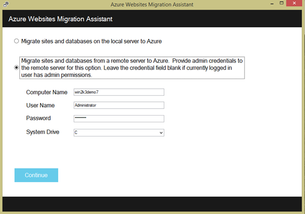
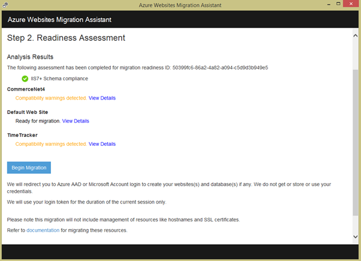

<properties 
    pageTitle="Migrieren einer Enterprise-Web-app zu Azure-App-Verwaltungsdienst" 
    description="Zeigt, wie Web Apps Migrations-Assistenten verwenden, um schnell Migrieren von vorhandenen IIS-Websites zu Azure App Dienst Web Apps" 
    services="app-service" 
    documentationCenter="" 
    authors="cephalin" 
    writer="cephalin" 
    manager="wpickett" 
    editor=""/>

<tags 
    ms.service="app-service" 
    ms.workload="na" 
    ms.tgt_pltfrm="na" 
    ms.devlang="na" 
    ms.topic="article" 
    ms.date="07/01/2016" 
    ms.author="cephalin"/>

# Migrieren einer Enterprise-Web-app zu Azure-App-Verwaltungsdienst

Sie können ganz einfach Ihren vorhandenen Websites migrieren, die Internet Information Service (IIS) 6 oder höher [App Dienst Web Apps](http://go.microsoft.com/fwlink/?LinkId=529714)ausgeführt werden. 

>[AZURE.IMPORTANT] Windows Server 2003 Ende am 14. Juli-2015 erreicht. Wenn Sie aktuell Ihren Websites auf einem IIS-Server hosten Windows Server 2003, Web Apps ist eine sorgt, kostengünstiger, und beinahe problemlose ganz Ihren online-Websites beibehalten und Web Apps Migrations-Assistenten automatisieren des Migrationsvorgangs für Sie helfen können. 

[Web Apps Migrations-Assistenten](https://www.movemetothecloud.net/) können analysieren Ihre IIS-Server-Installation, identifizieren, welche Websites App-Dienst migriert werden können, markieren Sie alle Elemente, die nicht migriert werden oder werden nicht auf der Plattform unterstützt und dann Ihre Websites und die zugeordneten Datenbanken in Azure migrieren.

[AZURE.INCLUDE [app-service-web-to-api-and-mobile](../../includes/app-service-web-to-api-and-mobile.md)]

## Elemente, die während der Analyse Kompatibilität überprüft ##
Der Migrations-Assistent erstellt einen Bericht zur einheitenbereitschaft identifizieren müssen alle möglichen Ursachen für Belang oder blockierenden Probleme, die verhindern können, dass Sie bei der Migration von lokalen IIS zu Azure App Dienst Web Apps. Einige der wichtigsten Elemente zu berücksichtigen sind:

-   Port Bindungen – unterstützt Web Apps nur Port 80 für HTTP und 443 für HTTPS-Datenverkehr. Anderen Anschluss Varianten werden ignoriert und 80 oder 443 Datenverkehr weitergeleitet werden. 
-   Authentifizierung – Web Apps unterstützt anonyme Authentifizierung standardmäßig und formularbasierte Authentifizierung where von einer Anwendung angegeben. Windows-Authentifizierung kann durch die Integration mit Azure Active Directory und ADFS nur verwendet werden. Alle anderen Formen der Authentifizierung – beispielsweise Standardauthentifizierung - werden derzeit nicht unterstützt. 
-   Globalen (GAC) – GAC wird im Web Apps nicht unterstützt. Wenn eine Anwendung Assemblys verweist auf die Sie normalerweise GAC bereitstellen, müssen Sie in den Ordner der Anwendung Bin in Web Apps bereitstellen. 
-   IIS5 Kompatibilitätsmodus – Dies wird in der Web Apps nicht unterstützt. 
-   Anwendungspools – In Web Apps, jede Website und deren untergeordnete Anwendung, die im gleichen Anwendungspool ausgeführt werden. Wenn Ihr Standort mehrere untergeordnete Anwendung Nutzung mehrerer Anwendungspools hat, zu einem einzelnen Anwendung Ressourcenpool mit Allgemeine Einstellungen zu konsolidieren oder jede Anwendung in einer separaten Web app migrieren.
-   COM-Komponenten – Web Apps die Registrierung von COM-Komponenten auf der Plattform nicht zulässig. Wenn Ihre Websites oder Applikationen von einem beliebigen COM-Komponenten verwenden vornehmen, müssen Sie müssen neu erstellt werden in verwaltetem Code und mit der Website oder einer Anwendung bereitstellen.
-   Anforderungsmonitor – kann Web Apps unterstützen die Verwendung von ISAPI-Filtern. In diesem Fall müssen Sie eine der folgenden Aktionen ausführen:
    -   Bereitstellen der DLL-Dateien mit der Web-app 
    -   Registrieren der DLL-Dateien mit [Web.config](http://www.iis.net/configreference/system.webserver/isapifilters)
    -   Speichern Sie eine applicationHost.xdt-Datei im Stammverzeichnis Website mit dem folgenden Inhalt:

            <?xml version="1.0"?>
            <configuration xmlns:xdt="http://schemas.microsoft.com/XML-Document-Transform">
            <configSections>
                <sectionGroup name="system.webServer">
                  <section name="isapiFilters" xdt:Transform="SetAttributes(overrideModeDefault)" overrideModeDefault="Allow" />
                </sectionGroup>
              </configSections>
            </configuration>

        Weitere Beispiele zur Verwendung von XML-Dokumentumwandlungen mit Ihrer Website finden Sie unter [Transformieren Ihrer Microsoft Azure-Website](http://blogs.msdn.com/b/waws/archive/2014/06/17/transform-your-microsoft-azure-web-site.aspx).

-   Andere unsichere Komponenten wie SharePoint Titelseite Server Extensions (FPSE), FTP, SSL-Zertifikate nicht migriert werden.

## So verwenden Sie den Migrations-Assistenten von Web Apps ##
In diesem Abschnitt schrittweise durch ein Beispiel zu wenigen Websites Verwenden einer SQL Server-Datenbank migrieren von und auf einem Computer mit Windows Server 2003 R2 (IIS 6.0) lokal ausgeführt:

1.  Navigieren Sie auf dem IIS-Server oder Ihrem Clientcomputer zu [https://www.movemetothecloud.net/](https://www.movemetothecloud.net/) 

    

2.  Installieren Sie Web Apps Migrations-Assistenten, indem Sie auf die Schaltfläche **Dedizierte IIS-Server** . Weitere Optionen werden die Optionen in Kürze. 
4.  Klicken Sie auf das **Tool installieren** -Schaltfläche, um die Migrations-Assistenten von Web Apps auf Ihrem Computer installieren.

    

    >[AZURE.NOTE] Sie können auch zum Herunterladen einer ZIP-Datei für die Installation von auf Servern nicht mit dem Internet verbunden **Herunterladen für offline installieren** klicken. Oder klicken Sie auf **einen vorhandenen Bericht der Migration Readiness hochladen**, welche ist eine erweiterte Option für die Arbeit mit einer vorhandenen Migrationsbericht zur einheitenbereitschaft, den Sie zuvor generiert (später erläutert).

5.  Klicken Sie auf **Installieren** auf Ihrem Computer installieren, klicken Sie im Bildschirm **Anwendung zu installieren** . Es wird auch entsprechende Abhängigkeiten wie Web bereitstellen, DacFX und IIS, installieren, falls erforderlich. 

    

    Nach der Installation Web Apps Migrations-Assistent wird automatisch gestartet.
  
6.  Wählen Sie **Migrieren von Websites und von einem Remoteserver in Azure-Datenbanken**. Geben Sie die administrativen Anmeldeinformationen für den remote-Server, und klicken Sie auf **Weiter**. 

    

    Sie können natürlich auswählen aus dem lokalen Server migrieren. Die Option remote ist nützlich, wenn Sie Websites aus einem Herstellung IIS-Server migrieren möchten.
 
    Zu diesem Zeitpunkt das Migrationstool prüfen wird der Ihre IIS-Server-Konfiguration, z. B. Websites, Applikationen, Anwendungspools und Abhängigkeiten Candidate Websites für die Migration zu erkennen. 

8.  Das Bildschirmabbild unten zeigt drei Websites – **Standardwebsite**, **TimeTracker**und **CommerceNet4**. Alle diese verfügen über eine zugeordnete Datenbank, die migriert werden soll. Wählen Sie alle Websites, die Sie möchten, bewerten, und klicken Sie dann auf **Weiter**.

    
 
9.  Klicken Sie auf **Hochladen** , um den Bericht Readiness hochladen. Wenn Sie die **Datei lokal speichern**klicken, können zu einem späteren Zeitpunkt erneut ausführen des Migrationstools und den Bericht gespeicherten Readiness hochladen, wie bereits zuvor erwähnt.

    
 
    Nachdem Sie den Bericht zur einheitenbereitschaft hochladen, Azure Readiness Analyse ausführt, und zeigt Ihnen die Ergebnisse. Lesen Sie die Bewertung Details für jede Website, und stellen Sie sicher, dass Sie verstehen, oder alle Probleme behoben haben, bevor Sie fortfahren. 
 
    

12. Klicken Sie auf **Migration zu beginnen** , um der Migration zu beginnen. Sie werden jetzt auf Azure zur Anmeldung bei Ihrem Konto weitergeleitet. Es ist wichtig, dass Sie sich mit einem Konto anmelden, das ein aktives Azure-Abonnement hat. Wenn Sie nicht über ein Azure-Konto verfügen können Sie für eine kostenlose Testversion [hier](https://azure.microsoft.com/pricing/free-trial/?WT.srch=1&WT.mc_ID=SEM_)von signieren. 

13. Wählen Sie mandantenadministratorkonto, Azure-Abonnement und Region für Ihre migrierte Azure Web apps und Datenbanken verwendet werden soll, und klicken Sie dann auf **Migration starten**. Sie können die Websites zu einem späteren Zeitpunkt migrieren auswählen.

    

14. Klicken Sie auf dem nächsten Bildschirm können Sie die Standardeinstellungen für die Migration, wie ändern:

    - Verwenden einer vorhandenen Azure SQL-Datenbank oder eine neue Azure SQL-Datenbank erstellen und Konfigurieren von seine Anmeldeinformationen
    - Wählen Sie die Websites migrieren
    - Definieren von Namen für den Azure Web apps und deren verknüpften SQL-Datenbanken
    - Anpassen der globalen Einstellungen und die Ebene der Einstellungen

    Das Bildschirmabbild unten zeigt alle Websites, die für die Migration mit Standardeinstellungen ausgewählt.

    

    >[AZURE.NOTE] das Kontrollkästchen **Aktivieren Azure Active Directory** in den benutzerdefinierten Einstellungen integriert das Azure Web app mit [Azure Active Directory](active-directory-whatis.md) ( **Verzeichnis Standard**). Weitere Informationen zum Synchronisieren von Azure Active Directory mit Ihrem lokalen Active Directory finden Sie unter [Verzeichnisintegration](http://msdn.microsoft.com/library/jj573653).

16.  Nachdem Sie alle gewünschten Änderungen vornehmen, klicken Sie auf **Erstellen** , um die Migration zu starten. Das Migrationstool wird das Azure SQL-Datenbank und Azure Web app zu erstellen und dann die Inhalte von Websites und Datenbanken veröffentlichen. Der Fortschritt für die Migration in das Migrationstool übersichtlich angezeigt wird, und sehen Sie eine Zusammenfassung am Ende, welche Details der Websites migriert, ob sie erfolgreich, waren, links zu den neu erstellten Azure Web apps. 

    Wenn ein Fehler bei der Migration auftritt, wird das Migrationstool klar die fehlschlagen und Zurücksetzen anzuzeigen die Änderungen. Sie werden auch den Fehlerbericht direkt an das Entwicklungsteam durch Klicken auf die Schaltfläche **Fehlerbericht senden** mit den aufgenommene Fehler Anruf Stapel senden und Nachrichtentext erstellen können. 

    

    Wenn migrieren war erfolgreich ohne Fehler, Sie können auch die Schaltfläche **Feedback geben** um Feedback direkt zur Verfügung. 
 
20. Klicken Sie auf die Links, um den Azure Web apps, und stellen Sie sicher, dass die Migration erfolgreich war.

21. Sie können jetzt in der App-Verwaltungsdienst Azure migrierte Web apps verwalten. Melden Sie hierzu den [Azure-Portal](https://portal.azure.com)aus.

22. Klicken Sie im Portal Azure öffnen Sie das Blade Web Apps, um Ihren migrierte Websites (Siehe als Web apps) finden Sie unter, und klicken Sie auf eine von ihnen den Einstieg Verwalten des Web-app, z. B. fortlaufender Veröffentlichung, Erstellen von Sicherungskopien, automatische Skalierung, und Überwachung Verwendung oder Leistung konfigurieren.

    

>[AZURE.NOTE] Wenn Sie mit Azure-App-Verwaltungsdienst Schritte vor dem für ein Azure-Konto anmelden möchten, wechseln Sie zu [App-Verwaltungsdienst versuchen](http://go.microsoft.com/fwlink/?LinkId=523751), in dem Sie eine kurzlebige Starter Web app sofort im App-Dienst erstellen können. Keine Kreditkarten erforderlich; keine Zusagen.

## Was hat sich geändert
* Ein Leitfaden zum Ändern von Websites-App-Dienst finden Sie unter: [Azure-App-Dienst und seinen Einfluss auf die vorhandenen Azure Services](http://go.microsoft.com/fwlink/?LinkId=529714)
 
