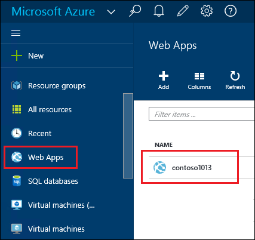
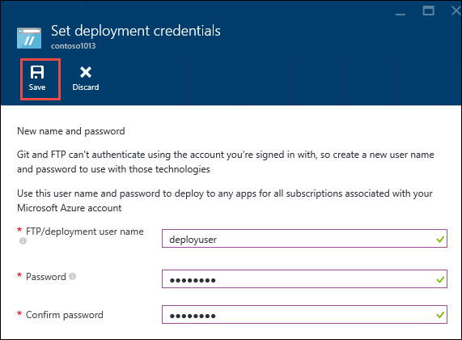
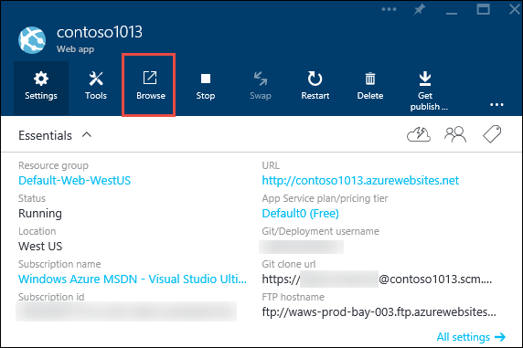

<properties
    pageTitle="Erstellen eine Node.js Web app im App-Verwaltungsdienst Azure | Microsoft Azure"
    description="Erfahren Sie, wie eine Anwendung Node.js mit einer Web App-Verwaltungsdienst Azure bereitgestellt."
    services="app-service\web"
    documentationCenter="nodejs"
    authors="rmcmurray"
    manager="wpickett"
    editor=""/>

<tags
    ms.service="app-service-web"
    ms.workload="web"
    ms.tgt_pltfrm="na"
    ms.devlang="nodejs"
    ms.topic="hero-article"
    ms.date="08/11/2016"
    ms.author="robmcm"/>

# Erstellen Sie eine Node.js Web app in Azure-App-Verwaltungsdienst

> [AZURE.SELECTOR]
- [.NET](web-sites-dotnet-get-started.md)
- [Node.js](web-sites-nodejs-develop-deploy-mac.md)
- [Java](web-sites-java-get-started.md)
- [PHP - Git](web-sites-php-mysql-deploy-use-git.md)
- [PHP - FTP](web-sites-php-mysql-deploy-use-ftp.md)
- [Python](web-sites-python-ptvs-django-mysql.md)

In diesem Lernprogramm erfahren, wie eine einfache [Node.js](http://nodejs.org) -Anwendung zu erstellen, und stellen es in eine [Web app](app-service-web-overview.md) im [App-Verwaltungsdienst Azure](../app-service/app-service-value-prop-what-is.md) mithilfe von [Git](http://git-scm.com). Die Anweisungen in diesem Lernprogramm können auf einem beliebigen Betriebssystem folgen, die ausgeführt Node.js kann.

Lernen Sie:

* Informationen zum Erstellen von einer Web app im App-Verwaltungsdienst Azure mithilfe der Azure-Portal.
* Wie Sie eine Anwendung Node.js zur Web-app bereitstellen, drücken Sie nach der Web-app Git Repository.

Die abgeschlossene Anwendung schreibt eine kurze "Hallo Welt" Zeichenfolge an den Browser.

![Einen Browser, mit der Meldung "Hallo Welt".][helloworld-completed]

Lernprogramme und Stichprobe Code mit komplexeren Node.js Applikationen oder für andere Themen zur Verwendung von Node.js in Azure finden Sie unter der [Node.js Developer Center](/develop/nodejs/).

> [AZURE.NOTE]
> Damit dieses Lernprogramm abgeschlossen, benötigen Sie ein Microsoft Azure-Konto an. Wenn Sie kein Konto haben, können Sie [die Vorteile Ihres Visual Studio Abonnenten aktivieren](/en-us/pricing/member-offers/msdn-benefits-details/?WT.mc_id=A261C142F) , oder [Melden Sie sich für eine kostenlose Testversion](/en-us/pricing/free-trial/?WT.mc_id=A261C142F)an.
>
> Wenn Sie mit Azure-App-Verwaltungsdienst anzufangen, bevor Sie für ein Azure-Konto anmelden möchten, wechseln Sie zu [App-Verwaltungsdienst versuchen](http://go.microsoft.com/fwlink/?LinkId=523751). Es, eine kurzlebige Starter Web app sofort in der App-Dienst erstellen – keine Kreditkarte erforderlich, und keine Zusagen.

## Erstellen einer Web app und Git Veröffentlichung aktivieren

Führen Sie die Schritte zum Erstellen einer Web-app in Azure-App-Dienst und Aktivieren der Veröffentlichung Git aus. 

[Git](http://git-scm.com/) ist ein System mit verteilten Version Steuerelement, mit denen Sie Ihre Website Azure bereitstellen. Sie können den Code, den Sie für Ihre Web-app in einem lokalen Git Repository schreiben speichern, und erhalten Sie von Code in Azure bereitstellen, drücken Sie nach einem remote-Repository. Diese Methode der Bereitstellung ist ein Feature der App-Dienst Web apps.  

1. Melden Sie sich bei der [Azure-Portal](https://portal.azure.com).

2. Klicken Sie auf das oben auf das Symbol **+ neue** des Portals Azure nach links.

3. Klicken Sie auf **Web + Mobile**, und klicken Sie dann auf **Web app**.

    ![][portal-quick-create]

4. Geben Sie einen Namen für das Web app im **Web app** -Feld ein.

    Dieser Name muss in der Domäne azurewebsites.net eindeutig sein, da die URL des Web app {Name} ist. azurewebsites.net. Wenn der eingegebene Name nicht eindeutig ist, wird Sie in das Textfeld ein rotes Ausrufezeichen angezeigt.

5. Wählen Sie ein **Abonnement**aus.

6. Wählen Sie eine **Ressourcengruppe** oder erstellen Sie einen neuen.

    Weitere Informationen zu Ressourcengruppen finden Sie unter [Übersicht Azure Ressourcenmanager](../azure-resource-manager/resource-group-overview.md).

7. Wählen Sie eine **App-Dienst Plan/Speicherort** aus, oder Erstellen eines neuen Kontos.

    Weitere Informationen zur App-Service-Pläne finden Sie unter [Übersicht über die App-Verwaltungsdienst Azure-Pläne](../azure-web-sites-web-hosting-plans-in-depth-overview.md)

8. Klicken Sie auf **Erstellen**.
   
    ![][portal-quick-create2]

    In kurzer Zeit, in der Regel weniger als einer Minute endet Azure das neuen Web app erstellen.

9. Klicken Sie auf **Web apps > {neue Web app}**.

    

10. Klicken Sie in das Blade **Web app** auf das Webpart für die **Bereitstellung** .

    ![][deployment-part]

11. Klicken Sie in das Blade **Fortlaufender Bereitstellung** auf **Quelle auswählen**

12. Klicken Sie auf **Lokale Git Repository**, und klicken Sie dann auf **OK**.

    ![][setup-git-publishing]

13. Einrichten von Bereitstellung Anmeldeinformationen ein, wenn Sie dies nicht bereits getan haben.

    ein. Klicken Sie in das Web app-Blade auf **Einstellungen > Bereitstellung Anmeldeinformationen**.

    ![][deployment-credentials]
 
    b. Erstellen Sie einen Benutzernamen und ein Kennwort ein. 
    
    

14. Klicken Sie in das Web app Blade klicken Sie auf **Einstellungen**, und klicken Sie dann auf **Eigenschaften**.
 
    Wenn Sie veröffentlichen möchten, werden Sie an einem entfernten Git Repository drücken. Die URL für das Repository wird unter **GIT URL**aufgeführt. Sie verwenden diese URL später im Lernprogramm.

    ![][git-url]

## Erstellen und Testen der Anwendung lokal

In diesem Abschnitt erstellen Sie eine **server.js** -Datei, die eine leicht abgewandelte Version des Beispiels aus [nodejs.org] "Hallo Welt" enthält. Der Code fügt process.env.PORT als Port Abhören beim Ausführen in einer Azure Web app an.

1. Erstellen Sie ein Verzeichnis mit der Bezeichnung *Helloworld*.

2. Verwenden Sie einen Text-Editor, um eine neue Datei namens **server.js** im Verzeichnis *Helloworld* zu erstellen.

2. Kopieren Sie den folgenden Code in die **server.js** -Datei, und speichern Sie die Datei:

        var http = require('http')
        var port = process.env.PORT || 1337;
        http.createServer(function(req, res) {
          res.writeHead(200, { 'Content-Type': 'text/plain' });
          res.end('Hello World\n');
        }).listen(port);

3. Öffnen Sie die Befehlszeile, und verwenden Sie den folgenden Befehl aus, um lokal des Web-app starten.

        node server.js

4. Öffnen Sie Ihren Browser, und navigieren Sie zu Http://localhost:1337. 

    Auf eine Webseite, die "Hallo Welt" zeigt angezeigt wird, wie im folgenden Screenshot dargestellt.

    ![Einen Browser, mit der Meldung "Hallo Welt".][helloworld-localhost]

## Veröffentlichen Sie die Anwendung

1. Installieren Sie Git, wenn Sie dies nicht bereits getan haben.

    Installation Anweisungen für Ihre Plattform finden Sie unter der [Git Seite herunterladen](http://git-scm.com/download).

1. Wechseln Sie in das Verzeichnis **Helloworld** , und geben Sie den folgenden Befehl aus ein lokales Git Repository Initialisierung, über die Befehlszeile.

        git init

2. Verwenden Sie die folgenden Befehle, um die Dateien zum Repository hinzufügen:

        git add .
        git commit -m "initial commit"

3. Fügen Sie eine Git remote für drücken Sie Updates nach der Web-app, die Sie zuvor erstellt haben, mit dem folgenden Befehl hinzu:

        git remote add azure [URL for remote repository]

4. Drücken Sie die Änderungen in Azure mit den folgenden Befehl aus:

        git push azure master

    Sie sind für das Kennwort aufgefordert, die Sie zuvor erstellt haben. Die Ausgabe ist ähnlich wie im folgenden Beispiel.

        Counting objects: 3, done.
        Delta compression using up to 8 threads.
        Compressing objects: 100% (2/2), done.
        Writing objects: 100% (3/3), 374 bytes, done.
        Total 3 (delta 0), reused 0 (delta 0)
        remote: New deployment received.
        remote: Updating branch 'master'.
        remote: Preparing deployment for commit id '5ebbe250c9'.
        remote: Preparing files for deployment.
        remote: Deploying Web.config to enable Node.js activation.
        remote: Deployment successful.
        To https://user@testsite.scm.azurewebsites.net/testsite.git
         * [new branch]      master -> master

5. Wenn Ihre app anzeigen möchten, klicken Sie auf die Schaltfläche **Durchsuchen** im **Web App** -Webpart Azure-Portal.

    

    

## Veröffentlichen von Änderungen an Ihrer Anwendung

1. Öffnen Sie die **server.js** -Datei in einem Text-Editor, und ändern Sie 'Hallo World\n' in 'Hallo Azure\n'. 

2. Speichern Sie die Datei ein.

2. Über die Befehlszeile wechseln Sie in das Verzeichnis **Helloworld** , und führen Sie die folgenden Befehle:

        git add .
        git commit -m "changing to hello azure"
        git push azure master

    Sie sind für das Kennwort erneut aufgefordert.

3. Aktualisieren Sie das Browserfenster, das Sie der Web-app-URL navigiert.

    ![Einer Webseite 'Hallo Azure' anzeigt][helloworld-completed]

## Zurücksetzen einer bereitstellungs

Aus dem **Web app** Blade klicken Sie **Einstellungen > fortlaufender Bereitstellung** um den Verlauf Bereitstellung in das Blade **Bereitstellungen** anzuzeigen. Wenn Sie zum Wiederherstellen einer früheren bereitstellungs benötigen, können wählen Sie ihn aus und klicken Sie dann in das Blade **Deployment Details** auf **erneut bereitstellen** .

## Nächste Schritte

Sie haben eine Anwendung Node.js mit einer Web App-Verwaltungsdienst Azure bereitgestellt. Wenn Sie weitere Informationen dazu, wie der App-Dienst Web apps Node.js Applikationen ausgeführt werden, finden Sie unter [Azure App Dienst Web Apps: Node.js](http://blogs.msdn.com/b/silverlining/archive/2012/06/14/windows-azure-websites-node-js.aspx) und [eine Version Node.js in Azure-Anwendung angeben](../nodejs-specify-node-version-azure-apps.md).

Node.js bietet eine Rich-Netz von Module, die von Ihrer verwendet werden können. Funktionsweise der Web Apps mit Modulen finden Sie unter [Verwenden von Node.js Module mit Azure Applications](../nodejs-use-node-modules-azure-apps.md).

Wenn Sie Probleme mit Ihrer Anwendung auftreten, nachdem sie in Azure bereitgestellt wurde, finden Sie unter [Debuggen einer Anwendung Node.js in Azure-App-Verwaltungsdienst](web-sites-nodejs-debug.md) Informationen über das Problem diagnostizieren.

In diesem Artikel wird das Azure-Portal zum Erstellen einer Web-app verwendet. Die [Azure Line Benutzeroberfläche](../xplat-cli-install.md) oder [Azure PowerShell](../powershell-install-configure.md) können Sie auch dieselben Operationen durchführen.

Weitere Informationen zum Entwickeln von Node.js Applikationen auf Azure finden Sie im [Node.js Developer Center](/develop/nodejs/).

[helloworld-completed]: ./media/web-sites-nodejs-develop-deploy-mac/helloazure.png
[helloworld-localhost]: ./media/web-sites-nodejs-develop-deploy-mac/helloworldlocal.png
[portal-quick-create]: ./media/web-sites-nodejs-develop-deploy-mac/create-quick-website.png
[portal-quick-create2]: ./media/web-sites-nodejs-develop-deploy-mac/create-quick-website2.png
[setup-git-publishing]: ./media/web-sites-nodejs-develop-deploy-mac/setup_git_publishing.png
[go-to-dashboard]: ./media/web-sites-nodejs-develop-deploy-mac/go_to_dashboard.png
[deployment-part]: ./media/web-sites-nodejs-develop-deploy-mac/deployment-part.png
[deployment-credentials]: ./media/web-sites-nodejs-develop-deploy-mac/deployment-credentials.png
[git-url]: ./media/web-sites-nodejs-develop-deploy-mac/git-url.png
