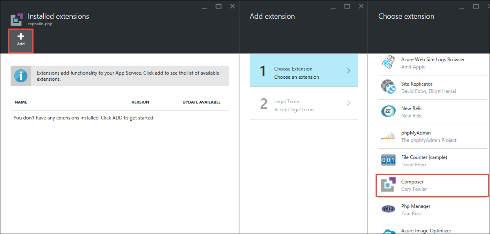

<properties
    pageTitle="Konfigurieren von PHP in Azure App-Verwaltungsdienst Web Apps | Microsoft Azure"
    description="Informationen Sie zum Konfigurieren der Standardinstallation von PHP oder fügen Sie eine benutzerdefinierte Installation von PHP für Web Apps in Azure-App-Verwaltungsdienst."
    services="app-service"
    documentationCenter="php"
    authors="rmcmurray"
    manager="wpickett"
    editor=""/>

<tags
    ms.service="app-service"
    ms.workload="web"
    ms.tgt_pltfrm="na"
    ms.devlang="PHP"
    ms.topic="article"
    ms.date="08/11/2016"
    ms.author="robmcm"/>

#Konfigurieren von PHP in Azure App-Verwaltungsdienst Web Apps

## Einführung

In diesem Handbuch wird gezeigt, wie die integrierte Laufzeit von PHP für Web Apps in [Azure-App-Verwaltungsdienst](http://go.microsoft.com/fwlink/?LinkId=529714)konfigurieren, Bereitstellen einer benutzerdefinierten Laufzeit von PHP und Erweiterungen aktivieren. Um die App-Dienst verwenden möchten, melden Sie sich für die [kostenlose Testversion]an. Um dieses Handbuch optimal zu nutzen, sollten Sie zuerst eine Web-app von PHP in App-Dienst erstellen.

[AZURE.INCLUDE [app-service-web-to-api-and-mobile](../../includes/app-service-web-to-api-and-mobile.md)]

## So: ändern die integrierte Version von PHP
Standardmäßig ist 5.4 von PHP installiert und sofort einsatzbereit beim Erstellen einer App-Dienst Web app. Am einfachsten finden Sie die verfügbaren Release-Version, die voreingestellte Konfiguration und die Erweiterungen aktivierten ist ein Skript bereitstellen, die die Funktion [phpinfo()] ruft.

Versionen von PHP 5.5 und 5.6 von PHP sind auch zur Verfügung, aber nicht standardmäßig aktiviert. Wenn die Version von PHP aktualisieren möchten, führen Sie eine der folgenden Methoden aus:

### Azure-Portal

1. Suchen Sie im [Portal Azure](https://portal.azure.com) -Web app, und klicken Sie auf die Schaltfläche " **Einstellungen** ".

    ![Web App-Einstellungen][settings-button]

2. Wählen Sie **Anwendungseinstellungen** , und wählen Sie die neue Version von PHP, aus dem Blade **Einstellungen** .

    ![Anwendungseinstellungen][application-settings]

3. Klicken Sie auf die Schaltfläche **Speichern** am oberen Rand der Blade **Web app-Einstellungen** .

    ![Konfiguration von Einstellungen speichern][save-button]

### Azure PowerShell (Windows)

1. Öffnen Azure PowerShell, und melden Sie sich bei Ihrem Konto:

        PS C:\> Login-AzureRmAccount

2. Legen Sie die PHP-Version für das Web app an.

        PS C:\> Set-AzureWebsite -PhpVersion [5.4 | 5.5 | 5.6] -Name {site-name}

3. Die Version von PHP ist nun festgelegt. Sie können diese Einstellungen bestätigen:

        PS C:\> Get-AzureWebsite -Name {site-name} | findstr PhpVersion

### Azure Line Interface (Linux, Mac, Windows)

Um die Schnittstelle der Azure-Line verwenden zu können, müssen Sie **Node.js** auf Ihrem Computer installiert haben.

1. Öffnen Terminal, und melden Sie sich bei Ihrem Konto.

        azure login

2. Legen Sie die PHP-Version für das Web app an.

        azure site set --php-version [5.4 | 5.5] {site-name}

3. Die Version von PHP ist nun festgelegt. Sie können diese Einstellungen bestätigen:

        azure site show {site-name}

## So: Ändern Sie die integrierten Konfigurationen von PHP

Für alle integrierten PHP-Laufzeit können Sie die Optionen für die Konfiguration durch die folgenden Schritte ändern. (Informationen zu php.ini Richtlinien, finden Sie unter [Liste der php.ini Richtlinien]).

### Ändern von PHP\_INI\_Benutzer, PHP\_INI\_PERDIR, PHP\_INI\_alle Konfigurations-Einstellungen

1. Hinzufügen eines [. user.ini] Datei zum Stammverzeichnis.
2. Fügen Sie die in der `.user.ini` Datei mit der gleichen Syntax Sie in Verwenden einer `php.ini` Datei. Angenommen, Sie aktivieren möchten die `display_errors` Einstellung auf und festlegen `upload_max_filesize` auf 10M festlegen Ihrer `.user.ini` Datei würde dieser Text enthalten:

        ; Example Settings
        display_errors=On
        upload_max_filesize=10M
        
        ; OPTIONAL: Turn this on to write errors to d:\home\LogFiles\php_errors.log
        ; log_errors=On

3. Bereitstellen der Web app an.
4. Starten des Web app an. (Einen Neustart ist erforderlich, da die Häufigkeit, mit welcher PHP liest `.user.ini` Dateien unterliegt den `user_ini.cache_ttl` Einstellung, die eine Ebene System-Einstellung wird und 300 Sekunden (5 Minuten) standardmäßig. Das Web app einen Neustart von PHP, lesen die neuen Einstellungen in erzwingt die `.user.ini` Datei.)

Als Alternative zur Verwendung eines `.user.ini` Datei, können die Funktion [ini_set()] in Skripts festlegen, die nicht System Ebene Richtlinien sind.

### Ändern von PHP\_INI\_Konfiguration Systemeinstellungen

1. Hinzufügen einer App-Einstellung zu Ihrer Web-App mit dem Schlüssel `PHP_INI_SCAN_DIR` und Wert`d:\home\site\ini`
2. Erstellen einer `settings.ini` mit Kudu Console-Datei (http://&lt;Name der Website&gt;. scm.azurewebsite.net) in der `d:\home\site\ini` Directory.
3. Fügen Sie die in der `settings.ini` mit derselben Syntax Sie verwenden in einer Datei php.ini-Datei. Beispielsweise, wenn Sie beispielsweise verweisen die `curl.cainfo` Einstellung einer `*.crt` ' Datei ' und 'wincache.maxfilesize' Einstellung auf 512 KB, Festlegen Ihrer `settings.ini` Datei würde dieser Text enthalten:

        ; Example Settings
        curl.cainfo="%ProgramFiles(x86)%\Git\bin\curl-ca-bundle.crt"
        wincache.maxfilesize=512
4. Starten der Web-App, um die Änderungen zu laden.

## So: Aktivieren Sie in der standardmäßigen PHP Runtime Erweiterungen
Wie im vorherigen Abschnitt erwähnt, ist die beste Möglichkeit, die Standardversion von PHP, deren Standardkonfiguration und der aktiviert Extensions finden Sie unter ein Skript bereitstellen, auf denen [phpinfo()]Anrufe. Um zusätzliche Erweiterungen aktivieren möchten, führen Sie die folgenden Schritte aus:

### Konfigurieren von über Ini-Einstellungen

1. Hinzufügen eines `ext` Verzeichnis in die `d:\home\site` Directory.
2. Setzen Sie `.dll` Erweiterung ältere Dateien in der `ext` Verzeichnis (z. B. `php_mongo.dll` und `php_xdebug.dll`). Stellen Sie sicher, dass die Erweiterungen mit der Standardversion von PHP (also zum Zeitpunkt dieses Schreiben von PHP 5.4,) und sind VC9 und nicht-Thread-Safe (Nts) kompatible kompatibel sind.
3. Hinzufügen einer App-Einstellung zu Ihrer Web-App mit dem Schlüssel `PHP_INI_SCAN_DIR` und Wert`d:\home\site\ini`
4. Erstellen einer `ini` Datei `d:\home\site\ini` aufgerufen `extensions.ini`.
5. Fügen Sie die in der `extensions.ini` mit derselben Syntax Sie verwenden in einer Datei php.ini-Datei. Beispielsweise, wenn Sie zum Aktivieren der Extensions MongoDB und XDebug Ihrer `extensions.ini` Datei würde dieser Text enthalten:

        ; Enable Extensions
        extension=d:\home\site\ext\php_mongo.dll
        zend_extension=d:\home\site\ext\php_xdebug.dll
6. Starten der Web-App, um die Änderungen zu laden.

### Konfigurieren Sie über die App-Einstellung

1. Hinzufügen eines `bin` Verzeichnis zum Stammverzeichnis.
2. Setzen Sie `.dll` Erweiterung ältere Dateien in der `bin` Verzeichnis (z. B. `php_mongo.dll`). Stellen Sie sicher, dass die Erweiterungen mit der Standardversion von PHP (also zum Zeitpunkt dieses Schreiben von PHP 5.4,) und sind VC9 und nicht-Thread-Safe (Nts) kompatible kompatibel sind.
3. Bereitstellen der Web app an.
4. Navigieren Sie zu der Web app im Portal Azure, und klicken Sie auf die Schaltfläche " **Einstellungen** ".

    ![Web App-Einstellungen][settings-button]

5. Wählen Sie aus dem **Einstellungen** Blade **Anwendungseinstellungen** und führen Sie einen Bildlauf zum Abschnitt **Einstellungen für die App** aus.
6. Erstellen Sie einen Schlüssel **PHP_EXTENSIONS** im Abschnitt **Einstellungen für die App** . Wäre der Wert für diesen Schlüssel einen Pfad relativ zum Stammverzeichnis der Website: **Bin\your-App.-Datei**.

    ![Aktivieren Sie die Erweiterung in der app-Einstellungen][php-extensions]

7. Klicken Sie auf die Schaltfläche **Speichern** am oberen Rand der Blade **Web app-Einstellungen** .

    ![Konfiguration von Einstellungen speichern][save-button]

Zend Erweiterungen werden auch durch Drücken einer Taste **PHP_ZENDEXTENSIONS** unterstützt. Um mehrere Erweiterungen zu aktivieren, hinzufügen eine durch Trennzeichen getrennte Liste von `.dll` Dateien für den Wert der app-Einstellung.

## So: verwenden eine benutzerdefinierte Laufzeit von PHP
Anstelle von PHP-Laufzeit Standard können App Dienst Web Apps eine Laufzeit von PHP, die Sie zum Ausführen von PHP Skripts bereitstellen. Die Laufzeit, die Sie bereitstellen kann konfiguriert werden, indem eine `php.ini` Datei, die Sie auch bereitstellen. Gehen Sie wie folgt vor um eine benutzerdefinierte Laufzeit von PHP mit Web Apps zu verwenden.

1. Erhalten einer Thread-Safe, VC9 oder VC11 kompatible Version von PHP für Windows. Zuletzt verwendete Versionen von PHP für Windows finden Sie hier: [http://windows.php.net/download/]. Ältere Versionen finden Sie in das Archiv hier: [http://windows.php.net/downloads/releases/archives/].
2. Ändern der `php.ini` Datei für Ihre Runtime. Beachten Sie, dass keine Konfiguration Einstellungen, die nur für die System Ebene Richtlinien sind von Web Apps ignoriert werden. (Informationen zu System Ebene nur-Richtlinien, finden Sie unter [Liste der php.ini Richtlinien]).
3. Optional können Sie Ihre Runtime von PHP Erweiterungen hinzu, und aktivieren sie in der `php.ini` Datei.
4. Hinzufügen eines `bin` Verzeichnis zu Stammverzeichnis und sich im Verzeichnis, die Ihre PHP Runtime darin enthält (z. B. `bin\php`).
5. Bereitstellen der Web app an.
4. Navigieren Sie zu der Web app im Portal Azure, und klicken Sie auf die Schaltfläche " **Einstellungen** ".

    ![Web App-Einstellungen][settings-button]

7. Wählen Sie aus dem **Einstellungen** Blade **Anwendungseinstellungen** und führen Sie einen Bildlauf zum Abschnitt **Ereignishandler Zuordnungen** aus. Hinzufügen von `*.php` an die Erweiterung Feld, und fügen Sie den Pfad zu der `php-cgi.exe` ausführbare. Wenn Sie Ihre Runtime von PHP setzen Sie in der `bin` Verzeichnis im Stammverzeichnis der Anwendung, der Pfad werden `D:\home\site\wwwroot\bin\php\php-cgi.exe`.

    ![Ereignishandler führt Zuordnungen angeben][handler-mappings]

8. Klicken Sie auf die Schaltfläche **Speichern** am oberen Rand der Blade **Web app-Einstellungen** .

    ![Konfiguration von Einstellungen speichern][save-button]

<a name="composer" />
## So: Composer Automatisierung in Azure aktivieren

Standardmäßig App-Dienst mit composer.json, keine Auswirkung, wenn Sie eine in Ihrem Projekt von PHP haben. Wenn Sie [Git-Bereitstellung](app-service-web-php-get-started.md)verwenden, können Sie composer.json während der Bearbeitung aktivieren `git push` durch die Erweiterung Composer aktivieren.

>[AZURE.NOTE] Sie können eine [Stimme für herausragende Composer-Unterstützung in der App-Verwaltungsdienst hier](https://feedback.azure.com/forums/169385-web-apps-formerly-websites/suggestions/6477437-first-class-support-for-composer-and-pip)!

1. Klicken Sie auf **Extras**, in Ihrem PHP Web app-vorher in der [Azure-Portal](https://portal.azure.com), > **Erweiterungen**.

    

2. Klicken Sie auf **Hinzufügen**, und klicken Sie auf **Composer**.

    
    
3. Klicken Sie auf **OK** , um die Vertragsbedingungen annehmen. Klicken Sie auf **OK** , um die Erweiterung hinzufügen.

    Das **installierte Erweiterungen** Blade wird jetzt die Erweiterung Composer angezeigt.  
    
    
4. Führen Sie nun `git add`, `git commit`, und `git push` wie im vorherigen Abschnitt. Sie sehen nun, dass Composer Abhängigkeiten definiert composer.json installiert werden.

    

## Nächste Schritte

Weitere Informationen finden Sie im [Developer Center von PHP](/develop/php/).

>[AZURE.NOTE] Wenn Sie mit Azure-App-Verwaltungsdienst Schritte vor dem für ein Azure-Konto anmelden möchten, wechseln Sie zu [App-Verwaltungsdienst versuchen](http://go.microsoft.com/fwlink/?LinkId=523751), in dem Sie eine kurzlebige Starter Web app sofort im App-Dienst erstellen können. Keine Kreditkarten erforderlich; keine Zusagen.

[kostenlose Testversion]: https://www.windowsazure.com/pricing/free-trial/
[phpinfo()]: http://php.net/manual/en/function.phpinfo.php
[select-php-version]: ./media/web-sites-php-configure/select-php-version.png
[Liste der php.ini Richtlinien]: http://www.php.net/manual/en/ini.list.php
[. user.ini]: http://www.php.net/manual/en/configuration.file.per-user.php
[ini_set()]: http://www.php.net/manual/en/function.ini-set.php
[application-settings]: ./media/web-sites-php-configure/application-settings.png
[settings-button]: ./media/web-sites-php-configure/settings-button.png
[save-button]: ./media/web-sites-php-configure/save-button.png
[php-extensions]: ./media/web-sites-php-configure/php-extensions.png
[handler-mappings]: ./media/web-sites-php-configure/handler-mappings.png
[http://Windows.PHP.NET/Download/]: http://windows.php.net/download/
[http://Windows.PHP.NET/Downloads/Releases/Archives/]: http://windows.php.net/downloads/releases/archives/
[SETPHPVERCLI]: ./media/web-sites-php-configure/ChangePHPVersion-XPlatCLI.png
[GETPHPVERCLI]: ./media/web-sites-php-configure/ShowPHPVersion-XplatCLI.png
[SETPHPVERPS]: ./media/web-sites-php-configure/ChangePHPVersion-PS.png
[GETPHPVERPS]: ./media/web-sites-php-configure/ShowPHPVersion-PS.png
 
