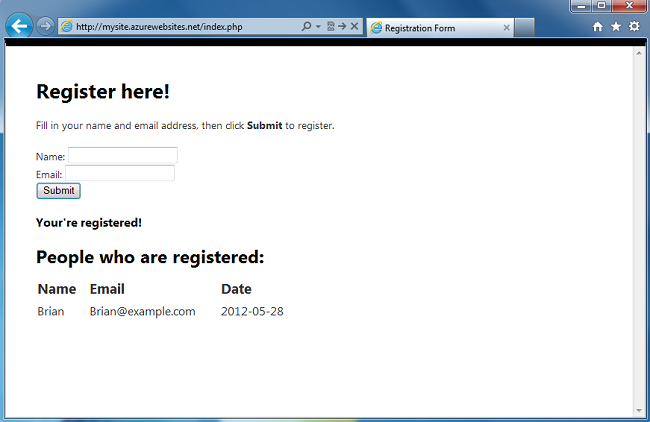
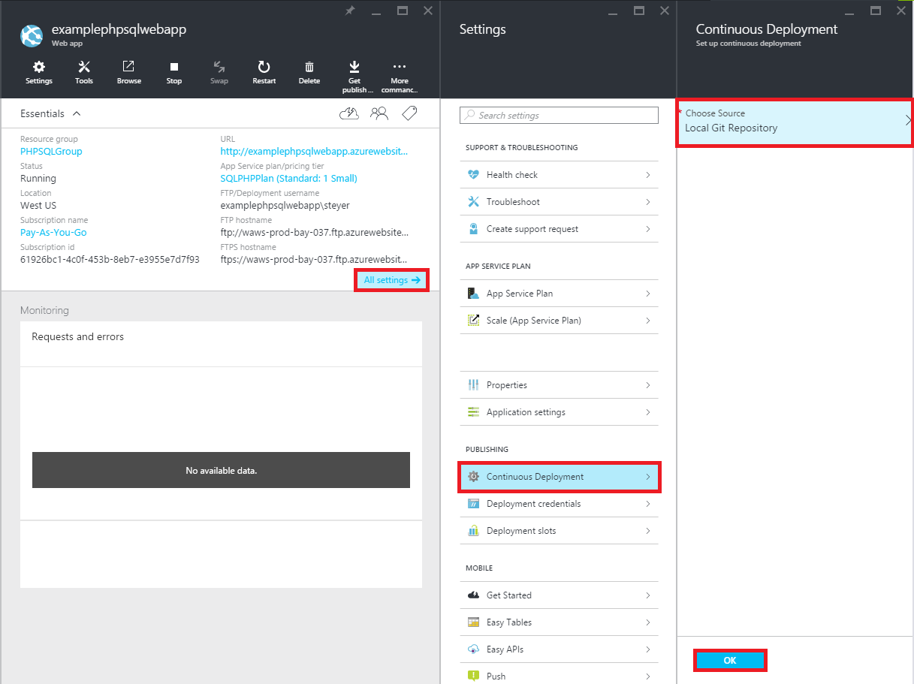

<properties 
    pageTitle="Erstellen einer Web-app von PHP-SQL und Bereitstellen für App-Verwaltungsdienst Azure Git verwenden" 
    description="Ein Lernprogramm, der veranschaulicht, wie Sie zum Erstellen einer Web-app von PHP, die Daten in Azure SQL-Datenbank gespeichert sind und Git Bereitstellung Azure-App-Dienst verwenden." 
    services="app-service\web, sql-database" 
    documentationCenter="php" 
    authors="rmcmurray" 
    manager="wpickett" 
    editor=""/>

<tags 
    ms.service="app-service-web" 
    ms.workload="web" 
    ms.tgt_pltfrm="na" 
    ms.devlang="PHP" 
    ms.topic="article" 
    ms.date="08/11/2016" 
    ms.author="robmcm"/>

# Erstellen einer Web-app von PHP-SQL und Bereitstellen für App-Verwaltungsdienst Azure Git verwenden

In diesem Lernprogramm erfahren Sie, wie eine Web-app von PHP in [Azure-App-Verwaltungsdienst](http://go.microsoft.com/fwlink/?LinkId=529714) zu erstellen, die und Azure SQL-Datenbank besteht und wie Sie es mit Git bereitstellen. In diesem Lernprogramm wird vorausgesetzt, dass [PHP][install-php], [SQL Server Express][install-SQLExpress], die [Microsoft-Treiber für SQL Server für PHP](http://www.microsoft.com/download/en/details.aspx?id=20098)und [Git] [ install-git] auf Ihrem Computer installiert ist. Nach Abschluss dieses Handbuch, haben Sie eine PHP-SQL-Web-app in Azure ausgeführt.

> [AZURE.NOTE]
> Sie können installieren und Konfigurieren von PHP, SQL Server Express und die Microsoft-Drivers für SQL Server für PHP mit dem [Microsoft Web Platform Installer](http://www.microsoft.com/web/downloads/platform.aspx).

Lernen Sie Folgendes:

* Informationen zum Erstellen einer Azure Web app und einer über das [Portal Azure](http://go.microsoft.com/fwlink/?LinkId=529715)SQL-Datenbank. Da in der App-Dienst Web Apps PHP standardmäßig aktiviert ist, ist keine besonderen zum Ausführen von PHP-Code erforderlich.
* Informationen zum Veröffentlichen und erneut veröffentlichen Sie die Anwendung in Azure Git verwenden.
 
Anhand dieses Lernprogramms erstellen Sie eine einfache Registrierung Webanwendung in PHP. Die Anwendung wird in einer Website Azure gehostet werden. Ein Screenshot der fertigen Anwendung lautet wie folgt:

[AZURE.INCLUDE [create-account-and-websites-note](../../includes/create-account-and-websites-note.md)]

>[AZURE.NOTE] Wenn Sie mit Azure-App-Verwaltungsdienst Schritte vor dem für ein Azure-Konto anmelden möchten, wechseln Sie zu [App-Verwaltungsdienst versuchen](http://go.microsoft.com/fwlink/?LinkId=523751), in dem Sie eine kurzlebige Starter Web app sofort im App-Dienst erstellen können. Keine Kreditkarten erforderlich; keine Zusagen.

##Erstellen einer Azure Web app und Einrichten von Git für die Veröffentlichung

Wie folgt vor, um eine Azure Web app und einer SQL-Datenbank zu erstellen:

1. Melden Sie sich bei der [Azure-Portal](https://portal.azure.com/).

2. Öffnen, die links von der Azure Marketplace, indem Sie auf das Symbol **neu** oben des Dashboards, klicken Sie auf **Alles auswählen** neben Marketplace und **Web + Mobile**auswählen.
    
3. Wählen Sie in der Marketplace **Web + Mobile**aus.

4. Klicken Sie auf das Symbol **Web app + SQL** .

5. Wählen Sie nach dem Lesen der Beschreibung des Web app + SQL-app, **Erstellen**.

6. Klicken Sie auf die einzelnen Teile (**Ressourcengruppe**, **Web App**, **Datenbank**und **Abonnement**) auf, und geben Sie ein oder wählen Sie Werte für die erforderlichen Felder:
    
    - Geben Sie einen URL-Namen Ihrer Wahl   
    - Konfigurieren der Datenbank-Serveranmeldeinformationen
    - Wählen Sie Ihre region

    

7. Klicken Sie abschließend das Web app zu definieren, klicken Sie auf **Erstellen**.

    Wenn das Web app erstellt wurde, wird die Schaltfläche **Benachrichtigungen** grünen **Erfolg** und der Ressource Gruppe Blade öffnen, um sowohl das Web app und der SQL-Datenbank in der Gruppe anzeigen blinkt.

4. Klicken Sie auf der Web-app-Symbol in der Ressource Gruppe Blade Blade der Web-app zu öffnen.

    

5. Klicken Sie in den **Einstellungen** auf **fortlaufender Bereitstellung** > **konfigurieren: Einstellungen erforderlich**. Wählen Sie **Lokales Git Repository** aus, und klicken Sie auf **OK**.

    

    Wenn Sie ein Repository Git vor nicht eingerichtet haben, müssen Sie einen Benutzernamen und ein Kennwort angeben. Klicken Sie hierzu auf **Einstellungen** > **Bereitstellung Anmeldeinformationen** in der Web-app Blade.

    

6. In den **Einstellungen** auf **Eigenschaften** Git remote-URL finden Sie später Ihre app von PHP bereitstellen verwenden müssen.

##Abrufen von Verbindungsinformationen SQL-Datenbank

Verbindung zu der SQL-Datenbank-Instanz, die bei der Web-app, Ihre wird verknüpft ist benötigen Sie die Verbindungsinformationen, die Sie angegeben haben, wenn Sie die Datenbank erstellt haben. Gehen Sie folgendermaßen vor, um die Verbindungsinformationen SQL-Datenbank zu erhalten:

1. Klicken Sie in der Ressourcengruppe Blade auf der SQL-Datenbank-Symbol.

2. Klicken Sie auf **Einstellungen**, in der SQL-Datenbank-Blade > **Eigenschaften**, klicken Sie dann auf **Datenbank Verbindungszeichenfolgen anzeigen**. 

    
    
3. Klicken Sie im Abschnitt **PHP** der daraufhin angezeigten Dialogfeld Notieren Sie die Werte für `Server`, `SQL Database`, und `User Name`. Sie werden diese Werte beim Veröffentlichen von PHP Web app in Azure-App-Verwaltungsdienst später verwenden.

##Erstellen und Testen der Anwendung lokal

Die Anwendung Registrierung ist eine einfache PHP-Anwendung, die Sie registrieren für ein Ereignis, indem Sie Ihren Namen und e-Mail-Adresse kann. Informationen zum vorherigen Teilnehmer wird in einer Tabelle angezeigt. Registrierungsinformationen werden in einer Instanz von SQL-Datenbank gespeichert. Die Anwendung besteht aus zwei Dateien (verfügbar unter Kopieren und Einfügen Code):

* **Index.PHP**: Zeigt ein Formular für die Registrierung und eine Tabelle mit Registrant-Informationen.
* **CreateTable.PHP**: die SQL-Datenbank-Tabelle für die Anwendung erstellt. Diese Datei wird nur einmal verwendet werden.

Um die Anwendung lokal ausführen zu können, führen Sie die folgenden Schritte aus. Beachten Sie, dass es sich bei diesen Schritten wird vorausgesetzt, Sie PHP und SQL Server Express auf dem lokalen Computer eingerichtet haben, und der [Wechsel Erweiterung für SQL Server]aktiviert sind[pdo-sqlsrv].

1. Erstellen einer SQL Server-Datenbank aufgerufen `registration`. Sie können dafür aus der `sqlcmd` Eingabeaufforderungsfenster mit der folgenden Befehle:

        >sqlcmd -S localhost\sqlexpress -U <local user name> -P <local password>
        1> create database registration
        2> GO   

2. Erstellen Sie im Stammverzeichnis Anwendung, zwei Dateien darin – eine mit der Bezeichnung `createtable.php` und eine mit der Bezeichnung `index.php`.

3. Öffnen der `createtable.php` -Datei in einem Text-Editor oder IDE, und fügen Sie den folgenden Code hinzu. Zum Erstellen dieses Codes verwendet werden die `registration_tbl` Tabelle der `registration` Datenbank.

        <?php
        // DB connection info
        $host = "localhost\sqlexpress";
        $user = "user name";
        $pwd = "password";
        $db = "registration";
        try{
            $conn = new PDO( "sqlsrv:Server= $host ; Database = $db ", $user, $pwd);
            $conn->setAttribute( PDO::ATTR_ERRMODE, PDO::ERRMODE_EXCEPTION );
            $sql = "CREATE TABLE registration_tbl(
            id INT NOT NULL IDENTITY(1,1) 
            PRIMARY KEY(id),
            name VARCHAR(30),
            email VARCHAR(30),
            date DATE)";
            $conn->query($sql);
        }
        catch(Exception $e){
            die(print_r($e));
        }
        echo "<h3>Table created.</h3>";
        ?>

    Beachten Sie, dass Sie die Werte für aktualisieren müssen <code>$user</code> und <code>$pwd</code> mit Ihrem lokalen SQL Server-Benutzernamen und Ihr Kennwort ein.

4. Geben Sie den folgenden Befehl ein Terminal im Stammverzeichnis der Anwendung:

        php -S localhost:8000

4. Öffnen Sie einen Webbrowser, und navigieren Sie zu **Http://localhost:8000/createtable.php**. Dies erstellt die `registration_tbl` Tabelle in der Datenbank.

5. Öffnen Sie die **index.php** -Datei in einem Text-Editor oder IDE und fügen Sie den grundlegenden HTML- und CSS-Code für die Seite (PHP-Code wird in späteren Schritten hinzugefügt hinzu).

        <html>
        <head>
        <Title>Registration Form</Title>
        
        </head>
        <body>
        <h1>Register here!</h1>
        
Fill in your name and email address, then click <strong>Submit</strong> to register.

        <form method="post" action="index.php" enctype="multipart/form-data" >
              Name  <input type="text" name="name" id="name"/> 
              Email <input type="text" name="email" id="email"/> 
              <input type="submit" name="submit" value="Submit" />
        </form>
        <?php

        ?>
        </body>
        </html>

6. Hinzufügen von PHP-Code zum Herstellen einer Verbindung mit der Datenbank innerhalb der PHP-Tags.

        // DB connection info
        $host = "localhost\sqlexpress";
        $user = "user name";
        $pwd = "password";
        $db = "registration";
        // Connect to database.
        try {
            $conn = new PDO( "sqlsrv:Server= $host ; Database = $db ", $user, $pwd);
            $conn->setAttribute( PDO::ATTR_ERRMODE, PDO::ERRMODE_EXCEPTION );
        }
        catch(Exception $e){
            die(var_dump($e));
        }

    Sie müssen erneut, aktualisieren die Werte für <code>$user</code> und <code>$pwd</code> mit Ihrem lokalen MySQL-Benutzernamen und Ihr Kennwort ein.

7. Fügen Sie folgenden Code der Datenbank Verbindung Code zum Einfügen von Registrierungsinformationen in der Datenbank ein.

        if(!empty($_POST)) {
        try {
            $name = $_POST['name'];
            $email = $_POST['email'];
            $date = date("Y-m-d");
            // Insert data
            $sql_insert = "INSERT INTO registration_tbl (name, email, date) 
                           VALUES (?,?,?)";
            $stmt = $conn->prepare($sql_insert);
            $stmt->bindValue(1, $name);
            $stmt->bindValue(2, $email);
            $stmt->bindValue(3, $date);
            $stmt->execute();
        }
        catch(Exception $e) {
            die(var_dump($e));
        }
        echo "<h3>Your're registered!</h3>";
        }

8. Fügen Sie schließlich Code zum Abrufen von Daten aus der Datenbank nach dem oben angegebenen Code hinzu.

        $sql_select = "SELECT * FROM registration_tbl";
        $stmt = $conn->query($sql_select);
        $registrants = $stmt->fetchAll(); 
        if(count($registrants) > 0) {
            echo "<h2>People who are registered:</h2>";
            echo "<table>";
            echo "<tr><th>Name</th>";
            echo "<th>Email</th>";
            echo "<th>Date</th></tr>";
            foreach($registrants as $registrant) {
                echo "<tr><td>".$registrant['name']."</td>";
                echo "<td>".$registrant['email']."</td>";
                echo "<td>".$registrant['date']."</td></tr>";
            }
            echo "</table>";
        } else {
            echo "<h3>No one is currently registered.</h3>";
        }

Sie können nun zum **Http://localhost:8000/index.php** zum Testen der Anwendung wechseln.

##Veröffentlichen Sie die Anwendung

Nachdem Sie die Anwendung lokal getestet haben, können Sie es in App Dienst Web Apps mit Git veröffentlichen. Jedoch müssen Sie zuerst die Datenbankverbindungsinformationen in der Anwendung zu aktualisieren. Verwenden die Datenbankverbindungsinformationen, die Sie für Ihren Kunden zuvor (im Abschnitt **Verbindungsinformationen Abrufen der SQL-Datenbank** ), die folgenden Informationen in **sowohl** Aktualisieren der `createdatabase.php` und `index.php` Dateien mit den entsprechenden Werten:

    // DB connection info
    $host = "tcp:<value of Server>";
    $user = "<value of User Name>";
    $pwd = "<your password>";
    $db = "<value of SQL Database>";

> [AZURE.NOTE]
> In der <code>$host</code>, muss der Wert des Servers vorangestellt werden <code>tcp:</code>.

Jetzt sind Sie bereit sind, Git Veröffentlichung einrichten und veröffentlichen Sie die Anwendung.

> [AZURE.NOTE]
> Dies sind die gleichen Schritte am Ende des Abschnitts **eine Azure Web app erstellen und Einrichten von Git Veröffentlichung** oben notiert haben.

1. Öffnen Sie GitBash (oder ein Terminal, Git ist in der `PATH`), wechseln Sie zum Stammverzeichnis der Anwendung ( **Registrierung** Verzeichnis), und führen Sie die folgenden Befehle:

        git init
        git add .
        git commit -m "initial commit"
        git remote add azure [URL for remote repository]
        git push azure master

    Sie werden aufgefordert, das Kennwort aufgefordert, die Sie zuvor erstellt haben.

2. Navigieren Sie zu **http://[web app name].azurewebsites.net/createtable.php** zum Erstellen einer Tabelle SQL-Datenbank für die Anwendung.
3. Navigieren Sie zu **http://[web app name].azurewebsites.net/index.php** , um die Anwendung verwenden.

Nachdem Sie Ihrer Anwendung veröffentlicht haben, können Sie damit beginnen, Änderungen zu und Git veröffentlichen verwenden. 

##Veröffentlichen von Änderungen an Ihrer Anwendung

Gehen Sie folgendermaßen vor, um die Änderungen an Anwendung zu veröffentlichen:

1. Nehmen Sie Änderungen an Ihrer Anwendung lokal aus.
2. Öffnen Sie GitBash (oder ein Terminal, It Git befindet sich in Ihrer `PATH`), wechseln Sie zum Stammverzeichnis der Anwendung, und führen Sie die folgenden Befehle:

        git add .
        git commit -m "comment describing changes"
        git push azure master

    Sie werden aufgefordert, das Kennwort aufgefordert, die Sie zuvor erstellt haben.

3. Navigieren Sie zu **http://[web app name].azurewebsites.net/index.php** , um Ihre Änderungen anzuzeigen.

## Was hat sich geändert
* Ein Leitfaden zum Ändern von Websites-App-Dienst finden Sie unter: [Azure-App-Dienst und seinen Einfluss auf die vorhandenen Azure Services](http://go.microsoft.com/fwlink/?LinkId=529714)

[install-php]: http://www.php.net/manual/en/install.php
[install-SQLExpress]: http://www.microsoft.com/download/details.aspx?id=29062
[install-Drivers]: http://www.microsoft.com/download/details.aspx?id=20098
[install-git]: http://git-scm.com/
[pdo-sqlsrv]: http://php.net/pdo_sqlsrv
 
