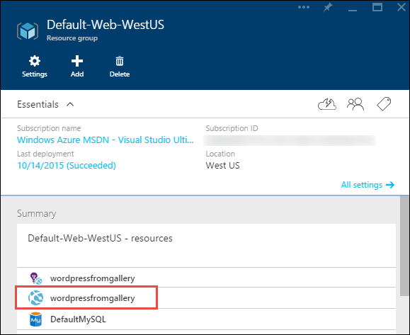

<properties
    pageTitle="Erstellen eine WordPress Web app im App-Verwaltungsdienst Azure | Microsoft Azure"
    description="Informationen Sie zum Erstellen einer neuen Azure Web app für einen WordPress Blog Azure-Portal verwenden."
    services="app-service\web"
    documentationCenter="php"
    authors="rmcmurray"
    manager="wpickett"
    editor=""/>

<tags
    ms.service="app-service-web"
    ms.workload="na"
    ms.tgt_pltfrm="na"
    ms.devlang="PHP"
    ms.topic="hero-article"
    ms.date="08/11/2016"
    ms.author="robmcm"/>

# Erstellen Sie eine WordPress Web app in Azure-App-Verwaltungsdienst

[AZURE.INCLUDE [tabs](../../includes/app-service-web-get-started-nav-tabs.md)]

In diesem Lernprogramm erfahren, wie eine WordPress-Blog-Website aus dem Azure Marketplace bereitgestellt.

Wenn Sie nach Abschluss des Lernprogramms müssen Sie eigene WordPress Blogwebsite nach oben und in der Cloud ausgeführt werden.

Lernen Sie:

* So finden Sie die Vorlage einer Anwendung in der Azure Marketplace.
* Wie Sie eine Web app in Azure-App-Verwaltungsdienst zu erstellen, die auf der Vorlage basiert.
* Informationen zum Konfigurieren der App-Verwaltungsdienst Azure-Einstellungen für das neue Web app und die Datenbank.

Die Azure Marketplace stellt eine Vielzahl von gängige Web apps, entwickelt von Microsoft, Drittanbieter Unternehmen und open-Source-Software Initiativen zur Verfügung. Web apps basieren auf einer Vielzahl von beliebte Framework, z. B. von [PHP](/develop/nodejs/) in dieser WordPress Beispiel, [.NET](/develop/net/), [Node.js](/develop/nodejs/), [Java](/develop/java/)und [Python](/develop/python/), um ein paar zu nennen. Um eine Web app aus dem Azure Marketplace die einzige Software zu erstellen, die Sie benötigen wird im Browser, den Sie für das [Azure-Portal](https://portal.azure.com/)zu verwenden. 

Die WordPress-Website, die Sie in diesem Lernprogramm bereitstellen verwendet MySQL für die Datenbank ein. Wenn Sie stattdessen die SQL-Datenbank für die Datenbank verwenden möchten, finden Sie unter [Project Nami](http://projectnami.org/). **Project-Nami** steht auch über die Marketplace.

> [AZURE.NOTE]
> Damit dieses Lernprogramm abgeschlossen, benötigen Sie ein Microsoft Azure-Konto an. Wenn Sie kein Konto haben, können Sie [die Vorteile Ihres Visual Studio Abonnenten aktivieren](/pricing/member-offers/msdn-benefits-details/?WT.mc_id=A261C142F) , oder [Melden Sie sich für eine kostenlose Testversion](/en-us/pricing/free-trial/?WT.mc_id=A261C142F)an.
>
> Wenn Sie mit Azure-App-Verwaltungsdienst anzufangen, bevor Sie für ein Azure-Konto anmelden möchten, wechseln Sie zu [App-Verwaltungsdienst versuchen](http://go.microsoft.com/fwlink/?LinkId=523751). Vorhanden, können Sie eine kurzlebige Starter Web app sofort erstellen, in der App-Dienst – keine Kreditkarte erforderlich, und keine Zusagen.

## Wählen Sie WordPress und konfigurieren Sie der App-Verwaltungsdienst Azure

1. Melden Sie sich bei der [Azure-Portal](https://portal.azure.com/).

2. Klicken Sie auf **neu**.
    
    ![Neu erstellen][5]
    
3. Suchen Sie nach **WordPress**, und klicken Sie dann auf **WordPress**. Wenn Sie anstelle von MySQL SQL-Datenbank verwenden möchten, suchen Sie nach **Project Nami**.

    ![WordPress aus der Liste][7]
    
5. Nach dem Lesen der Beschreibung der app WordPress, klicken Sie auf **Erstellen**.

    

4. Geben Sie einen Namen für das Web app im **Web app** -Feld ein.

    Dieser Name muss in der Domäne azurewebsites.net eindeutig sein, da die URL des Web app {Name} ist. azurewebsites.net. Wenn der eingegebene Name nicht eindeutig ist, wird Sie in das Textfeld ein rotes Ausrufezeichen angezeigt.

8. Wenn Sie mehr als ein Abonnement besitzen, wählen Sie das Element, das Sie verwenden möchten. 

5. Wählen Sie eine **Ressourcengruppe** oder erstellen Sie einen neuen.

    Weitere Informationen zu Ressourcengruppen finden Sie unter [Übersicht Azure Ressourcenmanager](../azure-resource-manager/resource-group-overview.md).

5. Wählen Sie eine **App-Dienst Plan/Speicherort** aus, oder Erstellen eines neuen Kontos.

    Weitere Informationen zur App-Service-Pläne finden Sie unter [Übersicht über die App-Verwaltungsdienst Azure-Pläne](../azure-web-sites-web-hosting-plans-in-depth-overview.md) 

7. Klicken Sie auf die **Datenbank**, und geben Sie dann in das **Neue MySQL-Datenbank** Blade die erforderlichen Werte für das Konfigurieren der MySQL-Datenbank.

    ein. Geben Sie einen neuen Namen ein, oder lassen Sie den Standardnamen.

    b. Lassen Sie die **Datenbanktyp** **freigegeben**.

    c. Wählen Sie am selben Speicherort wie das Element, das Sie für das Web app ausgewählt haben.

    d. Wählen Sie eine Preisgestaltung Stufe aus. Quecksilber (mit minimalen zulässige Verbindungen und Speicherplatz kostenlos) ist für dieses Lernprogramm in Ordnung.

8. Das **Neue MySQL-Datenbank** Blade klicken Sie auf **OK**. 

8. Klicken Sie in das Blade **WordPress** annehmen der Vertragsbedingungen, und klicken Sie dann auf **Erstellen**. 

    

    App-Verwaltungsdienst Azure erstellt das Web-app in der Regel in weniger als einer Minute. Sie können den Fortschritt überwachen, durch Klicken auf das Glockensymbol am oberen Rand der Portalseite.

    

## Starten und Verwalten von WordPress Web app
    
7. Wenn das Web app erstellen abgeschlossen ist, navigieren Sie im Portal Azure der Ressourcengruppe, in dem Sie die Anwendung erstellt haben, und sehen Sie die Web app und die Datenbank.

    Zusätzliche Ressource mit dem Symbol Glühbirne ist [Einsichten Anwendung](/services/application-insights/), die Überwachung Services für Ihre Web app bereitstellt.

1. Klicken Sie in das Blade **Ressourcengruppe** auf die Web app Linie.

    

2. Klicken Sie in das Web app-Blade auf **Durchsuchen**.

    ![Website-URL][browse]

3. WordPress **Willkommen** auf der Seite Geben Sie die Konfigurationsinformationen, WordPress erforderlich machen, und klicken Sie dann auf **WordPress installieren**.

    

4. Melden Sie sich mit den Anmeldeinformationen, die Sie auf der Seite **Willkommen** erstellt haben.  

5. Ihre Website Dashboardseite wird geöffnet.    

    

## Nächste Schritte

Sie haben erfahren, wie Sie erstellen und Bereitstellen einer PHP Web app aus dem Katalog. Weitere Informationen zur Verwendung von PHP in Azure finden Sie im [Developer Center von PHP](/develop/php/).

Weitere Informationen zum Arbeiten mit App-Dienst Web Apps finden Sie unter den Links auf der linken Seite der Seite (für große Browserfenster) oder am oberen Rand der Seite (für schmale Browserfenster). 

## Was hat sich geändert
* Einen Leitfaden zur Änderung von Websites-App-Dienst finden Sie unter [Azure-App-Verwaltungsdienst und deren Einfluss auf die vorhandenen Azure Services](http://go.microsoft.com/fwlink/?LinkId=529714).

[5]: ./media/web-sites-php-web-site-gallery/startmarketplace.png
[7]: ./media/web-sites-php-web-site-gallery/search-web-app.png
[browse]: ./media/web-sites-php-web-site-gallery/browse-web.png
