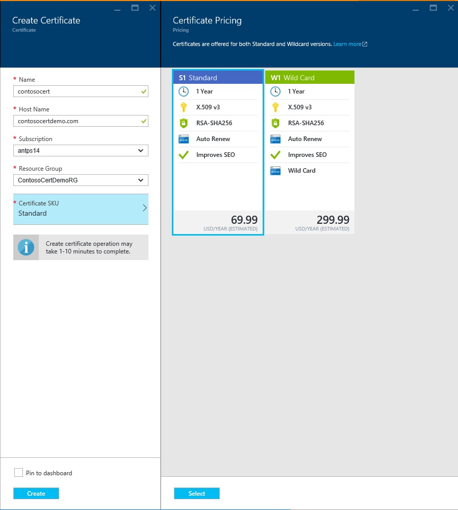

<properties
    pageTitle="Kaufen Sie, und konfigurieren Sie ein SSL-Zertifikat für Ihren Azure-App-Dienst"
    description="Informationen Sie zum kaufen, und konfigurieren ein SSL-Zertifikat für Ihren Azure-App-Dienst."
    services="app-service"
    documentationCenter=".net"
    authors="apurvajo"
    manager="stefsch"
    editor="cephalin"
    tags="buy-ssl-certificates"/>

<tags
    ms.service="app-service"
    ms.workload="na"
    ms.tgt_pltfrm="na"
    ms.devlang="na"
    ms.topic="article"
    ms.date="09/19/2016"
    ms.author="apurvajo"/>

#Kaufen Sie, und konfigurieren Sie ein SSL-Zertifikat für Ihren Azure-App-Dienst

> [AZURE.SELECTOR]
- [SSL-Zertifikat in Azure kaufen](web-sites-purchase-ssl-web-site.md)
- [Verwenden von SSL-Zertifikat an anderer Stelle](web-sites-configure-ssl-certificate.md)

Standardmäßig ermöglicht **[Azure-App-Verwaltungsdienst](http://go.microsoft.com/fwlink/?LinkId=529714)** bereits HTTPS für Ihre Web app mit einem Platzhalterzeichen Zertifikat für die *. azurewebsites.net Domäne. Wenn Sie keine benutzerdefinierte Domäne konfigurieren möchten, können Sie die standardmäßigen HTTPS-Zertifikat profitieren. Wie jedoch alle * [Platzhalterzeichen Domänen](https://casecurity.org/2014/02/26/pros-and-cons-of-single-domain-multi-domain-and-wildcard-certificates), es ist nicht sicher als das Verwenden einer benutzerdefinierten Domänennamens mit Ihrer eigenen Zertifikat. App-Verwaltungsdienst Azure bietet nun eine wirklich vereinfachte Möglichkeit zum Kauf und Verwalten eines SSL-Zertifikats direkt vom Azure-Portal ohne Verlassen des Portals.  
In diesem Artikel wird erläutert, wie kaufen und ein SSL-Zertifikat für Ihre **[App-Verwaltungsdienst Azure](http://go.microsoft.com/fwlink/?LinkId=529714)** 3 einfachen Schritten konfigurieren. 

> [AZURE.NOTE]
> SSL-Zertifikate für benutzerdefinierte Domänennamen können mit Free und freigegebene Web app verwendet werden. Sie müssen Web app für Basic, Standard oder Premium Modus konfigurieren die ändern können, wie viel Sie für Ihr Abonnement in Rechnung gestellt werden. Weitere Informationen finden Sie unter **[Web Apps Preise Details](https://azure.microsoft.com/pricing/details/web-sites/)** .

##(Übersicht)
> [AZURE.NOTE]
> Versuchen Sie nicht erwerben Sie ein SSL-Zertifikat verwenden Sie ein Abonnement, die nicht mit einer aktiven Kreditkarte zugeordnet verfügt. Dies kann Ihr Abonnement deaktiviert führen. 

##<a>Kaufen, speichern und ein SSL-Zertifikat für Ihre benutzerdefinierte Domäne zuweisen</a>
So aktivieren Sie HTTPS für eine benutzerdefinierte Domäne, beispielsweise "contoso.com", müssen Sie die erste ** [Konfigurieren Sie einen benutzerdefinierten Domänennamen in Azure-App-Verwaltungsdienst.](web-sites-custom-domain-name.md)**

Vor dem Anfordern eines SSL-Zertifikats, müssen Sie zuerst bestimmen, welche Domänennamen durch das Zertifikat gesichert werden. Dies legt fest, welche Art von Zertifikat Sie ermitteln müssen. Wenn Sie nur einem einzigen Domänennamen, wie etwa "contoso.com" oder www.contoso.com einen Standard (einfache) secure müssen reicht Zertifikat. Wenn Sie mehrere Domänennamen, wie etwa "contoso.com" www.contoso.com und mail.contoso.com secure müssen dann erhalten ein ** [Platzhalterzeichen Zertifikat](http://en.wikipedia.org/wiki/Wildcard_certificate) Sie**

##Schritt 0: Platzieren Sie SSL Zertifikat Ordnung

In diesem Schritt erfahren Sie, wie Sie ein Zertifikat einer Zertifizierungsstelle Ihrer Wahl bestellen.

1.  Im **[Portal Azure](https://portal.azure.com/)**-klicken Sie auf, und geben Sie "App-Dienstzertifikate" in der Suchleiste in Suchen und auswählen "App-Dienstzertifikate" das Ergebnis, und klicken Sie auf Hinzufügen. 

    

    

2.  Geben Sie **Anzeigename** für das SSL-Zertifikat ein.

3.  Geben Sie **Hostnamen ein**
> [AZURE.NOTE]
    Dies ist eine der wichtigsten Teile des Prozesses erwerben. Vergewissern Sie sich zum richtigen Hostnamen (benutzerdefinierte Domäne) eingeben, die Sie mit diesem Zertifikat schützen möchten. Anfügen von der Hostname mit "www" **Nicht** . Ihr benutzerdefinierter Domänenname www.contoso.com ist, und klicken Sie dann einfach Geben Sie contoso.com in das Feld Host Name, wird beispielsweise das Zertifikat in Frage "www"- und Root-Domänen schützen. 
    
4.  Wählen Sie Ihr **Abonnement**. 

    Wenn Sie mehrere Abonnements haben, stellen Sie sicher, erstellen Sie ein SSL-Zertifikat im selben Abonnement, das Sie für Ihre benutzerdefinierte Domäne oder Web App verwendet haben in Frage.
       
5.  Wählen Sie aus, oder erstellen Sie eine **Ressourcengruppe**.

    Ressourcengruppen können Sie zum Verwalten von Azure Ressourcenübersicht als Einheit und eignen sich beim Einrichten von Access rollenbasierte Steuerelement (RBAC) Regeln für Ihre apps. Weitere Informationen finden Sie unter Verwalten von Azure Ressourcen.
     
6.  Wählen Sie das **Zertifikat SKU** 

    Schließlich, wählen Sie das Zertifikat SKU, die Ihren Bedürfnissen entspricht, und klicken Sie auf erstellen. Heute, können Azure-App-Verwaltungsdienst Sie zwei verschiedene SKUs • S1 – Standardzertifikat mit 1 Jahr Gültigkeit und automatische Verlängerung erwerben  
           • W1 – Platzhalter Zertifikat mit 1 Jahr Gültigkeit und die automatische Erneuerung      
    Weitere Informationen finden Sie unter **[Web Apps Preise Details](https://azure.microsoft.com/pricing/details/web-sites/)** .

> [AZURE.NOTE]
> SSL-Zertifikat erstellen wird 1 bis 10 Minuten dauern. Dieses Verfahren führt mehrere Schritte aus, in den Hintergrund, die andernfalls manuell ausführen sehr schwerfällig sind.  

##Schritt 1: Speichern des Zertifikats in Azure-Taste Tresor

In diesem Schritt erfahren Sie, wie eine Store ein SSL-Zertifikat platziert, die Sie zum Azure-Taste Tresor Ihrer Wahl erworben haben.

1.  Nach Abschluss der SSL-Zertifikat kaufen müssen Sie die **App Dienstzertifikate** Ressource Blade manuell zu öffnen, indem Sie darauf erneut (finden Sie unter Schritt 1 oben)   

    

    Sie sehen, dass Zertifizierungsstatus **"Emission steht noch aus"** ist, wie es einige weitere Schritte erforderlich, die Sie ausführen gibt, bevor Sie beginnen können, verwenden diese Zertifikate müssen.
 
2. Klicken Sie auf **"konfigurieren" von Zertifikaten** innerhalb Blade Zertifikateigenschaften, und klicken Sie auf **"Schritt 1: Speichern"** dieses Zertifikat in Azure-Taste Tresor gespeichert.

3.  Aus Blade **"Schlüssel Tresor Status"** auf **"Schlüssel Tresor Repository"** Auswählen einer vorhandenen Schlüssel Tresor dieses Zertifikat **oder "Erstellen neuer Schlüssel Tresor"** zum Erstellen neuer Schlüssel Tresor innerhalb derselben Gruppe für Abonnement und Ressourcen gespeichert.
 
    
 
    > [AZURE.NOTE]
    Azure-Taste Tresor weist sehr minimale Gebühren für dieses Zertifikat speichern. Weitere Informationen finden Sie unter **[Azure Schlüssel Tresor Preise Details](https://azure.microsoft.com/pricing/details/key-vault/)** .

4. Nachdem Sie die Taste Tresor Repository zum Speichern dieses Zertifikats in ausgewählt haben, fortfahren Sie und speichern Sie es, indem Sie auf die Schaltfläche im Kopfbereich des **"Key Tresor Status"** Blade **"Speichern"** .  

    Dies sollte führen Sie Schritt zum Speichern des Zertifikats, die Sie erworben haben, mit Azure-Taste Tresor Ihrer Wahl. Beim Aktualisieren des Blades, sollte Grün aktivieren Sie diesen Schritt ebenfalls zu kennzeichnen angezeigt werden.
    
##Schritt 2: Überprüfen der Besitzrechte einer der Domäne

In diesem Schritt erfahren Sie, wie Domäne Besitz Überprüfung für ein SSL-Zertifikat ausführen möchten, die Sie soeben Ordnung für platziert. 

1.  Klicken Sie auf **"Schritt 2: Überprüfen"** Schritt aus dem Blade **"Konfigurieren von Zertifikaten"** . Es gibt 4 Arten von Domäne Überprüfung von App-Dienstzertifikate unterstützt.

    * **Überprüfung des App-Dienst** 
    
        * Dies ist der bequemste Prozess, wenn Sie bereits **Ihrer benutzerdefinierten Domäne, die Sie die App-Service-Apps zugewiesen.** Diese Methode wird sich alle Apps die App-Dienst angegeben werden, die den Kriterien entsprechen. 
           Angenommen, in diesem Fall **contosocertdemo.com** ist eine benutzerdefinierte Domäne mit App-Dienst namens **"ContosoCertDemo"** zugewiesen und daher Dies ist der einzige App Dienst App hier aufgeführten. Wenn mehrere Region Bereitstellung aufgeführt sind, möchten sie dieser alle in allen Regionen aufgelistet.
        
           Die Überprüfungsmethode steht nur für Standard (einfache) Zertifikat Einkäufe verfügbar. Für Platzhalter Zertifikate überspringen und option B, C oder D unten zu verschieben.
        * Klicken Sie auf **"Überprüfen"** -Schaltfläche, um diesen Schritt abgeschlossen haben.
        * Klicken Sie auf **"Aktualisieren"** , um die Zertifizierungsstatus nach Abschluss der Überprüfung zu aktualisieren. Es kann einige Minuten für die Überprüfung ausführen dauern.
        
             

    * **Domäne Überprüfung** 

        * Dies ist der bequemste Prozess **nur, wenn** Sie **[Azure-App-Verwaltungsdienst Ihrer benutzerdefinierte Domäne Musikdateien.](custom-dns-web-site-buydomains-web-app.md)**
        
        * Klicken Sie auf **"Überprüfen"** -Schaltfläche, um diesen Schritt abgeschlossen haben.
        
        * Klicken Sie auf **"Aktualisieren"** , um die Zertifizierungsstatus nach Abschluss der Überprüfung zu aktualisieren. Es kann einige Minuten für die Überprüfung ausführen dauern.

    * **E-Mail-Überprüfung**
        
        * Überprüfung e-Mail wurde an die e-Mail-Adressen, die diese benutzerdefinierten Domäne zugeordnet bereits gesendet.
         
        * Öffnen Sie die e-Mail, und klicken Sie auf den Link für die Bestätigung den e-Mail-Überprüfung Schritt ausführen. 
        
        * Wenn Sie die Überprüfung e-Mail erneut senden müssen klicken Sie auf die Schaltfläche **"E-Mail erneut senden"** .
         
    * **Manuelle Überprüfung**    
                 
        1. **Überprüfung von HTML-Webseite**
        
            * Erstellen Sie eine HTML-Datei mit dem Namen **{Domäne Überprüfung Token}**.html (Sie können das Token von er Domäne Überprüfung Status Blade kopieren)
            
            * Inhalt dieser Datei der genaue demselben Namen der **Domäne Überprüfung Token**sollten.
            
            * Laden Sie diese Datei im Stammverzeichnis dem Webserver mit Ihrer Domäne hoch.
            
            * Klicken Sie auf **"Aktualisieren"** , um die Zertifizierungsstatus nach Abschluss der Überprüfung zu aktualisieren. Es kann einige Minuten für die Überprüfung ausführen dauern.
            
            Beispielsweise, wenn Sie ein standard Zertifikat für contosocertdemo.com mit Domäne Überprüfung Token **'cAGgQrKc'** kaufen dann eine Web-Anforderung versucht, **'http://contosocertdemo.com/cAGgQrKc.html'** sollte zurückgegeben **cAGgQrKc.**
        2. **DNS-TXT-Eintrag Überprüfung**

            * Verwenden Ihre DNS-Manager erstellen Sie einen TXT-Eintrag auf die Unterdomäne **'DZC'** mit dem Wert gleich der **Domäne Überprüfung Token.**
            
            * Klicken Sie auf **"Aktualisieren"** , um die Zertifizierungsstatus nach Abschluss der Überprüfung zu aktualisieren. Es kann einige Minuten für die Überprüfung ausführen dauern.
                              
            Beispielsweise, um nach einem Zertifikat Platzhalterzeichen mit Hostname Validierung ** \*. contosocertdemo.com** oder ** \*. subdomain.contosocertdemo.com** und Domäne Überprüfung Token **cAGgQrKc**, müssen Sie einen TXT-Eintrag auf dzc.contosocertdemo.com mit dem Wert erstellen **cAGgQrKc.**     

##Schritt 3: App-Dienst App Zertifikat zuweisen

In diesem Schritt erfahren Sie, wie Sie dies neu Zertifikat zu Ihrer App Dienst Apps erworben zuweisen. 

> [AZURE.NOTE]
> Bevor Sie die Schritte in diesem Abschnitt durchführen, müssen Sie einen benutzerdefinierten Domänennamen Ihre app zugeordnet haben. Weitere Informationen finden Sie unter ** [Konfigurieren Sie einen benutzerdefinierten Domänennamen für eine Web-App](web-sites-custom-domain-name.md)**

1.  Öffnen Sie in Ihrem Browser die ** [Azure-Portal.](https://portal.azure.com/)**
2.  Klicken Sie auf die Option **App-Dienst** auf der linken Seite der Seite.
3.  Klicken Sie auf den Namen der app, die Sie dieses Zertifikat zuweisen möchten. 
4.  Klicken Sie unter **Einstellungen**auf **SSL-Zertifikate**
5.  Klicken Sie auf **Importieren App Dienstzertifikat** , und wählen Sie das Zertifikat, das Sie gerade gekauft haben.

    

6. In den **Ssl Bindungen** Abschnitt auf **Bindungen hinzufügen**
7. In das **Hinzufügen von SSL Bindung** Blade mithilfe der Dropdownmenüs gesichert mit SSL und das Zertifikat mit den Domänennamen aus. Können Sie auch auswählen, ob Sie **[Server Namen Angabe (SNI)](http://en.wikipedia.org/wiki/Server_Name_Indication)** verwenden oder IP-basierte SSL.

    

       •    IP based SSL associates a certificate with a domain name by mapping the dedicated public IP address of the server to the domain name. This requires each domain name (contoso.com, fabricam.com, etc.) associated with your service to have a dedicated IP address. This is the traditional          method of associating SSL certificates with a web server.
       •    SNI based SSL is an extension to SSL and **[Transport Layer Security](http://en.wikipedia.org/wiki/Transport_Layer_Security)** (TLS) that allows multiple domains to share the same IP address, with separate security certificates for each domain. Most modern browsers (including Internet Explorer, Chrome, Firefox and Opera) support SNI, however older browsers may not support SNI. For more information on SNI, see the **[Server Name Indication](http://en.wikipedia.org/wiki/Server_Name_Indication)** article on Wikipedia.
       
7. Klicken Sie auf **Bindung hinzufügen** , um die Änderungen zu speichern, und aktivieren Sie SSL.

Wenn Sie ausgewählt, **IP-basierte SSL haben** und Ihrer benutzerdefinierte Domäne mithilfe eines A-Datensatzes konfiguriert ist, müssen Sie die folgenden zusätzlichen Schritte ausführen:

* Nachdem Sie konfiguriert haben eine IP-basierte SSL Bindung, eine dedizierte IP-Adresse Ihre app zugeordnet ist. Sie können diese IP-Adresse auf der Seite **benutzerdefinierte Domäne** , klicken Sie unter Einstellungen der app, rechts oben im Abschnitt **Hostnamen** suchen. Es wird als **Externe IP-Adresse** aufgeführt sein
    
    

    Beachten Sie, dass diese IP-Adresse anders als die virtuelle IP-Adresse, die zuvor verwendet, um den A-Eintrag für Ihre Domäne zu konfigurieren. Wenn Sie für die Verwendung konfiguriert sind SNI SSL basierende oder nicht zur Verwendung von SSL konfiguriert sind, werden keine Adresse für diesen Eintrag aufgelistet werden.
    
2. Verwenden die Tools zur Verfügung, indem Sie Ihre Domänennamen-Registrierungsstelle, ändern Sie den A-Eintrag für Ihren benutzerdefinierten Domänennamen auf die IP-Adresse aus dem vorherigen Schritt verweisen.
An diesem Punkt sollte es möglich sein, besuchen Ihre app HTTPS:// anstelle von HTTP:// verwenden, um sicherzustellen, dass das Zertifikat richtig konfiguriert ist.

##Einen erneuten Schlüsselaustausch und das Zertifikat synchronisieren

1. Wenn Sie Ihr Zertifikat dann einfach einen erneuten Schlüsselaustausch müssen aus Gründen der Sicherheit wählen Option **"einen erneuten Schlüsselaustausch und synchronisieren"** aus **"Zertifikateigenschaften"** Blade aus. 

2. Klicken Sie auf die Schaltfläche **"Einen erneuten Schlüsselaustausch"** , um den zu starten. Dieses Verfahren kann 1 bis 10 Minuten dauern. 

    

3. Erstellen neuer Schlüssel Ihr Zertifikat setzt das Zertifikat durch ein neues Zertifikat, das von der Zertifizierungsstelle ausgestellt wurde.
4. Sie werden nicht für die Rekeying für die Gültigkeitsdauer des Zertifikats Rechnung gestellt. 
5. Erstellen neuer Schlüssel Ihr Zertifikat werden über ausstehende Emission Zustand geleitet. 
6. Sobald das Zertifikat bereit ist Stellen Sie sicher, dass Sie Ihre Ressourcen unter Verwendung dieses Zertifikats zu verhindern, dass Unterbrechung für den Dienst synchronisieren.
7. Synchronisierungsoption ist nicht verfügbar für Zertifikate, die noch nicht bei der Web-App zugewiesen sind. 

## Weitere Ressourcen ##
- [Aktivieren Sie HTTPS für eine app in Azure App-Verwaltungsdienst](web-sites-configure-ssl-certificate.md)
- [Kaufen Sie, und konfigurieren Sie einen benutzerdefinierten Domänennamen in Azure-App-Verwaltungsdienst](custom-dns-web-site-buydomains-web-app.md)
- [Microsoft Azure-Trust Center](/support/trust-center/security/)
- [Nicht gesperrte Websites in Azure Konfigurationsoptionen](http://azure.microsoft.com/blog/2014/01/28/more-to-explore-configuration-options-unlocked-in-windows-azure-web-sites/)
- [Azure-Verwaltungsportal](https://manage.windowsazure.com)

>[AZURE.NOTE] Wenn Sie mit Azure-App-Verwaltungsdienst Schritte vor dem für ein Azure-Konto anmelden möchten, wechseln Sie zu [App-Verwaltungsdienst versuchen](http://go.microsoft.com/fwlink/?LinkId=523751), in dem Sie eine kurzlebige Starter Web app sofort im App-Dienst erstellen können. Keine Kreditkarten erforderlich; keine Zusagen.

