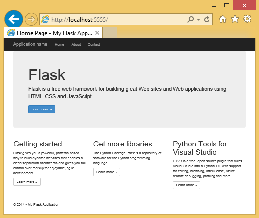
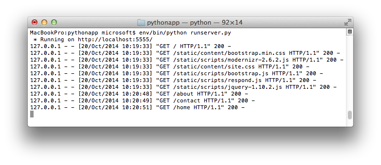

<properties 
    pageTitle="Erstellen von Web-apps mit und in Azure" 
    description="Ein Lernprogramm, die Sie erhalten eine Einführung in einer Python Web app auf Windows Azure ausgeführte." 
    services="app-service\web" 
    documentationCenter="python"
    tags="python"
    authors="huguesv" 
    manager="wpickett" 
    editor=""/>

<tags 
    ms.service="app-service-web" 
    ms.workload="web" 
    ms.tgt_pltfrm="na" 
    ms.devlang="python" 
    ms.topic="article" 
    ms.date="02/20/2016"
    ms.author="huvalo"/>

# Erstellen von Web-apps mit und in Azure

In diesem Lernprogramm beschrieben, wie Sie die Schritte ausführen Python in [Azure App Dienst Web Apps](http://go.microsoft.com/fwlink/?LinkId=529714).  Web Apps stellt eingeschränkte kostenlosen Hostinganbieter und schnelle Bereitstellung und Python können!  Wenn Ihre app wächst, können Sie in bezahlte Hostinganbieter wechseln, und Sie können auch in alle anderen Azure Dienste integrieren.

Erstellen Sie eine Anwendung, die mit Framework Web wird (Siehe alternative Versionen dieses Lernprogramms für [Django](web-sites-python-create-deploy-django-app.md) und [Flaschen](web-sites-python-create-deploy-bottle-app.md)).  Sie erstellen die Website aus dem Katalog Azure, Git Bereitstellung einrichten und Repository lokal klonen.  Dann führen Sie die Anwendung lokal, vorzunehmen, commit und drücken Sie sie in Azure.  Das Lernprogramm wird gezeigt, wie Windows oder Mac/Linux dazu.

[AZURE.INCLUDE [create-account-and-websites-note](../../includes/create-account-and-websites-note.md)]

>[AZURE.NOTE] Wenn Sie mit Azure-App-Verwaltungsdienst Schritte vor dem für ein Azure-Konto anmelden möchten, wechseln Sie zu [App-Verwaltungsdienst versuchen](http://go.microsoft.com/fwlink/?LinkId=523751), in dem Sie eine kurzlebige Starter Web app sofort im App-Dienst erstellen können. Keine Kreditkarten erforderlich; keine Zusagen.

## Erforderliche Komponenten

- Windows, Mac oder Linux
- Python 2.7 oder 3.4
- Setuptools, Pip, Virtualenv (nur Python 2.7)
- Git
- [Python-Tools für Visual Studio][] (PTVS) – Hinweis: Dies ist optional

**Hinweis**: TFS Veröffentlichung wird für Projekte, Python derzeit nicht unterstützt.

### Windows

Wenn Sie bereits Python 2.7 oder 3,4 installierten (32-Bit) besitzen, wird empfohlen, Installation von [Azure SDK für Python 2.7] oder [Azure SDK für Python 3.4] Web Platform Installer verwenden.  Dadurch wird die 32-Bit-Version von Python, Setuptools, Pip, Virtualenv usw. (32-Bit-Python ist, was auf den Hostcomputern Azure installiert ist) installiert.  Alternativ können Sie Python von [python.org]erhalten.

Wir empfehlen Git [Git für Windows] oder [GitHub für Windows].  Wenn Sie Visual Studio verwenden, können Sie die integrierte Git Unterstützung.

Es empfiehlt sich, [Python Tools 2.2 für Visual Studio]installieren.  Dies ist optional, aber wenn Sie [Visual Studio], einschließlich der kostenlosen Visual Studio Community 2013 oder Visual Studio Express 2013 für Web, haben dann dieser Option erhalten Sie eine gute Python IDE.

### Mac/Linux

Sie sollten Python und Git bereits installiert haben, aber Sie können sicherstellen, dass Sie entweder Python 2.7 oder 3.4 haben.

## Klicken Sie auf das Portal Azure Web app zu erstellen

Der erste Schritt beim Erstellen der app besteht im Erstellen des Web-app über das [Azure-Portal](https://portal.azure.com). 

1. Melden Sie sich bei der Azure-Portal an, und klicken Sie auf die Schaltfläche ' **neu** ' in der unteren linken Ecke. 
2. Klicken Sie auf **Web + Mobile**.
3. Geben Sie im Suchfeld "Python" ein.
4. Klicken Sie in den Suchergebnissen wählen Sie **wird**, und klicken Sie auf **Erstellen**.
5. Konfigurieren der neuen geben-app, z. B. das Erstellen einer neuen App-Serviceplan und eine neue Ressourcengruppe dafür an. Klicken Sie dann auf **Erstellen**.
6. Konfigurieren Sie anhand der Anweisungen bei der [Lokalen Bereitstellung von Git Azure App Dienst](app-service-deploy-local-git.md)Git Veröffentlichung für Ihre neu erstellten Web app.

## Übersicht über die Anwendung

### Git Repository Inhalt

Hier ist eine Übersicht über die Dateien, die Sie in die erste Git Repository erledigen müssen, die wir im nächsten Abschnitt Klonen wird.

    \FlaskWebProject\__init__.py
    \FlaskWebProject\views.py
    \FlaskWebProject\static\content\
    \FlaskWebProject\static\fonts\
    \FlaskWebProject\static\scripts\
    \FlaskWebProject\templates\about.html
    \FlaskWebProject\templates\contact.html
    \FlaskWebProject\templates\index.html
    \FlaskWebProject\templates\layout.html

Hauptfenster Quellen für die Anwendung.  Umfasst 3 Seiten (Index zu Kontakt) mit einer Masterlayout.  Statischen Inhalt und Skripts einschließen Bootstrap, Jquery, Modernizr und Antworten.

    \runserver.py

Unterstützung für lokale Entwicklung Server. Verwenden Sie diese Option, um die Anwendung lokal auszuführen.

    \FlaskWebProject.pyproj
    \FlaskWebProject.sln

Project-Dateien für die Verwendung mit [Python-Tools für Visual Studio].

    \ptvs_virtualenv_proxy.py

IIS-Proxy für virtueller Umgebungen und PTVS unterstützt das Debuggen Remoteprozeduraufruf.

    \requirements.txt

Externe Pakete von dieser Anwendung erforderlich. Das Bereitstellungsskript pip wird der in dieser Datei aufgelisteten Pakete installieren.
 
    \web.2.7.config
    \web.3.4.config

IIS-Konfigurations-Dateien.  Das Bereitstellungsskript wird der entsprechende web.x.y.config verwenden, und kopieren sie als web.config.

### Optionale Dateien - Bereitstellung anpassen

[AZURE.INCLUDE [web-sites-python-customizing-deployment](../../includes/web-sites-python-customizing-deployment.md)]

### Optionale Dateien - Python Laufzeit

[AZURE.INCLUDE [web-sites-python-customizing-runtime](../../includes/web-sites-python-customizing-runtime.md)]

### Weitere Dateien auf dem server

Einige Dateien auf dem Server vorhanden, jedoch Git Repository nicht hinzugefügt werden.  Diese werden durch das Bereitstellungsskript erstellt.

    \web.config

IIS-Konfigurationsdatei.  Erstellt von web.x.y.config auf jede Bereitstellung.

    \env\

Virtuelle Python-Umgebung.  Während der Bereitstellung erstellt, wenn eine kompatible virtuelle Umgebung auf die app nicht bereits vorhanden ist.  In requirements.txt aufgelisteten Pakete sind Pip installiert, aber Pip überspringt Installation, wenn die Pakete bereits installiert sind.

In den nächsten 3 Abschnitten beschrieben, wie die Web app-Entwicklung unter 3 verschiedenen Umgebungen fortzusetzen:

- Windows mit Python-Tools für Visual Studio
- Windows mit Befehlszeile
- Mac/Linux mit Befehlszeile

## Web app-Entwicklung Python - Windows - Tools für Visual Studio

### Das Repository Klonen

Zunächst Klonen Sie Repository mithilfe des URLs auf das Portal Azure ein. Weitere Informationen finden Sie unter [Lokale Git Bereitstellung Azure-App-Dienst](app-service-deploy-local-git.md).

Öffnen Sie die Lösungsdatei (.sln), die im Stammverzeichnis des Repositorys enthalten ist.

### Erstellen von virtuellen Umgebung

Erstellen Sie nun eine virtuelle Umgebung für lokale Entwicklung.  Mit der rechten Maustaste auf **Python Umgebungen** select **Virtuellen Umgebung hinzufügen**.

- Stellen Sie sicher, der Namen der Umgebung `env`.

- Wählen Sie die Basis Interpreter aus.  Vergewissern Sie sich, dieselbe Version von Python ausgewählt ist, die für Ihre Web app (in runtime.txt oder **Anwendungseinstellungen** Falz Web app im Portal Azure) verwenden.

- Stellen Sie sicher, dass die Option zum Herunterladen und Installieren von Paketen aktiviert ist.

Klicken Sie auf **Erstellen**.  Dies wird die virtuelle Umgebung erstellen und Installieren von Abhängigkeiten requirements.txt aufgeführt.

### Mit Development Server ausgeführt

Drücken Sie F5 für das Debuggen und Ihrem Webbrowser werden zu der Seite, die lokal ausgeführt automatisch geöffnet.

Sie können festlegen, dass Haltepunkte in Quellen, verwenden Sie das Überwachungsfenster usw..  Finden Sie die [Python-Tools für Visual Studio-Dokumentation] für Weitere Informationen zu den verschiedenen Features aus.

### Nehmen Sie Änderungen

Sie können nun durch Ändern der Anwendung Quellen und/oder Vorlagen experimentieren.

Nachdem Sie Ihre Änderungen getestet haben, bestätigen Sie sie an der Git Repository:

### Installieren Sie weitere Pakete

Die Anwendung möglicherweise Abhängigkeiten jenseits Python und wird.

Sie können zusätzliche Pakete mit Pip installieren.  Klicken Sie zum Installieren eines Pakets mit der rechten Maustaste auf die virtuelle Umgebung, und wählen Sie **Python-Paket installieren**.

Geben Sie zum Installieren der Azure SDK für Python, denen Sie Zugriff auf Azure-Speicher, Dienstbus und andere Dienste Azure bereitstellt, zum Beispiel `azure`:

Mit der rechten Maustaste auf die virtuelle Umgebung, und wählen Sie **generieren requirements.txt** requirements.txt aktualisieren.

Übernehmen Sie die Änderungen zu requirements.txt an der Git Repository.

### Bereitstellen für Azure

Wenn Sie eine Bereitstellung ausgelöst wird, klicken Sie auf **Synchronisieren** , oder **Drücken Sie**.  Synchronisieren unterstützt beiden einer Pushbenachrichtigungen, und eine ziehen.

Die erste Bereitstellung dauert einige Zeit, während der Erstellung wird eine virtuelle Umgebung, Installationspakete usw..

Visual Studio zeigt den Fortschritt der Bereitstellung nicht an.  Wenn Sie die Ausgabe überprüfen möchten, finden Sie im Abschnitt [Problembehandlung - Bereitstellung](#troubleshooting-deployment).

Navigieren Sie zu der Azure-URL, die Änderungen anzuzeigen.

## Web app-Entwicklung – Windows - Befehlszeile

### Das Repository Klonen

Zunächst Repository mithilfe des URLs auf das Portal Azure klonen und Azure Repository als eine Remote hinzufügen. Weitere Informationen finden Sie unter [Lokale Git Bereitstellung Azure-App-Dienst](app-service-deploy-local-git.md).

    git clone <repo-url>
    cd <repo-folder>
    git remote add azure <repo-url> 

### Erstellen von virtuellen Umgebung

Wir erstelle eine neue virtuelle Umgebung hinsichtlich der Entwicklung (kann nicht es Repository hinzufügen).  Virtuelle Umgebungen in Python sind nicht verschiebbaren, damit jeder Entwickler arbeiten, klicken Sie auf die Anwendung lokal Erstellen eigener wird.

Vergewissern Sie sich, dieselbe Version von Python ausgewählt ist, die für Ihre Web app (in runtime.txt oder **Anwendungseinstellungen** Falz Web app im Portal Azure) verwenden.

Für Python 2.7:

    c:\python27\python.exe -m virtualenv env

Für Python 3.4:

    c:\python34\python.exe -m venv env

Installieren von Ihrer Anwendung benötigten externe Pakete. Die Datei requirements.txt können im Stammverzeichnis der Repository Sie um die Pakete in der virtuellen Umgebung zu installieren:

    env\scripts\pip install -r requirements.txt

### Mit Development Server ausgeführt

Starten Sie die Anwendung unter einer Entwicklungsserver mit den folgenden Befehl aus:

    env\scripts\python runserver.py

Die Konsole wird die URL angezeigt und Port Server überwacht:

Öffnen Sie dann Ihren Webbrowser die URL ein.

### Nehmen Sie Änderungen

Sie können nun durch Ändern der Anwendung Quellen und/oder Vorlagen experimentieren.

Nachdem Sie Ihre Änderungen getestet haben, werden übernehmen Sie diese im Repository Git:

    git add <modified-file>
    git commit -m "<commit-comment>"

### Installieren Sie weitere Pakete

Die Anwendung möglicherweise Abhängigkeiten jenseits Python und wird.

Sie können zusätzliche Pakete mit Pip installieren.  Geben Sie beispielsweise zum Installieren Azure SDK für Python, denen Sie Zugriff auf Azure-Speicher, Dienstbus und andere Dienste Azure bereitstellt:

    env\scripts\pip install azure

Vergewissern Sie sich requirements.txt zu aktualisieren:

    env\scripts\pip freeze > requirements.txt

Bestätigen Sie die Änderungen an:

    git add requirements.txt
    git commit -m "Added azure package"

### Bereitstellen für Azure

Um eine Bereitstellung ausgelöst wird, drücken Sie die Änderungen vor, um Azure:

    git push azure master

Die Ausgabe der Bereitstellungsskript, einschließlich der Erstellung virtueller Umgebung, Installation von Paketen, Erstellung von web.config wird angezeigt.

Navigieren Sie zu der Azure-URL, die Änderungen anzuzeigen.

## Web app-Entwicklung - Mac/Linux - Befehlszeile

### Das Repository Klonen

Zunächst Repository mithilfe des URLs auf das Portal Azure klonen und Azure Repository als eine Remote hinzufügen. Weitere Informationen finden Sie unter [Lokale Git Bereitstellung Azure-App-Dienst](app-service-deploy-local-git.md).

    git clone <repo-url>
    cd <repo-folder>
    git remote add azure <repo-url> 

### Erstellen von virtuellen Umgebung

Wir erstelle eine neue virtuelle Umgebung hinsichtlich der Entwicklung (kann nicht es Repository hinzufügen).  Virtuelle Umgebungen in Python sind nicht verschiebbaren, damit jeder Entwickler arbeiten, klicken Sie auf die Anwendung lokal Erstellen eigener wird.

Vergewissern Sie sich, dieselbe Version von Python ausgewählt ist, die für Ihre Web app (in runtime.txt oder **Anwendungseinstellungen** Falz Web app im Portal Azure) verwenden.

Für Python 2.7:

    python -m virtualenv env

Für Python 3.4:

    python -m venv env
oder Pyvenv env

Installieren von Ihrer Anwendung benötigten externe Pakete. Die Datei requirements.txt können im Stammverzeichnis der Repository Sie um die Pakete in der virtuellen Umgebung zu installieren:

    env/bin/pip install -r requirements.txt

### Mit Development Server ausgeführt

Starten Sie die Anwendung unter einer Entwicklungsserver mit den folgenden Befehl aus:

    env/bin/python runserver.py

Die Konsole wird die URL angezeigt und Port Server überwacht:

Öffnen Sie dann Ihren Webbrowser die URL ein.

### Nehmen Sie Änderungen

Sie können nun durch Ändern der Anwendung Quellen und/oder Vorlagen experimentieren.

Nachdem Sie Ihre Änderungen getestet haben, werden übernehmen Sie diese im Repository Git:

    git add <modified-file>
    git commit -m "<commit-comment>"

### Installieren Sie weitere Pakete

Die Anwendung möglicherweise Abhängigkeiten jenseits Python und wird.

Sie können zusätzliche Pakete mit Pip installieren.  Geben Sie beispielsweise zum Installieren Azure SDK für Python, denen Sie Zugriff auf Azure-Speicher, Dienstbus und andere Dienste Azure bereitstellt:

    env/bin/pip install azure

Vergewissern Sie sich requirements.txt zu aktualisieren:

    env/bin/pip freeze > requirements.txt

Bestätigen Sie die Änderungen an:

    git add requirements.txt
    git commit -m "Added azure package"

### Bereitstellen für Azure

Um eine Bereitstellung ausgelöst wird, drücken Sie die Änderungen vor, um Azure:

    git push azure master

Die Ausgabe der Bereitstellungsskript, einschließlich der Erstellung virtueller Umgebung, Installation von Paketen, Erstellung von web.config wird angezeigt.

Navigieren Sie zu der Azure-URL, die Änderungen anzuzeigen.

## Problembehandlung - Paketinstallation

[AZURE.INCLUDE [web-sites-python-troubleshooting-package-installation](../../includes/web-sites-python-troubleshooting-package-installation.md)]

## Problembehandlung - virtuellen Umgebung

[AZURE.INCLUDE [web-sites-python-troubleshooting-virtual-environment](../../includes/web-sites-python-troubleshooting-virtual-environment.md)]

## Nächste Schritte

Führen Sie die folgenden Links, um weitere Informationen zu geben und Python Tools für Visual Studio: 
 
- [Dokumentation wird]
- [Python-Tools für Visual Studio-Dokumentation]

Informationen zur Verwendung von Azure Table Storage und MongoDB:

- [Wird und MongoDB auf Azure Python-Tools für Visual Studio]
- [Wird und Azure Table Storage auf Azure Python-Tools für Visual Studio]

Weitere Informationen finden Sie auch im [Python Developer Center](/develop/python/).

## Was hat sich geändert
* Ein Leitfaden zum Ändern von Websites-App-Dienst finden Sie unter: [Azure-App-Dienst und seinen Einfluss auf die vorhandenen Azure Services](http://go.microsoft.com/fwlink/?LinkId=529714)

<!--Link references-->
[Wird und MongoDB auf Azure Python-Tools für Visual Studio]: https://github.com/microsoft/ptvs/wiki/Flask-and-MongoDB-on-Azure
[Wird und Azure Table Storage auf Azure Python-Tools für Visual Studio]: web-sites-python-ptvs-flask-table-storage.md

<!--External Link references-->
[Azure SDK für Python 2.7]: http://go.microsoft.com/fwlink/?linkid=254281
[Azure SDK für Python 3.4]: http://go.microsoft.com/fwlink/?linkid=516990
[Python.org]: http://www.python.org/
[Git für Windows]: http://msysgit.github.io/
[GitHub für Windows]: https://windows.github.com/
[Python-Tools für Visual Studio]: http://aka.ms/ptvs
[Python 2.2-Tools für Visual Studio]: http://go.microsoft.com/fwlink/?LinkID=624025
[Visual Studio]: http://www.visualstudio.com/
[Python-Tools für Visual Studio-Dokumentation]: http://aka.ms/ptvsdocs
[Dokumentation wird]: http://flask.pocoo.org/ 
 
