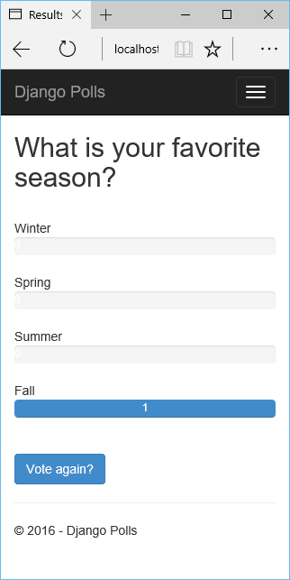

<properties 
    pageTitle="Django und MySQL auf Azure mit Python Tools 2.2 für Visual Studio" 
    description="Informationen Sie zum Verwenden der Python-Tools für Visual Studio eine Django Web app zu erstellen, die Daten in eine Instanz der MySQL-Datenbank gespeichert sind, und bei Azure App Dienst Web Apps bereitstellen." 
    services="app-service\web" 
    documentationCenter="python" 
    authors="huguesv" 
    manager="wpickett" 
    editor=""/>

<tags 
    ms.service="app-service-web" 
    ms.workload="web" 
    ms.tgt_pltfrm="na" 
    ms.devlang="python"
    ms.topic="get-started-article" 
    ms.date="07/07/2016"
    ms.author="huvalo"/>

# Django und MySQL auf Azure mit Python Tools 2.2 für Visual Studio 

[AZURE.INCLUDE [tabs](../../includes/app-service-web-get-started-nav-tabs.md)]

In diesem Lernprogramm verwenden Sie [Python-Tools für Visual Studio] (PTVS) zum Erstellen einer einfachen Umfragen Web app verwenden eine der Vorlagen Stichprobe PTVS. Sie lernen, wie mit einer MySQL-Dienst auf Azure gehostet, so konfigurieren Sie das Web-app, um MySQL verwenden und wie Sie die Web app auf [Azure App Dienst Web Apps](http://go.microsoft.com/fwlink/?LinkId=529714)veröffentlichen.

> [AZURE.NOTE] Die Informationen in diesem Lernprogramm steht auch in das folgende Video:
> 
> [PTVS 2.1: Django-app mit MySQL][video]

Finden Sie weitere Artikel, die Entwicklung von Azure App Dienst Web Apps mit PTVS Flaschen, geben und Django Web-Framework, mit den Diensten von Azure Table Storage, MySQL und SQL-Datenbank mit Deckblatt der [Python Developer Center] . Während der App-Dienst in diesem Artikel liegt der Schwerpunkt, sind die Schritten ähnlich wie bei der Entwicklung von [Azure Cloud Services].

## Erforderliche Komponenten

 - Visual Studio 2015
 - [Python 2.7 32-Bit-] oder [Python 3.4 32-Bit-Version]
 - [Python 2.2-Tools für Visual Studio]
 - [Python 2.2-Tools für Visual Studio-Beispiele VSIX]
 - [Azure SDK-Tools für im Vergleich mit einer 2015]
 - Django 1,9 oder höher

[AZURE.INCLUDE [create-account-and-websites-note](../../includes/create-account-and-websites-note.md)]

<!-- This note should not render as part of the the previous include. -->

> [AZURE.NOTE] Wenn Sie mit Azure-App-Verwaltungsdienst Schritte vor dem für ein Azure-Konto anmelden möchten, wechseln Sie zu [App-Verwaltungsdienst versuchen](http://go.microsoft.com/fwlink/?LinkId=523751), in dem Sie eine kurzlebige Starter Web app sofort im App-Dienst erstellen können. Keine Kreditkarte ist erforderlich, und es sind keine Zusagen erforderlich.

## Erstellen Sie das Projekt

In diesem Abschnitt erstellen Sie mithilfe einer Vorlage für die Stichprobe Visual Studio-Projekt. Sie erstellen eine virtuelle Umgebung und erforderliche Pakete installieren. Erstellen Sie eine lokale Datenbank Sqlite verwenden. Dann wird die Anwendung lokal ausgeführt wird.

1. Wählen Sie in Visual Studio **Datei**, **Neues Projekt**aus.

1. Die Project-Vorlagen aus der [Python Tools 2.2 für Visual Studio-Beispiele VSIX] stehen unter **Python**, **Beispiele**zur Verfügung. Wählen Sie **Umfragen Django Web-Projekt** aus, und klicken Sie auf OK, um das Projekt zu erstellen.

    

1. Sie werden aufgefordert, externe Pakete zu installieren. Wählen Sie **in einer virtuellen Umgebung installieren**.

    

1. Wählen Sie als Basis-Interpreter **Python 2.7** oder **Python 3.4** aus.

    

1. Klicken Sie im **Explorer Lösung**mit der rechten Maustaste auf den Projektknoten, wählen Sie **Python**, und klicken Sie dann aus **Django migrieren**.  Wählen Sie dann **Django erstellen Hauptbenutzer**aus.

1. Eine Django-Verwaltungskonsole und klicken dann eine Sqlite Datenbank in den Ordner des Projekts erstellen. Folgen Sie den Anweisungen zum Erstellen eines Benutzers.

1. Bestätigen, dass die Anwendung durch Drücken von funktioniert `F5`.

1. Klicken Sie auf **Melden Sie sich** über die Navigationsleiste am oberen.

    

1. Geben Sie die Anmeldeinformationen für den Benutzer, die, den Sie erstellt haben, wenn Sie die Datenbank synchronisiert.

    

1. Klicken Sie auf die **Stichprobe Umfragen erstellen**.

    

1. Klicken Sie auf einer Umfrage und abzustimmen.

    

## Erstellen einer MySQL-Datenbank

Für die Datenbank erstellen Sie eine gehostete ClearDB MySQL-Datenbank auf Azure.

Als Alternative können Sie erstellen Ihrer eigenen virtuellen Computern ausgeführt in Azure, und klicken Sie dann installieren und MySQL zu verwalten.

Sie können eine Datenbank mit einem kostenlosen Plan erstellen, indem Sie wie folgt vor.

1. Melden Sie sich bei der [Azure-Portal].

1. Am oberen Rand des Navigationsbereichs klicken Sie auf **neu**, und klicken Sie auf **Daten + Speicher**, und klicken Sie dann auf **MySQL-Datenbank**. 

1. Konfigurieren Sie die neue MySQL-Datenbank durch Erstellen einer neuen Ressourcengruppe, und wählen Sie den entsprechenden Speicherort dafür aus.

1. Nachdem die MySQL-Datenbank erstellt wurde, klicken Sie in der Datenbank Blade auf **Eigenschaften** .

1. Verwenden Sie die Schaltfläche Kopieren, um setzen den Wert der **VERBINDUNGSZEICHENFOLGE** in die Zwischenablage.

## Konfigurieren Sie das Projekt

In diesem Abschnitt werden Sie konfigurieren unsere Web-app, um der MySQL-Datenbank zu verwenden, die Sie soeben erstellt haben. Installieren Sie auch zusätzliche Python Pakete zur Verwendung von MySQL-Datenbanken mit Django erforderlich. Dann wird das Web app lokal ausgeführt wird.

1. Öffnen Sie in Visual Studio **settings.py**, aus dem Ordner *Projektname* ein. Fügen Sie die Verbindungszeichenfolge vorübergehend im Editor. Die Verbindungszeichenfolge ist in diesem Format:

        Database=<NAME>;Data Source=<HOST>;User Id=<USER>;Password=<PASSWORD>

    Ändern der Standarddatenbank- **ENGINE** MySQL verwenden, und legen Sie die Werte aus der **CONNECTIONSTRING**für **NAME**, **Benutzer**, **Kennwort** und **HOST** .

        DATABASES = {
            'default': {
                'ENGINE': 'django.db.backends.mysql',
                'NAME': '<Database>',
                'USER': '<User Id>',
                'PASSWORD': '<Password>',
                'HOST': '<Data Source>',
                'PORT': '',
            }
        }

1. Klicken Sie im Explorer-Lösung unter **Python-Umgebungen**mit der rechten Maustaste auf die virtuelle Umgebung, und wählen Sie **Python-Paket installieren**.

1. Installieren Sie das Paket `mysqlclient` **Pip**verwenden.

    

1. Klicken Sie im **Explorer Lösung**mit der rechten Maustaste auf den Projektknoten, wählen Sie **Python**, und klicken Sie dann aus **Django migrieren**.  Wählen Sie dann **Django erstellen Hauptbenutzer**aus.

    Dadurch wird die Tabellen für die MySQL-Datenbank erstellt, die Sie im vorherigen Abschnitt erstellt haben. Folgen Sie den Anweisungen zum Erstellen eines Benutzers, dem entsprechen des Benutzers in der Sqlite Datenbank im ersten Abschnitt dieses Artikels erstellt hat.

1. Führen Sie die Anwendung mit `F5`. Umfragen, die mit der **Stichprobe Umfragen erstellen** und die Daten, die von der Abstimmung übermittelt erstellt wurden, werden in der MySQL-Datenbank serialisiert.

## Veröffentlichen Sie die Web app auf Azure-App-Verwaltungsdienst

.NET SDK Azure bietet eine einfache Möglichkeit, die App-Verwaltungsdienst Azure Web app bereitstellen.

1. Klicken Sie im **Explorer Lösung**mit der rechten Maustaste auf den Projektknoten, und wählen Sie **Veröffentlichen**.

    

1. Klicken Sie auf **Microsoft Azure-App-Verwaltungsdienst**.

1. Klicken Sie auf **neu** , um eine neue Web-app zu erstellen.

1. Füllen Sie die folgenden Felder aus, und klicken Sie auf **Erstellen**:
    - **Web App-name**
    - **App-Serviceplan**
    - **Ressourcengruppe**
    - **Region**
    - Lassen Sie **Datenbankserver** legen Sie auf **keine Datenbank**

1. Übernehmen Sie alle anderen Standardwerte, und klicken Sie auf **Veröffentlichen**.

1. Webbrowser werden automatisch zu veröffentlichten Web app geöffnet. Die Web app wie erwartet mithilfe der **MySQL** -Datenbank auf Azure gehostet, sollte angezeigt werden.

    

    Herzlichen Glückwunsch! Sie haben Ihre MySQL-basierten Web app mit Azure erfolgreich veröffentlicht.

## Nächste Schritte

Führen Sie die folgenden Links, um weitere Informationen zur Python Tools für Visual Studio, Django und MySQL.

- [Python-Tools für Visual Studio-Dokumentation]
  - [Webprojekte]
  - [Cloud Service-Projekte]
  - [Remote-Debuggen auf Microsoft Azure]
- [Django Dokumentation]
- [MySQL]

Weitere Informationen finden Sie unter der [Python Developer Center](/develop/python/).

<!--Link references-->

[Python-Entwicklercenter]: /develop/python/
[Azure Cloud Services]: ../cloud-services-python-ptvs.md

<!--External Link references-->

[Azure-Portal]: https://portal.azure.com
[Python-Tools für Visual Studio]: http://aka.ms/ptvs
[Python 2.2-Tools für Visual Studio]: http://go.microsoft.com/fwlink/?LinkID=624025
[Python 2.2-Tools für Visual Studio-Beispiele VSIX]: http://go.microsoft.com/fwlink/?LinkID=624025
[Azure SDK-Tools für im Vergleich mit einer 2015]: http://go.microsoft.com/fwlink/?LinkId=518003
[Python 2.7 32-bit]: http://go.microsoft.com/fwlink/?LinkId=517190 
[Python 3.4 32-bit]: http://go.microsoft.com/fwlink/?LinkId=517191
[Python-Tools für Visual Studio-Dokumentation]: http://aka.ms/ptvsdocs
[Remote-Debuggen auf Microsoft Azure]: http://go.microsoft.com/fwlink/?LinkId=624026
[Webprojekte]: http://go.microsoft.com/fwlink/?LinkId=624027
[Cloud Service-Projekte]: http://go.microsoft.com/fwlink/?LinkId=624028
[Django Dokumentation]: https://www.djangoproject.com/
[MySQL]: http://www.mysql.com/
[video]: http://youtu.be/oKCApIrS0Lo
