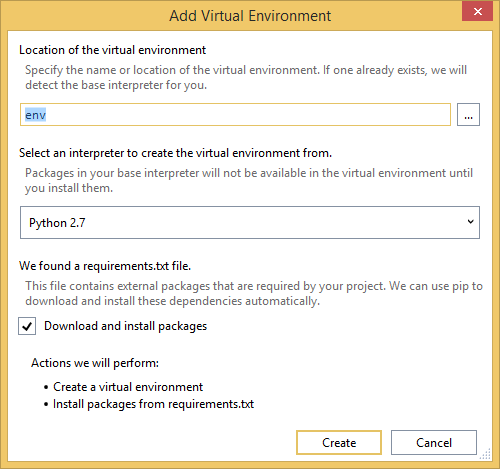
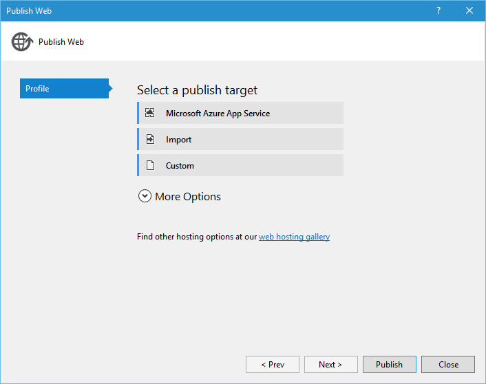

<properties 
    pageTitle="Wird und Azure Table Storage auf Azure mit Python Tools 2.2 für Visual Studio" 
    description="Informationen Sie zum Verwenden der Python-Tools für Visual Studio eine wird Web app zu erstellen, die Daten in Azure Table Storage gespeichert sind, und bei Azure App Dienst Web Apps bereitstellen." 
    services="app-service\web"
    tags="python"
    documentationCenter="python" 
    authors="huguesv" 
    manager="wpickett" 
    editor=""/>

<tags 
    ms.service="app-service-web" 
    ms.workload="web" 
    ms.tgt_pltfrm="na" 
    ms.devlang="python" 
    ms.topic="article" 
    ms.date="07/07/2016"
    ms.author="huvalo"/>

# Wird und Azure Table Storage auf Azure mit Python Tools 2.2 für Visual Studio 

In diesem Lernprogramm werden wir [Python-Tools für Visual Studio] zum Erstellen einer einfachen Umfragen Web app verwenden eine der Vorlagen Stichprobe PTVS verwenden. In diesem Lernprogramm steht auch als [video](https://www.youtube.com/watch?v=qUtZWtPwbTk).

Die Web-app Umfragen definiert eine Abstraktion für das Repository, sodass Sie problemlos zwischen verschiedenen Arten von Repositorys (In-Memory-Azure Table Storage, MongoDB) wechseln können.

Wir lernen so erstellen Sie ein Konto Azure-Speicher, so konfigurieren Sie das Web-app, um Azure Table Storage verwenden und wie Sie die Web app auf [Azure App Dienst Web Apps](http://go.microsoft.com/fwlink/?LinkId=529714)veröffentlichen.

Finden Sie weitere Artikel, die Entwicklung von Azure App Dienst Web Apps mit PTVS Flaschen, geben und Django Web-Framework, mit den Diensten von MongoDB, Azure Table Storage, MySQL und SQL-Datenbank mit Deckblatt der [Python Developer Center] . Während der App-Dienst in diesem Artikel liegt der Schwerpunkt, sind die Schritten ähnlich wie bei der Entwicklung von [Azure Cloud Services].

## Erforderliche Komponenten

 - Visual Studio 2015
 - [Python 2.2-Tools für Visual Studio]
 - [Python 2.2-Tools für Visual Studio-Beispiele VSIX]
 - [Azure SDK-Tools für im Vergleich mit einer 2015]
 - [Python 2.7 32-Bit-] oder [Python 3.4 32-Bit-Version]

[AZURE.INCLUDE [create-account-and-websites-note](../../includes/create-account-and-websites-note.md)]

>[AZURE.NOTE] Wenn Sie mit Azure-App-Verwaltungsdienst Schritte vor dem für ein Azure-Konto anmelden möchten, wechseln Sie zu [App-Verwaltungsdienst versuchen](http://go.microsoft.com/fwlink/?LinkId=523751), in dem Sie eine kurzlebige Starter Web app sofort im App-Dienst erstellen können. Keine Kreditkarten erforderlich; keine Zusagen.

## Erstellen Sie das Projekt

In diesem Abschnitt erstellen wir eine Visual Studio-Projekt mit einer Beispielvorlage. Wir erstellen eine virtuelle Umgebung und erforderliche Pakete installieren. Führen Sie dann die Anwendung lokal mithilfe das Standard-in-Memory-Repository.

1.  Wählen Sie in Visual Studio **Datei**, **Neues Projekt**aus.

1.  Die Project-Vorlagen aus der [Python Tools 2.2 für Visual Studio-Beispiele VSIX] stehen unter **Python**, **Beispiele**zur Verfügung. Wählen Sie **Umfragen wird Webprojekt** , und klicken Sie auf OK, um das Projekt zu erstellen.

    

1.  Sie werden aufgefordert, externe Pakete zu installieren. Wählen Sie **in einer virtuellen Umgebung installieren**.

    

1.  Wählen Sie als Basis-Interpreter **Python 2.7** oder **Python 3.4** aus.

    

1.  Bestätigen, dass die Anwendung durch Drücken von funktioniert `F5`. Standardmäßig verwendet die Anwendung eines in-Memory-Repository die keine Konfiguration erforderlich ist, nicht an. Alle Daten gehen verloren, wenn der Webserver angehalten wird.

1.  Klicken Sie auf **Beispiel Umfragen erstellen**und dann auf eine Umfrage und Abstimmung auf.

    

## Erstellen Sie ein Konto Azure-Speicher

Wenn Speichervorgänge verwenden möchten, benötigen Sie ein Konto Azure-Speicher. Sie können ein Speicherkonto erstellen, indem Sie wie folgt vor.

1.  Melden Sie sich bei der [Azure-Portal](https://portal.azure.com/).

2. Klicken Sie auf das Symbol **neu** oben links des Portals, klicken Sie dann auf **Daten + Speicher** > **Speicher-Konto**. Klicken Sie auf **Erstellen**, und klicken Sie dann geben Sie dem Speicherkonto einen eindeutigen Namen und das Erstellen Sie einer neuen [Ressourcengruppe](../azure-resource-manager/resource-group-overview.md) für.

    

    Nachdem das Speicherkonto erstellt wurde, die Schaltfläche **Benachrichtigungen** blinkt grün **Erfolg** und Blade Speicher-Konto wird geöffnet, um anzuzeigen, dass sie die neue Ressourcengruppe gehört, die Sie erstellt haben.

5. Klicken Sie auf das Webpart **Zugriffstasten** in Blade Speicher-Konto. Notieren Sie den Namen des Kontos und die Schlüssel1.

    

    Wir benötigen diese Informationen zum Konfigurieren des Projekts im nächsten Abschnitt.

## Konfigurieren Sie das Projekt

In diesem Abschnitt werden wir unsere Anwendung Speicher-Konto verwenden wir gerade erstellten konfigurieren. Sehen wir so erhalten Sie die Verbindungseinstellungen vom Azure-Portal an. Dann wir die Anwendung lokal ausgeführt wird.

1.  In Visual Studio mit der rechten Maustaste auf den Projektknoten im Explorer-Lösung, und wählen Sie **Eigenschaften**aus. Klicken Sie auf die Registerkarte **Debuggen** .

    

1.  Legen Sie die Werte der Umgebungsvariablen durch die Anwendung in **Server-Befehl Debuggen** **Umgebung**erforderlich.

        REPOSITORY_NAME=azuretablestorage
        STORAGE_NAME=<storage account name>
        STORAGE_KEY=<primary access key>

    Dadurch wird die Umgebungsvariablen festgelegt Wenn Sie das **Debuggen starten**. Wenn Sie die Variablen so festgelegt werden, wenn Sie **Starten ohne Debuggen**, legen Sie als auch die gleichen Werte unter **Server-Befehl ausführen** möchten.

    Alternativ können Sie über die Windows-Systemsteuerung Umgebungsvariablen definieren. Dies ist eine bessere Option, wenn Sie vermeiden Sie das Speichern von Anmeldeinformationen in Quellcode / project-Datei möchten. Beachten Sie, dass Sie Visual Studio für die neuen Umgebungswerte benötigen benutzerspezifisch zur Verfügung, mit der Anwendung neu starten.

1.  Der Code, der das Azure Table Storage Repository implementiert, wird in **models/azuretablestorage.py**. Finden Sie in der [Dokumentation] für Weitere Informationen zum Verwenden von Python-Diensts.

1.  Führen Sie die Anwendung mit `F5`. Umfragen, die mit der **Stichprobe Umfragen erstellen** und die Daten, die von der Abstimmung übermittelt erstellt wurden, werden in Azure Table Storage serialisiert.

    > [AZURE.NOTE] Die Python 2.7 virtuelle Umgebung möglicherweise eine Ausnahme Seitenumbruch in Visual Studio.  Drücken Sie `F5` Laden des Webprojekts fortsetzen.

1.  Navigieren Sie zu der Seite **zu** überprüfen, ob die Anwendung **Azure Table Storage** Repository verwendet wird.

    

## Untersuchen der Azure Table Storage

Es ist einfach zum Anzeigen und Bearbeiten von Speichertabellen mit Cloud-Explorer in Visual Studio. In diesem Abschnitt werden wir Server-Explorer verwenden, um den Inhalt der Anwendung Umfragen Tabellen anzuzeigen.

> [AZURE.NOTE] Setzt Microsoft Azure-Tools installiert werden, die zur Verfügung stehen als Teil der [Azure SDK für .NET].

1.  **Cloud-Explorer**zu öffnen. Erweitern Sie **Speicherkonten**Ihr Speicherkonto, klicken Sie dann die **Tabellen**aus.

    

1.  Doppelklicken Sie auf die Tabelle **Umfragen** oder **Optionen** zum Anzeigen des Inhalts der Tabelle in einem Dokumentfenster als auch Personen hinzufügen/entfernen/Edit.

    

## Veröffentlichen Sie die Web app auf Azure-App-Verwaltungsdienst

.NET SDK Azure bietet eine einfache Möglichkeit, die App-Verwaltungsdienst Azure Web app bereitstellen.

1.  Klicken Sie im **Explorer Lösung**mit der rechten Maustaste auf den Projektknoten, und wählen Sie **Veröffentlichen**.

    

1.  Klicken Sie auf **Microsoft Azure Web Apps**.

1.  Klicken Sie auf **neu** , um eine neue Web-app zu erstellen.

1.  Füllen Sie die folgenden Felder aus, und klicken Sie auf **Erstellen**.
    -   **Web App-name**
    -   **App-Serviceplan**
    -   **Ressourcengruppe**
    -   **Region**
    -   Lassen Sie **Datenbankserver** legen Sie auf **keine Datenbank**

1.  Übernehmen Sie alle anderen Standardwerte, und klicken Sie auf **Veröffentlichen**.

1.  Webbrowser werden automatisch zu veröffentlichten Web app geöffnet. Wenn Sie zum Durchsuchen der Infoseite, sehen Sie, dass er im **In-Memory** -Repository nicht **Azure Table Storage** Repository verwendet.

    Ist, dass die Umgebungsvariablen nicht festgelegt sind auf der Web Apps-Instanz in Azure App Dienst, damit es in **settings.py**angegebenen Standardwerte verwendet.

## Konfigurieren der Web Apps-Instanz

In diesem Abschnitt werden wir Umgebungsvariablen für das Web Apps-Instanz konfigurieren.

1.  Öffnen Sie [Azure-Portal](https://portal.azure.com)Blade der Web-app, indem Sie auf **Durchsuchen** > **App Services** > der Web app-Name.

1.  Klicken Sie in der Web-app Blade klicken Sie auf **Alle Einstellungen**und dann auf **Application Settings**.

1.  Führen Sie einen Bildlauf nach unten bis zum Abschnitt **Einstellungen für die App** , und legen Sie die Werte für **REPOSITORY\_Namen**, **Speicher\_Namen** und **Speicher\_KEY** wie im Abschnitt **Konfigurieren des Projekts** beschrieben.

    

1.  Klicken Sie auf **Speichern**. Nachdem Sie die Benachrichtigungen erhalten haben, dass die Änderungen übernommen wurden, klicken Sie auf **Durchsuchen** , aus dem Web app-Hauptfenster Blade.

1.  Das Web app wie erwartet mithilfe der **Azure Table Storage** Repository, sollte angezeigt werden.

    Herzlichen Glückwunsch!

    

## Nächste Schritte

Führen Sie die folgenden Links, um weitere Informationen zur Python Tools für Visual Studio, wird und Azure Table Storage.

- [Python-Tools für Visual Studio-Dokumentation]
  - [Webprojekte]
  - [Cloud Service-Projekte]
  - [Remote-Debuggen auf Microsoft Azure]
- [Dokumentation wird]
- [Azure-Speicher]
- [Azure SDK für Python]
- [So verwenden Sie die Tabelle Speicherdienst aus Python]

## Was hat sich geändert
* Ein Leitfaden zum Ändern von Websites-App-Dienst finden Sie unter: [Azure-App-Dienst und seinen Einfluss auf die vorhandenen Azure Services](http://go.microsoft.com/fwlink/?LinkId=529714)

<!--Link references-->
[Python-Entwicklercenter]: /develop/python/
[Azure Cloud Services]: ../cloud-services-python-ptvs.md
[Dokumentation]: ../storage-python-how-to-use-table-storage.md
[So verwenden Sie die Tabelle Speicherdienst aus Python]: ../storage-python-how-to-use-table-storage.md

<!--External Link references-->
[Azure Portal]: https://portal.azure.com
[Azure SDK für .NET]: http://azure.microsoft.com/downloads/
[Python-Tools für Visual Studio]: http://aka.ms/ptvs
[Python 2.2-Tools für Visual Studio]: http://go.microsoft.com/fwlink/?LinkID=624025
[Python 2.2-Tools für Visual Studio-Beispiele VSIX]: http://go.microsoft.com/fwlink/?LinkID=624025
[Azure SDK-Tools für im Vergleich mit einer 2015]: http://go.microsoft.com/fwlink/?linkid=518003
[Python 2.7 32-bit]: http://go.microsoft.com/fwlink/?LinkId=517190 
[Python 3.4 32-bit]: http://go.microsoft.com/fwlink/?LinkId=517191
[Python-Tools für Visual Studio-Dokumentation]: http://aka.ms/ptvsdocs
[Dokumentation wird]: http://flask.pocoo.org/
[Remote-Debuggen auf Microsoft Azure]: http://go.microsoft.com/fwlink/?LinkId=624026
[Webprojekte]: http://go.microsoft.com/fwlink/?LinkId=624027
[Cloud Service-Projekte]: http://go.microsoft.com/fwlink/?LinkId=624028
[Azure-Speicher]: http://azure.microsoft.com/documentation/services/storage/
[Azure SDK für Python]: https://github.com/Azure/azure-sdk-for-python
 
