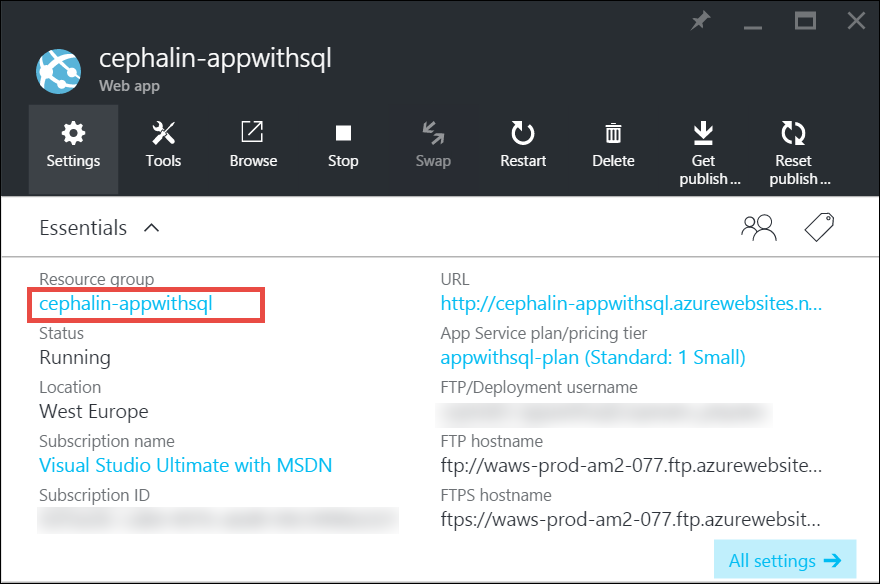

<properties
    pageTitle="Einrichten einer app in Azure skalieren | Microsoft Azure"
    description="Informationen Sie zum Einrichten einer app im App-Verwaltungsdienst zum Hinzufügen von Kapazität und Features Azure skalieren."
    services="app-service"
    documentationCenter=""
    authors="cephalin"
    manager="wpickett"
    editor="mollybos"/>

<tags
    ms.service="app-service"
    ms.workload="na"
    ms.tgt_pltfrm="na"
    ms.devlang="na"
    ms.topic="article"
    ms.date="07/05/2016"
    ms.author="cephalin"/>

# Einrichten einer app in Azure skalieren #

In diesem Artikel wird gezeigt, wie Sie Ihre app in Azure-App-Verwaltungsdienst skalieren. Es gibt zwei Workflows für Skalierung, Skalierung nach oben und Dezimalstellen ab und in diesem Artikel wird erläutert, die Skalierung von Workflows.

- [Skalieren](https://en.wikipedia.org/wiki/Scalability#Horizontal_and_vertical_scaling): erhalten Sie weitere CPU, Arbeitsspeicher, Festplattenspeicher und zusätzliche Features wie dedizierten virtuellen Computern (virtuelle Computer), benutzerdefinierte Domänen und Zertifikate, das staging Steckplätze, automatische Skalierung und mehr. Sie Skalierung durch Ändern der Preisgestaltung Ebene von der App-Serviceplan, die Ihre app gehört.
- [Skalierung](https://en.wikipedia.org/wiki/Scalability#Horizontal_and_vertical_scaling): erhöhen Sie die Anzahl der Instanzen virtueller Computer, die Ihre app ausgeführt werden.
Sie können bis zu 20 gehörendes je nach Ihrem Partner-Level Preisgestaltung skalieren. [App-Service-Umgebungen](../app-service/app-service-app-service-environments-readme.md) in **Premium** Ebene wird der Anzahl der Skalierung auf 50 Instanzen weiter erhöhen. Weitere Informationen zu Skalierung finden Sie unter [Skalieren der Anzahl der Instanzen manuell oder automatisch](../monitoring-and-diagnostics/insights-how-to-scale.md). Dort finden Sie, wie Sie die automatische Skalierung, verwenden Sie die Anzahl der Instanzen automatisch basierend auf vordefinierten Regeln und Zeitpläne skalieren ist.

Die skalierungseinstellungen nur wenige Sekunden dauern anwenden und alle apps in Ihren [App-Serviceplan](../app-service/azure-web-sites-web-hosting-plans-in-depth-overview.md)auswirken.
Sie müssen Sie keine zum Ändern von Codes oder Ihrer Anwendung erneut bereitstellen.

Informationen über die Preise und die Funktionen der einzelnen App Service-Pläne finden Sie unter [App Dienstleistung Preise](/pricing/details/web-sites/).  

> [AZURE.NOTE] Bevor Sie eine App Serviceplan von der **Free** Ebene wechseln möchten, müssen Sie zuerst die [Ausgaben Grenzwerte](/pricing/spending-limits/) direkte für Ihr Abonnement Azure entfernen. Zum Anzeigen oder Ändern von Optionen für Ihr Abonnement Microsoft Azure-App-Dienst, finden Sie unter [Microsoft Azure-Abonnements][azuresubscriptions].

## Einrichten Ihrer Preisgestaltung Ebene skalieren

1. Öffnen Sie in Ihrem Browser das [Azure-Portal][portal].

2. Klicken Sie in Ihrer app Blade auf **Alle Einstellungen**, und klicken Sie dann auf **Skalieren**.

    ![Navigieren Sie um zu Ihrer Azure-app zu skalieren.][ChooseWHP]

4. Wählen Sie die Ebene aus, und klicken Sie dann auf **auswählen**.

    Die Registerkarte **Benachrichtigungen** blinkt grün **Erfolg** , nachdem der Vorgang abgeschlossen ist.

## Zugehörige Ressourcen skalieren
Wenn Ihre app von anderen Diensten, wie etwa SQL Azure-Datenbank oder Azure-Speicher abhängig ist, können Sie auch die Ressourcen entsprechend Ihren Anforderungen skalieren. Diese Ressourcen werden nicht mit der App-Serviceplan skaliert und separat skaliert werden müssen.

1. Klicken Sie in **Essentials**auf den Link **Ressourcengruppe** .

    

2. Klicken Sie in dem **Ressourcengruppe** Blade **Hyperlinkübersicht** -Webpart auf eine Ressource, die Sie skalieren möchten. Das folgende Bildschirmabbild zeigt eine SQL-Datenbank und einer Ressource Azure-Speicher.

    

3. Klicken Sie auf **Einstellungen**für eine Ressource SQL-Datenbank > **Preise Ebene** , die Preise zu skalieren zu stufen.

    

    Sie können auch [Geo-Replikation](../sql-database/sql-database-geo-replication-overview.md) für die Instanz der SQL-Datenbank aktivieren.

    Klicken Sie auf **Einstellungen**für eine Ressource Azure-Speicher > **Konfiguration** der Speicheroptionen skalieren.

    

## Erfahren Sie mehr über Entwicklerfunktionen
Je nach der Preisgestaltung Ebene stehen die folgenden Features für Entwickler Orientierung:

### Bitness ###

- Die **grundlegende**, **Standard-**und **Premium** Ebenen unterstützt 64-Bit- und 32-Bit Applications.
- Die **Free** und **freigegebene** Plan Ebenen unterstützt nur 32-Bit Applications.

### Debuggerunterstützung ###

- Debuggerunterstützung steht für die **frei**, **freigegeben**und **grundlegende** Modi bei pro-App-Serviceplan eine Verbindung zur Verfügung.
- Debuggerunterstützung steht für die **Standard-** und **Premium** Modi bei fünf gleichzeitige Verbindungen pro-App-Serviceplan.

## Informationen zu anderen Funktionen

- Ausführliche Informationen zu aller verbleibenden Features in den App-Service-Plänen, einschließlich Preisen und Funktionen von Interesse für alle Benutzer (einschließlich Entwickler) finden Sie unter [App Dienstleistung Preise](/pricing/details/web-sites/).

>[AZURE.NOTE] Wenn Sie mit Azure-App-Verwaltungsdienst anzufangen, bevor Sie für ein Azure-Konto anmelden möchten, wechseln Sie zu [App-Verwaltungsdienst versuchen](http://go.microsoft.com/fwlink/?LinkId=523751) , in dem Sie eine kurzlebige Starter Web app sofort im App-Dienst erstellen können. Es sind keine Kreditkarten erforderlich, und es gibt keine Zusagen.

## Nächste Schritte

- Um mit Azure anzufangen, finden Sie unter [Microsoft Azure kostenlose Testversion](/pricing/free-trial/).
- Informationen zur Preisgestaltung, Support und Vereinbarung zum SERVICELEVEL finden Sie auf die folgenden Links.

    [Daten weiterleitet Informationen zur Preisgestaltung](/pricing/details/data-transfers/)

    [Microsoft Azure-Support-Pläne](/support/plans/)

    [Service Level Agreements](/support/legal/sla/)

    [SQL-Datenbank Preise-Details](/pricing/details/sql-database/)

    [Virtuellen Computern und Cloud-Dienst Größen für Microsoft Azure][vmsizes]

    [App Preise Dienstleistung](/pricing/details/app-service/)

    [App-Verwaltungsdienst Preise Details - SSL-Verbindungen](/pricing/details/web-sites/#ssl-connections)

- Informationen zur Azure-App-Verwaltungsdienst bewährte Methoden, erstellen eine skalierbare und robuste Architektur, einschließlich finden Sie unter [bewährte Methoden: Azure App Dienst Web Apps](http://blogs.msdn.com/b/windowsazure/archive/2014/02/10/best-practices-windows-azure-websites-waws.aspx).

- Videos zum Skalieren des App-Service-apps finden Sie unter den folgenden Ressourcen:

    - [Wann Azure Websites – mit Stefan Schackow skalieren](/documentation/videos/azure-web-sites-free-vs-standard-scaling/)
    - [Automatische Skalierung Azure Websites, CPU oder geplanten - mit Stefan Schackow](/documentation/videos/auto-scaling-azure-web-sites/)
    - [Wie Azure Websites Maßstab - mit Stefan Schackow](/documentation/videos/how-azure-web-sites-scale/)

<!-- LINKS -->
[vmsizes]:/pricing/details/app-service/
[SQLaccountsbilling]:http://go.microsoft.com/fwlink/?LinkId=234930
[azuresubscriptions]:http://go.microsoft.com/fwlink/?LinkID=235288
[portal]: https://portal.azure.com/

<!-- IMAGES -->
[ChooseWHP]: ./media/web-sites-scale/scale1ChooseWHP.png
[ChooseBasicInstances]: ./media/web-sites-scale/scale2InstancesBasic.png
[SaveButton]: ./media/web-sites-scale/05SaveButton.png
[BasicComplete]: ./media/web-sites-scale/06BasicComplete.png
[ScaleStandard]: ./media/web-sites-scale/scale3InstancesStandard.png
[Autoscale]: ./media/web-sites-scale/scale4AutoScale.png
[SetTargetMetrics]: ./media/web-sites-scale/scale5AutoScaleTargetMetrics.png
[SetFirstRule]: ./media/web-sites-scale/scale6AutoScaleFirstRule.png
[SetSecondRule]: ./media/web-sites-scale/scale7AutoScaleSecondRule.png
[SetThirdRule]: ./media/web-sites-scale/scale8AutoScaleThirdRule.png
[SetRulesFinal]: ./media/web-sites-scale/scale9AutoScaleFinal.png
[ResourceGroup]: ./media/web-sites-scale/scale10ResourceGroup.png
[ScaleDatabase]: ./media/web-sites-scale/scale11SQLScale.png
[GeoReplication]: ./media/web-sites-scale/scale12SQLGeoReplication.png
