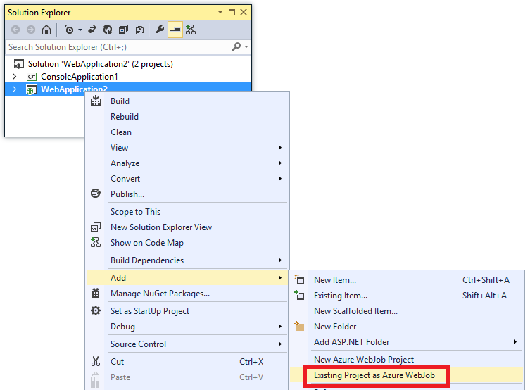
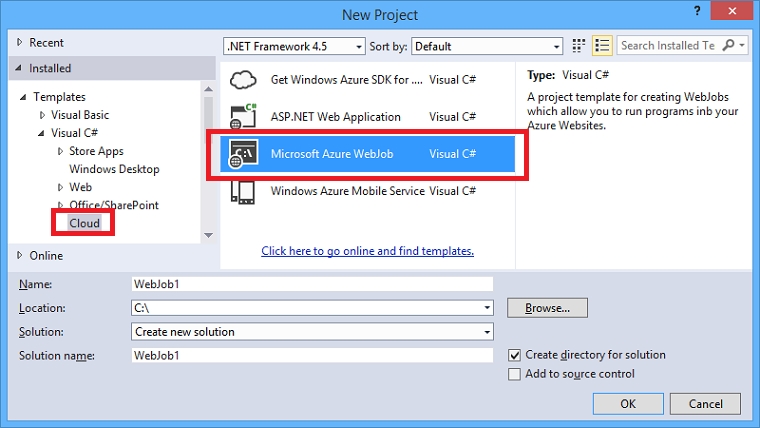
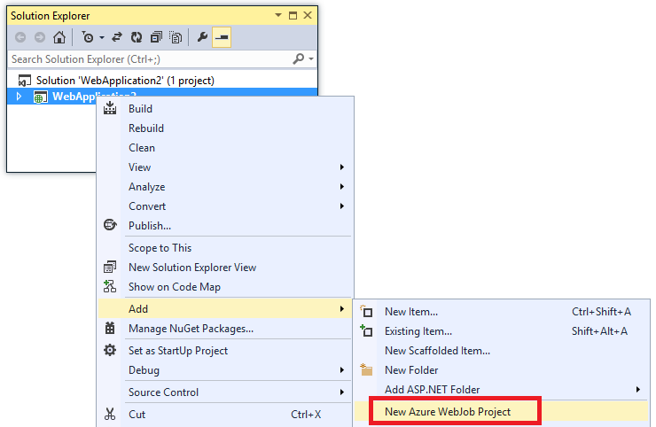

<properties 
    pageTitle="Bereitstellen Sie WebJobs mit Visual Studio" 
    description="Informationen Sie zum Azure WebJobs Azure App Dienst Web Apps mit Visual Studio bereitstellen." 
    services="app-service" 
    documentationCenter="" 
    authors="tdykstra" 
    manager="wpickett" 
    editor="jimbe"/>

<tags 
    ms.service="app-service" 
    ms.devlang="dotnet" 
    ms.topic="article" 
    ms.tgt_pltfrm="na" 
    ms.workload="na" 
    ms.date="04/27/2016" 
    ms.author="tdykstra"/>

# Bereitstellen Sie WebJobs mit Visual Studio

## (Übersicht)

In diesem Thema wird erläutert, wie Visual Studio bereitstellen ein Projekts Console-Anwendung mit einer Web [App-Dienst](http://go.microsoft.com/fwlink/?LinkId=529714) , wie eine [Azure WebJob](http://go.microsoft.com/fwlink/?LinkId=390226)verwenden. Informationen zur Verwendung von WebJobs mithilfe der [Azure-Portal](https://portal.azure.com)bereitstellen finden Sie unter [Hintergrundaufgaben mit WebJobs ausführen](web-sites-create-web-jobs.md).

Wenn Visual Studio ein Projekt Console-Anwendung WebJobs aktiviert bereitstellt, zwei Aufgaben ausgeführt:

* Kopiert Runtime-Dateien in den entsprechenden Ordner in der Web-app (*App_Data/Aufträge/fortlaufender* für kontinuierliche WebJobs, *App_Data, Aufträge, ausgelöst* , wenn ein geplanten und bei Bedarf WebJobs).
* Richtet ein [Azure Scheduler Aufträge](#scheduler) für WebJobs, die Ausführung für bestimmte Zeiten angesetzt werden. (Dies ist nicht für kontinuierliche WebJobs erforderlich.)

Ein Projekt WebJobs aktiviert weist die folgenden Elemente hinzugefügt:

* Die [Microsoft.Web.WebJobs.Publish](http://www.nuget.org/packages/Microsoft.Web.WebJobs.Publish/) NuGet-Paket.
* Eine [Webjob veröffentlichen settings.json](#publishsettings) -Datei, die Einstellungen für Bereitstellung und Scheduler enthält. 

Sie können diese Elemente zu einem vorhandenen Console-Anwendung Projekt hinzufügen oder Verwenden einer Vorlage zum Erstellen eines neuen Projekts Console-Anwendung WebJobs aktiviert. 

Sie können bereitstellen ein Projekts als eine WebJob allein oder zu einem Webprojekt verknüpfen, damit es automatisch bereitstellt, wenn Sie das Webprojekt bereitstellen. Um Projekte zu verknüpfen, umfasst Visual Studio den Namen des Projekts WebJobs aktiviert in einer [Webjobs-list.json](#webjobslist) -Datei im Web-Projekt.

## Erforderliche Komponenten

WebJobs Bereitstellungsfunktionen stehen in Visual Studio 2015 bei der Installation der Azure SDK für .NET:

* [Azure SDK für .NET (Visual Studio 2015)](http://go.microsoft.com/fwlink/?linkid=518003).

## Aktivieren Sie Bereitstellung von WebJobs für ein vorhandenes Console-Anwendung Projekt

Sie haben zwei Optionen:

* [Aktivieren der automatischen Bereitstellung mit einem Webprojekt](#convertlink).

    Konfigurieren Sie ein vorhandenes Projekt mit Console-Anwendung so, dass er automatisch als eine WebJob bereitstellt, wenn Sie ein Webprojekt bereitstellen. Verwenden Sie diese Option, wenn Sie Ihre WebJob in der gleichen Web app ausführen, in dem Sie die zugehörigen Webanwendung ausführen, möchten.

* [Aktivieren der Bereitstellung ohne ein Webprojekt](#convertnolink).

    Konfigurieren Sie ein vorhandenes Console-Anwendung Projekt als eine WebJob allein, mit dem keine Verbindung zu einem Webprojekt bereitstellen. Verwenden Sie diese Option, wenn Sie eine WebJob in einer Web app selbst über keine Web-Anwendung, die in der Web-app ausgeführt ausführen möchten. Möglicherweise möchten dies tun, um zu WebJob Ressourcen unabhängig von der Web-Anwendungsressourcen skalieren können.

### Aktivieren von automatischen WebJobs Bereitstellung mit einem Webprojekt
  
1. Mit der rechten Maustaste im Webprojekts im **Solution Explorer**, und klicken Sie dann auf **Hinzufügen** > **Vorhandenes Projekt als Azure WebJob**.

    
    
    Klicken Sie im Dialogfeld [Azure WebJob hinzufügen](#configure) wird angezeigt.

1. Wählen Sie in der Dropdown-Liste **Projektname** Console-Anwendung Projekt als eine WebJob hinzufügen.

    

2. Führen Sie im Dialogfeld [Azure WebJob hinzufügen](#configure) , und klicken Sie dann auf **OK**. 

### Aktivieren Sie WebJobs Bereitstellung ohne ein Webprojekt
  
1. Mit der rechten Maustaste im Projekts Console-Anwendung im **Solution Explorer**, und klicken Sie dann auf **als Azure WebJob veröffentlichen**. 

    
    
    Klicken Sie im Dialogfeld [Hinzufügen Azure WebJob](#configure) angezeigt wird, mit dem Projekt in das Feld **Projektname** ausgewählt ist.

2.  Führen Sie im Dialogfeld [Azure WebJob hinzufügen](#configure) , und klicken Sie dann auf **OK**.

    Der **Web veröffentlichen** -Assistent wird angezeigt.  Wenn Sie nicht sofort veröffentlichen möchten, schließen Sie den Assistenten. Einstellungen, die Sie eingegeben haben, werden für gespeichert, wenn Sie [das Projekt](#deploy)bereitgestellt werden sollen.

## Erstellen eines neuen Projekts von WebJobs aktiviert

Zum Erstellen eines neuen Projekts von WebJobs aktiviert, können Sie die Projektvorlage Console-Anwendung verwenden und WebJobs Bereitstellung aktivieren, wie im [vorherigen Abschnitt](#convert)erläutert. Alternativ können Sie die Vorlage WebJobs neues Projekt:

* [Verwenden Sie die WebJobs neuen Project-Vorlage für eine unabhängige WebJob](#createnolink)

    Erstellen Sie ein Projekt aus, und konfigurieren Sie ihn als eine WebJob, mit dem keine Verbindung zu einem Webprojekt allein bereitstellen. Verwenden Sie diese Option, wenn Sie eine WebJob in einer Web app selbst über keine Web-Anwendung, die in der Web-app ausgeführt ausführen möchten. Möglicherweise möchten dies tun, um zu WebJob Ressourcen unabhängig von der Web-Anwendungsressourcen skalieren können.

* [Verwenden Sie die WebJobs neuen Project-Vorlage für eine WebJob mit einem Webprojekt verknüpft](#createlink)

    Erstellen eines Projekts, das so konfiguriert ist, dass automatisch als eine WebJob bereitstellen, wenn ein Webprojekt in der gleichen Lösung bereitgestellt wird. Verwenden Sie diese Option, wenn Sie Ihre WebJob in der gleichen Web app ausführen, in dem Sie die zugehörigen Webanwendung ausführen, möchten.

> [AZURE.NOTE] Die Vorlage WebJobs neues Projekt automatisch installiert NuGet Pakete und *Program.cs* Code für das [WebJobs SDK](http://www.asp.net/aspnet/overview/developing-apps-with-windows-azure/getting-started-with-windows-azure-webjobs)umfasst. Wenn Sie nicht, verwenden Sie das WebJobs SDK möchten oder einer geplanten statt für dauerhaften WebJob verwenden möchten, entfernen oder Ändern der `host.RunAndBlock` -Anweisung in *Program.cs*.

### Verwenden Sie die WebJobs neuen Project-Vorlage für eine unabhängige WebJob
  
1. Klicken Sie auf **Datei** > **Neues Projekt**, und klicken Sie dann im Dialogfeld **Neues Projekt** auf **Cloud** > **Microsoft Azure WebJob**.

    
    
2. Führen Sie die Anweisungen zuvor für [die Console-Anwendung, die ein unabhängiges WebJobs Projekt project stellen](#convertnolink)angezeigt.

### Verwenden Sie die WebJobs neuen Project-Vorlage für eine WebJob mit einem Webprojekt verknüpft

1. Mit der rechten Maustaste im Webprojekts im **Solution Explorer**, und klicken Sie dann auf **Hinzufügen** > **Azure WebJob Projekt**.

    

    Klicken Sie im Dialogfeld [Azure WebJob hinzufügen](#configure) wird angezeigt.

2. Führen Sie im Dialogfeld [Azure WebJob hinzufügen](#configure) , und klicken Sie dann auf **OK**.

## Das Dialogfeld Azure WebJob hinzufügen

Das Dialogfeld **Azure WebJob hinzufügen** können Sie WebJob Namen und Planen von Einstellungen für Ihre WebJob eingeben. 

Klicken Sie im Dialogfeld **Neues Projekt** des Portals Azure Felder entsprechen die Felder in diesem Dialogfeld. Weitere Informationen finden Sie unter [Hintergrundaufgaben mit WebJobs ausführen](web-sites-create-web-jobs.md).

Für eine geplante WebJob (nicht für kontinuierliche WebJobs) erstellt Visual Studio eine Websitesammlung zu [Azure Scheduler](/services/scheduler/) Position aus, wenn eine nicht noch vorhanden, und eine Position in der Auflistung erstellt:

* Die Scheduler Job Auflistung heißt *WebJobs-{Regionname}* , *{Regionname}* bezieht sich auf den Bereich im Web, app in gehostet wird. Beispiel: WebJobs-WestUS.
* Der Auftrag Scheduler heißt *{Webappname}-{Webjobname}*. Beispiel: MyWebApp-MyWebJob. 
 
>[AZURE.NOTE]
> 
>* Informationen zur Bereitstellung über die Befehlszeile finden Sie unter [Aktivieren Befehlszeile oder fortlaufender Übermittlung Azure WebJobs](/blog/2014/08/18/enabling-command-line-or-continuous-delivery-of-azure-webjobs/).
>* Wenn Sie ein **Wiederkehrendes Projekt** konfigurieren und Serienabstand auf eine Anzahl von Minuten festlegen, ist der Dienst Azure Scheduler nicht frei. Andere Häufigkeiten (Stunden, Tage usw.) sind kostenlos.
>* Wenn Sie eine WebJob bereitstellen und dann feststellen, dass Sie die Art der WebJob und die erneute Bereitstellung ändern möchten, müssen Sie die Datei Webjobs veröffentlichen settings.json zu löschen. Dies wird Visual Studio die Optionen für die Veröffentlichung erneut anzeigen gemacht werden, damit Sie die Art der WebJob ändern können.
>* Wenn Sie eine WebJob bereitstellen und später der Laufzeitmodus aus fortlaufender nicht fortlaufenden oder umgekehrt ändern, erstellt Visual Studio eine neue WebJob in Azure an, wenn Sie erneut bereitstellen. Wenn Sie andere Planung Einstellungen ändern, aber verlassen Modus ausgeführt wird und die gleiche oder Wechseln zwischen geplant und On Demand, Visual Studio aktualisiert den vorhandenen Auftrag statt einen neuen erstellen.

## Webjob veröffentlichen settings.json

Wenn Sie eine Console-Anwendung für die Bereitstellung von WebJobs konfigurieren, Visual Studio installiert das [Microsoft.Web.WebJobs.Publish](http://www.nuget.org/packages/Microsoft.Web.WebJobs.Publish/) NuGet-Paket, und speichert Zeitplaninformationen in einer Datei *Webjob veröffentlichen settings.json* in den Projektordner *Eigenschaften* des Projekts WebJobs. Hier ist ein Beispiel für die Datei ein:

        {
          "$schema": "http://schemastore.org/schemas/json/webjob-publish-settings.json",
          "webJobName": "WebJob1",
          "startTime": "2014-06-23T00:00:00-08:00",
          "endTime": "2014-06-27T00:00:00-08:00",
          "jobRecurrenceFrequency": "Minute",
          "interval": 5,
          "runMode": "Scheduled"
        }

Sie können diese Datei direkt bearbeiten und Visual Studio stellt IntelliSense. Das Dateischema unter [http://schemastore.org](http://schemastore.org/schemas/json/webjob-publish-settings.json) gespeichert ist, und dort angezeigt werden kann.  

>[AZURE.NOTE]
>
>* Wenn Sie ein **Wiederkehrendes Projekt** konfigurieren und Serienabstand auf eine Anzahl von Minuten festlegen, ist der Dienst Azure Scheduler nicht frei. Andere Häufigkeiten (Stunden, Tage usw.) sind kostenlos.

## Webjobs-list.json

Wenn Sie ein Projekt WebJobs aktiviert zu einem Webprojekt verknüpfen, speichert Visual Studio den Namen des Projekts WebJobs in einer *Webjobs-list.json* -Datei im Ordner für das Webprojekt *Eigenschaften* an. Die Liste kann mehrere WebJobs Projekte enthalten, wie im folgenden Beispiel gezeigt:

        {
          "$schema": "http://schemastore.org/schemas/json/webjobs-list.json",
          "WebJobs": [
            {
              "filePath": "../ConsoleApplication1/ConsoleApplication1.csproj"
            },
            {
              "filePath": "../WebJob1/WebJob1.csproj"
            }
          ]
        }

Sie können diese Datei direkt bearbeiten und Visual Studio stellt IntelliSense. Das Dateischema unter [http://schemastore.org](http://schemastore.org/schemas/json/webjobs-list.json) gespeichert ist, und dort angezeigt werden kann.
  
## Bereitstellen eines Projekts WebJobs

Ein WebJobs-Projekt, das mit einem Webprojekt verknüpft sind, werden automatisch mit der Project Web bereitstellt. Informationen zur Bereitstellung von Projekten finden Sie unter [So Web Apps bereitstellen](web-sites-deploy.md).

Bereitstellen eines Projekts WebJobs allein, mit der rechten Maustaste im Projekts im **Solution Explorer**, und klicken Sie auf **als Azure WebJob veröffentlichen**. 

    
Für eine unabhängige WebJob, den gleichen **Web veröffentlichen** -Assistenten für Webprojekte verwendet wird angezeigt, jedoch mit weniger Einstellungen ändern zur Verfügung.

## Nächste Schritte

In diesem Artikel weist so WebJobs mit Visual Studio bereitstellen erläutert. Weitere Informationen zum Bereitstellen von Azure WebJobs finden Sie unter [Azure WebJobs - Ressourcen empfohlen - Bereitstellung](http://www.asp.net/aspnet/overview/developing-apps-with-windows-azure/azure-webjobs-recommended-resources#deploying).
