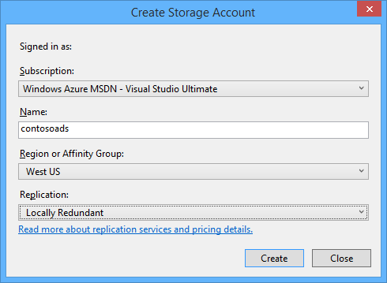
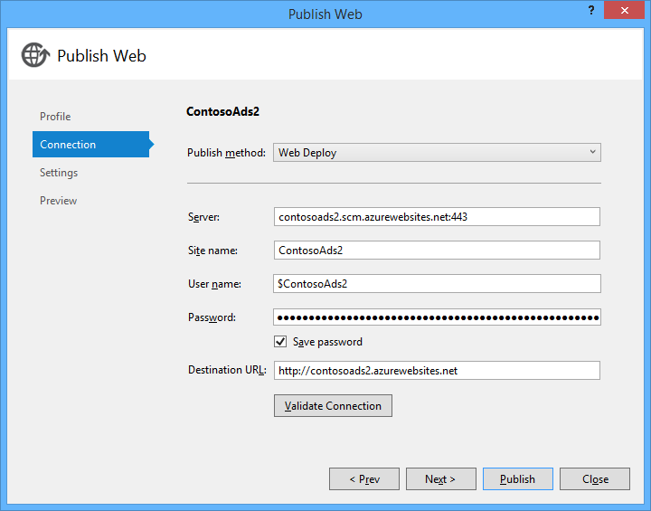
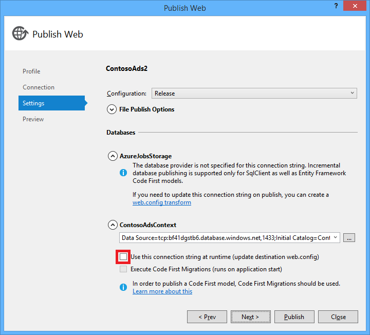
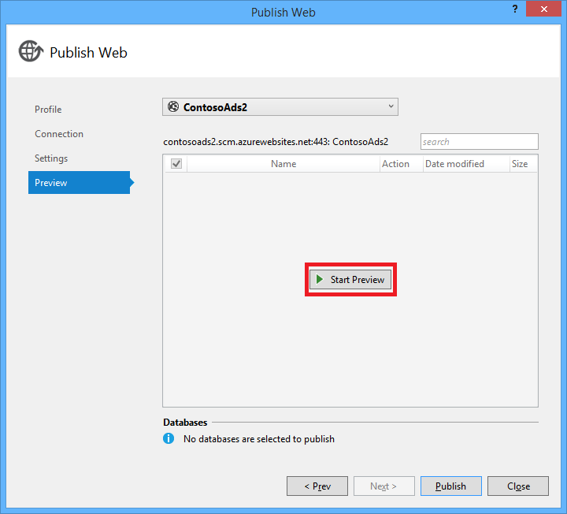
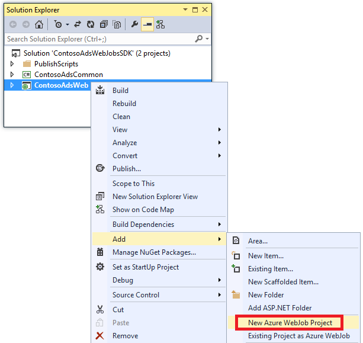

<properties
    pageTitle="Erstellen Sie eine .NET WebJob in Azure App-Verwaltungsdienst | Microsoft Azure"
    description="Erstellen einer mit mehreren Ebenen app ASP.NET-MVC und Azure. Der front-End-verwendet in einer Web-app in Azure-App-Dienst und die Back-End-wird als eine WebJob ausgeführt. Die app verwendet Entität Framework, SQL-Datenbank und Azure-Speicher Warteschlangen und Blobs."
    services="app-service"
    documentationCenter=".net"
    authors="tdykstra"
    manager="wpickett"
    editor="mollybos"/>

<tags
    ms.service="app-service"
    ms.workload="na"
    ms.tgt_pltfrm="na"
    ms.devlang="na"
    ms.topic="article"
    ms.date="10/28/2016"
    ms.author="tdykstra"/>

# Erstellen Sie eine .NET WebJob in Azure App-Verwaltungsdienst

In diesem Lernprogramm erfahren, wie zum Schreiben von Code für eine einfache mit mehreren Ebenen ASP.NET MVC 5-Anwendung, die das [WebJobs SDK](websites-dotnet-webjobs-sdk.md)verwendet wird.

Der Zweck des [WebJobs SDK](websites-webjobs-resources.md) ist der Code, den Sie für häufige Aufgaben schreiben, dass eine WebJob ausführen, wie z. B. Image-Verarbeitung, Warteschlange Verarbeitung können, RSS-Aggregation, Wartung und Senden von e-Mails zu vereinfachen. Das WebJobs SDK weist integrierte Features für die Arbeit mit Azure-Speicher und Dienstbus, für die Planung von Vorgängen und Behandeln von Fehlern und viele andere allgemeine Szenarien. Darüber hinaus dieses Konzept erweiterbar sein, und es ist [Quellrepository für Erweiterungen zu öffnen](https://github.com/Azure/azure-webjobs-sdk-extensions/wiki/Binding-Extensions-Overview).

Die Anwendung Beispiel ist eine Werbung Bulletinboard. Benutzer können Hochladen von Bildern für anzeigen und ein Back-End-Prozess konvertiert die Bilder in Miniaturansicht. Die Listenseite Ad zeigt die Miniaturansichten und die Detailseite Ad zeigt das Bild Vollbild. Hier ist ein Screenshot aus:

Diese Anwendung funktioniert mit [Azure Warteschlangen](http://www.asp.net/aspnet/overview/developing-apps-with-windows-azure/building-real-world-cloud-apps-with-windows-azure/queue-centric-work-pattern) und [Azure-Blobs](http://www.asp.net/aspnet/overview/developing-apps-with-windows-azure/building-real-world-cloud-apps-with-windows-azure/unstructured-blob-storage). Das Lernprogramm wird gezeigt, wie die Anwendung [Azure-App-Verwaltungsdienst](http://go.microsoft.com/fwlink/?LinkId=529714) und [Azure SQL-Datenbank](http://msdn.microsoft.com/library/azure/ee336279)bereitstellen.

## Erforderliche Komponenten

Das Lernprogramm wird davon ausgegangen, dass Sie wissen, wie Sie mit [ASP.NET MVC 5](http://www.asp.net/mvc/tutorials/mvc-5/introduction/getting-started) Projekten in Visual Studio entwickelt.

Das Lernprogramm wurde für Visual Studio 2013 geschrieben. Wenn Sie noch keine Visual Studio haben, wird es für Sie automatisch installiert werden bei der Installation der Azure SDK für .NET.

Das Lernprogramm mit Visual Studio 2015 verwendet werden kann, bevor Sie die Anwendung ausführen lokal müssen jedoch ändern die `Data Source` für einen Teil der Verbindungszeichenfolge im Feld Web.config und App.config-Dateien von SQL Server LocalDB `Data Source=(localdb)\v11.0` auf `Data Source=(LocalDb)\MSSQLLocalDB`. 

> [AZURE.NOTE] Benötigen Sie ein Azure-Konto zum Bearbeiten dieses Lernprogramms:
  >
  > + Sie können [ein Azure-Konto kostenlos öffnen](https://azure.microsoft.com/pricing/free-trial/?WT.mc_id=A261C142F): Abrufen von Gutschriften können Sie kostenpflichtiges Azure Services ausprobieren und sogar nachdem sie es gewohnt sind bis können Sie das Konto behalten und Verwendung frei Azure Dienste, wie z. B. Websites. Ihre Kreditkarte wird nie belastet, sofern Sie explizit der Einstellungen ändern, und bitten um in Rechnung gestellt.
  >
  > + Sie können [MSDN-Vorteile für Abonnenten aktivieren](https://azure.microsoft.com/pricing/member-offers/msdn-benefits-details/?WT.mc_id=A261C142F): Ihr MSDN-Abonnement bietet Ihnen Gutschriften ausgezahlt, die Sie für kostenpflichtiges Azure-Dienste verwenden können.
  >
  >Wenn Sie mit Azure-App-Verwaltungsdienst Schritte vor dem für ein Azure-Konto anmelden möchten, wechseln Sie zu [App-Verwaltungsdienst versuchen](http://go.microsoft.com/fwlink/?LinkId=523751), in dem Sie eine kurzlebige Starter Web app sofort im App-Dienst erstellen können. Keine Kreditkarten erforderlich; keine Zusagen.

## Sie erfahren

Das Lernprogramm wird gezeigt, wie die folgenden Aufgaben ausführen:

* Aktivieren Sie für Azure-Entwicklung den Computer nach der Installation von Azure SDK.
* Erstellen Sie ein Projekt Console-Anwendung, die automatisch als eine Azure WebJob bereitgestellt wird, wenn Sie das Webprojekt zugeordneten bereitstellen.
* Testen einer WebJobs SDK Back-End-lokal auf dem Entwicklungscomputer an.
* Veröffentlichen Sie eine Anwendung mit einem WebJobs Back-End-mit einer Web App-Dienst an.
* Hochladen von Dateien, und speichern sie den Azure Blob-Dienst.
* Verwenden Sie die Azure WebJobs SDK für die Arbeit mit Azure-Speicher Warteschlangen und Blobs.

## Architektur der Anwendung

Die Anwendung Stichprobe mithilfe des [Warteschlange reduzierte Arbeit Muster](http://www.asp.net/aspnet/overview/developing-apps-with-windows-azure/building-real-world-cloud-apps-with-windows-azure/queue-centric-work-pattern) verteilen die Arbeit CPU-Auslastung des Erstellens Miniaturansichten an einen Back-End-Prozess.

Die app speichert Werbung in einer SQL-Datenbank mit Tabellen erstellen und die Daten Entität Framework Code First. Die Datenbank speichert für jede Anzeige, zwei URLs: eine für die Bilder in voller Größe und eine für die Miniaturansicht.

Wenn ein Benutzer ein Bild hochgeladen werden, das Web app speichert das Bild in einem [Azure BLOB-](http://www.asp.net/aspnet/overview/developing-apps-with-windows-azure/building-real-world-cloud-apps-with-windows-azure/unstructured-blob-storage), und es speichert die Ad-Informationen in der Datenbank mit einer URL, die auf die Blob verweist. Zur gleichen Zeit eine Nachricht in einem Azure Warteschlange geschrieben. In einem Back-End-Prozess als eine Azure WebJob ausgeführt fragt das WebJobs SDK die Warteschlange für neue Nachrichten. Wenn eine neue Nachricht angezeigt wird, wird der WebJob für dieses Bild eine Miniaturansicht erstellt und im Miniaturansichtsbereich Datenbankfeld URL für die Anzeige aktualisiert. Hier ist ein Diagramm, das zeigt, wie die Teile der Anwendung interagieren:

[AZURE.INCLUDE [install-sdk](../../includes/install-sdk-2015-2013.md)]

Die zusammengehörenden Anweisungen gelten für Azure SDK für .NET 2.7.1 oder höher.

## Erstellen Sie ein Konto Azure-Speicher

Ein Konto Azure-Speicher stellt Ressourcen für Warteschlange und Blob-Daten in der Cloud zu speichern. Vom SDK WebJobs dient zum Speichern von Daten für das Dashboard protokolliert.

In einer realen Anwendung erstellen Sie in der Regel getrennte Konten für die Anwendung, dass die Daten im Vergleich zu Protokollierungsdaten und separaten Testdaten im Vergleich zu Herstellung Daten ausmacht. In diesem Lernprogramm verwenden Sie nur eine Konto.

1. Öffnen Sie das Fenster **Server-Explorer** in Visual Studio.

2. Mit der rechten Maustaste in des **Azure** -Knotens, und klicken Sie dann auf **Verbindung mit Microsoft Azure herstellen**.

3. Melden Sie sich mit Azure-Anmeldeberechtigungen.

5. Mit der rechten Maustaste **Speicher** unter dem Azure Knoten, und klicken Sie dann auf **Speicher-Konto erstellen**.

3. Geben Sie einen Namen für das Speicherkonto, klicken Sie im Dialogfeld **Speicher-Konto erstellen** .

    Der Name muss eindeutig sein (keine anderen Azure-Speicher-Konto kann denselben Namen haben). Wenn der eingegebene Name bereits verwendet wird, erhalten Sie Möglichkeit, diese zu ändern.

    Kann ich die URL Zugriff auf Ihr Speicherkonto *{Name}*. von Core.Windows.NET befinden..

5. Legen Sie im **Bereich oder Zugehörigkeit Gruppe** Dropdown-Liste in der Region, die Sie am nächsten ist.

    Diese Einstellung gibt an, welche Azure Datacenter Ihr Speicherkonto gehostet wird. In diesem Lernprogramm wird nicht Ihrer Wahl a auffällig entscheidend. Für eine Herstellung Web app möchten Sie jedoch Ihre Webserver und Ihr Speicherkonto in derselben Region Wartezeit und Daten Ausgang Gebühren minimiert werden. Die Web-app (das Sie später erstellt werden) Datacenter sollten so nah wie möglich an den Browsern, die Zugriff auf das Web app und Wartezeit minimieren.

6. Legen Sie die Dropdownliste **Replikation** auf **lokal redundante**ein.

    Wenn Geo-Replikation für ein Speicherkonto aktiviert ist, wird in einem sekundären Datencenter Failover zu diesem Speicherort bei einem umfassenden Datenverlust primärer Speicherort aktivieren gespeicherten Inhalts repliziert. Geo-Replikation kann zusätzliche Kosten entstehen. Für Test- und Konten möchten Sie nicht im Allgemeinen Geo-Replikation bezahlen. Weitere Informationen finden Sie unter [erstellen, verwalten oder Löschen eines Kontos Speicher](../storage-create-storage-account/#replication-options).

5. Klicken Sie auf **Erstellen**.

    

## Laden Sie die Anwendung

1. Herunter, und Entzippen Sie ihn der [Lösung abgeschlossen](http://code.msdn.microsoft.com/Simple-Azure-Website-with-b4391eeb).

2. Starten Sie Visual Studio.

3. Wählen Sie im Menü **Datei** **Öffnen > Project/Lösung**, navigieren Sie zu der Stelle, an der Sie die Lösung heruntergeladen haben, und öffnen Sie die Lösungsdatei.

4. Drücken Sie STRG + UMSCHALT + B, um die Lösung zu erstellen.

    Standardmäßig stellt Visual Studio automatisch die NuGet einschließen von Inhalten, die nicht in der *ZIP-* Datei eingefügt wurde. Wenn die Pakete wiederherstellen nicht, installieren Sie sie manuell durch wechseln zum im Dialogfeld **NuGet-Pakete verwalten, für die Lösung** , und klicken auf die Schaltfläche **Wiederherstellen** oben rechts.

5. **Lösung-Explorer**stellen Sie sicher, dass **ContosoAdsWeb** als die Startprojekt ausgewählt ist.

## Konfigurieren Sie die Anwendung mit Ihrem Speicherkonto

1. Öffnen Sie *die Anwendung Verbindungszeichenfolgeneigenschaft* im Projekt ContosoAdsWeb an.

    Die Datei enthält eine SQL-Verbindungszeichenfolge und einer Verbindungszeichenfolge Azure-Speicher für die Arbeit mit Blobs und Warteschlangen.

    Die SQL-Verbindungszeichenfolge verweist auf eine Datenbank von [SQL Server Express LocalDB](http://msdn.microsoft.com/library/hh510202.aspx) .

    Die Verbindungszeichenfolge Speicher ist ein Beispiel, bei dem Platzhalter für den Speicher Konto Name und Access-Schlüssel hat. Sie können dies mit einer Verbindungszeichenfolge ersetzen, die den Namen und Schlüssel Ihres Kontos Speicher hat.  

    <pre class="prettyprint">&lt;ConnectionStrings&gt;
   &lt;hinzufügen Name = "ContosoAdsContext" ConnectionString = "Data Source = (Localdb) \v11.0; Ursprünglicher Katalog = ContosoAds; Integrierte Sicherheit = WAHR; MultipleActiveResultSets = wahr; "providerName="System.Data.SqlClient "/&gt;
   &lt;hinzufügen Name ="AzureWebJobsStorage"ConnectionString =" DefaultEndpointsProtocol = Https; Kontoname =<mark>[Kontoname]</mark>; AccountKey<mark>[Accesskey]</mark>= "/&gt; 
    &lt;/connectionStrings      &gt;</pre>

    Die Verbindungszeichenfolge Speicher ist AzureWebJobsStorage bezeichnet, da dies der Name ist, die das WebJobs SDK verwendet standardmäßig. Hier wird denselben Namen verwendet, so dass Sie nur eine Verbindungszeichenfolgenwert in der Azure-Umgebung einrichten.

2. Klicken Sie in **Server-Explorer**mit der rechten Maustaste in Ihr Speicherkonto unter dem Knoten **Speicher** , und klicken Sie dann auf **Eigenschaften**.

    

3. Klicken Sie im **Eigenschaftenfenster** auf **Speicher Konto Tasten**und klicken Sie dann auf die drei Punkte.

    

4. Kopieren Sie die **Verbindungszeichenfolge**.

    

5. Ersetzen Sie die Verbindungszeichenfolge von Speicher in der Datei *Web.config* mit der Verbindungszeichenfolge aus, die Sie soeben kopiert haben. Stellen Sie sicher, dass Sie alles innerhalb der Anführungszeichen, aber nicht einschließlich der Anführungszeichen vor dem Einfügen auswählen.

6. Öffnen Sie *die App* im Projekt ContosoAdsWebJob an.

    Diese Datei hat zwei Speicher Verbindungszeichenfolgen, eine für die Anwendungsdaten und eine für die Protokollierung. Können separate Speicherkonten für die Anwendungsdaten und Protokollierung, und können [mehrere Speicherkonten für Daten](https://github.com/Azure/azure-webjobs-sdk/blob/master/test/Microsoft.Azure.WebJobs.Host.EndToEndTests/MultipleStorageAccountsEndToEndTests.cs). In diesem Lernprogramm verwenden Sie ein einzelnes Speicherkonto. Die Verbindungszeichenfolgen müssen Platzhalter für die Tasten Speicher-Konto an. 
    <pre class="prettyprint">&lt;Konfiguration&gt; 
    &lt;ConnectionStrings&gt;
   &lt;hinzufügen Name = "AzureWebJobsDashboard" ConnectionString = "DefaultEndpointsProtocol = Https; Kontoname =<mark>[Kontoname]</mark>; AccountKey<mark>[Accesskey]</mark>= "/&gt;
   &lt;hinzufügen Name ="AzureWebJobsStorage"ConnectionString =" DefaultEndpointsProtocol = Https; Kontoname =<mark>[Kontoname]</mark>; AccountKey<mark>[Accesskey]</mark>= "/&gt;
   &lt;hinzufügen Name ="ContosoAdsContext"ConnectionString =" Data Source = (Localdb) \v11.0; Ursprünglicher Katalog = ContosoAds; Integrierte Sicherheit = WAHR; MultipleActiveResultSets = wahr; " /&gt; 
    &lt;/connectionStrings&gt;
   &lt;Start&gt;
   &lt;SupportedRuntime Version = "4.0" Sku = ". NETFramework, Version 4.5 = "/&gt; 
    &lt;/startup&gt;
&lt;/Configuration                             &gt;</pre>

    Standardmäßig sucht das WebJobs SDK Verbindungszeichenfolgen mit dem Namen AzureWebJobsStorage und AzureWebJobsDashboard. Alternativ können Sie [Store die Verbindungszeichenfolge jedoch soll, und es in explizit zu übergeben die `JobHost` Objekt](websites-dotnet-webjobs-sdk-storage-queues-how-to.md#config).

7. Ersetzen Sie beide Speicher Verbindungszeichenfolgen mit der Verbindungszeichenfolge aus, die Sie zuvor kopiert haben.

8. Die Änderungen zu speichern.

## Führen Sie die Anwendung lokal

1. Um die Web-Front-End der Anwendung zu starten, drücken Sie STRG + F5.

    Der Standardbrowser wird zur Startseite geöffnet. (Der Project Web ausgeführt wird, da Sie es beim Startprojekt vorgenommen haben.)

    

2. Um die WebJob Back-End-der Anwendung zu starten, mit der rechten Maustaste im Projekts ContosoAdsWebJob im **Solution Explorer**, und klicken Sie dann auf **Debuggen** > **neue Instanz starten**.

    Ein Anwendungsfenster Console wird geöffnet und zeigt Protokollieren von Nachrichten, die angibt, dass das Objekt WebJobs SDK JobHost gestartet hat, ausgeführt.

    

3. Klicken Sie in Ihrem Browser auf **Erstellen einer Ad**.

4. Geben Sie einige Testdaten und wählen Sie ein Bild hochladen, und klicken Sie dann auf **Erstellen**.

    

    Die app wechselt zur Seite Index, aber es nicht für die neue Anzeige eine Miniaturansicht angezeigt, da die Verarbeitung nicht noch nicht geschehen.

    In der Zwischenzeit zeigt eine Nachricht Protokollierung im Anwendungsfenster Console nach einer kurzen warten, dass eine Nachricht Warteschlange eingegangen ist und verarbeitet wurde.

    

5. Nachdem Sie die Protokollierungsnachrichten im Konsolenanwendungsfenster sehen, aktualisieren Sie die Index-Seite, um die Miniaturansicht anzeigen möchten.

    

6. Klicken Sie auf **Details** für Ihre Anzeige um das Bild in voller Größe anzuzeigen.

    

Wurde haben die Anwendung auf dem lokalen Computer ausgeführt, und sie verwendet eine SQL Server-Datenbank befindet sich auf Ihrem Computer, aber es arbeitet derzeit mit Warteschlangen und blobs in der Cloud. Im folgenden Abschnitt erhalten Sie die Anwendung in der Cloud, mithilfe einer Cloud-Datenbank als auch die Cloud Blobs und Warteschlangen ausführen.  

## Führen Sie die Anwendung in der cloud

Sie können die folgenden Schritte aus, um die Anwendung auszuführen, in der Cloud Aktionen ausführen:

* Bei Web Apps bereitstellen. Visual Studio erstellt automatisch eine neue Web app im App-Dienst und eine Instanz der SQL-Datenbank.
* Konfigurieren Sie das Web-app, um Ihr SQL Azure-Datenbank und Speicher-Konto verwenden.

Nachdem Sie Werbung während der Ausführung in der Cloud erstellt haben, können Sie das WebJobs SDK-Dashboard, um die Überwachung von Features, die zur Verfügung stellt Rich-Text finden Sie unter anzeigen.

### Bei Web Apps bereitstellen

1. Schließen Sie im Browser und in der Konsolenanwendungsfenster.

2. Im- **Lösung-Explorer**mit der rechten Maustaste in des Projekts ContosoAdsWeb, und klicken Sie dann auf **Veröffentlichen**.

3. Im **Profil** Schritt des Assistenten **Web veröffentlichen** klicken Sie auf **Microsoft Azure Web apps**.

    

4. Melden Sie sich bei Azure, wenn Sie nicht immer noch angemeldet sind.

5. Klicken Sie auf **neu**.

    Das Dialogfeld aussehen möglicherweise etwas anders, je nachdem, welche Version von Azure SDK für .NET Sie installiert haben.

    

6. Geben Sie im Dialogfeld **Erstellen Web app auf Microsoft Azure** im **Web app-Name** einen eindeutigen Namen ein.

    Hier Sie geben die vollständige URL besteht plus. azurewebsites.net (Siehe neben dem Textfeld **Web app-Name** ). Ist der Name des Web app ContosoAds, wird die URL beispielsweise ContosoAds.azurewebsites.net sein.

7. Wählen Sie **erstellen neue App-Serviceplan**in der [App-Serviceplan](../app-service/azure-web-sites-web-hosting-plans-in-depth-overview.md) Dropdown-Liste aus. Geben Sie einen Namen für die App Serviceplan, z. B. ContosoAdsPlan ein.

8. Wählen Sie in der Dropdownliste [Ressourcengruppe](../azure-resource-manager/resource-group-overview.md) **erstellen neue Ressourcengruppe**ein.

9. Geben Sie einen Namen für die Ressourcengruppe, z. B. ContosoAdsGroup ein.

10. Wählen Sie in der Dropdown-Liste **Region** derselben Region, die, das Sie für Ihr Speicherkonto ausgewählt haben.

    Diese Einstellung gibt an, welche Azure Datacenter Web app ausgeführt wird. Halten das Web app und Speicher-Konto im gleichen Datencenter minimiert Wartezeit und Daten Ausgang Gebühren.

11. Wählen Sie in der Dropdownliste **Datenbankserver** **erstellen neue Server**aus.

12. Geben Sie einen Namen für den Datenbankserver an, wie z. B. Contosoadsserver + eine Zahl oder ein, um den Servernamen eindeutig zu machen. 

    Den Namen des Servers muss eindeutig sein. Sie können die Kleinbuchstaben, Ziffern und Bindestriche enthalten. Es kann keines abschließenden Bindestrichs enthalten. 

    Alternativ weist Ihr Abonnement bereits auf einen Server, können Sie diesen Server aus der Dropdownliste auswählen.

12. Geben Sie ein Administrator **der Datenbank-Benutzername** und **Datenbankkennwort**ein.

    Wenn Sie **neue SQL-Datenbankserver** , die Sie einer vorhandenen Namen und das Kennwort hier eingeben werden nicht ausgewählt haben, sind Sie eingeben, einen neuen Namen und das Kennwort, das Sie jetzt definieren, für die spätere Verwendung beim Zugriff auf der Datenbank. Wenn Sie einen Server ausgewählt haben, den Sie zuvor erstellt haben, werden Sie für das Kennwort für das Benutzerkonto Administratorrechte aufgefordert Sie bereits erstellt haben.

13. Klicken Sie auf **Erstellen**.

    

    Visual Studio erstellt die Lösung, die Project Web, das Web app in Azure und die Instanz Azure SQL-Datenbank.

14. Klicken Sie in der **Verbindung** Schritt des Assistenten **Web veröffentlichen** auf **Weiter**.

    

15. Deaktivieren Sie das Kontrollkästchen **verwenden diese Verbindungszeichenfolge zur Laufzeit** im Schritt **Einstellungen** , und klicken Sie dann auf **Weiter**.

    

    Sie müssen nicht im Dialogfeld veröffentlichen zu verwenden, um die SQL-Verbindungszeichenfolge festlegen, da Sie diesen Wert in der Azure-Umgebung später festgelegt werden.

    Sie können die Warnungen auf dieser Seite ignorieren.

    * Normalerweise das Speicherkonto Sie verwenden, wenn in Azure ausgeführt aus der unterscheiden möchten, die Sie verwenden, wenn lokal ausgeführt, aber in diesem Lernprogramm verwenden Sie die gleichen Zeile in beiden Umgebungen. Die Verbindungszeichenfolge AzureWebJobsStorage müssen daher nicht umgewandelt werden. Auch wenn Sie einem anderen Speicherkonto in der Cloud verwenden möchten, müssten Sie die Verbindungszeichenfolge transformieren, da die app eine Einstellung Azure-Umgebung verwendet, wenn es in Azure ausgeführt wird. Sehen Sie diese später im Lernprogramm.

    * In diesem Lernprogramm, die Sie an das Datenmodell, für die Datenbank ContosoAdsContext verwendete Änderungen vornehmen werden soll, nicht zur Verfügung, daher besteht keine Notwendigkeit Entität Framework Code ersten Migration für die Bereitstellung verwenden. Code wird zunächst automatisch eine neue Datenbank beim ersten Zeit die app versucht auf SQL-Daten zugreifen.

    In diesem Lernprogramm sind der Standardwerte für die Optionen unter **Veröffentlichungsoptionen Datei** in Ordnung.

16. Klicken Sie in **diesem Schritt** auf **Vorschau zu starten**.

    

    Sie können die Warnung über keine Datenbanken veröffentlicht ignorieren. Entität Framework Code First erstellt die Datenbank; Sie müssen nicht veröffentlicht werden.

    Im Vorschaufenster wird angezeigt, dass Binärdateien und von Konfigurationsdateien aus dem Projekt WebJob in den Ordner *App_data\jobs\continuous* des Web app kopiert werden.

    

17. Klicken Sie auf **Veröffentlichen**.

    Visual Studio stellt die Anwendung bereit und wird im Browser die URL der Startseite geöffnet.

    Sie können nicht mehr im Web app zu verwenden, bis Sie die Verbindungszeichenfolgen in der Azure-Umgebung, die im nächsten Abschnitt festlegen. Sehen Sie entweder eine Fehlerseite oder die Homepage je nach Web app und Erstellung Datenbankoptionen, die Sie zuvor ausgewählt haben.

### Konfigurieren Sie das Web-app, um Ihr SQL Azure-Datenbank und Speicher-Konto verwenden.

Es ist aus Sicherheitsgründen zu [vermeiden, vertrauliche Informationen, wie z. B. Verbindungszeichenfolgen in Dateien, die in Quellcode-Repositorys gespeichert werden](http://www.asp.net/aspnet/overview/developing-apps-with-windows-azure/building-real-world-cloud-apps-with-windows-azure/source-control#secrets). Azure bietet eine Möglichkeit zum erledigen: Festlegen von Verbindungszeichenfolge und andere Festlegen von Werten in der Azure-Umgebung, und wählen Sie diese Werte automatisch ASP.NET Konfigurations-APIs aus, wenn die app in Azure ausgeführt wird. Sie können diese Werte in Azure mithilfe von **Server-Explorer**, im Portal Azure, Windows PowerShell oder der Plattformen Line Benutzeroberfläche festlegen. Weitere Informationen finden Sie unter [wie Anwendung Zeichenfolgen und Verbindung Zeichenfolgen Arbeit](/blog/2013/07/17/windows-azure-web-sites-how-application-strings-and-connection-strings-work/).

In diesem Abschnitt verwenden Sie **Server-Explorer** , um die Verbindung Zeichenfolgenwerte in Azure festlegen.

7. **Server-Explorer**, mit der Maustaste Web app unter **Azure > App-Dienst > {Ressourcengruppe}**, und klicken Sie dann auf **Einstellungen für die Ansicht**.

    **Azure Web App** -Fenster geöffnet wird, klicken Sie auf die Registerkarte **Konfiguration** .

9. Ändern Sie den Namen der Verbindungszeichenfolge DefaultConnection in ContosoAdsContext ein.

    Automatisch erstellte Azure diese Verbindungszeichenfolge aus, wenn Sie die Web app mit einer Datenbank verknüpft, damit sie den Wert der richtigen Verbindungszeichenfolge bereits erstellt. Sie sind nur den Namen, was ist der Code suchen Sie nach ändern.

9. Fügen Sie zwei neue Verbindungszeichenfolgen mit der Bezeichnung AzureWebJobsStorage und AzureWebJobsDashboard hinzu. Legen Sie benutzerdefinierte Typ, und legen Sie den Wert der Verbindungszeichenfolge auf den gleichen Wert, den Sie zuvor für die Dateien *Web.config* und *App.config* verwendet. (Stellen Sie sicher, Sie gehören die gesamte Verbindungszeichenfolge, nicht nur die Access-Taste, und schließen nicht in Anführungszeichen ein.)

    Diese Verbindungszeichenfolgen werden vom WebJobs SDK, verwendet eine Anwendungsdaten und eine für die Anmeldung. Wie zuvor gezeigt, ist das Schema für die Anwendungsdaten auch von den Web-front-End-Code verwendet.

9. Klicken Sie auf **Speichern**.

    

10. Klicken Sie in **Server-Explorer**mit der rechten Maustaste im Web app, und klicken Sie dann auf **Beenden**.

12. Nachdem das Web app Tabstopps, mit der rechten Maustaste erneut auf des Web app, und klicken Sie dann auf **Start**.

    Die WebJob wird automatisch gestartet, wenn Sie veröffentlichen, aber es wird beendet, wenn Sie eine Konfiguration ändern. Wenn Sie ihn erneut starten können Sie entweder das Web app oder neu starten der WebJob im [Portal Azure](http://go.microsoft.com/fwlink/?LinkId=529715). Es hat generell empfohlen, um die Web-app nach der Änderung einer Konfiguration neu zu starten.

9. Aktualisieren Sie das Browserfenster, das die Web app-URL in die Adressleiste enthält.

    Die Startseite wird angezeigt.

10. Erstellen Sie eine Anzeige als Meinten Sie die Anwendung lokal ausgeführt haben.

    Die Seite ' Index ' zeigt ohne eine Miniaturansicht auf den ersten.

11. Aktualisieren Sie die Seite nach ein paar Sekunden, und die Miniaturansicht angezeigt wird.

    Wenn die Miniaturansicht angezeigt wird, müssen Sie möglicherweise warten Sie eine Minute um oder dies für die WebJob, neu zu starten. Wenn im Anschluss eine eine Weile immer noch nicht angezeigt wird die Miniaturansicht beim Aktualisieren der Seite, die WebJob möglicherweise nicht automatisch gestartet haben. In diesem Fall, wechseln Sie zur Registerkarte WebJobs in der [klassischen Portal](https://manage.windowsazure.com) -Seite für Ihre Web-app, und klicken Sie dann auf **Start**.

### Anzeigen der WebJobs SDK Dashboards

1. Wählen Sie in der [klassischen Portal](https://manage.windowsazure.com)Web app.

2. Klicken Sie auf der Registerkarte **WebJobs** .

3. Klicken Sie auf die URL in der Spalte Protokolle für Ihre WebJob.

    

    Eine neue Browserregisterkarte wird mit dem Dashboard WebJobs SDK geöffnet. Das Dashboard zeigt, dass die WebJob ausgeführt wird, und zeigt eine Liste der Funktionen im Code, den das WebJobs SDK ausgelöst.

4. Klicken Sie auf eine der Funktionen, um Details zum seine Ausführung anzuzeigen.

    

    

    Bewirkt, dass die **Wiedergabe** Funktionsschaltfläche auf dieser Seite WebJobs SDK Rahmen um die Funktion erneut aufzurufen, und bietet Ihnen die Möglichkeit zum Ändern der Daten, die zuerst an die Funktion übergeben.

>[AZURE.NOTE] Wenn Sie fertig sind testen, löschen Sie die Web app und die Instanz von SQL-Datenbank. Die Web-app ist kostenlos, aber die Instanz von SQL-Datenbank und Speicherkonto fällig Gebühren (minimale aufgrund klein). Wenn Sie die Web app ausgeführt lassen, kann alle Personen, die Ihre URL findet auch erstellen und Anzeigen von Werbung. Wechseln Sie zur Registerkarte **Dashboard** für Ihre Web-app, und klicken Sie dann auf die Schaltfläche " **Löschen** " am unteren Rand der Seite, im Portal klassischen. Sie können dann ein Kontrollkästchen zum Löschen der SQL-Datenbank-Instanz gleichzeitig auswählen. Wenn Sie vorübergehend andere Personen den Zugriff auf das Web app verhindern möchten, klicken Sie stattdessen auf **Beenden** . In diesem Fall weiterhin Gebühren für das Konto SQL-Datenbank und Speicher fällig. Sie können ein ähnliches Verfahren, um die SQL-Datenbank und Speicher-Konto zu löschen, wenn Sie nicht mehr benötigen, folgen.

## Erstellen Sie die Anwendung von Grund auf

In diesem Abschnitt werden Sie die folgenden Aufgaben ausführen:

* Erstellen Sie eine Visual Studio-Lösung mit einem Webprojekt aus.
* Fügen Sie ein Bibliotheksprojekt für der Data Access Layer, der zwischen front-End- und Back-End-freigegeben ist.
* Hinzufügen eines Projekts Console-Anwendung, für die Back-End, mit WebJobs Bereitstellung aktiviert.
* Hinzufügen von NuGet-Paketen.
* Verweisen auf Projekt.
* Kopieren Sie Dateien Code und Konfiguration der Anwendung, aus der heruntergeladenen Anwendung, die Sie im vorherigen Abschnitt des Lernprogramms mit gearbeitet haben.
* Überprüfen Sie die Teile des Codes, mit denen Azure Blobs, Warteschlangen und das SDK WebJobs zusammenarbeiten.

### Erstellen einer Visual Studio-Lösung mit einem Web-Projekt und kursprojekt-Bibliothek

1. Wählen Sie in Visual Studio **neu** > **Projekt** aus dem Menü **Datei** .

2. Wählen Sie im Dialogfeld **Neues Projekt** aus **C#-** > **Web** > **ASP.NET Web-Anwendung**.

3. Nennen Sie das Projekt ContosoAdsWeb, die Namen der Lösung ContosoAdsWebJobsSDK (Änderung der Lösungsname, wenn Sie es in denselben Ordner wie die heruntergeladene Lösung bereitstellen), und klicken Sie dann auf **OK**.

    

5. Klicken Sie im Dialogfeld **Neues Projekt von ASP.NET** wählen Sie MVC-Vorlage aus, und deaktivieren Sie das Kontrollkästchen **in der Cloud Host** unter **Microsoft Azure**.

    Markieren **in der Cloud Host** ermöglicht Visual Studio automatisch eine neue Azure Web app erstellen und SQL-Datenbank. Da Sie bereits diese zuvor erstellt haben, brauchen Sie nun während er sich führen Sie das Projekt erstellen. Wenn Sie einen neuen erstellen möchten, aktivieren Sie das Kontrollkästchen. Sie können dann konfigurieren die neue Web app und SQL-Datenbank die gleiche Weise, die Sie zuvor konnten, wenn Sie die Anwendung bereitgestellt.

5. Klicken Sie auf **Authentifizierung ändern**.

    

7. Klicken Sie im Dialogfeld **Authentifizierung ändern** wählen Sie **Keine Authentifizierung**, und klicken Sie dann auf **OK**.

    

8. Klicken Sie im Dialogfeld **Neues Projekt von ASP.NET** klicken Sie auf **OK**.

    Visual Studio erstellt die Lösung und das Webprojekt.

9. Klicken Sie im **Explorer Lösung**, mit der rechten Maustaste in der Lösung (nicht das Projekt), und wählen Sie **Hinzufügen** > **Neues Projekt**.

11. Wählen Sie im Dialogfeld **Neues Projekt hinzufügen** aus **C#-** > **Windows-Desktop** > **Class Library** -Vorlage.  

10. Nennen Sie das Projekt *ContosoAdsCommon*, und klicken Sie dann auf **OK**.

    Dieses Projekt enthält, im Kontext Entität Framework und des Datenmodells den front-End- und Back-End verwenden möchten. Als Alternative könnten Sie definieren die EF-bezogene Klassen in die Project Web und dieses Projekt aus dem Projekt WebJob verweisen. Jedoch muss Projekt WebJob einen Verweis auf Web-Assemblys, die sie nicht benötigen.

### Fügen Sie ein Projekt Console-Anwendung, die WebJobs Bereitstellung aktiviert hat.

1. Mit der rechten Maustaste in die Project Web (nicht die Lösung oder die Bibliothek kursprojekt), und klicken Sie dann auf **Hinzufügen** > **Azure WebJob Projekt**.

    

2. Geben Sie im Dialogfeld **Azure WebJob hinzufügen** ContosoAdsWebJob als **Projektname** sowohl den **Namen des WebJob**ein. Lassen Sie **WebJob ausführen Modus** legen Sie auf **Fortlaufend ausführen**.

3.  Klicken Sie auf **OK**.

    Visual Studio erstellt eine Console-Anwendung, die so konfiguriert ist, dass als eine WebJob bereitstellen, wenn Sie das Webprojekt bereitstellen. Klicken Sie dazu hat die folgenden Aufgaben nach dem Erstellen des Projekts ausgeführt:

    * Eine *Webjob veröffentlichen settings.json* -Datei hinzugefügt im Ordner Eigenschaften WebJob Projekt.
    * Eine *Webjobs-list.json* -Datei hinzugefügt im Ordner Eigenschaften Project Web.
    * Installiert das Microsoft.Web.WebJobs.Publish NuGet-Paket im Projekt WebJob an.

    Weitere Informationen über diese Änderungen finden Sie unter [So WebJobs mit Visual Studio bereitstellen](websites-dotnet-deploy-webjobs.md).

### Hinzufügen von NuGet-Paketen

Die neue Project-Vorlage für ein Projekt WebJob installiert automatisch die WebJobs SDK NuGet-Paket [Microsoft.Azure.WebJobs](http://www.nuget.org/packages/Microsoft.Azure.WebJobs) und die zugehörigen Dateien.

Eine WebJobs SDK UMSCHALT + F1, die im Projekt WebJob automatisch installiert ist Azure Speicher Client Standardbibliothek (SCL). Jedoch müssen Sie es im Webprojekt für die Arbeit mit Blobs und Warteschlangen hinzufügen.

1. Öffnen Sie das Dialogfeld " **NuGet-Pakete verwalten** " für die Lösung.

2. Wählen Sie im linken Bereich **Installierte Pakete**.

3. Suchen Sie das Paket *Azure-Speicher* , und klicken Sie dann auf **Verwalten**.

4. Aktivieren Sie das Kontrollkästchen **ContosoAdsWeb** im Feld **Wählen Sie Projekte** , und klicken Sie dann auf **OK**.

    Alle drei Projekte verwenden die Entität Framework für die Arbeit mit Daten in einer SQL-Datenbank.

5. Wählen Sie im linken Bereich **Online**.

6. Suchen nach der *EntityFramework* NuGet-Paket, und installieren Sie es in allen drei Projekten.

### Verweisen auf Projekt

Web- und WebJob Projekten arbeiten mit der SQL-Datenbank, damit einen Verweis auf das Projekt ContosoAdsCommon benötigen.

1. Legen Sie im Projekt ContosoAdsWeb einen Verweis auf die ContosoAdsCommon Projekt aus. (Mit der rechten Maustaste in des Projekts ContosoAdsWeb, und klicken Sie dann auf **Hinzufügen** > **verweisen**. Wählen Sie im Dialogfeld **Manager Bezug** **Lösung** > **Projekte** > **ContosoAdsCommon**, und klicken Sie dann auf **OK**.)

1. Legen Sie im Projekt ContosoAdsWebJob einen Verweis auf die ContosAdsCommon Projekt aus.

    Das Projekt WebJob benötigt Verweise für das Arbeiten mit Bildern und für den Zugriff auf Verbindungszeichenfolgen.

3. Legen Sie im Projekt ContosoAdsWebJob einen Verweis auf `System.Drawing` und `System.Configuration`.

### Hinzufügen von Code und Konfiguration

In diesem Lernprogramm zeigt keine zum [Erstellen von MVC Controller und Ansichten mithilfe von Gerüstbau](http://www.asp.net/mvc/tutorials/mvc-5/introduction/getting-started), zum [Schreiben von Entität Framework Code, die mit SQL Server-Datenbanken funktioniert,](http://www.asp.net/mvc/tutorials/getting-started-with-ef-using-mvc)oder [die Grundlagen des asynchrone programming ASP.NET 4.5](http://www.asp.net/aspnet/overview/developing-apps-with-windows-azure/building-real-world-cloud-apps-with-windows-azure/web-development-best-practices#async). Daher müssen alle zu tun ist bleibt dann Code und Konfiguration Dateien aus der heruntergeladenen Lösung in die neue Lösung kopieren. Nachdem Sie dies tun, wird in den folgenden Abschnitten anzeigen und wichtige Teile des Codes erläutert.

Zum Hinzufügen von Dateien zu einem Projekt oder einem Ordner mit der rechten Maustaste im Projekt oder einen Ordner aus, und klicken Sie auf **Hinzufügen** > **Vorhandenes Element**. Wählen Sie die Dateien, die Sie möchten, und klicken Sie auf **Hinzufügen**. Wenn Sie gefragt werden, ob Sie die vorhandene Dateien ersetzen möchten, klicken Sie auf **Ja**.

1. Löschen Sie im Projekt ContosoAdsCommon die Datei *Class1.cs* und an ihrer Stelle fügen Sie die folgenden Dateien aus dem heruntergeladenen Projekt hinzu.

    - *AD.cs*
    - *ContosoAdscontext.cs*
    - *BlobInformation.cs*  

2. Fügen Sie im Projekt ContosoAdsWeb die folgenden Dateien aus dem heruntergeladenen Projekt hinzu.

    - *Web.config*
    - *Global.asax.cs*  
    - In den Ordner *Controller* : *AdController.cs*
    - Im Ordner *Views\Shared ebenfalls einen* : *_Layout.cshtml* -Datei
    - Im Ordner *Views\Home den* : *Index.cshtml*
    - In den Ordner *Views\Ad* (erstellen Sie zuerst den Ordner): fünf *cshtml* -Dateien  

3. Fügen Sie im Projekt ContosoAdsWebJob die folgenden Dateien aus dem heruntergeladenen Projekt hinzu.

    - *App.config* (Änderung der Dateityp Filter auf **Alle Dateien**)
    - *Program.cs*
    - *Functions.cs*

Sie können jetzt erstellen, ausführen und Bereitstellen die Anwendung, wie zuvor im Lernprogramm beschrieben. Bevor Sie dies tun, beenden Sie jedoch die WebJob, die in der ersten Web-app immer noch, die Sie ausgeführt wird auf bereitgestellt. Andernfalls verarbeitet die WebJob Warteschlangennachrichten erstellt lokal oder von der app in einer neuen Web app ausgeführt werden, da alle im gleichen Speicherkonto verwenden.

## Überprüfen Sie den Anwendungscode

In den folgenden Abschnitten erläutern Sie den Code im Zusammenhang mit der Arbeit mit den WebJobs SDK und Azure-Speicher Blobs und Warteschlangen.

> [AZURE.NOTE] Für den Code, die speziell für das WebJobs SDK wechseln Sie in den Abschnitten [Program.cs und Functions.cs](#programcs) .

### ContosoAdsCommon - Ad.cs

Die Datei Ad.cs definiert eine Enumeration für die Ad-Kategorien und einer POCO Entitätsklasse Ad-Informationen.

        public enum Category
        {
            Cars,
            [Display(Name="Real Estate")]
            RealEstate,
            [Display(Name = "Free Stuff")]
            FreeStuff
        }

        public class Ad
        {
            public int AdId { get; set; }

            [StringLength(100)]
            public string Title { get; set; }

            public int Price { get; set; }

            [StringLength(1000)]
            [DataType(DataType.MultilineText)]
            public string Description { get; set; }

            [StringLength(1000)]
            [DisplayName("Full-size Image")]
            public string ImageURL { get; set; }

            [StringLength(1000)]
            [DisplayName("Thumbnail")]
            public string ThumbnailURL { get; set; }

            [DataType(DataType.Date)]
            [DisplayFormat(DataFormatString = "{0:yyyy-MM-dd}", ApplyFormatInEditMode = true)]
            public DateTime PostedDate { get; set; }

            public Category? Category { get; set; }
            [StringLength(12)]
            public string Phone { get; set; }
        }

### ContosoAdsCommon - ContosoAdsContext.cs

Die ContosoAdsContext-Klasse gibt an, dass die Ad-Klasse in einer Websitesammlung DbSet verwendet wird der Entität Framework in einer SQL-Datenbank gespeichert.

        public class ContosoAdsContext : DbContext
        {
            public ContosoAdsContext() : base("name=ContosoAdsContext")
            {
            }
            public ContosoAdsContext(string connString)
                : base(connString)
            {
            }
            public System.Data.Entity.DbSet<Ad> Ads { get; set; }
        }

Die Klasse verfügt über zwei Konstruktoren. Das erste Web-Projekt verwendet wird, und gibt den Namen einer Verbindungszeichenfolge, die in der Datei Web.config oder der Azure Runtime-Umgebung gespeichert ist. Der zweite Konstruktor ermöglicht es Ihnen, die in der tatsächlichen Verbindungszeichenfolge übergeben. Indem Sie das Projekt WebJob erforderlich sind, da sie eine Datei Web.config aufweist. Sie zuvor gesehen haben, wo diese Verbindungszeichenfolge gespeichert wurde, und sehen Sie später wie der Code die Verbindungszeichenfolge abruft, wenn sie die Klasse DbContext instanziiert.

### ContosoAdsCommon - BlobInformation.cs

Die `BlobInformation` Klasse wird verwendet, um Informationen zu einem Bild Blob in einer Nachricht Warteschlange zu speichern.

        public class BlobInformation
        {
            public Uri BlobUri { get; set; }

            public string BlobName
            {
                get
                {
                    return BlobUri.Segments[BlobUri.Segments.Length - 1];
                }
            }
            public string BlobNameWithoutExtension
            {
                get
                {
                    return Path.GetFileNameWithoutExtension(BlobName);
                }
            }
            public int AdId { get; set; }
        }

### ContosoAdsWeb - Global.asax.cs

Code, der aus aufgerufen wird die `Application_Start` Methode ein Blob-Container *Bilder* und eine Warteschlange *Bilder* erstellt, wenn sie nicht bereits vorhanden sind. Dadurch wird sichergestellt, dass bei jedem mit einem neuen Speicherkonto Start, die erforderlichen Blob Container und Warteschlange automatisch erstellt werden.

Der Code erhält Zugriff auf das Speicherkonto mithilfe der Speicher Verbindungszeichenfolge aus der Datei *Web.config* oder Azure Runtime-Umgebung.

        var storageAccount = CloudStorageAccount.Parse
            (ConfigurationManager.ConnectionStrings["AzureWebJobsStorage"].ToString());

Und es wird einen Verweis auf die *Bilder* Blob-Container, den Container erstellt, wenn es nicht bereits vorhanden ist, und Zugriffsberechtigungen für den neuen Container legt. Standardmäßig können neue Container nur Clients mit Speicher Anmeldeinformationen Blobs Zugriff auf. Das Web app benötigt die Blobs öffentlich sein, damit Sie Bilder, die mithilfe von URLs, die auf das Bild Blobs verweisen angezeigt werden kann.

        var blobClient = storageAccount.CreateCloudBlobClient();
        var imagesBlobContainer = blobClient.GetContainerReference("images");
        if (imagesBlobContainer.CreateIfNotExists())
        {
            imagesBlobContainer.SetPermissions(
                new BlobContainerPermissions
                {
                    PublicAccess = BlobContainerPublicAccessType.Blob
                });
        }

Ähnlichen Code Ruft einen Verweis auf die Warteschlange *Thumbnailrequest* und erstellt eine neue Warteschlange. In diesem Fall ist keine Berechtigungen ändern erforderlich. 

        CloudQueueClient queueClient = storageAccount.CreateCloudQueueClient();
        var imagesQueue = queueClient.GetQueueReference("thumbnailrequest");
        imagesQueue.CreateIfNotExists();

### ContosoAdsWeb - _Layout.cshtml

Die Datei *_Layout.cshtml* legt den Namen der Anwendung in der Kopf- und Fußzeile, und ein "Anzeigen" im Menü-Eintrag erstellt.

### ContosoAdsWeb - Views\Home\Index.cshtml

Der *Views\Home\Index.cshtml* -Datei wird Kategoriehyperlinks auf der Startseite angezeigt. Die Links übergeben den ganzzahlige Wert der `Category` Aufzählung in eine Abfragezeichenfolge Variable zur Seite Index anzeigen.

        <li>@Html.ActionLink("Cars", "Index", "Ad", new { category = (int)Category.Cars }, null)</li>
        <li>@Html.ActionLink("Real estate", "Index", "Ad", new { category = (int)Category.RealEstate }, null)</li>
        <li>@Html.ActionLink("Free stuff", "Index", "Ad", new { category = (int)Category.FreeStuff }, null)</li>
        <li>@Html.ActionLink("All", "Index", "Ad", null, null)</li>

### ContosoAdsWeb - AdController.cs

Legen Sie in der *AdController.cs* der Konstruktoraufrufe der `InitializeStorage` Methode, um Objekte Azure-Speicher-Client-Bibliothek zu erstellen, die eine API für das Arbeiten mit Blobs und Warteschlangen bereitstellen.

Klicken Sie dann Ruft den Code einen Verweis auf die *Bilder* Blob-Container aus, wie Sie zuvor in *Global.asax.cs*gesehen haben. Während Sie auf diese Weise wird eine standardmäßige [Richtlinie wiederholen](http://www.asp.net/aspnet/overview/developing-apps-with-windows-azure/building-real-world-cloud-apps-with-windows-azure/transient-fault-handling) für eine Web app geeignet. Die Standardrichtlinie des exponentiellen Backoff "Wiederholen" konnte die Web-app für mehr als einer Minute auf wiederholten Wiederholungsversuche für einen vorübergehenden Fehler hängen. Die hier angegebene "Wiederholen"-Richtlinie wartet 3 Sekunden nach jeder für bis zu 3 Versuche versuchen.

        var blobClient = storageAccount.CreateCloudBlobClient();
        blobClient.DefaultRequestOptions.RetryPolicy = new LinearRetry(TimeSpan.FromSeconds(3), 3);
        imagesBlobContainer = blobClient.GetContainerReference("images");

Ähnlichen Code Ruft einen Verweis auf die *Bilder* Warteschlange ab.

        CloudQueueClient queueClient = storageAccount.CreateCloudQueueClient();
        queueClient.DefaultRequestOptions.RetryPolicy = new LinearRetry(TimeSpan.FromSeconds(3), 3);
        imagesQueue = queueClient.GetQueueReference("blobnamerequest");

Die meisten der Controller-Code ist für das Arbeiten mit einem Entität Framework Datenmodell mithilfe einer Klasse DbContext typische. Eine Ausnahme liegt HttpPost `Create` Methode, die eine Datei hochgeladen und im Blob-Speicher gespeichert. Der Modellbinder bietet ein Objekt [HttpPostedFileBase](http://msdn.microsoft.com/library/system.web.httppostedfilebase.aspx) der Methode.

        [HttpPost]
        [ValidateAntiForgeryToken]
        public async Task<ActionResult> Create(
            [Bind(Include = "Title,Price,Description,Category,Phone")] Ad ad,
            HttpPostedFileBase imageFile)

Wenn der Benutzer eine Datei zum Hochladen ausgewählt haben, wird der Code die Datei, ein Blob werden gespeichert und aktualisiert Active Directory-Datenbank-Datensatz mit einer URL, die auf die Blob verweist.

        if (imageFile != null && imageFile.ContentLength != 0)
        {
            blob = await UploadAndSaveBlobAsync(imageFile);
            ad.ImageURL = blob.Uri.ToString();
        }

Der Code, den Upload erledigt, ist der `UploadAndSaveBlobAsync` Methode. Er erstellt einen GUID-Namen für die Blob, uploads und speichert die Datei und gibt einen Bezug auf die gespeicherte Blob.

        private async Task<CloudBlockBlob> UploadAndSaveBlobAsync(HttpPostedFileBase imageFile)
        {
            string blobName = Guid.NewGuid().ToString() + Path.GetExtension(imageFile.FileName);
            CloudBlockBlob imageBlob = imagesBlobContainer.GetBlockBlobReference(blobName);
            using (var fileStream = imageFile.InputStream)
            {
                await imageBlob.UploadFromStreamAsync(fileStream);
            }
            return imageBlob;
        }

Nach der HttpPost `Create` Methode einen Blob uploads und die Datenbank aktualisiert wird, erstellt eine Nachricht Warteschlange, um dem Back-End-Prozess darüber zu informieren, dass ein Bild für die Konvertierung in einer Miniaturansicht bereit ist.

        BlobInformation blobInfo = new BlobInformation() { AdId = ad.AdId, BlobUri = new Uri(ad.ImageURL) };
        var queueMessage = new CloudQueueMessage(JsonConvert.SerializeObject(blobInfo));
        await thumbnailRequestQueue.AddMessageAsync(queueMessage);

Der Code für die HttpPost `Edit` Methode ist vergleichbar mit dem Unterschied, dass alle Blobs, die für diese Anzeige bereits vorhanden sind, wenn der Benutzer eine neue Bilddatei auswählt gelöscht werden müssen.

        if (imageFile != null && imageFile.ContentLength != 0)
        {
            await DeleteAdBlobsAsync(ad);
            imageBlob = await UploadAndSaveBlobAsync(imageFile);
            ad.ImageURL = imageBlob.Uri.ToString();
        }

So sieht der Code, der Blobs gelöscht werden, wenn Sie eine Ad löschen aus:

        private async Task DeleteAdBlobsAsync(Ad ad)
        {
            if (!string.IsNullOrWhiteSpace(ad.ImageURL))
            {
                Uri blobUri = new Uri(ad.ImageURL);
                await DeleteAdBlobAsync(blobUri);
            }
            if (!string.IsNullOrWhiteSpace(ad.ThumbnailURL))
            {
                Uri blobUri = new Uri(ad.ThumbnailURL);
                await DeleteAdBlobAsync(blobUri);
            }
        }
        private static async Task DeleteAdBlobAsync(Uri blobUri)
        {
            string blobName = blobUri.Segments[blobUri.Segments.Length - 1];
            CloudBlockBlob blobToDelete = imagesBlobContainer.GetBlockBlobReference(blobName);
            await blobToDelete.DeleteAsync();
        }

### ContosoAdsWeb - Views\Ad\Index.cshtml und Details.cshtml

Die Datei *Index.cshtml* Zeigt Miniaturansichten mit den anderen Ad-Daten:

        

Die Datei *Details.cshtml* zeigt das vergrößern:

        

### ContosoAdsWeb - Views\Ad\Create.cshtml und Edit.cshtml

Die Dateien *Create.cshtml* und *Edit.cshtml* angeben Formular Codierung, die den Controller abzurufenden ermöglicht die `HttpPostedFileBase` Objekt.

        @using (Html.BeginForm("Create", "Ad", FormMethod.Post, new { enctype = "multipart/form-data" }))

Eine `<input>` Element weist den Browser an ein Dialogfeld zur Auswahl bereitstellen.

        <input type="file" name="imageFile" accept="image/*" class="form-control fileupload" />

### ContosoAdsWebJob - Program.cs

Wenn der WebJob gestartet wird, die `Main` Methode ruft das SDK WebJobs `JobHost.RunAndBlock` Methode, um die Ausführung des beginnen soll ausgelöst Funktionen für den aktuellen Thread.

        static void Main(string[] args)
        {
            JobHost host = new JobHost();
            host.RunAndBlock();
        }

### ContosoAdsWebJob - Functions.cs - GenerateThumbnail-Methode

Das WebJobs SDK ruft diese Methode, wenn eine Warteschlange-Nachricht empfangen wird. Die Methode wird eine Miniaturansicht erstellt und zusammengeführt werden die Miniaturansicht URL in der Datenbank.

        public static void GenerateThumbnail(
        [QueueTrigger("thumbnailrequest")] BlobInformation blobInfo,
        [Blob("images/{BlobName}", FileAccess.Read)] Stream input,
        [Blob("images/{BlobNameWithoutExtension}_thumbnail.jpg")] CloudBlockBlob outputBlob)
        {
            using (Stream output = outputBlob.OpenWrite())
            {
                ConvertImageToThumbnailJPG(input, output);
                outputBlob.Properties.ContentType = "image/jpeg";
            }

            // Entity Framework context class is not thread-safe, so it must
            // be instantiated and disposed within the function.
            using (ContosoAdsContext db = new ContosoAdsContext())
            {
                var id = blobInfo.AdId;
                Ad ad = db.Ads.Find(id);
                if (ad == null)
                {
                    throw new Exception(String.Format("AdId {0} not found, can't create thumbnail", id.ToString()));
                }
                ad.ThumbnailURL = outputBlob.Uri.ToString();
                db.SaveChanges();
            }
        }

* Die `QueueTrigger` Attribut weist das WebJobs SDK, diese Methode aufzurufen, wenn eine neue Nachricht in der Warteschlange Thumbnailrequest empfangen wird.

        [QueueTrigger("thumbnailrequest")] BlobInformation blobInfo,

    Die `BlobInformation` Objekt in der Warteschlange Nachricht wird automatisch deserialisierte in der `blobInfo` Parameter. Wenn die Methode abgeschlossen ist, wird die Nachricht Warteschlange gelöscht. Wenn die Methode fehlschlägt vor dem durchführen, wird die Warteschlange Nachricht nicht gelöscht. nach Ablauf eines verleasen 10 Minuten ist die Nachricht veröffentlicht, um erneut übernommen werden und verarbeitet werden. Diese Sequenz wird nicht endlos wiederholt werden, wenn eine Nachricht immer eine Ausnahme verursacht. Nach 5 nicht erfolgreich versuchen, eine Meldung zu verarbeiten, wird die Nachricht an eine Warteschlange mit dem Namen {Queuename} verschoben-beschädigte. Lässt sich die maximale Anzahl der Versuche.

* Die beiden `Blob` Attribute bereitzustellen, Objekte, die an Blobs gebunden sind: eins, um das vorhandene Bild Blob und Optionen, um eine neue Miniaturansicht Blob, die die Methode erstellt wird.

        [Blob("images/{BlobName}", FileAccess.Read)] Stream input,
        [Blob("images/{BlobNameWithoutExtension}_thumbnail.jpg")] CloudBlockBlob outputBlob)

    BLOB-Namen stammen aus der Eigenschaften der `BlobInformation` Objekt in der Warteschlange-Nachricht empfangen (`BlobName` und `BlobNameWithoutExtension`). Um die vollständige Funktionalität der Bibliothek Client Speicher zu erhalten, können die `CloudBlockBlob` Klasse für die Arbeit mit Blobs. Gewünschte Code wiederverwenden, der für die Arbeit mit geschrieben wurde `Stream` Objekte, können Sie die `Stream` Class.

Weitere Informationen zum Schreiben von Funktionen, die Attribute WebJobs SDK verwenden, finden Sie unter den folgenden Ressourcen:

* [Verwenden von Azure Warteschlangenspeicher mit der WebJobs SDK](websites-dotnet-webjobs-sdk-storage-queues-how-to.md)
* [Verwenden von Azure Blob-Speicher mit dem WebJobs SDK](websites-dotnet-webjobs-sdk-storage-blobs-how-to.md)
* [Verwenden von Azure Table Storage mit der WebJobs SDK](websites-dotnet-webjobs-sdk-storage-tables-how-to.md)
* [Verwenden von Azure Service Bus mit der WebJobs SDK](websites-dotnet-webjobs-sdk-service-bus.md)

> [AZURE.NOTE]
>
> * Wenn Ihre Web app auf mehreren virtuellen Computern ausgeführt wird, mehrere WebJobs gleichzeitig ausgeführt wird und in einigen Szenarien Dies kann dazu führen dieselben Daten mehrmals verarbeitet. Dies ist ein Problem nicht auf, wenn Sie die integrierten Warteschlange, Blob und Dienstbus Trigger verwenden. Das SDK wird sichergestellt, dass Ihre Funktionen nur einmal für jede Nachricht oder Blob verarbeitet werden.
>
> * Informationen darüber, wie sicheres war(en) implementiert wird finden Sie unter [Sicheres war(en)](websites-dotnet-webjobs-sdk-storage-queues-how-to.md#graceful).
>
> * Der Code in der `ConvertImageToThumbnailJPG` Methode (nicht dargestellt) verwendet Klassen in der `System.Drawing` Namespace zur Vereinfachung. Allerdings wurden die Klassen in diesem Namespace für die Verwendung mit Windows Forms konzipiert. Sie werden zur Verwendung in einem Dienst von Windows oder ASP.NET nicht unterstützt. Weitere Informationen zu Bild Verarbeitungsoptionen finden Sie unter [Dynamische Image Generation](http://www.hanselman.com/blog/BackToBasicsDynamicImageGenerationASPNETControllersRoutingIHttpHandlersAndRunAllManagedModulesForAllRequests.aspx) und [Tiefe innerhalb der Bildgröße](http://www.hanselminutes.com/313/deep-inside-image-resizing-and-scaling-with-aspnet-and-iis-with-imageresizingnet-author-na).

## Nächste Schritte

In diesem Lernprogramm haben Sie eine einfache mit mehreren Ebene Anwendung angezeigt, die das WebJobs SDK für die Back-End-Verarbeitung verwendet. In diesem Abschnitt Vorschläge zur weitergehenden Informationen zu ASP.NET mit mehreren Ebenen Applications und WebJobs.

### Fehlende features

Die Anwendung verfügt über eine erste Schritte-Lernprogramm einfach gehalten. In einer realen Anwendung würden Sie [Abhängigkeitsinjektion](http://www.asp.net/mvc/tutorials/hands-on-labs/aspnet-mvc-4-dependency-injection) und den [Repository und Einheit arbeiten Muster](http://www.asp.net/mvc/tutorials/getting-started-with-ef-using-mvc/advanced-entity-framework-scenarios-for-an-mvc-web-application#repo)implementieren, verwenden Sie [eine Benutzeroberfläche für die Protokollierung](http://www.asp.net/aspnet/overview/developing-apps-with-windows-azure/building-real-world-cloud-apps-with-windows-azure/monitoring-and-telemetry#log), mit dem [Ersten Migration von EF Code](http://www.asp.net/mvc/tutorials/getting-started-with-ef-using-mvc/migrations-and-deployment-with-the-entity-framework-in-an-asp-net-mvc-application) um Datenmodells zu verwalten und mit dem vorübergehende Netzwerkfehler verwalten [EF Verbindung Stabilität](http://www.asp.net/mvc/tutorials/getting-started-with-ef-using-mvc/connection-resiliency-and-command-interception-with-the-entity-framework-in-an-asp-net-mvc-application) .

### Anpassungsbereich für WebJobs

WebJobs im Kontext einer Web App ausgeführt und sind nicht separat skalierbare. Wenn Sie über ein Standard-Web app-Instanz verfügen, beispielsweise Sie nur eine Instanz des Hintergrundprozesses ausgeführt haben, und es ist mithilfe einiger der Serverressourcen (CPU, Arbeitsspeicher usw.), die andernfalls von Webinhalten dienen verfügbar wäre.

Wenn variierende Datenverkehr nach der Uhrzeit oder Tag der Woche, und die Back-End-Verarbeitung müssen Sie warten, können, konnte Sie planen, Ihre WebJobs zu geringem Datenverkehr Zeiten ausführen. Ist die Laden noch für die Lösung hoch, können Sie die Back-End-für diesen Zweck als eine WebJob in einer separaten dedizierten online ausführen. Sie können die Back-End-Web app klicken Sie dann aus der Front-End-Web-app unabhängig voneinander skalieren.

Weitere Informationen finden Sie unter [Skalieren WebJobs](websites-webjobs-resources.md#scale).

### Vermeiden von Web app Timeout beenden-Elemente

Sicherstellen, dass Ihre WebJobs immer ausgeführt, und auf alle Instanzen der Web app ausgeführt wird, haben Sie das Feature " [AlwaysOn](http://weblogs.asp.net/scottgu/archive/2014/01/16/windows-azure-staging-publishing-support-for-web-sites-monitoring-improvements-hyper-v-recovery-manager-ga-and-pci-compliance.aspx) " zu aktivieren.

### Mithilfe des WebJobs SDK außerhalb WebJobs

Ein Programm, das WebJobs SDK verwendet, wird nicht in Azure in einer WebJob ausführen müssen. Lokal ausführen können, und es kann auch in anderen Umgebungen wie eine Worker-Rolle Cloud-Dienst oder ein Windows-Dienst ausgeführt. Allerdings können Sie durch eine Azure Web app nur das WebJobs SDK Dashboard zugreifen. Um dem Dashboard verwenden müssen Sie die Web-app zu der Speicherkonto herzustellen, die Sie durch Festlegen der Verbindungszeichenfolge AzureWebJobsDashboard auf der Registerkarte **Konfigurieren** des Portals klassischen verwenden. Klicken Sie dann erhalten Sie auf dem Dashboard mithilfe der folgenden URL:

https://{webappname}.SCM.azurewebsites.NET/azurejobs/#/Functions

Weitere Informationen finden Sie unter [erste eines Dashboards für lokale Entwicklung mit dem SDK WebJobs](http://blogs.msdn.com/b/jmstall/archive/2014/01/27/getting-a-dashboard-for-local-development-with-the-webjobs-sdk.aspx), aber beachten Sie, dass es sich um einen Namen für die alte Verbindungszeichenfolge zeigt.

### Weitere WebJobs Dokumentation

Weitere Informationen finden Sie unter [Azure WebJobs Dokumentationsressourcen](http://go.microsoft.com/fwlink/?LinkId=390226).
