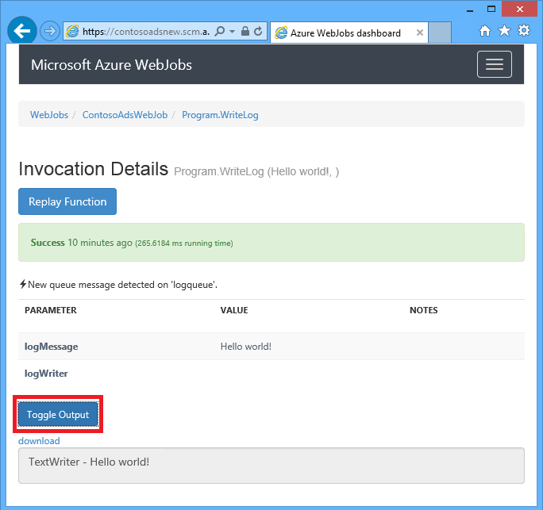

<properties 
    pageTitle="Verwenden von Azure Warteschlangenspeicher mit der WebJobs SDK" 
    description="Erfahren Sie, wie Azure Warteschlangenspeicher mit dem WebJobs SDK verwenden. Erstellen und Löschen von Warteschlangen; Einfügen, einsehen, abrufen und Löschen von Nachrichten in Warteschlange und vieles mehr." 
    services="app-service\web, storage" 
    documentationCenter=".net" 
    authors="tdykstra" 
    manager="wpickett" 
    editor="jimbe"/>

<tags 
    ms.service="app-service-web" 
    ms.workload="web" 
    ms.tgt_pltfrm="na" 
    ms.devlang="dotnet" 
    ms.topic="article" 
    ms.date="06/01/2016" 
    ms.author="tdykstra"/>

# <a name="how-to-use-azure-queue-storage-with-the-webjobs-sdk"></a>Verwenden von Azure Warteschlangenspeicher mit der WebJobs SDK

## <a name="overview"></a>(Übersicht)

Dieses Handbuch bietet C#-Codebeispielen, die veranschaulichen, wie die Azure WebJobs SDK-Version 1.x mit der Speicherdienst Azure Warteschlange.

Das Handbuch wird davon ausgegangen, Sie wissen, [wie ein WebJob-Projekt in Visual Studio mit Verbindungszeichenfolgen erstellen, die mit Ihrem Speicherkonto zeigen,](websites-dotnet-webjobs-sdk-get-started.md#configure-storage) oder [mehrere Speicherkonten](https://github.com/Azure/azure-webjobs-sdk/blob/master/test/Microsoft.Azure.WebJobs.Host.EndToEndTests/MultipleStorageAccountsEndToEndTests.cs).

Die meisten der Codeausschnitte zeigen nur Funktionen, die nicht den Code, erstellt der `JobHost` Objekt wie im folgenden Beispiel:

        static void Main(string[] args)
        {
            JobHost host = new JobHost();
            host.RunAndBlock();
        }
        
Das Handbuch enthält die folgenden Themen:

-   [Wie Sie eine Funktion auslösen, wenn eine Nachricht Warteschlange empfangen wird](#trigger)
    - Zeichenfolge Warteschlangennachrichten
    - POCO Warteschlangennachrichten
    - Asynchrone Funktionen
    - Typen funktioniert das Attribut QueueTrigger mit
    - Umfragen Algorithmus
    - Mehrere Instanzen
    - Parallele Ausführung
    - Abrufen von Warteschlange oder Warteschlange Nachrichtenmetadaten
    - Sicheres war(en)
-   [So erstellen Sie eine Nachricht Warteschlange beim Verarbeiten einer Nachricht Warteschlange](#createqueue)
    - Zeichenfolge Warteschlangennachrichten
    - POCO Warteschlangennachrichten
    - Erstellen mehrerer Nachrichten oder asynchronen Funktionen
    - Typen funktioniert das Attribut Warteschlange mit
    - Verwenden Sie WebJobs SDK Attribute in den Textkörper einer Funktion
-   [Zum Lesen und Schreiben von Blobs beim Verarbeiten einer Nachricht Warteschlange](#blobs)
    - Zeichenfolge Warteschlangennachrichten
    - POCO Warteschlangennachrichten
    - Typen funktioniert das Blob-Attribut mit
-   [Beschädigte Nachrichten behandelt](#poison)
    - Automatische beschädigte Nachrichtenbehandlung
    - Manuelle beschädigte Nachrichtenbehandlung
-   [Zum Festlegen von Optionen](#config)
    - Festlegen von SDK Verbindungszeichenfolgen in code
    - Konfigurieren von Einstellungen zur QueueTrigger
    - Festlegen der Werte für WebJobs SDK Parameter in code
-   [Wie Sie eine Funktion manuell auslösen](#manual)
-   [So schreiben Sie Protokolle](#logs) 
-   [Informationen zum Behandeln von Fehlern und konfigurieren Zeitlimit](#errors)
-   [Nächste Schritte](#nextsteps)

## <a name="a-idtriggera-how-to-trigger-a-function-when-a-queue-message-is-received"></a><a id="trigger"></a>Wie eine Funktion ausgelöst, wenn eine Warteschlange-Nachricht empfangen wird

Um eine Funktion zu schreiben, die das WebJobs SDK Anrufe, wenn eine Nachricht Warteschlange eingeht, verwenden Sie die `QueueTrigger` Attribut. Der Attributkonstruktor hat einen Parameter, der angibt, den Namen der Warteschlange abgefragt werden soll. Sie können auch [den Namen der Warteschlange dynamisch festlegen](#config).

### <a name="string-queue-messages"></a>Zeichenfolge Warteschlangennachrichten

Im folgenden Beispiel enthält die Warteschlange eine Zeichenfolgennachricht also `QueueTrigger` wird angewendet, um einen Parameter mit dem Namen `logMessage` , das den Inhalt der Nachricht Warteschlange enthält. Die Funktion, [schreibt eine Protokoll Meldung zum Dashboard](#logs)ist.
 

        public static void ProcessQueueMessage([QueueTrigger("logqueue")] string logMessage, TextWriter logger)
        {
            logger.WriteLine(logMessage);
        }

Außer `string`, der Parameter möglicherweise ein Byte-Array einer `CloudQueueMessage` Objekt oder eine POCO, die Sie definieren.

### <a name="poco-plain-old-clr-objecthttpenwikipediaorgwikiplainoldclrobject-queue-messages"></a>POCO [(schlicht alten CLR-Objekt](http://en.wikipedia.org/wiki/Plain_Old_CLR_Object)) in die Warteschlange Nachrichten

Im folgenden Beispiel enthält die Nachricht Warteschlange JSON für eine `BlobInformation` Objekt, wozu auch eine `BlobName` Eigenschaft. Das SDK deserialisiert automatisch das Objekt aus.

        public static void WriteLogPOCO([QueueTrigger("logqueue")] BlobInformation blobInfo, TextWriter logger)
        {
            logger.WriteLine("Queue message refers to blob: " + blobInfo.BlobName);
        }

Das SDK verwendet das [Newtonsoft.Json NuGet-Paket](http://www.nuget.org/packages/Newtonsoft.Json) serialisiert und deserialisiert Nachrichten an. Wenn Sie Nachrichten in Warteschlange in einem Programm, in denen das WebJobs SDK verwendet wird nicht erstellen, können Sie Schreiben von Code wie im folgenden Beispiel eine POCO Warteschlange-Nachricht zu erstellen, die das SDK analysiert werden kann. 

        BlobInformation blobInfo = new BlobInformation() { BlobName = "log.txt" };
        var queueMessage = new CloudQueueMessage(JsonConvert.SerializeObject(blobInfo));
        logQueue.AddMessage(queueMessage);

### <a name="async-functions"></a>Asynchrone Funktionen

Die folgenden asynchronen Funktion [schreibt ein Protokoll zum Dashboard](#logs).

        public async static Task ProcessQueueMessageAsync([QueueTrigger("logqueue")] string logMessage, TextWriter logger)
        {
            await logger.WriteLineAsync(logMessage);
        }

Asynchrone Funktionen können ein [Abbruchtoken](http://www.asp.net/mvc/overview/performance/using-asynchronous-methods-in-aspnet-mvc-4#CancelToken), dauern, wie im folgenden Beispiel dargestellt, die einen Blob kopiert. (Weitere Informationen zu den `queueTrigger` Platzhalter, finden Sie im Abschnitt [Blobs](#blobs) .)

        public async static Task ProcessQueueMessageAsyncCancellationToken(
            [QueueTrigger("blobcopyqueue")] string blobName, 
            [Blob("textblobs/{queueTrigger}",FileAccess.Read)] Stream blobInput,
            [Blob("textblobs/{queueTrigger}-new",FileAccess.Write)] Stream blobOutput,
            CancellationToken token)
        {
            await blobInput.CopyToAsync(blobOutput, 4096, token);
        }

### <a name="a-idqtattributetypesa-types-the-queuetrigger-attribute-works-with"></a><a id="qtattributetypes"></a>Typen funktioniert das Attribut QueueTrigger mit

Sie können `QueueTrigger` mit den folgenden Arten:

* `string`
* Eine als JSON serialisiert POCO-Datentyp
* `byte[]`
* `CloudQueueMessage`

### <a name="a-idpollinga-polling-algorithm"></a><a id="polling"></a>Umfragen Algorithmus

Das SDK implementiert einen zufälligen exponentiellen Back-off Algorithmus zum Verringern des Effekts im Leerlauf Warteschlange auf Kosten für Speicher Transaktion abrufen.  Wenn eine Nachricht nicht gefunden wird, wird das SDK wartet zwei Sekunden und sucht anschließend nach einer anderen Nachricht; Wenn keine Meldung gefunden wird, wartet er ungefähr vier Sekunden vor dem erneuten Versuch. Nach nachfolgende Versuche eine Warteschlange-Nachricht erhalten wird die Wartezeit weiterhin erhöhen, bis die maximale Wartezeit, das in eine Minute um übernommen erreicht. [Die maximale Wartezeit kann konfiguriert werden](#config).

### <a name="a-idinstancesa-multiple-instances"></a><a id="instances"></a>Mehrere Instanzen

Wenn für mehrere Instanzen Web app ausgeführt wird, ein fortlaufender WebJob, die auf jedem Computer ausgeführt wird und jedem Computer warten auf Trigger und versucht, die Funktionen ausführen. Der Trigger WebJobs SDK Warteschlange wird verhindert, dass automatisch eine Funktion Verarbeiten einer Warteschlange-Nachricht mehrmals; Funktionen haben keinen Idempotent sein geschrieben werden können. Jedoch, wenn Sie möchten sicherstellen, dass nur eine Instanz eine Funktion ausgeführt wird, auch wenn mehrere Instanzen des Web app Host vorhanden sind, können Sie die `Singleton` Attribut. 

### <a name="a-idparallela-parallel-execution"></a><a id="parallel"></a>Parallele Ausführung

Wenn Sie mehrere Funktionen, die unterschiedliche Warteschlange abhören verfügen, ruft das SDK sie parallel Wenn Nachrichten gleichzeitig empfangen werden. 

Dasselbe gilt, wenn mehrere Nachrichten für eine einzelne Warteschlange empfangen werden. Standardmäßig wird das SDK erhält eine Reihe von 16 Warteschlangennachrichten nacheinander und führt die Funktion, die sie parallel verarbeitet. [Lässt sich die Stapelgröße](#config). Wenn die Zahl verarbeiteten Hälfte der Stapelgröße erreicht ab, wird das SDK Ruft einen anderen Blattnamen und startet die Verarbeitung von Nachrichten. Daher ist die maximale Anzahl der pro Funktion verarbeiteten Nachrichten gleichzeitig eine und eine Hälfte Mal Stapel so groß. Dieser Grenzwert gilt separat für jede Funktion mit einem `QueueTrigger` Attribut. 

Wenn Sie keine parallele Ausführung für Nachrichten, die auf eine Warteschlange empfangen möchten, können Sie die Stapelgröße 1 festlegen. Siehe auch **mehr Kontrolle über Warteschlange Verarbeitung** in [Azure WebJobs SDK 1.1.0 RTM](/blog/azure-webjobs-sdk-1-1-0-rtm/).

### <a name="a-idqueuemetadataaget-queue-or-queue-message-metadata"></a><a id="queuemetadata"></a>Abrufen von Warteschlange oder Warteschlange Nachrichtenmetadaten

Sie können die folgenden Nachrichteneigenschaften erhalten, durch Hinzufügen von Parametern zu der Signatur der Methode:

* `DateTimeOffset`expirationTime
* `DateTimeOffset`insertionTime
* `DateTimeOffset`nextVisibleTime
* `string`QueueTrigger (Nachrichtentext enthält)
* `string`ID
* `string`popReceipt
* `int`dequeueCount

Wenn Sie direkt mit den Azure-Speicher-API arbeiten möchten, können Sie auch Hinzufügen einer `CloudStorageAccount` Parameter.

Im folgende Beispiel schreibt all dieser Metadaten in einem Informationen Anwendungsprotokoll. Im Beispiel enthalten sowohl LogMessage und QueueTrigger den Inhalt der Nachricht in der Warteschlange einfügen.

        public static void WriteLog([QueueTrigger("logqueue")] string logMessage,
            DateTimeOffset expirationTime,
            DateTimeOffset insertionTime,
            DateTimeOffset nextVisibleTime,
            string id,
            string popReceipt,
            int dequeueCount,
            string queueTrigger,
            CloudStorageAccount cloudStorageAccount,
            TextWriter logger)
        {
            logger.WriteLine(
                "logMessage={0}\n" +
            "expirationTime={1}\ninsertionTime={2}\n" +
                "nextVisibleTime={3}\n" +
                "id={4}\npopReceipt={5}\ndequeueCount={6}\n" +
                "queue endpoint={7} queueTrigger={8}",
                logMessage, expirationTime,
                insertionTime,
                nextVisibleTime, id,
                popReceipt, dequeueCount,
                cloudStorageAccount.QueueEndpoint,
                queueTrigger);
        }

Hier ist ein Beispiel für Protokoll von der Stichprobe Code geschrieben:

        logMessage=Hello world!
        expirationTime=10/14/2014 10:31:04 PM +00:00
        insertionTime=10/7/2014 10:31:04 PM +00:00
        nextVisibleTime=10/7/2014 10:41:23 PM +00:00
        id=262e49cd-26d3-4303-ae88-33baf8796d91
        popReceipt=AgAAAAMAAAAAAAAAfc9H0n/izwE=
        dequeueCount=1
        queue endpoint=https://contosoads.queue.core.windows.net/
        queueTrigger=Hello world!

### <a name="a-idgracefulagraceful-shutdown"></a><a id="graceful"></a>Sicheres war(en)

Eine Funktion, die in einem zusammenhängenden WebJob ausgeführt wird, kann annehmen einer `CancellationToken` Parameter, wodurch das Betriebssystem, um die Funktion zu benachrichtigen, wenn die WebJob gerade beendet werden soll. Sie können diese Benachrichtigung verwenden, um sicherzustellen, dass die Funktion unerwartete Beenden auf eine Weise nicht, die Daten in einem inkonsistenten Zustand belässt.

Im folgenden Beispiel wird gezeigt, wie bevorstehende WebJob Beendigung in einer Funktion überprüfen.

    public static void GracefulShutdownDemo(
                [QueueTrigger("inputqueue")] string inputText,
                TextWriter logger,
                CancellationToken token)
    {
        for (int i = 0; i < 100; i++)
        {
            if (token.IsCancellationRequested)
            {
                logger.WriteLine("Function was cancelled at iteration {0}", i);
                break;
            }
            Thread.Sleep(1000);
            logger.WriteLine("Normal processing for queue message={0}", inputText);
        }
    }

**Hinweis:** Das Dashboard möglicherweise nicht ordnungsgemäß angezeigt werden, den Status und die Ausgabe der Funktionen, die beendet wurden.
 
Weitere Informationen finden Sie unter [WebJobs ordnungsgemäß war(en)](http://blog.amitapple.com/post/2014/05/webjobs-graceful-shutdown/#.VCt1GXl0wpR).   

## <a name="a-idcreatequeuea-how-to-create-a-queue-message-while-processing-a-queue-message"></a><a id="createqueue"></a>So erstellen Sie eine Nachricht Warteschlange beim Verarbeiten einer Nachricht Warteschlange

Um eine Funktion zu schreiben, die eine neue Warteschlange-Nachricht erstellt wird, verwenden Sie die `Queue` Attribut. Wie `QueueTrigger`, Sie den Namen der Warteschlange als Zeichenfolge übergeben, oder Sie können [den Namen der Warteschlange dynamisch festlegen](#config).

### <a name="string-queue-messages"></a>Zeichenfolge Warteschlangennachrichten

Im folgenden Beispiel nicht asynchrone erstellt eine neue Warteschlange-Nachricht in der Warteschlange mit dem Namen "Outputqueue" mit denselben Inhalt wie der Warteschlange Nachricht in der Warteschlange mit dem Namen "Inputqueue". (Für asynchrone Funktionen verwenden `IAsyncCollector<T>` wie weiter unten in diesem Abschnitt dargestellt.)


        public static void CreateQueueMessage(
            [QueueTrigger("inputqueue")] string queueMessage,
            [Queue("outputqueue")] out string outputQueueMessage )
        {
            outputQueueMessage = queueMessage;
        }
  
### <a name="poco-plain-old-clr-objecthttpenwikipediaorgwikiplainoldclrobject-queue-messages"></a>POCO [(schlicht alten CLR-Objekt](http://en.wikipedia.org/wiki/Plain_Old_CLR_Object)) in die Warteschlange Nachrichten

Übergeben, um eine Nachricht Warteschlange erstellen, die eine POCO anstelle einer Zeichenfolge enthält den Typ POCO als Output-Parameter auf die `Queue` Attributkonstruktor.
 
        public static void CreateQueueMessage(
            [QueueTrigger("inputqueue")] BlobInformation blobInfoInput,
            [Queue("outputqueue")] out BlobInformation blobInfoOutput )
        {
            blobInfoOutput = blobInfoInput;
        }

Das SDK wird automatisch das Objekt, das JSON serialisiert. Eine Warteschlange Nachricht wird immer erstellt, auch wenn das Objekt null ist.

### <a name="create-multiple-messages-or-in-async-functions"></a>Erstellen mehrerer Nachrichten oder asynchronen Funktionen

Um mehrere Nachrichten zu erstellen, nehmen Sie den Parametertyp für die Ausgabewarteschlange `ICollector<T>` oder `IAsyncCollector<T>`, wie im folgenden Beispiel gezeigt.

        public static void CreateQueueMessages(
            [QueueTrigger("inputqueue")] string queueMessage,
            [Queue("outputqueue")] ICollector<string> outputQueueMessage,
            TextWriter logger)
        {
            logger.WriteLine("Creating 2 messages in outputqueue");
            outputQueueMessage.Add(queueMessage + "1");
            outputQueueMessage.Add(queueMessage + "2");
        }

Jede Nachricht Warteschlange sofort erstellt wird bei der `Add` wird aufgerufen.

### <a name="types-that-the-queue-attribute-works-with"></a>Dateitypen, mit denen das Attribut Warteschlange zusammenarbeitet

Sie können die `Queue` Attribut für die folgenden Arten von Parameter:

* `out string`(erstellt Warteschlange Nachricht übergebener Wert ungleich Null ist, nach Beendigung der Funktion)
* `out byte[]`(funktioniert wie `string`) 
* `out CloudQueueMessage`(funktioniert wie `string`) 
* `out POCO`(ein serialisierbarer Typ, erstellt eine Nachricht mit einem null-Objekt, wenn der Parameter null ist, nach Beendigung der Funktion)
* `ICollector`
* `IAsyncCollector`
* `CloudQueue`(zum manuellen Erstellen von Nachrichten mithilfe der Azure-Speicher-API direkt)

### <a name="a-idibinderause-webjobs-sdk-attributes-in-the-body-of-a-function"></a><a id="ibinder"></a>Verwenden Sie WebJobs SDK Attribute in den Textkörper einer Funktion

Wenn Sie einige Arbeit in der Funktion, bevor Sie mit einer WebJobs SDK Attribut müssen `Queue`, `Blob`, oder `Table`, können Sie die `IBinder` Schnittstelle.

Im folgende Beispiel eine Nachricht Eingabewerte Warteschlange akzeptiert und erstellt eine neue Nachricht mit denselben Inhalt in einer Ausgabewarteschlange. Der Name der Warteschlange wird vom Code in den Textkörper der Funktion festgelegt.

        public static void CreateQueueMessage(
            [QueueTrigger("inputqueue")] string queueMessage,
            IBinder binder)
        {
            string outputQueueName = "outputqueue" + DateTime.Now.Month.ToString();
            QueueAttribute queueAttribute = new QueueAttribute(outputQueueName);
            CloudQueue outputQueue = binder.Bind<CloudQueue>(queueAttribute);
            outputQueue.AddMessage(new CloudQueueMessage(queueMessage));
        }

Die `IBinder` Benutzeroberfläche kann auch verwendet werden, mit der `Table` und `Blob` Attribute.

## <a name="a-idblobsa-how-to-read-and-write-blobs-and-tables-while-processing-a-queue-message"></a><a id="blobs"></a>Zum Lesen und schreiben beim Verarbeiten einer Nachricht Warteschlange Blobs und Tabellen

Die `Blob` und `Table` -Attribute können Sie zum Lesen und Schreiben von Blobs und Tabellen. In den Beispielen in diesem Abschnitt beziehen sich auf Blobs. Zum Codebeispielen, die zeigen, wie Prozesse ausgelöst, wenn Blobs erstellt oder aktualisiert werden, finden Sie unter [Verwenden von Azure Blob-Speicher mit dem SDK WebJobs](websites-dotnet-webjobs-sdk-storage-blobs-how-to.md)und Codebeispielen, die lesen und Schreiben von Tabellen, finden Sie unter [So Azure Table Storage mit dem WebJobs SDK verwenden](websites-dotnet-webjobs-sdk-storage-tables-how-to.md).

### <a name="string-queue-messages-triggering-blob-operations"></a>Zeichenfolge Warteschlangennachrichten auslösen Blob-Vorgänge

Für eine Warteschlange-Nachricht, die als Zeichenfolge enthält `queueTrigger` ist ein Platzhalter Sie in können der `Blob` Attribut des `blobPath` Parameter, die den Inhalt der Nachricht enthält. 

Im folgenden Beispiel wird `Stream` Objekte zum Lesen und Schreiben von Blobs. Die Nachricht Warteschlange wird Name eines Blob befindet sich im Container Textblobs. Eine Kopie der Blob mit "-Neu" angefügt, um der Namen im selben Container erstellt wird. 

        public static void ProcessQueueMessage(
            [QueueTrigger("blobcopyqueue")] string blobName, 
            [Blob("textblobs/{queueTrigger}",FileAccess.Read)] Stream blobInput,
            [Blob("textblobs/{queueTrigger}-new",FileAccess.Write)] Stream blobOutput)
        {
            blobInput.CopyTo(blobOutput, 4096);
        }

Die `Blob` Attribut Konstruktor hat eine `blobPath` Parameter, die Container und Blob angibt. Weitere Informationen zu dieser Platzhalter finden Sie unter [Azure Blob-Speicher mit dem WebJobs SDK verwenden](websites-dotnet-webjobs-sdk-storage-blobs-how-to.md), 

Wenn das Attribut wird eine `Stream` Objekt, einer anderen Konstruktorparameter gibt an, die `FileAccess` Modus als lesen, schreiben oder schreibgeschützt. 

Im folgenden Beispiel wird eine `CloudBlockBlob` Objekt einen Blob löschen. Die Nachricht Warteschlange ist der Name des Blob.

        public static void DeleteBlob(
            [QueueTrigger("deleteblobqueue")] string blobName,
            [Blob("textblobs/{queueTrigger}")] CloudBlockBlob blobToDelete)
        {
            blobToDelete.Delete();
        }

### <a name="a-idpocoblobsa-poco-plain-old-clr-objecthttpenwikipediaorgwikiplainoldclrobject-queue-messages"></a><a id="pocoblobs"></a>POCO [(schlicht alten CLR-Objekt](http://en.wikipedia.org/wiki/Plain_Old_CLR_Object)) in die Warteschlange Nachrichten

Für eine POCO als JSON in der Warteschlange Nachricht gespeichert ist, können Platzhalter, die benennen Sie die Eigenschaften des Objekts in die `Queue` des Attribut `blobPath` Parameter. Sie können auch [Warteschlange Eigenschaft Metadatennamen](#queuemetadata) als Platzhalter verwenden. 

Im folgende Beispiel kopiert einen Blob in einer neuen Blob mit einer anderen Erweiterung. Die Nachricht Warteschlange ist eine `BlobInformation` Objekt, das umfasst `BlobName` und `BlobNameWithoutExtension` Eigenschaften. Die Eigenschaftennamen dienen als Platzhalter in den Blob-Pfad für die `Blob` Attribute. 
 
        public static void CopyBlobPOCO(
            [QueueTrigger("copyblobqueue")] BlobInformation blobInfo,
            [Blob("textblobs/{BlobName}", FileAccess.Read)] Stream blobInput,
            [Blob("textblobs/{BlobNameWithoutExtension}.txt", FileAccess.Write)] Stream blobOutput)
        {
            blobInput.CopyTo(blobOutput, 4096);
        }

Das SDK verwendet das [Newtonsoft.Json NuGet-Paket](http://www.nuget.org/packages/Newtonsoft.Json) serialisiert und deserialisiert Nachrichten an. Wenn Sie Nachrichten in Warteschlange in einem Programm, in denen das WebJobs SDK verwendet wird nicht erstellen, können Sie Schreiben von Code wie im folgenden Beispiel eine POCO Warteschlange-Nachricht zu erstellen, die das SDK analysiert werden kann.

        BlobInformation blobInfo = new BlobInformation() { BlobName = "boot.log", BlobNameWithoutExtension = "boot" };
        var queueMessage = new CloudQueueMessage(JsonConvert.SerializeObject(blobInfo));
        logQueue.AddMessage(queueMessage);

Wenn Sie einige Arbeit in der Funktion vor dem Binden eines BLOBs zu einem Objekt ausführen müssen, können Sie das Attribut im Textkörper der Funktion, [wie weiter oben für das Attribut Warteschlange dargestellt](#ibinder).

### <a name="a-idblobattributetypesa-types-you-can-use-the-blob-attribute-with"></a><a id="blobattributetypes"></a>Dateitypen, die, denen Sie mit das Blob-Attribut verwenden können
 
Die `Blob` Attribut kann mit den folgenden Arten verwendet werden:

* `Stream`(Lesen Sie oder Schreiben Sie mithilfe des Konstruktorparameters FileAccess angegeben)
* `TextReader`
* `TextWriter`
* `string`(schreibgeschützt)
* `out string`(Schreiben; einen Blob erstellt, nur, wenn der Parameter nicht Null ist, gibt die Funktion)
* POCO (schreibgeschützt)
* Auschecken POCO (Schreiben; immer einen Blob erstellt, als null-Objekt wird erstellt, wenn POCO Parameter null ist, gibt die Funktion)
* `CloudBlobStream`(Schreiben)
* `ICloudBlob`(Lese- oder Schreibzugriff)
* `CloudBlockBlob`(Lese- oder Schreibzugriff) 
* `CloudPageBlob`(Lese- oder Schreibzugriff) 

## <a name="a-idpoisona-how-to-handle-poison-messages"></a><a id="poison"></a>Beschädigte Nachrichten behandelt

Nachrichten, deren Inhalt bewirkt, eine Funktion zum Fehlschlagen dass, sind *beschädigte Nachrichten*bezeichnet. Wenn die Funktion fehlschlägt, wird die Warteschlange-Nachricht wird nicht gelöscht und schließlich wird übernommen erneut bewirken, dass des Zyklus wiederholt werden soll. Das SDK kann automatisch den Zyklus nach eine eingeschränkte Anzahl von Iterationen unterbrechen oder manuell vornehmen.

### <a name="automatic-poison-message-handling"></a>Automatische beschädigte Nachrichtenbehandlung

Das SDK Ruft eine Funktion bis zu 5 Mal eine Nachricht Warteschlange Verarbeitungszeit. Wenn die fünfte testen fehlschlägt, wird die Nachricht an eine beschädigte Warteschlange verschoben. [Lässt sich die maximale Anzahl der Wiederholungsversuche](#config). 

Die beschädigte Warteschlange heißt *{Originalqueuename}*-beschädigte. Sie können schreiben, dass eine Funktion zum Verarbeiten von Nachrichten aus der beschädigte Warteschlange durch diese Protokollierung oder Senden einer Benachrichtigung die manuelle Aufmerksamkeit erforderlich ist. 

Im folgenden Beispiel wird die `CopyBlob` Funktion schlägt fehl, wenn eine Warteschlange-Nachricht den Namen eines Blob enthält, die nicht vorhanden ist. In diesem Fall wird die Nachricht aus der Warteschlange Copyblobqueue in der Warteschlange Copyblobqueue-Poison verschoben. Die `ProcessPoisonMessage` anschließend die beschädigte Nachricht protokolliert.

        public static void CopyBlob(
            [QueueTrigger("copyblobqueue")] string blobName,
            [Blob("textblobs/{queueTrigger}", FileAccess.Read)] Stream blobInput,
            [Blob("textblobs/{queueTrigger}-new", FileAccess.Write)] Stream blobOutput)
        {
            blobInput.CopyTo(blobOutput, 4096);
        }
        
        public static void ProcessPoisonMessage(
            [QueueTrigger("copyblobqueue-poison")] string blobName, TextWriter logger)
        {
            logger.WriteLine("Failed to copy blob, name=" + blobName);
        }

Die folgende Abbildung zeigt die Ausgabe in der Konsole aus dieser Funktionen, wenn eine beschädigte Nachricht verarbeitet wird.


### <a name="manual-poison-message-handling"></a>Manuelle beschädigte Nachrichtenbehandlung

Gelangen Sie oft eine Nachricht übernommenen für die Verarbeitung durch Hinzufügen einer `int` Parameter mit dem Namen `dequeueCount` zu Ihrer Funktion. Dann können Sie die Anzahl der zum Abrufen aus Funktion Code überprüfen und Ausführen Ihrer eigenen beschädigte Nachrichtenbehandlung, wenn die Zahl einen Schwellenwert überschreitet wie im folgenden Beispiel dargestellt.

        public static void CopyBlob(
            [QueueTrigger("copyblobqueue")] string blobName, int dequeueCount,
            [Blob("textblobs/{queueTrigger}", FileAccess.Read)] Stream blobInput,
            [Blob("textblobs/{queueTrigger}-new", FileAccess.Write)] Stream blobOutput,
            TextWriter logger)
        {
            if (dequeueCount > 3)
            {
                logger.WriteLine("Failed to copy blob, name=" + blobName);
            }
            else
            {
            blobInput.CopyTo(blobOutput, 4096);
            }
        }

## <a name="a-idconfiga-how-to-set-configuration-options"></a><a id="config"></a>Zum Festlegen von Optionen

Sie können die `JobHostConfiguration` ein zur folgende Konfigurationsoptionen festlegen:

* Legen Sie die SDK Verbindungszeichenfolgen in Code ein.
* Konfigurieren von `QueueTrigger` Einstellungen wie Maximum Nachrichten zählen.
* Abrufen von Warteschlangennamen aus der Konfiguration.

### <a name="a-idsetconnstraset-sdk-connection-strings-in-code"></a><a id="setconnstr"></a>Festlegen von SDK Verbindungszeichenfolgen in code

Festlegen der SDK Verbindungszeichenfolgen in Code können Sie eigene Zeichenfolge Verbindungsnamen in Konfigurationsdateien oder Umgebungsvariablen verwenden, wie im folgenden Beispiel dargestellt.

        static void Main(string[] args)
        {
            var _storageConn = ConfigurationManager
                .ConnectionStrings["MyStorageConnection"].ConnectionString;
        
            var _dashboardConn = ConfigurationManager
                .ConnectionStrings["MyDashboardConnection"].ConnectionString;
        
            var _serviceBusConn = ConfigurationManager
                .ConnectionStrings["MyServiceBusConnection"].ConnectionString;
        
            JobHostConfiguration config = new JobHostConfiguration();
            config.StorageConnectionString = _storageConn;
            config.DashboardConnectionString = _dashboardConn;
            config.ServiceBusConnectionString = _serviceBusConn;
            JobHost host = new JobHost(config);
            host.RunAndBlock();
        }

### <a name="a-idconfigqueueaconfigure-queuetrigger--settings"></a><a id="configqueue"></a>Konfigurieren von Einstellungen zur QueueTrigger

Sie können die folgenden Einstellungen konfigurieren, die für die Verarbeitung von Nachrichten Warteschlange zutreffen:

- Die maximale Anzahl von Nachrichten in Warteschlange, die gleichzeitig aufgenommen werden, parallel ausgeführt werden soll (der Standardwert liegt 16).
- Die maximale Anzahl der Wiederholungsversuche vor dem Senden einer Nachricht Warteschlange an eine beschädigte Warteschlange (Standard ist 5).
- Die maximale Wartezeit erneut abrufen, wenn eine Warteschlange leer ist (Standardwert ist 1 Minute).

Im folgenden Beispiel wird gezeigt, wie diese Einstellungen konfigurieren:

        static void Main(string[] args)
        {
            JobHostConfiguration config = new JobHostConfiguration();
            config.Queues.BatchSize = 8;
            config.Queues.MaxDequeueCount = 4;
            config.Queues.MaxPollingInterval = TimeSpan.FromSeconds(15);
            JobHost host = new JobHost(config);
            host.RunAndBlock();
        }

### <a name="a-idsetnamesincodeaset-values-for-webjobs-sdk-constructor-parameters-in-code"></a><a id="setnamesincode"></a>Festlegen der Werte für WebJobs SDK Parameter in code

Manchmal möchten Sie einen Warteschlangennamen, einen Blob-Namen oder Container angeben, oder eine Tabelle in Code statt programmiert benennen sie. Angenommen, Sie möchten möglicherweise Geben Sie den Warteschlangennamen für `QueueTrigger` in eine Datei oder -Umgebung, die mit der Konfiguration. 

Haben Sie Möglichkeiten, die durch die Übergabe einer `NameResolver` Objekt in der `JobHostConfiguration` Typ. Sie umfassen spezielle Platzhalter, der von Prozentzeichen (%) WebJobs SDK Parameter, in und Ihre `NameResolver` Code gibt an, der tatsächlichen Werte anstelle diese Platzhalter verwendet werden.

Nehmen Sie beispielsweise an, dass Sie eine Warteschlange mit dem Namen Logqueuetest in der testumgebung und einer benannten Logqueueprod Herstellung verwenden möchten. Statt einen codierten Warteschlangennamen soll den Namen eines Eintrags in der `appSettings` Websitesammlung, die den Namen der tatsächlichen Warteschlange müssten. Wenn die `appSettings` Schlüssel ist Logqueue, könnte die Funktion wie im folgenden Beispiel aussehen.

        public static void WriteLog([QueueTrigger("%logqueue%")] string logMessage)
        {
            Console.WriteLine(logMessage);
        }

Ihre `NameResolver` Klasse konnte klicken Sie dann den Namen aus der Warteschlange abrufen `appSettings` wie im folgenden Beispiel gezeigt:

        public class QueueNameResolver : INameResolver
        {
            public string Resolve(string name)
            {
                return ConfigurationManager.AppSettings[name].ToString();
            }
        }

Sie übergeben die `NameResolver` Klasse ein, um die `JobHost` -Objekts wie im folgenden Beispiel gezeigt.

        static void Main(string[] args)
        {
            JobHostConfiguration config = new JobHostConfiguration();
            config.NameResolver = new QueueNameResolver();
            JobHost host = new JobHost(config);
            host.RunAndBlock();
        }
 
**Hinweis:** Warteschlange, Tabelle und Blob-Namen werden jedes Mal eine Funktion aufgerufen wird, jedoch nur, wenn die Anwendung gestartet wird, werden Blob Containernamen aufgelöst aufgelöst. Sie können Blob Containername nicht ändern, während der Auftrag ausgeführt wird. 

## <a name="a-idmanualahow-to-trigger-a-function-manually"></a><a id="manual"></a>Wie Sie eine Funktion manuell auslösen

Um eine Funktion manuell ausgelöst wird, verwenden Sie die `Call` oder `CallAsync` Methode auf die `JobHost` Objekt und die `NoAutomaticTrigger` Attribut für die Funktion, wie im folgenden Beispiel dargestellt. 

        public class Program
        {
            static void Main(string[] args)
            {
                JobHost host = new JobHost();
                host.Call(typeof(Program).GetMethod("CreateQueueMessage"), new { value = "Hello world!" });
            }
        
            [NoAutomaticTrigger]
            public static void CreateQueueMessage(
                TextWriter logger, 
                string value, 
                [Queue("outputqueue")] out string message)
            {
                message = value;
                logger.WriteLine("Creating queue message: ", message);
            }
        }

## <a name="a-idlogsahow-to-write-logs"></a><a id="logs"></a>So schreiben Sie Protokolle

Das Dashboard zeigt Protokolle an zwei Orten aufsuchen: der Seite für die WebJob sowie die Seite für einen bestimmten WebJob aufrufen. 




Ausgabe Console-Methoden, die Sie in einer Funktion aufrufen oder in, der `Main()` Methode wird angezeigt, in der Dashboard-Seite für die WebJob, nicht auf der Seite für eine bestimmte Methode aufrufen. Ausgabe aus dem TextWriter-Objekt, das Sie von einem Parameter in Ihrer Methodensignatur abrufen wird im Dashboard-Seite für eine Methode aufrufen.

Ausgabe in der Konsole kann nicht auf eine bestimmte Methode aufrufen verknüpft werden, da die Konsole Single threaded ist, während viele Funktionen zur gleichen Zeit ausgeführt werden können. Warum ist das SDK bietet jede Funktion aufrufen mit einem eigenen eindeutigen Log Autor Objekt.

Verwenden, um [Anwendung Tracing Protokolle](web-sites-dotnet-troubleshoot-visual-studio.md#logsoverview)schreiben `Console.Out` (Protokolle markiert Informationen erstellt) und `Console.Error` (erstellt Protokolle als Fehler markiert). Eine Alternative ist [Spur oder TraceSource](http://blogs.msdn.com/b/mcsuksoldev/archive/2014/09/04/adding-trace-to-azure-web-sites-and-web-jobs.aspx), verwenden Sie die ausführlich, Warnung und kritisch Ebenen sowie Informationen zu Vorgehensweisen und Fehler bereitstellt. Anwendung Tracing Protokolle angezeigt werden, in den Web app-Protokolldateien, Azure Tabellen oder Azure-blobs je nachdem, wie Sie Ihre Azure Web app konfigurieren. Der gesamte Console Ausgabe true festgelegt ist, werden die letzten 100 Anwendungsprotokolle auch in der Dashboard-Seite für die WebJob, nicht auf der Seite für eine Funktion aufrufen angezeigt. 

Ausgabe in der Konsole angezeigt wird, in dem Dashboard nur, wenn das Programm in eine WebJob Azure ausgeführt wird, nicht, wenn das Programm lokal ausgeführt wird oder in einer anderen Umgebung.

Dashboard-Protokollierung für hohen Durchsatz Szenarien aktiviert werden. Standardmäßig das SDK schreibt Protokolle in Speicher, und diese Aktivität konnte die Leistung beeinträchtigen, wenn Sie viele Nachrichten verarbeitet werden. Um die Protokollierung zu deaktivieren, legen Sie die Verbindungszeichenfolge Dashboard auf null fest, wie im folgenden Beispiel dargestellt.

        JobHostConfiguration config = new JobHostConfiguration();       
        config.DashboardConnectionString = "";        
        JobHost host = new JobHost(config);
        host.RunAndBlock();

Das folgende Beispiel zeigt verschiedene Methoden zum Schreiben von Protokollen:

        public static void WriteLog(
            [QueueTrigger("logqueue")] string logMessage,
            TextWriter logger)
        {
            Console.WriteLine("Console.Write - " + logMessage);
            Console.Out.WriteLine("Console.Out - " + logMessage);
            Console.Error.WriteLine("Console.Error - " + logMessage);
            logger.WriteLine("TextWriter - " + logMessage);
        }

Im WebJobs SDK Dashboard, die Ausgabe der `TextWriter` Objekt das angezeigt wird, wenn Sie zu der Seite für eine bestimmte wechseln Funktion aufrufen, und klicken Sie auf **Den Schalter Ausgabe**:


Die letzten 100 Zeilen der Verwaltungskonsole ausgeben anzeigen im Dashboard SDK WebJobs nach oben, wenn Sie wechseln Sie zur Seite für die WebJob (nicht für die Funktion aufrufen), und klicken Sie auf **Den Schalter Ausgabe**.
 


In einer zusammenhängenden WebJob werden Anwendungsprotokolle in/Daten/Aufträge/fortlaufender /*{Webjobname}*/job_log.txt im Dateisystem Web app.

        [09/26/2014 21:01:13 > 491e54: INFO] Console.Write - Hello world!
        [09/26/2014 21:01:13 > 491e54: ERR ] Console.Error - Hello world!
        [09/26/2014 21:01:13 > 491e54: INFO] Console.Out - Hello world!

In einer Azure BLOB-Anwendung Protokolle aussehen wie folgt: 2014-09-26T21:01:13,Information,contosoadsnew,491e54,635473620738373502,0,17404,17,Console.Write - Hallo Welt!, 2014-09-26T21:01:13,Error,contosoadsnew,491e54,635473620738373502,0,17404,19,Console.Error - Hallo Welt!, 2014-09-26T21:01:13,Information,contosoadsnew,491e54,635473620738529920,0,17404,17,Console.Out - Hallo Welt!,

Und in einer Tabelle Azure die `Console.Out` und `Console.Error` Protokolle wie folgt aussehen:


Wenn Sie eine eigene Protokollierung anschließen möchten, finden Sie [in diesem Beispiel wird](http://github.com/Azure/azure-webjobs-sdk-samples/blob/master/BasicSamples/MiscOperations/Program.cs).

## <a name="a-iderrorsahow-to-handle-errors-and-configure-timeouts"></a><a id="errors"></a>Informationen zum Behandeln von Fehlern und konfigurieren Zeitlimit

Das WebJobs SDK enthält auch ein [Timeout](http://github.com/Azure/azure-webjobs-sdk-samples/blob/master/BasicSamples/MiscOperations/Functions.cs) Attribut, mit denen Sie dazu führen, dass eine Funktion Wenn abgebrochen werden, nicht in einem bestimmten Zeitraum abzuschließen. Und wenn eine Warnung auslösen, wenn zu viele Fehler in einem bestimmten Zeitraum stattfinden soll, können Sie mithilfe der `ErrorTrigger` Attribut. Hier ist ein [Beispiel für die ErrorTrigger](https://github.com/Azure/azure-webjobs-sdk-extensions/wiki/Error-Monitoring)ein.

```
public static void ErrorMonitor(
[ErrorTrigger("00:01:00", 1)] TraceFilter filter, TextWriter log,
[SendGrid(
    To = "admin@emailaddress.com",
    Subject = "Error!")]
 SendGridMessage message)
{
    // log last 5 detailed errors to the Dashboard
   log.WriteLine(filter.GetDetailedMessage(5));
   message.Text = filter.GetDetailedMessage(1);
}
```

Sie können auch dynamisch deaktivieren und Aktivieren von Funktionen zum Steuerelement, ob sie ausgelöst werden können mithilfe einer Konfiguration wechseln, die eine app-Einstellung oder Variablennamen Umgebung werden könnten. Beispiel-Code, finden Sie unter der `Disable` Attribut im [Repository Beispiele WebJobs SDK](https://github.com/Azure/azure-webjobs-sdk-samples/blob/master/BasicSamples/MiscOperations/Functions.cs).

## <a name="a-idnextstepsa-next-steps"></a><a id="nextsteps"></a>Nächste Schritte

In diesem Handbuch weist Codebeispielen bereitgestellt, die veranschaulichen, allgemeine Szenarien für das Arbeiten mit Azure Warteschlangen zu behandeln. Weitere Informationen zum Verwenden von Azure WebJobs und das WebJobs SDK finden Sie unter [Azure WebJobs empfohlen Ressourcen](http://go.microsoft.com/fwlink/?linkid=390226).
 
