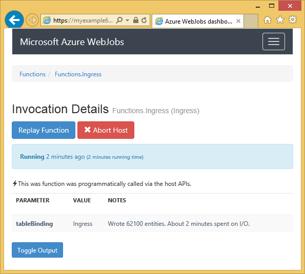

<properties 
    pageTitle="Verwenden von Azure Table Storage mit der WebJobs SDK" 
    description="Informationen Sie zur Verwendung von Azure Table Storage mit dem SDK WebJobs. Erstellen von Tabellen, Hinzufügen von Personen zu Tabellen und vorhandene Tabellen lesen." 
    services="app-service\web, storage" 
    documentationCenter=".net" 
    authors="tdykstra" 
    manager="wpickett" 
    editor="jimbe"/>

<tags 
    ms.service="app-service-web" 
    ms.workload="web" 
    ms.tgt_pltfrm="na" 
    ms.devlang="dotnet" 
    ms.topic="article" 
    ms.date="06/01/2016" 
    ms.author="tdykstra"/>

# Verwenden von Azure Table Storage mit der WebJobs SDK

## (Übersicht)

Dieses Handbuch bietet C#-Codebeispielen, die zeigen, wie Sie lesen und Schreiben von Azure-Speichertabellen mithilfe von [WebJobs SDK](websites-dotnet-webjobs-sdk.md) Version 1.x.

Das Handbuch wird davon ausgegangen, Sie wissen, [wie ein WebJob-Projekt in Visual Studio mit Verbindungszeichenfolgen erstellen, die mit Ihrem Speicherkonto zeigen,](websites-dotnet-webjobs-sdk-get-started.md) oder [mehrere Speicherkonten](https://github.com/Azure/azure-webjobs-sdk/blob/master/test/Microsoft.Azure.WebJobs.Host.EndToEndTests/MultipleStorageAccountsEndToEndTests.cs).
        
Einige der Code Codeausschnitte Anzeigen der `Table` Attribut in Funktionen, die [manuell aufgerufen](websites-dotnet-webjobs-sdk-storage-queues-how-to.md#manual), d. h., nicht mithilfe der Attribute Trigger sind, verwendet werden. 

## Zum Hinzufügen von Personen zu einer Tabelle

Wenn Personen zu einer Tabelle hinzufügen möchten, verwenden Sie die `Table` Attribut mit einer `ICollector<T>` oder `IAsyncCollector<T>` Parameter, in dem `T` gibt das Schema für die Personen, die Sie hinzufügen möchten. Der Attributkonstruktor hat einen Parameter, der mit dem Namen der Tabelle enthält. 

Im folgenden Beispiel fügt `Person` Elemente aus, um eine Tabelle mit dem Namen *eingehende*.

        [NoAutomaticTrigger]
        public static void IngressDemo(
            [Table("Ingress")] ICollector<Person> tableBinding)
        {
            for (int i = 0; i < 100000; i++)
            {
                tableBinding.Add(
                    new Person() { 
                        PartitionKey = "Test", 
                        RowKey = i.ToString(), 
                        Name = "Name" }
                    );
            }
        }

In der Regel den Typ Sie mit verwenden `ICollector` abgeleitet `TableEntity` oder implementiert `ITableEntity`, aber nicht müssen. Eine der folgenden Aktionen `Person` Arbeit durch den Code im vorangehenden Klassen `Ingress` Methode.

        public class Person : TableEntity
        {
            public string Name { get; set; }
        }

        public class Person
        {
            public string PartitionKey { get; set; }
            public string RowKey { get; set; }
            public string Name { get; set; }
        }

Wenn Sie direkt mit den Azure-Speicher-API arbeiten möchten, können Sie Hinzufügen eines `CloudStorageAccount` Parameter der Signatur der Methode.

## Überwachung in Echtzeit

Da Daten eingehende Funktionen häufig große Datenmengen verarbeiten, enthält das WebJobs SDK Dashboard Überwachung Echtzeitdaten aus. Im **Aufrufen Log** -Abschnitt erfahren Sie, ob die Funktion noch ausgeführt wird.

Die Seite **Details aufrufen** Berichte der Funktion Fortschritt (Anzahl von Elementen, die geschrieben) während er ausgeführt wird, und Ihnen eine Verkaufschance gibt, um ihn abzubrechen. 

Klicken Sie nach Abschluss die Funktion Berichte die Seite **Details aufrufen** die Anzahl der Zeilen geschrieben.

## Zum Lesen von mehreren Personen aus einer Tabelle

Um eine Tabelle zu lesen, verwenden Sie die `Table` Attribut mit einer `IQueryable<T>` Parameter, geben Sie ein `T` abgeleitet `TableEntity` oder implementiert `ITableEntity`.

Im folgenden Beispiel liest und meldet alle Zeilen aus der `Ingress` Tabelle:
 
        public static void ReadTable(
            [Table("Ingress")] IQueryable<Person> tableBinding,
            TextWriter logger)
        {
            var query = from p in tableBinding select p;
            foreach (Person person in query)
            {
                logger.WriteLine("PK:{0}, RK:{1}, Name:{2}", 
                    person.PartitionKey, person.RowKey, person.Name);
            }
        }

### So lesen Sie eine einzelne Entität aus einer Tabelle

Es gibt eine `Table` Attributkonstruktor mit zwei zusätzliche Parameter, mit denen Sie die Partitionsschlüssel und Zeilenschlüssel angeben, wenn Sie auf eine einzelne Tabellenentität binden möchten.

Im folgenden Beispiel liest Tabellenzeilen für eine `Person` Entität ausgehend von Partition Schlüssel und Zeile Schlüsselwerte in einer Warteschlange-Nachricht empfangen:  

        public static void ReadTableEntity(
            [QueueTrigger("inputqueue")] Person personInQueue,
            [Table("persontable","{PartitionKey}", "{RowKey}")] Person personInTable,
            TextWriter logger)
        {
            if (personInTable == null)
            {
                logger.WriteLine("Person not found: PK:{0}, RK:{1}",
                        personInQueue.PartitionKey, personInQueue.RowKey);
            }
            else
            {
                logger.WriteLine("Person found: PK:{0}, RK:{1}, Name:{2}",
                        personInTable.PartitionKey, personInTable.RowKey, personInTable.Name);
            }
        }

Die `Person` Klasse in diesem Beispiel keinen implementieren `ITableEntity`.

## So verwenden Sie die .NET-API direkt für die Arbeit mit einer Tabelle

Sie können auch die `Table` Attribut mit einer `CloudTable` Objekt für größere Flexibilität bei der Arbeit mit einer Tabelle.

Die folgenden Fehlercode Stichprobe verwendet eine `CloudTable` Objekt, eine einzelne Entität zur *eingehende* Tabelle hinzugefügt werden. 
 
        public static void UseStorageAPI(
            [Table("Ingress")] CloudTable tableBinding,
            TextWriter logger)
        {
            var person = new Person()
                {
                    PartitionKey = "Test",
                    RowKey = "100",
                    Name = "Name"
                };
            TableOperation insertOperation = TableOperation.Insert(person);
            tableBinding.Execute(insertOperation);
        }

Weitere Informationen zur Verwendung von der `CloudTable` Objekt, finden Sie unter [Verwenden von .NET Tabellenspeicher](../storage/storage-dotnet-how-to-use-tables.md). 

## Verwandte Themen durch Warteschlangen unterstützenden Artikel

Informationen dazu, wie Sie die Tabelle Verarbeitung ausgelöst wurde durch eine Nachricht Warteschlange oder für WebJobs SDK Szenarien nicht spezifisch für die Verarbeitung von Tabelle, finden Sie unter [Verwenden von Azure Warteschlangenspeicher mit dem SDK WebJobs](websites-dotnet-webjobs-sdk-storage-queues-how-to.md)behandeln. 

Die folgenden: Themen in diesem Artikel behandelt

* Asynchrone Funktionen
* Mehrere Instanzen
* Sicheres war(en)
* Verwenden Sie WebJobs SDK Attribute in den Textkörper einer Funktion
* Legen Sie die SDK Verbindungszeichenfolgen im code
* Festlegen der Werte für WebJobs SDK Parameter in code
* Eine Funktion manuell auslösen
* Schreiben von Protokollen

## Nächste Schritte

Dieses Handbuch weist Codebeispielen bereitgestellt, die veranschaulichen, allgemeine Szenarien für das Arbeiten mit Azure Tabellen zu behandeln. Weitere Informationen zum Verwenden von Azure WebJobs und das WebJobs SDK finden Sie unter [Azure WebJobs empfohlen Ressourcen](http://go.microsoft.com/fwlink/?linkid=390226).
 
