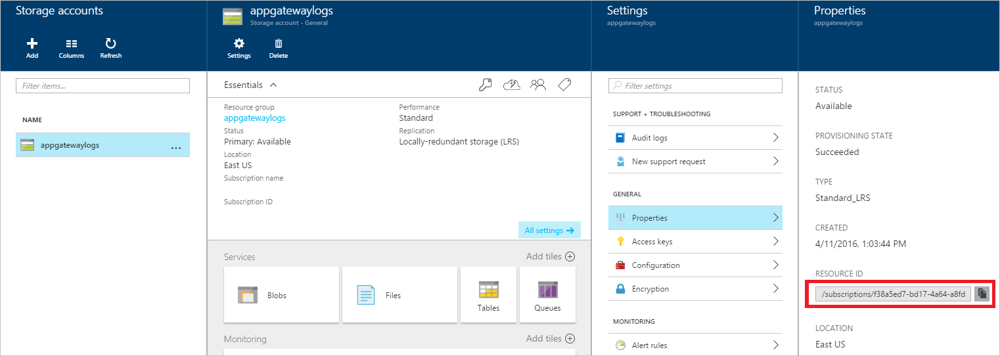

<properties 
   pageTitle="Überwachen von Access und Leistung von Protokollen und Kriterien für Anwendungsgateway | Microsoft Azure"
   description="Informationen Sie zum Aktivieren und Verwalten von Access und Leistung Protokolle für Gateway-Anwendung"
   services="application-gateway"
   documentationCenter="na"
   authors="amitsriva"
   manager="rossort"
   editor="tysonn"
   tags="azure-resource-manager"
/>
<tags 
   ms.service="application-gateway"
   ms.devlang="na"
   ms.topic="article"
   ms.tgt_pltfrm="na"
   ms.workload="infrastructure-services"
   ms.date="09/26/2016"
   ms.author="amitsriva" />

# Diagnoseprotokolle und Kriterien für die Anwendungsgateway

Azure bietet die Möglichkeit zum Überwachen der Ressource mit Protokollierung und Kennzahlen

[**Protokollierung**](#enable-logging-with-powershell) - Protokollierung für Performance, Access und andere Protokolle gespeichert oder aus einer Ressource für die Überwachung Zwecke genutzt werden kann.

[**Kennzahlen**](#metrics) - Anwendungsgateway aktuell verfügt über eine Metrik. Diese Metrik misst den Durchsatz des Gateways Anwendung in Bytes pro Sekunde.

Sie können verschiedene Arten von Protokollen in Azure verwalten und Problembehandlung bei Anwendungsgateways verwenden. Einige dieser Protokolle über das Portal zugegriffen werden kann, und alle Protokolle können aus einer Azure Blob-Speicher extrahiert und in andere Tools, wie etwa [Log Analytics](../log-analytics/log-analytics-azure-networking-analytics.md), Excel und PowerBI angezeigt werden. Erfahren Sie mehr über die verschiedenen Typen von Protokollen in der folgenden Liste aus:

- **Überwachungsprotokolle:** Sie können [Überwachungsprotokolle Azure](../monitoring-and-diagnostics/insights-debugging-with-events.md) (ehemals Betriebsprotokolle) verwenden, um alle Vorgänge, die an Ihr Abonnement Azure und deren Status übermittelt anzuzeigen. Überwachungsprotokolle sind standardmäßig aktiviert, und Sie können im Portal Azure Vorschau angezeigt werden.
- **Zugriff auf Protokolle:** Sie können dieses Protokoll verwenden, zum Anzeigen der Anwendung Gateway Access Muster und Analysieren wichtiger, dass die Informationen des Anrufers IP, URL angefordert, Antwort Wartezeit, einschließlich Code, Bytes zurück, die ein-und. Access-Protokoll werden alle 300 Sekunden erfasst. Dieses Protokoll enthält ein Datensatz pro Instanz der Anwendungsgateway. Die Anwendung Gateway-Instanz kann durch 'InstanceId' Eigenschaft identifiziert werden.
- **Leistungsprotokolle:** Sie können dieses Protokoll verwenden, um anzuzeigen, wie Anwendung Gateway Instanzen ausführen möchten. Dieses Protokoll zeichnet Leistungsinformationen per Instanz Basis total Anforderung served, einschließlich Durchsatz in Bytes, Anfragen insgesamt served, fehlgeschlagene Anforderung zählen, fehlerfrei und fehlerhaften Back-End-Instanz zählen. Performance Log werden alle 60 Sekunden erfasst.
- **Firewall Protokolle:** Dieses Protokoll können die Serviceanfragen anzeigen möchten, die über erkennen oder Prevention Modus eines Gateways Anwendung angemeldet sind, die mit Web Anwendung Firewall konfiguriert ist.

>[AZURE.WARNING] Protokolle sind nur verfügbar für Ressourcen, die im Bereitstellungsmodell Ressourcenmanager bereitgestellt. Sie können keine Protokolle für Ressourcen im Bereitstellungsmodell klassischen verwenden. Ein besseres Verständnis der beiden Modelle, finden Sie im Artikel [Grundlegendes zu Ressourcenmanager und klassischen Bereitstellung](../resource-manager-deployment-model.md) auf.

## Aktivieren der Protokollierung mit PowerShell

Überwachungsprotokollierung wird automatisch für alle Ressourcen des Ressourcenmanager aktiviert. Sie müssen Access und Leistung zum Sammeln von Daten über diese Protokolle verfügbar starten Protokollierung aktivieren. Zum Aktivieren der Protokollierung finden Sie die folgenden Schritte aus: 

1. Beachten Sie Ihr Speicherkonto Ressourcen-ID, die Daten Log gespeichert ist. Dies wäre des Formulars: /subscriptions/\<SubscriptionId\>/resourceGroups/\<Gruppe Ressourcenname\>/providers/Microsoft.Storage/storageAccounts/\<Speicher Kontonamen\>. Jedes Speicherkonto in Ihrem Abonnement kann verwendet werden. Im Vorschau-Portal können Sie finden diese Informationen.

    

2. Anmerkung an Ihrer Anwendung des Gateways Ressourcen-ID für die Protokollierung aktiviert werden. Dies wäre des Formulars: /subscriptions/\<SubscriptionId\>/resourceGroups/\<Gruppe Ressourcenname\>/providers/Microsoft.Network/applicationGateways/\<Anwendung gatewayname\>. Im Vorschau-Portal können Sie finden diese Informationen.

    

3. Mit dem folgenden Powershell-Cmdlet Diagnose-Protokollierung zu aktivieren:

        Set-AzureRmDiagnosticSetting  -ResourceId /subscriptions/<subscriptionId>/resourceGroups/<resource group name>/providers/Microsoft.Network/applicationGateways/<application gateway name> -StorageAccountId /subscriptions/<subscriptionId>/resourceGroups/<resource group name>/providers/Microsoft.Storage/storageAccounts/<storage account name> -Enabled $true  

>[AZURE.INFORMATION] Überwachungsprotokolle keiner separaten Speicher-Konto erforderlich. Die Verwendung von Speicherplatz für den Zugriff und Leistung Protokollierung budgetgerecht Dienst Gebühren.

## Aktivieren der Protokollierung mit Azure-portal

### Schritt 1

Navigieren Sie zu der Ressource im Azure-Portal an. Klicken Sie auf **Diagnoseprotokolle**. Ist dies zum ersten Mal Diagnose sieht das Blade wie die folgende Abbildung aus:

Für Application Gateway sind 3 Protokolle verfügbar.

- Access-Protokoll
- Performance Log
- Firewall-Protokoll

Klicken Sie auf **Diagnose aktivieren** , um Sammeln von Daten zu beginnen.

![Diagnose Einstellung blade][1]

### Schritt 2

Klicken Sie auf das Blade **Diagnose** sind die Einstellungen für wie die Diagnoseprotokollen festgelegt. In diesem Beispiel wird Log Analytics verwendet, um die Protokolle speichern. Klicken Sie auf " **Konfigurieren** ", klicken Sie unter **Log Analytics** zu den Arbeitsbereich zu konfigurieren. Ereignis Hubs und Speicher-Konto können verwendet werden, sowie die Diagnose Protokolle speichern.

![Diagnose blade][2]

### Schritt 3

Wählen Sie einen vorhandenen OMS Arbeitsbereich aus, oder Erstellen eines neuen Kontos. In diesem Beispiel wird eine vorhandene verwendet.

![OMS-Arbeitsbereiche][3]

### Schritt 4

Wenn Sie fertig sind, bestätigen Sie die Einstellungen, und klicken Sie auf **Speichern** , um die Einstellungen zu speichern.

![Bestätigen Sie die Auswahl][4]

## Überwachungsprotokoll

Dieses Protokoll (früher als "Betrieb Log" bezeichnet) wird standardmäßig von Azure generiert.  Die Protokolle werden 90 Tage lang in der Azure-Ereignisprotokollen Store beibehalten. Weitere Informationen zu diesen Protokollen durch [Ereignisse anzeigen und Überwachungsprotokolle](../monitoring-and-diagnostics/insights-debugging-with-events.md) Artikel lesen.

## Access-Protokoll

Dieses Protokoll wird nur ausgelöst, wenn Sie es aktiviert haben, klicken Sie auf eine pro Application Gateway Basis wie die vorherigen Schritte ausführlich beschrieben. Die Daten werden in dem Speicherkonto gespeichert, die Sie angegeben haben, wenn Sie die Protokollierung aktiviert. Jeder Access-Anwendung Gateways wird im JSON-Format protokolliert, wie im folgenden Beispiel gezeigt:

    {
        "resourceId": "/SUBSCRIPTIONS/<subscription id>/RESOURCEGROUPS/<resource group name>/PROVIDERS/MICROSOFT.NETWORK/APPLICATIONGATEWAYS/<application gateway name>",
        "operationName": "ApplicationGatewayAccess",
        "time": "2016-04-11T04:24:37Z",
        "category": "ApplicationGatewayAccessLog",
        "properties": {
            "instanceId":"ApplicationGatewayRole_IN_0",
            "clientIP":"37.186.113.170",
            "clientPort":"12345",
            "httpMethod":"HEAD",
            "requestUri":"/xyz/portal",
            "requestQuery":"",
            "userAgent":"-",
            "httpStatus":"200",
            "httpVersion":"HTTP/1.0",
            "receivedBytes":"27",
            "sentBytes":"202",
            "timeTaken":"359",
            "sslEnabled":"off"
        }
    }

## Leistungsprotokoll

Dieses Protokoll wird nur ausgelöst, wenn Sie es aktiviert haben, klicken Sie auf eine pro Application Gateway Basis wie die vorherigen Schritte ausführlich beschrieben. Die Daten werden in dem Speicherkonto gespeichert, die Sie angegeben haben, wenn Sie die Protokollierung aktiviert. Die folgenden Daten protokolliert werden:

    {
        "resourceId": "/SUBSCRIPTIONS/<subscription id>/RESOURCEGROUPS/<resource group name>/PROVIDERS/MICROSOFT.NETWORK/APPLICATIONGATEWAYS/<application gateway name>",
        "operationName": "ApplicationGatewayPerformance",
        "time": "2016-04-09T00:00:00Z",
        "category": "ApplicationGatewayPerformanceLog",
        "properties": 
        {
            "instanceId":"ApplicationGatewayRole_IN_1",
            "healthyHostCount":"4",
            "unHealthyHostCount":"0",
            "requestCount":"185",
            "latency":"0",
            "failedRequestCount":"0",
            "throughput":"119427"
        }
    }

## Firewall-Protokoll

Dieses Protokoll wird nur ausgelöst, wenn Sie es aktiviert haben, klicken Sie auf eine pro Anwendung Gateway Basis wie die vorherigen Schritte ausführlich beschrieben. Dieses Protokoll erfordert auch, dass Web-Anwendung Firewall auf ein Gateway konfiguriert werden. Die Daten werden in dem Speicherkonto gespeichert, die Sie angegeben haben, wenn Sie die Protokollierung aktiviert. Die folgenden Daten protokolliert werden:

    {
        "resourceId": "/SUBSCRIPTIONS/<subscriptionId>/RESOURCEGROUPS/<resourceGroupName>/PROVIDERS/MICROSOFT.NETWORK/APPLICATIONGATEWAYS/<applicationGatewayName>",
        "operationName": "ApplicationGatewayFirewall",
        "time": "2016-09-20T00:40:04.9138513Z",
        "category": "ApplicationGatewayFirewallLog",
        "properties":     {
            "instanceId":"ApplicationGatewayRole_IN_0",
            "clientIp":"108.41.16.164",
            "clientPort":1815,
            "requestUri":"/wavsep/active/RXSS-Detection-Evaluation-POST/",
            "ruleId":"OWASP_973336",
            "message":"XSS Filter - Category 1: Script Tag Vector",
            "action":"Logged",
            "site":"Global",
            "message":"XSS Filter - Category 1: Script Tag Vector",
            "details":{"message":" Warning. Pattern match "(?i)(<script","file":"/owasp_crs/base_rules/modsecurity_crs_41_xss_attacks.conf","line":"14"}}
    }

## Anzeigen und Analysieren des Überwachungsprotokolls

Sie können anzeigen und analysieren die Überwachungsprotokolldaten verwenden eine der folgenden Methoden:

- **Azure Tools:** Abrufen von Informationen aus der Überwachungsprotokolle bis Azure PowerShell, Azure Command Line Interface (CLI), die Azure REST-API oder im Portal Azure Vorschau.  Eine schrittweise Anleitung für die einzelnen Methoden werden im Artikel [Audit Vorgänge mit Ressourcenmanager](../resource-group-audit.md) detailliert beschrieben.
- **Power BI:** Wenn Sie bereits über eine [Power BI](https://powerbi.microsoft.com/pricing) -Konto besitzen, können Sie ihn kostenlos versuchen. Sie können mithilfe der [Überwachungsprotokolle Azure Inhalte Pack für Power BI](https://powerbi.microsoft.com/en-us/documentation/powerbi-content-pack-azure-audit-logs/) Ihrer Daten mit vorkonfiguriertes Dashboards, mit denen Sie als, analysieren-ist oder anpassen.

## Zeigen Sie an und analysieren Sie das Log Access und Leistung der firewall

Azure [Log Analytics](../log-analytics/log-analytics-azure-networking-analytics.md) kann den Zähler sammeln und Ereignisprotokoll Dateien aus Ihrem Blob-Speicher-Konto und Bandbreite von Darstellungen und leistungsfähige Suchfunktionen für Ihre Protokolle analysieren enthält.

Außerdem können Sie Verbinden mit Ihrem Speicherkonto und die JSON-Protokolleinträge für Access und Leistung von Protokollen abrufen. Nachdem Sie die JSON-Dateien heruntergeladen haben, können Sie diese CSV-und Ansicht in Excel, PowerBI oder andere Daten Visualisierungstool konvertieren.

>[AZURE.TIP] Wenn Sie mit Visual Studio und grundlegende Konzepte zum Ändern der Werte für die Konstanten und Variablen in c# vertraut sind, können Sie den [Log Konverter Tools](https://github.com/Azure-Samples/networking-dotnet-log-converter) unter Github.

## Kennzahlen

Kennzahlen ist ein Feature für bestimmte Azure Ressourcen,-Datenquellen im Portal angezeigt werden. Für Application Gateway ist eine Metrik zum Zeitpunkt der Entstehung dieses Artikels. Diese Metrik Durchsatz ist und im Portal angezeigt werden kann. Navigieren Sie zu einer Anwendungsgateway, und klicken Sie auf **Kriterien**.  Wählen Sie im Abschnitt **Kennzahlen zur Verfügung** , um die Werte anzeigen Durchsatz aus. In der folgenden Abbildung sehen Sie ein Beispiel mit der Filter, die zum Anzeigen der Daten in anderen Zeiträume verwendet werden können.

Eine Liste der aktuellen Kennzahlen unterstützen, finden Sie auf [unterstützte Kennzahlen mit Azure Monitor](../monitoring-and-diagnostics/monitoring-supported-metrics.md)

![metrische anzeigen][5]

## Warnungsregeln

Warnungsregeln können anhand von Kriterien für eine Ressource gestartet werden. Dies bedeutet für Application Gateway einer Benachrichtigung eines Webhook anrufen oder e-Mail-Administrator, wenn der Durchsatz des Gateways Anwendung über, unter oder auf einen Schwellenwert für einen angegebenen Zeitraum ist.

Im folgende Beispiel führt Sie durch Erstellen einer Regel, die eine e-Mail-Nachricht an einen Administrator sendet, nachdem Sie ein Durchsatz Schwellenwert verletzt wurde.

### Schritt 1

Klicken Sie auf **Hinzufügen einer Benachrichtigung für metrischen** zu starten. Diese Blade kann auch aus dem Blade Kennzahlen erreicht werden.

![Warnungsregeln blade][6]

### Schritt 2

Füllen Sie den Namen, die Bedingung, in der **Regel hinzufügen** Blade benachrichtigen Sie Abschnitte und klicken Sie auf **OK** , wenn Sie fertig.

Die **Bedingung** Ansichtsauswahl ermöglicht für 4 Werte, **größer als**, **größer als oder gleich**, **kleiner als**oder **kleiner als oder gleich**.

Auswählen von einem Zeitraum von 5 Minuten bis 6 Stunden ermöglicht der Ansichtsauswahl **Periode zurück** .

Indem Sie **e-Mail-Besitzer, Mitwirkenden, und Leser** kann die e-Mail basierend auf den Benutzer, die Zugriff auf diese Ressource haben dynamisch sein. Andernfalls kann eine kommagetrennte Liste der Benutzer in das Textfeld **zusätzliche Administrator Email(s)** bereitgestellt werden.

![Regel Blade hinzufügen][7]

Wenn Sie der Schwellenwert verletzt wird, eintreffen eine e-Mail-Nachricht in der folgenden Abbildung ähnelt:

![Schwellenwert verletzt-e-Mail][8]

Eine Liste der Benachrichtigungen wird angezeigt, sobald eine Benachrichtigung metrische erstellt wurde, und einen Überblick über die Warnungsregeln bietet.

![Regel anzeigen][9]

Weitere Informationen zum Benachrichtigen Benachrichtigungen finden Sie auf [empfangen-Benachrichtigung](../monitoring-and-diagnostics/insights-receive-alert-notifications.md)

Besuchen Sie näher Webhooks und wie Sie mit Benachrichtigungen verwendet werden können, [Konfigurieren eines Webhook auf einer Azure metrischen Benachrichtigung](../monitoring-and-diagnostics/insights-webhooks-alerts.md)

## Nächste Schritte

- Visualisieren von Zähler und Ereignisprotokollen mit [Log Analytics](../log-analytics/log-analytics-azure-networking-analytics.md) 
- [Visualisieren der Überwachungsprotokolle Azure mit Power BI](http://blogs.msdn.com/b/powerbi/archive/2015/09/30/monitor-azure-audit-logs-with-power-bi.aspx) -Blogbeitrag.
- [Anzeigen und Analysieren von Azure Überwachungsprotokolle in Power BI und vieles mehr](https://azure.microsoft.com/blog/analyze-azure-audit-logs-in-powerbi-more/) Blogbeitrag veröffentlichen.

[1]: ./media/application-gateway-diagnostics/figure1.png
[2]: ./media/application-gateway-diagnostics/figure2.png
[3]: ./media/application-gateway-diagnostics/figure3.png
[4]: ./media/application-gateway-diagnostics/figure4.png
[5]: ./media/application-gateway-diagnostics/figure5.png
[6]: ./media/application-gateway-diagnostics/figure6.png
[7]: ./media/application-gateway-diagnostics/figure7.png
[8]: ./media/application-gateway-diagnostics/figure8.png
[9]: ./media/application-gateway-diagnostics/figure9.png