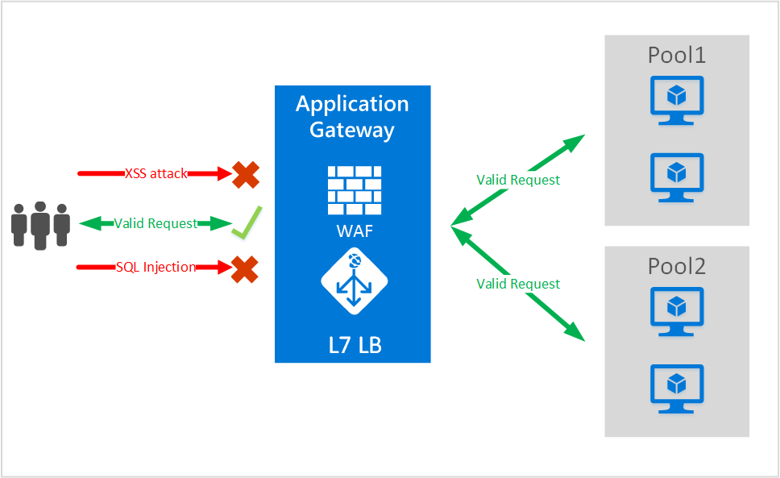

<properties
   pageTitle="Einführung in die Web-Anwendung Firewall (WAF) für die Anwendungsgateway | Microsoft Azure"
   description="Diese Seite enthält eine Übersicht der Web-Anwendung Firewall (WAF) für Gateway-Anwendung "
   documentationCenter="na"
   services="application-gateway"
   authors="amsriva"
   manager="rossort"
   editor="amsriva"/>
<tags
   ms.service="application-gateway"
   ms.devlang="na"
   ms.topic="hero-article"
   ms.tgt_pltfrm="na"
   ms.workload="infrastructure-services"
   ms.date="10/25/2016"
   ms.author="amsriva"/>

# Anwendung Gateway Web Anwendung Firewall (Preview)

Web-Anwendung Firewall (WAF) ist ein Feature des Gateways Azure-Anwendung, die in Webanwendungen Schutz bereitstellt, die Anwendungsgateway für standard-Anwendung Übermittlung Steuerelement (ADC)-Funktionen nutzen. Web-Anwendung Firewall dazu Schutz vor die meisten der OWASP Top 10 Web Leitfaden. Webanwendungen sind zunehmend Ziele von Angriffen, die bekannte Leitfaden ausnutzen. Bei allen diesen Angriffen werden SQL-Injektionsangriffe, um ein paar zu nennen Angriffen Cross Site scripting. Kann schwierig sein, und möglicherweise müssen Sie strengen warten, Patch und für die Überwachung auf mehreren Ebenen von der Anwendung Suchtopologie solchen Angriffen Anwendung Code zu verhindern. Zentrale Web Anwendung Firewall zum Schutz vor Webangriffen macht Sicherheits-Management zu viel einfacher und bietet eine bessere Assurance zur Anwendung von Angriffen gegen den. Eine Lösung WAF kann auch auf ein Sicherheitsrisiko schneller reagieren durch ein bekanntes Sicherheitsrisiko an einer zentralen Stelle im Vergleich für jede einzelne Webanwendungen Patch. Vorhandene Anwendungsgateways können einfach in ein Gateway mit Web Anwendung Firewall konvertiert werden.

Application Gateway fungiert als eine Anwendung Übermittlung Controller und bietet SSL-Beendigung, Sitzung Cookie-basierten Zugehörigkeit, Round-Robert laden Verteilung, Inhalte routing, Möglichkeit, mehrere Websites und Sicherheit Erweiterungen hosten. Sicherheit zählen von Application Gateway Angeboten beispielsweise SSL-Gruppenrichtlinien-Verwaltungskonsole, durchgehende SSL-Unterstützung. Wir werden Sicherheit Anwendungsmöglichkeiten unseres Diensts verstärken, durch die Einführung von WAF (Web Anwendung Firewall) direkt in der ADC Geschenk integriert. Dies bietet eine leicht verständliche zentralen Ort zum Verwalten und Schützen Ihrer Webanwendungen gegen Leitfaden Web konfigurieren.

Konfigurieren von WAF bei Anwendungsgateway bietet die folgende Vorteile für Sie:

- Schützen Sie Ihrer Webanwendung Web Sicherheitslücken und Angriffen ohne Änderung Back-End-Codes.
- Schützen Sie mehrere Webanwendungen zur gleichen Zeit hinter ein Gateway ein. Anwendungsgateway unterstützt das Hosten von bis zu 20 Websites hinter einem einzelnen Gateway, das alle Web Angriffen geschützt werden konnte.
- Überwachen Sie Ihrer Webanwendung Angriffen in Echtzeit Bericht durch die Anwendung Gateway WAF Protokolle verwenden.
- Bestimmte Compliance-Steuerelemente erfordern alle Internet zugänglichen Ihrer Endpunkte durch eine Lösung WAF geschützt werden. Anwendungsgateway mit WAF aktiviert verwenden, können Sie diese Anforderungen Vorschriften erfüllen.

## (Übersicht)

Anwendung Gateway WAF wird in eine neue SKU (SKU WAF) angeboten und vorkonfiguriert mit ModSecurity und OWASP Core Regelsatz geplante Schutz gegen die meisten der OWASP Top 10 Web Leitfaden anzubieten.

- Schutz der SQL-einfügen
- Cross Site scripting Schutz
- Allgemeine Web-Angriffen Schutz wie Befehl Einfügen, HTTP-Anforderung smuggling, HTTP-Antwort Teilen, und remote-Datei einbezogen werden Angriffen
- Schutz vor HTTP-Protokollfehlern
- Schutz vor HTTP-Protokoll Bildschirmdarstellung auftreten, z. B. fehlende hosten Benutzer-Agents und annehmen von Kopfzeilen
- HTTP-DoS Schutzmechanismen einschließlich HTTP überfluten und langsam HTTP-DoS prevention
- Verhindern von Bots, Suchmaschinen und Scanner
- Erkennung von allgemeine Anwendung fehlerhafte Konfigurationen (d. h. Apache, IIS usw.)

## WAF Modi

Anwendung Gateway WAF kann konfiguriert werden, um in den folgenden zwei Modi auszuführen:

- **Erkennungsmodus** – bei der Ausführung im Erkennungsmodus, Anwendung Gateway WAF konfiguriert überwacht und alle Bedrohung Benachrichtigungen in einer Protokolldatei protokolliert. Müssen Sie sicherstellen, dass die Diagnose für Application Gateway Protokollierung aktiviert ist im Abschnitt Diagnose verwenden. Sie müssen außerdem sicherstellen, dass das Protokoll WAF ausgewählt und aktiviert ist.
- **Prevention Modus** – Wenn so konfiguriert, dass im Modus Prevention Application Gateway aktiv Blöcke Angriffen und Angriffen erkannt durch deren Regeln ausführen. Der Angreifer erhält eine Ausnahme 403 nicht autorisierten Zugriff und die Verbindung wird beendet. Prevention-Modus weiterhin solchen Angriffen in die Protokolle WAF melden.

## Anwendung Gateway WAF-Berichte

Anwendung Gateway WAF bietet detaillierte Berichte, klicken Sie auf jede Bedrohung, die das Programm erkennt. Protokollierung Azure Diagnose Protokolle integriert ist und Benachrichtigungen werden im Json-Format aufgezeichnet.

    {
        "resourceId": "/SUBSCRIPTIONS/<subscriptionId>/RESOURCEGROUPS/<resourceGroupName>/PROVIDERS/MICROSOFT.NETWORK/APPLICATIONGATEWAYS/<applicationGatewayName>",
        "operationName": "ApplicationGatewayFirewall",
        "time": "2016-09-20T00:40:04.9138513Z",
        "category": "ApplicationGatewayFirewallLog",
        "properties":     {
            "instanceId":"ApplicationGatewayRole_IN_0",
            "clientIp":"108.41.16.164",
            "clientPort":1815,
            "requestUri":"/wavsep/active/RXSS-Detection-Evaluation-POST/",
            "ruleId":"OWASP_973336",
            "message":"XSS Filter - Category 1: Script Tag Vector",
            "action":"Logged",
            "site":"Global",
            "message":"XSS Filter - Category 1: Script Tag Vector",
            "details":{"message":" Warning. Pattern match "(?i)(<script","file":"/owasp_crs/base_rules/modsecurity_crs_41_xss_attacks.conf","line":"14"}}
    }

## Anwendung Gateway WAF SKU Preise

Während der Vorschau gibt es keine zusätzlichen Gebühren für die Verwendung der Anwendung Gateway WAF. Sie weiterhin bei vorhandenen grundlegende SKU Gebühren in Rechnung gestellt. Wir werden die Gebühren WAF SKU GA gleichzeitig kommunizieren. Kunden festgelegt haben, dass die Anwendung Gateways im WAF SKU bereitstellen möchten antizipierte WAF SKU nur nach GA Ankündigung Preise beginnen.

## Nächste Schritte

Nach dem Lernen mehr über die Funktionen von WAF, finden Sie auf [Web Anwendung Firewall auf Application Gateway zu konfigurieren](application-gateway-web-application-firewall-portal.md).
