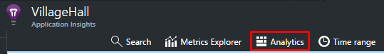
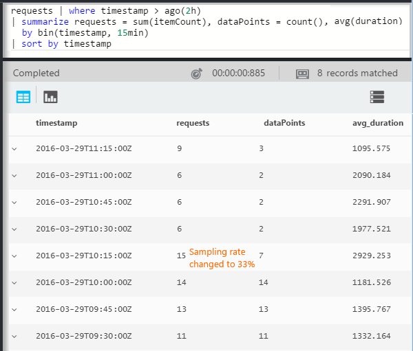
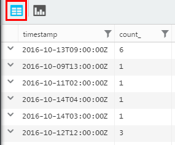
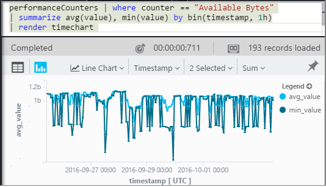
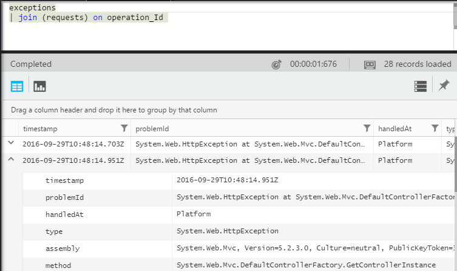
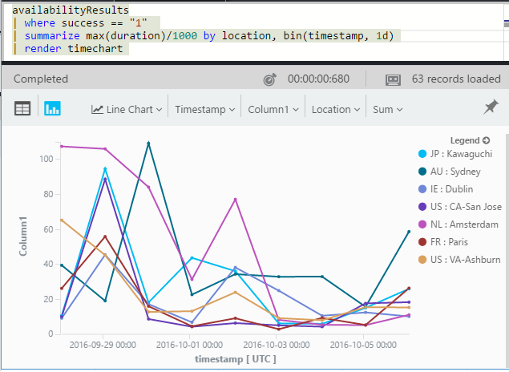

<properties 
    pageTitle="Eine Einführung in die Anwendung Einsichten zu Analytics | Microsoft Azure" 
    description="Kurze Beispiele für die wichtigsten Abfragen in Analytics, die leistungsfähige Suchfunktion der Anwendung Einsichten." 
    services="application-insights" 
    documentationCenter=""
    authors="alancameronwills" 
    manager="douge"/>

<tags 
    ms.service="application-insights" 
    ms.workload="tbd" 
    ms.tgt_pltfrm="ibiza" 
    ms.devlang="na" 
    ms.topic="article" 
    ms.date="10/15/2016" 
    ms.author="awills"/>


 
# <a name="a-tour-of-analytics-in-application-insights"></a>Eine Tour durch Analytics in Anwendung Einsichten


[Analytics](app-insights-analytics.md) ist die leistungsfähige Suchfunktion der [Anwendung Einsichten](app-insights-overview.md). Diese Seiten werden die Analytics Abfrage Lanquage beschrieben.


* **[Die Einführungsvideo anzeigen](https://applicationanalytics-media.azureedge.net/home_page_video.mp4)**.
* **[Test Drive Analytics auf unsere simulierten Daten](https://analytics.applicationinsights.io/demo)** , wenn Ihre app Anwendung Einsichten noch Senden von Daten nicht zur Verfügung.


Nachstehend wird eine Einführung in einige einfachen Abfragen, die Ihnen den Einstieg.

## <a name="connect-to-your-application-insights-data"></a>Eine Verbindung mit Ihrer Anwendung Einsichten Daten

Analytics aus Ihrer app [Übersicht Blade](app-insights-dashboards.md) in Anwendung Einsichten zu öffnen:



    
## <a name="takeapp-insights-analytics-referencemdtake-operator-show-me-n-rows"></a>[Optimieren](app-insights-analytics-reference.md#take-operator): n Zeilen anzeigen

Datenpunkte, die Benutzeraktionen (normalerweise HTTP-Anfragen vom Web app) melden Sie sich befinden sich in einer Tabelle namens `requests`. Jede Zeile ist ein werden Datenpunkt erhalten von der Anwendung Einsichten SDK in Ihrer app.

Beginnen wir, indem Sie ein paar Stichprobe Zeilen der Tabelle:


> [AZURE.NOTE] Setzen Sie den Cursor an einer beliebigen Stelle in der Anweisung, bevor Sie auf Gehe zu klicken. Sie können eine Anweisung über mehr als eine Zeile aufteilen, aber nicht leere Zeilen in einer Anweisung setzen. Leere Zeilen eignen sich hervorragend mehrere separate Abfragen in das Fenster beibehalten werden soll.


Wählen Sie Spalten, ziehen Sie sie nach Spalten gruppieren und filtern: 


Erweitern Sie alle Elemente aus, um die Details anzuzeigen:
 


> [AZURE.NOTE] Klicken Sie auf den Kopf einer Spalte, um die Reihenfolge der Ergebnisse in einem Webbrowser verfügbar. Aber Achten Sie darauf, dass für eine große Anzahl von Ergebnissen zurück, die Anzahl der Zeilen, die in den Browser heruntergeladen beschränkt ist. Auf diese Weise sortieren anzuzeigen nicht Sie immer die tatsächliche höchsten oder niedrigsten Elemente. Um Elemente zuverlässig sortieren möchten, verwenden Sie die `top` oder `sort` Operator. 

## <a name="topapp-insights-analytics-referencemdtop-operator-and-sortapp-insights-analytics-referencemdsort-operator"></a>[Oben](app-insights-analytics-reference.md#top-operator) und [Sortieren](app-insights-analytics-reference.md#sort-operator)

`take`ist sinnvoll, erhalten eine schnelle Beispiel für ein Ergebnis, aber es zeigt Zeilen aus der Tabelle in keiner bestimmten Reihenfolge. Eine geordnete Ansicht verwenden, um `top` (für eine Stichprobe) oder `sort` (über die gesamte Tabelle).

Zeigen Sie die ersten n Zeilen, sortiert nach einer bestimmten Spalte an:

```AIQL

    requests | top 10 by timestamp desc 
```

* *Syntax:* Die meisten Operatoren haben Schlüsselwortparameter wie `by`.
* `desc`absteigenden Reihenfolge = `asc` = Aufsteigend.


`top...`ist eine weitere Möglichkeit, leistungsfähigen abzulehnen `sort ... | take...`. Wir konnten geschrieben, haben:

```AIQL

    requests | sort by timestamp desc | take 10
```

Das Ergebnis wäre identisch, aber etwas langsamer ausführen möchten. (Sie können auch schreiben `order`, welche ist ein Alias von `sort`.)

Die Spaltenüberschriften in der Tabellenansicht können auch zum Sortieren der Ergebnisse auf dem Bildschirm verwendet werden. Aber natürlich, wenn Sie verwendet haben `take` oder `top` zum Abrufen von nur einen Teil einer Tabelle, Sie können nur die Reihenfolge haben Sie abgerufenen Datensätze.


## <a name="projectapp-insights-analytics-referencemdproject-operator-select-rename-and-compute-columns"></a>[Projekt](app-insights-analytics-reference.md#project-operator): Wählen Sie aus, umbenennen und Berechnen von Spalten

Verwenden Sie [`project`](app-insights-analytics-reference.md#project-operator) , nur die Spalten auswählen, werden sollen:

```AIQL

    requests | top 10 by timestamp desc
             | project timestamp, name, resultCode
```


Sie können auch Umbenennen von Spalten und neue zu definieren:

```AIQL

    requests 
  	| top 10 by timestamp desc 
  	| project  
            name, 
            response = resultCode,
            timestamp, 
            ['time of day'] = floor(timestamp % 1d, 1s)
```


* [Spaltennamen](app-insights-analytics-reference.md#names) können Leerzeichen enthalten oder Symbole, wenn sie eingeschlossen werden wie folgt: `['...']` oder`["..."]`
* `%`ist die übliche modulo-Operator. 
* `1d`(Dies ist eine Ziffer eine, und klicken Sie dann eine hatten ') literaler Zeitspanne ist d. h. Tag. Hier sind einige weitere Timespan literalen: `12h`, `30m`, `10s`, `0.01s`.
* `floor`(Alias `bin`) Rundet einen Wert auf das nächste Vielfache von der Basiswert, die Sie bereitstellen. Also `floor(aTime, 1s)` jeweils auf die nächste zweite rundet.

[Ausdrücke](app-insights-analytics-reference.md#scalars) können alle üblichen Operatoren enthalten (`+`, `-`;...), und es ist ein Zellbereich nützliche Funktionen.

    

## <a name="extendapp-insights-analytics-referencemdextend-operator-compute-columns"></a>[Erweitern](app-insights-analytics-reference.md#extend-operator): Berechnen von Spalten

Wenn Sie die vorhandenen Spalten hinzufügen möchten, verwenden Sie [`extend`](app-insights-analytics-reference.md#extend-operator):

```AIQL

    requests 
  	| top 10 by timestamp desc
  	| extend timeOfDay = floor(timestamp % 1d, 1s)
```

Verwenden von [`extend`](app-insights-analytics-reference.md#extend-operator) ist weniger ausführlich als [`project`](app-insights-analytics-reference.md#project-operator) , wenn Sie alle vorhandenen Spalten behalten möchten.


## <a name="summarizeapp-insights-analytics-referencemdsummarize-operator-aggregate-groups-of-rows"></a>[Summarize](app-insights-analytics-reference.md#summarize-operator): aggregieren Gruppen von Zeilen

`Summarize`gilt für eine angegebene *Aggregatfunktion* über Gruppen von Zeilen ein. 

Beispielsweise wird die Zeit Web app benötigt wird eine Besprechungsanfrage Antworten im Feld gemeldeten `duration`. Sehen Sie die Antwortzeit Mittelwert auf alle Anfragen an:


Oder konnten wir das Ergebnis in Anfragen mit unterschiedlichen Namen trennen:


`Summarize`sammelt die Datenpunkte im Stream in Gruppen, für die der `by` Klausel gleichmäßig ergibt. Jeder Wert in der `by` Ausdruck - jeder Vorgangsname im obigen Beispiel - angegeben, ergibt sich eine Zeile in der Ergebnistabelle. 

Oder wir konnten Gruppieren von Ergebnissen nach Uhrzeit:


Beachten Sie, wie verwenden wir die `bin` (Funktion) (QuickInfos `floor`). Wenn wir gerade verwendeten `by timestamp`, jede Zeile von in einer eigenen Gruppe etwas landen würden. Für alle fortlaufender Skalarwert wie oft oder Zahlen, müssen wir den zusammenhängenden Bereich in einer verwaltbaren Anzahl von diskrete Werte Teile aufzuteilen und `bin` -welche ist die eigentlich nur die vertrauten runden Dropdownfeld `floor` Funktion – ist die einfachste Möglichkeit zum erledigen.

Wir können das gleiche Verfahren verwenden, um Bereiche von Zeichenfolgen zu verringern:


Benachrichtigung, die Sie verwenden können `name=` den Namen der Ergebnisspalte an, in die Aggregationsausdrücke oder die by-Klausel festlegen.

## <a name="counting-sampled-data"></a>Zählen von Daten Stichprobe

`sum(itemCount)`ist die empfohlene Aggregation, Ereignisse zu zählen. In vielen Fällen ItemCount == 1, damit die Funktion die Anzahl der Zeilen in der Gruppe einrichten einfach zählt. Bei [Stichproben](app-insights-sampling.md) in Betrieb genommen wurde, nur ein Bruch der ursprünglichen Ereignisse wird werden, verbleiben aber als Datenpunkte in Anwendung Einblicken, damit für jeden Datenpunkt angezeigt, es gibt `itemCount` Ereignisse. 

Angenommen, wenn werden 75 % von der ursprünglichen Ereignisse, und klicken Sie dann ItemCount verwirft == 4 in den beibehalten Datensätzen - d. h., für jeden Datensatz beibehalten es wurden vier ursprünglichen Datensätze. 

Adaptive werden bewirkt, dass ItemCount Zeiträumen höhere werden an Ihrer Anwendung stark benutzt wird.

Summieren von ItemCount bietet deshalb eine gute Schätzung die ursprüngliche Anzahl von Ereignissen.




Es gibt auch eine `count()` Aggregation (und eine Operation zählen) für Fälle, wo Sie wirklich die Anzahl der Zeilen in einer Gruppe möchten.


Es gibt ein Zellbereich [Aggregationsfunktionen](app-insights-analytics-reference.md#aggregations).


## <a name="charting-the-results"></a>Die Ergebnisse Diagramme


```AIQL

    exceptions 
       | summarize count()  
         by bin(timestamp, 1d)
```

Standardmäßig werden Ergebnisse als Tabelle anzeigen:




Wir können besser als die Tabellenansicht ausführen. Sehen wir uns die Ergebnisse in der Diagrammansicht durch die vertikalen Balken-Option:


Beachten Sie, dass zwar wir haben die Ergebnisse zu sortieren nach Zeiten (wie in der Tabellenanzeige angezeigt), zeigt die Darstellung des Diagramms immer Zeiteingabe in der richtigen Reihenfolge an.


## <a name="whereapp-insights-analytics-referencemdwhere-operator-filtering-on-a-condition"></a>[Wo](app-insights-analytics-reference.md#where-operator): Filtern auf einer Bedingung

Wenn Sie die Anwendung Einsichten für [Client](app-insights-javascript.md) und Server Seiten der app für die Überwachung eingerichtet haben, einige der werden in der Datenbank bezieht sich auf Browser.

Schauen Sie nur Ausnahmen gemeldet vom Browser aus:

```AIQL

    exceptions 
  	| where client_Type == "Browser" 
  	|  summarize count() 
       by client_Browser, outerMessage 
```


Die `where` Operator nimmt einen booleschen Ausdruck. Hier sind einige wichtige Punkte zu können:

 * `and`, `or`: Boolesche Operatoren
 * `==`, `<>` : gleich und nicht gleich
 * `=~`, `!=` : Zeichenfolgenvergleich gleich und ungleich. Es gibt viele weitere Zeichenfolgen-Vergleichsoperatoren.

Umfassende Informationen zu [skalaren Ausdrücken](app-insights-analytics-reference.md#scalars)zu lesen.

### <a name="filtering-events"></a>Filtern von Ereignissen

Suchen nach nicht erfolgreich Anfragen:

```AIQL

    requests 
  	| where isnotempty(resultCode) and toint(resultCode) >= 400
```

`responseCode`Typ String, verfügt damit wir für einen numerischen Vergleich [wandeln Sie ihn müssen](app-insights-analytics-reference.md#casts)

Zusammenfassung der verschiedenen Antworten an:

```AIQL

    requests
  	| where isnotempty(resultCode) and toint(resultCode) >= 400
  	| summarize count() 
      by resultCode
```

## <a name="timecharts"></a>Timecharts

Anzeigen der Anzahl von Ereignissen jeden Tag sind:

```AIQL

    requests
      | summarize event_count=count()
        by bin(timestamp, 1d)
```

Wählen Sie die Diagramm-Anzeigeoption aus:


## <a name="multiple-series"></a>Mehrere Datenreihen 

Mehrere Ausdrücke in der `summarize` mehrere Spalten erstellt.

Mehrere Ausdrücke in der `by` -Klausel erstellt mehrere Zeilen, eine für jede Kombination der Werte.


```AIQL

    requests
  	| summarize count(), avg(duration) 
      by bin(timestamp, 1d), client_StateOrProvince, client_City 
  	| order by timestamp asc, client_StateOrProvince, client_City
```


### <a name="segment-a-chart-by-dimensions"></a>Ein Diagramm nach Dimensionen segmentieren

Wenn Sie eine Tabelle Erstellen eines Diagramms aus, die eine Zeichenfolgenspalte und einer numerischen Spalte verfügt, kann die Zeichenfolge die numerischen Daten in separaten Reihe von Punkten Teilen verwendet werden. Ist mehr als eine Zeichenfolgenspalte, können Sie die Spalte als Diskriminators verwenden auswählen. 


### <a name="display-multiple-metrics"></a>Zeigen Sie mehrerer Kriterien an

Wenn Sie einer Tabelle zusätzlich zu den Zeitstempel, die mehrere numerische Spalte Diagramm können Sie eine beliebige Kombination anzeigen.


Sie müssen wird Teilen aktivieren, bevor Sie mehrere numerische Spalten, die Sie teilen können nicht nach einer Zeichenfolgenspalte zur gleichen Zeit wie das Anzeigen von mehreren numerische Spalten auswählen können. 


## <a name="daily-average-cycle"></a>Tägliche durchschnittliche Kreis

Wie sein über die durchschnittliche Tag unterschiedlich?

Zählen Anfragen bis zu dem Zeitpunkt modulo einen Tag in Stunden binned:

```AIQL

    requests
  	| extend hour = floor(timestamp % 1d , 1h) 
          + datetime("2016-01-01")
  	| summarize event_count=count() by hour
```


>[AZURE.NOTE] Beachten müssen wir derzeit Zeit Dauer in Zeiteingabe konvertieren, um anzuzeigen, klicken Sie auf das Diagramm.


## <a name="compare-multiple-daily-series"></a>Vergleichen Sie mehrere tägliche Datenreihen

Wie sein über die Uhrzeit in verschiedenen Ländern unterschiedlich?

```AIQL

 requests  | where tostring(operation_SyntheticSource)
     | extend hour= floor( timestamp % 1d , 1h)
           + datetime("2001-01-01")
     | summarize event_count=count() 
       by hour, client_CountryOrRegion 
     | render timechart
```


## <a name="plot-a-distribution"></a>Zeichnen einer Verteilung zurück

Wie viele Sitzungen es gibt verschiedene Länge haben?

```AIQL

    requests 
  	| where isnotnull(session_Id) and isnotempty(session_Id) 
  	| summarize min(timestamp), max(timestamp) 
      by session_Id 
  	| extend sessionDuration = max_timestamp - min_timestamp 
  	| where sessionDuration > 1s and sessionDuration < 3m 
  	| summarize count() by floor(sessionDuration, 3s) 
  	| project d = sessionDuration + datetime("2016-01-01"), count_
```

Die letzte Zeile ist erforderlich, um in Datetime zu konvertieren. Aktuell wird die X-Achse eines Diagramms als ein Skalarwert angezeigt, nur, wenn es sich um einen datetime-Wert ist.

Die `where` Klausel schließt einmalige Sitzungen (SessionDuration == 0) und legt die Länge der x-Achse fest.


## <a name="percentilesapp-insights-analytics-referencemdpercentiles"></a>[Quantile zwischen](app-insights-analytics-reference.md#percentiles)

Welche Bereiche der Dauer Deckblatt unterschiedliche Prozentsätze Sitzungen?

Verwenden Sie die oben genannte Abfrage, aber ersetzen Sie die letzte Zeile:

```AIQL

    requests 
  	| where isnotnull(session_Id) and isnotempty(session_Id) 
  	| summarize min(timestamp), max(timestamp) 
      by session_Id 
  	| extend sesh = max_timestamp - min_timestamp 
  	| where sesh > 1s
  	| summarize count() by floor(sesh, 3s) 
  	| summarize percentiles(sesh, 5, 20, 50, 80, 95)
```

Wir haben auch die Obergrenze entfernt, in der Where-Klausel, um richtige Zahlen, einschließlich aller Sitzungen mit mehr als eine Anforderung zu ermitteln:


Aus dem können wir, die angezeigt werden:

* 5 % des Sitzungen haben eine Dauer von 3 Minuten 34s; 
* 50 % der Sitzungen zuletzt kleiner als 36 Minnutes;
* die letzten 5 % des Sitzungen mehr als sieben Tage

Um eine separate Projektstrukturplan-Codes zu gelangen, für jedes Land, wir nur bringen müssen die Spalte Client_CountryOrRegion separat über beide summarize-Operatoren:

```AIQL

    requests 
  	| where isnotnull(session_Id) and isnotempty(session_Id) 
  	| summarize min(timestamp), max(timestamp) 
      by session_Id, client_CountryOrRegion
  	| extend sesh = max_timestamp - min_timestamp 
  	| where sesh > 1s
  	| summarize count() by floor(sesh, 3s), client_CountryOrRegion
  	| summarize percentiles(sesh, 5, 20, 50, 80, 95)
      by client_CountryOrRegion
```


## <a name="joinapp-insights-analytics-referencemdjoin"></a>[Teilnehmen an](app-insights-analytics-reference.md#join)

Wir haben Zugriff auf mehrere Tabellen, einschließlich Besprechungsanfragen und Ausnahmen.

Zum Suchen der Ausnahmen, die im Zusammenhang mit einer Besprechungsanfrage, der Antwort ein Fehler zurückgegeben, können wir verknüpfen Sie die Tabellen auf `session_Id`:

```AIQL

    requests 
  	| where toint(responseCode) >= 500 
  	| join (exceptions) on operation_Id 
  	| take 30
```


Es empfiehlt sich, verwenden Sie `project` nur die Spalten aus, bevor Sie die Verknüpfung ausführen wir müssen.
In der gleichen Klauseln benennen wir die Timestamp-Spalte.


## <a name="letapp-insights-analytics-referencemdlet-clause-assign-a-result-to-a-variable"></a>[Zulassen, dass](app-insights-analytics-reference.md#let-clause): weisen ein Ergebnis einer Variablen

Formular mit [zulassen, dass](./app-insights-analytics-reference.md#let-statements) die Teile der vorherigen Ausdruck zu trennen. Die Ergebnisse sind nicht geändert:

```AIQL

    let bad_requests = 
      requests
        | where  toint(resultCode) >= 500  ;
    bad_requests
  	| join (exceptions) on session_Id 
  	| take 30
```

> Tipp: Im Analytics-Client, setzen Sie nicht leere Zeilen zwischen den Bestandteilen. Vergewissern Sie sich, alle davon nicht ausführen.


## <a name="accessing-nested-objects"></a>Zugreifen auf verschachtelte Objekte

Geschachtelte Objekte können leicht zugegriffen werden. Beispielsweise wird im Stream Ausnahmen strukturierte Objekte wie folgt angezeigt:


Sie können es reduzieren, indem Sie auf die Eigenschaften, die, denen Sie interessiert:

```AIQL

    exceptions | take 10
  	| extend method1 = tostring(details[0].parsedStack[1].method)
```

Beachten Sie, dass Sie eine [Umwandlung](app-insights-analytics-reference.md#casts) in den entsprechenden Typ verwenden müssen.

## <a name="custom-properties-and-measurements"></a>Benutzerdefinierte Eigenschaften und Maße

Die Anwendung hängt [benutzerdefinierte Maße (Eigenschaften) und benutzerdefinierte Maße](app-insights-api-custom-events-metrics.md#properties) auf Ereignisse, und sehen sie in der `customDimensions` und `customMeasurements` Objekte.


Wenn beispielsweise Ihre app enthält:

```C#

    var dimensions = new Dictionary<string, string> 
                     {{"p1", "v1"},{"p2", "v2"}};
    var measurements = new Dictionary<string, double>
                     {{"m1", 42.0}, {"m2", 43.2}};
    telemetryClient.TrackEvent("myEvent", dimensions, measurements);
```

So extrahieren Sie diese Werte in Analytics

```AIQL

    customEvents
  	| extend p1 = customDimensions.p1, 
      m1 = todouble(customMeasurements.m1) // cast to expected type

``` 

## <a name="tables"></a>Tabellen

Stream von der aus der app empfangen werden kann über mehrere Tabellen zugegriffen werden. Das Schema der Eigenschaften für jede Tabelle zur Verfügung stehen, wird am linken Rand des Fensters angezeigt.

### <a name="requests-table"></a>Tabelle von Besprechungsanfragen

Zählen HTTP-Anfragen Web app und Segment anhand des Namens der Seite:


Suchen nach-Anfragen, die am häufigsten ein Fehler auftreten:


### <a name="custom-events-table"></a>Benutzerdefinierte Ereignistabelle

Wenn Sie [TrackEvent()](app-insights-api-custom-events-metrics.md#track-event) verwenden, um eigene Ereignisse zu senden, können Sie sie aus dieser Tabelle lesen. 

Nachstehend wird ein Beispiel, in Ihren app-Code diese Zeilen enthält:

```C#

    telemetry.TrackEvent("Query", 
       new Dictionary<string,string> {{"query", sqlCmd}},
       new Dictionary<string,double> {
           {"retry", retryCount},
           {"querytime", totalTime}})
```

Anzeigen der Häufigkeit von diese Ereignisse an:
 


Extrahieren Sie Maße und Dimensionen von den Ereignissen an:


### <a name="custom-metrics-table"></a>Benutzerdefinierte Metrik Tabelle

Wenn Sie den [TrackMetric()](app-insights-api-custom-events-metrics.md#track-metric) verwenden, um eigene metrischen Werte zu senden, finden Sie die Ergebnisse im **CustomMetrics** Stream. Beispiel:  


> [AZURE.NOTE] Im [Explorer Kennzahlen](app-insights-metrics-explorer.md)alle benutzerdefinierten Maße angefügt werden auf einen beliebigen angezeigt werden zusammen in das Blade Kennzahlen zusammen mit Kennzahlen mithilfe gesendet `TrackMetric()`. Aber Analytics, benutzerdefinierte Maße weiterhin verbunden sind, welche Art von werden sie auf - Ereignisse oder Besprechungsanfragen usw. -getätigt wurden, während Metrik von TrackMetric gesendet eigene Stream angezeigt werden.

### <a name="performance-counters-table"></a>Leistungsindikatoren Tabelle

[Leistungsindikatoren](app-insights-performance-counters.md) anzeigen Sie grundlegende System Kennzahlen für Ihre app, z. B. CPU, Arbeitsspeicher und Netzwerk Auslastung. Sie können das SDK, um zusätzliche Indikatoren, einschließlich Ihrer eigenen benutzerdefinierten Indikatoren senden konfigurieren.

Das Schema **PerformanceCounters** macht den `category`, `counter` Namen, und `instance` Namen der einzelnen Performance-Zähler. Indikator Instanznamen gelten nur für einige-Datenquellen und in der Regel geben Sie den Namen des Prozesses auf die Anzahl die bezieht. In der werden für jede Anwendung sehen Sie nur die Indikatoren für die Anwendung. Um finden Sie unter sind beispielsweise, welche Indikatoren verfügbar: 


So erhalten Sie ein Diagramm der verfügbaren Arbeitsspeicher über die letzten Zinstermin zurück 




Wie andere werden, enthält die **PerformanceCounters** auch eine Spalte `cloud_RoleInstance` angibt, dass die Identität des Hostcomputers auf dem Ihre app ausgeführt wird. Wenn Sie beispielsweise die Leistung der app auf den anderen Computern vergleichen: 


### <a name="exceptions-table"></a>Ausnahmentabelle

[Ausnahmen von der app gemeldet](app-insights-asp-net-exceptions.md) werden in dieser Tabelle zur Verfügung. 

Um die HTTP-Anforderung zu finden, die Ihre app Behandlung wurde, wenn die Ausnahme ausgelöst wurde, teilnehmen an auf Operation_Id:




### <a name="browser-timings-table"></a>Browser Anzeigedauern Tabelle

`browserTimings`Zeigt die Seite laden Daten im Browser des Benutzers erfasst.

[Richten Sie Ihre app für clientseitige werden](app-insights-javascript.md) , um diese Metrik anzuzeigen. 

Das Schema enthält [Kennzahlen, der angibt, die die Länge der Seite Ladevorgang zu verschiedenen Stufen](app-insights-javascript.md#page-load-performance). (Diese nicht die Zeitdauer, die die Benutzer eine Seite lesen anzugeben.)  

Zeigen Sie der Popularities unterschiedliche Seiten an, und Laden Sie Zeiten für jede Seite:


### <a name="availbility-results-table"></a>Availbility Ergebnistabelle

`availabilityResults`Zeigt die Ergebnisse der [Webtests](app-insights-monitor-web-app-availability.md). Jede Ausführen der Tests von jedem Standort Test wird separat gemeldet. 




### <a name="dependencies-table"></a>Abhängigkeiten Tabelle

Ergebnisse der Anrufe, dass Ihre app-Datenbanken und REST-APIs stellt und andere zu TrackDependency() Anrufe enthält.

### <a name="traces-table"></a>Auf Tabelle

Enthält die von der app mit TrackTrace() oder [andere Protokollierung Framework](app-insights-asp-net-trace-logs.md)gesendet werden.

## <a name="dashboards"></a>Dashboards

Sie können von Ergebnissen zu einem Dashboard anheften, damit um alle Ihre wichtigsten Diagramme und Tabellen zu kombinieren.

* [Azure freigegebenen Dashboard](app-insights-dashboards.md#share-dashboards): Klicken Sie auf das Symbol für fixieren. Bevor Sie dies tun, müssen Sie ein freigegebenes Dashboard haben. Klicken Sie im Portal Azure öffnen Sie oder erstellen Sie ein Dashboard, und klicken Sie auf freigeben.
* [Power BI-Dashboard](app-insights-export-power-bi.md): Klicken Sie auf exportieren, Power BI-Abfrage. Ein Vorteil der diese Alternative ist, dass Sie Ihre Abfrage entlang einer anderen Ergebnisse aus einer großen Bandbreite von Datenquellen angezeigt werden können.


## <a name="next-steps"></a>Nächste Schritte

* [Analytics Sprache Bezug](app-insights-analytics-reference.md)

[AZURE.INCLUDE [app-insights-analytics-footer](../../includes/app-insights-analytics-footer.md)]


