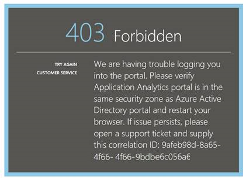

<properties 
    pageTitle="Problembehandlung bei Analytics - die leistungsfähige Suchfunktion der Anwendung Einsichten | Microsoft Azure" 
    description="Probleme mit der Anwendung Einsichten Analytics? Beginnen Sie hier. " 
    services="application-insights" 
    documentationCenter=""
    authors="alancameronwills" 
    manager="douge"/>

<tags 
    ms.service="application-insights" 
    ms.workload="tbd" 
    ms.tgt_pltfrm="ibiza" 
    ms.devlang="na" 
    ms.topic="article" 
    ms.date="07/11/2016" 
    ms.author="awills"/>

# Behandeln von Problemen mit Analytics in Anwendung Einsichten

Probleme mit der [Anwendung Einsichten Analytics](app-insights-analytics.md)? Beginnen Sie hier. Analytics ist die leistungsfähige Suchfunktion des Visual Studio-Anwendung Einsichten.

## Grenzwerte

* Gegenwärtig sind Abfrageergebnisse auf über eine Woche vergangenen Datenseite nur eingeschränkt.
* Wir testen auf Browser: neuesten Editionen von Chrome, Kante und Internet Explorer.

## Bekannte inkompatiblen Browser extensions

* Ghostery

Deaktivieren Sie die Erweiterung oder verwenden Sie einen anderen Browser.

##"Unerwarteter Fehler"

Interner Fehler beim Portal Runtime – Ausnahmefehler.

* Bereinigen Sie den Cache des Browsers ein. 

## 403... versuchen Sie es bitte erneut laden

Eine Authentifizierung verwandten Fehler (während der Authentifizierung oder während Access token Generation). Im Portal möglicherweise keine Möglichkeit, ohne die Browsereinstellungen ändern wiederherzustellen.

* Vergewissern Sie sich im Browser [Cookies von Drittanbietern aktiviert sind](#cookies) . 

## 403... Sicherheitszone überprüfen

Eine Authentifizierung verwandten Fehler (während der Authentifizierung oder während Access token Generation). Im Portal möglicherweise keine Möglichkeit, ohne die Browsereinstellungen ändern wiederherzustellen.

1. Vergewissern Sie sich im Browser [Cookies von Drittanbietern aktiviert sind](#cookies) . 

2. Haben Sie zum Öffnen des Portals Analytics Favoriten, Textmarke oder gespeicherte Verknüpfung verwendet? Sind Sie angemeldet mit anderen Anmeldeinformationen als Sie verwendet, wenn Sie den Link gespeichert?

2. Versuchen Sie es mit einer privaten/Incognito Browserfenster (nach dem schließen alle solche Fenster). Sie müssen Ihre Anmeldeinformationen ein. 

2. Öffnen einer anderen (normalen) Browserfenster, und wechseln Sie zur [Azure](https://portal.azure.com). Melden Sie sich ab. Öffnen Sie Ihre Link und melden Sie sich mit den richtigen Anmeldeinformationen.

2. Rand und Internet Explorer-Benutzer können auch dieser Fehler zurückgegeben, wenn vertrauenswürdigen Zone Einstellungen nicht unterstützt werden.

    Überprüfen Sie, ob sowohl [Analytics-Portal](https://analytics.applicationinsights.io) und [Azure-Active Directory-Portal](https://portal.azure.com) in der gleichen Sicherheitszone:

 * Öffnen Sie in Internet Explorer **Internetoptionen**"," **Sicherheit**"," **Vertrauenswürdige Sites**"," **Websites**:

    

    Klicken Sie in der Liste Websites ist eine der folgenden URLs enthalten sind, stellen Sie sicher, dass die anderen auch enthalten sind:

    https://Analytics.applicationinsights.IO 
   https://Login.microsoftonline.com 
   https://Login.Windows.NET

## 404... Ressource wurde nicht gefunden

Ressource der Anwendung wurde von Anwendung Einsichten gelöscht und nicht mehr verfügbar ist. Dies kann geschehen, wenn Sie die URL zu der Seite Analytics gespeichert.

## 403... Keine Autorisierung

Sie müssen nicht über die Berechtigung zum dieser Anwendung in Analytics zu öffnen.

* Haben Sie den Link aus einer anderen Person erhalten? Bitten Sie sie, um sicherzustellen, dass Sie in der [Leser oder Mitwirkenden für diese Ressourcengruppe](app-insights-resources-roles-access-control.md)befinden.
* Speichern Sie die Verknüpfung mit anderen Anmeldeinformationen? Öffnen Sie das [Azure-Portal](https://portal.azure.com), melden Sie sich ab, und probieren Sie diesen Link erneut, die richtigen Anmeldeinformationen bereitstellen.

## 403... HTML5-Speicher

Unser Portal verwendet HTML5 LocalStorage und SessionStorage.

* Chrome: Einstellungen, Datenschutz, inhaltseinstellungen.
* InternetExplorer: Internetoptionen, Registerkarte Erweitert Sicherheit, DOM-Speicher aktivieren

## 404... Abonnement wurde nicht gefunden

Die URL ist ungültig. 

* Öffnen Sie die app-Ressource [Anwendung Einsichten](https://portal.azure.com)-Portal an. Verwenden Sie dann die Schaltfläche Analytics ein.

## 404... Seite nicht vorhanden.

Die URL ist ungültig.

* Öffnen Sie die app-Ressource [Anwendung Einsichten](https://portal.azure.com)-Portal an. Verwenden Sie dann die Schaltfläche Analytics ein.

## Aktivieren Sie Cookies von Drittanbietern

  Informationen Sie [zum Deaktivieren von Cookies von Drittanbietern](http://www.digitalcitizen.life/how-disable-third-party-cookies-all-major-browsers), aber beachten Sie, dass wir **Aktivieren** zu machen.

## Wenn alle sonst schlägt fehl    

[Wenden Sie sich an uns](app-insights-get-dev-support.md).
 
[AZURE.INCLUDE [app-insights-analytics-footer](../../includes/app-insights-analytics-footer.md)]

