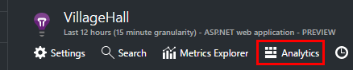
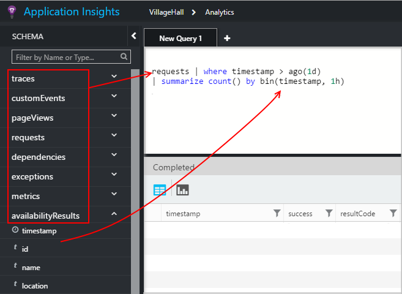
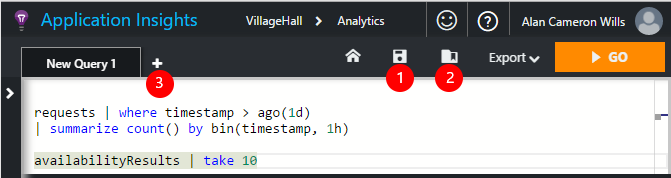
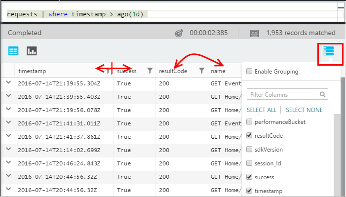
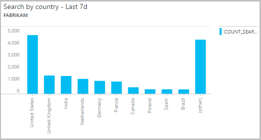

<properties 
    pageTitle="Mit Analytics - die leistungsfähige Suchfunktion der Anwendung Einsichten | Microsoft Azure" 
    description="Verwenden der Analytics, die leistungsfähige diagnostic Suchfunktion der Anwendung Einsichten an. " 
    services="application-insights" 
    documentationCenter=""
    authors="danhadari" 
    manager="douge"/>

<tags 
    ms.service="application-insights" 
    ms.workload="tbd" 
    ms.tgt_pltfrm="ibiza" 
    ms.devlang="na" 
    ms.topic="article" 
    ms.date="10/21/2016" 
    ms.author="awills"/>

# Verwenden in der Anwendung Einsichten Analytics

[Analytics](app-insights-analytics.md) ist die leistungsfähige Suchfunktion der [Anwendung Einsichten](app-insights-overview.md). Diese Seiten werden die Analytics-Abfragesprache beschrieben.

* **[Die Einführungsvideo anzeigen](https://applicationanalytics-media.azureedge.net/home_page_video.mp4)**.
* **[Test Drive Analytics auf unsere simulierten Daten](https://analytics.applicationinsights.io/demo)** , wenn Ihre app Anwendung Einsichten noch Senden von Daten nicht zur Verfügung.

## Analytics öffnen

Klicken Sie auf Start Ressource Ihrer app in der Anwendung Einsichten Analytics.

Das Inline-Lernprogramm bietet Ihnen einige anregungen, was Sie tun können.

Es gibt eine [umfangreichere Tour hier](app-insights-analytics-tour.md)ein.

## Abfrage der werden

### Schreiben einer Abfrage

Beginnen Sie mit den Namen der Tabellen auf der linken Seite (oder die [Bereich](app-insights-analytics-reference.md#range-operator) oder [Union](app-insights-analytics-reference.md#union-operator) -Operatoren) aufgeführt. Verwenden Sie `|` zum Erstellen einer Verkaufspipeline [Operatoren](app-insights-analytics-reference.md#queries-and-operators). IntelliSense fordert Sie mit der Operatoren und einige der Ausdruckselemente, die Sie verwenden können.

Finden Sie unter der [Analytics Sprache Übersicht](app-insights-analytics-tour.md) und die [Sprache verweisen](app-insights-analytics-reference.md).

### Ausführen einer Abfrage

1. Sie können einzelne Zeilenumbrüche in einer Abfrage verwenden.
2. Setzen Sie den Cursor innerhalb oder am Ende der Abfrage, die Sie ausführen möchten.
3. Klicken Sie auf OK, um die Abfrage auszuführen.
4. Setzen Sie nicht leere Zeilen in einer Abfrage. Sie können mehrere gesonderte Abfragen in einer Abfrage Registerkarte belassen, indem Sie diese durch leere Zeilen trennen. Nur diejenige mit dem Cursor ausgeführt wird.

### Speichern einer Abfrage

1. Speichern Sie die aktuelle Abfragedatei ein.
2. Öffnen Sie eine gespeicherte Abfrage-Datei ein.
3. Erstellen einer neuen Abfragedatei an.

## Die Details finden Sie unter

Erweitern Sie in der Ergebnisse auf die vollständige Liste der Eigenschaften finden Sie unter jeder Zeile aus. Sie können weiteren Erweitern Sie jede Eigenschaft, die einen strukturierten Wert - beträgt beispielsweise, benutzerdefinierte Maße oder den Stapel in eine Ausnahme auflisten.

 

## Ordnen Sie die Ergebnisse

Sie können sortieren, filtern, Paginieren und Gruppieren der Ergebnisse aus der Abfrage zurückgegeben.

> [AZURE.NOTE] Sortieren, gruppieren und Filtern im Browser auszuführen nicht erneut die Abfrage. Diese Umordnen nur die Ergebnisse, die von der letzten Abfrage zurückgegeben wurden. 
> 
> Um diese Aufgaben auf dem Server ausführen, bevor die Ergebnisse zurückgegeben werden, Schreiben Sie eine Abfrage mit [Sortieren](app-insights-analytics-reference.md#sort-operator), [zusammenfassen](app-insights-analytics-reference.md#summarize-operator) und [wo](app-insights-analytics-reference.md#where-operator) Operatoren aus.

Wählen Sie die Spalten aus, die Sie angezeigt wird, ziehen Sie Spaltenüberschriften, um sie anders anzuordnen und Größe von Spalten ändern, indem Sie ihren Rahmen ziehen möchten.

### Sortieren und Filtern von Elementen

Sortieren Sie die Ergebnisse durch Klicken auf den Kopf einer Spalte. Klicken Sie erneut, um die umgekehrte Richtung zu sortieren, und klicken Sie auf eine dritte Zeit zum Wiederherstellen der ursprünglichen Anordnung von der Abfrage zurückgegeben werden.

Verwenden Sie das Filtersymbol zum Eingrenzen der Suche.

### Gruppieren von Elementen

Verwenden Sie zum Sortieren nach mehreren Spalten gruppieren. Aktivieren Sie es zuerst, und ziehen Sie die Spaltenüberschriften in den Abstand oberhalb der Tabelle.

### Fehlende einige Ergebnisse?

Es gibt maximal etwa 10 k Zeilen aus dem Portal zurückgegebenen Ergebnisse aus. Eine Warnung wird, wenn Sie das Größenlimit wechseln. In diesem Fall wird nicht sortieren die Ergebnisse in der Tabelle immer Sie der eigentlichen Ergebnisse in vor- oder Nachnamen anzeigen. 

Es empfiehlt, drücken die Beschränkung vermeiden. Verwenden Sie die Operatoren wie:

* [Wo Zeitstempel > ago(3d)](app-insights-analytics-reference.md#where-operator)
* [Top 100 nach dem Zeitstempel](app-insights-analytics-reference.md#top-operator) 
* [Optimieren von 100](app-insights-analytics-reference.md#take-operator)
* [zusammenfassen](app-insights-analytics-reference.md#summarize-operator) 

## Diagramme

Wählen Sie den Typ des Diagramms, die Sie möchten:

Wenn Sie mehrere Spalten mit den richtigen Typen verfügen, können Sie das x und y Achsen und Dimensionen, um die Ergebnisse nach dem Aufteilen einer Spalte auswählen.

Standardmäßig Ergebnisse werden zuerst als Tabelle angezeigt, und Sie das Diagramm manuell auswählen. Sie können jedoch über die [Richtlinie Rendern](app-insights-analytics-reference.md#render-directive) am Ende einer Abfrage zu einem Diagramm auszuwählen.

## Heften zum Dashboard an

Sie können ein Diagramm anheften, oder auf einen der [freigegebenen Dashboards](app-insights-dashboards.md) - nur Tabelle klicken Sie auf die Pin. (Sie möglicherweise auf [Ihre app Paket Preise des Upgrade](app-insights-pricing.md) müssen dieses Feature aktivieren.) 

Dies bedeutet, dass, wenn Sie ein Dashboard, um die Leistung oder die Verwendung der Ihre Webdienste überwachen aufzustellen, ganz komplexe Analyse entlang der anderen Metrik enthalten sein können. 

Wenn sie vier oder weniger Spalten enthält, können Sie eine Tabelle zum Dashboard, anheften. Es werden nur die oberen sieben Zeilen angezeigt.

#### Dashboard aktualisieren

Das Diagramm, dem Dashboard angehefteten wird durch erneutes Ausführen der Abfrage etwa jede halbe Stunde automatisch aktualisiert.

#### Automatische vereinfachte Verwendung von

In einigen Fällen sind bestimmte vereinfachte Verwendung von zu einem Diagramm angewendet, wenn Sie es zu einem Dashboard anheften.

Wenn Pin ein Diagramm, das viele diskrete Papierkörben (in der Regel ein Balkendiagramm), die weniger eingetragenen Papierkörben zeigt werden automatisch in ein einzelnes gruppiert bin "andere". Beispiel: Diese Abfrage:

    requests | summarize count_search = count() by client_CountryOrRegion

in Analytics sieht folgendermaßen aus:

aber wenn Sie einem Dashboard anheften, es sieht wie folgt aus:

## Exportieren nach Excel

Nachdem Sie eine Abfrage ausgeführt haben, können Sie eine CSV-Datei herunterladen. Klicken Sie auf **nach Excel exportieren**.

## Exportieren in Power BI

Setzen Sie den Cursor in einer Abfrage, und wählen Sie die **zu Power BI exportieren**.

Führen Sie die Abfrage in Power BI. Sie können auf einen Zeitplan aktualisieren festlegen.

Mit Power BI können Sie Dashboards erstellen, die Daten aus einer Vielzahl von Datenquellen kombinieren.

[Weitere Informationen zum Exportieren auf Power BI](app-insights-export-power-bi.md)

[AZURE.INCLUDE [app-insights-analytics-footer](../../includes/app-insights-analytics-footer.md)]

